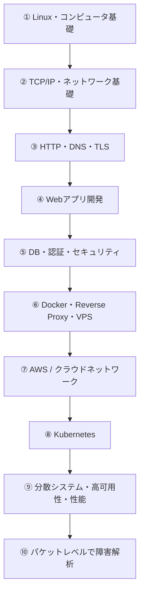
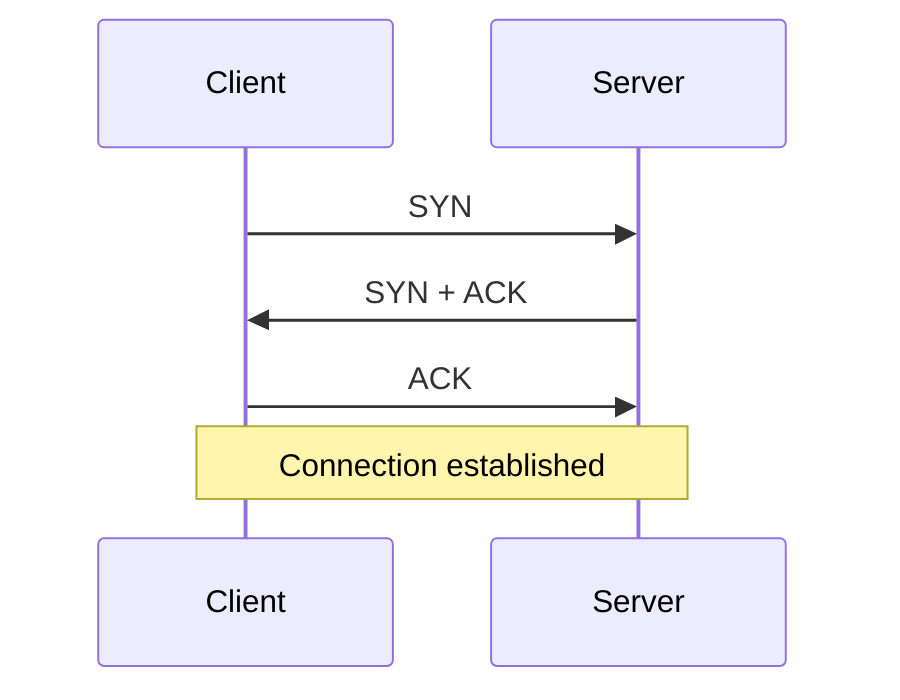
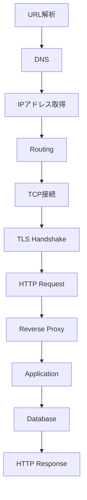
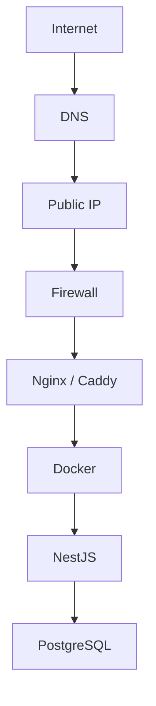
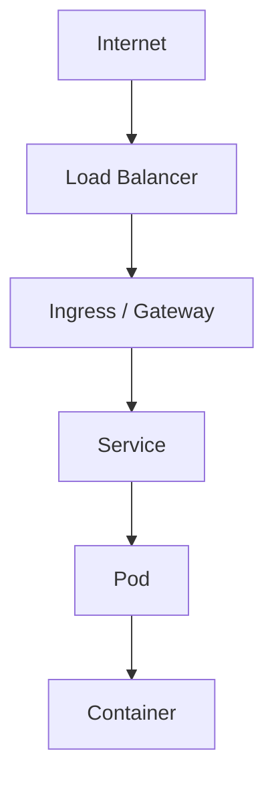
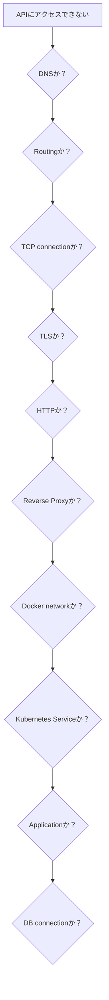

# Webアプリケーション × ネットワーク 学習ロードマップ

Webアプリ開発とネットワークの両方を、かなり深いところまで理解するための学習ガイド。
「Web開発」と「ネットワーク」を別々に勉強するのではなく、**ブラウザからサーバーまでを1本の通信として学ぶ**ことを軸にする。

---

## 目次

1. [概要](#概要)
2. [全体ロードマップ](#全体ロードマップ)
3. [Phase 1：Linux・コンピュータ基礎](#phase-1linuxコンピュータ基礎)
4. [Phase 2：TCP/IPを徹底的に理解する](#phase-2tcpipを徹底的に理解する)
5. [Phase 3：DNS → TCP → TLS → HTTP](#phase-3dns--tcp--tls--http)
6. [Phase 4：Webアプリケーションを深く理解する](#phase-4webアプリケーションを深く理解する)
7. [Phase 5：DB・認証・Web Security](#phase-5db認証web-security)
8. [Phase 6：DockerとLinux Network](#phase-6dockerとlinux-network)
9. [Phase 7：Reverse Proxy → VPS → Internet](#phase-7reverse-proxy--vps--internet)
10. [Phase 8：AWSネットワーク](#phase-8awsネットワーク)
11. [Phase 9：Kubernetes](#phase-9kubernetes)
12. [Phase 10：上級ネットワーク・分散システム](#phase-10上級ネットワーク分散システム)
13. [「極める」なら最重要なのはこの能力](#極めるなら最重要なのはこの能力)
14. [この学習者向けに絞るなら](#この学習者向けに絞るなら)
15. [関連ドキュメント](#関連ドキュメント)
16. [参考情報](#参考情報)

---

## 概要

### このロードマップの考え方

Webアプリ開発とネットワークを両方深く理解したいなら、「Web開発」と「ネットワーク」を別々に勉強するより、**ブラウザからサーバーまで1本の通信として学ぶ**のがおすすめ。

roadmap.sh の Backend / Network Engineer / DevOps / Computer Science を土台に、IETF・MDN・Docker・Kubernetes・AWS・OWASP の一次資料と照合して構成している。
roadmap.sh の Backend Roadmap 自体も、次の流れになっている。

```text
Internet → HTTP → DNS → API → DB → 認証 → Security → Container → Architecture → Scaling
```

### なぜ「1本の通信」として学ぶのか

- Web開発側の知識（HTTP、API、認証）とネットワーク側の知識（TCP/IP、DNS、TLS）は、実際の通信では切り離せないため
- 障害が起きたとき、「どのレイヤーで何が起きているか」を切り分けるには、全レイヤーのつながりを理解している必要があるため
- Docker / Kubernetes / AWS も、結局は同じ通信の途中経路の設定に過ぎず、土台があれば「設定項目の暗記」にならないため

---

## 全体ロードマップ



元のテキスト図は以下。

```text
① Linux・コンピュータ基礎
        ↓
② TCP/IP・ネットワーク基礎
        ↓
③ HTTP・DNS・TLS
        ↓
④ Webアプリ開発
        ↓
⑤ DB・認証・セキュリティ
        ↓
⑥ Docker・Reverse Proxy・VPS
        ↓
⑦ AWS / クラウドネットワーク
        ↓
⑧ Kubernetes
        ↓
⑨ 分散システム・高可用性・性能
        ↓
⑩ パケットレベルで障害解析
```

> 本文の詳細は10個のPhaseに分かれている。上図の⑥は本文ではPhase 6（Docker）とPhase 7（Reverse Proxy・VPS）に、⑦はPhase 8（AWS）に、⑧はPhase 9（Kubernetes）に、⑨⑩はPhase 10（上級ネットワーク・分散システム）に対応する。

### ポイント

**②③を終えてからDocker/Kubernetesに進むこと。**

- **なぜ？** Kubernetesを先に覚えると、Service・Ingress・CNI・ClusterIPなどを「設定項目」として暗記することになりやすいため。

---

## Phase 1：Linux・コンピュータ基礎

目安は1〜2か月。

### 学ぶこと

| 学ぶこと | 到達ライン |
|---|---|
| Linux | ディレクトリ、権限、ユーザー、プロセス |
| Process / Thread | Webサーバーが何として動いているか説明できる |
| stdin/stdout/stderr | ログやパイプを理解する |
| 環境変数 | Docker/Webアプリとの関係を理解 |
| Port | 「3000番で待ち受ける」の意味を説明できる |
| Socket | IP + Port とプロセスの関係を理解 |
| Bash | 基本的な操作・スクリプト |
| systemd | サーバープロセスを管理できる |

### 特に重要な関係

```text
Application
    ↓
Process
    ↓
Socket
    ↓
TCP
    ↓
IP
    ↓
Network Interface
```

- **なぜ？** アプリケーションが「どのプロセスとして、どのポートで待ち受けているか」を理解していないと、後のネットワーク・Docker・Kubernetesの話がすべて抽象的になるため。

### ハンズオン

```bash
ps
ss -lntp
lsof -i
ip addr
ip route
curl
```

などを使い、自分のNestJSが「どのプロセスとして、どのポートをLISTENしているのか」を確認する。

---

## Phase 2：TCP/IPを徹底的に理解する

ここがネットワーク学習の中心。目安は2〜3か月。

roadmap.sh の Computer Science Roadmap でも Networking として OSI Model、TCP/IP、DNS、HTTP、TLS、Sockets が主要項目になっている。

### 学ぶ順番

| 順番 | テーマ | 特に理解すること |
|---:|---|---|
| 1 | OSI / TCP-IP | 各レイヤーの責務 |
| 2 | Ethernet | MACアドレス、フレーム |
| 3 | ARP / Neighbor Discovery | IPからMACをどう探すか |
| 4 | IPv4 | IPアドレス、CIDR |
| 5 | Subnet | `/24` などの意味 |
| 6 | Routing | ルーティングテーブル |
| 7 | NAT | Private/Public IP |
| 8 | TCP | Connection、Sequence、ACK |
| 9 | UDP | TCPとの違い |
| 10 | Socket | アプリケーションとの接点 |

### TCPの理解

現在の標準仕様は **RFC 9293**。TCPはInternet Protocol Stackにおけるトランスポート層の主要プロトコルとして仕様化されている。



元のテキスト図は以下。

```text
Client
   │
   │ SYN
   ↓
Server
   │
   │ SYN + ACK
   ↓
Client
   │
   │ ACK
   ↓
Connection established
```

3ウェイハンドシェイクだけで終わらせず、次の項目までは理解する。

```text
Sequence Number
ACK
Window
Retransmission
RTT
Flow Control
Congestion Control
FIN / RST
TIME_WAIT
```

- **なぜ？** 遅延、接続切れ、ポート枯渇などの問題は、ハンドシェイクだけでなく再送・ウィンドウ・TIME_WAITなどの挙動を知っていないと原因を追えないため。

### ハンズオン

ここではWiresharkかtcpdumpをかなり使う。

```bash
tcpdump
ping
traceroute
nc
dig
curl -v
```

たとえば、次のようにTCPサーバーを作り、

```bash
nc -l 3001
```

別の端末から通信する。

```bash
nc localhost 3001
```

これをWiresharkで見る。この経験が後のHTTP/Docker/Kubernetes理解にかなり効く。

---

## Phase 3：DNS → TCP → TLS → HTTP

Webエンジニアとしては、ここが最重要。

MDNでもHTTPはアプリケーション層のプロトコルとして説明されており、HTTP通信の下にTCP/IPなどが存在する。

### ゴール：URL入力から表示までを説明できる

ブラウザに次のURLを入力した瞬間から、

```text
https://example.com/users
```

次の流れまで説明できる状態を目指す。



元のテキスト図は以下。

```text
URL解析
 ↓
DNS
 ↓
IPアドレス取得
 ↓
Routing
 ↓
TCP接続
 ↓
TLS Handshake
 ↓
HTTP Request
 ↓
Reverse Proxy
 ↓
Application
 ↓
Database
 ↓
HTTP Response
```

### DNS

理解するもの。

```text
Stub Resolver
Recursive Resolver
Root DNS
TLD DNS
Authoritative DNS

A
AAAA
CNAME
NS
MX
TXT
TTL
DNS Cache
```

DNSの基本モデル自体は **RFC 1034/1035** が基礎になっている。DNSは階層型の名前空間、Resource Record、Name Serverなどから構成される。

### HTTP

ここはかなり深くやる。

```text
HTTP Method
Status Code
Header
Body
URI
Content-Type
Accept
Authorization
Cookie
Cache-Control
ETag
CORS
Content Negotiation
Connection
Keep-Alive
```

そして、次の違いも理解する。

```text
HTTP/1.1
HTTP/2
HTTP/3
```

HTTPの意味論については **RFC 9110** が現在の基礎仕様で、HTTPをステートレスなアプリケーションレベルのrequest/responseプロトコルとして定義している。

MDNも非常に良い教材。 [MDN HTTP Guide](https://developer.mozilla.org/en-US/docs/Web/HTTP/Guides/Overview)

### TLS / HTTPS

以前学習していた内容から、さらに一段掘る。

```text
Certificate
CA
Root CA
Public Key
Private Key
Digital Signature
Key Exchange
TLS Handshake
SNI
ALPN
Session Resumption
TLS 1.3
```

TLS 1.3は **RFC 8446** で標準化されており、盗聴・改ざん・偽装を防ぐためのプロトコルとして定義されている。

---

## Phase 4：Webアプリケーションを深く理解する

ここからWeb開発。

新しい言語を増やす必要はなく、現在使っている次の技術をそのまま使うのが効率的。

```text
TypeScript
Next.js
NestJS
PostgreSQL
```

ただしフレームワークの使い方ではなく、次の各境界を説明できることを目標にする。

```text
Browser
 ↓
Next.js
 ↓ HTTP
NestJS
 ↓
Application Service
 ↓
Repository
 ↓
PostgreSQL
```

- **なぜ？** フレームワークの使い方だけでは、障害時にどの境界（ブラウザ／フロント／API／DB）で問題が起きているか切り分けられないため。

### 理解するもの

| 領域 | 内容 |
|---|---|
| Browser | DOM、Fetch、Cookie、Storage |
| JavaScript | Event Loop、Promise、async/await |
| Node.js | Event Loop、I/O |
| API | REST、HTTP semantics |
| API設計 | Resource、URI、status code |
| OpenAPI | API仕様 |
| Validation | 入力検証 |
| Error Handling | HTTP Error |
| Logging | 構造化ログ |
| Testing | Unit / Integration / E2E |

### リクエストの追跡

特に、次のリクエストを受けたとき、

```text
POST /orders
```

次のように追跡できるようになると、かなり強い。

```text
NIC
↓
Kernel
↓
Socket
↓
Node.js
↓
NestJS
↓
Controller
↓
UseCase
↓
Repository
↓
PostgreSQL
```

---

## Phase 5：DB・認証・Web Security

目安は2〜3か月。

### DB

すでに学習している正規化やB-treeをさらに広げ、次の項目まで進める。

```text
Transaction
ACID
Isolation Level
Lock
MVCC
Index
Query Planner
Execution Plan
Connection Pool
Deadlock
Replication
```

### 認証

次の項目まで理解する。

```text
Session
Cookie
JWT
OAuth 2.0
OpenID Connect
Authorization
RBAC
CSRF
CORS
```

### Security

SecurityはOWASP Top 10を基準にするのがよい。現在の最新版は **OWASP Top 10:2025** で、Broken Access Control、Security Misconfiguration、Software Supply Chain Failures、Cryptographic Failures、Injectionなどが挙げられている。

---

## Phase 6：DockerとLinux Network

ここからネットワーク知識とWeb開発知識が融合する。

Docker公式ドキュメントでは、コンテナからはnetwork interface、IP address、gateway、routing table、DNSなどが見えるという形でContainer Networkingが説明されている。

### 理解する対象

```text
Container
Network Namespace
veth
Bridge
Docker bridge
Port Mapping
NAT
iptables / nftables
Docker DNS
```

### ポートマッピングの理解

特に、次の設定を見たら、

```yaml
ports:
  - "3001:3001"
```

次の流れまで説明できるようにする。

```text
ブラウザ
 ↓
Host :3001
 ↓
NAT / Port forwarding
 ↓
Docker network
 ↓
Container :3001
 ↓
NestJS
```

- **なぜ？** `ports` を「おまじない」として書くだけだと、コンテナに繋がらないときにホスト側・NAT・Dockerネットワーク・コンテナ内のどこが原因か切り分けられないため。

### ハンズオン

今使っている次の構成をDocker Compose化する。

```text
Next.js
NestJS
PostgreSQL
```

そして、次のネットワークを自分で設計する。

```text
web network
backend network
db network
```

---

## Phase 7：Reverse Proxy → VPS → Internet

ここで初めて「実際のWebサーバー」を作る。

次の構成をVPS上で作る。



元のテキスト図は以下。

```text
Internet
   ↓
DNS
   ↓
Public IP
   ↓
Firewall
   ↓
Nginx / Caddy
   ↓
Docker
   ↓
NestJS
   ↓
PostgreSQL
```

### 学ぶもの

```text
Nginx
Reverse Proxy
TLS termination
Firewall
SSH
Linux permissions
systemd
DNS
Domain
Certificate
Port 80 / 443
```

これはネットワーク学習としてかなりおすすめ。

- **なぜ？** ローカル環境では見えない「公開サーバー特有の問題」（DNS、証明書、ファイアウォール、80/443番ポート）を実際に体験できるため。

---

## Phase 8：AWSネットワーク

VPSの次にAWSへ行く。

### 最初の構成

最初からEKSではなく、次から始める。

```text
VPC
 ↓
Subnet
 ↓
Route Table
 ↓
Internet Gateway
 ↓
Security Group
 ↓
EC2
```

AWS公式でもVPCはAWSアカウント専用の論理的に分離された仮想ネットワークで、Subnet・Gateway・Security Groupなどを組み合わせて構成すると説明されている。

### さらに進む項目

```text
Public Subnet
Private Subnet
CIDR
Route Table
Internet Gateway
NAT
Security Group
Network ACL
Load Balancer
Route53
```

### Public Subnetの定義

「Public Subnetとは何か」についても曖昧にしない。

AWSでは、**Internet Gatewayへの経路を持つRoute Tableに関連付けられたSubnet**をPublic Subnetと説明している。

ここまで来るとAWSのネットワーク図をかなり読めるようになる。

- **なぜ？** 最初からEKSに進むと、VPC・Subnet・Route Tableの理解が曖昧なままKubernetesのネットワークを扱うことになり、原因の切り分けができなくなるため。

---

## Phase 9：Kubernetes

**ここまで来てからKubernetes。** この順序なら、かなり理解しやすくなる。

### 理解する構造

```text
Node
 ↓
Pod
 ↓
Container
```

だけではなく、次の通信経路を理解する。



元のテキスト図は以下。

```text
Internet
 ↓
Load Balancer
 ↓
Ingress / Gateway
 ↓
Service
 ↓
Pod
 ↓
Container
```

Kubernetes公式でも、各Podには独自のIPがあり、Pod間通信・Pod→Service・外部→ServiceなどがKubernetes Networkingの主要問題として整理されている。

### 学習順

```text
Node
Pod
Deployment
ReplicaSet
Service
ClusterIP
NodePort
LoadBalancer
DNS
Ingress / Gateway
ConfigMap
Secret
Volume
Job
NetworkPolicy
CNI
```

### 特に重要なポイント

#### Service

特に重要なのがService。Podは作り直されればIPが変わるため、Serviceが安定したEndpointを提供する。

- **なぜ？** PodのIPは固定ではないため、PodのIPを直接指定して通信する設計はすぐ破綻する。

#### Pod内のネットワーク

Pod内の複数コンテナはnetwork namespaceを共有し、同じIP・ポート空間を利用し、`localhost` で通信できる。これはKubernetes公式でも明確に説明されている。

Pod / Node / Service の理解が、ここですべてネットワーク知識とつながる。

---

## Phase 10：上級ネットワーク・分散システム

ここから「極める」の領域。

| 分野 | 学習内容 |
|---|---|
| TCP | congestion control、retransmission、window |
| DNS | resolver、cache、DNSSEC |
| HTTP | HTTP/2、HTTP/3、QUIC |
| Routing | routing table、longest prefix match |
| Network | VLAN、VXLAN |
| Routing Protocol | OSPF、BGP |
| Linux | network namespace、veth、bridge |
| Security | firewall、NetworkPolicy |
| Proxy | L4/L7 Proxy |
| Load Balancer | L4/L7 LB |
| Distributed Systems | CAP、consistency |
| Resilience | retry、timeout、circuit breaker |
| Performance | latency、throughput |
| Observability | Metrics、Logs、Tracing |
| Kubernetes | CNI、kube-proxy、CoreDNS |
| Linux advanced | eBPF |

Network Engineerとして深く行くなら、roadmap.shにも2026年版の専用ロードマップがある。

[roadmap.sh Network Engineer](https://roadmap.sh/network-engineer)

---

## 「極める」なら最重要なのはこの能力

知識量そのものより、次を最終目標にするとよい。

> **ブラウザからAPIまでの通信を、どのレイヤーで何が起きているか説明・観測・切り分けできること**

### 切り分けの例

「APIにアクセスできない」と言われたとき、次の順に切り分ける。



元のテキスト図は以下。

```text
DNSか？
↓
Routingか？
↓
TCP connectionか？
↓
TLSか？
↓
HTTPか？
↓
Reverse Proxyか？
↓
Docker networkか？
↓
Kubernetes Serviceか？
↓
Applicationか？
↓
DB connectionか？
```

### 使うコマンド

次のコマンドで実際に調査できるようにする。

```bash
dig
curl -v
ping
traceroute
nc
ss
tcpdump
openssl
docker inspect
kubectl get
kubectl describe
kubectl logs
```

このレベルになると、**Webエンジニアとしてもインフラ/SREとの会話でもかなり強い**。

---

## この学習者向けに絞るなら

これまでの学習状況を考えると、最初からHTML/CSSやJavaScript入門をやり直す必要はない。むしろ今後は、次を主軸にする。

```text
① Linux / Socket
      ↓
② IP / CIDR / Routing / NAT
      ↓
③ TCP / UDP
      ↓
④ DNS
      ↓
⑤ HTTP
      ↓
⑥ TLS
      ↓
⑦ Docker Networking
      ↓
⑧ VPS + Nginx
      ↓
⑨ AWS VPC
      ↓
⑩ Kubernetes Networking
```

その横で、**Next.js + NestJS + PostgreSQLのアプリを1つ育て続ける**のが一番効率がいい。

- **なぜ？** roadmap.shを最初から全部埋めるより、今の知識を活かしやすいため。roadmap.sh自身もBackend学習では「Internet」「Database」「API」「Authentication」「Security」「Containerization」「Architecture」などを連続した領域として扱っている。

### 次のステップ

このロードマップを「1年程度・週5〜7時間」の月別カリキュラムに落とし、各月に「学習内容・ハンズオン・完成条件」を設定するところまで作ると、実行しやすくなる。

---

## 関連ドキュメント

このリポジトリ内の関連ロードマップ・資料。

| 分野 | ドキュメント |
|---|---|
| HTTP | [HTTP ロードマップ](../../05-インフラ/networking/http/roadmap.md) |
| AWS | [AWS ロードマップ](../../05-インフラ/aws/roadmap.md) |
| API | [API開発 ロードマップ](../api-development/roadmap.md) |
| フロントエンド | [Next.js ロードマップ](../../02-フレームワーク/nextjs/roadmap.md) |
| DB | [DBインデックスとB-tree](../db/index-B_tree.md) |
| DevOps | [DevOps](../../06-DevOps/README.md) |

---

## 参考情報

- [roadmap.sh Backend Roadmap](https://roadmap.sh/backend)
- [roadmap.sh Computer Science Roadmap](https://roadmap.sh/computer-science)
- [roadmap.sh DevOps Roadmap](https://roadmap.sh/devops)
- [roadmap.sh Network Engineer](https://roadmap.sh/network-engineer)
- [MDN HTTP Guide](https://developer.mozilla.org/en-US/docs/Web/HTTP/Guides/Overview)
- [Kubernetes Networking公式ドキュメント](https://kubernetes.io/docs/concepts/services-networking/)
- [RFC 9293（TCP）](https://www.rfc-editor.org/rfc/rfc9293)
- [RFC 9110（HTTP Semantics）](https://www.rfc-editor.org/rfc/rfc9110)
- [RFC 8446（TLS 1.3）](https://www.rfc-editor.org/rfc/rfc8446)
- [RFC 1034（DNS: Concepts and Facilities）](https://www.rfc-editor.org/rfc/rfc1034)
- [RFC 1035（DNS: Implementation and Specification）](https://www.rfc-editor.org/rfc/rfc1035)
- [OWASP Top 10](https://owasp.org/www-project-top-ten/)（本文の「2025版」の記述は元情報のまま。最新版の内容は公式サイトで要確認）
- [Docker公式ドキュメント（Networking）](https://docs.docker.com/engine/network/)
- [AWS公式ドキュメント（Amazon VPC）](https://docs.aws.amazon.com/vpc/latest/userguide/what-is-amazon-vpc.html)
