# Webシステムにおける認証方式

## 目次

1. [概要](#1-概要)
2. [全体像](#2-全体像)
3. [主要方式の比較](#3-主要方式の比較)
4. [主要な認証方式](#4-主要な認証方式)
5. [OpenID Connect（OIDC）](#5-openid-connectoidc)
6. [Passkey / WebAuthn](#6-passkey--webauthn)
7. [TOTP](#7-totp)
8. [SMS OTP](#8-sms-otp)
9. [Push認証](#9-push認証)
10. [Magic Link / Email OTP](#10-magic-link--email-otp)
11. [SAML 2.0](#11-saml-20)
12. [クライアント証明書 / mTLS](#12-クライアント証明書--mtls)
13. [HTTP Basic認証](#13-http-basic認証)
14. [OAuth 2.0](#14-oauth-20)
15. [JWT](#15-jwt)
16. [Cookie Session](#16-cookie-session)
17. [Cookie SessionとToken認証](#17-cookie-sessionとtoken認証)
18. [新規Webシステムでの基本方針](#18-新規webシステムでの基本方針)
19. [学習優先順位](#19-学習優先順位)
20. [参考資料](#20-参考資料)

---

## 1. 概要

Webシステムの認証を理解する際は、以下を分けて考える必要がある。


| 区分      | 役割               | 主な技術                        |
| ------- | ---------------- | --------------------------- |
| 認証方式    | ユーザー本人であることを確認する | Password、Passkey、TOTP       |
| 認証プロトコル | システム間で認証情報を連携する  | OpenID Connect、SAML         |
| 認可      | リソースへのアクセスを許可する  | OAuth 2.0                   |
| セッション管理 | 認証後のログイン状態を維持する  | Cookie Session、Access Token |
| トークン形式  | 認証・認可情報を表現する     | JWT                         |


特に以下は認証方式そのものではない。

- OAuth 2.0：認可のためのフレームワーク
- JWT：トークンのデータ形式
- Cookie：ブラウザが情報を保存・送信する仕組み

---

## 2. 全体像

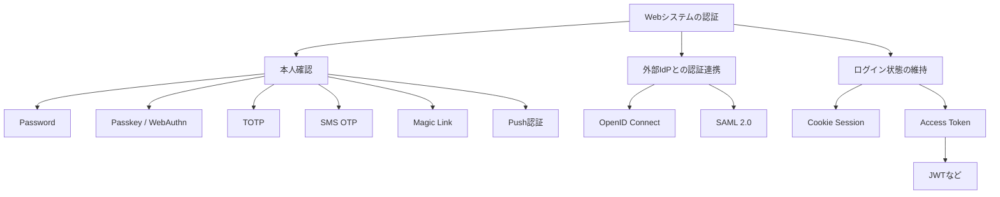

---

## 3. 主要方式の比較

| 方式                             | 現在の位置づけ          | 主な用途                   | 特徴                       |
| ------------------------------ | ---------------- | ---------------------- | ------------------------ |
| **ID + パスワード**                 | ★★★★★ 非常に一般的     | 一般Webサービス              | 最も基本的。ただし単独利用は弱い         |
| **OpenID Connect（OIDC）**       | ★★★★★ 現代の標準      | Web / SPA / モバイル / SSO | Google、Microsoft等のIdP認証  |
| **Passkey / WebAuthn / FIDO2** | ★★★★☆ 急速に普及      | 一般Web・高セキュリティ          | パスワードレス、フィッシング耐性         |
| **TOTP**                       | ★★★★☆ 非常に一般的     | MFA / 2FA              | Google Authenticator等    |
| **SMS OTP**                    | ★★★★☆ 現在も多い      | MFA・本人確認               | 利便性は高いがセキュリティは弱め         |
| **Push認証**                     | ★★★☆☆ 企業で多い      | MFA                    | Microsoft Authenticator等 |
| **Magic Link / Email OTP**     | ★★★☆☆ 比較的一般的     | Passwordlessログイン       | メールにリンク・コードを送る           |
| **SAML 2.0**                   | ★★★★☆ 企業では非常に一般的 | Enterprise SSO         | Microsoft Entra / Okta等  |
| **クライアント証明書 / mTLS**           | ★★☆☆☆ 限定用途       | 金融・社内・B2B・API          | 非常に強いが運用が重い              |
| **HTTP Basic認証**               | ★★☆☆☆ レガシー/簡易用途  | 管理画面・内部API等            | 単純だが一般ユーザー認証には不向き        |

> OAuth 2.0・JWT・Cookie Sessionは「1. 概要」の通り認証方式そのものではない（認可フレームワーク／トークン形式／セッション維持の仕組み）ため、この表には含めていない。


---

## 4. 主要な認証方式

### 4.1 ID + パスワード

最も基本的で、現在も広く利用されている認証方式。

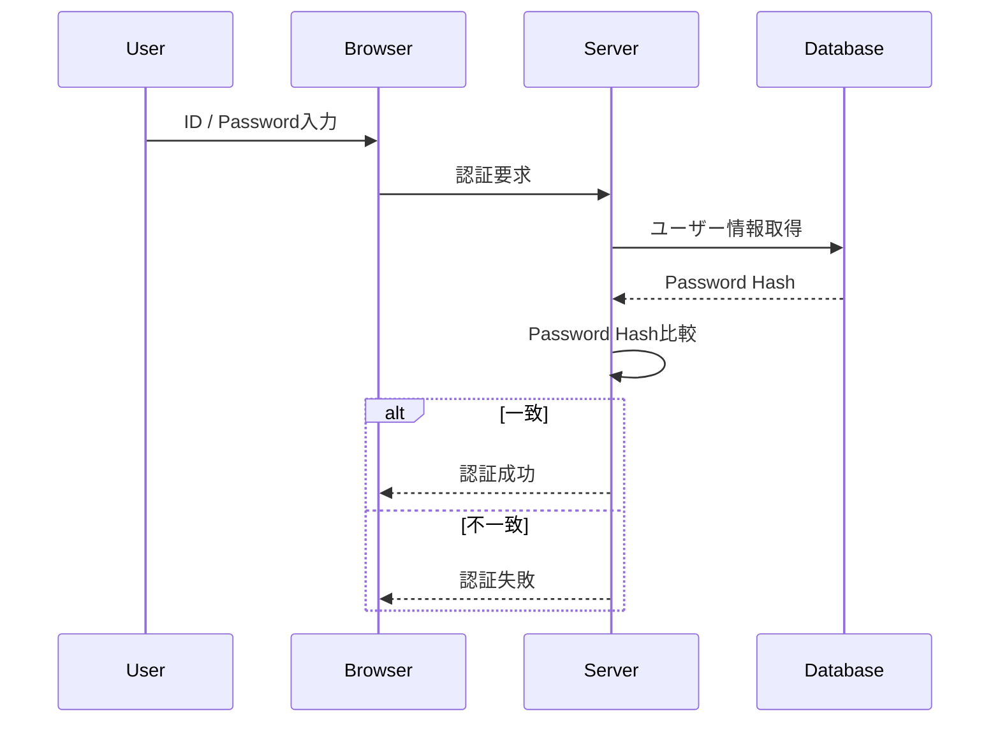

パスワードは平文でDBに保存せず、Argon2idやbcryptなどを利用してハッシュ化する。

現在はパスワード単独ではなく、MFAを組み合わせる構成も一般的。

```text
Password
+
TOTP / Passkey / Push

```

---

## 5. OpenID Connect（OIDC）

OpenID Connectは、OAuth 2.0をベースとした認証プロトコル。

Google、Microsoftなどの外部Identity Provider（IdP）を利用したログインで広く利用されている。

代表例：

- Googleでログイン
- Microsoftでログイン
- Amazon Cognito
- Auth0
- Keycloak
- Microsoft Entra ID

### 基本フロー

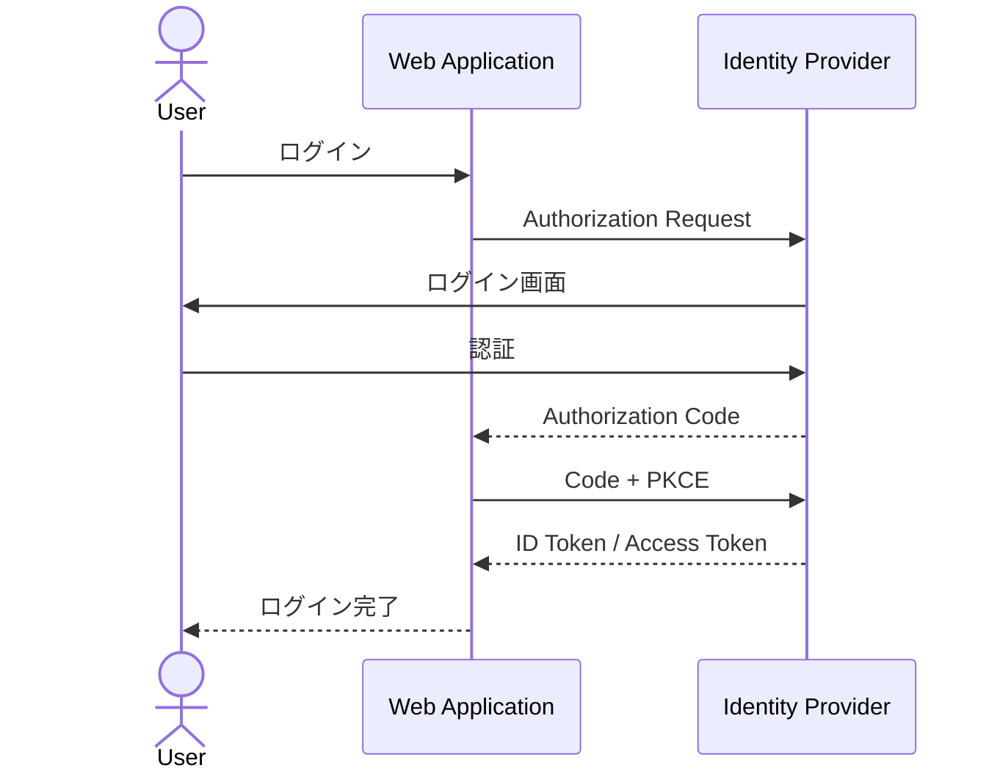

現在のWebアプリでは、基本的に以下の組み合わせを利用する。

```text
OpenID Connect
+
Authorization Code Flow
+
PKCE

```

Implicit Flowは新規システムでは基本的に利用しない。

---

## 6. Passkey / WebAuthn

Passkeyは公開鍵暗号方式を利用した認証方式。

パスワードをサーバーへ送信する必要がない。

代表的な認証手段：

- Face ID
- Touch ID
- Windows Hello
- Android端末認証
- セキュリティキー

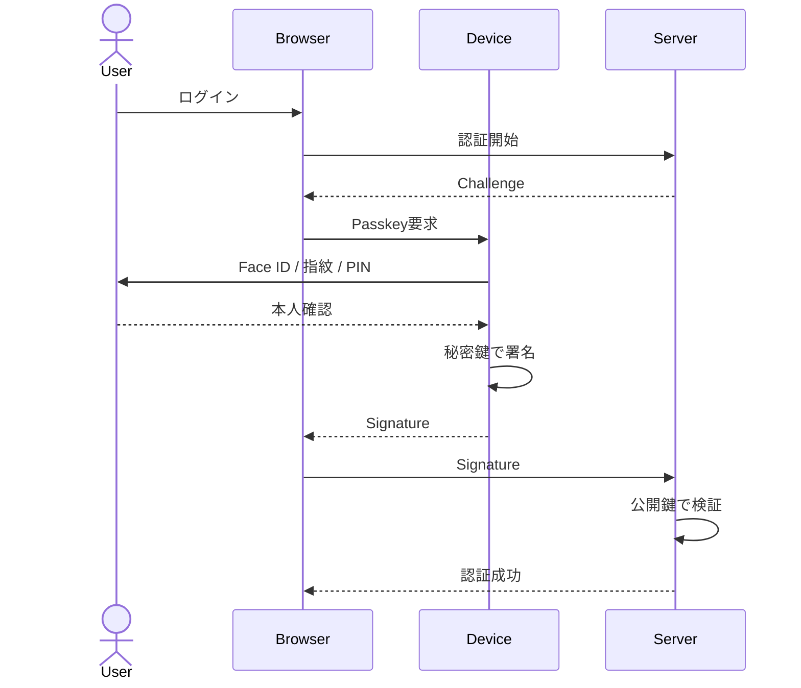

### 特徴

- パスワードを覚える必要がない
- サーバーに秘密鍵を保存しない
- フィッシング耐性が高い
- Credential Stuffingに強い

今後のWeb認証で特に重要な方式。

---

## 7. TOTP

Time-based One-Time Password。

一定時間ごとに生成されるワンタイムパスワードを使用する。

代表的なアプリ：

- Google Authenticator
- Microsoft Authenticator
- 1Password

一般的にはパスワードとのMFAとして利用する。

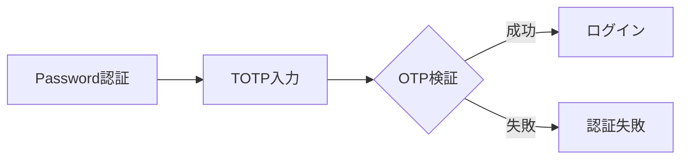

通常は6桁程度のコードを利用する。

Passkeyとは異なり、ユーザー自身がコードを入力するためフィッシング耐性はない。

---

## 8. SMS OTP

SMSでワンタイムパスワードを送信する方式。

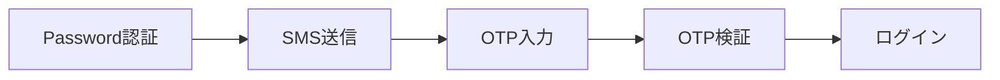

現在も広く利用されているが、以下のリスクがある。

- SIMスワップ
- SMS傍受
- フィッシング
- 電話番号乗っ取り

新規システムでは可能であればPasskeyやTOTPを優先する。

---

## 9. Push認証

スマートフォンの認証アプリへ通知を送り、ユーザーがログインを承認する方式。

代表例：

- Microsoft Authenticator
- Duo

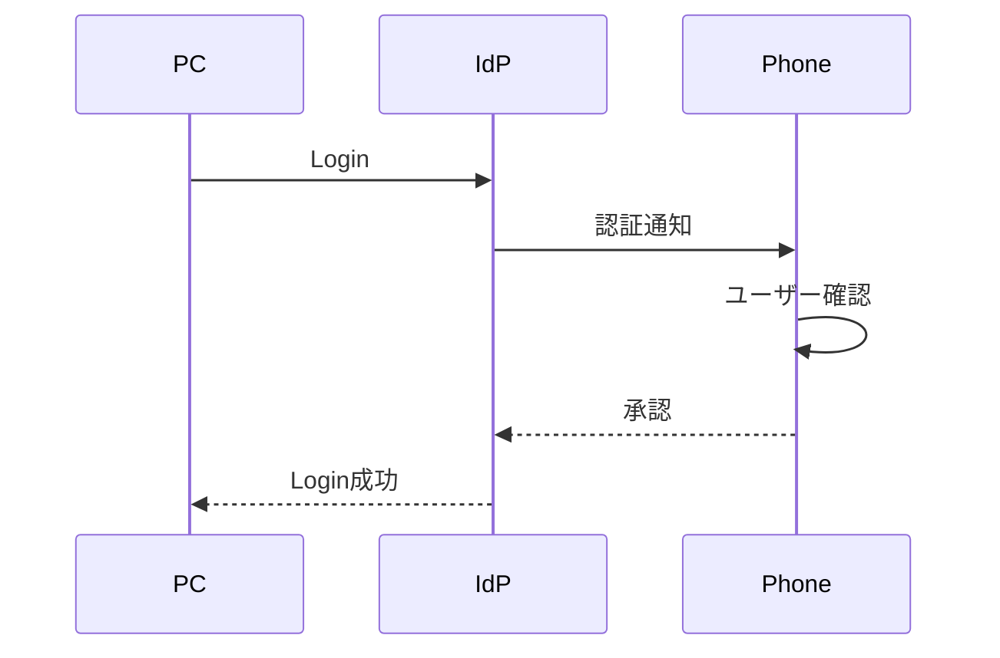

単純な承認方式ではMFA Fatigue攻撃のリスクがあるため、Number Matchingなどを組み合わせることが望ましい。

---

## 10. Magic Link / Email OTP

登録メールアドレスへログインリンクまたはワンタイムコードを送信する方式。

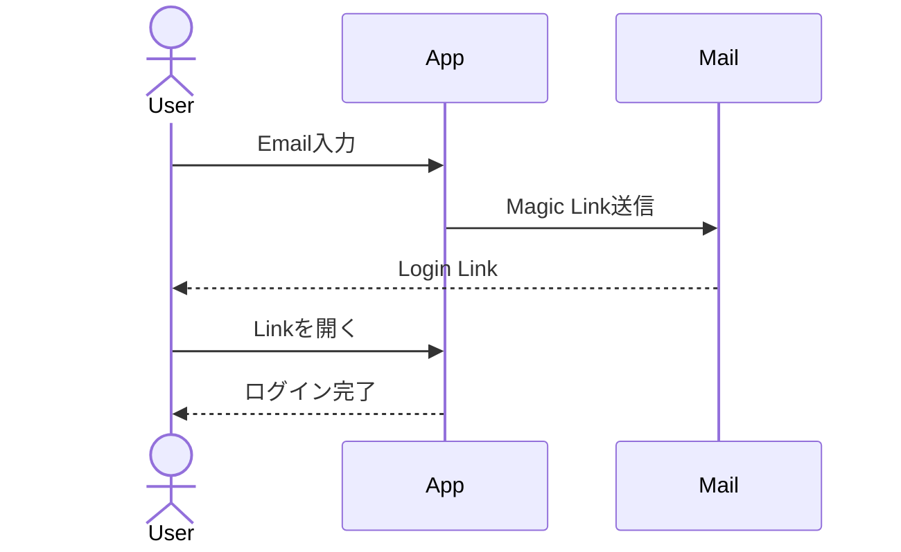

### メリット

- パスワード管理が不要
- 実装後のユーザー体験が比較的シンプル

### デメリット

メールアカウントが侵害された場合、Webサービスにもアクセスされる可能性がある。

高いセキュリティが必要なシステムでは第一候補にはしない。

---

## 11. SAML 2.0

企業向けSSOで現在も広く利用されている認証・フェデレーションプロトコル。

代表例：

- Microsoft Entra ID
- Okta
- Google Workspace
- Salesforce

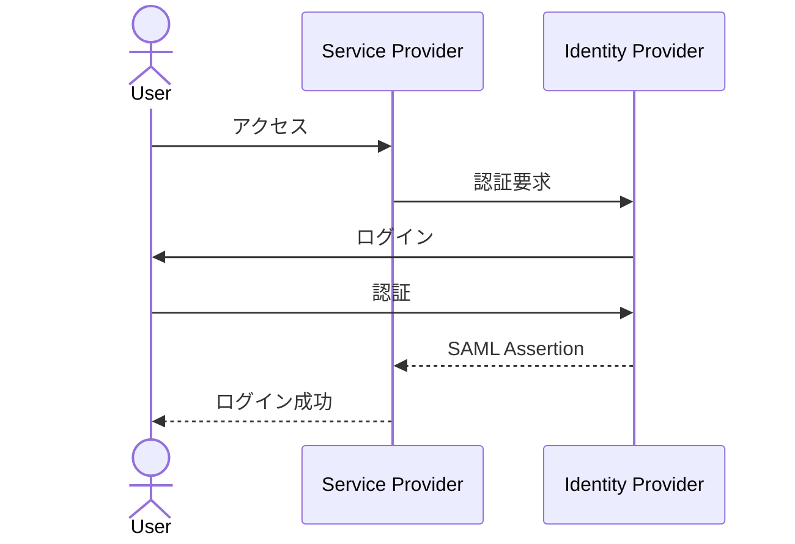

新規WebアプリではOIDCを選択するケースが多い。

一方、既存のEnterprise SSOではSAMLが現在も重要。

```text
新規Webアプリ
→ OpenID Connect

Enterprise / 既存システムとのSSO
→ OpenID Connect または SAML

```

---

## 12. クライアント証明書 / mTLS

クライアント証明書を利用して端末やユーザーを認証する方式。

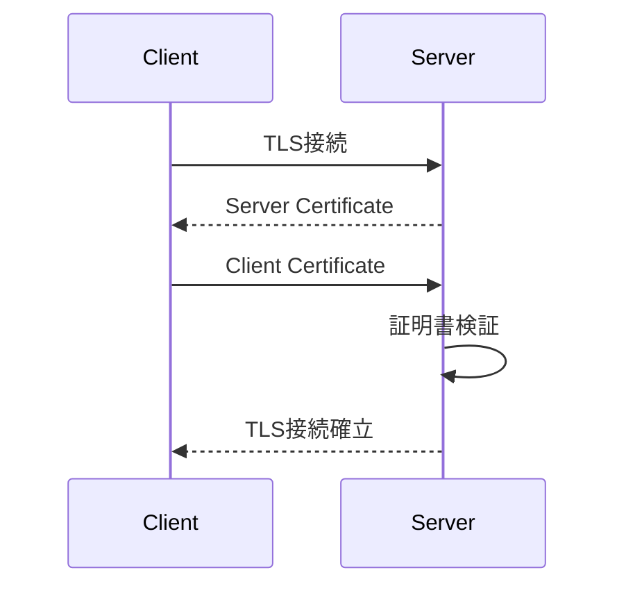

主な用途：

- 金融システム
- B2Bシステム
- 社内システム
- Service-to-Service通信
- 高セキュリティAPI

セキュリティは高いが、証明書の発行・更新・失効などの運用コストが高い。

---

## 13. HTTP Basic認証

HTTP標準の単純な認証方式。

```http
Authorization: Basic <credentials>

```

主な用途：

- 開発環境
- 簡易管理画面
- 内部サービス
- 一部API

一般ユーザー向けWebアプリのログイン機能として新規採用することは基本的に推奨しない。

---

## 14. OAuth 2.0

OAuth 2.0は**認証方式ではなく認可フレームワーク**。

例えば、

> WebアプリにGoogle Driveのファイルを読み取る権限を与える

といった用途で使用する。

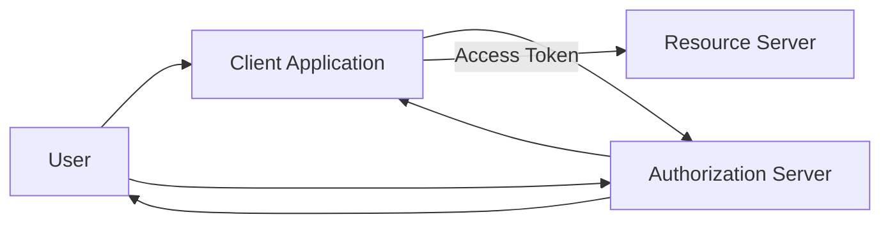

OAuthが担当するのは、

```text
Authentication
本人は誰か

```

ではなく、

```text
Authorization
何を許可するか

```

である。

ユーザー認証をOAuth 2.0上に標準化したものがOpenID Connect。

---

## 15. JWT

JWT（JSON Web Token）は認証方式ではなく、情報を表現するためのトークン形式。

基本構造：

```text
Header.Payload.Signature

```

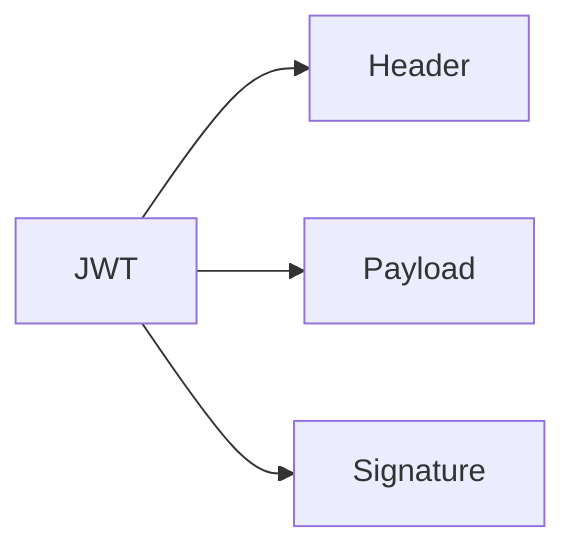

OIDCのID TokenやOAuthのAccess TokenなどでJWTが利用される場合がある。

そのため、

```text
JWT認証

```

という表現は実務では使われるものの、厳密には、

```text
JWTを認証・認可情報の表現に使用している

```

と考える。

---

## 16. Cookie Session

Cookie Sessionは認証後のログイン状態を維持する代表的な方式。

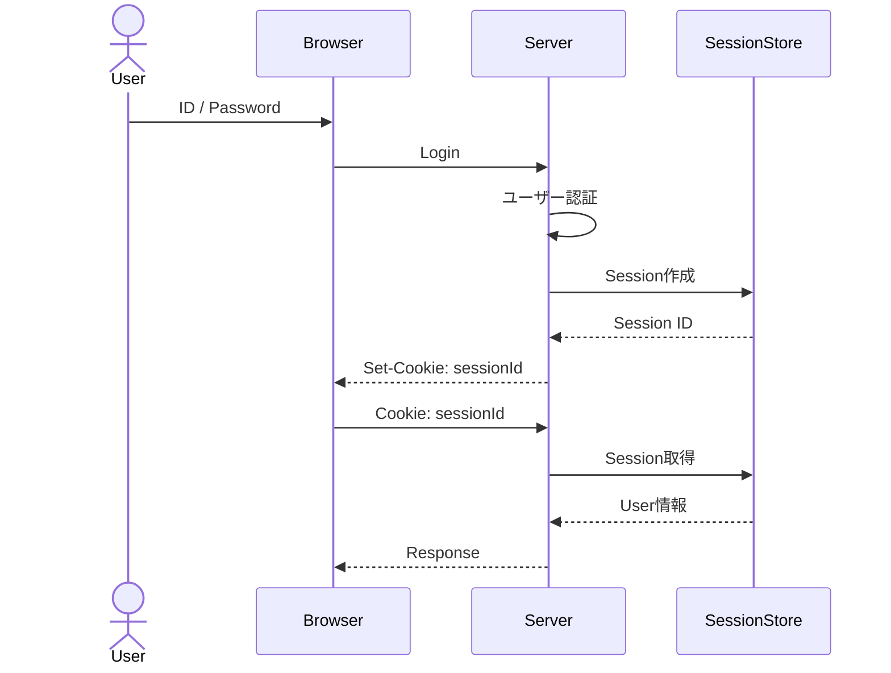

重要なのは、

```text
Password / Passkey / OIDC
        ↓
本人確認

Cookie Session
        ↓
認証後の状態維持

```

という違い。

Cookieには一般的に以下を設定する。

```text
HttpOnly
Secure
SameSite

```

ブラウザアプリでは、認証情報を`localStorage`へ保存するより、HttpOnly Cookieを利用する構成を検討する。

---

## 17. Cookie SessionとToken認証

代表的な構成は大きく分けて以下。

### Session方式

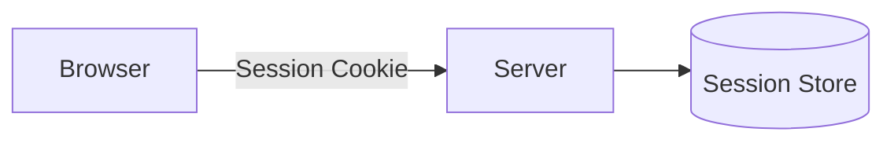

サーバー側でログイン状態を管理する。

### Token方式

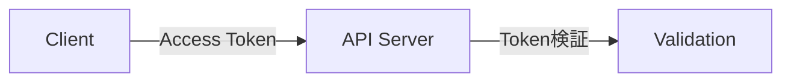

APIやモバイルアプリ、複数サービス間の通信などで利用される。

どちらが常に優れているというものではなく、システム構成によって選択する。

---

## 18. 新規Webシステムでの基本方針

一般的なWebサービスでは、以下を基本候補とする。

### 自前アカウント

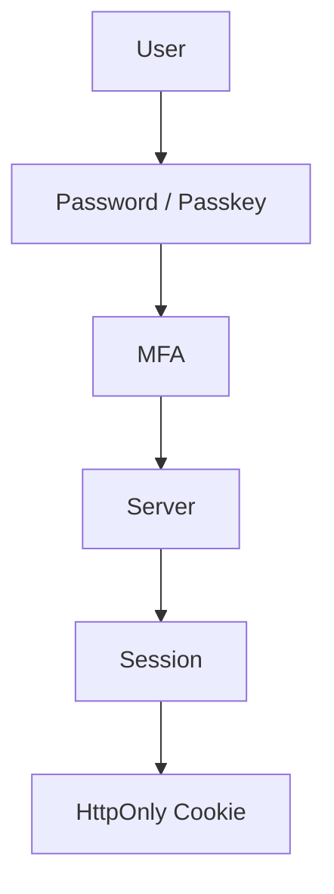

例：

```text
Password
+
Passkey / TOTP
+
Cookie Session

```

### 外部IdPを利用する場合

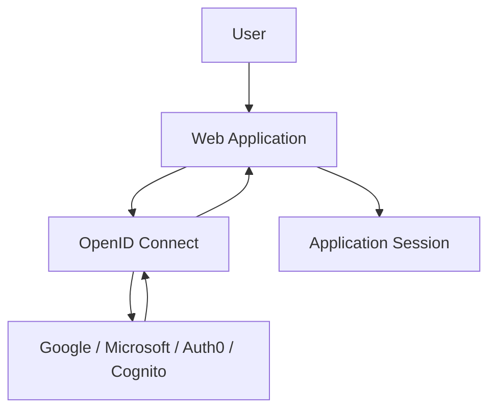

基本構成：

```text
OpenID Connect
+
Authorization Code Flow
+
PKCE
+
Application Session

```

---

## 19. 学習優先順位

Webシステムの認証を体系的に理解する場合は以下の順序が分かりやすい。

1. Password認証
2. Cookie / Session
3. JWT
4. OAuth 2.0
5. OpenID Connect
6. MFA / TOTP
7. Passkey / WebAuthn
8. SAML
9. mTLS

特に最初は、

```text
Password
    ↓
Session
    ↓
Cookie

```

を理解したうえで、

```text
OAuth 2.0
    ↓
OpenID Connect
    ↓
JWT / Access Token / ID Token

```

へ進むと各技術の役割を混同しにくい。

---

## 20. 参考資料

- [NIST SP 800-63B-4 - Authentication and Authenticator Management](https://pages.nist.gov/800-63-4/sp800-63b/)
- [OpenID Connect Core 1.0](https://openid.net/specs/openid-connect-core-1_0.html)
- [RFC 6749 - OAuth 2.0](https://datatracker.ietf.org/doc/html/rfc6749)
- [RFC 9700 - Best Current Practice for OAuth 2.0 Security](https://datatracker.ietf.org/doc/html/rfc9700)
- [Web Authentication API - W3C](https://www.w3.org/TR/webauthn/)
- [FIDO Alliance - Passkeys](https://fidoalliance.org/passkeys/)
- [OWASP Authentication Cheat Sheet](https://cheatsheetseries.owasp.org/cheatsheets/Authentication_Cheat_Sheet.html)
- [OWASP Session Management Cheat Sheet](https://cheatsheetseries.owasp.org/cheatsheets/Session_Management_Cheat_Sheet.html)
- [OASIS SAML 2.0](https://www.oasis-open.org/standard/saml/)
