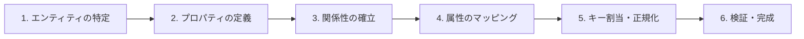
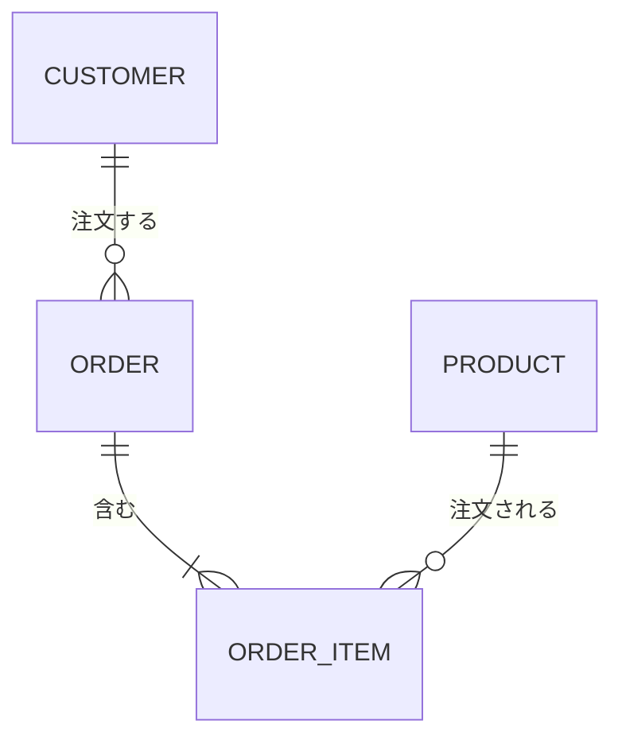
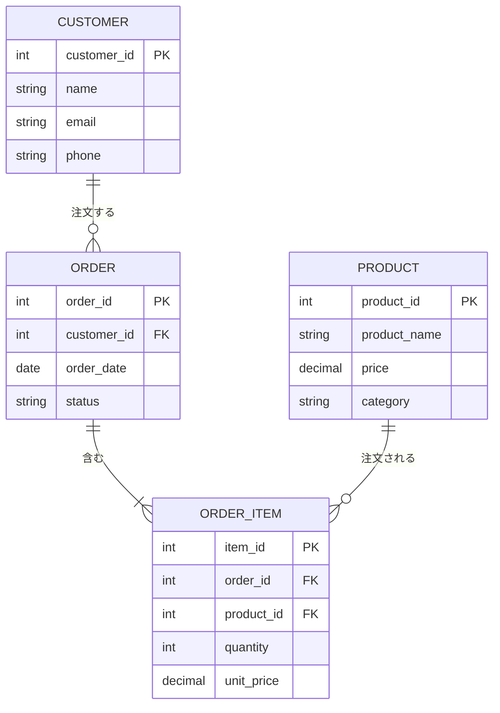
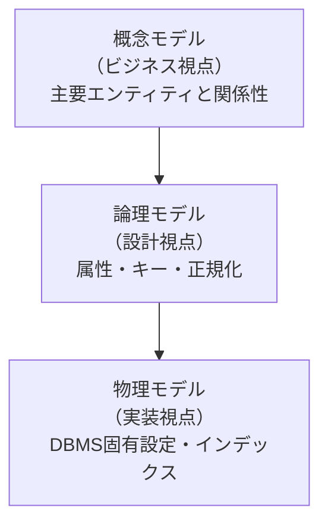
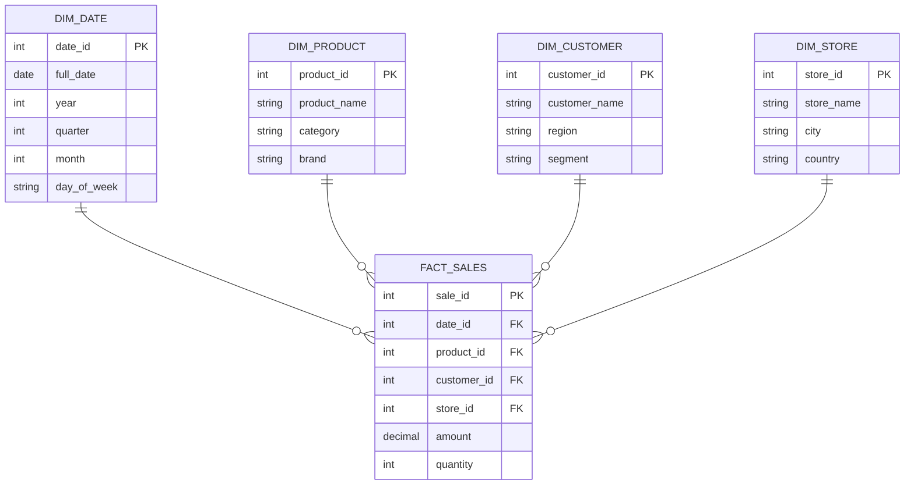
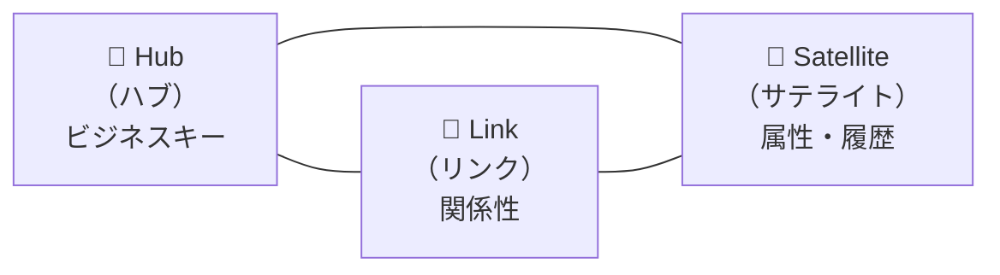

# データモデリング（Data Modeling）

## 概要

データモデリングとは、情報システム全体またはその一部を視覚的に表現し、データ要素・その関係性・ルールを定義するプロセスである。ビジネスニーズに基づいてデータの構造を設計し、システムの基盤を築く重要な工程となる。

> データモデリングは単なるER図の作成ではなく、ビジネス要件をデータ構造に変換する**戦略的な設計活動**である。

---

## 目次

- [1. データモデリングの基本概念](#1-データモデリングの基本概念)
  - [1.1 データモデリングとは](#11-データモデリングとは)
  - [1.2 なぜデータモデリングが必要か](#12-なぜデータモデリングが必要か)
  - [1.3 データモデリングのプロセス](#13-データモデリングのプロセス)
- [2. データモデルの3つのレベル](#2-データモデルの3つのレベル)
  - [2.1 概念モデル（Conceptual Model）](#21-概念モデルconceptual-model)
  - [2.2 論理モデル（Logical Model）](#22-論理モデルlogical-model)
  - [2.3 物理モデル（Physical Model）](#23-物理モデルphysical-model)
  - [2.4 3つのモデルの関係性](#24-3つのモデルの関係性)
- [3. 正規化と非正規化](#3-正規化と非正規化)
  - [3.1 正規化（Normalization）](#31-正規化normalization)
  - [3.2 非正規化（Denormalization）](#32-非正規化denormalization)
  - [3.3 正規化 vs 非正規化の使い分け](#33-正規化-vs-非正規化の使い分け)
- [4. モダンデータモデリング手法](#4-モダンデータモデリング手法)
  - [4.1 ディメンショナルモデリング](#41-ディメンショナルモデリング)
  - [4.2 スタースキーマ（Star Schema）](#42-スタースキーマstar-schema)
  - [4.3 スノーフレークスキーマ（Snowflake Schema）](#43-スノーフレークスキーマsnowflake-schema)
  - [4.4 Data Vault](#44-data-vault)
  - [4.5 スキーマ比較まとめ](#45-スキーマ比較まとめ)
- [5. データモデリングツール](#5-データモデリングツール)
- [6. 最新トレンド（2025〜2026年）](#6-最新トレンド20252026年)
- [7. ベストプラクティス](#7-ベストプラクティス)
- [参考文献](#参考文献)

---

## 1. データモデリングの基本概念

### 1.1 データモデリングとは

データモデリングとは、システムで使用されるデータ型、それらの関係性、整理方法を視覚的に表現・定義するプロセスである。

```
┌─────────────────────────────────────────────────┐
│            データモデリングの本質                  │
│                                                   │
│  ビジネス要件  →  データ構造  →  物理実装         │
│  （何が必要か）  （どう整理するか） （どう格納するか）│
└─────────────────────────────────────────────────┘
```

具体的には以下を行う：

- **エンティティ（実体）の特定** … 管理すべきデータ対象（顧客、商品、注文など）
- **属性の定義** … 各エンティティが持つ情報（顧客名、メールアドレスなど）
- **関係性の定義** … エンティティ間のつながり（顧客が注文を行う、など）
- **制約・ルールの設定** … データの整合性を保つためのビジネスルール

### 1.2 なぜデータモデリングが必要か

| メリット | 説明 |
|---------|------|
| **エラーの削減** | 設計段階で不整合を発見し、手戻りを防ぐ |
| **ドキュメンテーション** | システムの構造を可視化し、チーム間の共通理解を促す |
| **パフォーマンス改善** | 適切な構造設計によりクエリの効率が向上する |
| **保守性の向上** | 変更の影響範囲が明確になり、安全に改修できる |
| **コミュニケーション改善** | ビジネス側と技術側の「共通言語」として機能する |

### 1.3 データモデリングのプロセス

IBMが提唱する標準的なプロセスは以下の通りである。



1. **エンティティを特定する** … 管理対象となるビジネスオブジェクトを洗い出す
2. **主要なプロパティを定義する** … 各エンティティの主要属性を決定する
3. **エンティティ間の関係を確立する** … 1対1、1対多、多対多の関係を定義する
4. **属性をマッピングする** … 詳細な属性とデータ型を割り当てる
5. **キーを割り当て、正規化の程度を決定する** … 主キー・外部キーの設定と正規化
6. **モデルを完成・検証する** … レビューと妥当性確認

---

## 2. データモデルの3つのレベル

データモデリングでは、抽象度に応じて**概念モデル → 論理モデル → 物理モデル**の3段階でモデルを構築する。

### 2.1 概念モデル（Conceptual Model）

**目的**：ビジネス全体像の把握と主要エンティティの定義

概念モデルは、最も抽象度が高いモデルである。ビジネス要件とデータの全体的な流れを捉え、主要なデータエンティティとその相互作用を簡潔に示す。

- **作成フェーズ**：要件定義
- **対象者**：ビジネスステークホルダー、プロジェクトマネージャー
- **含むもの**：主要エンティティ、エンティティ間の関係性、ビジネスルール
- **含まないもの**：属性の詳細、データ型、キー定義



> **なぜ概念モデルが重要か？**
> ビジネス側と技術側が「同じものを見ている」ことを確認する最初のステップだからである。ここで認識がずれると、後工程すべてに影響する。

### 2.2 論理モデル（Logical Model）

**目的**：データ構造の詳細設計（DBMS非依存）

論理モデルは、概念モデルを基に具体的なデータ構造をデータベースに依存しない形で設計する。

- **作成フェーズ**：基本設計〜詳細設計
- **対象者**：設計者、開発者
- **含むもの**：すべてのエンティティと属性、主キー・外部キー、データ型（汎用）、正規化されたテーブル構造
- **含まないもの**：DBMSの固有仕様、インデックス、パーティション



### 2.3 物理モデル（Physical Model）

**目的**：実際のDBMSに合わせた実装レベルの設計

物理モデルは、論理モデルを基に特定のデータベースシステムに合わせた物理的なデータ構造を定義する。

- **作成フェーズ**：詳細設計〜実装
- **対象者**：DBA、開発者
- **含むもの**：DBMSの固有データ型、インデックス定義、パーティション戦略、ストレージ設定

```sql
-- PostgreSQLでの物理モデル例
CREATE TABLE customers (
    customer_id   SERIAL PRIMARY KEY,
    name          VARCHAR(100) NOT NULL,
    email         VARCHAR(255) UNIQUE NOT NULL,
    phone         VARCHAR(20),
    created_at    TIMESTAMP DEFAULT CURRENT_TIMESTAMP
);

CREATE INDEX idx_customers_email ON customers(email);

CREATE TABLE orders (
    order_id      SERIAL PRIMARY KEY,
    customer_id   INTEGER NOT NULL REFERENCES customers(customer_id),
    order_date    DATE NOT NULL DEFAULT CURRENT_DATE,
    status        VARCHAR(20) CHECK (status IN ('pending', 'shipped', 'delivered', 'cancelled'))
);

CREATE INDEX idx_orders_customer_id ON orders(customer_id);
CREATE INDEX idx_orders_status ON orders(status);
```

### 2.4 3つのモデルの関係性



| 観点 | 概念モデル | 論理モデル | 物理モデル |
|------|-----------|-----------|-----------|
| **抽象度** | 高い | 中間 | 低い |
| **対象者** | ビジネス担当者 | 設計者・開発者 | DBA・開発者 |
| **エンティティ名** | ビジネス用語 | 標準化された名前 | テーブル名（命名規則準拠） |
| **属性** | なし or 主要のみ | すべて定義 | データ型・制約付き |
| **キー** | なし | PK・FK定義 | インデックス含む |
| **DBMS依存** | なし | なし | あり |

---

## 3. 正規化と非正規化

### 3.1 正規化（Normalization）

正規化とは、データの冗長性（重複）を排除し、データ整合性を保つためのデータベース設計手法である。段階的に正規形を適用することで、データの異常（挿入異常・更新異常・削除異常）を防ぐ。

#### 第1正規形（1NF: First Normal Form）

**ルール**：すべての属性が原子的（atomic）であること

繰り返し項目や複数の値を含むセルを排除する。

```
❌ 非正規形
┌────────┬──────────────────────┐
│ 顧客ID  │ 電話番号              │
├────────┼──────────────────────┤
│ 001    │ 090-1111, 080-2222   │  ← 1つのセルに複数値
└────────┴──────────────────────┘

✅ 第1正規形
┌────────┬──────────────┐
│ 顧客ID  │ 電話番号      │
├────────┼──────────────┤
│ 001    │ 090-1111     │
│ 001    │ 080-2222     │
└────────┴──────────────┘
```

#### 第2正規形（2NF: Second Normal Form）

**ルール**：1NFを満たし、かつすべての非キー属性が主キーに**完全関数従属**すること

部分関数従属（複合主キーの一部にのみ依存する属性）を排除する。

```
❌ 第1正規形（部分関数従属あり）
┌────────┬────────┬──────────┬────────┐
│ 注文ID  │ 商品ID  │ 商品名    │ 数量   │
├────────┼────────┼──────────┼────────┤
│ O001   │ P001   │ ノートPC  │ 2      │ ← 商品名は商品IDだけで決まる（部分関数従属）
└────────┴────────┴──────────┴────────┘

✅ 第2正規形（テーブル分割）
注文明細テーブル              商品テーブル
┌────────┬────────┬────────┐  ┌────────┬──────────┐
│ 注文ID  │ 商品ID  │ 数量   │  │ 商品ID  │ 商品名    │
├────────┼────────┼────────┤  ├────────┼──────────┤
│ O001   │ P001   │ 2      │  │ P001   │ ノートPC  │
└────────┴────────┴────────┘  └────────┴──────────┘
```

#### 第3正規形（3NF: Third Normal Form）

**ルール**：2NFを満たし、かつすべての非キー属性が主キーに**直接**依存すること

推移的関数従属（非キー属性が他の非キー属性を経由して主キーに依存）を排除する。

```
❌ 第2正規形（推移的関数従属あり）
┌────────┬──────────┬──────────────┐
│ 社員ID  │ 部署ID    │ 部署名        │
├────────┼──────────┼──────────────┤
│ E001   │ D01      │ 営業部        │ ← 部署名は部署IDに依存（推移的関数従属）
└────────┴──────────┴──────────────┘

✅ 第3正規形（テーブル分割）
社員テーブル              部署テーブル
┌────────┬──────────┐  ┌──────────┬──────────────┐
│ 社員ID  │ 部署ID    │  │ 部署ID    │ 部署名        │
├────────┼──────────┤  ├──────────┼──────────────┤
│ E001   │ D01      │  │ D01      │ 営業部        │
└────────┴──────────┘  └──────────┴──────────────┘
```

#### ボイス・コッド正規形（BCNF: Boyce-Codd Normal Form）

**ルール**：すべての関数従属において、決定項（左辺）がスーパーキーであること

3NFのより厳密な形であり、3NFでは許容される一部の異常を排除する。

> **実務では第3正規形まで正規化するのが一般的**である。BCNFは理論的には望ましいが、分解により情報の損失が発生する場合がある。

### 3.2 非正規化（Denormalization）

非正規化とは、正規化されたテーブルに意図的に冗長性を導入し、読み取り性能を向上させる手法である。

#### 非正規化の手法

| 手法 | 説明 | 例 |
|------|------|-----|
| **テーブル結合** | 頻繁にJOINするテーブルを1つにまとめる | 注文と注文明細の統合 |
| **計算列の追加** | 集計結果をカラムとして保持する | 注文テーブルに合計金額を追加 |
| **冗長カラムの追加** | 参照先の値をコピーして保持する | 注文テーブルに顧客名を追加 |
| **マテリアライズドビュー** | 複雑なクエリの結果を事前計算して保存する | 月次売上サマリービュー |

#### 非正規化のトレードオフ

```
正規化                              非正規化
┌────────────────────┐          ┌────────────────────┐
│ ✅ データ整合性が高い │          │ ✅ 読み取りが高速    │
│ ✅ 更新が容易        │          │ ✅ JOINが減少       │
│ ✅ ストレージ効率が良い│          │ ✅ クエリが単純化    │
│ ❌ JOINが多くなる    │          │ ❌ データ重複がある   │
│ ❌ 読み取りが遅い    │          │ ❌ 更新が複雑になる   │
└────────────────────┘          └────────────────────┘
```

### 3.3 正規化 vs 非正規化の使い分け

| 観点 | 正規化が適切 | 非正規化が適切 |
|------|------------|--------------|
| **システム種別** | OLTP（トランザクション処理） | OLAP（分析処理） |
| **ワークロード** | 書き込み中心 | 読み取り中心 |
| **具体例** | ECサイト、銀行システム、予約システム | データウェアハウス、BIダッシュボード |
| **優先事項** | データ整合性・一貫性 | クエリ性能・レスポンス速度 |

---

## 4. モダンデータモデリング手法

### 4.1 ディメンショナルモデリング

ディメンショナルモデリングは、分析用途に最適化されたモデリング手法である。データを**ファクトテーブル**（事実・計測値）と**ディメンションテーブル**（分析の切り口）に分けて設計する。



| 用語 | 説明 | 例 |
|------|------|-----|
| **ファクトテーブル** | 計測可能なビジネスイベント | 売上額、注文数、クリック数 |
| **ディメンションテーブル** | ファクトを分析する切り口 | 日付、商品、顧客、店舗 |
| **メジャー** | 集計対象の数値 | SUM(amount)、COUNT(orders) |
| **グレイン** | ファクトテーブルの1行が表す粒度 | 「1回の販売取引」 |

### 4.2 スタースキーマ（Star Schema）

スタースキーマは、ディメンショナルモデリングの最も基本的な構造である。中央にファクトテーブル、周囲に非正規化されたディメンションテーブルを配置し、星のような形になる。

```
              ┌──────────┐
              │ DIM_DATE │
              └────┬─────┘
                   │
┌──────────┐  ┌────┴─────┐  ┌─────────────┐
│DIM_STORE │──│FACT_SALES│──│DIM_CUSTOMER │
└──────────┘  └────┬─────┘  └─────────────┘
                   │
              ┌────┴────────┐
              │ DIM_PRODUCT │
              └─────────────┘
```

**特徴**：
- ディメンションテーブルは非正規化されている（JOINが少ない）
- クエリがシンプルで高速
- BIツールとの相性が良い

### 4.3 スノーフレークスキーマ（Snowflake Schema）

スノーフレークスキーマは、スタースキーマのディメンションテーブルをさらに正規化した構造である。ディメンションが複数のテーブルに分割され、雪の結晶のような形になる。

```
                        ┌──────────┐
              ┌─────────│  YEAR    │
              │         └──────────┘
         ┌────┴─────┐
         │ DIM_DATE │
         └────┬─────┘
              │
         ┌────┴─────┐   ┌─────────────┐   ┌──────────┐
         │FACT_SALES│───│DIM_PRODUCT  │───│ CATEGORY │
         └────┬─────┘   └─────────────┘   └──────────┘
              │
         ┌────┴────────┐   ┌──────────┐
         │DIM_CUSTOMER │───│ REGION   │
         └─────────────┘   └──────────┘
```

**特徴**：
- ストレージ効率が高い（重複データが少ない）
- データ整合性の維持が容易
- JOINが増えるためクエリはやや複雑

### 4.4 Data Vault

Data Vaultは、エンタープライズデータウェアハウス向けの現代的なモデリング手法である。変化に強く、データソースの追加が容易な設計が特徴。

#### 3つの構成要素



| 要素 | 役割 | 例 |
|------|------|-----|
| **Hub（ハブ）** | ビジネス上の一意なキーを保持する中核エンティティ | 顧客ID、商品コード |
| **Link（リンク）** | ハブ同士の関係性やトランザクションを表現 | 顧客-注文の関係 |
| **Satellite（サテライト）** | 属性データと履歴変更を記録 | 顧客名、住所（変更履歴付き） |

#### Data Vaultの具体例

```sql
-- Hub: ビジネスキーのみ保持
CREATE TABLE hub_customer (
    hub_customer_id   BIGINT PRIMARY KEY,
    customer_bk       VARCHAR(50) NOT NULL,  -- ビジネスキー
    load_date         TIMESTAMP NOT NULL,
    record_source     VARCHAR(100) NOT NULL
);

-- Link: 関係性を表現
CREATE TABLE link_order (
    link_order_id     BIGINT PRIMARY KEY,
    hub_customer_id   BIGINT REFERENCES hub_customer,
    hub_product_id    BIGINT REFERENCES hub_product,
    load_date         TIMESTAMP NOT NULL,
    record_source     VARCHAR(100) NOT NULL
);

-- Satellite: 属性と履歴
CREATE TABLE sat_customer_details (
    hub_customer_id   BIGINT REFERENCES hub_customer,
    load_date         TIMESTAMP NOT NULL,
    end_date          TIMESTAMP,
    customer_name     VARCHAR(200),
    email             VARCHAR(255),
    phone             VARCHAR(20),
    record_source     VARCHAR(100) NOT NULL,
    PRIMARY KEY (hub_customer_id, load_date)
);
```

> **なぜData Vaultを使うのか？**
> データソースや要件が頻繁に変わる環境で、既存の構造を壊さずに新しいデータソースを追加できるからである。監査証跡（いつ・どこから来たデータか）も自然に記録される。

### 4.5 スキーマ比較まとめ

| 観点 | スタースキーマ | スノーフレークスキーマ | Data Vault |
|------|-------------|-------------------|------------|
| **複雑さ** | 低い | 中程度 | 高い |
| **クエリ性能** | 高速 | やや遅い | 中程度（ビュー経由で高速化） |
| **柔軟性** | 低い | 中程度 | 高い |
| **ストレージ効率** | 低い（冗長あり） | 高い | 中程度 |
| **データソース追加** | 再設計が必要 | 部分的に対応 | 容易 |
| **適用場面** | BI・レポーティング | 精度・コンプライアンス重視 | エンタープライズDWH |
| **代表ツール** | BIツール全般 | 大規模組織 | dbt, Snowflake |

---

## 5. データモデリングツール

### エンタープライズ向け

| ツール | 特徴 | 適用場面 |
|--------|------|---------|
| **erwin Data Modeler** | 論理・物理モデリング対応、メタデータ管理、ガバナンス機能が充実 | 規制業界、大規模企業 |
| **IBM InfoSphere Data Architect** | IBMエコシステムとの統合、概念〜物理モデルの一貫管理 | IBMインフラ環境 |
| **SAP PowerDesigner** | エンタープライズアーキテクチャとの統合モデリング | SAP環境 |

### クラウド・モダン向け

| ツール | 特徴 | 適用場面 |
|--------|------|---------|
| **dbt (Data Build Tool)** | コードベースの変換・モデリング、CI/CD対応、OSSあり | モダンデータスタック |
| **SqlDBM** | ブラウザベース、Snowflake/BigQuery/Databricks対応 | クラウドDWH設計 |
| **Coalesce** | ビジュアル＋コードのハイブリッド、Snowflake特化 | Snowflake環境 |

### 軽量・開発者向け

| ツール | 特徴 | 適用場面 |
|--------|------|---------|
| **dbdiagram.io** | DBMLコードからER図を自動生成、無料プランあり | 個人・小規模プロジェクト |
| **MySQL Workbench** | MySQL公式ツール、フォワード/リバースエンジニアリング対応 | MySQL環境 |
| **pgModeler** | PostgreSQL専用モデリングツール | PostgreSQL環境 |
| **Microsoft Visio** | 汎用ダイアグラム作成、ER図テンプレートあり | Microsoft環境 |

---

## 6. 最新トレンド（2025〜2026年）

### AIとデータモデリングの融合

2025年時点で**75%以上のデータモデルが何らかの形でAIを統合**しているとされる。具体的には以下の領域で活用されている：

- **自動スキーマ提案** … クエリパターンを分析し、インデックスやスキーマの最適化を提案
- **メタデータの自動発見** … データソースからエンティティや関係性を自動抽出
- **モデル品質チェック** … 設計上の問題（正規化不足、命名規則違反）の自動検出

### セマンティックモデリングの台頭

セマンティックモデリングは2025年に注目が高まり、2026年にはさらに重要なトレンドになると予測されている。

- 複数ソースのデータを統一されたビジネス視点でまとめる
- メタデータ、タクソノミー、オントロジーの統合
- AIエージェントがデータにアクセスするための基盤として機能

> **なぜセマンティックモデリングが重要か？**
> AIエージェントが異なるデータソースにアクセスする際、メタデータなしには適切なデータオーケストレーションができないためである。

### ハイブリッドモデリング環境

ビジュアルインターフェースとコードベース開発を組み合わせたハイブリッド環境への移行が進んでいる。設計・構築・デプロイを1つのシームレスな環境で行えるツールが増加している。

### データプロダクト思考

データを単なるデータセットではなく、明確な所有権と品質基準を持つ**プロダクト**として扱う考え方が広まっている。

| タイプ | 説明 |
|--------|------|
| **基礎的データプロダクト** | コアドメインから直接生成されるデータ |
| **複合データプロダクト** | 複数ソースを統合したデータ |
| **パッケージ化データプロダクト** | 分析準備済みの出力データ |

### メタデータ駆動モデリング

標準化されたテンプレートでデータ構造（ディメンション、ファクト、監査テーブルなど）を定義し、プログラムで一貫した変更適用を行う手法が普及しつつある。

---

## 7. ベストプラクティス

### 設計原則

1. **ビジネス要件から始める** … テクノロジーではなく、ビジネス成果に基づいて設計する
2. **適切な正規化レベルを選択する** … OLTPは第3正規形、OLAPは非正規化を基本とする
3. **命名規則を統一する** … テーブル名、カラム名に一貫したルールを適用する
4. **グレインを明確にする** … ファクトテーブルの1行が何を表すか常に定義する
5. **段階的に詳細化する** … 概念 → 論理 → 物理の順にモデルを発展させる

### 運用のポイント

| ポイント | 説明 |
|---------|------|
| **バージョン管理** | データモデルもGitで管理し、変更履歴を追跡する |
| **ドキュメンテーション** | ER図だけでなく、設計判断の理由も記録する |
| **レビュープロセス** | モデル変更は必ずレビューを通す |
| **継続的改善** | データモデルは一度作って終わりではなく、継続的に改善する |
| **マルチDB対応** | リレーショナル、NoSQL、グラフDBなど異なるDBの特性を考慮する |

---

## 参考文献

### 公式・企業ドキュメント

- [データ・モデリングとは | IBM](https://www.ibm.com/jp-ja/topics/data-modeling)
- [データモデリングとは？ | SAP](https://www.sap.com/japan/products/data-cloud/datasphere/what-is-data-modeling.html)

### 解説記事

- [データモデリングとは？ 重要性や3つのモデルをわかりやすく解説 | データのじかん](https://data.wingarc.com/data-modeling-46853)
- [概念モデル、論理モデル、物理モデル、データモデルの違いを初心者向けに解説 | DATAEGG](https://dataegg.co.jp/data/366/)
- [データモデル完全ガイド | TROCCO](https://primenumber.com/blog/datamodel)
- [概念・論理・物理データモデルの違い | データ総研](https://jp.drinet.co.jp/blog/modeling_dri)
- [データモデリングとは？種類やメリット、ツールについて解説 | OBER](https://products.sint.co.jp/ober/blog/datamodeling)
- [データベース正規形徹底解説：1NFからBCNFまで | Data Driven Knowledgebase](https://blog.since2020.jp/data_analysis/database_norms/)
- [正規化の基本（第1〜第3正規形） | Zenn](https://zenn.dev/senpen/articles/f8f4b362f1d934)

### 正規化・非正規化

- [Data Normalization Explained: Types, Examples, & Methods 2026 | Carmatec](https://www.carmatec.com/blog/data-normalization-explained-types-examples-methods/)
- [Normalization vs. Denormalization: Optimizing Data Modeling Techniques | Medium](https://medium.com/dcsfamily/normalization-vs-denormalization-optimizing-data-modeling-techniques-in-modern-data-marts-5ebfdc3aef14)
- [Denormalization: When and Why to Flatten Your Data | DEV Community](https://dev.to/alexmercedcoder/denormalization-when-and-why-to-flatten-your-data-g0g)

### モダンデータモデリング

- [Modern Data Modeling: Techniques, Tools, and Best Practices | Coalesce](https://coalesce.io/data-insights/modern-data-modeling-techniques-tools-and-best-practices/)
- [Data Vault vs Star Schema | EDANA](https://edana.ch/en/2025/08/05/data-vault-vs-star-schema-which-model-to-choose-for-a-modern-scalable-data-warehouse/)
- [Star Schema vs Snowflake Schema vs Data Vault | Medium](https://medium.com/@reliabledataengineering/star-schema-vs-snowflake-schema-vs-data-vault-i-modeled-the-same-dataset-three-ways-07a958fcde6b)
- [Data Warehouse Modeling: Techniques, Challenges, and Future-Ready Strategies | ER/Studio](https://erstudio.com/blog/data-warehouse-modeling/)
- [Modeling for success: Building data structures that last | dbt Labs](https://www.getdbt.com/blog/modeling-success-dbt)

### トレンド・最新動向

- [Data Architecture and Modeling: Trending Topics in 2025 | Data Crossroads](https://datacrossroads.nl/2025/07/09/data-architecture-and-modeling-trends-in-2025/)
- [Data Management Trends in 2026 | Dataversity](https://www.dataversity.net/articles/data-management-trends/)
- [4 trends that will shape data management and AI in 2026 | TechTarget](https://www.techtarget.com/searchdatamanagement/feature/4-trends-that-will-shape-data-management-and-AI-in-2026)
- [Data Management Trends 2026 | Kanerika](https://kanerika.com/blogs/data-management-trends/)

### ツール比較

- [The 7 Best Data Modeling Tools for 2026 | Integrate.io](https://www.integrate.io/blog/best-data-modeling-tools/)
- [Top 19 Data Modeling Tools for 2026 | DataCamp](https://www.datacamp.com/blog/data-modeling-tools)
- [15 Best Data Modeling Tools For 2026 | Airbyte](https://airbyte.com/top-etl-tools-for-sources/data-modeling-tools)
- [Best Data Modeling Tools of 2026 | ThoughtSpot](https://www.thoughtspot.com/data-trends/data-modeling/data-modeling-tools)
