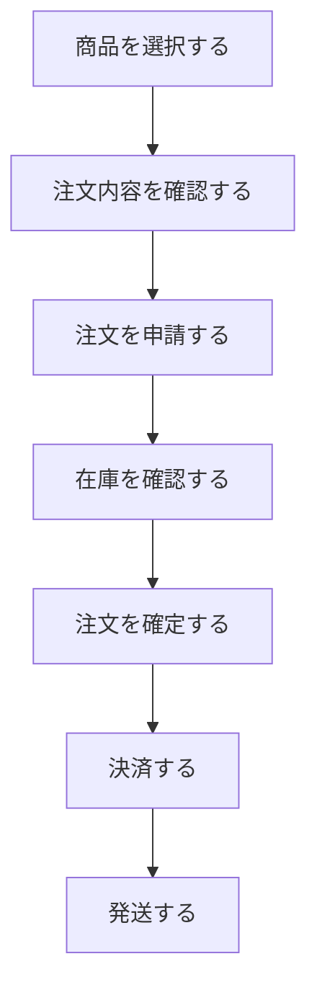
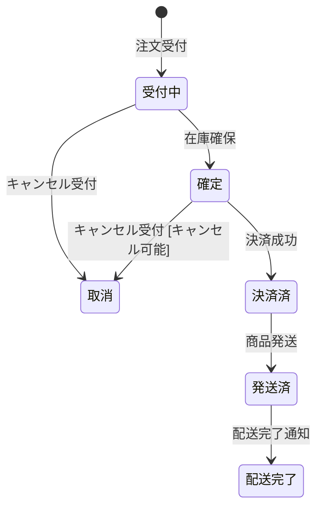
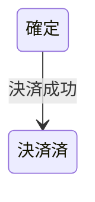
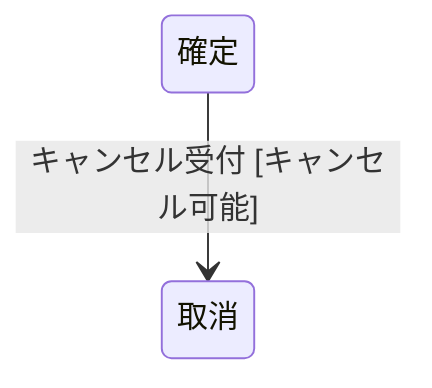
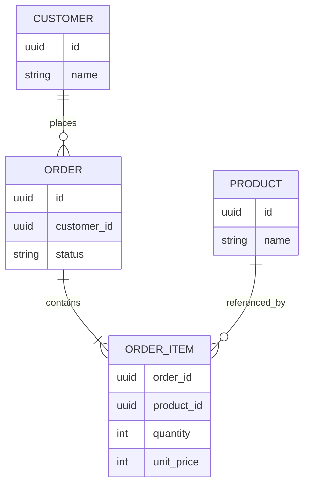
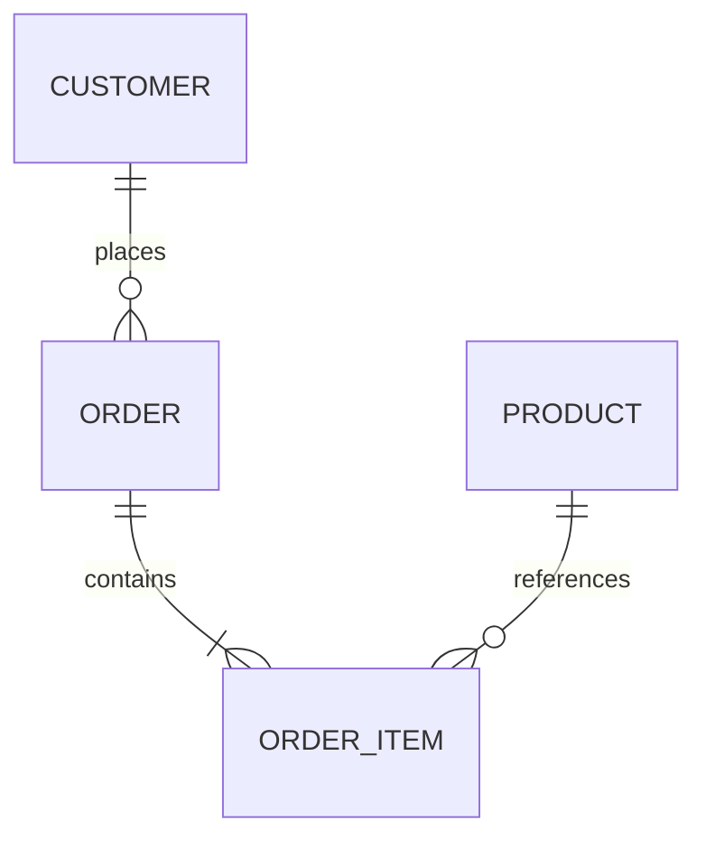

# システム開発における業務・設計ドキュメントの最小構成

## 1. 基本方針

システム開発では、理想的には以下のようなドキュメントを個別に作成できる。

- システム概要
- スコープ
- 用語集
- 業務フロー
- 業務ルール
- 状態遷移
- ユースケース
- サービス設計
- ドメインモデル
- アーキテクチャ
- API仕様
- DB設計
- ADR
- 非機能要件

ただし、実際の開発現場ですべてを作成・更新すると、管理コストが高くなる。

そのため、以下を基本方針とする。

> コードや自動生成された仕様を見れば分かる情報は、Markdownへ重複して記載しない。
> コードから判断しにくい「業務上の意味」「業務ルール」「重要な設計理由」を優先して残す。

特に、業務設計を設計ドキュメントの中心とする。

---

# 2. 業務設計を中心にする理由

業務ルールや業務上の意味は、フレームワークやAPI方式などの技術変更による影響を比較的受けにくい。

例えば、

```text
発送済みの注文はキャンセルできない

```

というルールは、

- NestJS
- Spring Boot
- Laravel
- REST API
- GraphQL

など、使用する技術が変わっても基本的には成立する。

これはシステムの実装ルールではなく、業務ルールだからである。

一方、

```text
CancelOrderUseCase
OrderService
POST /orders/{id}/cancel

```

などはシステム実装に依存する。

そのため、

```text
業務上の意味・ルール
↓
技術変更の影響を受けにくい

システム設計・実装
↓
技術変更の影響を受けやすい

```

と考え、業務情報を優先してドキュメント化する。

---

# 3. 業務とシステムの関係

業務とは、

> 現実世界で会社・組織・人が何をするか

を表す。

システムは、

> その業務を支援・自動化するもの

である。

例えば注文の場合、

```text
商品を選択する
↓
注文する
↓
在庫を確認する
↓
注文を確定する
↓
決済する
↓
発送する

```

という業務が存在する。

その一部をシステム化すると、

```text
業務ルール
「発送済みの商品はキャンセルできない」

        ↓

システム上の処理

注文状態を確認
↓
キャンセル可能か判定
↓
注文状態を変更

        ↓

実装

CancelOrderUseCase
OrderService
Order.canCancel()

```

となる。

ドキュメントでは、上側の業務情報を優先して残す。

---

# 4. サービス設計書は原則必須としない

サービス設計では通常、

- サービスの責務
- ユースケース
- 入出力
- 事前条件
- 事後条件
- 他サービスとの連携
- 関連API

などを記載できる。

しかし、これらの多くは、

```text
業務設計
Architecture
OpenAPI
Code

```

から確認できる。

例えば、

```text
注文をキャンセルする

```

という処理について、

```text
1. 注文を取得
2. 状態を確認
3. キャンセル可能か判定
4. 状態を更新

```

までMarkdownへ記載すると、実装との二重管理になりやすい。

そのため、小〜中規模の業務システムでは、独立したサービス設計書を原則作成しない。

---

# 5. サービス設計書を作成するケース

サービス設計そのものが不要という意味ではない。

以下のような場合には、システム上の責務や境界を明示する価値が高くなる。


| 状況               | サービス設計 |
| ---------------- | ------ |
| 小規模モノリス          | 原則不要   |
| 一般的な業務システム       | 必要に応じて |
| Modular Monolith | 必要に応じて |
| 複数チーム開発          | 有効     |
| マイクロサービス         | 重要     |
| システム間連携が複雑       | 重要     |
| 責務境界が曖昧          | 重要     |


例えば、

```text
注文
├── 在庫
├── 決済
├── ポイント
├── クーポン
├── 配送
└── 通知

```

のような構成になり、

```text
在庫確保はどのモジュールの責任か？

決済失敗時に注文状態を戻すのはどこか？

ポイント付与は注文と決済のどちらが担当するか？

```

といった問題が頻繁に発生する場合は、サービス設計や責務境界のドキュメントを追加する。

基本方針は、

> 必要になるまでは作らない。
> 責務境界が問題になったら追加する。

とする。

---

# 6. 優先して残す情報

ドキュメントとして優先するのは以下。

1. 業務ルール
2. 業務フロー
3. 状態遷移
4. DBのリレーションとデータの意味
5. システム全体のアーキテクチャ
6. 重要なADR
7. 用語

特に重要なのは、コードだけでは意味を判断しにくい情報である。

例えば、

```text
発送済みの注文はキャンセルできない

```

という情報はコードを読んでも、

```text
本当に業務上のルールなのか

現在の実装上たまたまそうなっているだけなのか

```

を判断しにくい。

そのため、業務ルールとして明示的に残す。

---

# 7. ドキュメントごとの扱い


| ドキュメント        | 方針        | 理由                      |
| ------------- | --------- | ----------------------- |
| システム概要        | 残す        | 全体像を理解する入口              |
| スコープ          | システム概要へ統合 | 独立ファイルにしなくてもよい          |
| ステークホルダー      | 必要なら概要へ統合 | 独立管理する必要性が低い場合が多い       |
| 用語集           | 残す        | 認識齟齬を防ぐ                 |
| 業務フロー         | 残す        | 業務全体を理解するため             |
| 業務ルール         | 残す        | 実装・テストの根拠               |
| 状態遷移          | 必要な場合のみ   | 業務状態が重要な場合に有効           |
| ユースケース        | 原則省略      | 業務・API・コードと重複しやすい       |
| サービス設計        | 原則省略      | コード・アーキテクチャと重複しやすい      |
| ドメインモデル       | 必要な場合のみ   | 複雑なドメインで有効              |
| Entity一覧      | 原則省略      | コード・DB設計と重複しやすい         |
| API仕様Markdown | 省略        | OpenAPIを正とする            |
| DBリレーション図     | 残す        | DB全体の関係を把握しやすい          |
| テーブル定義        | 残す        | データの意味を理解するため           |
| Schema / DDL  | 残す        | 実際のDB構造のSource of Truth |
| 詳細Component図  | 必要な場合のみ   | コード構造と重複しやすい            |
| システム構成図       | 残す        | 全体把握に有効                 |
| ADR           | 重要な判断のみ   | 「なぜ」を残せる                |
| 非機能要件         | 必要なもののみ   | 性能・可用性・セキュリティ等          |


---

# 8. 業務ドキュメントの単位

業務ドキュメントは、DBエンティティ単位ではなく、

> 業務領域・業務として意味のあるまとまり

を基本単位とする。

例えばECシステムなら、

```text
注文
決済
配送
返品
在庫管理
顧客管理

```

など。

必ずしも、

```text
顧客
商品
注文
注文詳細

```

のようなDBエンティティ単位にはしない。

例えば「注文」という言葉でも、

```text
注文業務
注文するという行為
注文という業務オブジェクト
ordersテーブル

```

では意味が異なる。

業務ドキュメントでは、

> 現実世界の仕事として意味のある単位

で整理する。

---

# 9. ファイルを細かく分割しすぎない

理想的には、

```text
注文/
├── README.md
├── 業務フロー.md
├── 業務ルール.md
├── 状態遷移.md
└── アクター.md

```

のように分割できる。

しかし、実務では更新箇所が増えて管理コストが高くなる。

そのため、小〜中規模のシステムでは、

```text
注文.md

```

の1ファイルへまとめる。

---

# 10. 業務ドキュメントの推奨構成

例えば [`注文.md`](http://注文.md) は以下とする。

```md
# 注文業務

## 1. 概要

この業務が何を目的としているか記載する。

## 2. アクター

業務に関係する人・組織・外部主体を記載する。

## 3. 業務フロー

業務の開始から終了までの流れを記載する。

## 4. 業務ルール

業務上守らなければならないルールを記載する。

## 5. 状態遷移

業務判断や業務ルールに影響する状態がある場合のみ記載する。

状態遷移は Mermaid の `stateDiagram-v2` を使用する。

各遷移の矢印には、原則として状態が変化する
きっかけとなるイベントを記載する。

必要に応じて、重要な遷移条件も記載する。

詳細な条件は業務ルールとして管理し、
状態遷移図へ過剰に記載しない。

## 6. 関連

関連する業務・API・DB・外部資料へのリンクを記載する。

```

状態遷移を持たない業務なら、状態遷移セクションは省略する。

---

# 11. 業務ドキュメントのサンプル

```md
# 注文業務

## 1. 概要

顧客から商品の購入申込を受け付け、
注文を確定し、決済・配送へつなげる。

## 2. アクター

- 顧客
- 販売担当者
- 倉庫担当者

## 3. 業務フロー

```



```md
## 4. 業務ルール

### BR-ORD-001 注文可能商品

販売中の商品だけ注文できる。

### BR-ORD-002 在庫

在庫数を超える数量は注文できない。

### BR-ORD-003 注文金額

注文確定時点の商品価格を使用する。

### BR-ORD-004 キャンセル

発送済みの注文はキャンセルできない。

### BR-ORD-005 注文確定

在庫を確保できた場合のみ注文を確定できる。

## 5. 状態遷移

```



```md
## 6. 関連

- 決済業務
- 配送業務
- 在庫管理業務
- OpenAPI
- DB設計

```

---

# 12. 状態遷移の書き方

状態遷移では、

> どの状態から、何をきっかけに、どの状態へ変化するのか

を明確にする。

基本形は、

```text
現在状態
    │
    │ イベント
    ↓
次状態

```

とする。

例えば、

```text
確定
 │
 │ 決済成功
 ↓
決済済

```

は、

> 決済成功というイベントが発生したことで、確定から決済済へ遷移する

ことを表す。

Mermaidでは、



と記載する。

Mermaidでは遷移線にテキストを付与できるため、状態変化のきっかけを矢印へ明示できる。

---

# 13. 状態遷移の条件

状態遷移には、イベントだけでなく条件が存在する場合がある。

例えば、

```text
確定
 │
 │ キャンセル受付
 │ [キャンセル可能]
 ↓
取消

```

の場合、

- `キャンセル受付`：イベント
- `キャンセル可能`：遷移条件
- `取消`：遷移後の状態

となる。



ただし、

```text
キャンセル受付
[発送前 && 決済取消可能 && 管理者承認済 && ...]

```

のように詳細条件をすべて書くと、状態遷移図が読みにくくなる。

そのため、

> 状態遷移図にはイベントと重要な条件だけを記載し、詳細条件は業務ルールで管理する。

---

# 14. 状態遷移と業務ルールの役割分担

状態遷移では、

> 何が起きると、どの状態からどの状態へ変化するか

を表す。

業務ルールでは、

> どのような条件で、その処理・遷移が許可されるか

を表す。

例えば、

```text
状態遷移

確定
↓ キャンセル受付
取消

        ＋

業務ルール

発送済みの注文はキャンセルできない

```

という関係になる。

---

# 15. 状態遷移は必要な業務だけ作成する

すべての業務に状態遷移を書く必要はない。

例えば注文では、

```text
受付中
↓
確定
↓
決済済
↓
発送済
↓
配送完了

```

のように状態が業務ルールへ大きく影響する。

この場合は状態遷移を残す価値が高い。

一方、単純なマスタ登録など、業務上重要な状態が存在しない場合は省略してよい。

---

# 16. 業務状態と技術状態を分ける

業務ドキュメントの状態遷移には、

> 業務判断や業務ルールに影響する状態のみ記載する。

例えば、

```text
受付中
確定
決済済
発送済
取消

```

などは業務状態なので記載対象となる。

一方、

```text
API_REQUESTED
PROCESSING
RETRYING
TIMEOUT

```

などの技術的な処理状態は、原則として業務ドキュメントには記載しない。

技術状態が設計上重要な場合は、Architectureや実装設計など別の場所で管理する。

---

# 17. DB設計は残す

DBについては、コードやSchemaだけでは全体像やデータの業務的意味を把握しにくい。

そのため、

```text
DB設計
├── リレーション図（ER図）
├── テーブル定義
└── Schema / DDL

```

の3つを役割分担して管理する。

それぞれ、

```text
リレーション図
→ テーブル間の関係を理解する

テーブル定義
→ テーブル・カラムの意味を理解する

Schema / DDL
→ 実際のDB構造を定義する

```

という役割を持つ。

---

# 18. DBのリレーション図

リレーション図では、

> テーブル同士がどのように関係しているか

を表す。

Markdownで管理する場合は、Mermaidの `erDiagram` を利用できる。

MermaidのER図はエンティティ間の関係やカーディナリティを表現できる。

例えば、



これにより、

```text
顧客
↓
注文
↓
注文明細
↓
商品

```

というデータ構造を短時間で理解できる。

---

# 19. リレーション図の粒度

ER図へすべてのカラムを記載する必要はない。

テーブル数やカラム数が増えると、図が読みにくくなるためである。

基本的には、

- PK
- FK
- 関係を理解するために重要なカラム

を中心に記載する。

例えば、



だけでも関係を理解できる場合は、無理にすべての属性を記載しない。

MermaidのER図も、理解に必要な一部の属性だけを含める使い方が可能である。

---

# 20. テーブル定義

テーブル定義では、

> そのテーブル・カラムが何を意味しているのか

を記載する。

例えば、

```md
## orders

注文時点の取引情報を保持する。

| カラム | 意味 | 補足 |
|---|---|---|
| id | 注文を一意に識別するID | |
| customer_id | 注文した顧客 | customers.idを参照 |
| status | 注文の現在状態 | 注文業務の状態と対応 |
| total_amount | 注文確定時点の合計金額 | 商品価格変更後も変更しない |
| created_at | 注文受付日時 | |

```

特に、

```text
total_amount

注文確定時点の金額を保持する。
商品マスタの価格が変更されても変更しない。

```

のような、

> データの業務的な意味

を残すことが重要である。

---

# 21. テーブル定義とSchemaの役割分担

テーブル定義には、

- カラム名
- 意味
- 補足
- 必要に応じて型
- 必要に応じてPK / FK
- 必要に応じてNULL可否

などを記載できる。

ただし、

```text
型
NULL制約
PK
FK
UNIQUE
DEFAULT
INDEX

```

などの物理構造については、

> Schema / DDLをSource of Truthとする。

PostgreSQLなどのRDBMSでは、PK・FK・UNIQUE・NOT NULL等は実際のDB制約として定義され、FKはテーブル間の参照整合性を担う。

そのため、物理的な定義をMarkdownとSchemaの双方で手作業管理しない。

可能であれば、

> Schemaからテーブル定義を自動生成する

方法も検討する。

---

# 22. DB設計と業務設計の関係

業務ルールとDB設計は別物だが、関連する場合がある。

例えば、

```text
業務ルール

注文確定時点の商品価格を使用する

        ↓

DB設計

order_items.unit_price

注文時点の商品単価を保持する

        ↓

Schema

unit_price INTEGER NOT NULL

```

となる。

役割は、

```text
業務設計
→ なぜその情報が必要なのか

DB設計
→ どのデータとして保持するのか

Schema / DDL
→ DB上でどう定義されているのか

```

と分ける。

---

# 23. DBドキュメントの構成

小〜中規模の場合は、

```text
02_DB/
├── リレーション.md
└── テーブル定義.md

```

程度でよい。

テーブル数が増えた場合は、

```text
02_DB/
├── README.md
├── リレーション.md
│
└── tables/
    ├── customers.md
    ├── orders.md
    ├── order_items.md
    └── products.md

```

のように分割する。

---

# 24. API仕様はOpenAPIを正とする

APIの詳細をMarkdownへ記載すると二重管理になる。

例えば、

```text
POST /orders
GET /orders/{id}
POST /orders/{id}/cancel

```

などの詳細仕様は、

```text
openapi.yaml

```

で管理する。

OpenAPI SpecificationはHTTP APIを記述するための標準仕様であり、現在の公開最新版は3.2.0である。

業務Markdown側には、

```md
## 関連API

API仕様はOpenAPIを参照する。

```

程度を書く。

---

# 25. [architecture.md](http://architecture.md)

システム全体の構成は残す。

詳細なクラス設計まで書くのではなく、

> システム全体を短時間で理解できる粒度

とする。

例えば、

```text
ユーザー
    ↓
Next.js
    ↓
NestJS
    ↓
PostgreSQL

NestJS
    ↓
外部決済サービス

```

程度。

C4 ModelではSystem Context Diagramによってシステムと利用者・外部システムとの関係を表し、Container Diagramによってアプリケーションやデータストアなどの大きな構成と責務を表す。多くのチームではContextとContainerで十分とされている。

そのため、最初から詳細なComponent図まで作成せず、

```text
System Context
↓
Container

必要になった場合のみ
↓
Component

```

程度とする。

---

# 26. ADR

ADRでは、

> なぜその設計判断をしたのか

を残す。

例えば、

```text
なぜPostgreSQLを採用したのか

なぜJWTではなくCookie Sessionにしたのか

なぜモノリスを採用したのか

なぜ注文価格を商品マスタから参照せず注文側に保存するのか

なぜこのモジュール境界にしたのか

```

など。

コードを見ると、

> 何を採用しているか

は分かる。

しかし、

> なぜ採用したのか

は分からない。

そのため、重要な意思決定だけADRとして残す。

---

# 27. 推奨する最小フォルダ構成

実際の現場では、以下程度から開始する。

```text
docs/
├── README.md
├── 用語集.md
│
├── 01_業務/
│   ├── 注文.md
│   ├── 決済.md
│   ├── 配送.md
│   └── 顧客管理.md
│
├── 02_DB/
│   ├── リレーション.md
│   └── テーブル定義.md
│
├── architecture.md
│
├── api/
│   └── openapi.yaml
│
└── ADR/
    ├── ADR-001-認証方式.md
    └── ADR-002-DB選定.md

```

独立した、

```text
03_サービス/

```

は原則作成しない。

責務境界やシステム間連携が複雑になり、独立した設計資料が必要になった場合のみ追加する。

---

# 28. [README.md](http://README.md)

`docs/[README.md](http://README.md)` はドキュメント全体の入口とする。

最低限、

```text
システムの目的
スコープ
ドキュメント構成
各業務ドキュメントへのリンク
DB設計へのリンク
Architectureへのリンク
API仕様へのリンク
ADRへのリンク

```

を記載する。

---

# 29. [用語集.md](http://用語集.md)

業務用語の定義を統一する。

例えば、

```md
# 用語集

| 用語 | 定義 |
|---|---|
| 注文 | 顧客による商品の購入申込 |
| 注文確定 | 注文内容・金額・在庫が確定した状態 |
| キャンセル | 注文を取り消すこと |
| 発送 | 商品を配送会社へ引き渡した状態 |

```

特に、

```text
注文
申込
契約
確定
取消
キャンセル

```

のように、人によって意味が変わりやすい言葉を優先して定義する。

---

# 30. ドキュメントを作成するか判断する基準

新しいMarkdownを追加する前に、以下を確認する。

## 30.1 コードから分かるか

コードから簡単に確認できるなら、原則書かない。

例えば、

```text
Orderクラスのプロパティ
Repositoryのメソッド
Module構成
Controller一覧

```

など。

---

## 30.2 自動生成・機械的に確認できるか

自動生成・機械的に確認できるものは、その元データを正とする。

例えば、

```text
API仕様
→ OpenAPI

DB物理構造
→ Schema / DDL

型定義
→ TypeScript

```

とする。

ただし、

```text
ER図
テーブル・カラムの業務的意味

```

のように、人間が理解するために価値がある情報はDB設計として残してよい。

---

## 30.3 業務上の意味があるか

業務上の意味がある情報は残す。

例えば、

```text
発送済み注文はキャンセルできない

注文確定時点の価格を使用する

在庫確保後にのみ注文確定できる

```

など。

---

## 30.4 「なぜ」が重要か

設計理由はコードから復元しにくい。

そのため、

```text
なぜこのDBを選んだのか

なぜこのモジュール境界にしたのか

なぜこのシステム責務の分け方にしたのか

なぜこのデータを履歴として保持するのか

```

などは必要に応じてADRへ残す。

---

## 30.5 図にすることで理解しやすくなるか

コードやSchemaから取得できる情報でも、

> 図にすることで全体像を大幅に理解しやすくなる

場合は、ドキュメントとして持つ価値がある。

代表例は、

```text
DBリレーション図
システム構成図
業務フロー
状態遷移図

```

である。

ただし、実装との不整合を防ぐため、必要以上に詳細化しない。

---

## 30.6 そのドキュメントがなくて困るか

最終的な判断基準は、

> そのドキュメントが存在しないことで、開発・保守・仕様確認で困るか

である。

困らないのであれば、原則作らない。

---

# 31. 業務から実装までの関係

設計情報の関係は以下と考える。

```text
業務設計
│
├── 業務フロー
├── 業務ルール
└── 状態遷移
        ↓
システム設計
│
├── Architecture
├── OpenAPI
├── DB設計
│   ├── ER図
│   └── テーブル定義
├── Schema / DDL
└── Code

```

これは厳密な工程順を表すものではなく、

> それぞれの情報をどこで管理するか

を示したものである。

---

# 32. Source of Truthを分ける

Markdownですべてを再記述しない。

それぞれ、

```text
業務上の意味・ルール
→ 業務Markdown

業務フロー
→ Mermaid flowchart

業務状態・状態遷移
→ Mermaid stateDiagram

DB全体の関係
→ ER図

データの意味
→ テーブル定義

DB物理構造
→ Schema / DDL

API契約
→ OpenAPI

具体的な処理
→ Code

重要な設計判断の理由
→ ADR

```

と役割を分ける。

---

# 33. 情報を重複させない

同じ情報を複数箇所に手作業で記載すると、変更時に不整合が発生しやすい。

例えばAPIについて、

```text
業務.md
OpenAPI
Controller
README

```

のすべてにRequest / Responseの詳細を書かない。

詳細なAPI仕様はOpenAPIを正とする。

DBについても、

```text
テーブル定義.md
Schema
Migration

```

のすべてへ物理定義を手作業で重複記載しない。

例えば、

```text
VARCHAR(255)
NOT NULL
DEFAULT ...
INDEX ...

```

などはSchema / DDLを正とする。

一方、

```text
このカラムは何を意味するのか

なぜこの値を保存するのか

どの時点の値を保存するのか

```

はテーブル定義へ記載する価値がある。

基本原則は、

> 同じ事実を複数のSource of Truthで管理しない。

とする。

---

# 34. 業務設計に書かないもの

業務設計には、原則として以下を書かない。

```text
クラス名
メソッド名
Repository構成
Controller構成
HTTPステータスコード
DBカラム
SQL
フレームワーク固有の処理
リトライ処理などの技術状態

```

これらは実装・OpenAPI・DB設計・Schema・Architectureなどで管理する。

業務設計では、

> 技術を知らない人でも業務として理解できる内容

を基本とする。

---

# 35. 業務ルールの書き方

業務ルールは識別子を付けて管理すると、実装・テスト・レビューから参照しやすい。

例えば、

```md
### BR-ORD-001 注文可能商品

販売中の商品だけ注文できる。

### BR-ORD-002 注文数量

在庫数を超える数量は注文できない。

### BR-ORD-003 キャンセル

発送済みの注文はキャンセルできない。

```

識別子は、

```text
BR = Business Rule
ORD = Order

```

など、プロジェクト内で意味を統一する。

細かすぎるルールまでID化する必要はなく、

> 実装・テスト・仕様確認から参照する価値があるルール

を中心に付与する。

---

# 36. 業務フローの粒度

業務フローでは、実装手順ではなく業務上の流れを書く。

例えば、

```text
注文を受け付ける
↓
在庫を確認する
↓
注文を確定する
↓
決済する
↓
発送する

```

は業務フローとして適切である。

一方、

```text
ControllerでRequestを受信
↓
UseCaseを呼び出す
↓
Repository.findById()
↓
DBをUPDATE

```

は実装フローなので、業務ドキュメントには記載しない。

業務フローでは、

> 誰が、何を、どの順番で行うか

を理解できる粒度とする。

業務フローを図示する場合は、Mermaidの `flowchart` を使用する。

MermaidのFlowchartはノードと矢印、および矢印上のテキストを表現できる。

---

# 37. 詳細化するタイミング

最初からすべてのドキュメントを作成しない。

まず、

```text
README
用語集
業務設計
DB設計
Architecture
OpenAPI
ADR

```

程度から開始する。

開発を進める中で、

```text
責務境界が分かりにくい
↓
サービス設計を追加

ドメインルールが複雑
↓
ドメインモデルを追加

状態遷移が複雑
↓
状態遷移を詳細化

DBが大規模化
↓
DB設計を領域・テーブル単位で分割

非機能要件が重要
↓
非機能設計を追加

```

というように、必要になったものだけ詳細化する。

---

# 38. 最終方針

ドキュメントは多ければよいわけではない。

目指すのは、

> 必要な情報を、必要な人が、短時間で確認できる状態

である。

基本構成は、

```text
業務設計
├── 概要
├── アクター
├── 業務フロー
├── 業務ルール
└── 状態遷移（必要な場合）

DB設計
├── リレーション図
└── テーブル定義

Architecture
OpenAPI
Schema / DDL
ADR
用語集
Code

```

とする。

状態遷移については、

```text
状態
+
遷移イベント
+
必要に応じた重要条件

```

をMermaidで表現する。

DBについては、

```text
リレーション
→ Mermaid ER図

データの意味
→ テーブル定義

物理DB構造
→ Schema / DDL

```

と役割を分ける。

最小フォルダ構成は以下。

```text
docs/
├── README.md
├── 用語集.md
│
├── 01_業務/
│   ├── 注文.md
│   ├── 決済.md
│   ├── 配送.md
│   └── 顧客管理.md
│
├── 02_DB/
│   ├── リレーション.md
│   └── テーブル定義.md
│
├── architecture.md
│
├── api/
│   └── openapi.yaml
│
└── ADR/

```

基本方針は、

> 業務上の意味・ルールはMarkdownに残す。
> 業務フローはMermaidで表現する。
> 状態遷移はMermaidで状態・イベント・重要条件を表現する。
> DB全体の関係はER図で表現する。
> データの意味はテーブル定義に残す。
> DBの物理構造はSchema / DDLを正とする。
> API契約はOpenAPIを正とする。
> 具体的な処理はCodeを正とする。
> 重要な「なぜ」はADRに残す。

そして、

> 必要になったドキュメントだけ後から追加する。

という運用を基本とする。

---

# 39. 関連ドキュメント・参考サイト

本方針は、以下の標準仕様・公式ドキュメントの考え方を参考にしている。

## 要求・業務設計

- ISO/IEC/IEEE 29148:2018 — Requirements Engineering
[ISO/IEC/IEEE 29148](https://www.iso.org/standard/72089.html?utm_source=chatgpt.com)
- ISO/IEC/IEEE DIS 29148 — Requirements Engineering 第3版ドラフト
[ISO/IEC/IEEE DIS 29148](https://www.iso.org/standard/94091.html?utm_source=chatgpt.com)
- OMG Business Process Model and Notation (BPMN) 2.0.2
[OMG BPMN 2.0.2](https://www.omg.org/spec/BPMN/2.0.2/?utm_source=chatgpt.com)

## アーキテクチャ

- C4 Model — Diagrams
[C4 Model Diagrams](https://c4model.com/diagrams?utm_source=chatgpt.com)
- C4 Model — System Context Diagram
[C4 System Context Diagram](https://c4model.com/diagrams/system-context?utm_source=chatgpt.com)
- C4 Model — Container Diagram
[C4 Container Diagram](https://c4model.com/diagrams/container?utm_source=chatgpt.com)

## API

- OpenAPI Specification
[OpenAPI Specification](https://spec.openapis.org/oas/latest.html?utm_source=chatgpt.com)

## Mermaid

- Mermaid — Flowchart
[Mermaid Flowchart](https://mermaid.js.org/syntax/flowchart.html?utm_source=chatgpt.com)
- Mermaid — State Diagram
[Mermaid State Diagram](https://mermaid.js.org/syntax/stateDiagram.html?utm_source=chatgpt.com)
- Mermaid — Entity Relationship Diagram
[Mermaid ER Diagram](https://mermaid.js.org/syntax/entityRelationshipDiagram.html?utm_source=chatgpt.com)

## DB設計

- PostgreSQL — Constraints
PK、FK、UNIQUE、NOT NULLなどのデータ制約と参照整合性について確認できる。
[PostgreSQL Constraints](https://www.postgresql.org/docs/current/ddl-constraints.html?utm_source=chatgpt.com)
