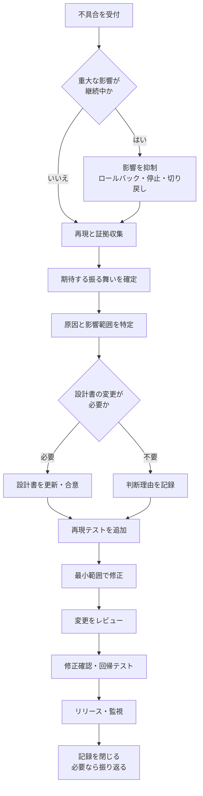

# バグ対応プロセス

## 概要

バグ対応は、発生している症状をコードで解消するだけの作業ではない。期待する振る舞いを確定し、原因と影響範囲を調査したうえで、設計書、実装、テストの整合性を回復する活動である。

本ドキュメントでは、バグの受付からリリース後の確認までを標準化し、修正漏れ、設計書と実装の不一致、修正による別機能への影響、同じバグの再発を防ぐことを目的とする。

## 目次

- [適用範囲](#適用範囲)
- [基本原則](#基本原則)
- [プロセスの全体像](#プロセスの全体像)
- [1. 不具合を受付・記録する](#1-不具合を受付記録する)
- [2. 緊急度を判定する](#2-緊急度を判定する)
- [3. 不具合を再現する](#3-不具合を再現する)
- [4. 期待する振る舞いを確定する](#4-期待する振る舞いを確定する)
- [5. 原因と影響範囲を特定する](#5-原因と影響範囲を特定する)
- [6. 設計書の変更要否を判定する](#6-設計書の変更要否を判定する)
- [7. 修正を検証するテストを準備する](#7-修正を検証するテストを準備する)
- [8. 最小範囲でコードを修正する](#8-最小範囲でコードを修正する)
- [9. 変更をレビューする](#9-変更をレビューする)
- [10. 修正確認テストと回帰テストを行う](#10-修正確認テストと回帰テストを行う)
- [11. リリースして監視する](#11-リリースして監視する)
- [12. 対応記録を閉じて振り返る](#12-対応記録を閉じて振り返る)
- [AIを利用する場合の確認事項](#aiを利用する場合の確認事項)
- [完了条件](#完了条件)
- [参考資料](#参考資料)

## 適用範囲

本プロセスは、既存システムの振る舞いが期待する状態と異なる場合に適用する。

ただし、次の事象は区別して扱う。

| 種類 | 状態 | 主な対応 |
| --- | --- | --- |
| バグ | 合意済みの仕様と実際の振る舞いが異なる | 原因を特定し、実装やデータなどを修正する |
| 仕様変更 | 正しい振る舞い自体を変更する | 要件と設計を変更してから実装する |
| 仕様の不足 | 期待する振る舞いが決まっていない | 関係者と仕様を決定してから設計・実装する |
| 本番障害 | 利用者や業務への重大な影響が継続している | 原因究明より先に影響を抑制する場合がある |

バグとして報告された内容が、調査の結果、仕様変更や仕様不足と判明することもある。受付時の分類を前提にせず、期待する振る舞いを確認した時点で分類を見直す。

## 基本原則

- 観測した事実と推測を分ける
- 原因を決める前に不具合を再現する
- コードではなく、合意済みの業務ルール、要件、設計を基準に正しい振る舞いを判断する
- 症状を隠すのではなく、症状を発生させた原因を修正する
- 設計書を必ず変更するのではなく、変更要否の確認を必ず行う
- 修正確認テストと回帰テストを分けて考える
- バグ修正と無関係な変更を同じプルリクエストへ含めない
- コードのマージではなく、本番で期待する振る舞いを確認した時点を完了とする

## プロセスの全体像



緊急時は影響の抑制を優先するが、その後は通常のプロセスへ戻り、原因調査、テスト、レビュー、ドキュメントの整合性確認を省略しない。

## 1. 不具合を受付・記録する

### 目的

誰が調査しても同じ事象を認識できるようにし、事実と推測の混在を防ぐ。

### 記録する内容

- 実際に起きた結果
- 本来期待する結果
- 再現手順
- 発生した環境、バージョン、日時
- 使用したアカウント、権限、入力データ
- 発生頻度
- ログ、エラー、画面キャプチャ
- 利用者や業務への影響
- 一時的な回避方法の有無

原因の候補を記載する場合は、「確認済みの事実」と「未確認の仮説」を明確に分ける。

### 完了条件

- 実際の結果と期待する結果の差を説明できる
- 調査に必要な証拠へアクセスできる
- 担当者と優先度が決まっている

## 2. 緊急度を判定する

### 目的

通常の調査を進める前に、利用者、データ、業務への影響を抑える必要があるか判断する。

### 判断する観点

- システムまたは主要機能が利用不能か
- データの破損、消失、漏えいが発生または継続する可能性があるか
- セキュリティや法令への影響があるか
- 影響する利用者数と業務範囲
- 時間の経過で影響が拡大するか
- 回避策が存在するか

重大な影響が継続している場合は、ロールバック、機能停止、設定変更、トラフィックの遮断など、元に戻せる方法を優先して影響を抑制する。緊急修正を行った場合も、影響が収まった後に通常のレビューと検証を行う。

### 完了条件

- 緊急度と判断理由が記録されている
- 緊急の場合は、影響を抑制する方針と責任者が決まっている
- 関係者への連絡範囲とタイミングが決まっている

## 3. 不具合を再現する

### 目的

修正前の失敗条件を明らかにし、修正後に同じ条件で解消を確認できるようにする。

### 実施内容

1. 本番と同じ条件を安全な環境で再現する
2. 入力、事前データ、操作、実際の結果を記録する
3. 条件を一つずつ変え、発生条件と発生しない条件を切り分ける
4. 再現できない場合は、ログや監視項目を追加して証拠を収集する

本番データを使用する場合は、機密情報や個人情報を持ち出さず、匿名化した再現データを用意する。

### 完了条件

- 再現手順を第三者が実行できる
- 修正前に失敗する条件を特定している
- 再現できない場合は、不足している証拠と次の調査方法が決まっている

## 4. 期待する振る舞いを確定する

### 目的

何をもって修正完了とするかを、実装前に合意する。

### 確認順序

1. 業務ルール
2. 要件と受け入れ条件
3. 設計書
4. テスト
5. 実装
6. 関係者の認識

資料同士に差異がある場合は、正本とその責任者を確認する。期待する振る舞いが決まっていない場合は、バグ修正としてコードへ着手せず、仕様を決定する。

### 完了条件

- 正しい入力、処理、出力を説明できる
- 正常系、異常系、境界値の期待結果が決まっている
- 判断に使用した正本と、決定者が記録されている

## 5. 原因と影響範囲を特定する

### 目的

表面に現れた症状だけを直すことや、同じ原因を持つ別の箇所を見落とすことを防ぐ。

### 原因を調査する観点

```text
直接原因
↓
直接原因が作り込まれた理由
↓
テストやレビューで検出できなかった理由
```

「担当者が間違えた」で終わらせず、前提情報、設計、レビュー観点、テスト、完了条件、運用プロセスに不足がなかったか確認する。

### 影響範囲を調査する観点

- 同じ関数、クラス、コンポーネント
- 同じ業務ルールを使用する機能
- フロントエンド、バックエンド、DB、外部API
- バッチや非同期処理
- 既存データと移行データ
- 権限、利用者種別、テナント
- 境界値、例外、同時実行
- 監視、運用手順、問い合わせ対応

### 完了条件

- 原因と、それを裏付ける証拠を説明できる
- 修正対象と確認対象を列挙している
- 既存データの補正要否を判断している

## 6. 設計書の変更要否を判定する

### 目的

設計書と実装の不一致を残さず、不要なドキュメント更新も避ける。

| 調査結果 | 設計書 | 実装・テスト |
| --- | --- | --- |
| 設計書は正しく、実装だけが誤っている | 原則として変更しない | 正しい設計に合わせて修正する |
| 設計書が誤っている | 正しい内容へ修正し、合意する | 更新後の設計に合わせて修正する |
| 設計書の条件や例外が不足している | 不足する内容を追記し、合意する | 明確になった条件を実装・テストする |
| 正しい仕様が決まっていない | 要件と設計を決定する | 決定前に着手しない |
| データや設定だけが誤っている | 関連する定義や手順の変更要否を確認する | データや設定を修正し、必要なテストを行う |

設計書を変更しない場合も、「影響を確認した結果、変更不要」とIssueまたはプルリクエストへ記録する。

### 完了条件

- 影響を受ける可能性がある設計書を確認している
- 変更する文書と変更しない文書、その理由が記録されている
- 変更が必要な場合は、実装前に正しい設計が合意されている

## 7. 修正を検証するテストを準備する

### 目的

元の不具合が直ったことを自動的に確認し、同じバグの再発を検出できるようにする。

### 実施内容

1. 不具合を再現するテストを追加する
2. 修正前のコードでテストが失敗することを確認する
3. 原因に近く、安定して検出できるテストレベルを選ぶ
4. 正常系だけでなく、関連する異常系と境界値を追加する

単体テストだけでは検出できない連携不具合の場合は、結合テストまたはE2Eテストを選ぶ。自動化が困難な場合は、手動確認の手順と期待結果を残す。

### 完了条件

- 修正前の不具合を検出できるテストまたは確認手順がある
- テストが期待する仕様と一致している
- テストデータと前提条件が明確になっている

## 8. 最小範囲でコードを修正する

### 目的

変更による副作用を抑え、レビューと切り戻しを容易にする。

### 実施内容

- 特定した原因を直接解消する
- 無関係な機能追加や大規模リファクタリングを分離する
- 一時的な回避処理を恒久対策として残さない
- ログ、エラー処理、監視への影響を確認する
- データ補正が必要な場合は、実行方法と切り戻し方法を用意する

### 完了条件

- 修正内容と原因の対応を説明できる
- 変更範囲が必要最小限である
- 修正と関係のない差分が含まれていない
- 必要なテストが同じ変更に含まれている

## 9. 変更をレビューする

### 目的

修正方針、コード、テスト、設計書が整合し、別の問題を作り込んでいないことを第三者の視点で確認する。

### レビュー観点

- 期待する振る舞いと修正内容が一致しているか
- 症状ではなく特定した原因を修正しているか
- 影響範囲の調査結果が妥当か
- 変更が必要最小限か
- 修正前に失敗するテストが追加されているか
- 正常系、異常系、境界値が確認されているか
- 設計書の変更要否が記録されているか
- 設計書、コード、テストが一致しているか
- リリースと切り戻しの方法が明確か

### 完了条件

- 必要なレビュアーが承認している
- 指摘事項が解消または合意されている
- 設計上の判断と判断理由が記録されている

## 10. 修正確認テストと回帰テストを行う

### 目的

元の不具合が解消したことと、修正によって既存機能へ悪影響が発生していないことを確認する。

| テスト | 確認する内容 |
| --- | --- |
| 修正確認テスト | 元の再現手順で不具合が発生しなくなったか |
| 回帰テスト | 修正した箇所や関連機能に新しい問題が発生していないか |

リスクに応じて、単体、結合、E2E、手動テストの範囲を決める。テストが成功したという結果だけでなく、実施した環境、対象バージョン、入力データも記録する。

### 完了条件

- 元の再現条件で期待する結果になる
- 関連する回帰テストが成功している
- 実施できなかったテストと残存リスクが記録されている

## 11. リリースして監視する

### 目的

検証環境だけでなく、実際の利用環境で問題が解消し、副作用が発生していないことを確認する。

### 実施内容

- リリース手順と担当者を確認する
- ロールバック条件と手順を用意する
- エラー率、処理時間、失敗件数などの確認項目を決める
- 必要に応じて段階的リリースや機能フラグを使用する
- リリース後に元の不具合と関連機能を確認する
- データ補正を行った場合は、件数と整合性を確認する

### 完了条件

- 本番で期待する振る舞いを確認している
- 監視項目に想定外の変化がない
- 利用者や関係者へ必要な連絡を行っている

## 12. 対応記録を閉じて振り返る

### 目的

修正内容と判断を後から追跡できるようにし、同じ原因による再発を防ぐ。

### Issueへ残す内容

- 原因
- 影響範囲
- 修正内容
- 設計書の変更要否と対象文書
- 実施したテスト
- リリース結果
- 残存リスク
- 関連するIssue、プルリクエスト、設計書へのリンク

重大、再発、検出困難、影響範囲が広いバグでは、個人の責任追及ではなく、検出、設計、テスト、レビュー、運用プロセスの改善を目的とした振り返りを行う。

### 完了条件

- 対応の経緯を第三者が追跡できる
- 再発防止策に担当者と期限が設定されている
- 対応後に得た知見が正本へ反映されている

## AIを利用する場合の確認事項

AIへバグの調査や修正を依頼する場合は、次の情報をコンテキストとして渡す。

- 実際の結果と期待する結果
- 再現手順
- 正本となる業務ルール、要件、設計書
- 原因調査で確認した事実
- 変更してよい範囲と変更してはいけない範囲
- 受け入れ条件
- 実行すべきテストと確認コマンド

AIの回答や生成コードは正本ではなく、検証対象として扱う。存在しない仕様を補完させず、仕様が不明な場合は未確定事項として報告させる。生成された変更は、人が設計書、実装、テストの整合性をレビューする。

## 完了条件

バグ対応のDefinition of Doneとして、次のチェックリストを使用する。

```markdown
- [ ] 実際の結果と期待する結果を記録した
- [ ] 再現手順または調査に必要な証拠を記録した
- [ ] 緊急度と利用者・業務への影響を判断した
- [ ] 正しい仕様と、その正本を確認した
- [ ] 原因と影響範囲を特定した
- [ ] 設計書の変更要否と判断理由を記録した
- [ ] 必要な設計書を更新した
- [ ] 修正前の不具合を検出するテストを追加した
- [ ] 原因に対して必要最小限の修正を行った
- [ ] コード、テスト、設計書のレビューを完了した
- [ ] 修正確認テストを実施した
- [ ] 回帰テストを実施した
- [ ] リリース後の動作と監視項目を確認した
- [ ] 対応記録と必要な再発防止策を残した
```

## 参考資料

- [ISTQB Certified Tester Foundation Level Syllabus v4.0.1](https://istqb.org/wp-content/uploads/2024/11/ISTQB_CTFL_Syllabus_v4.0.1.pdf)
  - 修正確認テストと回帰テストの目的を確認するために参照した
- [ISO/IEC/IEEE 29119-1:2022 Software testing — General concepts](https://www.iso.org/standard/81291.html)
  - ソフトウェアテストの一般概念に関する国際規格として参照した
- [Google SRE: Postmortem Culture](https://sre.google/sre-book/postmortem-culture/)
  - 重大なインシデントの影響、原因、対応、再発防止策を記録する考え方を参照した
- [Google Engineering Practices: Small CLs](https://google.github.io/eng-practices/review/developer/small-cls.html)
  - 変更を小さく保ち、関連するテストを同じ変更へ含める考え方を参照した。このガイドのリポジトリは2025年11月にアーカイブされているため、現在の標準ではなくGoogleが公開した実務知見として扱う
- [仕様書駆動開発のバグ修正・小規模変更フロー](./仕様書駆動開発/概要.md#バグ修正小規模変更フロー)
  - 変更規模に応じて仕様書の作成・更新範囲を変えるリポジトリ内の方針として参照した
