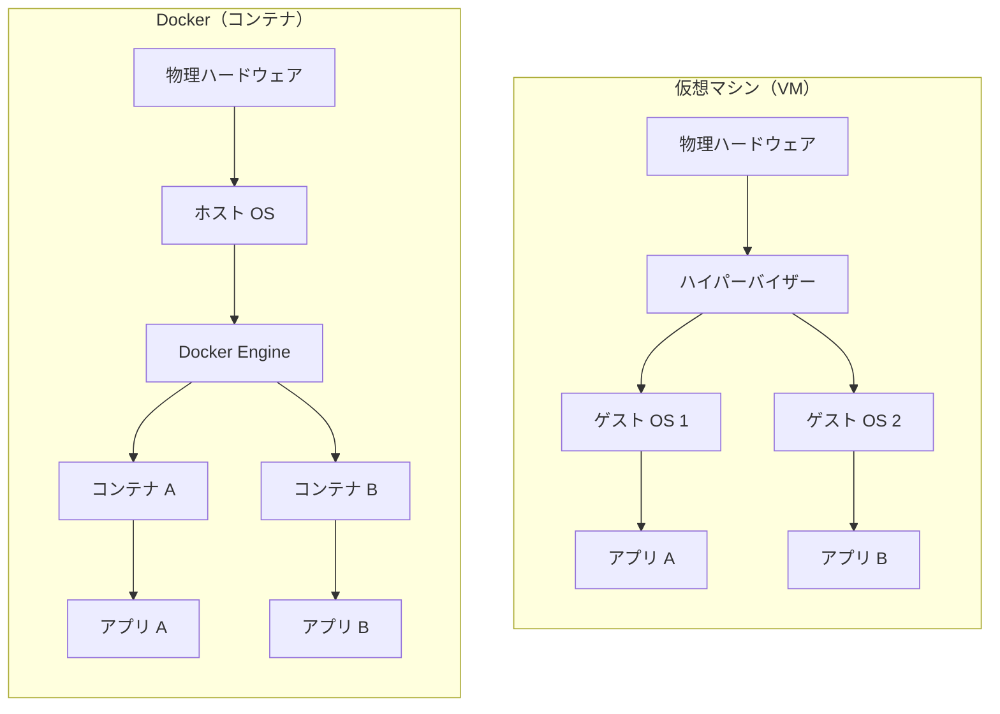
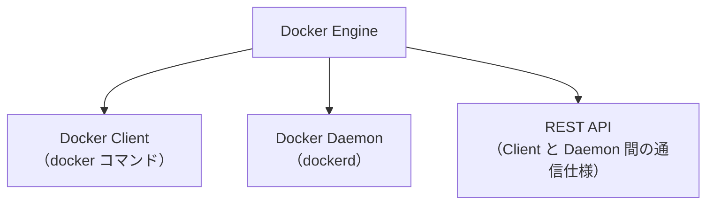
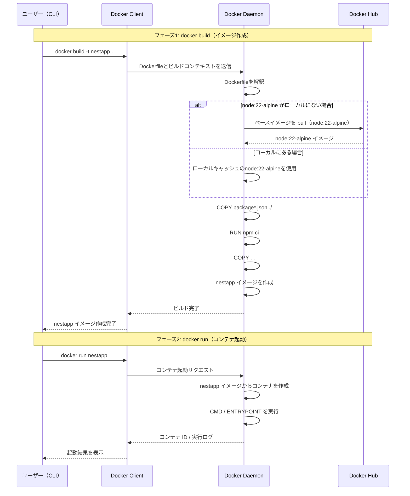

# Docker 基礎

## 目次

- [Docker 基礎](#docker-基礎)
  - [概要](#概要)
  - [目次](#目次)
  - [1. なぜ Docker が必要か](#1-なぜ-docker-が必要か)
    - [「環境差異」という問題](#環境差異という問題)
  - [2. 基本概念](#2-基本概念)
    - [2.1 コンテナとは](#21-コンテナとは)
    - [2.2 イメージとは](#22-イメージとは)
    - [2.3 レジストリとは](#23-レジストリとは)
    - [2.4 Dockerfile とは](#24-dockerfile-とは)
    - [2.5 コマンド実行時の流れ](#25-コマンド実行時の流れ)
  - [3. 仮想マシンとの違い](#3-仮想マシンとの違い)
  - [4. Docker のアーキテクチャ](#4-docker-のアーキテクチャ)
  - [5. 基本的なコマンド](#5-基本的なコマンド)
    - [イメージ操作](#イメージ操作)
    - [コンテナ操作](#コンテナ操作)
    - [ボリューム（データの永続化）](#ボリュームデータの永続化)
  - [6. Dockerfile の書き方](#6-dockerfile-の書き方)
    - [主要な命令一覧](#主要な命令一覧)
    - [Node.js アプリの基本例](#nodejs-アプリの基本例)
    - [マルチステージビルド（本番環境向け）](#マルチステージビルド本番環境向け)
  - [7. Docker Compose](#7-docker-compose)
    - [compose.yaml の例（Node.js + MySQL）](#composeyaml-の例nodejs--mysql)
    - [主要なコマンド](#主要なコマンド)
  - [8. 参考資料](#8-参考資料)

---

## 概要

Docker は、**アプリケーションとその実行環境をコンテナという軽量な単位にパッケージ化し、どこでも同じように動かせるプラットフォーム**です。

「自分のPCでは動くのに本番環境では動かない」という問題を解消するために生まれました。Docker を使うことで、開発・テスト・本番のすべての環境で同一の実行環境を保証できます。

---

## 1. なぜ Docker が必要か

### 「環境差異」という問題

従来の開発では、開発者ごとに異なる OS やライブラリのバージョンが入っており、「自分の PC では動く（Works on my machine）」という問題が頻繁に起きていました。

```
【Docker がない場合】
開発者A: Node.js 18 + Ubuntu 22.04 → 動く
開発者B: Node.js 20 + macOS      → エラー
本番環境: Node.js 16 + CentOS 7  → 動かない

【Docker がある場合】
全員が同じ Docker イメージを使う → どこでも同じ動作が保証される
```

**なぜコンテナが解決するのか？**  
アプリケーションは「コード」だけでなく、「実行環境（OS ライブラリ・依存パッケージ・設定）」も含めて動いています。Docker はこの実行環境ごとパッケージ化するため、環境差異が生まれません。

---

## 2. 基本概念

### 2.1 コンテナとは

コンテナとは、**アプリケーションとその実行に必要なすべてのもの（ライブラリ・設定・ランタイム）を 1 つにまとめた、独立した実行単位**です。

Docker 公式の定義では、コンテナは「隔離されたプロセス」です。React フロントエンド・Python バックエンド・PostgreSQL といった複数の技術スタックを使う場合、各要素が独立した環境で動作します。

コンテナには 4 つの重要な性質があります。

| 性質               | 内容                                               |
| ------------------ | -------------------------------------------------- |
| **自己完結性**     | 必要なすべてのファイル・ライブラリ・設定を内包する |
| **隔離性**         | 他のコンテナやホストマシンに影響を与えない         |
| **独立性**         | 各コンテナは個別に管理・削除できる                 |
| **ポータビリティ** | 開発環境から本番環境まで同じように動作する         |

```
ホスト OS
├── コンテナA（Node.js アプリ）
├── コンテナB（Python アプリ）
└── コンテナC（MySQL）
```

**なぜホスト OS のカーネルを共有できるのか？**  
Linux の「名前空間（namespace）」と「cgroups」という機能を使い、プロセスとファイルシステムをコンテナ単位で分離しています。OS 自体は共有しつつ、それぞれのコンテナからは独立した環境に見えます。

### 2.2 イメージとは

イメージとは、**コンテナを実行するために必要なすべてのファイル・バイナリ・ライブラリ・設定を含む、標準化されたパッケージ（設計図）**です。

イメージには 2 つの重要な原則があります。

**1. 不変性（Immutability）**  
作成されたイメージは変更できません。変更を加えるには新しいイメージを作成するか、既存イメージの上に新しいレイヤーを追加します。

**2. レイヤー構造**  
各レイヤーはファイルシステムの変更セット（ファイルの追加・削除・変更）を表します。この構造により、既存イメージを拡張できます。

```
node:22-alpine イメージ（ベース）
└── COPY package.json（レイヤー追加）
    └── RUN npm install（レイヤー追加）
        └── COPY . .（レイヤー追加）  ← 完成したアプリイメージ
```

**なぜレイヤー構造なのか？**  
差分のみを保持するため、共通レイヤーは複数のイメージ間で再利用されます。ストレージ効率が高く、ビルドも高速になります。

イメージは `名前:タグ` の形式で識別します。

```bash
node:22-alpine   # Node.js 22 の Alpine Linux 版
mysql:8.0        # MySQL 8.0
ubuntu:22.04     # Ubuntu 22.04
```

### 2.3 レジストリとは

レジストリとは、**コンテナイメージを保存・共有するための集中管理場所**です。コンピュータ上でローカル管理することもできますが、他のマシンや人と共有するためにはレジストリが必要です。

**レジストリとリポジトリの違い**

| 用語           | 説明                                                                           |
| -------------- | ------------------------------------------------------------------------------ |
| **レジストリ** | イメージ全体の管理場所（例：Docker Hub）                                       |
| **リポジトリ** | レジストリの中の、関連イメージの集合（プロジェクト単位のフォルダのようなもの） |

**主なレジストリ**

| レジストリ                            | 種類         | 説明                                                       |
| ------------------------------------- | ------------ | ---------------------------------------------------------- |
| [Docker Hub](https://hub.docker.com/) | パブリック   | デフォルトのレジストリ。10万以上のイメージが公開されている |
| Amazon ECR                            | プライベート | AWS が提供するマネージドレジストリ                         |
| Azure ACR                             | プライベート | Azure が提供するマネージドレジストリ                       |
| Google GCR                            | プライベート | Google Cloud が提供するマネージドレジストリ                |

### 2.4 Dockerfile とは

Dockerfile とは、**コンテナイメージを作るための手順書（テキストファイル）**です。「どのベースイメージを使うか」「どのファイルをコピーするか」「どのコマンドを実行するか」を命令として記述し、`docker build` コマンドでイメージを自動生成します。

```
Dockerfile（手順書） → docker build → イメージ（設計図） → docker run → コンテナ（実行中）
```

### 2.5 コマンド実行時の流れ

> 記載予定

---

## 3. 仮想マシンとの違い

Docker は VMware・VirtualBox などの**仮想マシン（VM）とよく混同されます**が、仕組みが根本的に異なります。



| 比較項目       | 仮想マシン                      | Docker                     |
| -------------- | ------------------------------- | -------------------------- |
| **OS の扱い**  | ゲスト OS を丸ごと持つ          | ホスト OS のカーネルを共有 |
| **サイズ**     | 数 GB 〜 数十 GB                | 数 MB 〜 数百 MB           |
| **起動時間**   | 数分                            | 数秒                       |
| **隔離レベル** | 強い（OS レベル）               | やや弱い（プロセスレベル） |
| **用途**       | OS 自体が異なる環境が必要な場合 | アプリの実行環境の統一     |

**なぜ Docker が軽量なのか？**  
VM は OS を丸ごと抱えますが、Docker はホスト側の Linux カーネルを使い回し、アプリに必要な差分だけをコンテナに持たせるためです。

---

## 4. Docker のアーキテクチャ

Docker Engine は、**Docker を動かすための中心的なソフトウェア**です。単一のプログラムではなく、以下の3つのコンポーネントで構成されます。



| コンポーネント | 役割 |
| --- | --- |
| **Docker Engine** | Docker を動かす中心的なソフトウェア。以下3つで構成される |
| ┣ **Docker Client** | `docker` コマンドを受け付ける CLI |
| ┣ **Docker Daemon** | イメージ管理・コンテナ起動などを担うバックグラウンドプロセス |
| ┗ **REST API** | Client と Daemon の間の通信仕様 |
| **Docker Registry** | イメージの保存・配布場所（Engine の外側） |

**デーモン（Daemon）とは？**  
バックグラウンドで常時起動し続けるプロセスのことです。通常のプログラムはユーザーが操作した時だけ動きますが、デーモンは誰も操作していなくても裏側で動き続け、リクエストが来たら応答します。Linux では慣例的にプロセス名の末尾に `d` を付けます（`dockerd`、`sshd` など）。

**なぜ3つに分かれているのか？**  
Client と Daemon を REST API 経由で分離することで、CLI からだけでなくアプリケーションや外部ツールからも Docker を操作できます。また、Daemon をリモートマシンに置いてリモート操作するといった構成も可能になります。

---

### コマンド実行時の流れ



#### フェーズ1: docker build（イメージ作成）

1. ユーザーが `docker build -t nestapp .` を実行する
2. Docker Client が Dockerfile とビルドコンテキストを Docker Daemon に送信する
3. Docker Daemon が Dockerfile を解釈する
4. **node:22-alpine がローカルにない場合**、Docker Daemon が Docker Hub からベースイメージ（node:22-alpine）を pull する。**ローカルにある場合**はキャッシュをそのまま使用する
5. Docker Daemon が `COPY package*.json ./` を実行する
6. Docker Daemon が `RUN npm ci` を実行する
7. Docker Daemon が `COPY . .` を実行する
8. Docker Daemon が nestapp イメージを作成する
9. Docker Daemon がビルド完了を Docker Client に返す
10. Docker Client がユーザーに nestapp イメージ作成完了を表示する

#### フェーズ2: docker run（コンテナ起動）

11. ユーザーが `docker run nestapp` を実行する
12. Docker Client がコンテナ起動リクエストを Docker Daemon に送信する
13. Docker Daemon が nestapp イメージからコンテナを作成する
14. Docker Daemon が `CMD` / `ENTRYPOINT` を実行する
15. Docker Daemon がコンテナ ID と実行ログを Docker Client に返す
16. Docker Client がユーザーに起動結果を表示する

---

## 5. 基本的なコマンド

### イメージ操作

```bash
# イメージを検索
docker search nginx

# イメージをダウンロード
docker pull nginx

# ローカルのイメージ一覧を表示
docker images

# イメージのレイヤー履歴を確認
docker image history nginx

# イメージを削除
docker rmi nginx

# Dockerfile からイメージをビルド
docker build -t myapp:1.0 .
```

### コンテナ操作

```bash
# コンテナを起動（イメージがなければ自動で pull）
docker run nginx

# バックグラウンドで起動（-d）、ポートを公開（-p ホスト:コンテナ）
docker run -d -p 8080:80 nginx

# 起動中のコンテナ一覧
docker ps

# すべてのコンテナ一覧（停止中含む）
docker ps -a

# コンテナを停止
docker stop <コンテナID>

# コンテナを削除
docker rm <コンテナID>

# 起動中のコンテナにシェルで入る
docker exec -it <コンテナID> bash

# コンテナのログを確認
docker logs <コンテナID>
```

> コンテナ ID は完全な値でなく、ユニークに識別できる最小限の文字数で指定できます。

### ボリューム（データの永続化）

```bash
# ボリュームを作成
docker volume create mydata

# ボリュームをマウントして起動
docker run -v mydata:/var/lib/mysql mysql:8.0

# ホストのディレクトリをマウント（開発時のホットリロードに便利）
docker run -v $(pwd):/app node:22 node /app/server.js
```

**なぜボリュームが必要か？**  
コンテナを削除するとコンテナ内のデータは消えます。DB のデータや生成ファイルを永続化するためにボリュームを使います。

---

## 6. Dockerfile の書き方

### 主要な命令一覧

| 命令                            | 説明                                                     |
| ------------------------------- | -------------------------------------------------------- |
| `FROM <image>`                  | ビルドのベースとなるイメージを指定                       |
| `WORKDIR <path>`                | 以降の命令を実行する作業ディレクトリを設定               |
| `COPY <host-path> <image-path>` | ホストのファイルをコンテナイメージにコピー               |
| `RUN <command>`                 | イメージビルド時に実行するコマンド                       |
| `ENV <name> <value>`            | 環境変数を設定                                           |
| `EXPOSE <port>`                 | 公開するポートを宣言                                     |
| `USER <user>`                   | 実行ユーザーを設定（セキュリティのため root 以外を推奨） |
| `CMD ["command", "arg"]`        | コンテナ起動時のデフォルトコマンドを設定                 |

### Node.js アプリの基本例

Docker 公式チュートリアルで紹介されているシンプルな例です。

```dockerfile
FROM node:22-alpine
WORKDIR /app
COPY . .
RUN yarn install --production
CMD ["node", "./src/index.js"]
```

> 公式ドキュメントでは「このDockerfileは本番環境向けではない」と明記されています。本番対応にはビルドキャッシュの最適化・非 root ユーザーでの実行・マルチステージビルドなどが必要です。

### マルチステージビルド（本番環境向け）

ビルド環境と実行環境を分離し、最小限のイメージを作ります。

```dockerfile
# --- ステージ1: ビルド ---
FROM node:22 AS builder
WORKDIR /app
COPY package*.json ./
RUN npm install
COPY . .
RUN npm run build

# --- ステージ2: 実行 ---
FROM node:22-alpine
WORKDIR /app
# ビルド成果物だけをコピー
COPY --from=builder /app/dist ./dist
COPY --from=builder /app/node_modules ./node_modules
EXPOSE 3000
CMD ["node", "dist/server.js"]
```

**なぜマルチステージビルドを使うのか？**  
ビルドツールやテストライブラリは実行には不要です。それらを含まない最小イメージにすることで、セキュリティリスクの低減とデプロイ速度の向上が図れます。

---

## 7. Docker Compose

Docker Compose は、**複数のコンテナをまとめて定義・起動するためのツール**です。`compose.yaml` に構成を記述することで、複数の `docker run` コマンドを個別に実行する代わりに、宣言的に一括管理できます。

**Dockerfile との違い**

| ツール           | 役割                                     |
| ---------------- | ---------------------------------------- |
| **Dockerfile**   | コンテナイメージを構築する手順書         |
| **compose.yaml** | 実行中のコンテナ群を定義する設定ファイル |

**なぜ Compose が必要か？**  
Web アプリは通常、アプリサーバー・DB・キャッシュなど複数コンポーネントで構成されます。各コンテナは「1 つのタスクに特化すべき」という設計哲学があるため、複数コンテナを効率よく管理する仕組みが必要です。

### compose.yaml の例（Node.js + MySQL）

```yaml
services:
  app:
    build: .                      # カレントの Dockerfile でビルド
    ports:
      - "3000:3000"               # ホスト:コンテナ のポートマッピング
    environment:
      DATABASE_URL: mysql://user:pass@db:3306/mydb
    depends_on:
      - db                        # db が起動してから app を起動

  db:
    image: mysql:8.0
    environment:
      MYSQL_ROOT_PASSWORD: rootpass
      MYSQL_DATABASE: mydb
      MYSQL_USER: user
      MYSQL_PASSWORD: pass
    volumes:
      - db_data:/var/lib/mysql    # データを永続化

volumes:
  db_data:
```

### 主要なコマンド

```bash
# すべてのサービスをバックグラウンドで起動
docker compose up -d

# イメージを再ビルドして起動
docker compose up -d --build

# ログを確認
docker compose logs -f

# すべてのサービスを停止・削除
docker compose down

# ボリュームも含めて完全削除
docker compose down --volumes
```

> `compose.yaml` をリポジトリに含めることで、誰でも `docker compose up -d` の 1 コマンドで同じ環境を構築できます。

---

## 8. 参考資料

- [Docker 公式 Get started](https://docs.docker.com/get-started/)
- [コンテナとは - Docker Docs](https://docs.docker.com/get-started/docker-concepts/the-basics/what-is-a-container/)
- [イメージとは - Docker Docs](https://docs.docker.com/get-started/docker-concepts/the-basics/what-is-an-image/)
- [レジストリとは - Docker Docs](https://docs.docker.com/get-started/docker-concepts/the-basics/what-is-a-registry/)
- [Docker Compose とは - Docker Docs](https://docs.docker.com/get-started/docker-concepts/the-basics/what-is-docker-compose/)
- [Dockerfile の書き方 - Docker Docs](https://docs.docker.com/get-started/docker-concepts/building-images/writing-a-dockerfile/)
- [Docker Hub](https://hub.docker.com/)
