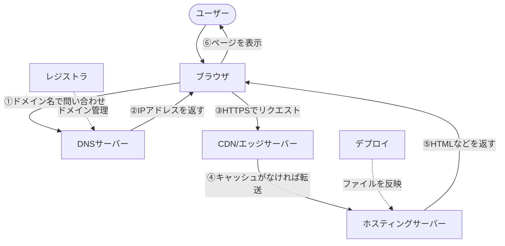
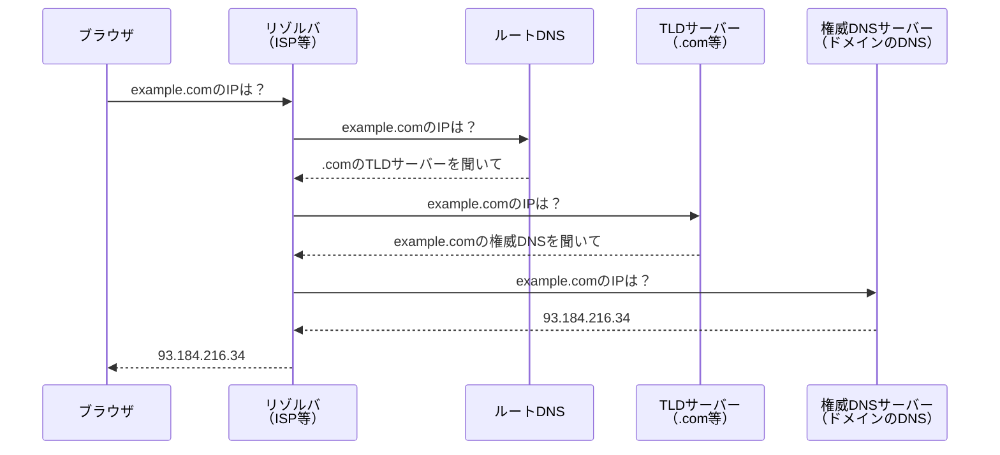
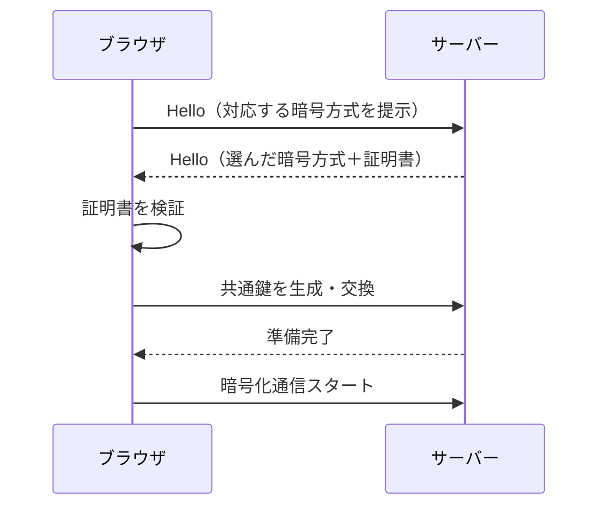
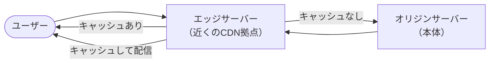
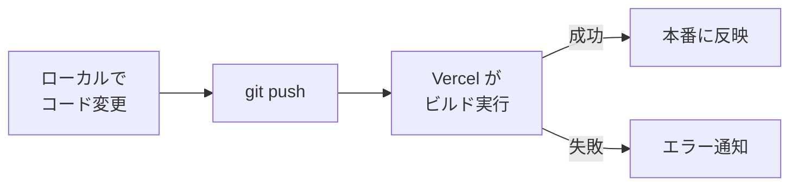
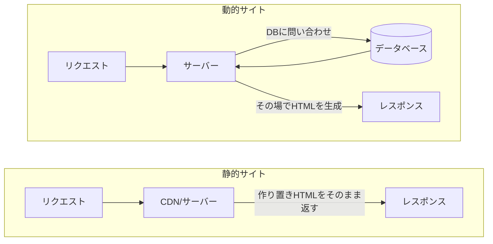
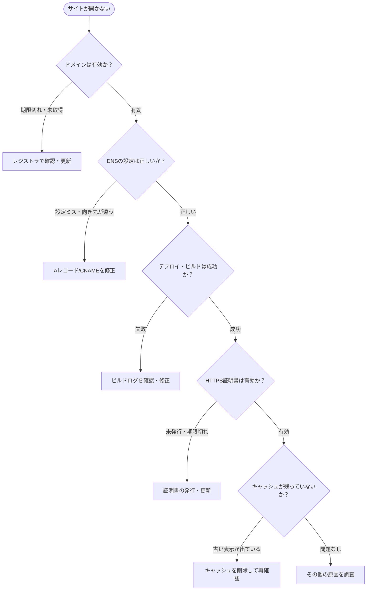

# Webサイト公開の基礎知識

## 概要

Webサイトを公開するには、いくつかの仕組みが連携して動いています。このドキュメントでは、ドメインの取得からHTTPSでの公開・更新反映まで、初心者がつまずきやすいポイントを順番に解説します。

---

## 目次

| # | トピック | 概要 |
|---|---------|------|
| 1 | [全体像](#1-全体像webサイトが表示されるまでの流れ) | ブラウザからサーバーまでの流れ |
| 2 | [レジストラ](#2-レジストラ) | ドメインを取得する窓口 |
| 3 | [ドメイン](#3-ドメイン) | サイトの住所 |
| 4 | [DNS](#4-dns) | 住所から接続先への案内 |
| 5 | [DNSレコード](#5-dnsレコード) | DNSの具体的な設定行 |
| 6 | [サブドメイン](#6-サブドメイン) | 同じ住所の枝分かれ |
| 7 | [ホスティング](#7-ホスティング) | サイトの置き場所 |
| 8 | [SSL/TLS](#8-ssltls) | 通信の暗号化 |
| 9 | [CDN・キャッシュ](#9-cdnキャッシュ) | 速く届けるための仕組み |
| 10 | [デプロイ](#10-デプロイ) | 更新を反映する作業 |
| 11 | [静的サイトと動的サイト](#11-静的サイトと動的サイト) | 先に作るか、その場で作るか |
| 12 | [トラブル時の切り分け](#12-トラブル時の切り分け) | どの層で壊れているかを探す |

---

## 1. 全体像：Webサイトが表示されるまでの流れ

Webサイトはざっくりこの流れで動きます。

1. ドメイン名を取る
2. DNSで「どこへ行くか」を決める
3. ホスティング先にサイトを置く
4. HTTPSで安全に見せる
5. デプロイで更新を反映する

ブラウザはURLを使ってアクセスし、DNSで接続先を調べ、サーバーからHTMLなどのリソースを受け取って表示します。HTTPはWebの基本的な通信方式です。



各コンポーネントの役割をひとことで言うと：

| コンポーネント | 役割のたとえ |
|--------------|------------|
| レジストラ | 住所を借りる窓口 |
| ドメイン | サイトの住所 |
| DNS | 住所の案内係 |
| ホスティング | 建物そのもの |
| SSL/TLS | 通信の鍵 |
| CDN | 近所の配送拠点 |
| デプロイ | 荷物を建物に運び込む作業 |

---

## 2. レジストラ

### 概要

レジストラは、独自ドメインを**登録・更新・移管**する相手です。ICANNはレジストラを「ドメイン登録サービスを提供する事業者」と説明しており、登録者はレジストラと契約してドメインを管理します。

レジストラは **registry（レジストリ）** とは別物です。registryは `.com` など TLD（トップレベルドメイン）全体の台帳側を管理する組織で、レジストラはその台帳へ登録の代行を行う事業者です。

> **初心者向けに言うと：「住所を借りる窓口」**
> `example.com` を買うときに使うのがレジストラです。

### レジストラでやること

| 操作 | 内容 |
|------|------|
| 購入 | ドメイン名を取得する |
| 更新 | 期限が切れないよう毎年更新する |
| 移管 | 別のレジストラへドメインを移す |
| 連絡先管理 | ドメインに紐づく登録者情報を管理する |

### なぜレジストラが必要か？

ドメイン名はインターネット全体でユニークである必要があります。同じ名前を複数の人が使えないよう、ICANNが認定した事業者（レジストラ）を通じて管理することで、世界規模での一意性が保たれています。

> **注意：** レジストラはサイト本体のファイルを置く場所ではありません。ファイルの置き場所はホスティングです。

---

## 3. ドメイン

### 概要

ドメインはWebサイトの**人が覚えやすい名前**です。MDNはドメイン名を「インターネット上のサーバーに付ける人間向けの住所のようなもの」と説明しています。

```
example.com
developer.mozilla.org
```

> **初心者向けに言うと：「サイトの住所」**

### ドメイン名の構造

```
developer  .  mozilla  .  org
    ↑             ↑          ↑
サブドメイン   セカンドレベル  トップレベル
              ドメイン(SLD)   ドメイン(TLD)
```

### なぜドメインが必要か？

IPアドレス（例：`93.184.216.34`）は人間には覚えにくいため、ドメイン名という人間向けの名前を使います。また、ドメインを持っていれば、**あとでホスティング先をVercelから別サービスへ変えても、同じドメイン名を使い続けられる**ことがあります。

ドメインはサイトの**名前資産**です。ホスティングは変えられますが、ドメインを変えるとURLが変わり、SEOや既存リンクに影響が出ます。

---

## 4. DNS

### 概要

DNSはドメイン名を実際の接続先に変換する仕組みです。Cloudflareは DNSを「インターネットの電話帳」と表現しており、ブラウザが `example.com` のような名前から接続先のIPアドレスや別名を調べるために使います。

> **初心者向けに言うと：「この住所の建物はどこにあるかを案内する係」**
> ドメインが住所名、DNSが道案内です。

### DNS名前解決のフロー



### なぜDNSが必要か？

ドメインを持っていても、DNSが正しく設定されていないと、ブラウザはどこへ行けばいいかわかりません。DNSはインターネット全体で使われる分散データベースで、ドメインとIPアドレスのマッピングを管理します。

> **TTL（Time To Live）に注意：** DNSの設定変更は即座には反映されません。TTLの値（秒単位）だけキャッシュが残るため、変更後に反映されるまで数分〜数時間かかることがあります。

---

## 5. DNSレコード

### 概要

DNSレコードはDNSに入れる**個別の設定項目**です。CloudflareはDNS recordsを「ドメインに関する情報で、Webサイトや他のサービスを利用可能にするもの」と説明しています。

DNSが「住所案内係」なら、DNSレコードは**案内メモの1行1行**です。

### 初心者が覚えるべき3種類

| レコード種別 | 役割 | 設定例 |
|------------|------|--------|
| **A** | ドメインをIPアドレスへ向ける | `example.com → 93.184.216.34` |
| **CNAME** | 別ドメインへの別名（エイリアス） | `www.example.com → example.com` |
| **TXT** | テキスト情報（所有確認・メール認証など） | `v=spf1 include:...` |

### 具体的なイメージ

```
「wwwはここへ」       → A / CNAMEレコード
「blogはこっちへ」    → CNAMEレコード
「所有確認コードはこれ」→ TXTレコード
```

### なぜレコードを使い分けるか？

用途が違うからです。IPアドレスを直接指定したい場合はAレコード、Vercelなど別ドメインへ向けたい場合はCNAME、Google Search ConsoleやSendGridなどのサービス認証はTXTレコードを使います。

---

## 6. サブドメイン

### 概要

サブドメインはメインのドメインの**前に付ける枝分かれした名前**です。

```
blog.example.com   → blog が サブドメイン
shop.example.com   → shop が サブドメイン
admin.example.com  → admin が サブドメイン
```

> **初心者向けに言うと：「同じ土地の中の別の部屋や別館」**

### なぜサブドメインを使うか？

1つのドメインの中で**役割を分けたい**ときに便利です。本体サイトは `example.com`、ブログは `blog.example.com`、管理画面は `admin.example.com` のように分けられます。

それぞれ別のホスティングやサーバーへ向けることもでき、システムを独立して運用できます。

---

## 7. ホスティング

### 概要

ホスティングはサイトのファイルやアプリを**実際に置いて公開する場所**です。MDNはWebサーバーが「HTML、画像、CSS、JavaScriptなどのサイトファイルを保存し、ブラウザに配信する」と説明しています。

> **初心者向けに言うと：「建物そのもの」**
> レジストラで住所を取り、DNSで案内し、その案内先としてホスティング先があります。ホスティングがないと、住所だけあっても中身がない状態になります。

VercelやCloudflare Pagesのようなサービスは、その置き場所を簡単に使えるようにしたホスティングの一種です。

### 主なホスティング種別

| 種別 | 概要 | 向いているケース |
|------|------|----------------|
| 静的ホスティング | HTMLなどをそのまま配信 | ブログ、ランディングページ |
| サーバーレス | 関数単位で動的処理 | API、バックエンド処理 |
| VPS / クラウド | 仮想サーバーを借りて自由に構成 | 複雑な要件、DB込みのアプリ |

---

## 8. SSL/TLS

### 概要

SSL/TLSはブラウザとサーバーの通信を**安全に暗号化する仕組み**です。MDNはTLSを「信頼できないネットワーク上でも安全に通信するための標準プロトコル」と説明しており、HTTPをTLSで保護したものがHTTPSです。

> **初心者向けに言うと：「住所に行く途中の会話を暗号化する仕組み」**
> `http://` より `https://` が安全なのはこのためです。

### TLSハンドシェイクの流れ（簡略版）



### なぜHTTPSが必要か？

`http://` は通信内容が平文でやり取りされるため、途中で盗聴・改ざんされる可能性があります。`https://` ではTLSで暗号化されるため安全です。

現在の主要なホスティング（Vercel、Cloudflare Pages等）はTLS証明書の発行・更新をかなり自動化しています。**「公開するならHTTPSが基本」** という認識を持っていれば十分です。

---

## 9. CDN・キャッシュ

### CDNとは

CDNは世界のあちこちにあるサーバーへコンテンツを近くに置いて、**速く届ける仕組み**です。CloudflareはCDNを「エンドユーザーの近くでコンテンツをキャッシュする分散サーバー群」と説明しています。HTML、JavaScript、CSS、画像、動画などの配信を高速化できます。

### キャッシュとは

キャッシュは一度取得したレスポンスを**保存して再利用する仕組み**です。MDNはHTTPキャッシュを「過去のレスポンスを再利用して速度向上やサーバー負荷軽減につなげる仕組み」と説明しています。

> **初心者向けに言うと：**
> - CDNは「近所の配送拠点」
> - キャッシュは「前に取り寄せたものを手元に残しておく」

### CDNのリクエスト処理フロー



### 注意点

キャッシュが効いていると**更新したのに古い表示が出る**ことがあります。そういうときはキャッシュの削除（パージ）や待ち時間（TTLの経過）が必要になることがあります。

---

## 10. デプロイ

### 概要

デプロイは作ったコードやファイルを**公開先へ反映する作業**です。Vercelの公式docsでは、CLIからのデプロイや、GitHub/GitLabなどへのpushをきっかけにした自動デプロイが案内されています。1つのプロジェクトに本番デプロイと事前確認用デプロイを持てる構成も説明されています。

> **初心者向けに言うと：「新しいサイトの中身を、建物に運び込んで公開状態へすること」**

**ホスティングは置き場所、デプロイは更新を反映する操作**と覚えると混ざりにくいです。

### Astro + GitHub + Vercel の場合のデプロイフロー



`git push` をすると自動でビルドされて公開まで進みます。

### デプロイ方式の比較

| 方式 | 概要 | 向いているケース |
|------|------|----------------|
| 手動デプロイ | CLIやGUIで手動実行 | 小規模・個人プロジェクト |
| 自動デプロイ（CI/CD） | pushをトリガーに自動実行 | チーム開発・頻繁な更新 |
| プレビューデプロイ | 本番とは別にPRごとに確認環境を作る | レビュー・動作確認 |

### なぜデプロイの自動化が重要か？

手動デプロイは手順ミスや忘れが起きやすいです。自動化することで「pushしたら必ず最新が反映される」状態が保たれ、チーム全員が同じ手順を踏むことになります。

---

## 11. 静的サイトと動的サイト

### 静的サイト

静的サイトはあらかじめ作っておいたHTMLなどを**そのまま配る**方式です。Vercelのdocsでは、ルートがstatic・cacheable・dynamicのどれかとして扱われ、静的なものは事前に配信しやすい前提が説明されています。

### 動的サイト

動的サイトはアクセス時にサーバー側で処理して、**その場でHTMLやデータを返す**方式です。MDNはserver-side programmingを「データベースなどを使って動的にHTMLやJSONを返す仕組み」として説明しています。

### リクエスト処理の違い



> **初心者向けに言うと：**
> - 静的サイト = 「作り置きのお弁当をすぐ渡す」
> - 動的サイト = 「注文を受けてから作る」

アフィリエイトサイトやブログの多くは、最初は静的サイトでもかなり運用できます。検索向け・表示速度の観点でも、まず静的から入るのは自然な選択です。

---

## 12. トラブル時の切り分け

これは技術名ではなく、**問題が起きたときにどの層が悪いかを順番に見る考え方**です。

Web は URL から DNS で接続先を調べ、サーバーへ HTTP リクエストを送り、返ってきた内容をブラウザが表示する流れで動きます。問題もこの順で分けて考えると整理しやすいです。

### 診断フロー



### 確認ポイントまとめ

| 確認順 | 確認内容 | チェック方法 |
|--------|---------|------------|
| 1. ドメイン | 期限切れや取得漏れはないか | レジストラの管理画面 |
| 2. DNS | A / CNAME / TXT の設定ミスはないか | `dig example.com` コマンド |
| 3. ホスティング / デプロイ | ビルドやデプロイが失敗していないか | Vercel等のデプロイログ |
| 4. SSL/TLS | HTTPS証明書の発行・反映が終わっているか | ブラウザの鍵マーク・証明書情報 |
| 5. キャッシュ | 修正したのに古い表示が残っていないか | ハードリロード・CDNのパージ |

```bash
# DNS確認の例
dig example.com
dig www.example.com CNAME

# TXT レコードの確認例（所有確認等）
dig example.com TXT
```

---

## 参考情報源

| # | タイトル | URL |
|---|---------|-----|
| 1 | How the web works - MDN | https://developer.mozilla.org/en-US/docs/Learn_web_development/Getting_started/Web_standards/How_the_web_works |
| 2 | About Registrars - ICANN | https://www.icann.org/resources/pages/what-2013-05-03-en |
| 3 | Information for Domain Name Registrants - ICANN | https://www.icann.org/registrants |
| 4 | What is a Domain Name? - MDN | https://developer.mozilla.org/en-US/docs/Learn_web_development/Howto/Web_mechanics/What_is_a_domain_name |
| 5 | What is DNS? - Cloudflare | https://www.cloudflare.com/learning/dns/what-is-dns/ |
| 6 | What is a web server? - MDN | https://developer.mozilla.org/en-US/docs/Learn_web_development/Howto/Web_mechanics/What_is_a_web_server |
| 7 | Transport Layer Security (TLS) - MDN | https://developer.mozilla.org/en-US/docs/Web/Security/Defenses/Transport_Layer_Security |
| 8 | Deploying to Vercel | https://vercel.com/docs/deployments |
| 9 | Deploying Git Repositories with Vercel | https://vercel.com/docs/git |
| 10 | DNS records - Cloudflare Docs | https://developers.cloudflare.com/dns/manage-dns-records/ |
| 11 | What is a DNS CNAME record? - Cloudflare | https://www.cloudflare.com/learning/dns/dns-records/dns-cname-record/ |
| 12 | Domain - Glossary - MDN | https://developer.mozilla.org/en-US/docs/Glossary/Domain |
| 13 | What is a CDN? - Cloudflare | https://www.cloudflare.com/learning/cdn/what-is-a-cdn/ |
| 14 | HTTP caching - MDN | https://developer.mozilla.org/en-US/docs/Web/HTTP/Guides/Caching |
| 15 | Incremental Static Regeneration (ISR) - Vercel | https://vercel.com/docs/incremental-static-regeneration |
| 16 | Introduction to the server side - MDN | https://developer.mozilla.org/en-US/docs/Learn_web_development/Extensions/Server-side/First_steps/Introduction |
| 17 | Projects overview - Vercel | https://vercel.com/docs/projects |
| 18 | Transfer domain out from Cloudflare - Cloudflare Docs | https://developers.cloudflare.com/registrar/account-options/transfer-out-from-cloudflare/ |
| 19 | How do I transfer my domain to Vercel? - Vercel | https://vercel.com/kb/guide/how-do-i-transfer-my-domain-to-vercel |
| 20 | Transfer Policy - ICANN | https://www.icann.org/en/contracted-parties/accredited-registrars/resources/domain-name-transfers/policy |
