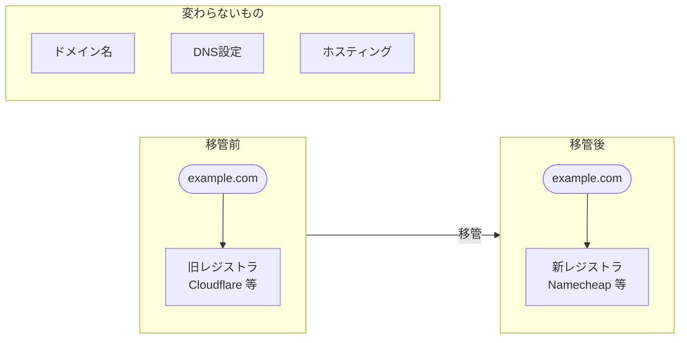
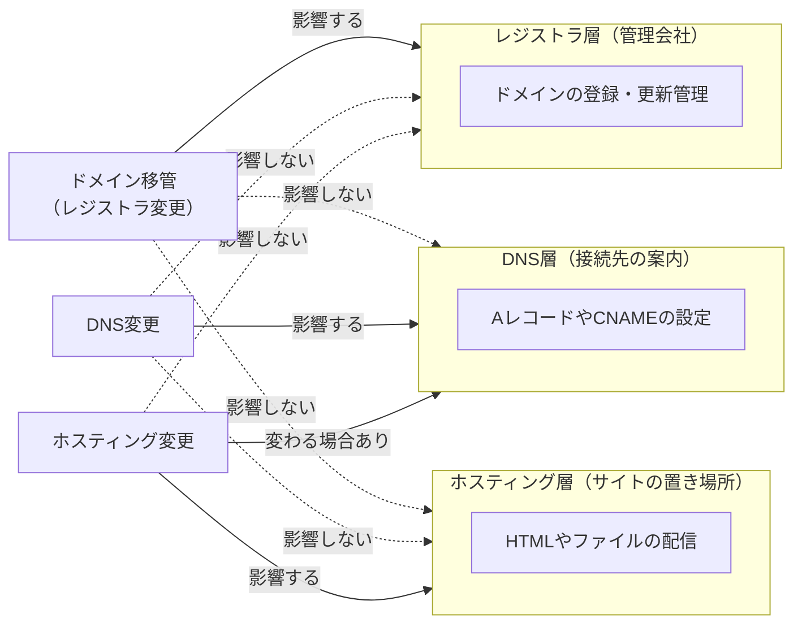
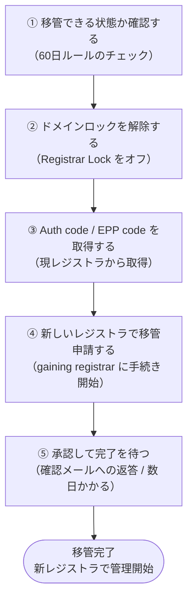

# ドメイン移管・レジストラ変更

## 概要

ドメイン移管とは、**ドメインを管理している会社（レジストラ）を変えること**です。日常会話では「ドメイン移管」と「レジストラ変更」はほぼ同じ意味として使われ、ICANN（インターネット管理機関）でも _transfer_ と呼ばれます。

イメージとしては、**「住所そのものは変わらず、その住所を管理する不動産会社を変える」** ようなものです。`example.com` というドメイン名は変わりません。変わるのは、そのドメインをどの会社に管理してもらうかです。

ただし、ドメイン移管・レジストラ変更は、DNS変更やホスティング変更とは**別の話**です。「VercelでサイトをホストしたいからCloudflareからドメインを移管しなければならない」ということはなく、DNS設定だけで済む場合がほとんどです。

---

## 目次

| # | トピック | 概要 |
|---|---------|------|
| 1 | [先に結論](#1-先に結論) | ドメイン移管 ≈ レジストラ変更 |
| 2 | [ドメイン移管とは](#2-ドメイン移管とは) | 管理会社を変えること |
| 3 | [レジストラ変更とは](#3-レジストラ変更とは) | 移管とほぼ同義 |
| 4 | [何が変わって、何が変わらないか](#4-何が変わって何が変わらないか) | 変化するもの・しないものの整理 |
| 5 | [DNS変更・ホスティング変更との違い](#5-dns変更ホスティング変更との違い) | 混同しやすい3操作の比較 |
| 6 | [どういうときに移管するのか](#6-どういうときに移管するのか) | 移管を選ぶ理由 |
| 7 | [移管の基本手順（5ステップ）](#7-移管の基本手順5ステップ) | 手続きの流れ |
| 8 | [お金はどうなるか](#8-お金はどうなるか) | 費用・期間延長の仕組み |
| 9 | [初心者向けの理解まとめ](#9-初心者向けの理解まとめ) | 全体のまとめ |

---

## 1. 先に結論

### 概要

日常会話では、**ドメイン移管 = レジストラ変更** と考えてほぼ問題ありません。

ICANN でも、ドメインを **あるレジストラから別のレジストラへ移すこと** を transfer（移管）として定義しています。

つまり、次のような操作がすべて「ドメイン移管」であり「レジストラ変更」です。

- 今は Cloudflare Registrar で管理している → お名前.com に変える
- 今は Cloudflare Registrar で管理している → Vercel に変える
- 今は Namecheap で管理している → Porkbun に変える

### なぜ「移管 ≈ レジストラ変更」と言えるか？

移管とは「レジストラ間でドメインの管理権を移す手続き」そのものだからです。「ドメインを移管する」という行為の結果として「レジストラが変わる」ため、この2つはセットになっています。

---

## 2. ドメイン移管とは

### 概要

**ドメイン移管**は、そのドメインを管理している会社（レジストラ）を変えることです。

たとえば今 `example.com` を Cloudflare Registrar で管理しているなら、それを Namecheap や Vercel へ移す、ということです。

> **初心者向けに言うと**
> 「住所そのものは同じだけど、住所を管理する不動産会社を変える」イメージです。
> `example.com` という名前自体は変わりません。変わるのは **そのドメインをどこで管理するか** です。

### なぜドメイン移管が必要か？

ドメインの管理会社（レジストラ）は、あとから自由に変えることができます。最初に登録した会社が合わなくなった場合、料金・サービス・管理のしやすさなど、様々な理由から別のレジストラへ移したくなることがあります。

また、ホスティング先と管理先をまとめたい場合（例：Vercel でサイトを運用しているので Vercel でドメインも管理したい）など、運用効率を上げるために移管するケースもよくあります。

---

## 3. レジストラ変更とは

### 概要

**レジストラ変更**も、意味としてはドメイン移管とほぼ同じです。「今のレジストラをやめて、別のレジストラで管理するようにすること」です。

実務上は、以下の3つはほぼ同じ話として扱ってかまいません。

- ドメイン移管
- レジストラ変更
- registrar transfer

### なぜ「移管」と「レジストラ変更」はほぼ同じ言葉か？

ICANNの Transfer Policy も、まさに **registrar 間の移転**（inter-registrar transfer）を対象にしています。つまり、「ドメインを移管する」という行為の内容が「レジストラを変える」ことそのものだからです。

---

## 4. 何が変わって、何が変わらないか

### 概要

移管前後で何が変わり、何が変わらないかを整理します。

| 項目 | 移管後 | 備考 |
|------|--------|------|
| **管理するレジストラ** | 変わる | 移管の目的そのもの |
| **管理画面・ログイン先** | 変わる | 新しいレジストラの画面を使う |
| **更新料金の請求先** | 変わる | 新しいレジストラに支払う |
| **Auth/EPPコードの発行元** | 変わる | 新しいレジストラに問い合わせる |
| **サポート体制・機能** | 変わる | レジストラによって異なる |
| **ドメイン名** | 変わらない | `example.com` はそのまま |
| **サイトを公開できること** | 変わらない | 移管しても公開状態は維持 |
| **サイトのURL** | 変わらない | 適切に設定すればそのまま |
| **ホスティング先** | 変わらない | 独立した設定 |

### なぜこの区別が重要か？

「ドメインを移管したらサイトが落ちる」「URLが変わる」と思い込んでいる人が多いからです。移管はあくまで**管理会社を変えるだけ**で、ドメイン名やホスティングに直接影響しません。

ただし、移管に伴うネームサーバーの変更や DNS 設定の引き継ぎが不完全だと、一時的にサイトへアクセスできなくなることがあります。移管時は DNS 設定を慎重に確認することが大切です。

---

## 5. DNS変更・ホスティング変更との違い

### 概要

ドメイン移管・DNS変更・ホスティング変更は、混同されやすいですが**別々の操作**です。

| 操作 | 何を変えるか | レジストラ | DNS | ホスティング |
|------|------------|:--------:|:---:|:----------:|
| **ドメイン移管** | 管理会社 | 変わる | 変わらない | 変わらない |
| **DNS変更** | 接続先の設定 | 変わらない | 変わる | 変わらない |
| **ホスティング変更** | サイトの置き場所 | 変わらない | 変わる場合あり | 変わる |

### なぜ混同しやすいか？

Cloudflare・Vercel・お名前.com のように、**レジストラ・DNS・ホスティングを一社でまかなえるサービス**が増えているためです。一社に乗り換えるとき、同時に3つすべてが変わることがあるため、どの操作が何に影響するか分かりにくくなります。

> **重要なポイント**
> 「Vercel でサイトを公開したい」 = 「ドメイン移管が必要」ではありません。
> Cloudflare でドメインを管理しつつ、DNS の CNAME や A レコードを Vercel に向けるだけで、サイト公開は可能です。

---

## 6. どういうときに移管するのか

### 概要

次のようなケースで移管が選ばれます。

- **料金を安くしたい** — 現在のレジストラより年間費用が安いサービスへ移す
- **管理をまとめたい** — ホスティング先（Vercel 等）と同じ会社でドメインも管理したい
- **サポートや管理画面が使いにくい** — 別のレジストラの方が操作しやすい
- **制約を回避したい** — 現在のレジストラで使えない機能や設定がある
- **国内 ⇔ 海外サービスに寄せたい** — 請求や言語対応の都合で乗り換える

### なぜレジストラを乗り換えるか？

ドメインの登録・維持費はレジストラによって異なり、**年間数百円〜数千円の差が生まれること**もあります。また、Cloudflare や Vercel のようにホスティングとドメイン管理を一元化できるサービスは、運用の手間を減らせます。

Cloudflare、Vercel、Namecheap のような主要レジストラはいずれも transfer out / transfer in の手順を公式に用意しているため、移管は特別な操作ではなく**通常の運用として想定されています**。

---

## 7. 移管の基本手順（5ステップ）

### 概要

移管は通常、**移り先（新しいレジストラ）側で手続きを始めます**。以下の順番で進みます。

### なぜこの順番か？

ICANN のルールに沿った手順だからです。各ステップの詳細は以下のとおりです。

**① 移管できる状態か確認する**

ICANN ルールにより、次の場合は移管できません。

- 新規登録から **60日以内**
- 前回の移管から **60日以内**

**② ドメインロックを解除する**

多くのレジストラでは、意図しない移管を防ぐために **Registrar Lock（移管禁止ロック）** が有効になっています。移管前にこれを解除する必要があります。

**③ Auth code / EPP code を取得する**

移管時には **Authorization Code（Auth code）** または **EPP code** と呼ばれる認証コードが必要です。このコードは現在のレジストラの管理画面から取得します。

**④ 新しいレジストラで移管申請する**

移管手続きは通常、**移り先（gaining registrar）** のサイトで開始します。Auth code を入力し、申請を送信します。

**⑤ 承認して完了を待つ**

現在のレジストラや登録者のメールアドレスに確認メールが届きます。承認すると移管が進み、通常 **5〜7日以内** に完了します。レジストラによっては即日〜数時間で完了することもあります。

---

## 8. お金はどうなるか

### 概要

移管に関わる費用の基本ルールは次のとおりです。

| 項目 | 内容 |
|------|------|
| **費用の発生元** | 移り先（新しいレジストラ）に支払う |
| **gTLD（.com / .net 等）** | 移管料金に **1年分の更新が含まれる**ことが多い |
| **ccTLD（.jp / .uk 等）** | ルールが異なる場合があり、1年延長が含まれないこともある |
| **現在のレジストラへの返金** | 基本的になし |

### なぜ移管料金に1年延長が含まれるのか？

ICANN のルール（Transfer Policy）により、gTLD の移管時は **有効期限が最低1年延長される**ことが定められているからです。Namecheap や Porkbun など主要レジストラもこの説明を公式に案内しています。

ただし、ccTLD は ICANN のルールが直接適用されない場合があります。移管前に、該当レジストラの案内を確認することをおすすめします。

---

## 9. 初心者向けの理解まとめ

### 概要

最初はここだけ押さえれば十分です。

| 用語 | 意味 |
|------|------|
| **ドメイン移管** | ドメインを別のレジストラへ移すこと |
| **レジストラ変更** | その結果として管理会社が変わること |
| **ほぼ同義** | 2つはセットで使ってよい |
| **DNS変更** | 別の操作（接続先の設定を変える） |
| **ホスティング変更** | 別の操作（サイトの置き場所を変える） |

> **初心者向けのまとめ**
> Cloudflare でドメインを取得したまま Vercel でサイト公開するだけなら、**移管せずに DNS 設定だけで済みます**。
> 移管が必要になるのは「管理会社そのものを変えたい」ときです。

---

## 参考情報源

| # | タイトル | URL |
|---|---------|-----|
| 1 | Transfer Policy - ICANN | https://www.icann.org/en/contracted-parties/accredited-registrars/resources/domain-name-transfers/policy |
| 2 | Transfer domain out from Cloudflare - Cloudflare Docs | https://developers.cloudflare.com/registrar/account-options/transfer-out-from-cloudflare/ |
| 3 | How do I transfer my domain to Vercel? - Vercel | https://vercel.com/kb/guide/how-do-i-transfer-my-domain-to-vercel |
| 4 | Transferring Domains to Another Team or Project - Vercel | https://vercel.com/docs/domains/working-with-domains/transfer-your-domain |
| 5 | How do I set/release registrar lock for a domain? - Namecheap | https://www.namecheap.com/support/knowledgebase/article.aspx/380/46/how-do-i-setrelease-registrar-lock-for-a-domain/ |
| 6 | Inter-Registrar Transfer Information - ICANN | https://www.icann.org/resources/pages/text-2012-02-25-en |
| 7 | If I transfer a domain to Namecheap, will it be renewed? - Namecheap | https://www.namecheap.com/support/knowledgebase/article.aspx/263/83/if-i-transfer-a-domain-to-namecheap-will-it-be-renewed-for-another-year/ |
