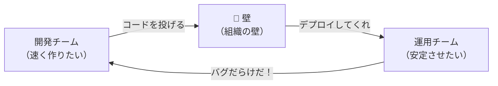
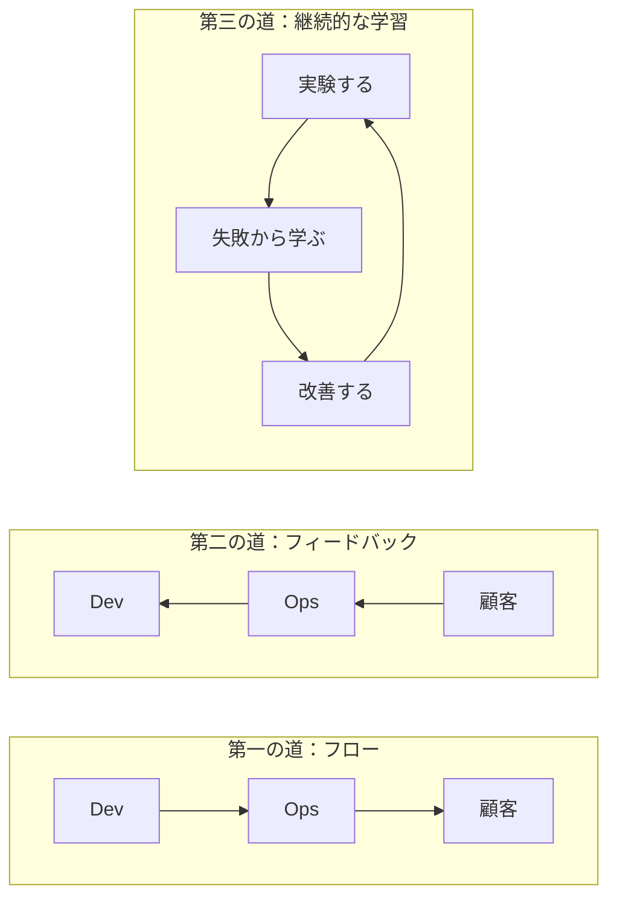
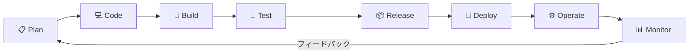
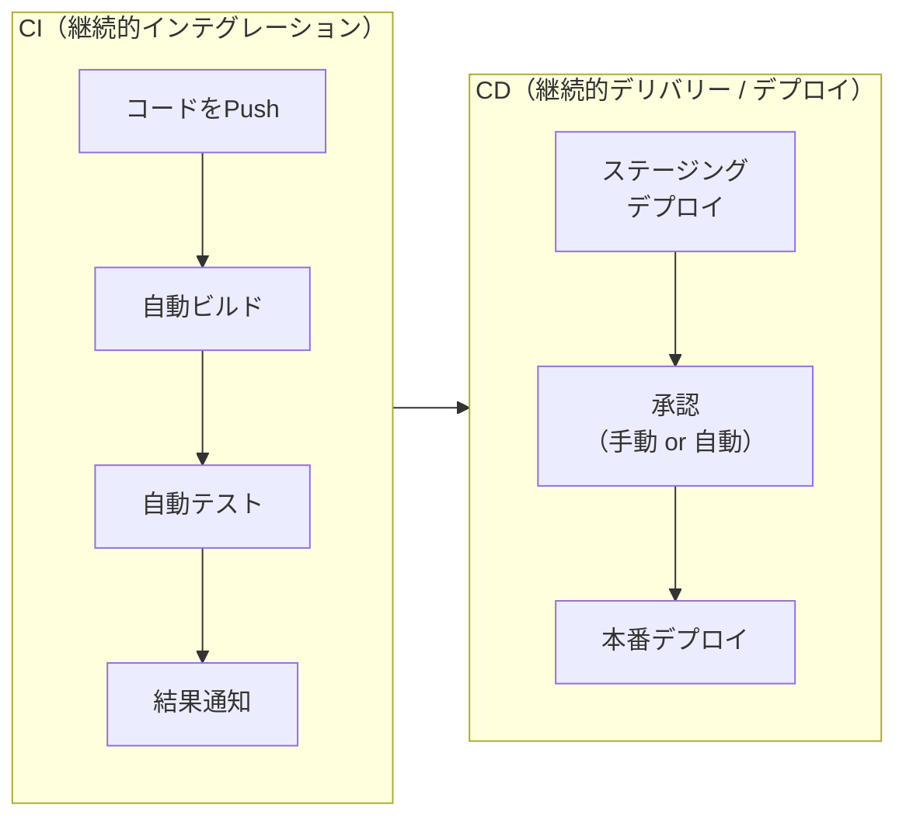
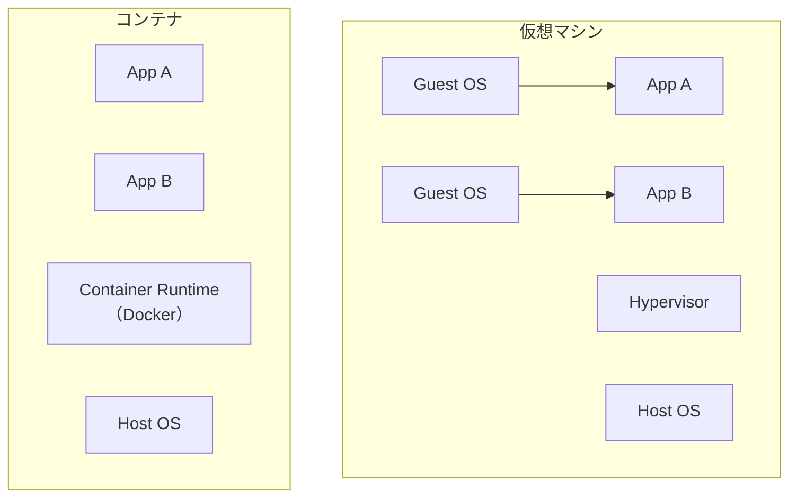
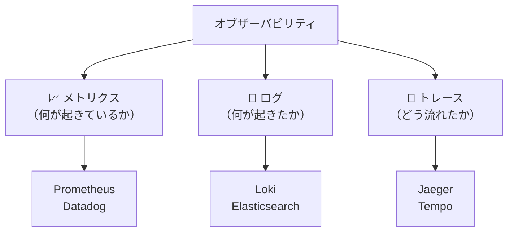
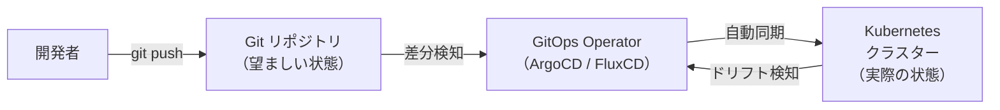
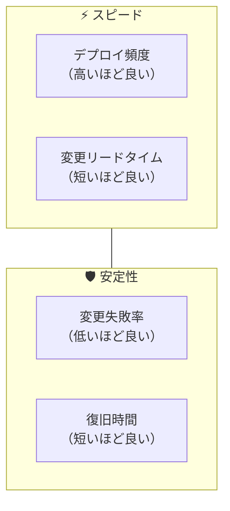
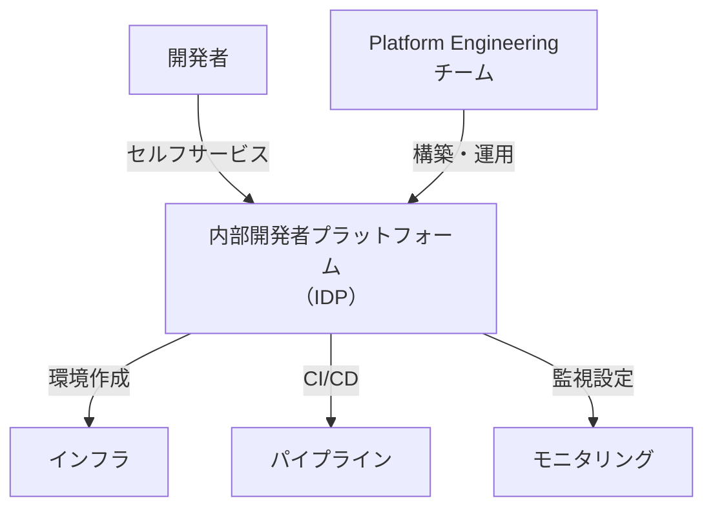

# DevOps

## 概要

DevOps は、**開発（Development）と運用（Operations）を統合し、ソフトウェアの提供速度と品質を向上させる文化・プラクティス・ツールの総称**です。
2009年に Patrick Debois が「DevOpsDays」を開催したことが起源とされ、従来の「開発チームがコードを書き、運用チームに投げる（throw it over the wall）」というサイロ化を打破するムーブメントとして広がりました。

DevOps は単なるツールセットではなく、**組織文化の変革**を中心に据えた考え方です。CI/CD やコンテナ化などの技術的プラクティスはその手段にすぎません。

> 「DevOps is the union of people, process, and products to enable continuous delivery of value to our end users.」
> — Donovan Brown（Microsoft）

---

## 目次

1. [DevOps の歴史と背景](#1-devops-の歴史と背景)
2. [DevOps の哲学とフレームワーク](#2-devops-の哲学とフレームワーク)
3. [DevOps ライフサイクル](#3-devops-ライフサイクル)
4. [主要プラクティス](#4-主要プラクティス)
5. [ツールチェーン](#5-ツールチェーン)
6. [メトリクス（DORA Four Keys）](#6-メトリクスdora-four-keys)
7. [DevOps の文化的側面](#7-devops-の文化的側面)
8. [関連する概念](#8-関連する概念)
9. [メリット・課題](#9-メリット課題)
10. [実践ガイドライン](#10-実践ガイドライン)
11. [参考資料](#11-参考資料)

---

## 1. DevOps の歴史と背景

### 従来の開発・運用モデルの問題

従来のウォーターフォール型開発では、開発チームと運用チームが分断されていました。



| 問題 | 説明 |
|------|------|
| **目標の対立** | 開発は「変更」を求め、運用は「安定」を求める |
| **フィードバックの遅延** | 問題がデプロイ後に初めて発覚する |
| **責任の押し付け合い** | 「開発のバグ」vs「運用の設定ミス」 |
| **デプロイ頻度の低下** | リリースが大規模・低頻度になり、リスクが増大 |

> **なぜこの問題が深刻なのか？**
> ビジネス環境の変化が加速する中、ソフトウェアの提供速度が競争力に直結するようになりました。月1回のリリースでは市場の要求に応えられず、この壁を壊す必要が生じました。

### DevOps の誕生

| 年 | 出来事 |
|----|--------|
| 2008 | Andrew Shafer と Patrick Debois が Agile Conference で「Agile Infrastructure」について議論 |
| 2009 | Patrick Debois がベルギーで初の **DevOpsDays** を開催 |
| 2010 | 「The DevOps Movement」として世界的に広がり始める |
| 2013 | Gene Kim 他が **『The Phoenix Project』** を出版 |
| 2016 | Gene Kim 他が **『The DevOps Handbook』** を出版 |
| 2018 | DORA（DevOps Research and Assessment）が **Four Keys メトリクス**を確立 |

---

## 2. DevOps の哲学とフレームワーク

### The Three Ways（三つの道）

Gene Kim が『The Phoenix Project』で提唱した DevOps の基本原則です。



| 原則 | 説明 | 具体例 |
|------|------|--------|
| **第一の道：フロー** | 開発から運用、顧客への流れを加速する | CI/CD パイプライン、小さなバッチサイズ、WIP制限 |
| **第二の道：フィードバック** | 顧客・運用からの情報を開発へ素早く戻す | モニタリング、アラート、ポストモーテム |
| **第三の道：継続的な学習と実験** | 組織全体で学び続ける文化を作る | ブレームレスポストモーテム、カオスエンジニアリング、20%ルール |

> **なぜ Three Ways が重要か？**
> ツールだけ導入しても DevOps は実現しません。Three Ways はツールの背後にある「なぜそうするのか」という原則を示しており、組織文化の変革を導く指針となります。

### CALMS フレームワーク

Jez Humble が提唱した、DevOps の成熟度を測る5つの柱です。

| 柱 | 英語 | 説明 |
|----|------|------|
| **C** | Culture（文化） | チーム間の壁を壊し、共同責任を持つ文化 |
| **A** | Automation（自動化） | 手作業を排除し、反復的な作業を自動化する |
| **L** | Lean（リーン） | 無駄を排除し、価値の流れを最適化する |
| **M** | Measurement（計測） | メトリクスを活用してパフォーマンスを可視化する |
| **S** | Sharing（共有） | 知識・ツール・責任をチーム横断で共有する |

**CALMS は自己診断ツールとしても使えます**：

```
# DevOps 成熟度チェック（CALMS）
- [ ] Culture: 開発と運用が同じゴールに向かっているか？
- [ ] Automation: CI/CD パイプラインは自動化されているか？
- [ ] Lean: バリューストリームにボトルネックはないか？
- [ ] Measurement: デプロイ頻度やリードタイムを計測しているか？
- [ ] Sharing: ナレッジが特定の人に閉じていないか？
```

---

## 3. DevOps ライフサイクル

DevOps のライフサイクルは、**無限ループ（∞）** として表現される8つのフェーズで構成されます。



### 各フェーズの詳細

| フェーズ | 説明 | 主なツール |
|---------|------|-----------|
| **Plan** | 要件定義、バックログ管理、スプリント計画 | Jira, GitHub Issues, Linear |
| **Code** | ソースコードの作成、バージョン管理 | Git, GitHub, GitLab |
| **Build** | コードのコンパイル、依存関係の解決 | Maven, Gradle, npm, Docker |
| **Test** | 自動テスト（ユニット、統合、E2E） | Jest, PHPUnit, Selenium |
| **Release** | ビルドの承認、リリース準備 | GitHub Releases, semantic-release |
| **Deploy** | 本番環境へのデプロイ自動化 | Kubernetes, ArgoCD, AWS CodeDeploy |
| **Operate** | インフラの運用、スケーリング | Terraform, Ansible, Kubernetes |
| **Monitor** | ログ収集、メトリクス監視、アラート | Prometheus, Grafana, Datadog |

> **なぜ「∞（無限ループ）」なのか？**
> DevOps は一方通行のプロセスではありません。Monitor フェーズで得たフィードバックが Plan フェーズに戻り、改善サイクルが永続的に回り続けます。この継続的な改善こそが DevOps の本質です。

---

## 4. 主要プラクティス

### 4.1 CI/CD（継続的インテグレーション / 継続的デリバリー）

CI/CD は DevOps の中核をなすプラクティスです。



| 概念 | 説明 |
|------|------|
| **継続的インテグレーション（CI）** | コードの変更を頻繁にメインブランチに統合し、自動でビルド・テストする |
| **継続的デリバリー（Continuous Delivery）** | いつでも本番にリリースできる状態を維持する（デプロイは手動承認） |
| **継続的デプロイ（Continuous Deployment）** | テストを通過したら自動で本番にデプロイする（手動承認なし） |

**CI/CD パイプラインの例（GitHub Actions）**：

```yaml
# .github/workflows/ci-cd.yml
name: CI/CD Pipeline

on:
  push:
    branches: [main]
  pull_request:
    branches: [main]

jobs:
  test:
    runs-on: ubuntu-latest
    steps:
      - uses: actions/checkout@v4
      - name: Install dependencies
        run: npm ci
      - name: Run tests
        run: npm test
      - name: Run linter
        run: npm run lint

  deploy:
    needs: test
    if: github.ref == 'refs/heads/main'
    runs-on: ubuntu-latest
    steps:
      - uses: actions/checkout@v4
      - name: Deploy to production
        run: ./deploy.sh
```

> **なぜ CI/CD が重要か？**
> 手動デプロイは時間がかかり、ヒューマンエラーが発生しやすくなります。CI/CD を導入することで、デプロイ頻度を上げながらリスクを下げることができます。DORA の調査によると、エリート DevOps チームは一般的なチームと比較して **46倍速くデプロイ**し、**変更失敗率も低い**とされています。

### 4.2 Infrastructure as Code（IaC）

インフラをコードで定義・管理するプラクティスです。

| 観点 | 手動管理 | IaC |
|------|---------|-----|
| **再現性** | 手順書に依存、人によって差が出る | コードで定義、完全に再現可能 |
| **バージョン管理** | 変更履歴が残らない | Git で変更履歴を追跡 |
| **レビュー** | 作業ログの確認のみ | Pull Request でコードレビュー |
| **スケール** | 手作業で1台ずつ | コード1回でN台同時に |

**Terraform の例（AWS EC2 インスタンス）**：

```hcl
# main.tf
resource "aws_instance" "web" {
  ami           = "ami-0c55b159cbfafe1f0"
  instance_type = "t3.micro"

  tags = {
    Name        = "web-server"
    Environment = "production"
    ManagedBy   = "terraform"
  }
}

resource "aws_security_group" "web" {
  name = "web-sg"

  ingress {
    from_port   = 443
    to_port     = 443
    protocol    = "tcp"
    cidr_blocks = ["0.0.0.0/0"]
  }
}
```

**IaC ツールの分類**：

| 分類 | ツール | 用途 |
|------|--------|------|
| **プロビジョニング** | Terraform, Pulumi, CloudFormation | インフラリソースの作成・管理 |
| **構成管理** | Ansible, Chef, Puppet | サーバー内部の設定・ソフトウェア管理 |
| **コンテナオーケストレーション** | Kubernetes, Docker Compose | コンテナの管理・スケーリング |

> **なぜ IaC が必要か？**
> 手動でのインフラ構築は「スノーフレークサーバー（個々に異なる設定のサーバー）」を生み出します。IaC はインフラの「ドリフト（意図しない設定変更）」を防ぎ、環境の一貫性を保証します。

### 4.3 コンテナ化とオーケストレーション

**コンテナ**はアプリケーションとその依存関係をパッケージ化する技術です。



| 観点 | 仮想マシン | コンテナ |
|------|-----------|---------|
| **起動時間** | 分単位 | 秒単位 |
| **リソース消費** | OS ごとに大きい | 軽量（OS を共有） |
| **ポータビリティ** | ハイパーバイザー依存 | どこでも同じ動作 |
| **密度** | 1台に数十VM | 1台に数百コンテナ |

**Dockerfile の例**：

```dockerfile
# マルチステージビルド
FROM node:20-alpine AS builder
WORKDIR /app
COPY package*.json ./
RUN npm ci --only=production

FROM node:20-alpine
WORKDIR /app
COPY --from=builder /app/node_modules ./node_modules
COPY . .
EXPOSE 3000
CMD ["node", "server.js"]
```

**Kubernetes の基本概念**：

| 概念 | 説明 |
|------|------|
| **Pod** | コンテナの最小デプロイ単位（1つ以上のコンテナ） |
| **Service** | Pod への安定したネットワークアクセスを提供 |
| **Deployment** | Pod のレプリカ数やアップデート戦略を管理 |
| **Namespace** | リソースを論理的に分離する |

> **なぜコンテナが DevOps で重要か？**
> 「自分の環境では動くのに...」という問題を解消します。コンテナにより、開発・ステージング・本番で**全く同じ環境**を再現できるため、デプロイの信頼性が大幅に向上します。

### 4.4 モニタリングとオブザーバビリティ

**モニタリング**は「壊れているかどうか」を教え、**オブザーバビリティ**は「なぜ壊れているか」を教えます。

#### オブザーバビリティの三本柱



| 柱 | 説明 | 例 |
|----|------|-----|
| **メトリクス** | 数値データの時系列（CPU、メモリ、リクエスト数等） | リクエストレイテンシの99パーセンタイルが200ms |
| **ログ** | 離散的なイベントの記録 | `ERROR: Database connection timeout at 14:32:05` |
| **トレース** | リクエストがサービス間をどう流れたかの可視化 | API → Auth → DB → Cache の呼び出しチェーン |

**OpenTelemetry** は、これら三本柱のテレメトリデータを統一的に収集・送信するオープンスタンダードです。

> **なぜオブザーバビリティが必要か？**
> マイクロサービスアーキテクチャでは、1つのリクエストが複数のサービスを横断します。従来のモニタリング（CPU・メモリ監視）だけでは、問題の根本原因を特定できません。オブザーバビリティにより、システムの内部状態を外部から観察・理解できるようになります。

### 4.5 GitOps

GitOps は、**Git をインフラとアプリケーションの唯一の信頼源（Single Source of Truth）とする**運用モデルです。



**GitOps の4原則**：

1. **宣言的（Declarative）** ― システムの望ましい状態をコードで宣言する
2. **バージョン管理（Versioned & Immutable）** ― Git に保存し、変更履歴を追跡する
3. **自動適用（Pulled Automatically）** ― 承認された変更を自動でクラスターに適用する
4. **自動修復（Continuously Reconciled）** ― 実際の状態がずれたら自動で修正する

| ツール | 特徴 |
|--------|------|
| **ArgoCD** | Web UI が充実、視覚的な管理に強い |
| **FluxCD** | Kubernetes ネイティブ、CLI ベースのワークフローに適合 |

> **なぜ GitOps か？**
> Push 型デプロイ（CI パイプラインが直接クラスターにデプロイ）では、パイプラインにクラスターの認証情報を渡す必要があります。Pull 型の GitOps では、クラスター内のオペレーターが Git をポーリングするため、**セキュリティリスクが低減**されます。

---

## 5. ツールチェーン

DevOps ではフェーズごとに様々なツールを組み合わせて使用します。

| フェーズ | カテゴリ | ツール例 |
|---------|---------|---------|
| **Plan** | プロジェクト管理 | Jira, Linear, GitHub Projects |
| **Code** | バージョン管理 | Git, GitHub, GitLab |
| **Build** | CI/CD | GitHub Actions, Jenkins, CircleCI, GitLab CI |
| **Test** | テスト自動化 | Jest, PHPUnit, Cypress, Selenium |
| **Release** | 成果物管理 | Docker Hub, GitHub Packages, Nexus |
| **Deploy** | デプロイ自動化 | ArgoCD, FluxCD, AWS CodeDeploy, Spinnaker |
| **Operate** | IaC / 構成管理 | Terraform, Ansible, Pulumi |
| **Monitor** | 監視 / オブザーバビリティ | Prometheus, Grafana, Datadog, PagerDuty |

### ツール選定の指針

ツールを選定する際は、以下の観点を考慮します。

| 観点 | 説明 |
|------|------|
| **チームのスキルセット** | 学習コストが低いツールから始める |
| **既存のエコシステム** | 既にGitHub を使っているなら GitHub Actions が自然 |
| **スケーラビリティ** | 組織の成長に合わせてスケールできるか |
| **コミュニティ** | アクティブなコミュニティがあるか（情報量、プラグイン） |
| **コスト** | OSS かマネージドサービスか、ランニングコストの比較 |

---

## 6. メトリクス（DORA Four Keys）

**DORA（DevOps Research and Assessment）** が提唱する4つのメトリクスは、DevOps のパフォーマンスを客観的に測定するための業界標準です。

### Four Keys メトリクス

| メトリクス | 説明 | エリートチーム | 低パフォーマンスチーム |
|-----------|------|--------------|---------------------|
| **デプロイ頻度** | 本番へのデプロイ回数 | オンデマンド（1日複数回） | 月1回〜半年に1回 |
| **変更リードタイム** | コミットから本番稼働までの時間 | 1時間未満 | 1ヶ月〜6ヶ月 |
| **変更失敗率** | デプロイが障害を引き起こす割合 | 0〜15% | 46〜60% |
| **復旧時間（MTTR）** | 障害発生から復旧までの時間 | 1時間未満 | 1ヶ月〜6ヶ月 |



> **なぜ DORA メトリクスが重要か？**
> 「DevOps を導入したが効果があるのか？」という疑問に客観的に答えるためです。DORA の調査は、**スピードと安定性はトレードオフではなく、両立できる**ことを実証しています。エリートチームはデプロイ頻度が高く、かつ変更失敗率が低いのです。

### 計測の始め方

```
# DORA メトリクスの計測方法
1. デプロイ頻度     → CI/CD パイプラインのデプロイ回数を集計
2. 変更リードタイム → Git のコミット日時とデプロイ日時の差分
3. 変更失敗率       → デプロイ後にロールバック or ホットフィックスした割合
4. 復旧時間         → インシデント管理ツール（PagerDuty等）のデータ
```

---

## 7. DevOps の文化的側面

DevOps は技術だけでなく、**文化の変革**が不可欠です。

### ブレームレスポストモーテム

障害発生後に行う振り返りで、**個人を責めず、システムの改善に焦点を当てる**手法です。

| 観点 | ブレームフル | ブレームレス |
|------|------------|-------------|
| **問い** | 「誰がやったのか？」 | 「何がこれを可能にしたのか？」 |
| **結果** | 隠蔽・責任逃れ | 正直な報告・学習 |
| **改善** | 個人の注意力に依存 | システムの仕組みで防止 |

> **なぜブレームレスが重要か？**
> 人を責めると、次から問題を隠すようになります。心理的安全性が確保されることで、正直に報告し、組織全体で学習するサイクルが生まれます。

### 共有責任（Shared Responsibility）

DevOps では、開発者も運用の責任を持ち、運用担当も開発プロセスに関与します。

- **You build it, you run it** ― 作ったものは自分で運用する（Amazon の Jeff Bezos が推進した原則）
- 障害対応のオンコールを開発者もローテーションで担当する
- SLO（サービスレベル目標）をチーム全体で共有・管理する

### 心理的安全性

DevOps のコラボレーションの前提条件は**心理的安全性**です。チームメンバーが恐怖なく意見を言える環境がなければ、情報共有もフィードバックも機能しません。

---

## 8. 関連する概念

### SRE（Site Reliability Engineering）

Google が提唱した、ソフトウェアエンジニアリングの手法を運用に適用するアプローチです。

| 観点 | DevOps | SRE |
|------|--------|-----|
| **本質** | 文化・ムーブメント | 具体的な実践手法・役割 |
| **フォーカス** | 開発と運用の統合 | 信頼性とスケーラビリティ |
| **メトリクス** | DORA Four Keys | SLI / SLO / SLA, エラーバジェット |

**SRE の主要概念**：

| 概念 | 説明 |
|------|------|
| **SLI（Service Level Indicator）** | サービスの品質を測る指標（レイテンシ、可用性等） |
| **SLO（Service Level Objective）** | SLI の目標値（例：可用性 99.9%） |
| **SLA（Service Level Agreement）** | SLO を含む顧客との契約（違反時にはペナルティ） |
| **エラーバジェット** | 100% − SLO の残り。この範囲内で変更を許容する |
| **Toil（トイル）** | 手動で反復的な運用作業。自動化して排除すべき対象 |

> 「DevOps は why（なぜ）、SRE は how（どうやるか）」と表現されることがあります。両者は対立するものではなく、SRE は DevOps の原則を具体化した実装の一つです。

### Platform Engineering

開発者が自律的に作業できるよう、**内部開発者プラットフォーム（IDP）を構築・提供する**アプローチです。



> 「DevOps は why、SRE は信頼性の how、Platform Engineering はスケールの how」

### DevSecOps

DevOps のライフサイクル全体にセキュリティを組み込むアプローチです。

セキュリティを開発の最終段階（リリース前）ではなく、**全フェーズに統合**します（Shift Left Security）。

| プラクティス | 説明 |
|-------------|------|
| **SAST（静的解析）** | コードをスキャンして脆弱性を検出 |
| **DAST（動的解析）** | 実行中のアプリケーションを攻撃してテスト |
| **SCA（ソフトウェア構成分析）** | 依存ライブラリの脆弱性をチェック |
| **Policy as Code** | セキュリティポリシーをコードで定義・適用 |

---

## 9. メリット・課題

### メリット

| メリット | 説明 |
|---------|------|
| **デリバリー速度の向上** | CI/CD により、アイデアから本番稼働までの時間が短縮 |
| **品質の向上** | 自動テスト・自動デプロイにより、ヒューマンエラーを削減 |
| **信頼性の向上** | IaC・モニタリングにより、インフラの安定性が向上 |
| **チーム間コラボレーション** | サイロを壊し、チーム全体で同じゴールを共有 |
| **復旧速度の向上** | 小さなデプロイとモニタリングにより、問題の特定・復旧が迅速 |

### 課題

| 課題 | 説明 | 対策 |
|------|------|------|
| **文化の変革が困難** | 長年の組織慣習を変えるのは容易ではない | 小さなチームから始め、成功事例を横展開 |
| **ツールの複雑さ** | ツールが多すぎて選定・統合に労力がかかる | 最小限のツールから始め、段階的に拡充 |
| **スキルの多様性** | 開発・運用・セキュリティの幅広い知識が必要 | T字型スキル（広く浅く＋1つ深く）を育成 |
| **レガシーシステムとの統合** | 既存システムが DevOps プラクティスに対応していない | Strangler Fig パターンで段階的に移行 |
| **計測の難しさ** | DevOps の効果を定量的に示すのが難しい | DORA メトリクスを導入して定量評価 |

---

## 10. 実践ガイドライン

### DevOps 導入のステップ

DevOps の導入は **小さく始めて、段階的に拡大する**のが鉄則です。

```
# DevOps 導入ロードマップ（例）
Phase 1: バージョン管理とCI
  - Git の導入（ブランチ戦略の策定）
  - CI パイプラインの構築（自動ビルド・テスト）

Phase 2: 自動デプロイとIaC
  - CD パイプラインの構築（自動デプロイ）
  - Terraform / Ansible によるインフラのコード化

Phase 3: モニタリングとフィードバック
  - Prometheus + Grafana でメトリクス監視
  - アラート設定とインシデント対応フローの整備

Phase 4: 文化と継続的改善
  - ブレームレスポストモーテムの導入
  - DORA メトリクスの計測と目標設定
  - ナレッジ共有の仕組み構築
```

### よくあるアンチパターン

| アンチパターン | 説明 | 対策 |
|--------------|------|------|
| **ツールファースト** | 文化を変えずにツールだけ導入する | CALMS で文化から着手する |
| **DevOps チーム**を作る | 専任チームを置いて他チームと分離する | 全チームに DevOps プラクティスを浸透させる |
| **自動化しすぎ** | 理解せずに全てを自動化する | まず手動でプロセスを理解してから自動化する |
| **メトリクスの形骸化** | 数値を追うだけで改善につなげない | メトリクスをアクションに結びつける仕組みを作る |

---

## 11. 参考資料

### 書籍

| 書籍 | 著者 | 説明 |
|------|------|------|
| [The Phoenix Project](https://itrevolution.com/product/the-phoenix-project/) | Gene Kim 他（IT Revolution, 2013） | DevOps の原則を小説形式で解説。Three Ways の原典 |
| [The DevOps Handbook](https://itrevolution.com/product/the-devops-handbook-second-edition/) | Gene Kim 他（IT Revolution, 2016） | DevOps の実践ガイド。CI/CD、IaC、モニタリングを網羅 |
| [Accelerate](https://itrevolution.com/product/accelerate/) | Nicole Forsgren 他（IT Revolution, 2018） | DORA メトリクスの研究に基づく DevOps の科学的根拠 |
| [Site Reliability Engineering](https://sre.google/sre-book/table-of-contents/) | Betsy Beyer 他（O'Reilly, 2016） | Google の SRE プラクティスを体系化。無料で公開 |

### 公式ドキュメント・レポート

| 資料 | リンク | 内容 |
|------|--------|------|
| DORA | [dora.dev](https://dora.dev/) | DevOps パフォーマンス調査レポート |
| Google SRE Books | [sre.google](https://sre.google/) | SRE の書籍群（無料公開） |
| AWS DevOps | [aws.amazon.com/devops](https://aws.amazon.com/devops/) | AWS の DevOps ガイド |
| Azure DevOps | [learn.microsoft.com](https://learn.microsoft.com/ja-jp/devops/) | Microsoft の DevOps ドキュメント |
| CNCF Landscape | [landscape.cncf.io](https://landscape.cncf.io/) | クラウドネイティブツールの全体像 |

### ツール公式サイト

| ツール | リンク | カテゴリ |
|--------|--------|---------|
| Docker | [docker.com](https://www.docker.com/) | コンテナ |
| Kubernetes | [kubernetes.io](https://kubernetes.io/) | オーケストレーション |
| Terraform | [terraform.io](https://www.terraform.io/) | IaC |
| GitHub Actions | [docs.github.com/actions](https://docs.github.com/en/actions) | CI/CD |
| ArgoCD | [argo-cd.readthedocs.io](https://argo-cd.readthedocs.io/) | GitOps |
| Prometheus | [prometheus.io](https://prometheus.io/) | モニタリング |
| Grafana | [grafana.com](https://grafana.com/) | 可視化 |
| OpenTelemetry | [opentelemetry.io](https://opentelemetry.io/) | オブザーバビリティ |
| Ansible | [ansible.com](https://www.ansible.com/) | 構成管理 |

### オンラインリソース

| 資料 | リンク | 内容 |
|------|--------|------|
| Martin Fowler: ContinuousDelivery | [martinfowler.com](https://martinfowler.com/bliki/ContinuousDelivery.html) | CD の概念的解説 |
| Atlassian DevOps Guide | [atlassian.com/devops](https://www.atlassian.com/devops) | DevOps の包括的ガイド |
| The Twelve-Factor App | [12factor.net](https://12factor.net/ja/) | クラウドネイティブアプリの方法論 |
| Splunk: SRE vs DevOps vs Platform Engineering | [splunk.com](https://www.splunk.com/en_us/blog/learn/sre-vs-devops-vs-platform-engineering.html) | 関連概念の違いを解説 |
