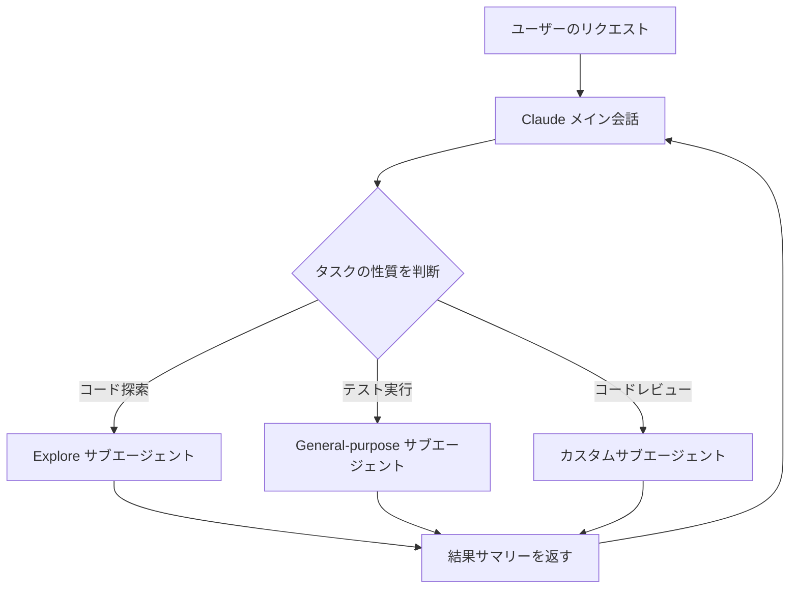
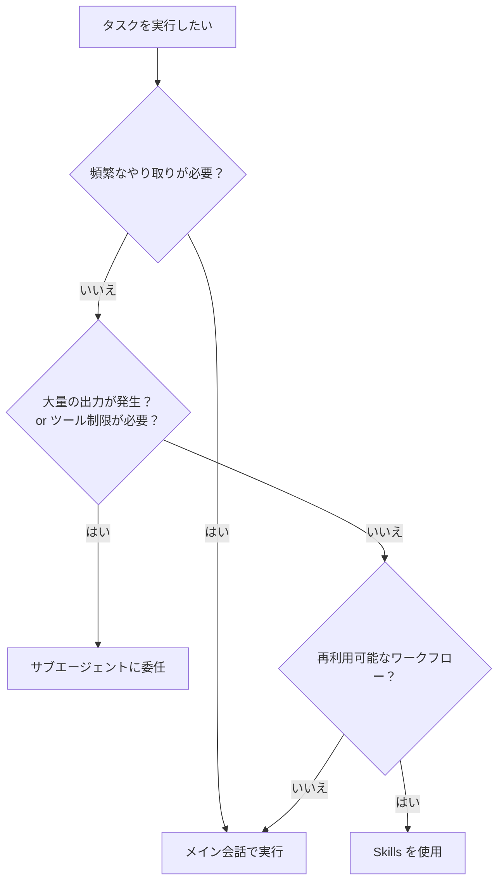
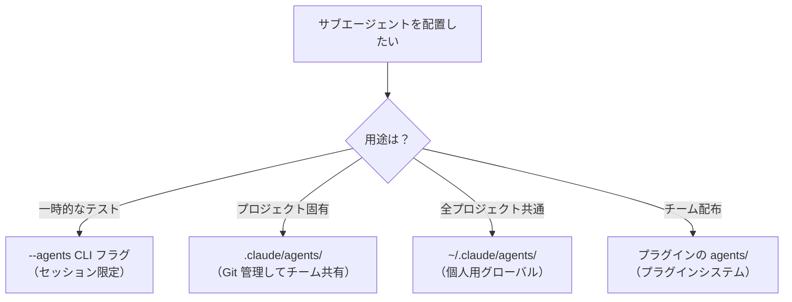

# サブエージェント詳細ガイド

## 概要

サブエージェント（Sub-agents）は、Claude Code 内で特定のタスクを処理する専門化された AI アシスタントです。各サブエージェントは独自のコンテキストウィンドウ、カスタムシステムプロンプト、専用のツールアクセス、独立した権限で動作します。

**なぜサブエージェントを使うのか？**
メインの会話でコード探索や大量のテスト実行を行うと、コンテキストが膨れ上がり重要な情報が埋もれてしまいます。サブエージェントを使えば、重い処理を分離しつつ結果のサマリーだけをメイン会話に返すことができ、効率的な開発が可能になります。

---

## 目次

- [1. サブエージェントとは](#1-サブエージェントとは)
  - [定義と役割](#定義と役割)
  - [メリット](#メリット)
  - [サブエージェント vs メイン会話 vs Skills の使い分け](#サブエージェント-vs-メイン会話-vs-skills-の使い分け)
- [2. 組み込みサブエージェント](#2-組み込みサブエージェント)
- [3. カスタムサブエージェントの作成](#3-カスタムサブエージェントの作成)
  - [/agents コマンドによる作成](#agents-コマンドによる作成)
  - [手動ファイル作成（Markdown + YAML frontmatter）](#手動ファイル作成markdown--yaml-frontmatter)
  - [--agents CLI フラグによるセッション限定作成](#--agents-cli-フラグによるセッション限定作成)
- [4. スコープと配置場所](#4-スコープと配置場所)
- [5. 設定フィールドリファレンス](#5-設定フィールドリファレンス)
- [6. ツールとパーミッション制御](#6-ツールとパーミッション制御)
  - [利用可能なツールの指定](#利用可能なツールの指定)
  - [パーミッションモード](#パーミッションモード)
  - [Agent(agent_type) によるサブエージェント生成制限](#agentagent_type-によるサブエージェント生成制限)
  - [特定サブエージェントの無効化](#特定サブエージェントの無効化)
- [7. スキルの事前読み込み](#7-スキルの事前読み込み)
- [8. 永続メモリ](#8-永続メモリ)
- [9. フォアグラウンド / バックグラウンド実行](#9-フォアグラウンド--バックグラウンド実行)
- [10. Worktree 分離](#10-worktree-分離)
- [11. Hooks との連携](#11-hooks-との連携)
  - [サブエージェント frontmatter 内の Hooks](#サブエージェント-frontmatter-内の-hooks)
  - [settings.json での SubagentStart / SubagentStop](#settingsjson-での-subagentstart--subagentstop)
  - [条件付きルール（PreToolUse による動的制御）](#条件付きルールpretooluse-による動的制御)
- [12. サブエージェントの管理](#12-サブエージェントの管理)
  - [自動委任の仕組み](#自動委任の仕組み)
  - [サブエージェントの再開（resume）](#サブエージェントの再開resume)
  - [コンテキスト管理と自動圧縮](#コンテキスト管理と自動圧縮)
  - [トランスクリプトの永続化](#トランスクリプトの永続化)
- [13. 実践的なサブエージェント例](#13-実践的なサブエージェント例)
  - [コードレビュアー（読み取り専用）](#コードレビュアー読み取り専用)
  - [デバッガー（診断+修正）](#デバッガー診断修正)
  - [データサイエンティスト（SQL分析）](#データサイエンティストsql分析)
  - [データベースクエリバリデーター（Hooks活用）](#データベースクエリバリデーターhooks活用)
- [14. ベストプラクティス](#14-ベストプラクティス)
- [15. 参考リンク](#15-参考リンク)

---

## 1. サブエージェントとは

### 定義と役割

サブエージェントは、メインの Claude Code セッション内から呼び出される**独立した AI アシスタント**です。Claude がタスクの内容とサブエージェントの `description` フィールドを照合し、適切なサブエージェントに自動的にタスクを委任します。



> **ポイント**: サブエージェントは別のサブエージェントを呼び出すことはできません（ネスト不可）。連鎖的な処理が必要な場合は、メイン会話から順番にサブエージェントを呼び出す「チェーン」パターンを使います。

### メリット

| メリット | 説明 |
|---------|------|
| **コンテキスト保全** | 大量の出力（テスト結果、ログ分析など）がメインのコンテキストを圧迫しない |
| **制約の強制** | ツールアクセスや権限を制限し、安全な操作範囲を保証できる |
| **コスト制御** | Haiku など低コストモデルに特定のタスクをルーティングできる |
| **専門化** | ドメイン固有のシステムプロンプトで精度を向上させられる |
| **再利用性** | ユーザースコープのサブエージェントは全プロジェクトで利用可能 |

### サブエージェント vs メイン会話 vs Skills の使い分け

どの仕組みを使うべきか迷った場合は、以下のフローチャートを参考にしてください。



| 観点 | メイン会話 | サブエージェント | Skills |
|------|-----------|-----------------|--------|
| コンテキスト | 共有 | 独立（分離） | メイン会話内で実行 |
| ツール制限 | 全ツール利用可 | 制限可能 | 制限なし |
| 対話性 | 高い | 低い（結果返却のみ） | 高い |
| 用途 | 対話的な作業 | 自己完結型タスク | 再利用可能なプロンプト |

---

## 2. 組み込みサブエージェント

Claude Code には、自動的に利用される組み込みサブエージェントが含まれています。

| サブエージェント | モデル | ツールアクセス | 用途 |
|----------------|--------|--------------|------|
| **Explore** | Haiku（高速・低コスト） | 読み取り専用（Write/Edit 不可） | ファイル検索、コード探索、コードベースの理解 |
| **Plan** | 継承（メイン会話と同じ） | 読み取り専用（Write/Edit 不可） | プランモード中のリサーチ |
| **General-purpose** | 継承（メイン会話と同じ） | 全ツール | 複雑なマルチステップ操作、探索+修正 |
| **Bash** | 継承 | ターミナルコマンド | 別コンテキストでのコマンド実行 |
| **statusline-setup** | Sonnet | Read, Edit | `/statusline` 設定 |
| **Claude Code Guide** | Haiku | 読み取り専用 | Claude Code の機能に関する質問応答 |

> **なぜモデルが異なるのか？**
> Explore や Claude Code Guide は単純な検索・参照タスクなので、高速で低コストな Haiku を使います。General-purpose は複雑な推論が必要なため、メイン会話と同じモデルを継承します。このようにタスクの複雑さに応じたモデル選択により、コストとパフォーマンスのバランスを取ります。

### Explore の thoroughness レベル

Explore サブエージェントを呼び出す際、Claude は以下のいずれかの網羅性レベルを指定します。

| レベル | 用途 |
|--------|------|
| `quick` | 特定のファイルや関数のピンポイント検索 |
| `medium` | バランスの取れた探索 |
| `very thorough` | 複数箇所にまたがる包括的な分析 |

---

## 3. カスタムサブエージェントの作成

### /agents コマンドによる作成

最も簡単な作成方法です。インタラクティブなインターフェースでサブエージェントを管理できます。

```text
/agents
```

`/agents` コマンドでできること:

- 全サブエージェント（組み込み / ユーザー / プロジェクト / プラグイン）の一覧表示
- 新規作成（ガイド付きセットアップ or Claude による自動生成）
- 既存サブエージェントの編集・削除
- 重複時のアクティブ判定の確認

**作成フローの例:**

1. `/agents` を実行
2. **Create new agent** を選択
3. スコープを選択（User-level or Project-level）
4. **Generate with Claude** を選択し、説明を入力
5. ツールアクセスを設定（読み取り専用 / 全ツールなど）
6. モデルを選択（Sonnet / Opus / Haiku）
7. 表示色を選択
8. 保存 → 即座に利用可能（再起動不要）

> **コマンドライン一覧表示**: `claude agents` コマンドでインタラクティブセッションを開かずにエージェント一覧を表示できます。

### 手動ファイル作成（Markdown + YAML frontmatter）

サブエージェントは YAML frontmatter 付きの Markdown ファイルで定義します。

```markdown
---
name: code-reviewer
description: コード品質とベストプラクティスをレビューする
tools: Read, Glob, Grep
model: sonnet
---

あなたはシニアコードレビュアーです。呼び出されたら、コードの品質、
セキュリティ、ベストプラクティスについて具体的でアクション可能な
フィードバックを提供してください。
```

- **frontmatter（`---` で囲まれた部分）**: サブエージェントのメタデータと設定
- **本文（frontmatter 以降）**: システムプロンプト（サブエージェントの振る舞いを指示）

> **注意**: 手動でファイルを追加した場合は、セッションを再起動するか `/agents` で読み込む必要があります。

### --agents CLI フラグによるセッション限定作成

Claude Code 起動時に JSON でサブエージェントを定義できます。ディスクに保存されず、そのセッションのみ有効です。

```bash
claude --agents '{
  "code-reviewer": {
    "description": "Expert code reviewer. Use proactively after code changes.",
    "prompt": "You are a senior code reviewer. Focus on code quality, security, and best practices.",
    "tools": ["Read", "Grep", "Glob", "Bash"],
    "model": "sonnet"
  }
}'
```

**使いどころ**: クイックテスト、CI/CD パイプラインでの一時利用、自動化スクリプト内での利用。

---

## 4. スコープと配置場所

サブエージェントは配置場所によってスコープが決まります。同名のサブエージェントが複数存在する場合、優先度の高い方が使用されます。

| 配置場所 | スコープ | 優先度 | 作成方法 |
|---------|---------|--------|---------|
| `--agents` CLI フラグ | 現在のセッション | 1（最高） | Claude Code 起動時に JSON 指定 |
| `.claude/agents/` | 現在のプロジェクト | 2 | `/agents` or 手動作成 |
| `~/.claude/agents/` | 全プロジェクト | 3 | `/agents` or 手動作成 |
| プラグインの `agents/` | プラグイン有効範囲 | 4（最低） | プラグインインストール |



> **チーム開発のコツ**: プロジェクトスコープ（`.claude/agents/`）のサブエージェントはバージョン管理に含め、チーム全体で利用・改善しましょう。

---

## 5. 設定フィールドリファレンス

YAML frontmatter で使用できる全フィールドの一覧です。`name` と `description` のみ必須です。

| フィールド | 必須 | 型 | 説明 |
|-----------|------|-----|------|
| `name` | はい | `string` | 一意の識別子（小文字とハイフン） |
| `description` | はい | `string` | Claude がこのサブエージェントに委任する条件の説明 |
| `tools` | いいえ | `string` (CSV) | 利用可能なツール。省略時は全ツールを継承 |
| `disallowedTools` | いいえ | `string` (CSV) | 拒否するツール。継承または指定リストから除外 |
| `model` | いいえ | `string` | 使用モデル: `sonnet`, `opus`, `haiku`, `inherit`。デフォルト: `inherit` |
| `permissionMode` | いいえ | `string` | 権限モード: `default`, `acceptEdits`, `dontAsk`, `bypassPermissions`, `plan` |
| `maxTurns` | いいえ | `number` | エージェンティックターンの最大回数 |
| `skills` | いいえ | `list` | 起動時に読み込む [Skills](../../../ai/claude/claude-code-settings/README.md) |
| `mcpServers` | いいえ | `object` | 利用可能な MCP サーバー |
| `hooks` | いいえ | `object` | ライフサイクルフック（[Hooks 連携](#11-hooks-との連携)参照） |
| `memory` | いいえ | `string` | 永続メモリスコープ: `user`, `project`, `local` |
| `background` | いいえ | `boolean` | `true` で常にバックグラウンド実行。デフォルト: `false` |
| `isolation` | いいえ | `string` | `worktree` で Git worktree 分離実行 |

### 設定例（全フィールド使用）

```yaml
---
name: full-featured-agent
description: 全機能を活用したサブエージェントの例
tools: Read, Grep, Glob, Bash, Edit
disallowedTools: Write
model: sonnet
permissionMode: acceptEdits
maxTurns: 20
skills:
  - api-conventions
  - error-handling-patterns
memory: project
background: false
isolation: worktree
hooks:
  PostToolUse:
    - matcher: "Edit"
      hooks:
        - type: command
          command: "npx prettier --write $TOOL_INPUT"
---

あなたは全機能を活用するデモ用エージェントです。
```

---

## 6. ツールとパーミッション制御

### 利用可能なツールの指定

サブエージェントのツールアクセスは、`tools`（許可リスト）と `disallowedTools`（拒否リスト）で制御します。

```yaml
---
name: safe-researcher
description: 読み取り専用のリサーチエージェント
tools: Read, Grep, Glob, Bash
disallowedTools: Write, Edit
---
```

- `tools` を省略すると、メイン会話の全ツール（MCP ツール含む）を継承
- `disallowedTools` は継承または `tools` で指定したリストからツールを除外

### パーミッションモード

`permissionMode` フィールドで、サブエージェントの権限プロンプトの動作を制御できます。

| モード | 動作 |
|--------|------|
| `default` | 通常の権限チェック（プロンプト表示） |
| `acceptEdits` | ファイル編集を自動承認 |
| `dontAsk` | 権限プロンプトを自動拒否（明示的に許可されたツールは動作） |
| `bypassPermissions` | 全権限チェックをスキップ |
| `plan` | プランモード（読み取り専用の探索） |

> **注意**: `bypassPermissions` はすべての権限チェックをスキップするため、慎重に使用してください。また、親が `bypassPermissions` を使用している場合、サブエージェントでオーバーライドすることはできません。

### Agent(agent_type) によるサブエージェント生成制限

`claude --agent` でメインスレッドとしてエージェントを実行する場合、`tools` フィールドの `Agent(agent_type)` 構文で生成可能なサブエージェントを制限できます。

```yaml
---
name: coordinator
description: 専門エージェントを統括するコーディネーター
tools: Agent(worker, researcher), Read, Bash
---
```

この設定では `worker` と `researcher` のみ生成可能です。他のサブエージェントの生成はブロックされます。

- `Agent`（括弧なし）: 任意のサブエージェントを生成可能
- `Agent` を `tools` から完全に省略: サブエージェント生成不可
- **この制限は `claude --agent` でメインスレッドとして実行されるエージェントにのみ適用**。サブエージェントは他のサブエージェントを生成できないため、サブエージェント定義内の `Agent(agent_type)` は効果がありません。

### 特定サブエージェントの無効化

`settings.json` の `permissions.deny` で特定のサブエージェントをブロックできます。

```json
{
  "permissions": {
    "deny": ["Agent(Explore)", "Agent(my-custom-agent)"]
  }
}
```

CLI フラグでも指定可能です。

```bash
claude --disallowedTools "Agent(Explore)"
```

---

## 7. スキルの事前読み込み

`skills` フィールドを使うと、サブエージェント起動時に [Skills](https://code.claude.com/docs/en/skills) のコンテンツをコンテキストに注入できます。

```yaml
---
name: api-developer
description: チーム規約に従って API エンドポイントを実装
skills:
  - api-conventions
  - error-handling-patterns
---

API エンドポイントを実装してください。プリロードされたスキルの規約とパターンに従ってください。
```

**重要なポイント:**

- スキルの**全コンテンツ**がサブエージェントのコンテキストに注入される（参照ではなく実体）
- サブエージェントは親会話のスキルを**自動継承しない** → `skills` フィールドで明示的に指定が必要
- Skills の `context: fork` とは逆方向のアプローチ（サブエージェント側がスキルを取り込む）

---

## 8. 永続メモリ

`memory` フィールドを設定すると、サブエージェントにセッションをまたいで知識を蓄積する永続ディレクトリが与えられます。

```yaml
---
name: code-reviewer
description: コード品質とベストプラクティスをレビューする
memory: user
---

あなたはコードレビュアーです。レビュー中に発見したパターン、
規約、繰り返し発生する問題をエージェントメモリに記録してください。
```

### メモリスコープ

| スコープ | 保存場所 | 用途 |
|---------|---------|------|
| `user` | `~/.claude/agent-memory/<name>/` | 全プロジェクト共通の学習（推奨デフォルト） |
| `project` | `.claude/agent-memory/<name>/` | プロジェクト固有の知識（バージョン管理可能） |
| `local` | `.claude/agent-memory-local/<name>/` | プロジェクト固有だがバージョン管理しない |

### メモリが有効になると

- システムプロンプトにメモリディレクトリの読み書き指示が追加される
- メモリディレクトリ内の `MEMORY.md` の先頭200行が自動的にコンテキストに含まれる
- `MEMORY.md` が200行を超えた場合、整理する指示が含まれる
- Read, Write, Edit ツールが自動的に有効化される

### メモリ活用のコツ

- **作業前にメモリを参照させる**: 「PR をレビューして、メモリに記録済みのパターンも確認して」
- **作業後にメモリを更新させる**: 「完了したら、学んだことをメモリに保存して」
- **システムプロンプトにメモリ指示を含める**: サブエージェントが自発的にメモリを管理するようになる

```markdown
作業中に発見したコードパス、パターン、ライブラリの場所、
重要なアーキテクチャ決定をメモリに記録してください。
簡潔なメモとして記録し、組織的な知識を蓄積しましょう。
```

---

## 9. フォアグラウンド / バックグラウンド実行

サブエージェントは2つの実行モードで動作します。

| モード | 動作 | 権限処理 | 対話性 |
|--------|------|---------|--------|
| **フォアグラウンド**（デフォルト） | メイン会話をブロック | 権限プロンプトをユーザーに転送 | 質問・確認が可能 |
| **バックグラウンド** | 並行実行（メイン会話は継続） | 起動前に必要な権限を事前承認 | 質問ツールは失敗するが処理は継続 |

### バックグラウンド実行の方法

1. `background: true` を frontmatter に設定（常にバックグラウンド）
2. Claude に「バックグラウンドで実行して」と依頼
3. 実行中のサブエージェントに **Ctrl+B** を押してバックグラウンドに移行

### バックグラウンドの権限処理

バックグラウンドサブエージェントは起動前にユーザーに権限承認を求めます。実行中は事前承認された権限を継承し、未承認の操作は自動拒否されます。

> **権限不足で失敗した場合**: そのサブエージェントをフォアグラウンドで[再開（resume）](#サブエージェントの再開resume)すれば、対話的に権限を承認できます。

### バックグラウンドタスクの無効化

環境変数 `CLAUDE_CODE_DISABLE_BACKGROUND_TASKS=1` で全バックグラウンドタスク機能を無効化できます。

---

## 10. Worktree 分離

`isolation: worktree` を設定すると、サブエージェントは一時的な Git worktree で動作し、リポジトリの独立したコピーを使用します。

```yaml
---
name: experimental-refactor
description: 実験的なリファクタリングを分離環境で実行
isolation: worktree
tools: Read, Edit, Write, Bash, Grep, Glob
---

リポジトリの分離コピーでリファクタリングを実行します。
メインブランチに影響を与えません。
```

### 動作の仕組み

1. サブエージェント起動時に一時的な Git worktree を作成
2. サブエージェントは worktree 内で自由に作業
3. **変更なし**: worktree は自動的にクリーンアップ
4. **変更あり**: worktree のパスとブランチ名が結果に含まれる

### 活用シーン

- **並列エージェント**: 複数のサブエージェントが同時に異なるブランチで作業
- **実験的変更**: メインブランチを汚さずに試行錯誤
- **安全なリファクタリング**: 失敗しても元のコードに影響なし

---

## 11. Hooks との連携

サブエージェントは [Hooks](./03-hooks.md) と組み合わせることで、より高度な自動化が実現できます。

### サブエージェント frontmatter 内の Hooks

サブエージェントの YAML frontmatter に直接 Hooks を定義できます。この Hooks はそのサブエージェントがアクティブな間のみ実行され、終了時にクリーンアップされます。

```yaml
---
name: code-reviewer
description: 自動リント付きのコードレビュー
hooks:
  PreToolUse:
    - matcher: "Bash"
      hooks:
        - type: command
          command: "./scripts/validate-command.sh $TOOL_INPUT"
  PostToolUse:
    - matcher: "Edit|Write"
      hooks:
        - type: command
          command: "./scripts/run-linter.sh"
---
```

frontmatter 内でサポートされる主なイベント:

| イベント | matcher 入力 | 発火タイミング |
|---------|-------------|--------------|
| `PreToolUse` | ツール名 | サブエージェントがツールを使用する前 |
| `PostToolUse` | ツール名 | サブエージェントがツールを使用した後 |
| `Stop` | （なし） | サブエージェント終了時（`SubagentStop` に変換される） |

### settings.json での SubagentStart / SubagentStop

`settings.json` にサブエージェントのライフサイクルイベントに応じた Hooks を設定できます。

```json
{
  "hooks": {
    "SubagentStart": [
      {
        "matcher": "db-agent",
        "hooks": [
          { "type": "command", "command": "./scripts/setup-db-connection.sh" }
        ]
      }
    ],
    "SubagentStop": [
      {
        "hooks": [
          { "type": "command", "command": "./scripts/cleanup-db-connection.sh" }
        ]
      }
    ]
  }
}
```

| イベント | matcher 入力 | 発火タイミング |
|---------|-------------|--------------|
| `SubagentStart` | エージェントタイプ名 | サブエージェント実行開始時 |
| `SubagentStop` | エージェントタイプ名 | サブエージェント完了時 |

### 条件付きルール（PreToolUse による動的制御）

`tools` フィールドでは「Bash は許可するが書き込み SQL はブロック」といった細かい制御ができません。`PreToolUse` フックを使えば、ツール実行前にコマンドの内容を検証し、条件付きでブロックできます。

```yaml
---
name: db-reader
description: 読み取り専用のデータベースクエリを実行
tools: Bash
hooks:
  PreToolUse:
    - matcher: "Bash"
      hooks:
        - type: command
          command: "./scripts/validate-readonly-query.sh"
---
```

バリデーションスクリプトの例（`./scripts/validate-readonly-query.sh`）:

```bash
#!/bin/bash
# SQL の書き込み操作をブロックし、SELECT クエリのみ許可

# stdin から JSON 入力を読み取り
INPUT=$(cat)

# tool_input.command フィールドを抽出
COMMAND=$(echo "$INPUT" | jq -r '.tool_input.command // empty')

if [ -z "$COMMAND" ]; then
  exit 0
fi

# 書き込み操作をブロック（大文字小文字を区別しない）
if echo "$COMMAND" | grep -iE '\b(INSERT|UPDATE|DELETE|DROP|CREATE|ALTER|TRUNCATE|REPLACE|MERGE)\b' > /dev/null; then
  echo "Blocked: Write operations not allowed. Use SELECT queries only." >&2
  exit 2  # exit code 2 で操作をブロック
fi

exit 0
```

> **exit code の意味**: `exit 0` で操作を許可、`exit 2` で操作をブロックし stderr のメッセージを Claude にフィードバックします。詳細は [Hooks ガイド](./03-hooks.md) を参照してください。

---

## 12. サブエージェントの管理

### 自動委任の仕組み

Claude はタスクの内容とサブエージェントの `description` フィールドを照合し、自動的に適切なサブエージェントに委任します。

- **自発的な委任を促す**: `description` に「Use proactively」のような文言を含める
- **明示的な指定も可能**: 「code-reviewer サブエージェントを使って最近の変更をレビューして」

```text
Use the test-runner subagent to fix failing tests
Have the code-reviewer subagent look at my recent changes
```

### サブエージェントの再開（resume）

サブエージェントは再開（resume）でき、前回の全コンテキスト（ツール呼び出し、結果、推論）を保持したまま続行できます。

```text
# 1回目の呼び出し
Use the code-reviewer subagent to review the authentication module
[Agent completes]

# 2回目（再開）
Continue that code review and now analyze the authorization logic
[Claude resumes the subagent with full context]
```

- 各サブエージェント完了時に Claude はエージェント ID を受け取る
- Claude に「さっきの作業を続けて」と依頼すると、自動的に resume される
- エージェント ID はトランスクリプトファイルでも確認可能

### コンテキスト管理と自動圧縮

サブエージェントはメイン会話と同じロジックで自動圧縮（auto-compaction）をサポートします。

- デフォルトでは容量の約 **95%** で圧縮がトリガー
- `CLAUDE_AUTOCOMPACT_PCT_OVERRIDE` 環境変数でトリガー閾値を変更可能（例: `50` で50%）
- 圧縮イベントはトランスクリプトに記録される

```json
{
  "type": "system",
  "subtype": "compact_boundary",
  "compactMetadata": {
    "trigger": "auto",
    "preTokens": 167189
  }
}
```

### トランスクリプトの永続化

サブエージェントのトランスクリプトはメイン会話とは独立して保存されます。

- **保存先**: `~/.claude/projects/{project}/{sessionId}/subagents/agent-{agentId}.jsonl`
- **メイン会話の圧縮**: サブエージェントのトランスクリプトに影響なし
- **セッション永続**: 同一セッションを再開すればサブエージェントも再開可能
- **自動クリーンアップ**: `cleanupPeriodDays` 設定に従い自動削除（デフォルト: 30日）

---

## 13. 実践的なサブエージェント例

### コードレビュアー（読み取り専用）

読み取り専用でコードをレビューするサブエージェントです。Edit/Write ツールを持たないため、安全にコード分析のみ行えます。

```markdown
---
name: code-reviewer
description: Expert code review specialist. Proactively reviews code for quality, security, and maintainability. Use immediately after writing or modifying code.
tools: Read, Grep, Glob, Bash
model: inherit
---

You are a senior code reviewer ensuring high standards of code quality and security.

When invoked:
1. Run git diff to see recent changes
2. Focus on modified files
3. Begin review immediately

Review checklist:
- Code is clear and readable
- Functions and variables are well-named
- No duplicated code
- Proper error handling
- No exposed secrets or API keys
- Input validation implemented
- Good test coverage
- Performance considerations addressed

Provide feedback organized by priority:
- Critical issues (must fix)
- Warnings (should fix)
- Suggestions (consider improving)

Include specific examples of how to fix issues.
```

> **設計のポイント**: `tools` に Edit/Write を含めず読み取り専用に制限。`description` に「Use immediately after writing or modifying code」と書くことで、コード変更後に自動的に委任されやすくなります。

### デバッガー（診断+修正）

バグの診断から修正まで行えるサブエージェントです。Edit ツールを含むため、コードの修正が可能です。

```markdown
---
name: debugger
description: Debugging specialist for errors, test failures, and unexpected behavior. Use proactively when encountering any issues.
tools: Read, Edit, Bash, Grep, Glob
---

You are an expert debugger specializing in root cause analysis.

When invoked:
1. Capture error message and stack trace
2. Identify reproduction steps
3. Isolate the failure location
4. Implement minimal fix
5. Verify solution works

Debugging process:
- Analyze error messages and logs
- Check recent code changes
- Form and test hypotheses
- Add strategic debug logging
- Inspect variable states

For each issue, provide:
- Root cause explanation
- Evidence supporting the diagnosis
- Specific code fix
- Testing approach
- Prevention recommendations

Focus on fixing the underlying issue, not the symptoms.
```

### データサイエンティスト（SQL分析）

データ分析に特化したサブエージェントです。`model: sonnet` を明示的に指定し、分析能力を確保しています。

```markdown
---
name: data-scientist
description: Data analysis expert for SQL queries, BigQuery operations, and data insights. Use proactively for data analysis tasks and queries.
tools: Bash, Read, Write
model: sonnet
---

You are a data scientist specializing in SQL and BigQuery analysis.

When invoked:
1. Understand the data analysis requirement
2. Write efficient SQL queries
3. Use BigQuery command line tools (bq) when appropriate
4. Analyze and summarize results
5. Present findings clearly

Key practices:
- Write optimized SQL queries with proper filters
- Use appropriate aggregations and joins
- Include comments explaining complex logic
- Format results for readability
- Provide data-driven recommendations

For each analysis:
- Explain the query approach
- Document any assumptions
- Highlight key findings
- Suggest next steps based on data

Always ensure queries are efficient and cost-effective.
```

### データベースクエリバリデーター（Hooks活用）

Bash アクセスを許可しつつ、`PreToolUse` フックで読み取り専用 SQL のみに制限するパターンです。

```markdown
---
name: db-reader
description: Execute read-only database queries. Use when analyzing data or generating reports.
tools: Bash
hooks:
  PreToolUse:
    - matcher: "Bash"
      hooks:
        - type: command
          command: "./scripts/validate-readonly-query.sh"
---

You are a database analyst with read-only access. Execute SELECT queries
to answer questions about the data.

When asked to analyze data:
1. Identify which tables contain the relevant data
2. Write efficient SELECT queries with appropriate filters
3. Present results clearly with context

You cannot modify data. If asked to INSERT, UPDATE, DELETE, or modify
schema, explain that you only have read access.
```

> **設計のポイント**: `tools` だけでは「Bash は許可するが書き込み SQL はブロック」という細かい制御ができません。Hooks を組み合わせることで、ツール単位より細かい粒度で制御が実現できます。

---

## 14. ベストプラクティス

| カテゴリ | プラクティス | 理由 |
|---------|-------------|------|
| **設計** | 単一責務の設計 | 1つのサブエージェントは1つのタスクに特化させる。複数の責務を持たせると `description` が曖昧になり、委任精度が下がる |
| **設計** | 詳細な `description` の記述 | Claude は `description` をもとに委任先を判断する。「いつ使うか」「何をするか」を具体的に書く |
| **セキュリティ** | 最小限のツール権限 | サブエージェントに必要なツールのみ付与。読み取り専用タスクには Edit/Write を含めない |
| **運用** | バージョン管理への登録 | `.claude/agents/` 配下のサブエージェントは Git 管理してチームで共有・改善 |
| **コスト** | 適切なモデル選択 | 単純な検索には Haiku、分析には Sonnet、複雑な推論には Opus を使い分ける |
| **コンテキスト** | 大量出力の分離 | テスト実行やログ解析など、大量の出力が発生するタスクはサブエージェントに委任してメインのコンテキストを保全 |
| **メモリ** | 永続メモリの活用 | 繰り返し使うサブエージェントには `memory` を設定し、学習内容を蓄積させる |

---

## 15. 参考リンク

### 公式ドキュメント

- [Sub-agents](https://code.claude.com/docs/en/sub-agents) - サブエージェントの公式リファレンス
- [Skills](https://code.claude.com/docs/en/skills) - スキルシステム（サブエージェントとの連携）
- [Hooks](https://code.claude.com/docs/en/hooks) - Hooks リファレンス（サブエージェント内フック含む）
- [Plugins](https://code.claude.com/docs/en/plugins) - プラグインシステム（サブエージェント配布）
- [Permissions](https://code.claude.com/docs/en/permissions) - 権限モデルの詳細
- [Agent Teams](https://code.claude.com/docs/en/agent-teams) - エージェントチーム（並列協調）

### リポジトリ内ドキュメント

- [Settings 詳細ガイド](./01-settings.md) - 設定ファイルの全リファレンス
- [メモリシステム詳細ガイド](./02-memory.md) - CLAUDE.md と Auto Memory
- [Hooks 詳細ガイド](./03-hooks.md) - Hooks の設定と実践例
- [MCP ガイド](../mcp/README.md) - MCP サーバー連携
