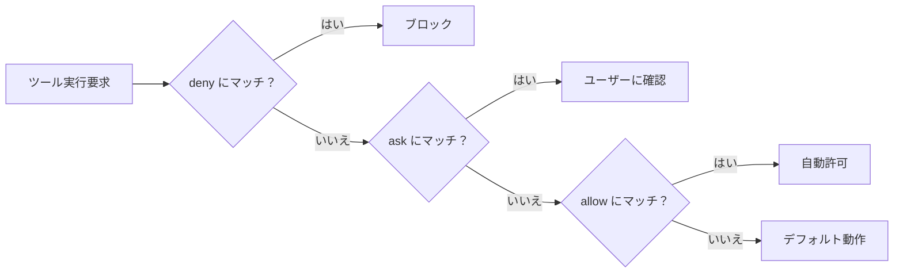

# 設定ファイル（settings.json）詳細ガイド

## 概要

`settings.json` は Claude Code の動作を制御する JSON 形式の設定ファイルです。権限制御、環境変数、モデル選択、サンドボックスなど、あらゆる動作をカスタマイズできます。

**なぜ設定ファイルを理解する必要があるか？**
デフォルト設定でも動作しますが、設定を活用すると「毎回の確認プロンプトを省略」「危険なコマンドを自動ブロック」「チーム全員に同じルールを適用」といった効率化・安全性向上が可能になります。

---

## 目次

- [1. 設定ファイルの種類と配置場所](#1-設定ファイルの種類と配置場所)
- [2. 基本構造](#2-基本構造)
- [3. 主要な設定項目](#3-主要な設定項目)
  - [permissions（権限設定）](#permissions権限設定)
  - [env（環境変数）](#env環境変数)
  - [model（モデル設定）](#modelモデル設定)
  - [sandbox（サンドボックス）](#sandboxサンドボックス)
  - [その他の設定](#その他の設定)
- [4. 環境変数リファレンス](#4-環境変数リファレンス)
- [5. 設定の確認・変更方法](#5-設定の確認変更方法)
- [6. 実践的な設定例](#6-実践的な設定例)
- [7. 参考リンク](#7-参考リンク)

---

## 1. 設定ファイルの種類と配置場所

| スコープ | ファイルパス | 共有範囲 | Git管理 |
|---------|------------|---------|---------|
| ユーザー設定 | `~/.claude/settings.json` | 自分のみ（全プロジェクト） | しない |
| プロジェクト設定 | `.claude/settings.json` | チーム全体 | する |
| ローカル設定 | `.claude/settings.local.json` | 自分のみ（このプロジェクト） | しない |
| 管理者設定 | `managed-settings.json`（システムレベル） | 組織全体 | IT管理 |

> **なぜ複数のファイルがあるのか？**
> 「個人の好み」と「チームルール」と「組織ポリシー」を分離するためです。例えば、チーム設定で `git push` を deny にしつつ、個人設定で好みのモデルを指定する、といった使い分けが可能です。

### 各スコープで設定可能な機能

| 機能 | ユーザー | プロジェクト | ローカル |
|------|---------|------------|---------|
| settings.json | `~/.claude/settings.json` | `.claude/settings.json` | `.claude/settings.local.json` |
| サブエージェント | `~/.claude/agents/` | `.claude/agents/` | -- |
| MCP サーバー | `~/.claude.json` | `.mcp.json` | `~/.claude.json`（per-project） |
| CLAUDE.md | `~/.claude/CLAUDE.md` | `CLAUDE.md` or `.claude/CLAUDE.md` | `CLAUDE.local.md` |

---

## 2. 基本構造

### 最小構成

```json
{
  "$schema": "https://json.schemastore.org/claude-code-settings.json"
}
```

`$schema` を指定すると、エディタで設定キーの補完やバリデーションが効くようになります。

### 典型的な構成

```json
{
  "$schema": "https://json.schemastore.org/claude-code-settings.json",
  "permissions": {
    "allow": ["Bash(git diff *)"],
    "deny": ["Read(./.env)"]
  },
  "env": {
    "NODE_ENV": "development"
  },
  "model": "claude-sonnet-4-6",
  "language": "japanese"
}
```

---

## 3. 主要な設定項目

### permissions（権限設定）

権限設定は、Claude Code がどのツールをどの条件で使えるかを制御します。

#### 基本構造

```json
{
  "permissions": {
    "allow": ["ルール1", "ルール2"],
    "ask": ["ルール3"],
    "deny": ["ルール4"]
  }
}
```

| キー | 効果 |
|------|------|
| `allow` | 確認なしで自動許可 |
| `ask` | 毎回ユーザーに確認を求める |
| `deny` | 実行を完全にブロック |

#### 評価順序

**deny → ask → allow** の順で評価され、最初にマッチしたルールが適用されます。



#### ルール構文

ルールは `Tool` または `Tool(specifier)` の形式で記述します。

| ルール | 効果 |
|--------|------|
| `Bash` | すべてのBashコマンド |
| `Bash(npm run *)` | `npm run` で始まるコマンド |
| `Bash(git diff *)` | `git diff` コマンド |
| `Read(./.env)` | `.env` ファイルの読み取り |
| `Read(./.env.*)` | `.env.*` ファイルの読み取り |
| `Read(./secrets/**)` | `secrets/` 配下の全ファイル（再帰） |
| `Edit(./)` | カレントディレクトリへの書き込み |
| `WebFetch` | すべてのWeb取得 |
| `WebFetch(domain:example.com)` | 特定ドメインへのWeb取得 |
| `MCP` | すべてのMCPツール |
| `Task` | Taskツールの使用 |

> **なぜワイルドカードを使うのか？**
> `Bash(git diff *)` のように `*` を使うと、`git diff HEAD`、`git diff --staged` など引数が異なるコマンドをまとめて許可できます。個別に書く手間が省けます。

#### 実用的な権限設定例

```json
{
  "permissions": {
    "allow": [
      "Bash(git diff *)",
      "Bash(git log *)",
      "Bash(git status)",
      "Bash(npm run lint)",
      "Bash(npm test)",
      "Bash(npx prettier *)"
    ],
    "deny": [
      "Bash(git push *)",
      "Bash(git reset --hard *)",
      "Bash(rm -rf *)",
      "Read(./.env)",
      "Read(./.env.*)",
      "Read(./secrets/**)"
    ]
  }
}
```

#### その他の権限関連設定

| キー | 型 | 説明 |
|------|-----|------|
| `permissions.additionalDirectories` | array | 追加の作業ディレクトリ |
| `permissions.defaultMode` | string | デフォルトの権限モード |
| `permissions.disableBypassPermissionsMode` | string | `"disable"` でバイパスモードを無効化 |

### env（環境変数）

`settings.json` の `env` フィールドで、セッションに環境変数を注入できます。

```json
{
  "env": {
    "NODE_ENV": "development",
    "DATABASE_URL": "postgresql://localhost:5432/mydb",
    "DEBUG": "true"
  }
}
```

> **なぜ settings.json で環境変数を設定するのか？**
> シェルの `.bashrc` とは別に、Claude Code セッション専用の環境変数を設定できます。チーム設定（`.claude/settings.json`）に書けば、全メンバーの Claude Code セッションに同じ変数を注入できます。

### model（モデル設定）

| キー | 型 | 説明 | 例 |
|------|-----|------|-----|
| `model` | string | デフォルトモデルの指定 | `"claude-sonnet-4-6"` |
| `availableModels` | array | 利用可能モデルの制限 | `["sonnet", "haiku"]` |

```json
{
  "model": "claude-sonnet-4-6",
  "availableModels": ["sonnet", "haiku"]
}
```

### sandbox（サンドボックス）

サンドボックスは Bash コマンドの実行を隔離環境で行う機能です。

```json
{
  "sandbox": {
    "enabled": true,
    "autoAllowBashIfSandboxed": true,
    "excludedCommands": ["docker"],
    "network": {
      "allowedDomains": ["github.com", "*.npmjs.org", "registry.yarnpkg.com"],
      "allowUnixSockets": ["/var/run/docker.sock"],
      "allowLocalBinding": true
    }
  }
}
```

| キー | 型 | 説明 |
|------|-----|------|
| `sandbox.enabled` | boolean | サンドボックスの有効化 |
| `sandbox.autoAllowBashIfSandboxed` | boolean | サンドボックス内のコマンドを自動許可 |
| `sandbox.excludedCommands` | array | サンドボックス外で実行するコマンド |
| `sandbox.network.allowedDomains` | array | 通信許可するドメイン（ワイルドカード対応） |
| `sandbox.network.allowUnixSockets` | array | アクセス許可するUnixソケット |
| `sandbox.network.allowLocalBinding` | boolean | localhostへのバインドを許可（macOS） |

> **なぜサンドボックスを使うのか？**
> Claude Code がBashコマンドを実行する際、意図しないファイル削除やネットワークアクセスを防止できます。特にチームで使う場合、`autoAllowBashIfSandboxed: true` にすれば確認プロンプトなしで安全にコマンド実行できます。

### その他の設定

#### コア設定

| キー | 型 | 説明 | 例 |
|------|-----|------|-----|
| `language` | string | 応答言語 | `"japanese"` |
| `outputStyle` | string | 応答スタイル | `"Explanatory"` |
| `alwaysThinkingEnabled` | boolean | 拡張思考をデフォルト有効化 | `true` |
| `autoUpdatesChannel` | string | 自動更新チャンネル | `"stable"` or `"latest"` |

#### Git 帰属表示

```json
{
  "attribution": {
    "commit": "Generated by Claude Code",
    "pr": "This PR was created with Claude Code"
  }
}
```

#### セッション管理

| キー | 型 | 説明 | 例 |
|------|-----|------|-----|
| `cleanupPeriodDays` | number | 非アクティブセッションの削除日数 | `20` |

#### 認証関連

| キー | 型 | 説明 |
|------|-----|------|
| `apiKeyHelper` | string | カスタム認証スクリプト（`/bin/sh` で実行） |
| `awsAuthRefresh` | string | AWS認証情報更新スクリプト |

#### MCP サーバー管理

| キー | 型 | 説明 |
|------|-----|------|
| `enableAllProjectMcpServers` | boolean | プロジェクト `.mcp.json` の全サーバーを自動承認 |
| `enabledMcpjsonServers` | array | 承認する特定サーバー |
| `disabledMcpjsonServers` | array | 拒否する特定サーバー |

---

## 4. 環境変数リファレンス

`settings.json` の `env` フィールドだけでなく、シェル環境で設定する環境変数も多数あります。

### API・認証

| 変数名 | 用途 |
|--------|------|
| `ANTHROPIC_API_KEY` | APIキー |
| `ANTHROPIC_AUTH_TOKEN` | カスタム Authorization ヘッダー |
| `ANTHROPIC_CUSTOM_HEADERS` | カスタムヘッダー（改行区切り） |

### モデル設定

| 変数名 | 用途 |
|--------|------|
| `ANTHROPIC_MODEL` | モデル名の指定 |
| `ANTHROPIC_DEFAULT_HAIKU_MODEL` | Haikuクラスモデルの上書き |
| `ANTHROPIC_DEFAULT_SONNET_MODEL` | Sonnetクラスモデルの上書き |
| `ANTHROPIC_DEFAULT_OPUS_MODEL` | Opusクラスモデルの上書き |
| `CLAUDE_CODE_EFFORT_LEVEL` | 推論レベル（`"low"`, `"medium"`, `"high"`） |

### Bash ツール設定

| 変数名 | 用途 |
|--------|------|
| `BASH_DEFAULT_TIMEOUT_MS` | Bashのデフォルトタイムアウト |
| `BASH_MAX_TIMEOUT_MS` | Bashの最大タイムアウト |
| `BASH_MAX_OUTPUT_LENGTH` | Bash出力の最大文字数 |
| `CLAUDE_CODE_SHELL` | シェル検出の上書き |

### コンテキスト・トークン設定

| 変数名 | 用途 |
|--------|------|
| `CLAUDE_CODE_MAX_OUTPUT_TOKENS` | 最大出力トークン数（32000〜64000） |
| `CLAUDE_AUTOCOMPACT_PCT_OVERRIDE` | 自動圧縮トリガーの割合（1〜100） |
| `MAX_THINKING_TOKENS` | 拡張思考のトークン予算（0で無効化） |

### プロキシ設定

| 変数名 | 用途 |
|--------|------|
| `HTTP_PROXY` | HTTPプロキシサーバー |
| `HTTPS_PROXY` | HTTPSプロキシサーバー |
| `NO_PROXY` | プロキシバイパスするドメイン/IP |

### テレメトリ・監視

| 変数名 | 用途 |
|--------|------|
| `DISABLE_TELEMETRY` | Statsigテレメトリの無効化 |
| `DISABLE_ERROR_REPORTING` | Sentryエラーレポートの無効化 |
| `CLAUDE_CODE_DISABLE_NONESSENTIAL_TRAFFIC` | 非必須通信の一括無効化 |

### Vertex AI / Bedrock / Foundry

| 変数名 | 用途 |
|--------|------|
| `CLAUDE_CODE_USE_VERTEX` | Vertex AI を使用（`"1"`） |
| `CLAUDE_CODE_USE_BEDROCK` | Bedrock を使用（`"1"`） |
| `CLAUDE_CODE_USE_FOUNDRY` | Microsoft Foundry を使用（`"1"`） |

---

## 5. 設定の確認・変更方法

### `/config` コマンド

Claude Code 内で `/config` と入力すると、現在の設定を対話的に確認・変更できます。

### 直接ファイル編集

任意のテキストエディタで `settings.json` を直接編集できます。

```bash
# ユーザー設定を編集
code ~/.claude/settings.json

# プロジェクト設定を編集
code .claude/settings.json
```

> **ポイント**: `$schema` を設定しておくと、VS Code などのエディタで入力補完が効き、設定ミスを防げます。

---

## 6. 実践的な設定例

### 個人プロジェクト向け

安全にコマンド実行しつつ、よく使う操作を自動許可する設定です。

```json
{
  "$schema": "https://json.schemastore.org/claude-code-settings.json",
  "permissions": {
    "allow": [
      "Bash(git diff *)",
      "Bash(git log *)",
      "Bash(git status)",
      "Bash(npm run *)",
      "Bash(npx prettier *)",
      "Bash(npx eslint *)"
    ],
    "deny": [
      "Bash(git push --force *)",
      "Bash(git reset --hard *)",
      "Bash(rm -rf *)",
      "Read(./.env)",
      "Read(./.env.*)"
    ]
  },
  "model": "claude-sonnet-4-6",
  "language": "japanese"
}
```

### チームプロジェクト向け

チーム全員で共有する設定（`.claude/settings.json` に配置）です。

```json
{
  "$schema": "https://json.schemastore.org/claude-code-settings.json",
  "permissions": {
    "allow": [
      "Bash(npm run lint)",
      "Bash(npm run test *)",
      "Bash(git diff *)",
      "Bash(git status)"
    ],
    "deny": [
      "Bash(git push *)",
      "Bash(git reset *)",
      "Bash(rm -rf *)",
      "Read(./.env)",
      "Read(./.env.*)",
      "Read(./secrets/**)"
    ]
  },
  "sandbox": {
    "enabled": true,
    "autoAllowBashIfSandboxed": true,
    "network": {
      "allowedDomains": ["github.com", "*.npmjs.org"]
    }
  }
}
```

---

## 7. 参考リンク

- [Settings - 公式ドキュメント](https://code.claude.com/docs/en/settings)
- [Permissions - 権限モデルの詳細](https://code.claude.com/docs/en/permissions)
- [← README.md に戻る](./README.md)
