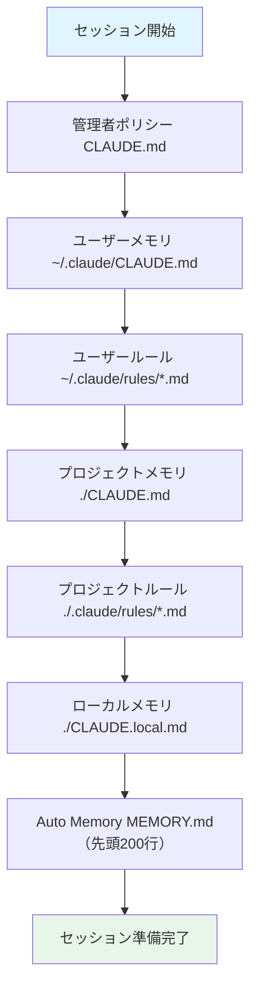

# メモリシステム詳細ガイド

## 概要

Claude Code のメモリシステムは、セッションをまたいで指示・ルール・学習内容を保持する仕組みです。手動で記述する **CLAUDE.md** ファイルと、Claude が自動的に保存する **Auto Memory** の2種類があります。

**なぜメモリが重要か？**
メモリがないと、毎回のセッションで「このプロジェクトは TypeScript で書いてね」「テストは vitest を使ってね」といった指示を繰り返す必要があります。メモリを活用すれば、プロジェクトのコンテキストを自動的に引き継げます。

---

## 目次

- [1. メモリの種類](#1-メモリの種類)
- [2. CLAUDE.md ファイル](#2-claudemd-ファイル)
  - [配置場所とスコープ](#配置場所とスコープ)
  - [書き方のベストプラクティス](#書き方のベストプラクティス)
  - [@import 構文](#import-構文)
  - [CLAUDE.local.md（個人用）](#claudelocalmd個人用)
- [3. .claude/rules/ ディレクトリ](#3-clauderules-ディレクトリ)
  - [基本構造](#基本構造)
  - [パス固有ルール](#パス固有ルール)
  - [サブディレクトリとシンボリックリンク](#サブディレクトリとシンボリックリンク)
- [4. Auto Memory](#4-auto-memory)
  - [仕組み](#仕組み)
  - [MEMORY.md とトピックファイル](#memorymd-とトピックファイル)
  - [管理方法](#管理方法)
  - [有効化・無効化](#有効化無効化)
- [5. メモリ設計のベストプラクティス](#5-メモリ設計のベストプラクティス)
- [6. 参考リンク](#6-参考リンク)

---

## 1. メモリの種類

Claude Code には6種類のメモリがあり、それぞれスコープと用途が異なります。

| メモリ種類 | 配置場所 | 用途 | 共有範囲 |
|-----------|---------|------|---------|
| 管理者ポリシー | システムレベル `CLAUDE.md` | 組織全体の指示 | 組織全体 |
| プロジェクトメモリ | `./CLAUDE.md` or `./.claude/CLAUDE.md` | チーム共有の指示 | チーム（Git管理） |
| プロジェクトルール | `./.claude/rules/*.md` | トピック別の指示 | チーム（Git管理） |
| ユーザーメモリ | `~/.claude/CLAUDE.md` | 個人の好み（全プロジェクト） | 自分のみ |
| ローカルメモリ | `./CLAUDE.local.md` | 個人のプロジェクト固有設定 | 自分のみ |
| Auto Memory | `~/.claude/projects/<project>/memory/` | Claude の自動学習 | 自分のみ |

### 読み込み順序



> **優先順位のルール**: より具体的（スコープが狭い）指示が、より広い指示を上書きします。子ディレクトリの CLAUDE.md は、Claude がそのディレクトリのファイルを読んだときにオンデマンドで読み込まれます。

---

## 2. CLAUDE.md ファイル

### 配置場所とスコープ

CLAUDE.md はプロジェクトルートまたは `.claude/` 配下に配置します。

```
project-root/
├── CLAUDE.md              # プロジェクトルートに配置（推奨）
├── CLAUDE.local.md        # 個人用（自動でgitignore）
└── .claude/
    └── CLAUDE.md          # 代替配置場所
```

**読み込みの仕組み**:
- Claude Code はカレントディレクトリからルート（`/`）に向かって再帰的に `CLAUDE.md` と `CLAUDE.local.md` を探索します
- 親ディレクトリのファイルはセッション開始時にすべて読み込まれます
- 子ディレクトリのファイルは、そのディレクトリのファイルにアクセスしたときにオンデマンドで読み込まれます

### 書き方のベストプラクティス

CLAUDE.md には、Claude Code に守ってほしいルールや知っておいてほしい情報を記述します。

```markdown
# CLAUDE.md

## プロジェクト概要
- TypeScript + React のフロントエンドプロジェクト
- パッケージマネージャーは pnpm を使用

## コーディングルール
- 関数は arrow function で書く
- コンポーネントは functional component のみ
- テストは vitest を使用し、`pnpm test` で実行

## よく使うコマンド
- `pnpm dev` - 開発サーバー起動
- `pnpm build` - ビルド
- `pnpm test` - テスト実行
- `pnpm lint` - lint 実行
```

> **ポイント**: 短く、具体的に書くことが重要です。長すぎる CLAUDE.md はコンテキストウィンドウを圧迫し、かえって効率が下がります。

### @import 構文

CLAUDE.md から他のファイルを参照できます。

```markdown
プロジェクト概要は @README.md を参照してください。
利用可能なnpmコマンドは @package.json を確認してください。

# 追加の指示
- Git ワークフローは @docs/git-instructions.md に従ってください。
```

#### @import のルール

| ルール | 詳細 |
|--------|------|
| パス解決 | import を含むファイルからの相対パス（作業ディレクトリではない） |
| 絶対パス | 使用可能（例: `@~/.claude/my-instructions.md`） |
| 再帰 import | 最大5階層まで再帰的に解決 |
| コードブロック内 | マークダウンのコードブロック・コードスパン内では無効 |
| 初回承認 | プロジェクトごとに初回のみ承認ダイアログが表示される |

#### 使用例

```markdown
# プロジェクト固有の指示
- コーディング規約は @docs/coding-standards.md を参照
- API設計ガイドラインは @docs/api-guidelines.md を参照

# 個人設定（ワークツリー間で共有）
- @~/.claude/my-project-instructions.md
```

### CLAUDE.local.md（個人用）

`CLAUDE.local.md` は個人用のメモリファイルで、自動的に `.gitignore` に追加されます。

```markdown
# CLAUDE.local.md

## 個人の好み
- 日本語で回答してください
- コミットメッセージは英語で書いてください

## ローカル環境情報
- Node.js v22 を使用
- データベースは localhost:5432 で起動済み
```

> **なぜ CLAUDE.local.md を使うのか？**
> チームメンバーそれぞれが異なるローカル環境や好みを持っています。これらを `CLAUDE.md`（チーム共有）に書くと衝突するため、個人設定は `CLAUDE.local.md` に分離します。

---

## 3. .claude/rules/ ディレクトリ

### 基本構造

`.claude/rules/` ディレクトリに `.md` ファイルを配置すると、自動的にプロジェクトメモリとして読み込まれます。

```
project-root/
└── .claude/
    └── rules/
        ├── code-style.md    # コーディングスタイルのルール
        ├── testing.md       # テストに関するルール
        └── security.md      # セキュリティに関するルール
```

> **なぜ rules ディレクトリを使うのか？**
> CLAUDE.md が長大になると管理が難しくなります。トピックごとにファイルを分けることで、特定のルールだけを見つけやすく、変更時の差分も小さくなります。

### パス固有ルール

YAML frontmatter で `paths` を指定すると、特定のファイルパスにマッチした場合にのみルールが適用されます。

```markdown
---
paths:
  - "src/api/**/*.ts"
---

# API開発ルール

- すべてのAPIエンドポイントで入力バリデーションを行うこと
- レスポンスは統一フォーマットで返すこと
- エラーハンドリングは try-catch で行うこと
```

#### glob パターンの例

| パターン | マッチ対象 |
|---------|---------|
| `**/*.ts` | 全ディレクトリの TypeScript ファイル |
| `src/**/*` | `src/` 配下の全ファイル |
| `*.md` | プロジェクトルートの Markdown ファイル |
| `src/components/*.tsx` | 特定ディレクトリの React コンポーネント |
| `src/**/*.{ts,tsx}` | TypeScript + TSX ファイル |
| `{src,lib}/**/*.ts` | `src/` と `lib/` 配下の TypeScript ファイル |

#### 具体例：テスト用ルール

```markdown
---
paths:
  - "**/*.test.ts"
  - "**/*.spec.ts"
---

# テストルール

- describe/it のネスト構造で書くこと
- テスト名は日本語で書いてよい
- モックは vi.mock() を使用すること
- カバレッジ目標: 80%以上
```

`paths` フィールドがないルールファイルは、無条件にすべてのファイルに適用されます。

### サブディレクトリとシンボリックリンク

- rules ディレクトリ内にサブディレクトリを作成して整理できます（再帰的に検出）
- シンボリックリンクもサポートされています（循環リンクは安全に処理）

```
.claude/rules/
├── frontend/
│   ├── react.md
│   └── css.md
├── backend/
│   ├── api.md
│   └── database.md
└── general/
    └── coding-style.md
```

### ユーザーレベルのルール

`~/.claude/rules/` に配置したルールは、すべてのプロジェクトで読み込まれます。プロジェクトルールの方が優先順位が高いため、プロジェクト固有のルールで上書き可能です。

---

## 4. Auto Memory

### 仕組み

Auto Memory は Claude が作業中に自動的に有用な情報を保存する仕組みです。明示的に「覚えて」と指示しなくても、以下のような情報が保存されます。

- **プロジェクトパターン**: ビルドコマンド、テスト規約、コーディングスタイル
- **デバッグの知見**: トリッキーな問題の解決策、よくあるエラー原因
- **アーキテクチャ**: 重要なファイル、モジュール間の関係、主要な抽象化
- **ユーザーの好み**: コミュニケーションスタイル、ワークフロー、ツール選択

### MEMORY.md とトピックファイル

Auto Memory は以下のディレクトリ構造で保存されます。

```
~/.claude/projects/<project>/memory/
├── MEMORY.md          # メインインデックス（毎セッション読み込み）
├── debugging.md       # デバッグパターンの詳細メモ
├── api-conventions.md # API設計の決定事項
└── patterns.md        # プロジェクト固有のパターン
```

| ファイル | 読み込みタイミング | 説明 |
|---------|-------------------|------|
| `MEMORY.md` | セッション開始時（先頭200行） | 簡潔なインデックス。重要な情報を凝縮 |
| トピックファイル | オンデマンド | 詳細なメモ。Claude が必要に応じて参照 |

> **なぜ200行制限があるのか？**
> MEMORY.md の内容は毎セッションのシステムプロンプトに注入されるため、長すぎるとコンテキストウィンドウを圧迫します。詳細情報はトピックファイルに分離し、MEMORY.md は簡潔なインデックスとして保つことが推奨されます。

#### `<project>` パスの決定ルール

| 状況 | パス |
|------|------|
| Git リポジトリ内 | リポジトリルートから派生 |
| 同じリポジトリのサブディレクトリ | 同じメモリディレクトリを共有 |
| Git worktree | 別のメモリディレクトリ |
| Git リポジトリ外 | 作業ディレクトリから派生 |

### 管理方法

#### `/memory` コマンド

Claude Code 内で `/memory` と入力すると、システムエディタでメモリファイルを開けます。

#### 明示的な指示

Claude に直接指示することもできます。

```
「bunを使うことを覚えておいて」
「npmではなくpnpmを使うことを常に覚えておいて」
「このプロジェクトのテストはvitestで実行することを記憶して」
```

### 有効化・無効化

```bash
# Auto Memory を強制無効化
export CLAUDE_CODE_DISABLE_AUTO_MEMORY=1

# Auto Memory を強制有効化
export CLAUDE_CODE_DISABLE_AUTO_MEMORY=0
```

どちらも設定されていない場合は、段階的ロールアウトの設定に従います。

---

## 5. メモリ設計のベストプラクティス

### チームで共有すべきもの vs 個人用

| 内容 | 配置先 | 理由 |
|------|--------|------|
| コーディング規約 | `.claude/rules/code-style.md` | チーム全員に適用 |
| ビルド・テストコマンド | `CLAUDE.md` | プロジェクト共通 |
| API設計ガイドライン | `.claude/rules/api.md` | チーム標準 |
| 個人のエディタ設定 | `CLAUDE.local.md` | 個人の好み |
| ローカル環境情報 | `CLAUDE.local.md` | 環境依存 |
| デバッグの知見 | Auto Memory | 個人の学習 |

### ファイルの肥大化を防ぐコツ

1. **CLAUDE.md は簡潔に保つ**: 必要最小限のルールと頻出コマンドのみ記載
2. **トピックごとに rules/ で分離**: 長いルールは `.claude/rules/` に分割
3. **MEMORY.md は200行以内**: 詳細はトピックファイルへ
4. **定期的に見直す**: 古くなった情報は削除・更新
5. **@import を活用**: 既存ドキュメント（README.md等）を参照し、重複を避ける

### `/init` コマンドの活用

新しいプロジェクトで `/init` コマンドを実行すると、Claude がプロジェクトを分析して初期の CLAUDE.md を自動生成してくれます。手動で一から書く手間が省けます。

---

## 6. 参考リンク

- [Memory - 公式ドキュメント](https://code.claude.com/docs/en/memory)
- [← README.md に戻る](./README.md)
