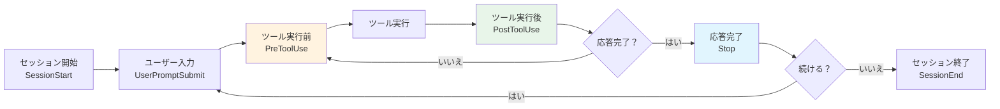

# Hooks（自動化）詳細ガイド

## 概要

Hooks は Claude Code のライフサイクルイベントに応じて自動実行されるカスタムコマンドです。ツール実行前後、セッション開始・終了、応答完了時などのタイミングで、シェルコマンドや LLM プロンプトを実行できます。

**なぜ Hooks を使うのか？**
Hooks を使うと「ファイル保存後に自動フォーマット」「危険なコマンドの自動ブロック」「テスト自動実行」など、手動操作なしで品質管理や安全性確保を実現できます。CI/CD のローカル版のようなイメージです。

---

## 目次

- [1. Hooks とは](#1-hooks-とは)
  - [ライフサイクルの概念](#ライフサイクルの概念)
  - [3種類のフック](#3種類のフック)
- [2. 設定方法](#2-設定方法)
  - [設定ファイルの配置場所](#設定ファイルの配置場所)
  - [基本構造](#基本構造)
  - [/hooks メニュー](#hooks-メニュー)
- [3. 主要イベント一覧](#3-主要イベント一覧)
  - [全イベントテーブル](#全イベントテーブル)
  - [代表的なイベントの詳細](#代表的なイベントの詳細)
- [4. 実践的な使用例](#4-実践的な使用例)
- [5. セキュリティ上の注意点](#5-セキュリティ上の注意点)
- [6. トラブルシューティング](#6-トラブルシューティング)
- [7. 参考リンク](#7-参考リンク)

---

## 1. Hooks とは

### ライフサイクルの概念

Claude Code のセッション中には様々なイベントが発生します。Hooks はこれらのイベントに「フック（引っ掛け）」して、カスタム処理を差し込む仕組みです。



### 3種類のフック

| 種類 | type | 説明 | 用途 |
|------|------|------|------|
| コマンド | `"command"` | シェルコマンドを実行。stdin でJSON入力を受け取る | lint実行、ファイル保護、通知送信 |
| プロンプト | `"prompt"` | LLM に1回の問い合わせを行い、yes/no で判定 | コード品質チェック、タスク完了確認 |
| エージェント | `"agent"` | LLM にマルチターンで問い合わせ（Read/Grep/Glob使用可） | テスト実行検証、コードレビュー |

> **なぜ3種類あるのか？**
> シンプルなチェック（ファイルパスの検証）はコマンドフック、判断が必要な処理（コード品質判定）はプロンプトフック、複雑な検証（テスト通過確認）はエージェントフックと、用途に応じて使い分けます。

---

## 2. 設定方法

### 設定ファイルの配置場所

| 配置場所 | スコープ | チーム共有 |
|---------|---------|---------|
| `~/.claude/settings.json` | 全プロジェクト | いいえ |
| `.claude/settings.json` | このプロジェクト | はい（Git管理） |
| `.claude/settings.local.json` | このプロジェクト | いいえ（gitignore） |
| `managed-settings.json` | 組織全体 | はい（管理者制御） |

### 基本構造

Hooks は `settings.json` の `hooks` フィールドに設定します。3階層の構造を持ちます。

```
hooks（フック設定）
 └── イベント名（例: PreToolUse）
      └── マッチャーグループ（フィルタ条件）
           └── フックハンドラ（実行内容）
```

#### 具体的な JSON 構造

```json
{
  "hooks": {
    "PreToolUse": [
      {
        "matcher": "Edit|Write",
        "hooks": [
          {
            "type": "command",
            "command": "echo 'ファイル編集が実行されます'"
          }
        ]
      }
    ]
  }
}
```

| フィールド | 必須 | 説明 |
|-----------|------|------|
| `matcher` | いいえ | イベントをフィルタする正規表現パターン（空文字 or 省略で全マッチ） |
| `hooks` | はい | 実行するフックハンドラの配列 |
| `hooks[].type` | はい | `"command"`, `"prompt"`, `"agent"` のいずれか |
| `hooks[].command` | command時 | 実行するシェルコマンド |
| `hooks[].prompt` | prompt/agent時 | LLM に送るプロンプト（`$ARGUMENTS` で入力JSONを参照可） |
| `hooks[].timeout` | いいえ | タイムアウト秒数（デフォルト: command=600, prompt=30, agent=60） |
| `hooks[].async` | いいえ | `true` でバックグラウンド実行（command のみ） |
| `hooks[].statusMessage` | いいえ | スピナーに表示するカスタムメッセージ |

### /hooks メニュー

Claude Code 内で `/hooks` と入力すると、対話的にフックの追加・編集・削除ができます。JSON を手書きするよりも簡単です。

---

## 3. 主要イベント一覧

### 全イベントテーブル

| イベント | 発火タイミング | マッチャー対象 | ブロック可能 |
|---------|---------------|---------------|-------------|
| `SessionStart` | セッション開始・再開 | `startup`, `resume`, `clear`, `compact` | いいえ |
| `UserPromptSubmit` | プロンプト送信時 | なし（常に発火） | はい |
| `PreToolUse` | ツール実行前 | ツール名（`Bash`, `Edit` 等） | はい |
| `PermissionRequest` | 権限確認ダイアログ表示時 | ツール名 | はい |
| `PostToolUse` | ツール実行成功後 | ツール名 | いいえ |
| `PostToolUseFailure` | ツール実行失敗後 | ツール名 | いいえ |
| `Notification` | Claude が通知送信時 | `permission_prompt`, `idle_prompt` 等 | いいえ |
| `SubagentStart` | サブエージェント生成時 | エージェント型名 | いいえ |
| `SubagentStop` | サブエージェント終了時 | エージェント型名 | はい |
| `Stop` | Claude の応答完了時 | なし（常に発火） | はい |
| `TeammateIdle` | チームメイトがアイドル状態 | なし（常に発火） | はい |
| `TaskCompleted` | タスク完了時 | なし（常に発火） | はい |
| `ConfigChange` | 設定ファイル変更時 | `user_settings`, `project_settings` 等 | はい |
| `WorktreeCreate` | Worktree 作成時 | なし（常に発火） | はい |
| `WorktreeRemove` | Worktree 削除時 | なし（常に発火） | いいえ |
| `PreCompact` | コンテキスト圧縮前 | `manual`, `auto` | いいえ |
| `SessionEnd` | セッション終了時 | `clear`, `logout` 等 | いいえ |

### 代表的なイベントの詳細

#### PreToolUse（ツール実行前）

最もよく使われるイベントです。ツール実行をブロックしたり、入力を書き換えたりできます。

**マッチャーの例**:
- `Bash` - Bash コマンド
- `Edit|Write` - ファイル編集・作成
- `Read` - ファイル読み取り
- `mcp__.*` - すべての MCP ツール

**入力JSON（stdin）**:

```json
{
  "session_id": "abc123",
  "hook_event_name": "PreToolUse",
  "tool_name": "Bash",
  "tool_input": {
    "command": "rm -rf /tmp/test"
  },
  "tool_use_id": "xyz789",
  "cwd": "/path/to/project"
}
```

**出力JSON（stdout）**:

```json
{
  "hookSpecificOutput": {
    "permissionDecision": "deny",
    "permissionDecisionReason": "rm -rf は禁止されています"
  }
}
```

`permissionDecision` は `"allow"`, `"deny"`, `"ask"` のいずれかです。

#### PostToolUse（ツール実行後）

ツール実行成功後に発火します。lint やフォーマットの自動実行に適しています。

**入力JSON に含まれる追加フィールド**:

```json
{
  "tool_name": "Edit",
  "tool_input": {
    "file_path": "src/index.ts",
    "old_string": "...",
    "new_string": "..."
  },
  "tool_response": "File edited successfully"
}
```

#### Stop（応答完了時）

Claude が応答を完了した時に発火します。exit code 2 でブロックすると、Claude に続行を指示できます。

**重要**: `stop_hook_active` フィールドをチェックして、無限ループを防いでください。

```bash
#!/bin/bash
INPUT=$(cat)
if [ "$(echo "$INPUT" | jq -r '.stop_hook_active')" = "true" ]; then
  exit 0  # Claude の停止を許可（無限ループ防止）
fi
# ... フックのロジック
```

#### SessionStart（セッション開始時）

セッション開始時にコンテキストを注入するのに便利です。

```json
{
  "hooks": {
    "SessionStart": [
      {
        "matcher": "compact",
        "hooks": [
          {
            "type": "command",
            "command": "echo 'リマインダー: bunを使用。テストはbun testで実行。'"
          }
        ]
      }
    ]
  }
}
```

> **なぜ `compact` マッチャーを使うのか？**
> コンテキスト圧縮後にセッションが再開されると、それまでの指示が失われる可能性があります。`compact` でフックして重要な指示を再注入すると、圧縮後も一貫した動作を維持できます。

#### UserPromptSubmit（プロンプト送信時）

ユーザーがプロンプトを送信した直後、処理開始前に発火します。入力のバリデーションや追加コンテキストの注入に使えます。

### 終了コードの動作

| 終了コード | 動作 |
|-----------|------|
| `0` | 成功。stdout の JSON を解析 |
| `2` | ブロックエラー。stderr のメッセージが Claude にフィードバック |
| その他 | 非ブロックエラー。実行は継続。stderr はデバッグモードで表示 |

---

## 4. 実践的な使用例

### ファイル変更後の自動フォーマット

ファイル編集後に Prettier を自動実行します。

```json
{
  "hooks": {
    "PostToolUse": [
      {
        "matcher": "Edit|Write",
        "hooks": [
          {
            "type": "command",
            "command": "jq -r '.tool_input.file_path' | xargs npx prettier --write"
          }
        ]
      }
    ]
  }
}
```

### 危険なコマンドのブロック

保護対象ファイルへの編集を防止するスクリプトです。

`.claude/hooks/protect-files.sh`:

```bash
#!/bin/bash
INPUT=$(cat)
FILE_PATH=$(echo "$INPUT" | jq -r '.tool_input.file_path // empty')

PROTECTED_PATTERNS=(".env" "package-lock.json" ".git/")

for pattern in "${PROTECTED_PATTERNS[@]}"; do
  if [[ "$FILE_PATH" == *"$pattern"* ]]; then
    echo "ブロック: $FILE_PATH は保護対象パターン '$pattern' にマッチしました" >&2
    exit 2
  fi
done
exit 0
```

設定:

```json
{
  "hooks": {
    "PreToolUse": [
      {
        "matcher": "Edit|Write",
        "hooks": [
          {
            "type": "command",
            "command": "\"$CLAUDE_PROJECT_DIR\"/.claude/hooks/protect-files.sh"
          }
        ]
      }
    ]
  }
}
```

### テスト自動実行（async hook）

ファイル変更後にバックグラウンドでテストを実行し、結果をフィードバックします。

`.claude/hooks/run-tests-async.sh`:

```bash
#!/bin/bash
INPUT=$(cat)
FILE_PATH=$(echo "$INPUT" | jq -r '.tool_input.file_path // empty')

# TypeScript/JavaScript ファイルのみ対象
if [[ "$FILE_PATH" != *.ts && "$FILE_PATH" != *.js ]]; then
  exit 0
fi

RESULT=$(npm test 2>&1)
EXIT_CODE=$?

if [ $EXIT_CODE -eq 0 ]; then
  echo "{\"systemMessage\": \"テスト成功: $FILE_PATH 編集後\"}"
else
  echo "{\"systemMessage\": \"テスト失敗: $FILE_PATH 編集後: $RESULT\"}"
fi
```

設定:

```json
{
  "hooks": {
    "PostToolUse": [
      {
        "matcher": "Write|Edit",
        "hooks": [
          {
            "type": "command",
            "command": "\"$CLAUDE_PROJECT_DIR\"/.claude/hooks/run-tests-async.sh",
            "async": true,
            "timeout": 300
          }
        ]
      }
    ]
  }
}
```

> **なぜ `async: true` を使うのか？**
> テスト実行は時間がかかることがあります。`async: true` にするとバックグラウンドで実行され、Claude の応答をブロックしません。結果は次のターンで `systemMessage` として通知されます。

### デスクトップ通知（macOS）

Claude Code が注意を必要とするとき（権限確認など）にデスクトップ通知を送ります。

```json
{
  "hooks": {
    "Notification": [
      {
        "matcher": "",
        "hooks": [
          {
            "type": "command",
            "command": "osascript -e 'display notification \"Claude Code needs your attention\" with title \"Claude Code\"'"
          }
        ]
      }
    ]
  }
}
```

### Bash コマンドのログ記録

実行されたすべてのBashコマンドをログファイルに記録します。

```json
{
  "hooks": {
    "PostToolUse": [
      {
        "matcher": "Bash",
        "hooks": [
          {
            "type": "command",
            "command": "jq -r '.tool_input.command' >> ~/.claude/command-log.txt"
          }
        ]
      }
    ]
  }
}
```

### プロンプトフックによるタスク完了チェック

Claude の応答完了時に、すべてのタスクが完了しているか LLM に判定させます。

```json
{
  "hooks": {
    "Stop": [
      {
        "hooks": [
          {
            "type": "prompt",
            "prompt": "Check if all tasks are complete. If not, respond with {\"ok\": false, \"reason\": \"what remains to be done\"}."
          }
        ]
      }
    ]
  }
}
```

### 設定変更の監査ログ

設定ファイルの変更をログに記録します。

```json
{
  "hooks": {
    "ConfigChange": [
      {
        "matcher": "",
        "hooks": [
          {
            "type": "command",
            "command": "jq -c '{timestamp: now | todate, source: .source, file: .file_path}' >> ~/claude-config-audit.log"
          }
        ]
      }
    ]
  }
}
```

---

## 5. セキュリティ上の注意点

Hooks はユーザーのフルシステム権限で実行されます。以下の点に注意してください。

| 注意点 | 対策 |
|--------|------|
| コマンドインジェクション | シェル変数は常にダブルクォートで囲む（`"$VAR"` not `$VAR`） |
| パストラバーサル | ファイルパスに `..` が含まれていないかチェック |
| 機密ファイルへのアクセス | `.env`, `.git/`, 鍵ファイルをスキップ |
| 絶対パスの使用 | `$CLAUDE_PROJECT_DIR` を活用して相対パス問題を回避 |
| 入力バリデーション | stdin から受け取った JSON を必ず検証 |

### フックで使える環境変数

| 変数 | 値 |
|------|-----|
| `$CLAUDE_PROJECT_DIR` | プロジェクトルートのパス |
| `${CLAUDE_PLUGIN_ROOT}` | プラグインのルートディレクトリ |
| `$CLAUDE_CODE_REMOTE` | リモートWeb環境では `"true"` |

---

## 6. トラブルシューティング

### フックが発火しない

- `/hooks` メニューで正しいイベントにフックが登録されているか確認
- マッチャーパターンが大文字小文字を区別することに注意（`bash` ではなく `Bash`）
- `PermissionRequest` フックは非対話モード（`-p`）では発火しません。`PreToolUse` を使ってください

### フックのエラー

手動でテストできます。

```bash
echo '{"tool_name":"Bash","tool_input":{"command":"ls"}}' | ./my-hook.sh
```

よくある原因:
- `jq` がインストールされていない
- スクリプトに実行権限がない（`chmod +x` を実行）
- 絶対パスではなく相対パスを使っている

### Stop フックが無限ループする

`stop_hook_active` フィールドをチェックしてください。

```bash
#!/bin/bash
INPUT=$(cat)
if [ "$(echo "$INPUT" | jq -r '.stop_hook_active')" = "true" ]; then
  exit 0  # ループ防止：Claude の停止を許可
fi
# ... 通常のロジック
```

### JSON バリデーションエラー

シェルプロファイル（`.bashrc` 等）の `echo` 文がフックの stdout に混入すると JSON パースが失敗します。

```bash
# 対策: 対話シェルのみで出力するよう条件分岐
if [[ $- == *i* ]]; then
  echo "Shell ready"
fi
```

### デバッグ方法

- `Ctrl+O` でverboseモードを有効化
- `claude --debug` でフックの実行詳細を表示

---

## 7. 参考リンク

- [Hooks - 公式リファレンス](https://code.claude.com/docs/en/hooks)
- [Hooks Guide - 実践ガイド](https://code.claude.com/docs/en/hooks-guide)
- [← README.md に戻る](./README.md)
