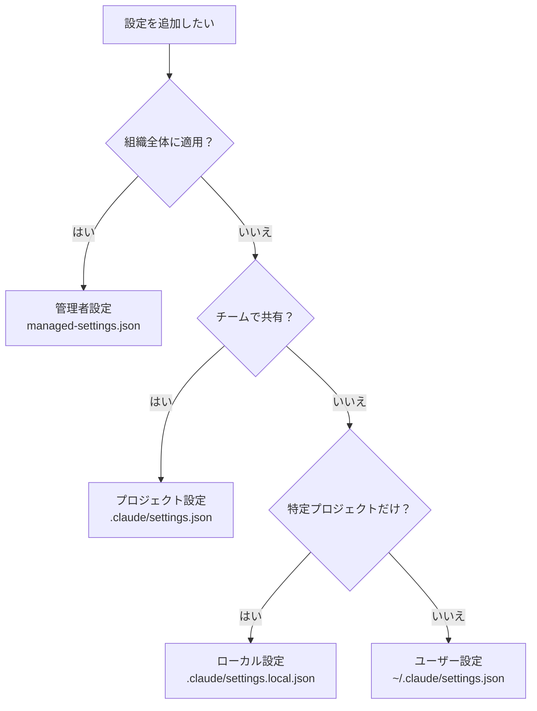

# Claude Code `.claude` ディレクトリ設定ガイド

## 概要

`.claude` ディレクトリは、Claude Code の動作をカスタマイズするための設定フォルダです。権限制御、メモリ管理、自動化フックなど、開発ワークフロー全体を制御できます。

**なぜ知る必要があるか？**
Claude Code をそのまま使っても便利ですが、`.claude` の設定を理解すると「チームで統一ルールを共有」「危険な操作の自動ブロック」「プロジェクト固有の指示を記憶」など、より安全で効率的な開発体験が得られます。

---

## 目次

- [1. .claude ディレクトリの全体像](#1-claude-ディレクトリの全体像)
  - [ディレクトリ構成図](#ディレクトリ構成図)
  - [スコープと優先順位](#スコープと優先順位)
- [2. 設定ファイル（settings.json）](#2-設定ファイルsettingsjson)
- [3. メモリシステム（CLAUDE.md / Auto Memory）](#3-メモリシステムclaudemd--auto-memory)
- [4. Hooks（自動化）](#4-hooks自動化)
- [5. よくある設定パターン](#5-よくある設定パターン)
- [6. 参考リンク](#6-参考リンク)

---

## 1. .claude ディレクトリの全体像

### ディレクトリ構成図

Claude Code の設定は3つのスコープに分かれています。

```
【ユーザースコープ】~/.claude/
├── settings.json          # ユーザー設定（全プロジェクト共通）
├── CLAUDE.md              # 個人メモリ（全プロジェクト共通）
├── rules/                 # ユーザーレベルのルール
├── agents/                # カスタムサブエージェント定義
└── projects/<project>/    # プロジェクト別の自動メモリ
    └── memory/
        ├── MEMORY.md      # メインメモリファイル
        └── *.md           # トピック別メモリファイル

【プロジェクトスコープ】<project-root>/
├── CLAUDE.md              # チーム共有メモリ
├── CLAUDE.local.md        # 個人用メモリ（gitignore対象）
├── .mcp.json              # MCP サーバー設定
└── .claude/
    ├── settings.json      # プロジェクト設定（チーム共有）
    ├── settings.local.json # ローカル設定（gitignore対象）
    ├── CLAUDE.md          # チーム共有メモリ（代替配置）
    ├── agents/            # プロジェクト固有サブエージェント
    └── rules/             # モジュール式ルールファイル
        ├── code-style.md
        ├── testing.md
        └── security.md

【管理者スコープ】システムレベル
├── managed-settings.json  # 組織全体の設定ポリシー
└── CLAUDE.md              # 組織全体の指示
```

> **なぜスコープが分かれているのか？**
> 個人の好みはユーザースコープ、チームルールはプロジェクトスコープ、組織ポリシーは管理者スコープに置くことで、設定の責任範囲が明確になります。

### スコープと優先順位

設定は以下の優先順位で評価されます（上が最優先）。

| 優先順位 | スコープ | 配置場所 | 共有範囲 |
|---------|---------|---------|---------|
| 1（最高） | 管理者 | `managed-settings.json`（システムレベル） | 組織全体 |
| 2 | CLI引数 | コマンドライン引数 | セッション限定 |
| 3 | ローカル | `.claude/settings.local.json` | 自分のみ（このプロジェクト） |
| 4 | プロジェクト | `.claude/settings.json` | チーム全体（Git管理） |
| 5（最低） | ユーザー | `~/.claude/settings.json` | 自分のみ（全プロジェクト） |

管理者設定のシステムパスは OS によって異なります。

| OS | パス |
|----|------|
| macOS | `/Library/Application Support/ClaudeCode/managed-settings.json` |
| Linux/WSL | `/etc/claude-code/managed-settings.json` |
| Windows | `C:\Program Files\ClaudeCode\managed-settings.json` |

以下のフローチャートで「どこに設定すべきか」を判断できます。



---

## 2. 設定ファイル（settings.json）

`settings.json` は Claude Code の動作を制御する中心的な設定ファイルです。

### 代表的な設定例

```json
{
  "$schema": "https://json.schemastore.org/claude-code-settings.json",
  "permissions": {
    "allow": [
      "Bash(git diff *)",
      "Bash(npm run lint)",
      "Bash(npm test)"
    ],
    "deny": [
      "Bash(curl *)",
      "Read(./.env)"
    ]
  },
  "env": {
    "NODE_ENV": "development"
  },
  "model": "claude-sonnet-4-6"
}
```

### 主な設定カテゴリ

| カテゴリ | 内容 | 設定キー例 |
|---------|------|-----------|
| 権限制御 | ツールの許可・拒否ルール | `permissions.allow`, `permissions.deny` |
| 環境変数 | セッションに注入する変数 | `env` |
| モデル設定 | 使用モデルの指定・制限 | `model`, `availableModels` |
| サンドボックス | Bash実行の隔離設定 | `sandbox` |
| Git帰属表示 | コミット時の著者情報 | `attribution` |
| UI/言語 | 応答言語やスタイル | `language`, `outputStyle` |

> **詳細は → [01-settings.md](./01-settings.md)**（全設定項目のリファレンス、権限ルール構文、サンドボックス設定、環境変数一覧など）

---

## 3. メモリシステム（CLAUDE.md / Auto Memory）

Claude Code には2種類のメモリがあります。

| 種類 | 説明 | 管理者 |
|------|------|-------|
| **CLAUDE.md** | 手動で記述する指示・ルールファイル | ユーザー/チーム |
| **Auto Memory** | Claude が自動的に学習内容を保存 | Claude（自動） |

### メモリの種類一覧

| メモリ種類 | 配置場所 | 共有範囲 |
|-----------|---------|---------|
| 管理者ポリシー | システムレベル `CLAUDE.md` | 組織全体 |
| プロジェクトメモリ | `./CLAUDE.md` or `./.claude/CLAUDE.md` | チーム |
| プロジェクトルール | `./.claude/rules/*.md` | チーム |
| ユーザーメモリ | `~/.claude/CLAUDE.md` | 自分のみ |
| ローカルメモリ | `./CLAUDE.local.md` | 自分のみ |
| Auto Memory | `~/.claude/projects/<project>/memory/` | 自分のみ |

> **詳細は → [02-memory.md](./02-memory.md)**（CLAUDE.md の書き方、@import構文、rules ディレクトリ、Auto Memory の仕組みなど）

---

## 4. Hooks（自動化）

Hooks は Claude Code のライフサイクルイベントに応じて自動実行されるコマンドです。

### 主要イベント一覧

| イベント | 発火タイミング | ブロック可能 |
|---------|---------------|-------------|
| `PreToolUse` | ツール実行前 | はい |
| `PostToolUse` | ツール実行後 | いいえ |
| `Stop` | Claude の応答完了時 | はい |
| `SessionStart` | セッション開始時 | いいえ |
| `UserPromptSubmit` | プロンプト送信時 | はい |

### 設定例：ファイル変更後に自動フォーマット

```json
{
  "hooks": {
    "PostToolUse": [
      {
        "matcher": "Edit|Write",
        "hooks": [
          {
            "type": "command",
            "command": "jq -r '.tool_input.file_path' | xargs npx prettier --write"
          }
        ]
      }
    ]
  }
}
```

> **詳細は → [03-hooks.md](./03-hooks.md)**（全イベント一覧、3種類のフック型、実践的な使用例、セキュリティ注意点など）

---

## 5. よくある設定パターン

### 個人開発者向けの推奨設定

```json
{
  "$schema": "https://json.schemastore.org/claude-code-settings.json",
  "permissions": {
    "allow": [
      "Bash(git diff *)",
      "Bash(git log *)",
      "Bash(npm run *)",
      "Bash(npx prettier *)",
      "Bash(npx eslint *)"
    ],
    "deny": [
      "Read(./.env)",
      "Read(./.env.*)"
    ]
  },
  "model": "claude-sonnet-4-6",
  "language": "japanese"
}
```

**配置場所**: `~/.claude/settings.json`（全プロジェクト共通）

### チーム開発向けの推奨設定

```json
{
  "$schema": "https://json.schemastore.org/claude-code-settings.json",
  "permissions": {
    "allow": [
      "Bash(npm run lint)",
      "Bash(npm test)",
      "Bash(git diff *)",
      "Bash(git status)"
    ],
    "deny": [
      "Bash(git push *)",
      "Bash(rm -rf *)",
      "Read(./.env)",
      "Read(./secrets/**)"
    ]
  }
}
```

**配置場所**: `.claude/settings.json`（Git管理してチーム共有）

### Git管理の指針

| ファイル | Git管理 | 理由 |
|---------|---------|------|
| `.claude/settings.json` | する | チームルールの共有 |
| `.claude/settings.local.json` | しない | 個人設定（自動でgitignore） |
| `CLAUDE.md` | する | チーム共有の指示 |
| `CLAUDE.local.md` | しない | 個人メモ（自動でgitignore） |
| `.claude/rules/*.md` | する | チーム共有のルール |
| `.mcp.json` | する | MCP サーバー設定の共有 |

> **ポイント**: `*.local.*` と名前がつくファイルは Claude Code が自動的に `.gitignore` に追加します。個人設定はこれらのファイルに書きましょう。

---

## 6. 参考リンク

### 公式ドキュメント

- [Settings](https://code.claude.com/docs/en/settings) - 設定ファイルの完全リファレンス
- [Memory](https://code.claude.com/docs/en/memory) - メモリシステムの詳細
- [Hooks](https://code.claude.com/docs/en/hooks) - Hooks のリファレンス
- [Hooks Guide](https://code.claude.com/docs/en/hooks-guide) - Hooks の実践ガイド

### 関連ドキュメント

- [Permissions](https://code.claude.com/docs/en/permissions) - 権限モデルの詳細
- [Plugins](https://code.claude.com/docs/en/plugins) - プラグインシステム
- [Sub-agents](https://code.claude.com/docs/en/sub-agents) - サブエージェント設定
- [Skills](https://code.claude.com/docs/en/skills) - スキルシステム
- [MCP](https://code.claude.com/docs/en/mcp) - MCP サーバー連携
