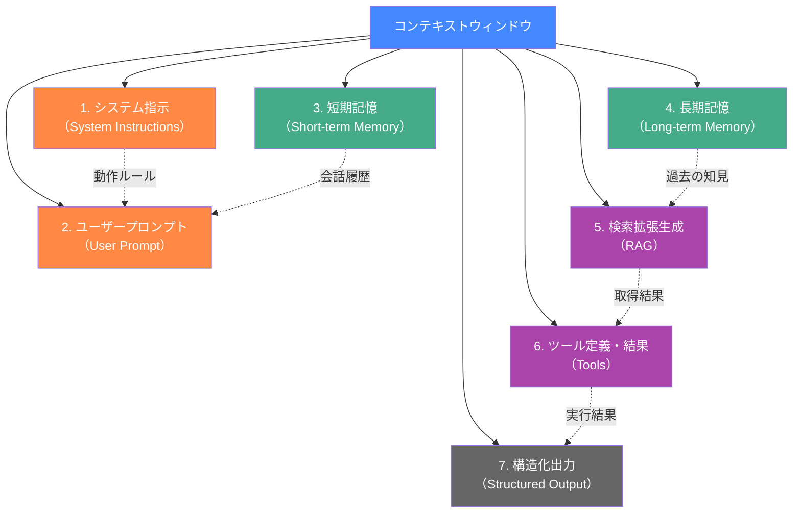
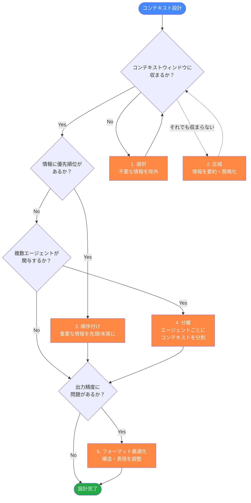
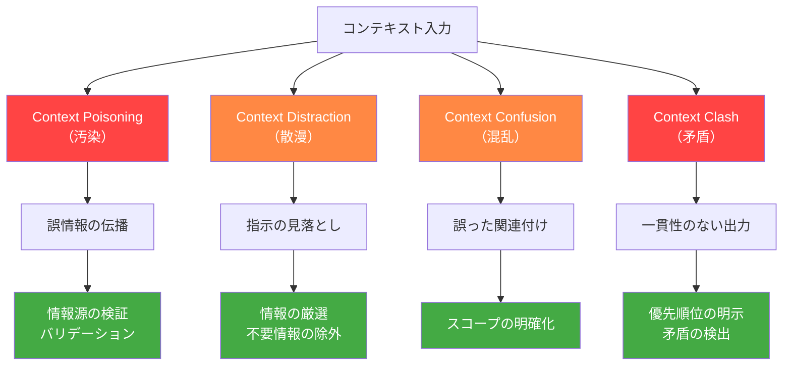
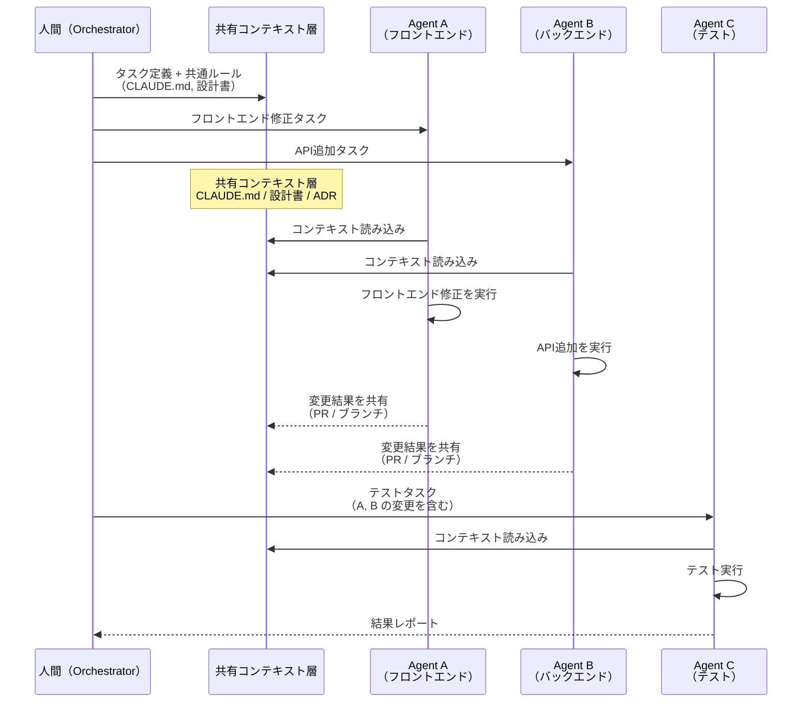

# コンテキストエンジニアリング (Context Engineering)

## 概要

コンテキストエンジニアリングとは、**LLMに適切な情報を適切なタイミングで適切な形式で提供する**ための体系的なアプローチである。単にプロンプトを工夫するだけでなく、LLMが正しく動作するために必要なコンテキスト（文脈情報）全体を設計・管理する技術を指す。

Shopify CEO の Tobi Lutke が2025年に「プロンプトエンジニアリングの次」として提唱し、Andrej Karpathy、Gartner、LangChain などが相次いで定義・体系化したことで注目を集めている。

本ドキュメントでは、コンテキストエンジニアリングの定義・構成要素・設計戦略・実践テクニックを整理し、特に **Claude Code を並列で活用する際のコンテキスト設計**に焦点を当てる。

---

## 目次

1. [コンテキストエンジニアリングとは](#1-コンテキストエンジニアリングとは)
2. [プロンプトエンジニアリングとの違い](#2-プロンプトエンジニアリングとの違い)
3. [コンテキストの7つの構成要素](#3-コンテキストの7つの構成要素)
4. [コンテキスト設計の5つの戦略](#4-コンテキスト設計の5つの戦略)
5. [LangChainの4つの戦略との対応](#5-langchainの4つの戦略との対応)
6. [コンテキスト失敗パターン](#6-コンテキスト失敗パターン)
7. [Anthropicの公式ガイドライン](#7-anthropicの公式ガイドライン)
8. [実践テクニック](#8-実践テクニック)
9. [並列AIエージェントでの活用](#9-並列aiエージェントでの活用)
10. [メリットと効果](#10-メリットと効果)
11. [ベストプラクティス 10選](#11-ベストプラクティス-10選)
12. [まとめ](#12-まとめ)
13. [参考](#13-参考)

---

## 1. コンテキストエンジニアリングとは

### 定義

コンテキストエンジニアリングは複数の識者によって定義されている。

> **「The art and science of filling the context window with just the right information for the next step.」**
> （次のステップに必要な情報でコンテキストウィンドウを満たす技芸と科学）
> — Tobi Lutke（Shopify CEO）

> **「The subtle art of producing exactly the right context for a LLM to chew on at each step — the true art of building with LLMs.」**
> （LLMが各ステップで咀嚼するのにまさに適切なコンテキストを生み出す繊細な技芸 — LLMで構築する真の技芸）
> — Andrej Karpathy

> **「Context engineering is the systematic design of dynamic systems that assemble and manage context fed to LLMs.」**
> （コンテキストエンジニアリングは、LLMに供給するコンテキストを組み立て管理する動的システムの体系的設計である）
> — Philipp Schmid（Google DeepMind）

> **Gartner** は2025年のハイプ・サイクルにコンテキストエンジニアリングを追加し、企業のAI活用における重要技術として位置づけている。

> **「Context engineering is going to stick — it better captures what is actually happening.」**
> （コンテキストエンジニアリングは定着するだろう — 実際に行われていることをより的確に表現している）
> — Simon Willison

### なぜ今注目されているのか

コンテキストエンジニアリングが注目される背景には、LLMの進化と活用方法の変化がある。

| 変化 | 詳細 |
|------|------|
| **モデル性能の向上** | GPT-4、Claude、Gemini 等のフロンティアモデルが高性能化し、コンテキストの質が出力の質を左右するようになった |
| **コンテキストウィンドウの拡大** | 100K〜1Mトークンのウィンドウが一般化し、「何を入れるか」の設計が重要に |
| **エージェントの台頭** | AIエージェントが自律的にツールを呼び出す時代となり、単発プロンプトでは不十分に |
| **企業での本格採用** | PoC から本番利用へ移行する中で、再現性・信頼性のあるコンテキスト管理が必要に |

> **なぜ単純なプロンプトでは不十分なのか？**
> 初期のLLM活用では「良いプロンプトを書く」ことが重視されていた。しかしエージェント時代では、プロンプトは入力の一部にすぎない。過去の会話履歴、外部から取得した知識、利用可能なツール情報、出力形式の制約など、**コンテキスト全体を設計する**必要がある。

---

## 2. プロンプトエンジニアリングとの違い

コンテキストエンジニアリングは、プロンプトエンジニアリングを包含し拡張した概念である。

| 観点 | プロンプトエンジニアリング | コンテキストエンジニアリング |
|------|--------------------------|----------------------------|
| **スコープ** | 単一のプロンプト（テキスト入力） | コンテキストウィンドウ全体（指示・記憶・ツール・出力形式を含む） |
| **フォーカス** | 「何をどう質問するか」 | 「LLMが正しく動くために何が必要か」 |
| **アプローチ** | 静的なテンプレート作成 | 動的なシステム設計（ランタイムでコンテキストを組み立てる） |
| **対象** | 人間がLLMに直接指示を出す場面 | エージェント・RAG・マルチターンを含む複雑なシステム |
| **時代** | ChatGPT初期（2022〜2023年） | エージェント時代（2024年〜） |
| **比喩** | 「良い質問を考える」 | 「LLMが成功するための環境を整える」 |

> **なぜ用語が変わったのか？**
> Karpathy は「プロンプトエンジニアリングという名前は誤解を招く。実際にやっていることは、コンテキストウィンドウにさまざまな情報を詰め込む作業であり、プロンプトはその一部にすぎない」と指摘している。名称の変更は、実務の実態をより正確に反映するためである。

---

## 3. コンテキストの7つの構成要素

LLMに渡すコンテキストウィンドウは、以下の7つの構成要素で成り立つ。



### 3.1 システム指示（System Instructions）

LLMの動作を制御するための基盤的な指示。ペルソナ、制約、ルール、出力形式などを定義する。

**具体例**：
- Claude Code の場合: `CLAUDE.md` がシステム指示に相当する
- API呼び出しの場合: `system` パラメータに記載するテキスト

```
あなたはシニアソフトウェアエンジニアです。
以下のルールに従ってください：
- TypeScript を使用すること
- テストを必ず書くこと
- セキュリティを最優先すること
```

> **なぜシステム指示が重要か？**
> システム指示はコンテキストウィンドウの最上位に位置し、後続のすべての処理に影響を与える。ここが曖昧だと、ユーザーの意図と異なる振る舞いを引き起こす。

### 3.2 ユーザープロンプト（User Prompt）

ユーザーが直接入力するテキスト。質問、指示、要求を含む。

**具体例**：
- 「このコードのバグを修正して」
- 「ユーザー認証機能を追加して」

> **なぜ明確なプロンプトが必要か？**
> プロンプトが曖昧だと、LLMは推測に頼らざるを得ず、意図しない出力を生成するリスクが高まる。特にエージェント的な利用では、具体的なゴールと制約を明示することが重要。

### 3.3 短期記憶（Short-term Memory）

現在の会話セッション内の履歴。直前のやりとり、コード変更、エラーメッセージなどを含む。

**具体例**：
- Claude Code での現在のセッション内の会話履歴
- マルチターン会話における前のメッセージ

**課題**：
- コンテキストウィンドウには上限があるため、長い会話では古い履歴が失われる
- Claude Code では Compaction（圧縮）機能で対処している

> **なぜ短期記憶の管理が重要か？**
> 無制限に履歴を保持するとコンテキストが溢れ、重要な情報が埋もれる。「何を覚えておき、何を忘れるか」を設計することが、コンテキストエンジニアリングの核心の一つ。

### 3.4 長期記憶（Long-term Memory）

セッションをまたいで永続化される情報。ユーザーの好み、過去のプロジェクト知識、学習した知見を含む。

**具体例**：
- Claude Code の Auto Memory（`~/.claude/projects/<project>/memory/`）
- CLAUDE.md に記載されたプロジェクト固有のルール

| Claude Code のメモリ機構 | 種別 |
|--------------------------|------|
| `CLAUDE.md` | 長期記憶（明示的） |
| `.claude/rules/*.md` | 長期記憶（条件付き） |
| Auto Memory | 長期記憶（自動学習） |

> **なぜ長期記憶が必要か？**
> 毎回同じ説明を繰り返すのは非効率である。LLMが過去の文脈を「覚えて」いれば、ユーザーの負担が大幅に減り、出力の質も安定する。

### 3.5 検索拡張生成（RAG: Retrieval-Augmented Generation）

外部データソースからリアルタイムに情報を取得し、コンテキストに注入する仕組み。

**具体例**：
- Claude Code のコードベース検索（`Grep`、`Glob` によるファイル内容の取得）
- ドキュメントDBからの関連ドキュメント取得
- Web検索結果の取り込み

> **なぜ RAG が必要か？**
> LLMの学習データには限界がある（知識のカットオフ、プロジェクト固有のコードは未学習）。RAGにより、最新かつプロジェクト固有の情報を動的に提供できる。

### 3.6 ツール定義・結果（Tools）

LLMが利用可能なツール（関数）の定義と、その実行結果。

**具体例**：
- Claude Code のツール: `Read`、`Edit`、`Bash`、`Grep` など
- API 呼び出しにおける Function Calling の定義

```json
{
  "name": "read_file",
  "description": "ファイルの内容を読み取る",
  "parameters": {
    "file_path": { "type": "string" }
  }
}
```

> **なぜツール情報がコンテキストに含まれるか？**
> ツールの定義自体がコンテキストウィンドウのトークンを消費する。適切なツールのみを提供することで、LLMの判断精度が向上し、トークンの無駄遣いも防げる。

### 3.7 構造化出力（Structured Output）

LLMの出力形式を指定するスキーマ定義。JSON Schema、TypeScript の型定義などで出力の型を制約する。

**具体例**：

```json
{
  "type": "object",
  "properties": {
    "summary": { "type": "string" },
    "severity": { "type": "string", "enum": ["low", "medium", "high"] },
    "suggestions": { "type": "array", "items": { "type": "string" } }
  }
}
```

> **なぜ構造化出力が重要か？**
> 自由形式のテキスト出力は後工程でのパースが困難であり、エラーの原因となる。スキーマで出力を制約することで、下流のシステムとの連携が安定する。

---

## 4. コンテキスト設計の5つの戦略

Faros AI が提唱する5つの戦略を基に、コンテキストの設計アプローチを整理する。



### 4.1 選択（Select）

**コンテキストに含める情報を厳選する**戦略。不要な情報を除外し、本当に必要な情報のみをコンテキストウィンドウに投入する。

**実践方法**：
- RAGのクエリを精密にし、関連性の高い情報のみを取得する
- ツール定義は、その時点で必要なもののみに絞る
- 会話履歴から、現在のタスクに無関係なやりとりを除外する

**具体例（Claude Code）**：
```markdown
# CLAUDE.md - 悪い例（情報過多）
## API一覧
GET /api/users - ユーザー一覧取得
GET /api/users/:id - ユーザー詳細取得
POST /api/users - ユーザー作成
... (100行以上のAPI仕様)

# CLAUDE.md - 良い例（参照に委譲）
## API仕様
詳細は @docs/api-spec.md を参照
```

> **なぜ選択が最初の戦略か？**
> 不要な情報はトークンを浪費するだけでなく、LLMの注意（attention）を分散させ、重要な情報の処理精度を低下させる。「Less is More」の原則がコンテキスト設計にも当てはまる。

### 4.2 圧縮（Compress）

**情報量を保ちながらトークン数を削減する**戦略。要約、抽象化、省略により、限られたウィンドウを効率的に使う。

**実践方法**：
- 長い会話履歴を要約して保持する（Claude Code の Compaction）
- ドキュメントの重要な部分のみを抽出する
- コードの全文ではなく、関連する関数シグネチャのみを提供する

**具体例**：
```
# 圧縮前（500トークン）
ユーザーはまず認証画面にアクセスし、メールアドレスとパスワードを入力します。
システムはデータベースで認証情報を検証し、JWTトークンを発行します。
トークンは...（省略）

# 圧縮後（50トークン）
認証フロー: メール+パスワード → DB検証 → JWT発行 → Cookie保存
```

> **なぜ圧縮が有効か？**
> コンテキストウィンドウは有限のリソースである。同じ情報をより少ないトークンで表現できれば、その分だけ他の重要な情報を追加できる。

### 4.3 順序付け（Order / Isolate）

**情報の配置順序を最適化する**戦略。LLMには「先頭と末尾の情報をより重視する」傾向（Primacy/Recency bias）があるため、重要な情報を戦略的に配置する。

**実践方法**：
- 最重要の指示をシステムプロンプトの先頭に配置する
- 直近のコンテキスト（最新のコード変更やエラー）を末尾に配置する
- 参考情報は中間に配置する

**具体例（CLAUDE.md の構成）**：
```markdown
# CLAUDE.md

## IMPORTANT（先頭 = 高優先度）
テストを書かずにコードを変更してはならない

## プロジェクト構造（中間 = 参考情報）
src/
├── app/
├── components/
└── lib/

## 直近の注意事項（末尾 = 直近のコンテキスト）
現在 v2 への移行中。新規コードは App Router を使用すること
```

> **なぜ順序が重要か？**
> 研究により、LLMはコンテキストの先頭と末尾の情報に対してより高い注意を払うことが示されている（"Lost in the Middle" 現象）。順序の最適化は、追加コストなしで精度を改善できる手法。この問題の詳細と対策については [6.2 "Lost in the Middle" 問題](#62-lost-in-the-middle-問題) を参照。

### 4.4 分離（Isolate）

**タスクごとにコンテキストを分割する**戦略。複数のエージェントや処理ステップでコンテキストを共有せず、それぞれに専用のコンテキストを用意する。

**実践方法**：
- Orchestrator パターンで、各 Sub-Agent に必要な情報のみを渡す
- Claude Code の並列実行時、各インスタンスに異なる CLAUDE.md を適用する
- 長いタスクを複数のステップに分割し、各ステップに適切なコンテキストを構築する

**具体例**：
```
# 分離前（1つのエージェントに全部渡す）
「フロントエンドのバグ修正、APIの新規エンドポイント追加、
  テストの作成、ドキュメント更新を行ってください」

# 分離後（エージェントごとに分割）
Agent A: 「フロントエンドのバグを修正してください」+ フロントエンドのコンテキスト
Agent B: 「APIエンドポイントを追加してください」+ バックエンドのコンテキスト
Agent C: 「テストを作成してください」+ テスト関連のコンテキスト
```

> **なぜ分離が効果的か？**
> 1つのコンテキストに異なるドメインの情報を混在させると、LLMの注意が分散し、各タスクの精度が低下する。分離により、各エージェントは自分の担当領域に集中できる。

### 4.5 フォーマット最適化（Format / Optimize）

**情報の表現形式を最適化する**戦略。同じ内容でも、表現方法によってLLMの理解度と出力品質が変わる。

**実践方法**：
- 自然言語の長文よりも、箇条書きやテーブルを使う
- XML タグや Markdown の見出しで構造を明確にする
- 具体例（Few-shot examples）を含める

**具体例**：
```markdown
# フォーマット前（散文）
エラーハンドリングについてですが、APIのレスポンスではステータスコードを
適切に返す必要があり、400番台はクライアントエラー、500番台はサーバーエラー
として分類し、エラーメッセージは...

# フォーマット後（構造化）
## エラーハンドリング規約
| ステータスコード | 用途 | 例 |
|----------------|------|-----|
| 400 | バリデーションエラー | 必須パラメータ欠落 |
| 401 | 認証エラー | トークン期限切れ |
| 404 | リソース未存在 | 指定IDのユーザーなし |
| 500 | サーバーエラー | 予期しない例外 |
```

> **なぜフォーマットが重要か？**
> LLMはトークン列として入力を処理する。構造化された入力は、情報の境界と関係性が明確であり、LLMが正確にパースしやすい。特に Markdown テーブルや XML タグは、LLM にとって扱いやすいフォーマット。

---

## 5. LangChainの4つの戦略との対応

LangChain は独自にコンテキストエンジニアリングの4つの戦略を定義している。前章の Faros AI の5戦略との対応関係を整理する。

| LangChain の戦略 | 説明 | Faros AI の対応戦略 |
|------------------|------|---------------------|
| **Write（書き込み）** | メモリやスクラッチパッドに情報を書き込む | 長期記憶 + 短期記憶の管理 |
| **Select（選択）** | 必要な情報を選別して取得する | 選択（Select） |
| **Compress（圧縮）** | 情報を要約・簡略化する | 圧縮（Compress） |
| **Isolate（分離）** | エージェントごとにコンテキストを分割する | 分離（Isolate） |

LangChain の「Write」は Faros AI のフレームワークには明示的に含まれていないが、長期記憶・短期記憶の構築プロセスに相当する。一方、Faros AI の「順序付け」と「フォーマット最適化」は、LangChain では個別の戦略として定義されていないが、各戦略の実装詳細に含まれている。

> **なぜ複数のフレームワークを参照するのか？**
> コンテキストエンジニアリングはまだ新しい分野であり、統一的な分類法は確立されていない。複数の視点を持つことで、自分のユースケースに最適なアプローチを選択しやすくなる。

---

## 6. コンテキスト失敗パターン

コンテキストエンジニアリングにおいて、**「何を入れるか」と同等に「何が失敗を引き起こすか」を理解すること**が重要である。以下の4つの失敗パターンは、コンテキスト設計の品質を劣化させる代表的な要因である。

### 6.1 4つの失敗パターン

| パターン | 概要 | 症状 | 対策 |
|---------|------|------|------|
| **Context Poisoning（汚染）** | ハルシネーションや誤情報がコンテキストに混入し、後続の出力に伝播する | 自信を持って誤った回答を生成する | RAG の情報源を検証し、バリデーションゲートで出力を検査する |
| **Context Distraction（散漫）** | 情報過多によりLLMの注意が分散し、重要な指示を見落とす | 指示に従わない、的外れな回答 | コンテキストを厳選し、タスクに直接関連する情報のみに絞る |
| **Context Confusion（混乱）** | 無関係な情報がコンテキストに含まれ、LLMが誤った関連付けを行う | 文脈を誤解した応答 | 情報のスコープを明確に定義し、無関係なドメインの情報を除外する |
| **Context Clash（矛盾）** | コンテキスト内に矛盾する情報が存在し、LLMが一貫性のない出力を生成する | 回答が前後で矛盾する | 情報源の優先順位を明示し、矛盾を事前に検出・解消する |



> **なぜ失敗パターンを学ぶのか？**
> 成功するコンテキスト設計は「良い情報を入れる」だけでは不十分である。失敗パターンを理解することで、コンテキストの品質を劣化させる要因を事前に防止できる。特に Context Poisoning は、RAG を活用するシステムで頻発し、ハルシネーションの連鎖反応を引き起こす危険がある。

### 6.2 "Lost in the Middle" 問題

LLMがコンテキストウィンドウの情報を処理する際、**先頭と末尾の情報には高い注意を払うが、中間部の情報を見落としやすい**現象が確認されている。これは「U字型注意パターン」と呼ばれる。

**影響の大きさ**：
- 研究により、重要な情報をコンテキストの中間部に配置した場合、**30%以上の精度劣化**が観測されている
- 特にコンテキストウィンドウが大きいほど（100K+ トークン）、この傾向が顕著になる

**対策**：
- 最重要な指示はコンテキストの**先頭**（システムプロンプト）に配置する
- 直近のタスクに関連する情報は**末尾**に配置する
- 中間部には補足的な参考情報のみを配置する
- コンテキストが長くなる場合は、情報を**分割**して複数の短いコンテキストに分ける

> **なぜ「U字型」になるのか？**
> Transformer アーキテクチャの Attention メカニズムにおいて、先頭トークン（初期の位置エンコーディング）と末尾トークン（直近の情報として Recency bias が働く）に対する重みが相対的に高くなる。この現象はモデルサイズやコンテキスト長に関わらず一貫して観測されており、コンテキスト配置戦略の設計において必ず考慮すべき制約である。

---

## 7. Anthropicの公式ガイドライン

Anthropic が公式ブログで公開した「Effective Context Engineering for AI Agents」では、エージェントのコンテキスト設計に関する実践的な知見が体系化されている。以下にその主要な概念を整理する。

### 7.1 Context Rot（コンテキストの腐敗）

長時間稼働するエージェントにおいて、コンテキストウィンドウに情報が蓄積されるにつれ、**情報間の n² ペアワイズ関係**により注意（Attention）が希薄化する現象。

**メカニズム**：
- コンテキスト内の情報が n 個ある場合、LLM が考慮すべき関係性は n² に比例して増加する
- 情報が増えるほど、個々の情報に割り当てられる注意が減少し、重要な指示を見落とすリスクが高まる

**具体例**：
```
初期状態（n=5）: 関係性 = 25 → 高精度
中間状態（n=20）: 関係性 = 400 → 精度低下の兆候
長時間後（n=50）: 関係性 = 2,500 → 顕著な精度劣化
```

> **なぜ Context Rot が問題か？**
> エージェントはタスクを自律的に実行するため、人間が逐一精度を確認できない。Context Rot による精度劣化は徐々に進行し、気づいたときには大量の誤った出力が蓄積している可能性がある。

### 7.2 Goldilocks Zone（ゴルディロックスゾーン）

システムプロンプトには**「多すぎず少なすぎず」の適切な情報量**が存在するという概念。

**原則**：
- **少なすぎる**: LLMが必要な文脈を持たず、推測やハルシネーションに頼る
- **多すぎる**: 情報過多により注意が分散し、重要な指示を見落とす（Context Distraction）
- **ちょうど良い**: タスク遂行に必要十分な情報が、構造化された形で提供される

**実践的な指標**：
- システムプロンプトは「この情報がなければ Claude がミスするか？」でフィルタリングする
- 詳細な参考情報はシステムプロンプトに直接含めず、ツールやRAGを通じて動的に取得する

> **なぜ「ちょうど良い」量が重要か？**
> 情報を増やせば精度が上がるという直感に反し、過剰な情報は精度を低下させる。Anthropic の実験では、不要な情報を削除するだけでエージェントの成功率が向上するケースが多数報告されている。

### 7.3 Just-in-Time Retrieval（ジャストインタイム取得）

すべての情報を事前にコンテキストに詰め込むのではなく、**必要になった時点で動的に取得する**アプローチ。

**パターン**：
1. システムプロンプトには**軽量な識別子**（ファイルパス、API名、ドキュメントID等）のみを含める
2. エージェントがタスク実行中に必要だと判断した時点で、ツール呼び出しにより詳細情報を取得する
3. 取得した情報はそのステップの処理に使用され、不要になれば破棄する

**具体例（Claude Code）**：
```markdown
# CLAUDE.md - Just-in-Time パターン
## データベース操作
- スキーマ定義: @docs/schema.md を参照（必要時に読み込むこと）
- マイグレーション手順: @docs/migration.md を参照

## API仕様
- エンドポイント一覧: @docs/api-endpoints.md を参照
```

> **なぜ事前に全部入れないのか？**
> コンテキストウィンドウは有限のリソースであり、「今必要でない情報」はトークンの浪費であるだけでなく、Context Rot の原因となる。Just-in-Time 方式はコンテキストの鮮度を保ち、各ステップで最も関連性の高い情報のみを提供する。

### 7.4 ツール定義のプロンプトエンジニアリング

Anthropic は、**ツールの `description` フィールドがLLMの判断に大きな影響を与える**ことを強調している。ツール定義は「ドキュメント」ではなく「プロンプトの一部」として設計すべきである。

**設計原則**：
- **いつ使うか**: どのような状況でこのツールを選択すべきかを明記する
- **いつ使わないか**: 他のツールとの使い分け基準を明記する
- **パラメータの意味**: 各パラメータの期待値と制約を具体例で示す

**具体例**：
```json
{
  "name": "search_codebase",
  "description": "コードベース内のファイルを検索する。クラス名、関数名、変数名など具体的な識別子を知っている場合に使用する。ファイルの内容を読み取りたい場合は read_file を使用すること。曖昧なキーワードでの検索には向かない。",
  "parameters": {
    "query": {
      "type": "string",
      "description": "検索クエリ。例: 'class UserService', 'function handleAuth'"
    }
  }
}
```

> **なぜツール定義の description が重要か？**
> エージェントの各ステップで「どのツールを使うか」の判断は、ツールの description に大きく依存する。曖昧な description は誤ったツール選択を引き起こし、タスク全体の失敗につながる。description はユーザーへのドキュメントではなく、LLMへのプロンプトであると認識すべきである。

### 7.5 長期タスクにおけるコンテキスト管理戦略

Anthropic は、長時間にわたるエージェントタスクに対して3つのコンテキスト管理戦略を推奨している。

| 戦略 | 概要 | 適用場面 |
|------|------|---------|
| **Compaction（圧縮）** | 会話履歴を要約し、重要な情報のみを保持する | コンテキストウィンドウが上限に近づいたとき |
| **Structured Note-Taking（構造化メモ）** | エージェントが作業中にメモを書き出し、後続ステップで参照する | 複数ステップにわたるタスク |
| **Sub-Agent Delegation（サブエージェント委任）** | 独立したサブタスクを別のエージェントに委任し、結果のみを受け取る | コンテキストの分離が必要なとき |

**Compaction の仕組み**：
```
[長い会話履歴 (100K+ トークン)]
    ↓ 圧縮
[要約 + 重要な決定事項 + 現在のタスク状態 (5K トークン)]
    ↓ 継続
[新しい会話ターン]
```

**Structured Note-Taking の例**：
```markdown
# エージェントのメモ（自動生成）
## 完了した作業
- UserService のCRUD実装完了
- バリデーションロジック追加済み

## 未解決の課題
- ページネーションの実装が必要
- エラーハンドリングのテスト未作成

## 重要な決定事項
- JWTトークンの有効期限: 24時間
- パスワードハッシュ: bcrypt (rounds=12)
```

> **なぜ3つの戦略を組み合わせるのか？**
> 単一の戦略では長期タスクのコンテキスト管理は不十分である。Compaction で全体のサイズを管理し、Structured Note-Taking で重要情報の損失を防ぎ、Sub-Agent で独立したサブタスクのコンテキスト汚染を回避する。これら3つを組み合わせることで、長時間のエージェント実行でも安定した精度を維持できる。

---

## 8. 実践テクニック

### 8.1 CLAUDE.md によるコンテキスト設計

CLAUDE.md は Claude Code におけるコンテキストエンジニアリングの最も直接的な実践手段である。CLAUDE.md の設計は、まさに「LLMに渡すコンテキストの設計」そのものである。

**コンテキストエンジニアリングの観点から見た CLAUDE.md のベストプラクティス**：

| 戦略 | CLAUDE.md での適用 |
|------|-------------------|
| 選択 | 「この行を消したら Claude がミスするか？」で取捨選択 |
| 圧縮 | 300行未満に抑える。詳細は `@import` で外部参照 |
| 順序付け | 最重要ルールを先頭に `IMPORTANT:` で配置 |
| 分離 | `.claude/rules/` や Skills でトピック別に分割 |
| フォーマット | テーブル、箇条書き、コードブロックで構造化 |

詳細な書き方については [CLAUDE.md の書き方ガイド](../claude-md-writing-guide.md) を参照。

### 8.2 PRP（Prompt → Response → Prompt）ワークフロー

PRP は、LLMとの対話を「一往復」で終わらせず、**応答を次のプロンプトのコンテキストに組み込む**ワークフローである。

```
Step 1: [プロンプト] 「このコードベースの認証フローを分析して」
Step 2: [レスポンス] 「認証フローは以下の通りです...」
Step 3: [プロンプト] 「その分析結果を踏まえて、OAuth2 対応を設計して」
         ↑ Step 2 の出力がコンテキストに含まれている
```

**PRPの効果**：
- 各ステップでLLMの理解が深まり、より質の高い出力が得られる
- 人間が中間結果をレビューし、方向修正できる
- 複雑なタスクを段階的に解決できる

> **なぜ一往復で完結させないのか？**
> 複雑なタスクを一度のプロンプトで解決しようとすると、指示が長大になりLLMの精度が低下する。段階的に進めることで、各ステップの精度を高く維持できる。

### 8.3 事例駆動コンテキスト（Example-Driven Context）

Few-shot examples をコンテキストに含めることで、LLMの出力品質を劇的に改善するテクニック。

**具体例**：
```markdown
## コミットメッセージの規約

以下の形式に従うこと:

### 良い例
- feat: ユーザー認証にOAuth2を追加
- fix: パスワードリセットのトークン有効期限を修正
- refactor: 認証ミドルウェアを共通化

### 悪い例
- 修正しました
- update
- バグ対応
```

> **なぜ事例が効果的か？**
> 抽象的なルールの説明よりも、具体的な入出力の例を示す方がLLMにとって明確である。事例は「暗黙のルール」も伝えられるため、記述量に対する情報密度が高い。

### 8.4 バリデーションゲート

LLMの出力を検証し、品質が基準を満たさない場合に再実行させる仕組み。コンテキストにバリデーションルールを組み込むことで実現する。

**具体例（CLAUDE.md）**：
```markdown
## コード変更時のチェックリスト
IMPORTANT: 以下をすべて確認してからコミットすること
1. 型チェック（`npm run type-check`）がパスすること
2. テスト（`npm test`）がパスすること
3. リント（`npm run lint`）がパスすること
```

**エージェントでの実装**：
- Pre-commit hooks で自動検証
- Claude Code の Hooks 機能で tool 実行後に自動チェック
- テスト結果をコンテキストに戻してリトライ

> **なぜバリデーションが必要か？**
> LLMは確率的に出力を生成するため、常に正しい結果を返すとは限らない。バリデーションゲートを設けることで、誤った出力がそのまま適用されるリスクを低減できる。

---

## 9. 並列AIエージェントでの活用

複数の Claude Code インスタンスを並列に稼働させる場合、コンテキストエンジニアリングは特に重要になる。



### 9.1 共有コンテキスト層の設計

並列エージェント間で共有すべき情報を「共有コンテキスト層」として設計する。

| レイヤー | 内容 | 具体例 |
|---------|------|--------|
| **プロジェクトルール** | 全エージェント共通のルール | CLAUDE.md、コーディング規約 |
| **設計文書** | アーキテクチャ・API仕様 | ADR、API仕様書、ERD |
| **タスク定義** | 各エージェントの担当範囲 | Issue、PRD、タスクリスト |
| **成果物** | エージェントの出力結果 | PR、ブランチ、テスト結果 |

> **なぜ共有コンテキスト層が必要か？**
> 並列エージェントが個別に動作すると、コードの競合や設計の不整合が発生する。共有コンテキスト層により、全エージェントが同じ前提で作業できる。

### 9.2 エージェントごとのコンテキスト分離

各エージェントには、そのタスクに必要な情報のみを提供する。

**分離の原則**：
1. **担当範囲のコードのみ**をコンテキストに含める
2. **他エージェントの実装詳細は含めない**（インターフェースのみ共有）
3. **タスク固有のルール**は各エージェントのプロンプトに直接記載する

**具体例**：
```markdown
# Agent A（フロントエンド）のコンテキスト
- CLAUDE.md（共通ルール）
- src/components/ のコード
- API の型定義（interface のみ）
- フロントエンドの Issue

# Agent B（バックエンド）のコンテキスト
- CLAUDE.md（共通ルール）
- src/api/ のコード
- データベーススキーマ
- バックエンドの Issue
```

> **なぜ分離するのか？**
> フロントエンド担当のエージェントにバックエンドの実装詳細を渡すと、トークンの無駄遣いになるだけでなく、不適切な変更を行うリスクがある。分離は効率と安全性の両方を高める。

### 9.3 エージェントチームの構成パターン

並列エージェントの構成には主に3つのパターンがある。

| パターン | 構成 | 適用場面 |
|---------|------|---------|
| **Fan-out / Fan-in** | 1つのタスクを分割→並列実行→結果統合 | 独立性の高いサブタスク群 |
| **Pipeline** | エージェントがリレー形式で順次処理 | 依存関係のあるタスク |
| **Supervisor** | 上位エージェントが下位エージェントを監督 | 品質管理が必要な場面 |

**Fan-out / Fan-in の例**：
```
[人間] タスク定義
  ├── [Agent A] フロントエンド修正（並列）
  ├── [Agent B] バックエンド追加（並列）
  └── [Agent C] ドキュメント更新（並列）
         ↓
[人間] 結果レビュー・統合
```

> **なぜパターンを意識するのか？**
> 闇雲に並列化すると、エージェント間の競合やコンテキストの不整合が起きる。パターンを意識することで、タスクの性質に応じた適切な並列化を設計できる。

### 9.4 タスク分解とコンテキスト配分

並列エージェントに渡すタスクの分解方法が、コンテキスト設計の品質を大きく左右する。

**タスク分解の原則**：

1. **独立性を最大化する**: 各タスクが他のタスクに依存しないように分割する
2. **インターフェースで境界を定義する**: 型定義やAPI仕様で境界を明確にする
3. **粒度を揃える**: 各エージェントの作業量が均等になるように分割する

**良い分解の例**：
```
タスク: 「ユーザー管理機能の追加」

Agent A: フロントエンド（ユーザー一覧・詳細・編集画面のUI）
Agent B: バックエンド（CRUD API + バリデーション）
Agent C: テスト（E2E + ユニットテスト）
共有: UserType の型定義、API エンドポイント仕様
```

**悪い分解の例**：
```
Agent A: 「ユーザー作成機能のフロントエンドとバックエンド」
Agent B: 「ユーザー編集機能のフロントエンドとバックエンド」
→ 共通コンポーネント・共通ミドルウェアで競合が発生する
```

> **なぜ分解方法がコンテキストに影響するか？**
> タスクの分解が適切であれば、各エージェントに渡すコンテキストも自然と整理される。分解が悪いと、各エージェントに重複した情報を渡す必要が生じ、競合のリスクも高まる。

### 9.5 スクラッチパッドとメモリ引き継ぎ

エージェント間で情報を受け渡すための仕組み。

**スクラッチパッド**：エージェントが作業中の中間結果やメモを書き出すファイル。

```markdown
# scratchpad.md（Agent A が書き出し、Agent B が読み込む）

## 変更したファイル
- src/components/UserList.tsx（新規作成）
- src/components/UserDetail.tsx（新規作成）

## API に必要なエンドポイント
- GET /api/users - 一覧取得（ページネーション対応）
- GET /api/users/:id - 詳細取得

## 注意点
- UserType は src/types/user.ts に定義済み
```

**メモリ引き継ぎの方法**：

| 方法 | 説明 | 適用場面 |
|------|------|---------|
| **ファイルベース** | スクラッチパッドや中間ファイルを通じて共有 | 非同期・並列作業 |
| **Git ベース** | ブランチ・PR を通じて成果物を共有 | コード変更の引き継ぎ |
| **Issue / PR コメント** | GitHub上でコンテキストを共有 | レビュー・フィードバック |

> **なぜメモリ引き継ぎが必要か？**
> 各エージェントは独立したコンテキストウィンドウを持つため、明示的に情報を受け渡さない限り、他のエージェントの作業内容を知ることができない。上司がチームメンバーに引き継ぎ資料を作るのと同じ原理。

---

## 10. メリットと効果

コンテキストエンジニアリングを適切に実践することで得られるメリットを整理する。

| メリット | 説明 | 具体的な効果 |
|---------|------|-------------|
| **出力精度の向上** | 必要な情報を正確に提供することで、LLMの回答品質が向上 | バグの減少、手戻りの削減 |
| **再現性の確保** | コンテキストの構築を体系化することで、結果の一貫性が向上 | チームメンバー間での品質均一化 |
| **トークン効率の改善** | 不要な情報を除外し、圧縮することでコスト削減 | API利用コストの最適化 |
| **並列化の実現** | コンテキスト分離により、複数エージェントの安全な並列実行が可能 | 開発速度の向上 |
| **スケーラビリティ** | 動的なコンテキスト構築により、プロジェクトの成長に対応 | 大規模プロジェクトでの安定運用 |
| **認知負荷の軽減** | LLMに十分なコンテキストを渡すことで、人間の説明負担が減少 | エンジニアの疲労軽減 |
| **知識の蓄積** | コンテキスト設計をドキュメント化することで、組織のノウハウが蓄積 | オンボーディングの効率化 |

---

## 11. ベストプラクティス 10選

1. **コンテキストウィンドウを「不動産」として扱う**
   - 有限のリソースであることを意識し、すべての情報の配置に意図を持つ

2. **「引き算のデザイン」を心がける**
   - 追加する情報が本当に必要か常に自問する。不要な情報は精度を下げる

3. **動的にコンテキストを構築する**
   - 静的なテンプレートではなく、タスクに応じてコンテキストを組み立てる仕組みを作る

4. **RAG の品質に投資する**
   - 取得する情報の精度がコンテキスト全体の品質を左右する。チャンク分割やインデックス設計に注力する

5. **メモリを階層化する**
   - システム指示（永続）→長期記憶（プロジェクト固有）→短期記憶（セッション内）の階層を意識する

6. **ツール定義を「プロンプト」として設計する**
   - ツールの `description` はドキュメントではなく、LLMへのプロンプトである。「いつ使うか」「いつ使わないか」を明記し、パラメータの期待値を具体例で示す（[7.4 ツール定義のプロンプトエンジニアリング](#74-ツール定義のプロンプトエンジニアリング) 参照）

7. **出力形式を明示する**
   - 構造化出力のスキーマを定義し、後続処理での解析を容易にする

8. **バリデーションゲートを設ける**
   - LLMの出力を自動検証し、品質基準を満たさない場合はリトライさせる

9. **並列化ではコンテキストを分離する**
   - 各エージェントに専用のコンテキストを構築し、不要な情報を渡さない

10. **コンテキスト設計を反復的に改善する**
    - CLAUDE.md やプロンプトをコードと同様にバージョン管理し、継続的に改善する

---

## 12. まとめ

コンテキストエンジニアリングは、「プロンプトの書き方」から「**LLMが成功するための環境設計**」へとパラダイムシフトした概念である。

**要点の整理**：

- **定義**: LLMに適切な情報を適切なタイミングで適切な形式で提供する体系的アプローチ
- **構成要素**: 7つの要素（指示・プロンプト・短期/長期記憶・RAG・ツール・構造化出力）でコンテキストウィンドウを構築する
- **戦略**: 選択・圧縮・順序付け・分離・フォーマット最適化の5つの戦略を組み合わせる
- **失敗パターン**: Context Poisoning・Distraction・Confusion・Clash の4パターンを理解し、"Lost in the Middle" 問題に対処する
- **Anthropic推奨**: Context Rot を防ぐために Goldilocks Zone を意識し、Just-in-Time Retrieval で情報の鮮度を保ち、長期タスクでは Compaction・構造化メモ・サブエージェント委任を組み合わせる
- **実践**: CLAUDE.md、PRP ワークフロー、事例駆動コンテキスト、バリデーションゲートで実装する
- **並列化**: 共有コンテキスト層の設計とエージェントごとのコンテキスト分離が鍵

AI との協働において、コンテキストエンジニアリングは「上司がチームメンバーに適切な指示と背景情報を与える」行為に似ている。LLMを「優秀だが文脈を知らない新人」と捉え、成功に必要な情報を過不足なく提供することが、最大の生産性を引き出す方法である。

---

## 13. 参考

### 提唱者・識者の発信

| 発信者 | リソース | 内容 |
|--------|---------|------|
| Tobi Lutke | [X (Twitter) ポスト](https://x.com/toloopy) | 「Context Engineering」の命名と定義 |
| Andrej Karpathy | [X (Twitter) ポスト](https://x.com/karpathy) | 「プロンプトエンジニアリング→コンテキストエンジニアリング」への名称変更提案 |
| Simon Willison | [Context Engineering ブログ記事](https://simonwillison.net/2025/Jun/27/context-engineering/) | コンテキストエンジニアリングの解説と事例分析 |
| Philipp Schmid | [Context Engineering 解説](https://www.philschmid.de/context-engineering) | Google DeepMind の視点からの体系化 |

### フレームワーク・ツールの公式資料

| 発信元 | リソース | 内容 |
|--------|---------|------|
| LangChain | [Context Engineering ブログ](https://blog.langchain.dev/context-engineering/) | 4つの戦略（Write/Select/Compress/Isolate）の定義 |
| Anthropic | [Effective Context Engineering for AI Agents](https://www.anthropic.com/engineering/effective-context-engineering-for-ai-agents) | エージェントのコンテキスト設計に関する公式ガイドライン |
| Anthropic | [Claude Code ドキュメント](https://docs.anthropic.com/) | CLAUDE.md、Memory、Skills の公式ガイド |
| Anthropic | [Claude Code ベストプラクティス](https://code.claude.com/docs/en/best-practices) | CLAUDE.md の書き方ガイド |
| Weaviate | [Context Engineering 解説](https://weaviate.io/blog/what-is-context-engineering) | RAG とコンテキストエンジニアリングの関係性 |

### 業界レポート・分析

| 発信元 | リソース | 内容 |
|--------|---------|------|
| Gartner | [Hype Cycle for AI 2025](https://www.gartner.com/) | コンテキストエンジニアリングをハイプサイクルに追加 |
| Faros AI | [Context Engineering Strategies](https://www.faros.ai/) | 5つのコンテキスト設計戦略の体系化 |

### 関連ドキュメント（本リポジトリ内）

| ドキュメント | リンク | 関連性 |
|-------------|--------|--------|
| CLAUDE.md の書き方ガイド | [claude-md-writing-guide.md](../claude-md-writing-guide.md) | セクション8.1のコンテキスト設計の実践 |
| メモリシステム詳細ガイド | [02-memory.md](../claude/claude-code-settings/02-memory.md) | セクション3.4の長期記憶の詳細 |
