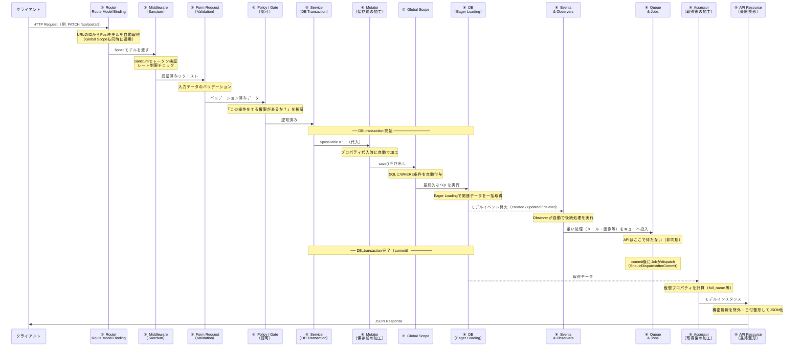
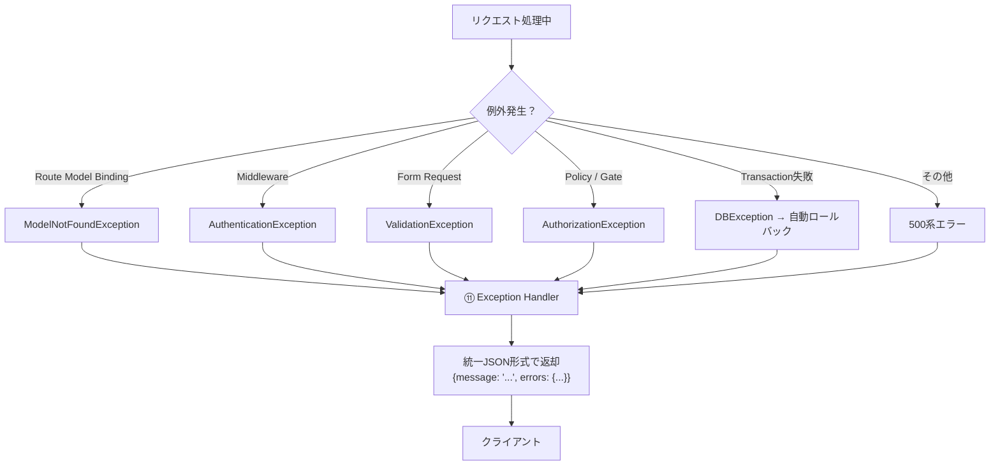
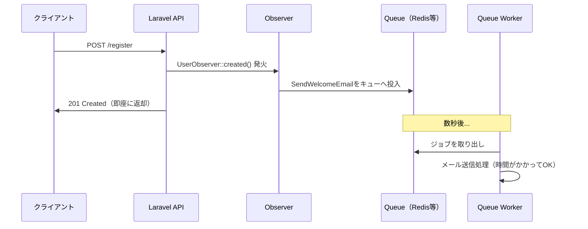

# Laravel API リクエストライフサイクル 実践ガイド

## 概要

Laravelでバックエンド開発を行うとき、HTTPリクエストがどのような経路をたどってJSONレスポンスになるのかを理解することが重要です。各コンポーネントの役割と「なぜそこに存在するのか」を押さえることで、Laravel全体の設計が見えてきます。

本ガイドは **Laravel 12** をベースに記述しています。

---

## 目次

1. [完全フロー図](#1-完全フロー図)
2. [各コンポーネントの解説](#2-各コンポーネントの解説)
   - [① Routing & Route Model Binding](#-routing--route-model-binding)
   - [② Middleware & Sanctum](#-middleware--sanctum)
   - [③ Form Request（バリデーション）](#-form-requestバリデーション)
   - [④ Policy / Gate（認可）](#-policy--gate認可)
   - [⑤ Service & DB Transactions（ビジネスロジック）](#-service--db-transactionsビジネスロジック)
   - [⑥ Mutator（保存前の加工）](#-mutator保存前の加工)
   - [⑦ Global Scope（クエリの自動書き換え）](#-global-scopeクエリの自動書き換え)
   - [⑧ DB操作 / Eager Loading / Events & Observers / Queues & Jobs](#-db操作--eager-loading--events--observers--queues--jobs)
   - [⑨ Accessor（取得後の加工）](#-accessor取得後の加工)
   - [⑩ API Resource（最終整形）](#-api-resource最終整形)
   - [⑪ Exception Handler（例外ハンドリング）](#-exception-handler例外ハンドリング)
3. [次のステップ（中級・上級）](#3-次のステップ中級上級)
4. [参考リンク](#4-参考リンク)

---

## 1. 完全フロー図

### 1.1 リクエスト処理フロー



### 1.2 例外発生時のフロー

フロー中のどのステップで例外が発生しても、⑪ Exception Handler が一括で捕捉します。



---

## 2. 各コンポーネントの解説

### ① Routing & Route Model Binding

**役割**: URLをコントローラーに対応させ、URLのIDから自動でモデルを取得する。

#### なぜ必要か？

`/api/posts/5` にアクセスされたとき、「ID:5の投稿」を毎回手動で取得するのは煩雑です。Route Model Bindingにより、コントローラーの引数に直接モデルインスタンスが渡されます。

```php
// routes/api.php

// ❌ Route Model Binding なし（冗長）
Route::patch('/posts/{id}', function (int $id) {
    $post = Post::findOrFail($id); // 毎回書く必要がある
});

// ✅ Route Model Binding あり（スッキリ）
Route::patch('/posts/{post}', function (Post $post) {
    // $post はLaravelが自動でDBから取得してくれる
});
```

> **重要**: Route Model BindingはモデルのGlobal Scopeを尊重します。
> `SoftDeletes` が有効なら、削除済みの投稿へのアクセスは自動的に404になります。

#### カスタムキーで検索する

```php
// routes/api.php
// URLの slug フィールドで検索したい場合
Route::get('/posts/{post:slug}', [PostController::class, 'show']);
// GET /api/posts/my-first-post → Post::where('slug', '...')->firstOrFail()
```

#### Global Scopeを除外する（管理者ルートなど）

```php
// app/Models/Post.php
public function resolveRouteBinding($value, $field = null): ?Model
{
    // 管理者は削除済み・未公開の投稿も取得できるようにする
    return $this->withoutGlobalScopes()
                ->where($field ?? 'id', $value)
                ->firstOrFail();
}
```

---

### ② Middleware & Sanctum

**役割**: リクエストが「正当なものか」を確認する関所。認証・レート制限などを担う。

#### なぜ必要か？

コントローラーに入る前に「誰からのリクエストか？」「大量アクセスでないか？」を一括チェックすることで、各コントローラーに同じ認証コードを書かずに済みます。

```php
// routes/api.php
Route::middleware(['auth:sanctum', 'throttle:60,1'])->group(function () {
    Route::get('/posts', [PostController::class, 'index']);
    Route::post('/posts', [PostController::class, 'store']);
    Route::patch('/posts/{post}', [PostController::class, 'update']);
    Route::delete('/posts/{post}', [PostController::class, 'destroy']);
});
```

| Middleware | 役割 |
|-----------|------|
| `auth:sanctum` | Bearerトークンを検証し、未認証なら401を返す |
| `throttle:60,1` | 1分間に60回を超えたら429（Too Many Requests）を返す |

---

### ③ Form Request（バリデーション）

**役割**: クライアントから送られてきたデータが「正しい形式か」を検証する。

#### なぜ必要か？

コントローラーにバリデーションを書くと肥大化します。Form Requestに分離することで、コントローラーは「正しいデータが来た」前提でビジネスロジックに集中できます。

```bash
php artisan make:request StorePostRequest
```

```php
// app/Http/Requests/StorePostRequest.php
class StorePostRequest extends FormRequest
{
    public function rules(): array
    {
        return [
            'title'   => 'required|string|max:255',
            'content' => 'required|string',
            'tags'    => 'array|max:5',
        ];
    }
}

// app/Http/Controllers/PostController.php
public function store(StorePostRequest $request): PostResource
{
    // ここに来た時点でバリデーション済み
    $data = $request->validated(); // 検証済みデータのみ取得
}
```

バリデーション失敗時は自動的に422エラーが返ります。

```json
{
    "message": "The title field is required.",
    "errors": {
        "title": ["The title field is required."]
    }
}
```

---

### ④ Policy / Gate（認可）

**役割**: 「誰が・何を・どのリソースに対して操作できるか」を定義する。

#### なぜ必要か？

バリデーションは「データの形」を確認しますが、認可は「その操作をする権利があるか」を確認します。「他人の投稿は編集できない」といった制御がここで行われます。

```bash
php artisan make:policy PostPolicy --model=Post
```

```php
// app/Policies/PostPolicy.php
class PostPolicy
{
    // 投稿の更新：作成者のみ許可
    public function update(User $user, Post $post): bool
    {
        return $user->id === $post->user_id;
    }

    // 投稿の削除：作成者または管理者のみ許可
    public function delete(User $user, Post $post): bool
    {
        return $user->id === $post->user_id || $user->is_admin;
    }
}
```

Form RequestのauthorizeメソッドでPolicyを呼び出す。

```php
// app/Http/Requests/UpdatePostRequest.php
class UpdatePostRequest extends FormRequest
{
    public function authorize(): bool
    {
        // Policyの update() を呼び出す
        return $this->user()->can('update', $this->route('post'));
    }

    public function rules(): array
    {
        return ['title' => 'required|string|max:255'];
    }
}
```

認可失敗時は自動的に403エラーが返ります。

---

### ⑤ Service & DB Transactions（ビジネスロジック）

**役割**: コントローラーから呼び出され、複雑なビジネスロジックを担当する。複数テーブルの更新は DB Transactions でまとめて保護する。

#### なぜ必要か？

コントローラーはHTTPの受け取りと返却に専念すべきです。Serviceに分離することでテストが書きやすくなります。また、複数テーブルを連続更新するとき、途中でエラーが発生しても中途半端なデータを残さないために Transactions が必要です。

```php
// app/Services/UserRegistrationService.php
use Illuminate\Support\Facades\DB;

class UserRegistrationService
{
    public function register(array $data): User
    {
        return DB::transaction(function () use ($data) {
            // ① ユーザーを作成
            $user = User::create([
                'name'     => $data['name'],
                'email'    => $data['email'],
                'password' => $data['password'],
            ]);

            // ② プロフィールを作成
            $user->profile()->create(['bio' => '']);

            // ③ 初期ウォレットを付与
            $user->wallet()->create(['balance' => 100]);

            // ここでエラーが起きると①②③すべてロールバックされる
            return $user;
        });
    }
}
```

```php
// app/Http/Controllers/UserController.php
class UserController extends Controller
{
    public function __construct(private UserRegistrationService $service) {}

    public function store(StoreUserRequest $request): UserResource
    {
        $user = $this->service->register($request->validated());
        return new UserResource($user);
    }
}
```

> **Laravel 12のポイント**: `ShouldDispatchAfterCommit` を使うと、Jobをトランザクション完了後にdispatchできます。ロールバックしたのにメールが送信されるミスを防げます。

```php
class SendWelcomeEmail implements ShouldQueue, ShouldDispatchAfterCommit
{
    // DB commit後にキューへ投入される（ロールバック時は投入されない）
}
```

---

### ⑥ Mutator（保存前の加工）

**役割**: モデルのプロパティに値を代入したとき、自動で加工してから保存する。

#### なぜ必要か？

パスワードの暗号化など、保存前に「必ず行うべき加工」をモデルに集中させることで、書き忘れを防げます。Serviceから `$user->password = '...'` と代入するだけで自動的に実行されます。

```php
// app/Models/User.php
use Illuminate\Database\Eloquent\Casts\Attribute;

class User extends Model
{
    // $user->password = 'plaintext' のタイミングで自動でハッシュ化
    protected function password(): Attribute
    {
        return Attribute::make(
            set: fn(string $value) => bcrypt($value)
        );
    }
}
```

---

### ⑦ Global Scope（クエリの自動書き換え）

**役割**: モデルへのすべてのクエリに、自動でWHERE条件を付け加える。

#### なぜ必要か？

「退会済みユーザーは常に除外」「公開済みの記事のみ表示」といった要件は全クエリに適用が必要です。Global Scopeにより、全コントローラーで毎回条件を書く必要がなくなります。

```php
// app/Models/Scopes/PublishedScope.php
class PublishedScope implements Scope
{
    public function apply(Builder $builder, Model $model): void
    {
        $builder->where('published_at', '<=', now())
                ->whereNotNull('published_at');
    }
}

// app/Models/Post.php（Laravel 12 推奨の属性記法）
#[ScopedBy([PublishedScope::class])]
class Post extends Model {}
```

```php
// どのクエリにも自動でWHERE条件が付く
Post::all();
// SELECT * FROM posts WHERE published_at <= NOW() AND published_at IS NOT NULL

// 管理者画面など除外したい場合
Post::withoutGlobalScope(PublishedScope::class)->get();
```

---

### ⑧ DB操作 / Eager Loading / Events & Observers / Queues & Jobs

**役割**: SQLを実行してデータを永続化・取得する。モデルの変化をイベントで検知し、非同期Jobで重い後続処理を行う。

#### DB操作 & Eager Loading（N+1問題の回避）

N+1問題とは「1回のクエリで取れたはずのデータを、ループの中でN回個別に取得してしまう」パフォーマンス問題です。

```php
// ❌ N+1問題（100件の投稿 → 101回のSQL）
$posts = Post::all();
foreach ($posts as $post) {
    echo $post->user->name; // ユーザーを1件ずつ取得
}

// ✅ Eager Loading（2回のSQLで完結）
$posts = Post::with('user')->get();
// SQL1: SELECT * FROM posts
// SQL2: SELECT * FROM users WHERE id IN (1,2,...,100)
```

```php
// app/Http/Controllers/PostController.php
public function index(): AnonymousResourceCollection
{
    $posts = Post::with(['user', 'tags', 'comments'])->paginate(20);
    return PostResource::collection($posts);
}
```

#### Events & Observers（モデルイベントへの自動反応）

モデルの保存・削除などのライフサイクルイベントを監視して、後続処理を自動で実行します。Serviceのコードをスッキリ保てます。

```bash
php artisan make:observer UserObserver --model=User
```

```php
// app/Observers/UserObserver.php
class UserObserver
{
    // ユーザー作成後に自動で実行される
    public function created(User $user): void
    {
        // ウェルカムメールをキューへ投入（次のQueues & Jobsで詳述）
        SendWelcomeEmail::dispatch($user);
    }

    // ユーザー削除後に自動で実行される
    public function deleted(User $user): void
    {
        // 関連投稿も削除（整合性を保つ）
        $user->posts()->delete();
    }
}

// app/Providers/AppServiceProvider.php
public function boot(): void
{
    User::observe(UserObserver::class);
}
```

| | Events | Observers |
|--|--------|-----------|
| 向いている処理 | 注文確定など任意のタイミングで発火するビジネスイベント | モデルの created/updated/deleted への自動反応 |
| 発火の起点 | `event(new OrderPlaced($order))` と明示的に呼ぶ | モデルの変化時に自動で呼ばれる |

#### Queues & Jobs（非同期処理）

メール送信・画像処理など時間がかかる処理を、APIのレスポンスをブロックせず「バックグラウンドで後でやっといて」と丸投げします。

```bash
php artisan make:job SendWelcomeEmail
```

```php
// app/Jobs/SendWelcomeEmail.php
class SendWelcomeEmail implements ShouldQueue
{
    public function __construct(private User $user) {}

    public function handle(): void
    {
        // 数秒かかっても問題ない（APIのレスポンスは待たない）
        Mail::to($this->user->email)->send(new WelcomeMail($this->user));
    }
}
```



---

### ⑨ Accessor（取得後の加工）

**役割**: DBから取得したデータに対し、プロパティアクセス時に仮想的な値を計算して返す。

#### なぜ必要か？

DBには存在しないが、ビジネス上必要な「計算値」をモデルで一元管理できます。コントローラーやServiceに散らばるのを防ぎます。

```php
// app/Models/User.php
class User extends Model
{
    // first_name と last_name を結合するだけの仮想プロパティ
    protected function fullName(): Attribute
    {
        return Attribute::make(
            get: fn() => "{$this->last_name} {$this->first_name}"
        );
    }

    // JSON出力に自動で含める
    protected $appends = ['full_name'];
}

// 使用例
$user->full_name; // "田中 太郎"（DBには存在しない）
```

> 詳細は [シリアライズとアクセサ](./serialize-and-accessor.md) を参照。

---

### ⑩ API Resource（最終整形）

**役割**: モデルのデータを、クライアントに返すべきJSON形式に整形する最後の関門。

#### なぜ必要か？

Eloquentモデルを直接返すと、パスワードなどの機密情報が漏洩したり、フロントエンドが期待するフォーマットと異なる場合があります。API Resourceで出力を明示的にコントロールします。

```bash
php artisan make:resource PostResource
```

```php
// app/Http/Resources/PostResource.php
class PostResource extends JsonResource
{
    public function toArray(Request $request): array
    {
        return [
            'id'         => $this->id,
            'title'      => $this->title,
            'content'    => $this->content,
            // Eager Loadingされている場合のみ含める（N+1防止）
            'author'     => new UserResource($this->whenLoaded('user')),
            'tags'       => TagResource::collection($this->whenLoaded('tags')),
            // ISO8601形式に変換
            'created_at' => $this->created_at->toIso8601String(),
            // password などはここに書かないことで漏洩を防ぐ
        ];
    }
}
```

---

### ⑪ Exception Handler（例外ハンドリング）

**役割**: フロー中のどこかで例外が発生したとき、一貫したJSON形式のエラーレスポンスを返す。

#### なぜ必要か？

APIはHTMLのエラーページを返してはいけません。Exception Handlerにより、全例外を統一JSON形式に変換し、クライアントが扱いやすいエラーレスポンスを返せます。

```php
// bootstrap/app.php（Laravel 11/12 の記法）
->withExceptions(function (Exceptions $exceptions) {
    $exceptions->render(function (Throwable $e, Request $request) {
        if ($request->expectsJson()) {
            $status = match (true) {
                $e instanceof \Illuminate\Database\Eloquent\ModelNotFoundException
                    => 404,
                $e instanceof \Illuminate\Auth\AuthenticationException
                    => 401,
                $e instanceof \Illuminate\Auth\Access\AuthorizationException
                    => 403,
                $e instanceof \Illuminate\Validation\ValidationException
                    => 422,
                default => 500,
            };

            return response()->json(['message' => $e->getMessage()], $status);
        }
    });
})
```

#### 標準的なエラーレスポンス一覧

| HTTPステータス | 発生タイミング | 主な原因 |
|-------------|-------------|---------|
| 401 | Middleware通過時 | 未認証（トークンなし・無効） |
| 403 | Policy/Gate通過時 | 認可失敗（権限なし） |
| 404 | Route Model Binding | モデルが見つからない |
| 422 | Form Request通過時 | バリデーション失敗 |
| 429 | Middlewareレート制限 | リクエスト過多 |
| 500 | どこでも | 予期しないサーバーエラー |

---

## 3. 次のステップ（中級・上級）

現在のフローを理解した上で、スケールするプロジェクトに向けてさらに学ぶべき項目です。

### 中級

| トピック | 概要 | 学ぶべき理由 |
|---------|------|------------|
| **Service Container & DI** | LaravelのIoCコンテナの仕組み | なぜServiceをコンストラクタで受け取れるかの理解。テストでのモック化に必須 |
| **Feature Test** | HTTPリクエスト〜レスポンスまでを通して検証するテスト | ライフサイクル全体を一気に検証できる。CI/CD導入に必須 |

### 上級

| トピック | 概要 | 学ぶべき理由 |
|---------|------|------------|
| **API Versioning** | `/api/v1/`・`/api/v2/` に分けて変更を管理する設計 | モバイルアプリは強制アップデートできないため、旧APIを動かし続ける必要がある |
| **Cache（Redis）** | 重いクエリの結果をキャッシュしてDBアクセスを削減 | レスポンス速度の劇的改善（800ms → 200msなども現実的） |
| **Rate Limiting（詳細）** | エンドポイントごとの細かいレート制限設計 | DDoS対策や課金制API設計（AIエンドポイントへの厳格な制限など）に必要 |

---

## 4. 参考リンク

- [Laravel 12 公式ドキュメント - Request Lifecycle](https://laravel.com/docs/12.x/lifecycle)
- [Laravel 12 公式ドキュメント - Routing](https://laravel.com/docs/12.x/routing)
- [Laravel 12 公式ドキュメント - Eloquent Global Scopes](https://laravel.com/docs/12.x/eloquent#global-scopes)
- [Laravel 12 公式ドキュメント - API Resources](https://laravel.com/docs/12.x/eloquent-resources)
- [Laravel 12 公式ドキュメント - Authorization (Policies)](https://laravel.com/docs/12.x/authorization)
- [Laravel 12 公式ドキュメント - Events](https://laravel.com/docs/12.x/events)
- [Laravel 12 公式ドキュメント - Queues](https://laravel.com/docs/12.x/queues)
- [Laravel Route Model Binding and Global Scopes](https://www.trovster.com/blog/2021/10/laravel-route-model-binding-and-global-scopes)
- [Laravel API Development: RESTful Best Practices for 2025](https://hafiz.dev/blog/laravel-api-development-restful-best-practices-for-2025)
