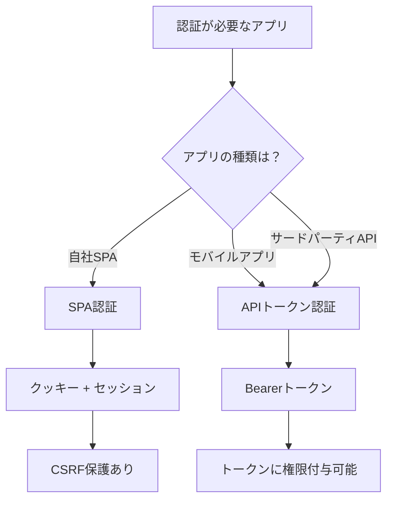
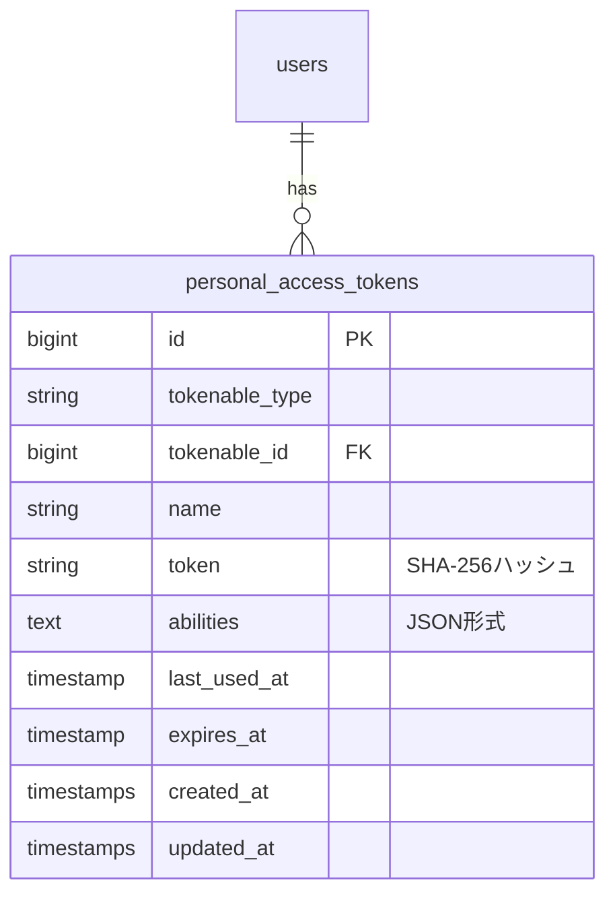
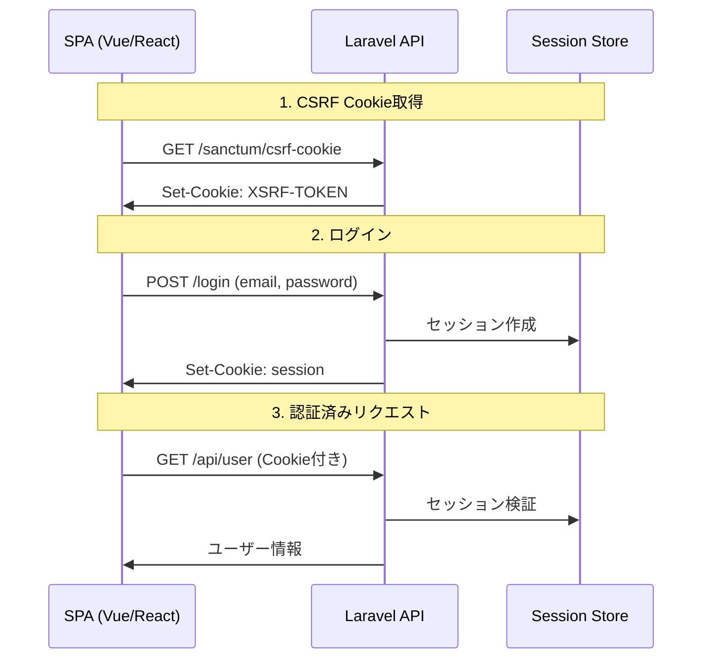
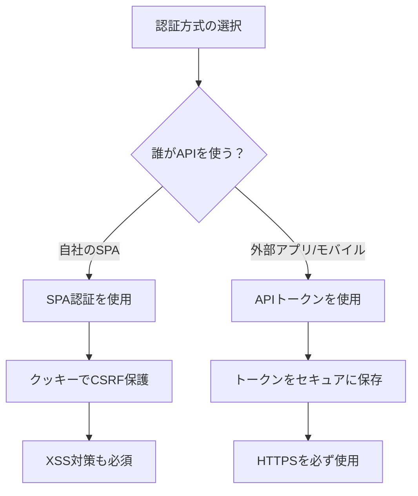

# Laravel Sanctum

## 概要

**Laravel Sanctum**は、SPA（Single Page Applications）、モバイルアプリケーション、シンプルなトークンベースAPIのための軽量認証システムです。OAuthのような複雑な仕組みを必要とせず、シンプルかつセキュアな認証を実現できます。

### なぜSanctumを使うのか？

| ユースケース | 従来の方法 | Sanctumの利点 |
|-------------|-----------|---------------|
| SPA認証 | JWT + 自前実装 | クッキーベースのセッション認証で安全 |
| モバイルアプリ | OAuth2（Passport） | シンプルなトークン発行で十分 |
| APIトークン | 自前でトークン管理 | ユーザーごとに複数トークン＋権限管理 |

---

## 目次

1. [認証方式の比較](#1-認証方式の比較)
2. [インストール・設定](#2-インストール設定)
3. [SPA認証フロー](#3-spa認証フロー)
4. [APIトークン認証](#4-apiトークン認証)
5. [実装例](#5-実装例)
6. [セキュリティ上の注意点](#6-セキュリティ上の注意点)
7. [テスト](#7-テスト)

---

## 1. 認証方式の比較

Sanctumは2つの認証方式を提供します。用途に応じて使い分けることが重要です。



### 各方式の特徴

| 方式 | 認証方法 | 保存場所 | 用途 |
|-----|---------|---------|------|
| SPA認証 | セッションクッキー | サーバーサイド | 自社フロントエンド（Vue, React等） |
| APIトークン | Bearerトークン | クライアント側 | モバイルアプリ、外部API連携 |

### なぜ使い分けるのか？

- **SPA認証**: クッキーベースなのでCSRF保護が効き、XSS攻撃に対しても安全
- **APIトークン**: ステートレスで、複数デバイスからのアクセスに適している

---

## 2. インストール・設定

### 2.1 インストール

```bash
# Laravel 11以降
php artisan install:api
```

このコマンドで以下が自動実行されます：
- `config/sanctum.php` の公開
- 必要なマイグレーションの作成
- `api.php` ルートファイルの作成

### 2.2 Userモデルの設定

```php
<?php

namespace App\Models;

use Illuminate\Foundation\Auth\User as Authenticatable;
use Illuminate\Notifications\Notifiable;
use Laravel\Sanctum\HasApiTokens;  // 追加

class User extends Authenticatable
{
    use HasApiTokens, Notifiable;  // HasApiTokensを追加
}
```

### なぜHasApiTokensが必要なのか？

このトレイトにより、Userモデルに以下のメソッドが追加されます：

- `createToken()` - 新しいトークンを生成
- `tokens()` - ユーザーの全トークンを取得
- `tokenCan()` - トークンの権限を確認

### 2.3 マイグレーション実行

```bash
php artisan migrate
```

`personal_access_tokens` テーブルが作成されます：



---

## 3. SPA認証フロー

### 3.1 認証フローの全体像



### 3.2 設定手順

#### ステートフルドメインの設定

```php
// config/sanctum.php
'stateful' => explode(',', env('SANCTUM_STATEFUL_DOMAINS', sprintf(
    '%s%s',
    'localhost,localhost:3000,127.0.0.1,127.0.0.1:8000,::1',
    env('APP_URL') ? ',' . parse_url(env('APP_URL'), PHP_URL_HOST) : ''
))),
```

`.env` での設定例：

```env
# 開発環境
SANCTUM_STATEFUL_DOMAINS=localhost:3000

# 本番環境
SANCTUM_STATEFUL_DOMAINS=spa.example.com,admin.example.com
```

#### ミドルウェアの設定

```php
// bootstrap/app.php
->withMiddleware(function (Middleware $middleware) {
    $middleware->statefulApi();
})
```

#### CORS設定

```php
// config/cors.php
return [
    'paths' => ['api/*', 'sanctum/csrf-cookie'],
    'allowed_origins' => ['http://localhost:3000'],
    'supports_credentials' => true,  // 重要！
];
```

### 3.3 フロントエンド実装

```javascript
// axios設定
import axios from 'axios';

axios.defaults.baseURL = 'http://localhost:8000';
axios.defaults.withCredentials = true;      // クッキーを送信
axios.defaults.withXSRFToken = true;        // CSRFトークンを自動送信

// ログイン処理
async function login(email, password) {
    // 1. CSRFクッキーを取得
    await axios.get('/sanctum/csrf-cookie');

    // 2. ログイン
    await axios.post('/login', { email, password });

    // 3. 認証済みリクエスト
    const user = await axios.get('/api/user');
    return user.data;
}
```

### なぜCSRFクッキーを先に取得するのか？

LaravelはCSRF保護が有効なため、POSTリクエスト時にCSRFトークンが必要です。`/sanctum/csrf-cookie` エンドポイントでトークンを取得し、以降のリクエストで自動的に送信されます。

---

## 4. APIトークン認証

### 4.1 トークン発行

```php
// routes/api.php
use Illuminate\Http\Request;

Route::post('/tokens/create', function (Request $request) {
    $request->validate([
        'token_name' => 'required|string|max:255',
    ]);

    $token = $request->user()->createToken($request->token_name);

    return ['token' => $token->plainTextToken];
})->middleware('auth:sanctum');
```

### 4.2 トークンの権限（Abilities）

```php
// 特定の権限を持つトークンを発行
$token = $user->createToken('api-token', ['posts:read', 'posts:write']);

// 全権限を持つトークン
$token = $user->createToken('admin-token', ['*']);
```

権限の確認：

```php
// コントローラー内で権限チェック
public function update(Request $request, Post $post)
{
    if (!$request->user()->tokenCan('posts:write')) {
        abort(403, 'この操作を行う権限がありません');
    }

    // 更新処理...
}
```

### 4.3 ミドルウェアによる権限チェック

```php
// bootstrap/app.php
use Laravel\Sanctum\Http\Middleware\CheckAbilities;
use Laravel\Sanctum\Http\Middleware\CheckForAnyAbility;

->withMiddleware(function (Middleware $middleware) {
    $middleware->alias([
        'abilities' => CheckAbilities::class,   // 全ての権限が必要
        'ability' => CheckForAnyAbility::class, // いずれか1つでOK
    ]);
})
```

```php
// routes/api.php

// 全ての権限が必要
Route::get('/admin/stats', function () {
    // ...
})->middleware(['auth:sanctum', 'abilities:admin:read,stats:view']);

// いずれか1つの権限でOK
Route::get('/posts', function () {
    // ...
})->middleware(['auth:sanctum', 'ability:posts:read,posts:admin']);
```

### 4.4 トークンの有効期限

```php
// config/sanctum.php
'expiration' => 60 * 24 * 7,  // 7日間（分単位）
```

個別に有効期限を設定：

```php
// 1週間後に失効
$token = $user->createToken(
    'temp-token',
    ['*'],
    now()->addWeek()
);
```

失効トークンの定期削除：

```php
// routes/console.php
use Illuminate\Support\Facades\Schedule;

Schedule::command('sanctum:prune-expired --hours=24')->daily();
```

### 4.5 トークンの失効

```php
// 現在のトークンを失効
$request->user()->currentAccessToken()->delete();

// 特定のトークンを失効
$user->tokens()->where('id', $tokenId)->delete();

// 全トークンを失効（ログアウト時など）
$user->tokens()->delete();
```

---

## 5. 実装例

### 5.1 モバイルアプリ用ログインAPI

```php
// routes/api.php
use App\Models\User;
use Illuminate\Http\Request;
use Illuminate\Support\Facades\Hash;
use Illuminate\Validation\ValidationException;

Route::post('/mobile/login', function (Request $request) {
    $request->validate([
        'email' => 'required|email',
        'password' => 'required',
        'device_name' => 'required|string|max:255',
    ]);

    $user = User::where('email', $request->email)->first();

    if (!$user || !Hash::check($request->password, $user->password)) {
        throw ValidationException::withMessages([
            'email' => ['認証情報が正しくありません。'],
        ]);
    }

    // デバイス名でトークンを発行
    $token = $user->createToken($request->device_name)->plainTextToken;

    return response()->json([
        'user' => $user,
        'token' => $token,
    ]);
});
```

### 5.2 認証済みAPIルート

```php
// routes/api.php
Route::middleware('auth:sanctum')->group(function () {
    // ユーザー情報取得
    Route::get('/user', function (Request $request) {
        return $request->user();
    });

    // ユーザーのトークン一覧
    Route::get('/user/tokens', function (Request $request) {
        return $request->user()->tokens;
    });

    // ログアウト（現在のトークンを失効）
    Route::post('/logout', function (Request $request) {
        $request->user()->currentAccessToken()->delete();
        return response()->json(['message' => 'ログアウトしました']);
    });
});
```

### 5.3 クライアント側の実装（モバイル）

```javascript
// React Native / Expo での例
import axios from 'axios';
import * as SecureStore from 'expo-secure-store';

const api = axios.create({
    baseURL: 'https://api.example.com',
});

// リクエストインターセプター
api.interceptors.request.use(async (config) => {
    const token = await SecureStore.getItemAsync('auth_token');
    if (token) {
        config.headers.Authorization = `Bearer ${token}`;
    }
    return config;
});

// ログイン
async function login(email, password, deviceName) {
    const response = await api.post('/mobile/login', {
        email,
        password,
        device_name: deviceName,
    });

    await SecureStore.setItemAsync('auth_token', response.data.token);
    return response.data.user;
}

// 認証済みリクエスト
async function getProfile() {
    const response = await api.get('/user');
    return response.data;
}
```

---

## 6. セキュリティ上の注意点

### 6.1 SPA認証 vs APIトークンの使い分け



### 6.2 重要なセキュリティ設定

| 設定項目 | 推奨値 | 理由 |
|---------|-------|------|
| `SESSION_SECURE_COOKIE` | `true` | HTTPS経由でのみクッキー送信 |
| `SESSION_SAME_SITE` | `lax` または `strict` | CSRF対策 |
| トークン有効期限 | 短め（7日以内） | 漏洩時のリスク軽減 |

### 6.3 認可の二重チェック

```php
// トークンの権限だけでなく、ポリシーも確認する
public function update(Request $request, Server $server)
{
    // 1. トークンの権限チェック
    if (!$request->user()->tokenCan('server:update')) {
        abort(403);
    }

    // 2. リソースの所有者チェック（ポリシー）
    $this->authorize('update', $server);

    // 更新処理...
}
```

### なぜ二重チェックが必要なのか？

- トークンの権限: 「何ができるか」を定義
- ポリシー: 「誰のリソースにアクセスできるか」を定義

両方をチェックすることで、「書き込み権限を持つトークンで、他人のリソースを更新」という攻撃を防げます。

---

## 7. テスト

### 7.1 認証済みリクエストのテスト

```php
<?php

namespace Tests\Feature;

use App\Models\User;
use Laravel\Sanctum\Sanctum;
use Tests\TestCase;

class ApiTest extends TestCase
{
    public function test_認証済みユーザーがプロフィールを取得できる(): void
    {
        // ユーザーを作成して認証状態にする
        Sanctum::actingAs(
            User::factory()->create(),
            ['profile:read']  // トークンの権限
        );

        $response = $this->getJson('/api/user');

        $response->assertOk();
    }

    public function test_権限がないとアクセス拒否される(): void
    {
        Sanctum::actingAs(
            User::factory()->create(),
            ['profile:read']  // server:updateは持っていない
        );

        $response = $this->putJson('/api/servers/1', [
            'name' => 'New Server Name',
        ]);

        $response->assertForbidden();
    }

    public function test_未認証ユーザーはアクセスできない(): void
    {
        $response = $this->getJson('/api/user');

        $response->assertUnauthorized();
    }
}
```

### 7.2 全権限でのテスト

```php
public function test_管理者は全操作が可能(): void
{
    Sanctum::actingAs(
        User::factory()->create(['role' => 'admin']),
        ['*']  // 全権限
    );

    // 全ての操作が可能
    $this->getJson('/api/admin/stats')->assertOk();
    $this->deleteJson('/api/users/1')->assertOk();
}
```

---

## 参考リンク

- [Laravel Sanctum 公式ドキュメント](https://laravel.com/docs/sanctum)
- [Laravel 認証概要](https://laravel.com/docs/authentication)
- [Laravel Passport（OAuth2が必要な場合）](https://laravel.com/docs/passport)
