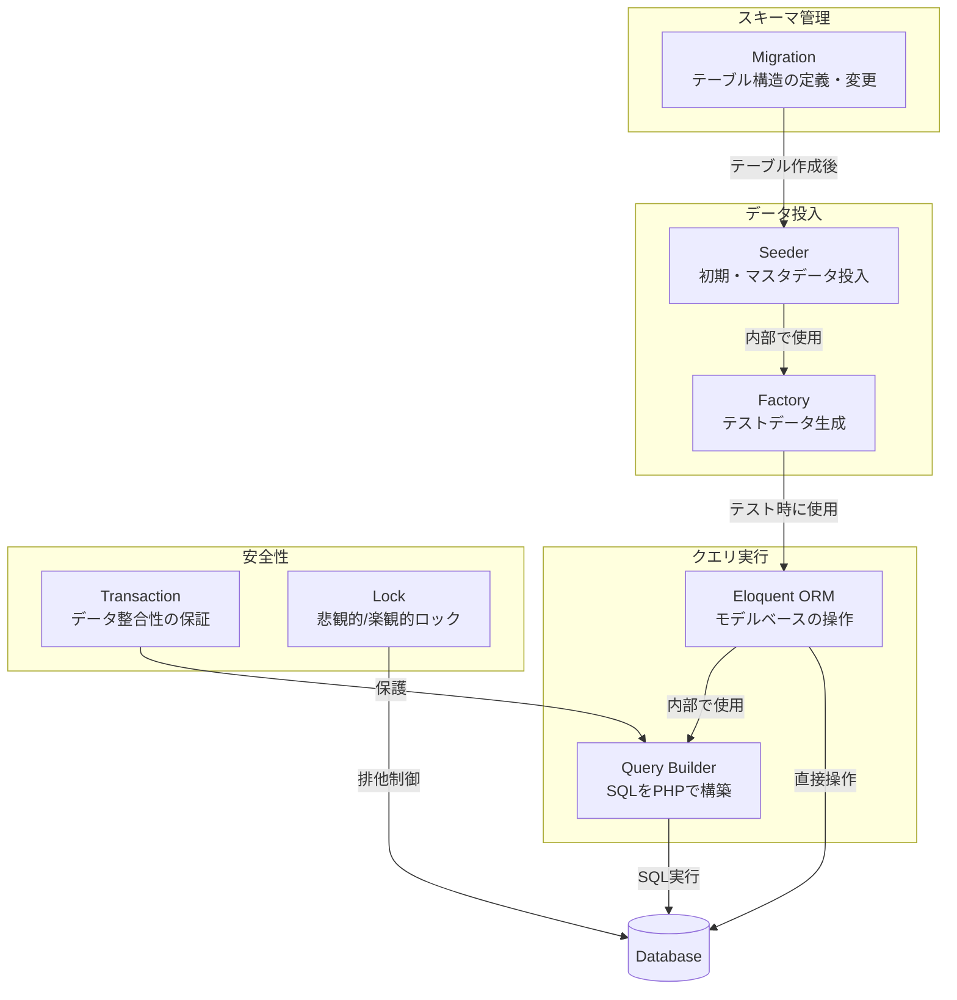
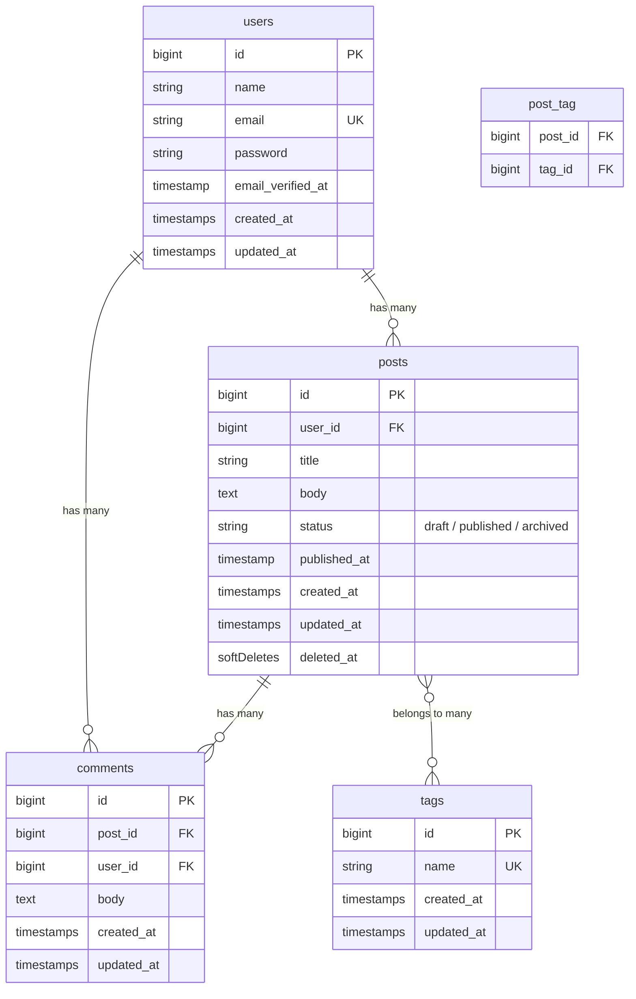
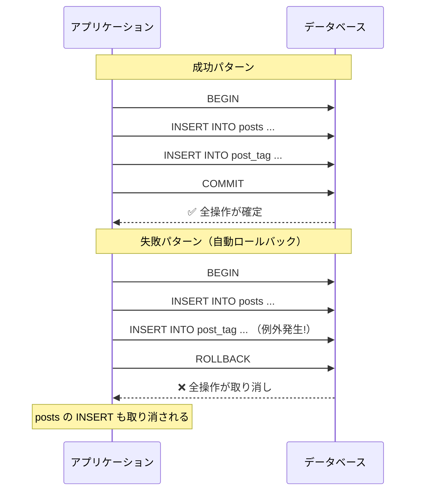
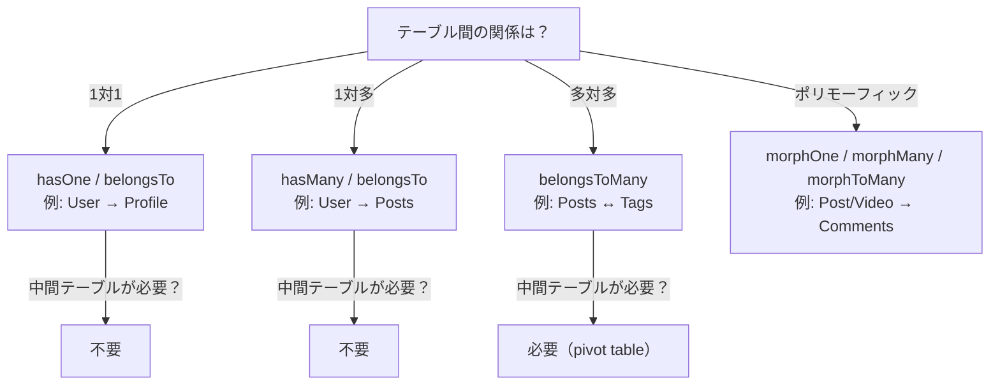
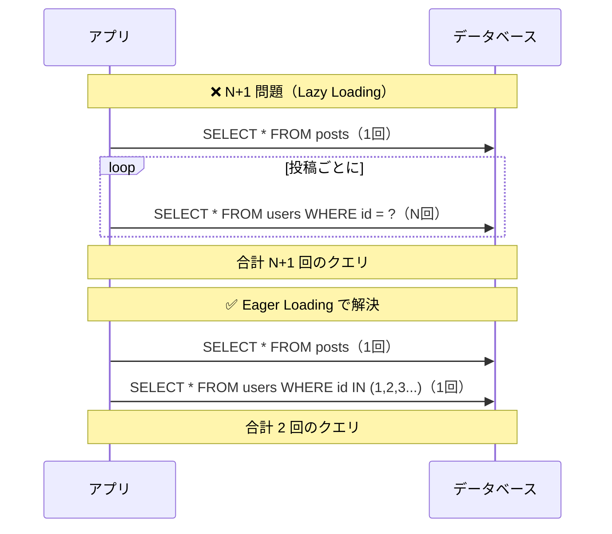
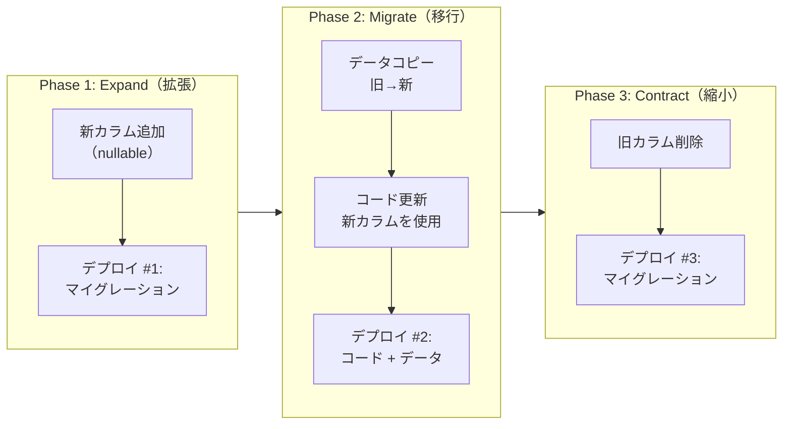

# Laravel データベース管理 完全ガイド

## 概要

Laravelのデータベース管理に必要な知識を体系的にまとめたガイドです。マイグレーション、シーダー、モデルファクトリといった基本操作から、トランザクション、Query Builder、Eloquent、本番デプロイ戦略まで、実務で必要なDB管理の全体像を一つのドキュメントで学べます。

本ガイドは **Laravel 12.x** をベースに記述しています。

全セクションを通して **同一のサンプルスキーマ**（users / posts / tags / comments）を使用し、一貫性のある学習体験を提供します。

---

## 目次

1. [全体像と用語の関係図](#1-全体像と用語の関係図)
2. [マイグレーション](#2-マイグレーション)
   - [2.1 マイグレーションとは](#21-マイグレーションとは)
   - [2.2 マイグレーションの作成](#22-マイグレーションの作成)
   - [2.3 マイグレーションの実行・ロールバック](#23-マイグレーションの実行ロールバック)
   - [2.4 Schema Builder — カラム定義](#24-schema-builder--カラム定義)
   - [2.5 インデックス](#25-インデックス)
   - [2.6 外部キー制約](#26-外部キー制約)
   - [2.7 マイグレーションのベストプラクティス](#27-マイグレーションのベストプラクティス)
   - [2.8 条件付きマイグレーション（shouldRun）](#28-条件付きマイグレーションshouldrun)
3. [シーダー](#3-シーダー)
   - [3.1 シーダーとは](#31-シーダーとは)
   - [3.2 シーダーの作成と実行](#32-シーダーの作成と実行)
   - [3.3 DatabaseSeeder の構成](#33-databaseseeder-の構成)
   - [3.4 WithoutModelEvents トレイト](#34-withoutmodelevents-トレイト)
   - [3.5 冪等シーディング](#35-冪等シーディング)
4. [モデルファクトリ](#4-モデルファクトリ)
   - [4.1 ファクトリとは](#41-ファクトリとは)
   - [4.2 ファクトリの定義](#42-ファクトリの定義)
   - [4.3 ステートとシーケンス](#43-ステートとシーケンス)
   - [4.4 リレーション付きファクトリ](#44-リレーション付きファクトリ)
   - [4.5 シーダーとの統合](#45-シーダーとの統合)
5. [トランザクション](#5-トランザクション)
   - [5.1 トランザクションとは](#51-トランザクションとは)
   - [5.2 クロージャ形式](#52-クロージャ形式)
   - [5.3 手動トランザクション](#53-手動トランザクション)
   - [5.4 デッドロックと自動リトライ](#54-デッドロックと自動リトライ)
   - [5.5 悲観的ロック](#55-悲観的ロック)
   - [5.6 トランザクションの重要ルール](#56-トランザクションの重要ルール)
6. [Query Builder（DB管理観点）](#6-query-builderdb管理観点)
   - [6.1 バルク操作](#61-バルク操作)
   - [6.2 大量データの処理](#62-大量データの処理)
   - [6.3 クエリのデバッグ](#63-クエリのデバッグ)
   - [6.4 pipe() メソッド](#64-pipe-メソッド)
   - [6.5 ベクトル類似検索](#65-ベクトル類似検索)
   - [6.6 日付・時刻の便利メソッド](#66-日付時刻の便利メソッド)
   - [6.7 複数カラムの条件指定](#67-複数カラムの条件指定)
   - [6.8 条件付き updateOrInsert](#68-条件付き-updateorinsert)
7. [Eloquent（DB管理観点）](#7-eloquentdb管理観点)
   - [7.1 規約（Convention）](#71-規約convention)
   - [7.2 Mass Assignment と fillable / guarded](#72-mass-assignment-と-fillable--guarded)
   - [7.3 属性キャスト](#73-属性キャスト)
   - [7.4 ソフトデリート](#74-ソフトデリート)
   - [7.5 スコープ](#75-スコープ)
   - [7.6 リレーション](#76-リレーション)
   - [7.7 N+1問題と Eager Loading](#77-n1問題と-eager-loading)
8. [データベーステスト](#8-データベーステスト)
   - [8.1 テスト用DB設定](#81-テスト用db設定)
   - [8.2 トレイト比較](#82-トレイト比較)
   - [8.3 ファクトリ活用パターン](#83-ファクトリ活用パターン)
   - [8.4 データベースアサーション](#84-データベースアサーション)
9. [本番デプロイ戦略](#9-本番デプロイ戦略)
   - [9.1 デプロイ時の原則](#91-デプロイ時の原則)
   - [9.2 Expand-Contract パターン](#92-expand-contract-パターン)
   - [9.3 テーブルロックに注意](#93-テーブルロックに注意)
   - [9.4 デプロイチェックリスト](#94-デプロイチェックリスト)
10. [よくある落とし穴と対策](#10-よくある落とし穴と対策)
11. [参考リンク](#11-参考リンク)

---

## 1. 全体像と用語の関係図

### 1.1 DB管理コンポーネントの関係

Laravelのデータベース管理は複数のコンポーネントが連携して動作します。それぞれの役割を俯瞰しましょう。



**なぜ全体像を把握するのか？**

各コンポーネントは独立しているように見えますが、実際には密接に関連しています。例えば、マイグレーションでテーブルを作り、ファクトリでテストデータを定義し、シーダーで初期データを投入し、Eloquentで操作する——この流れを理解することで、適切なツールを適切な場面で使えるようになります。

### 1.2 サンプルスキーマ（全編共通）

本ガイドでは以下のスキーマを全セクションで使用します。



---

## 2. マイグレーション

### 2.1 マイグレーションとは

マイグレーションはデータベースの **バージョン管理** です。チーム全員が同じテーブル構造を共有でき、変更履歴を追跡できます。

**なぜマイグレーションが必要なのか？**

- 直接SQLでテーブルを変更すると、誰がいつ何を変えたか追跡できない
- チームメンバーの環境を揃えるのが困難になる
- 本番環境への反映が手作業になりミスのリスクが高まる

### 2.2 マイグレーションの作成

```bash
# 基本の作成コマンド
php artisan make:migration create_posts_table

# テーブル名を指定（--create オプション）
php artisan make:migration create_posts_table --create=posts

# 既存テーブルの変更（--table オプション）
php artisan make:migration add_status_to_posts_table --table=posts
```

**命名規則:** `{動詞}_{対象}_{to/from}_{テーブル名}_table` の形式で統一しましょう。

| パターン | 命名例 | 用途 |
|---------|--------|------|
| テーブル作成 | `create_posts_table` | 新規テーブル |
| カラム追加 | `add_status_to_posts_table` | カラム追加 |
| カラム削除 | `remove_status_from_posts_table` | カラム削除 |
| カラム変更 | `rename_title_in_posts_table` | カラム名変更 |
| インデックス追加 | `add_index_to_posts_table` | インデックス追加 |

サンプルスキーマの `posts` テーブルを作成するマイグレーション：

```php
<?php

use Illuminate\Database\Migrations\Migration;
use Illuminate\Database\Schema\Blueprint;
use Illuminate\Support\Facades\Schema;

return new class extends Migration
{
    public function up(): void
    {
        Schema::create('posts', function (Blueprint $table) {
            $table->id();                              // bigint unsigned auto increment
            $table->foreignId('user_id')->constrained(); // 外部キー
            $table->string('title');
            $table->text('body');
            $table->string('status')->default('draft');
            $table->timestamp('published_at')->nullable();
            $table->timestamps();                      // created_at, updated_at
            $table->softDeletes();                     // deleted_at
        });
    }

    public function down(): void
    {
        Schema::dropIfExists('posts');
    }
};
```

**なぜ `down()` メソッドを書くのか？**

`down()` はロールバック時に実行されます。開発中に「やっぱりやめたい」となった場合に、安全に元に戻せます。ただし、本番環境ではロールバックよりも新しいマイグレーションで対処する方が安全です。

### 2.3 マイグレーションの実行・ロールバック

| コマンド | 説明 | 用途 |
|---------|------|------|
| `php artisan migrate` | 未実行のマイグレーションを実行 | 通常のデプロイ |
| `php artisan migrate --seed` | マイグレーション後にシーダーも実行 | 初回セットアップ |
| `php artisan migrate:rollback` | 最後のバッチをロールバック | 直前の変更を取り消し |
| `php artisan migrate:rollback --step=3` | 指定ステップ分ロールバック | 複数マイグレーションの取り消し |
| `php artisan migrate:reset` | 全マイグレーションをロールバック | 全テーブル削除 |
| `php artisan migrate:refresh` | reset + migrate | テーブル再構築 |
| `php artisan migrate:refresh --seed` | refresh + seed | テーブル再構築 + 初期データ |
| `php artisan migrate:fresh` | 全テーブルDROP + migrate | 最もクリーンな再構築 |
| `php artisan migrate:fresh --seed` | fresh + seed | 開発時のリセット |
| `php artisan migrate:status` | マイグレーション状態の確認 | 実行済み/未実行の確認 |

**`refresh` vs `fresh` の違い:**

- `refresh`: 各マイグレーションの `down()` メソッドを順番に実行してからmigrate
- `fresh`: `down()` を使わず全テーブルを DROP してからmigrate

`fresh` の方が高速で確実ですが、`down()` メソッドのテストができません。開発中は `fresh --seed` をよく使います。

### 2.4 Schema Builder — カラム定義

#### よく使うカラム型

| メソッド | MySQLでの型 | 説明 |
|---------|------------|------|
| `$table->id()` | `BIGINT UNSIGNED AI PK` | 主キー |
| `$table->foreignId('user_id')` | `BIGINT UNSIGNED` | 外部キー用 |
| `$table->string('name', 100)` | `VARCHAR(100)` | 短いテキスト（デフォルト255） |
| `$table->text('body')` | `TEXT` | 長いテキスト |
| `$table->integer('count')` | `INT` | 整数 |
| `$table->unsignedInteger('count')` | `INT UNSIGNED` | 符号なし整数 |
| `$table->bigInteger('amount')` | `BIGINT` | 大きな整数 |
| `$table->decimal('price', 8, 2)` | `DECIMAL(8,2)` | 金額など正確な小数 |
| `$table->boolean('is_active')` | `TINYINT(1)` | 真偽値 |
| `$table->date('birth_date')` | `DATE` | 日付 |
| `$table->dateTime('event_at')` | `DATETIME` | 日時 |
| `$table->timestamp('published_at')` | `TIMESTAMP` | タイムスタンプ |
| `$table->timestamps()` | 2つの `TIMESTAMP` | created_at + updated_at |
| `$table->softDeletes()` | `TIMESTAMP NULL` | deleted_at |
| `$table->json('metadata')` | `JSON` | JSON型 |
| `$table->enum('status', [...])` | `ENUM(...)` | 列挙型 |
| `$table->uuid('uuid')` | `CHAR(36)` | UUID |
| `$table->ulid('ulid')` | `CHAR(26)` | ULID |
| `$table->vector('embedding', dimensions: 100)` | `VECTOR(100)` | ベクトル埋め込み（AI/ML用途） |

#### カラム修飾子

```php
$table->string('email')->unique();           // ユニーク制約
$table->string('name')->nullable();          // NULL許可
$table->string('status')->default('draft');  // デフォルト値
$table->string('memo')->nullable()->after('title'); // 位置指定
$table->string('slug')->comment('URLスラッグ');     // コメント
```

#### DDL制御修飾子（Laravel 12 新機能）

大規模テーブルへのスキーマ変更時に、ロックやアルゴリズムを Schema Builder レベルで制御できます。

```php
// ロックなしインデックス作成（PostgreSQL: CONCURRENTLY / SQL Server 対応）
$table->string('email')->index()->online();

// MySQL DDLロック制御（none / shared / exclusive / default）
$table->index('user_id')->lock('none');
// → ALTER TABLE ... LOCK=NONE（読み書き可能な状態でインデックス作成）

// MySQL 即時カラム追加（ALGORITHM=INSTANT）
$table->string('nickname')->nullable()->instant();
// → ALTER TABLE ... ALGORITHM=INSTANT（テーブルのリビルドなし、瞬時に完了）
```

| 修飾子 | 対応DB | 用途 |
|--------|--------|------|
| `->online()` | PostgreSQL / SQL Server | ロックなしインデックス作成（CONCURRENTLY） |
| `->lock('none')` | MySQL | DDLロック制御（none/shared/exclusive/default） |
| `->instant()` | MySQL | 即時カラム追加（ALGORITHM=INSTANT） |

**なぜ DDL 制御修飾子が重要なのか？**

従来はロックを避けるために raw SQL を書く必要がありましたが、Laravel 12 では Schema Builder のメソッドチェーンで制御できます。これにより、本番環境でのスキーマ変更がより安全かつ簡潔になりました。

#### カラムの変更（doctrine/dbal 不要 — Laravel 10.x 以降）

```php
// カラム型の変更
$table->text('body')->change();

// nullable に変更
$table->string('name')->nullable()->change();

// カラム名の変更
$table->renameColumn('name', 'full_name');

// カラムの削除
$table->dropColumn('memo');
// 複数カラムの同時削除
$table->dropColumn(['memo', 'notes']);
```

**なぜ Laravel 10.x 以降で doctrine/dbal が不要になったのか？**

Laravel 10.x からはネイティブの Schema Builder がカラム変更をサポートしました。以前は `doctrine/dbal` パッケージが必要でしたが、現在は不要です。これにより依存関係がシンプルになりました。

### 2.5 インデックス

```php
// 単一カラムのインデックス
$table->string('email')->index();

// 複合インデックス
$table->index(['user_id', 'created_at']);

// ユニークインデックス
$table->unique('email');

// 複合ユニークインデックス
$table->unique(['user_id', 'slug']);

// インデックスの削除
$table->dropIndex(['user_id', 'created_at']);
$table->dropUnique(['email']);
```

**なぜインデックスが重要なのか？**

インデックスがないカラムでの検索はフルテーブルスキャンとなり、データ量が増えるほど遅くなります。WHERE句やORDER BY句で頻繁に使うカラムにはインデックスを付けましょう。

**インデックスを付けるべきカラムの目安：**

| 条件 | 例 |
|------|-----|
| 外部キー | `user_id`, `post_id` |
| 頻繁にWHEREで使う | `status`, `email` |
| ORDER BYで使う | `created_at`, `published_at` |
| ユニーク制約が必要 | `email`, `slug` |

### 2.6 外部キー制約

```php
// 基本の外部キー（推奨：constrained メソッド）
$table->foreignId('user_id')->constrained();
// → users テーブルの id を参照（規約に基づき自動解決）

// テーブル名を明示する場合
$table->foreignId('author_id')->constrained('users');

// カスケード削除（親が消えたら子も消す）
$table->foreignId('user_id')
    ->constrained()
    ->cascadeOnDelete();

// SET NULL（親が消えたらNULLにする）
$table->foreignId('user_id')
    ->nullable()
    ->constrained()
    ->nullOnDelete();

// カスケード更新
$table->foreignId('user_id')
    ->constrained()
    ->cascadeOnUpdate();

// 外部キーの削除
$table->dropForeign(['user_id']);
```

**`cascadeOnDelete` vs `nullOnDelete` の使い分け：**

| 方式 | 動作 | 使い所 |
|------|------|--------|
| `cascadeOnDelete()` | 親削除時に子も削除 | comments（投稿が消えたらコメントも不要） |
| `nullOnDelete()` | 親削除時にNULLに設定 | posts.user_id（退会ユーザーの投稿は残したい） |
| `restrictOnDelete()` | 親削除を拒否 | 子レコードがある限り親を削除させない |

### 2.7 マイグレーションのベストプラクティス

1. **1つのマイグレーションで1つの目的** — テーブル作成とカラム追加を混ぜない
2. **down() メソッドは必ず書く** — 開発中のロールバックに必要
3. **本番適用済みのマイグレーションは編集しない** — 新しいマイグレーションで対処する
4. **enum は使わない** — カラム変更が困難なため、`string` + アプリ側バリデーションが安全
5. **外部キーは `constrained()` で簡潔に** — 明示的なテーブル名指定は必要な時だけ

```php
// ❌ enum は変更が困難
$table->enum('status', ['draft', 'published', 'archived']);

// ✅ string + アプリ側バリデーション
$table->string('status')->default('draft');
// App側でバリデーション: Rule::in(['draft', 'published', 'archived'])
```

### 2.8 条件付きマイグレーション（shouldRun）

Laravel 12 では `shouldRun()` メソッドを使って、マイグレーションの実行条件を定義できます。条件を満たさない場合、マイグレーションはスキップされます。

```php
<?php

use Illuminate\Database\Migrations\Migration;
use Illuminate\Database\Schema\Blueprint;
use Illuminate\Support\Facades\Schema;

return new class extends Migration
{
    /**
     * マイグレーションを実行するかどうかを判定
     */
    public function shouldRun(): bool
    {
        // フィーチャーフラグによる制御
        return config('features.vector_search_enabled', false);
    }

    public function up(): void
    {
        Schema::create('embeddings', function (Blueprint $table) {
            $table->id();
            $table->foreignId('post_id')->constrained()->cascadeOnDelete();
            $table->vector('embedding', dimensions: 1536);
            $table->timestamps();
        });
    }

    public function down(): void
    {
        Schema::dropIfExists('embeddings');
    }
};
```

**活用シーン：**

| シーン | 条件例 |
|--------|--------|
| フィーチャーフラグ | `config('features.xxx')` で有効時のみ実行 |
| マルチテナント | 特定テナントのDBにのみ適用 |
| DB種別の分岐 | PostgreSQL の場合のみ実行 |

```php
// マルチテナント環境での例
public function shouldRun(): bool
{
    return app()->bound('tenant') && app('tenant')->hasFeature('analytics');
}

// DB種別による分岐
public function shouldRun(): bool
{
    return Schema::getConnection()->getDriverName() === 'pgsql';
}
```

**なぜ `shouldRun()` が便利なのか？**

従来は `if` 文で `up()` メソッドの中身を囲むか、環境ごとに別のマイグレーションファイルを用意する必要がありました。`shouldRun()` を使えば、マイグレーション自体の実行判定を宣言的に記述でき、`migrate:status` でもスキップされたことが確認できます。

---

## 3. シーダー

### 3.1 シーダーとは

シーダーは **初期データやテストデータ** をデータベースに投入する仕組みです。マスタデータ（都道府県一覧、権限一覧など）の初期投入や、開発環境のテストデータ作成に使います。

**なぜシーダーを使うのか？**

- 開発環境を素早くセットアップできる
- チーム全員が同じテストデータで開発できる
- マスタデータの投入を自動化・再現可能にできる

### 3.2 シーダーの作成と実行

```bash
# シーダーの作成
php artisan make:seeder PostSeeder
```

```php
<?php

namespace Database\Seeders;

use App\Models\Post;
use App\Models\User;
use Illuminate\Database\Seeder;

class PostSeeder extends Seeder
{
    public function run(): void
    {
        $users = User::all();

        $users->each(function (User $user) {
            Post::factory()
                ->count(3)
                ->for($user)
                ->create();
        });
    }
}
```

```bash
# 特定のシーダーを実行
php artisan db:seed --class=PostSeeder

# DatabaseSeeder を実行（デフォルト）
php artisan db:seed

# マイグレーションと一緒に実行
php artisan migrate:fresh --seed
```

### 3.3 DatabaseSeeder の構成

`DatabaseSeeder` は全シーダーのエントリポイントです。`call()` メソッドで実行順序を制御します。

```php
<?php

namespace Database\Seeders;

use Illuminate\Database\Seeder;

class DatabaseSeeder extends Seeder
{
    public function run(): void
    {
        // 順序が重要：依存関係のあるテーブルは先に投入する
        $this->call([
            UserSeeder::class,      // ① まずユーザー
            TagSeeder::class,       // ② タグ（独立）
            PostSeeder::class,      // ③ 投稿（user_id が必要）
            CommentSeeder::class,   // ④ コメント（user_id, post_id が必要）
        ]);
    }
}
```

**なぜ実行順序が重要なのか？**

外部キー制約がある場合、参照先のレコードが先に存在している必要があります。`PostSeeder` は `users` テーブルのデータを参照するため、`UserSeeder` の後に実行しなければなりません。

### 3.4 WithoutModelEvents トレイト

シーディング中にモデルイベント（Observer、Event）を発火させたくない場合に使います。

```php
<?php

namespace Database\Seeders;

use App\Models\User;
use Illuminate\Database\Eloquent\Concerns\HasEvents;
use Illuminate\Database\Seeder;

class UserSeeder extends Seeder
{
    use \Illuminate\Database\Console\Seeds\WithoutModelEvents;

    public function run(): void
    {
        // Observer や Event が発火しない
        User::factory()->count(10)->create();
    }
}
```

**なぜイベントを止めるのか？**

シーディング中にメール送信や通知が発火すると困ります。また、イベントが止まることでシーディング速度も向上します。

### 3.5 冪等シーディング

冪等（べきとう）とは「何度実行しても同じ結果になる」ことです。本番環境のマスタデータ投入では必須の考え方です。

```php
<?php

namespace Database\Seeders;

use App\Models\Tag;
use Illuminate\Database\Seeder;

class TagSeeder extends Seeder
{
    public function run(): void
    {
        $tags = ['Laravel', 'PHP', 'JavaScript', 'Vue.js', 'React'];

        foreach ($tags as $tagName) {
            // すでに存在すればスキップ、なければ作成
            Tag::firstOrCreate(['name' => $tagName]);
        }
    }
}
```

| メソッド | 動作 | 用途 |
|---------|------|------|
| `firstOrCreate()` | 見つかれば取得、なければ作成 | マスタデータ投入 |
| `updateOrCreate()` | 見つかれば更新、なければ作成 | データの同期 |
| `upsert()` | バルクで upsert | 大量データの効率的な同期 |

```php
// upsert の例：name が一致すればupdated_atを更新、なければ挿入
Tag::upsert(
    [
        ['name' => 'Laravel', 'updated_at' => now()],
        ['name' => 'PHP', 'updated_at' => now()],
        ['name' => 'Vue.js', 'updated_at' => now()],
    ],
    uniqueBy: ['name'],        // 一致判定カラム
    update: ['updated_at'],    // 一致した場合に更新するカラム
);
```

---

## 4. モデルファクトリ

### 4.1 ファクトリとは

ファクトリは **テストデータを定義するための仕組み** です。Faker を使ってリアルなダミーデータを生成し、テストやシーディングで活用します。

**なぜファクトリを使うのか？**

- テストごとに手動でデータを作る手間を省ける
- リアルなデータを自動生成でき、エッジケースを見つけやすい
- テストコードが宣言的になり、読みやすくなる

### 4.2 ファクトリの定義

```bash
# ファクトリの作成
php artisan make:factory PostFactory
```

```php
<?php

namespace Database\Factories;

use App\Models\User;
use Illuminate\Database\Eloquent\Factories\Factory;

class PostFactory extends Factory
{
    public function definition(): array
    {
        return [
            'user_id'      => User::factory(),  // 自動的にUserも作成
            'title'        => fake()->sentence(),
            'body'         => fake()->paragraphs(3, asText: true),
            'status'       => 'draft',
            'published_at' => null,
        ];
    }
}
```

### 4.3 ステートとシーケンス

#### ステート（特定の状態を定義）

```php
class PostFactory extends Factory
{
    // ... definition() ...

    // 公開済みの投稿
    public function published(): static
    {
        return $this->state(fn (array $attributes) => [
            'status'       => 'published',
            'published_at' => fake()->dateTimeBetween('-1 year'),
        ]);
    }

    // アーカイブ済みの投稿
    public function archived(): static
    {
        return $this->state(fn (array $attributes) => [
            'status'       => 'archived',
            'published_at' => fake()->dateTimeBetween('-2 years', '-1 year'),
        ]);
    }
}
```

```php
// ステートの使用例
$post = Post::factory()->published()->create();
$archivedPosts = Post::factory()->archived()->count(5)->create();
```

#### シーケンス（連番や交互のデータ）

```php
// 状態を交互に切り替え
$posts = Post::factory()
    ->count(6)
    ->sequence(
        ['status' => 'draft'],
        ['status' => 'published'],
        ['status' => 'archived'],
    )
    ->create();
// → draft, published, archived, draft, published, archived
```

### 4.4 リレーション付きファクトリ

| メソッド | 方向 | 説明 |
|---------|------|------|
| `has()` | 親→子 | 子レコードを作成 |
| `for()` | 子→親 | 既存の親に紐付け |
| `hasAttached()` | 多対多 | 中間テーブルも含めて関連付け |

```php
// has(): ユーザーに投稿3件を持たせる
$user = User::factory()
    ->has(Post::factory()->count(3))
    ->create();

// マジックメソッド版（hasPosts は has(Post::factory()) と同等）
$user = User::factory()
    ->hasPosts(3)
    ->create();

// for(): 特定ユーザーの投稿を作成
$user = User::factory()->create();
$posts = Post::factory()
    ->count(5)
    ->for($user)
    ->create();

// hasAttached(): 投稿にタグを関連付け
$post = Post::factory()
    ->hasAttached(
        Tag::factory()->count(3),
        [], // 中間テーブルの追加カラム（pivot）
    )
    ->create();

// 複雑な組み合わせ
$user = User::factory()
    ->has(
        Post::factory()
            ->count(3)
            ->published()
            ->has(Comment::factory()->count(2))
            ->hasAttached(Tag::factory()->count(2))
    )
    ->create();
```

### 4.5 シーダーとの統合

ファクトリをシーダー内で使うことで、リアルな開発環境データを簡単に構築できます。

```php
<?php

namespace Database\Seeders;

use App\Models\Comment;
use App\Models\Post;
use App\Models\Tag;
use App\Models\User;
use Illuminate\Database\Seeder;

class DatabaseSeeder extends Seeder
{
    public function run(): void
    {
        // マスタデータ：タグ
        $tags = collect(['Laravel', 'PHP', 'JavaScript', 'Vue.js', 'React'])
            ->map(fn ($name) => Tag::firstOrCreate(['name' => $name]));

        // テストユーザー
        $admin = User::factory()->create([
            'name'  => 'Admin User',
            'email' => 'admin@example.com',
        ]);

        // 一般ユーザー + 投稿 + コメント
        User::factory()
            ->count(10)
            ->has(
                Post::factory()
                    ->count(3)
                    ->sequence(
                        ['status' => 'draft'],
                        ['status' => 'published'],
                    )
                    ->hasAttached($tags->random(2))
                    ->has(Comment::factory()->count(2))
            )
            ->create();
    }
}
```

---

## 5. トランザクション

### 5.1 トランザクションとは

トランザクションは **複数のDB操作をひとまとめにして、すべて成功するか、すべて失敗するか** を保証する仕組みです（ACID特性のAtomicity）。

**なぜトランザクションが必要なのか？**

例えば「投稿を作成 → タグを紐付け → 通知を記録」という一連の処理で、タグの紐付けだけ失敗した場合、投稿は存在するのにタグがない不整合な状態になります。トランザクションを使えば、途中で失敗した場合に全操作を自動的に取り消せます。

### 5.2 クロージャ形式

最も推奨される形式です。例外が発生すると自動的にロールバックされます。

```php
use Illuminate\Support\Facades\DB;

$post = DB::transaction(function () use ($request, $user) {
    // ① 投稿を作成
    $post = $user->posts()->create([
        'title' => $request->title,
        'body'  => $request->body,
    ]);

    // ② タグを紐付け
    $post->tags()->attach($request->tag_ids);

    // ③ 通知を記録
    $post->notifications()->create([
        'type'    => 'post_created',
        'user_id' => $user->id,
    ]);

    return $post; // トランザクション成功時の戻り値
});
// ここに来た時点で全操作がコミット済み
```

### 5.3 手動トランザクション

より細かい制御が必要な場合に使います。**`rollBack()` の書き忘れに注意してください。**

```php
DB::beginTransaction();

try {
    $post = $user->posts()->create([...]);
    $post->tags()->attach($tagIds);

    DB::commit();
} catch (\Exception $e) {
    DB::rollBack();
    throw $e; // 例外を再スロー
}
```

### 5.4 デッドロックと自動リトライ

クロージャ形式の第2引数でデッドロック発生時の自動リトライ回数を指定できます。

```php
// デッドロック発生時に最大5回リトライ
$result = DB::transaction(function () {
    // 複数テーブルを更新する処理
    // ...
}, attempts: 5);
```



### 5.5 悲観的ロック

**同時アクセスによるデータ競合** を防ぐために、行レベルのロックを取得します。

```php
DB::transaction(function () {
    // sharedLock: 読み取りロック（他のトランザクションも読める、書けない）
    $post = Post::where('id', 1)->sharedLock()->first();

    // lockForUpdate: 排他ロック（他のトランザクションは読めない、書けない）
    $post = Post::where('id', 1)->lockForUpdate()->first();

    $post->increment('view_count');
});
```

| ロック種類 | メソッド | 他から読める | 他から書ける | 用途 |
|-----------|---------|:---:|:---:|------|
| 共有ロック | `sharedLock()` | ✅ | ❌ | 読み取り中にデータが変わらないことを保証 |
| 排他ロック | `lockForUpdate()` | ❌ | ❌ | 更新処理の競合を防止 |

**なぜロックが必要なのか？**

例えば在庫数を減らす処理で、2つのリクエストが同時に在庫数を読み取ると、両方とも「在庫10」として計算し、結果として1つしか減らない「ロストアップデート」が発生します。`lockForUpdate()` で排他ロックを取得すれば、一方が完了するまで他方は待機します。

### 5.6 トランザクションの重要ルール

1. **トランザクション内でHTTP通信やキュー投入をしない**

```php
// ❌ BAD: トランザクション内で外部API呼び出し
DB::transaction(function () use ($post) {
    $post->update(['status' => 'published']);
    Http::post('https://api.example.com/notify', [...]);  // ロールバックしても通知は取り消せない
});

// ✅ GOOD: コミット後に外部処理
DB::transaction(function () use ($post) {
    $post->update(['status' => 'published']);
});
// トランザクション完了後に通知
Http::post('https://api.example.com/notify', [...]);
```

2. **`afterCommit` を活用する**

```php
// Job のディスパッチをコミット後に遅延
DB::afterCommit(function () use ($post) {
    NotifySubscribersJob::dispatch($post);
});

// またはJobクラスで ShouldDispatchAfterCommit を実装
class NotifySubscribersJob implements ShouldQueue, ShouldDispatchAfterCommit
{
    // ...
}
```

3. **トランザクションは短く保つ** — 長時間のトランザクションはロック競合の原因になります

4. **ネストに注意** — Laravelのトランザクションはネスト対応（SAVEPOINT使用）ですが、意図しないネストは避けましょう

---

## 6. Query Builder（DB管理観点）

### 6.1 バルク操作

大量データの一括操作にはQuery Builderが効率的です。

```php
use Illuminate\Support\Facades\DB;

// バルクインサート
DB::table('tags')->insert([
    ['name' => 'Laravel', 'created_at' => now(), 'updated_at' => now()],
    ['name' => 'PHP',     'created_at' => now(), 'updated_at' => now()],
    ['name' => 'Vue.js',  'created_at' => now(), 'updated_at' => now()],
]);

// バルク upsert
DB::table('tags')->upsert(
    [
        ['name' => 'Laravel', 'created_at' => now(), 'updated_at' => now()],
        ['name' => 'NewTag',  'created_at' => now(), 'updated_at' => now()],
    ],
    uniqueBy: ['name'],
    update: ['updated_at'],
);

// 条件付き一括更新
DB::table('posts')
    ->where('status', 'draft')
    ->where('created_at', '<', now()->subYear())
    ->update(['status' => 'archived']);

// 条件付き一括削除
DB::table('comments')
    ->where('created_at', '<', now()->subYears(2))
    ->delete();
```

**なぜ Eloquent ではなく Query Builder を使うのか？**

Eloquent はモデルのインスタンスを生成するため、大量データの操作ではメモリと速度の面で不利です。バルク操作ではQuery Builderが適しています。

### 6.2 大量データの処理

大量のレコードを処理する場合、全件を一度にメモリに読み込むとメモリ不足になります。

| メソッド | 特徴 | 処理中のUPDATE | メモリ | 用途 |
|---------|------|:---:|------|------|
| `chunk()` | offset + limit で分割 | ✅ 可能 | 低 | 更新を伴う処理 |
| `chunkById()` | id > lastId で分割 | ✅ 可能（推奨） | 低 | 更新を伴う処理（高速） |
| `lazy()` | PHP Generator で逐次取得 | ❌ 不可 | 最低 | 読み取り専用 |
| `lazyById()` | id ベースの Generator | ❌ 不可 | 最低 | 読み取り専用（高速） |
| `cursor()` | PDO cursor で1件ずつ | ❌ 不可 | 最低 | 1件ずつの読み取り |

```php
// chunk(): 1000件ずつ処理
Post::where('status', 'draft')
    ->chunk(1000, function ($posts) {
        foreach ($posts as $post) {
            $post->update(['status' => 'archived']);
        }
    });

// chunkById(): id ベースで分割（offsetよりも高速）
Post::where('status', 'draft')
    ->chunkById(1000, function ($posts) {
        foreach ($posts as $post) {
            $post->update(['status' => 'archived']);
        }
    });

// lazy(): Generator で逐次処理（メモリ効率最高）
Post::where('status', 'published')
    ->lazy()
    ->each(function (Post $post) {
        // 読み取り専用の処理
        logger()->info("Post: {$post->title}");
    });

// cursor(): 1件ずつPDOレベルで取得
foreach (Post::where('status', 'published')->cursor() as $post) {
    // 非常に軽い処理向き
}
```

**なぜ `chunkById()` が `chunk()` より高速なのか？**

`chunk()` は `OFFSET` を使うため、後半のページほどスキップするレコードが増えて遅くなります。`chunkById()` は `WHERE id > ?` を使うため、インデックスが効いて常に高速です。

### 6.3 クエリのデバッグ

```php
// 実行されるSQLを確認（実行しない）
$sql = Post::where('status', 'published')
    ->toSql();
// → "select * from `posts` where `status` = ?"

// バインドされる値も含めて確認
$query = Post::where('status', 'published')
    ->toRawSql();
// → "select * from `posts` where `status` = 'published'"

// クエリログを有効化
DB::enableQueryLog();
Post::where('status', 'published')->get();
$queries = DB::getQueryLog();
// → [['query' => '...', 'bindings' => [...], 'time' => 1.23]]

// dd() でクエリを確認して停止
Post::where('status', 'published')->dd();

// dump() でクエリを確認して処理を続行
Post::where('status', 'published')->dump();

// dumpRawSql(): バインド済みSQLを出力して処理続行
Post::where('status', 'published')->dumpRawSql();
// → "select * from `posts` where `status` = 'published'"（プレースホルダなし）

// ddRawSql(): バインド済みSQLを出力して停止
Post::where('status', 'published')->ddRawSql();
```

**`dd()` / `dump()` と `ddRawSql()` / `dumpRawSql()` の違い：**

| メソッド | 出力形式 | 処理 |
|---------|---------|------|
| `dd()` | プレースホルダ付きSQL + バインド値配列 | 停止 |
| `dump()` | プレースホルダ付きSQL + バインド値配列 | 続行 |
| `ddRawSql()` | バインド済みの完全なSQL | 停止 |
| `dumpRawSql()` | バインド済みの完全なSQL | 続行 |

`dumpRawSql()` / `ddRawSql()` は、出力されたSQLをそのままDBクライアントにコピー&ペーストして実行できるため、デバッグ時に便利です。

### 6.4 pipe() メソッド

`pipe()` メソッドを使うと、クエリの実行ロジックを再利用可能な形で抽出できます。

```php
use Illuminate\Database\Query\Builder;

// pipe() でクエリ実行結果を変換
$count = DB::table('posts')
    ->where('status', 'published')
    ->pipe(fn (Builder $query) => $query->count());

// 再利用可能なクエリロジックの抽出
function paginateWithTotal(Builder $query, int $perPage = 15): array
{
    return [
        'data'  => $query->paginate($perPage),
        'total' => $query->count(),
    ];
}

$result = DB::table('posts')
    ->where('status', 'published')
    ->pipe(fn (Builder $query) => paginateWithTotal($query));
```

**なぜ `pipe()` が便利なのか？**

クエリの構築と実行を分離でき、同じクエリに対して異なる実行ロジック（ページネーション、カウント、集計など）を適用しやすくなります。

### 6.5 ベクトル類似検索

AI/ML アプリケーションでのベクトル検索を Query Builder レベルでサポートします。

```php
use Illuminate\Database\Query\VectorSimilarity;

// ベクトル類似検索（コサイン類似度）
$similarPosts = DB::table('posts')
    ->whereVectorSimilarTo('embedding', $queryVector, VectorSimilarity::Cosine)
    ->limit(10)
    ->get();

// ベクトル距離によるソート
$nearestPosts = DB::table('posts')
    ->orderByVectorDistance('embedding', $queryVector, VectorSimilarity::L2)
    ->limit(10)
    ->get();

// 類似度の閾値を指定
$relevantPosts = DB::table('posts')
    ->selectVectorSimilarity('embedding', $queryVector, VectorSimilarity::Cosine, as: 'similarity')
    ->having('similarity', '>=', 0.8)
    ->orderByDesc('similarity')
    ->limit(10)
    ->get();
```

| メソッド | 用途 |
|---------|------|
| `whereVectorSimilarTo()` | ベクトル類似度で絞り込み |
| `orderByVectorDistance()` | ベクトル距離でソート |
| `selectVectorSimilarity()` | 類似度スコアを取得 |

**なぜ Query Builder レベルでベクトル検索をサポートするのか？**

RAG（検索拡張生成）やレコメンデーションシステムなど、AI/ML を活用したアプリケーションが増えています。データベース内でベクトル検索を完結させることで、外部サービスへの依存を減らし、パフォーマンスを向上できます。

### 6.6 日付・時刻の便利メソッド

よく使う日付条件を簡潔に記述できるメソッドが追加されました。

```php
// 過去のレコード（created_at < now()）
$pastPosts = Post::wherePast('published_at')->get();

// 未来のレコード（scheduled_at > now()）
$scheduledPosts = Post::whereFuture('scheduled_at')->get();

// 今日のレコード
$todayPosts = Post::whereToday('created_at')->get();

// 昨日のレコード
$yesterdayPosts = Post::whereBeforeToday('created_at')->get();

// 明日以降のレコード
$upcomingPosts = Post::whereAfterToday('scheduled_at')->get();
```

| メソッド | 等価な条件 |
|---------|-----------|
| `wherePast('col')` | `where('col', '<', now())` |
| `whereFuture('col')` | `where('col', '>', now())` |
| `whereToday('col')` | `whereDate('col', today())` |
| `whereBeforeToday('col')` | `whereDate('col', '<', today())` |
| `whereAfterToday('col')` | `whereDate('col', '>', today())` |

**なぜ専用メソッドがあるのか？**

日付の比較は頻出パターンですが、`now()` や `today()` を毎回手動で指定するのは冗長です。専用メソッドにより意図が明確になり、コードの可読性が向上します。

### 6.7 複数カラムの条件指定

複数カラムに対する OR / AND / NOT 条件をシンプルに記述できます。

```php
// whereAny: いずれかのカラムが条件を満たす（OR）
$posts = Post::whereAny(['title', 'body'], 'LIKE', '%Laravel%')->get();
// → WHERE (title LIKE '%Laravel%' OR body LIKE '%Laravel%')

// whereAll: すべてのカラムが条件を満たす（AND）
$posts = Post::whereAll(['title', 'body'], 'LIKE', '%Laravel%')->get();
// → WHERE (title LIKE '%Laravel%' AND body LIKE '%Laravel%')

// whereNone: いずれのカラムも条件を満たさない（NOT）
$posts = Post::whereNone(['title', 'body'], 'LIKE', '%spam%')->get();
// → WHERE NOT (title LIKE '%spam%' OR body LIKE '%spam%')
```

| メソッド | 論理演算 | 用途 |
|---------|---------|------|
| `whereAny()` | OR | 検索ワードがいずれかのカラムに一致 |
| `whereAll()` | AND | 検索ワードがすべてのカラムに一致 |
| `whereNone()` | NOT (OR) | 検索ワードがいずれのカラムにも一致しない |

**なぜ便利なのか？**

検索機能で複数カラムを横断検索する場合、従来は `where(function ($q) { $q->orWhere(...)->orWhere(...); })` とネストする必要がありました。`whereAny()` を使えば1行で同じことが実現でき、コードが大幅に簡潔になります。

### 6.8 条件付き updateOrInsert

`updateOrInsert()` にクロージャを渡すことで、挿入時と更新時で異なる値を設定できます。

```php
// 従来: 挿入も更新も同じ値
DB::table('metrics')->updateOrInsert(
    ['key' => 'page_views'],
    ['value' => 1, 'updated_at' => now()],
);

// Laravel 12: クロージャで挿入/更新を分岐
DB::table('metrics')->updateOrInsert(
    ['key' => 'page_views'],
    // 挿入時の値（レコードが存在しない場合）
    insertUsing: fn () => ['value' => 1, 'created_at' => now(), 'updated_at' => now()],
    // 更新時の値（レコードが存在する場合）
    updateUsing: fn () => ['value' => DB::raw('value + 1'), 'updated_at' => now()],
);
```

**なぜクロージャが必要なのか？**

典型的なユースケースは「存在しなければ初期値で挿入、存在すればインクリメント」のようなパターンです。従来は `updateOrInsert` だけでは実現できず、`firstOrCreate` + `increment` のように2ステップ必要でした。クロージャにより1回のクエリで完結します。

---

## 7. Eloquent（DB管理観点）

### 7.1 規約（Convention）

Eloquent は規約に従うことで設定なしに動作します。

| 規約 | 自動値 | カスタマイズ方法 |
|------|--------|----------------|
| テーブル名 | モデル名の複数形スネークケース | `$table` プロパティ |
| 主キー | `id` | `$primaryKey` プロパティ |
| 主キーの型 | auto-increment integer | `$keyType`, `$incrementing` |
| UUID生成 | UUIDv7（時系列順序付き） | `HasUuids` トレイト |
| タイムスタンプ | `created_at`, `updated_at` 自動管理 | `$timestamps = false` |
| 接続先DB | `default` | `$connection` プロパティ |

```php
class Post extends Model
{
    // 規約通りなら設定不要
    // テーブル名: posts（自動推定）
    // 主キー: id（デフォルト）

    // カスタマイズが必要な場合のみ記述
    // protected $table = 'blog_posts';
    // protected $primaryKey = 'post_id';
    // protected $keyType = 'string';
    // public $incrementing = false;
}
```

#### UUID の変更（Laravel 12 — 破壊的変更）

Laravel 12 では `HasUuids` トレイトが **デフォルトで UUIDv7**（時系列順序付き）を生成するように変更されました。

```php
use Illuminate\Database\Eloquent\Concerns\HasUuids;

class Post extends Model
{
    // Laravel 12: デフォルトで UUIDv7 を生成（時系列順序付き）
    use HasUuids;
}
```

| トレイト | 生成するUUID | 備考 |
|---------|-------------|------|
| `HasUuids` | UUIDv7（時系列順序付き） | Laravel 12 のデフォルト |
| `HasVersion4Uuids` | UUIDv4（ランダム） | 従来の動作を維持したい場合 |
| ~~`HasVersion7Uuids`~~ | — | Laravel 12 で削除（`HasUuids` に統合） |

```php
use Illuminate\Database\Eloquent\Concerns\HasVersion4Uuids;

class LegacyPost extends Model
{
    // UUIDv4（ランダム）を維持したい場合
    use HasVersion4Uuids;
}
```

**なぜ UUIDv7 がデフォルトになったのか？**

UUIDv4 はランダムなため、データベースのインデックス効率が悪く、INSERT 時にB-Treeの再構成が頻発します。UUIDv7 はタイムスタンプベースで時系列順序があるため、インデックスの局所性が高く、パフォーマンスが大幅に向上します。

> **アップグレード時の注意:** 既存の `HasUuids` を使用しているモデルは、Laravel 12 にアップグレードすると UUIDv7 が生成されるようになります。UUIDv4 を維持する必要がある場合は `HasVersion4Uuids` に変更してください。
```

### 7.2 Mass Assignment と fillable / guarded

Mass Assignment（一括代入）はセキュリティ上重要な機能です。

```php
class Post extends Model
{
    // ✅ 推奨: 許可するカラムを明示（ホワイトリスト）
    protected $fillable = [
        'title',
        'body',
        'status',
        'published_at',
    ];

    // または: 拒否するカラムを指定（ブラックリスト）
    // protected $guarded = ['id', 'user_id'];

    // 全カラム許可（⚠️ セキュリティリスク — 非推奨）
    // protected $guarded = [];
}
```

```php
// fillable に含まれるカラムのみ代入される
$post = Post::create($request->validated());

// fillable に含まれないカラムは無視される
$post = Post::create([
    'title'   => 'Hello',
    'body'    => 'World',
    'user_id' => 999,  // fillableに含まれていなければ無視
]);
```

**なぜ `fillable` を使うのか？**

`guarded = []`（全許可）にすると、ユーザーが意図しないカラム（`is_admin` など）をリクエストに含めることで、権限昇格攻撃が可能になります。`fillable` でホワイトリスト管理する方が安全です。

#### fillable 保護の強化

`preventLazyLoading()` と同様に、開発環境で fillable に含まれない属性が無視される問題を検出できます。

```php
// app/Providers/AppServiceProvider.php
use Illuminate\Database\Eloquent\Model;

public function boot(): void
{
    // 開発環境でのみ有効化
    Model::preventLazyLoading(! app()->isProduction());

    // fillable に含まれない属性が代入されたときに例外を投げる
    Model::preventSilentlyDiscardingAttributes(! app()->isProduction());
}
```

**なぜ `preventSilentlyDiscardingAttributes` を有効にするのか？**

デフォルトでは、`fillable` に含まれない属性は **何のエラーも出さずに無視** されます。これは意図しない見落としにつながります。例えば、新しいカラムを追加して `create()` で値を渡したのに `fillable` に追加し忘れた場合、値がNULLになりますがエラーは発生しません。この設定を有効にすると、開発中に即座に問題を発見できます。

### 7.3 属性キャスト

> **Laravel 12 での変更:** Carbon 2.x のサポートが削除され、**Carbon 3.x が必須** になりました。`datetime` キャスト等は引き続き動作しますが、Carbon 2.x 固有のAPIを使用している場合はアップグレードが必要です。Carbon 3.x では `diffIn*()` メソッドの戻り値が `float` から `int` に変更されるなど、一部の動作が変わっています。

データベースから取得した値を自動的にPHPの型に変換します。

```php
class Post extends Model
{
    protected function casts(): array
    {
        return [
            'published_at' => 'datetime',
            'metadata'     => 'array',         // JSON → 配列
            'is_featured'  => 'boolean',       // 0/1 → true/false
            'price'        => 'decimal:2',     // 小数点2桁
            'status'       => PostStatus::class, // Enum キャスト
        ];
    }
}
```

```php
// Enum キャストの定義
enum PostStatus: string
{
    case Draft     = 'draft';
    case Published = 'published';
    case Archived  = 'archived';
}
```

```php
// 使用例
$post = Post::find(1);
$post->published_at;  // Carbon インスタンス
$post->metadata;      // 配列
$post->is_featured;   // bool
$post->status;        // PostStatus enum
```

### 7.4 ソフトデリート

レコードを物理的に削除せず、`deleted_at` カラムに削除日時を記録します。

```php
use Illuminate\Database\Eloquent\SoftDeletes;

class Post extends Model
{
    use SoftDeletes;
}
```

```php
// ソフトデリート（deleted_at に日時がセットされる）
$post->delete();

// 通常のクエリではソフトデリート済みレコードは除外される
Post::all();             // deleted_at IS NULL のみ

// ソフトデリート済みも含めて取得
Post::withTrashed()->get();

// ソフトデリート済みのみ取得
Post::onlyTrashed()->get();

// 復元
$post->restore();

// 完全に削除（物理削除）
$post->forceDelete();
```

**なぜソフトデリートを使うのか？**

- 誤削除からの復旧が容易
- 削除済みデータの分析・監査が可能
- 外部キーで参照されている場合に安全

### 7.5 スコープ

#### ローカルスコープ

再利用可能なクエリ条件を定義します。

```php
class Post extends Model
{
    // スコープの定義
    public function scopePublished(Builder $query): void
    {
        $query->where('status', 'published');
    }

    public function scopeRecent(Builder $query, int $days = 7): void
    {
        $query->where('created_at', '>=', now()->subDays($days));
    }
}
```

```php
// スコープの使用（scope プレフィックスを除いた名前で呼ぶ）
$posts = Post::published()->recent(30)->get();
```

#### グローバルスコープ

全クエリに自動適用される条件です。

```php
use Illuminate\Database\Eloquent\Builder;
use Illuminate\Database\Eloquent\Model;
use Illuminate\Database\Eloquent\Scope;

class PublishedScope implements Scope
{
    public function apply(Builder $builder, Model $model): void
    {
        $builder->where('status', 'published');
    }
}

// モデルで適用
class Post extends Model
{
    protected static function booted(): void
    {
        static::addGlobalScope(new PublishedScope);
    }
}
```

```php
// グローバルスコープを無効にして取得
Post::withoutGlobalScope(PublishedScope::class)->get();
```

#### `#[Scope]` 属性によるローカルスコープ定義（Laravel 12 新機能）

PHP Attribute を使ったスコープ定義が可能になりました。`scope` プレフィックスの命名規則に従う代わりに、`#[Scope]` 属性を付与します。

```php
use Illuminate\Database\Eloquent\Attributes\Scope;
use Illuminate\Database\Eloquent\Builder;

class Post extends Model
{
    // 従来の方法: scopeXxx 命名規則
    // public function scopePublished(Builder $query): void { ... }

    // 新しい方法: #[Scope] 属性
    #[Scope]
    public function published(Builder $query): void
    {
        $query->where('status', 'published');
    }

    #[Scope]
    public function recent(Builder $query, int $days = 7): void
    {
        $query->where('created_at', '>=', now()->subDays($days));
    }
}
```

#### `#[ScopedBy]` 属性によるグローバルスコープ（Laravel 12 新機能）

`booted()` メソッド内で `addGlobalScope()` する代わりに、モデルクラスに `#[ScopedBy]` 属性を付与できます。

```php
use Illuminate\Database\Eloquent\Attributes\ScopedBy;

#[ScopedBy(PublishedScope::class)]
class Post extends Model
{
    // booted() メソッドでの addGlobalScope() が不要に
}
```

#### `withAttributes()` メソッド（Laravel 12 新機能）

スコープ付きクエリで作成されるモデルにデフォルト属性を設定できます。

```php
// スコープの条件に一致するデフォルト属性を自動設定
$publishedPost = Post::published()->withAttributes([
    'status' => 'published',
    'published_at' => now(),
])->create([
    'title' => '新しい記事',
    'body' => '本文...',
]);
// → status='published', published_at=now() が自動的に設定される
```

**なぜ `withAttributes()` が便利なのか？**

スコープでフィルタした結果から新規レコードを作成する場合、そのスコープの条件に合致する属性値を手動で設定する必要がありました。`withAttributes()` を使えば、スコープの条件とデフォルト属性を一致させることが容易になります。

### 7.6 リレーション

Eloquent のリレーションはテーブル間の関連を直感的に表現します。



```php
class User extends Model
{
    // 1対多: ユーザーは複数の投稿を持つ
    public function posts(): HasMany
    {
        return $this->hasMany(Post::class);
    }

    // 1対多: ユーザーは複数のコメントを持つ
    public function comments(): HasMany
    {
        return $this->hasMany(Comment::class);
    }
}

class Post extends Model
{
    // 逆方向: 投稿は1人のユーザーに属する
    public function user(): BelongsTo
    {
        return $this->belongsTo(User::class);
    }

    // 1対多: 投稿は複数のコメントを持つ
    public function comments(): HasMany
    {
        return $this->hasMany(Comment::class);
    }

    // 多対多: 投稿は複数のタグを持つ
    public function tags(): BelongsToMany
    {
        return $this->belongsToMany(Tag::class);
    }
}

class Comment extends Model
{
    public function post(): BelongsTo
    {
        return $this->belongsTo(Post::class);
    }

    public function user(): BelongsTo
    {
        return $this->belongsTo(User::class);
    }
}

class Tag extends Model
{
    public function posts(): BelongsToMany
    {
        return $this->belongsToMany(Post::class);
    }
}
```

### 7.7 N+1問題と Eager Loading

N+1問題は、リレーションを持つデータを取得する際に **1 + N回** のクエリが発行されてしまう問題です。



```php
// ❌ N+1問題が発生するコード
$posts = Post::all();
foreach ($posts as $post) {
    echo $post->user->name;  // ループごとにクエリ発行
}

// ✅ Eager Loading で解決
$posts = Post::with('user')->get();
foreach ($posts as $post) {
    echo $post->user->name;  // 追加クエリなし
}

// ネストしたリレーションも一度にロード
$posts = Post::with(['user', 'comments.user', 'tags'])->get();

// 条件付き Eager Loading
$posts = Post::with(['comments' => function ($query) {
    $query->where('created_at', '>=', now()->subWeek())
          ->orderBy('created_at', 'desc');
}])->get();
```

#### N+1 を防ぐ設定

開発中は N+1 を自動検出して例外を投げるよう設定できます。

```php
// app/Providers/AppServiceProvider.php
use Illuminate\Database\Eloquent\Model;

public function boot(): void
{
    // 開発環境でのみ Lazy Loading を禁止
    Model::preventLazyLoading(! app()->isProduction());
}
```

**なぜ `preventLazyLoading` を有効にするのか？**

N+1問題は開発中は気づきにくいですが、本番環境でデータ量が増えるとパフォーマンスが大幅に低下します。開発環境で例外を投げることで、問題を早期に発見・修正できます。

---

## 8. データベーステスト

### 8.1 テスト用DB設定

```xml
<!-- phpunit.xml -->
<php>
    <env name="DB_CONNECTION" value="sqlite"/>
    <env name="DB_DATABASE" value=":memory:"/>
</php>
```

SQLiteのインメモリDBを使えばテスト速度が向上します。ただし、MySQL固有の機能（JSON型の詳細操作など）をテストする場合はMySQLを使いましょう。

### 8.2 トレイト比較

| トレイト | 動作 | 速度 | 用途 |
|---------|------|:---:|------|
| `RefreshDatabase` | migrate:fresh + seed をテスト前に実行し、テスト間はトランザクションで巻き戻し | ⚡⚡ | 最も一般的、推奨 |
| `DatabaseMigrations` | 各テスト前に migrate、後に rollback | ⚡ | down()メソッドのテストが必要な場合 |
| `DatabaseTransactions` | 各テストをトランザクションで囲み、終了時にロールバック | ⚡⚡⚡ | DBが既にセットアップ済みの場合 |
| `DatabaseTruncation` | 各テスト後にTRUNCATEで全テーブルをクリア | ⚡⚡ | 外部プロセスがDBを参照する場合 |

```php
use Illuminate\Foundation\Testing\RefreshDatabase;

class PostControllerTest extends TestCase
{
    use RefreshDatabase;

    public function test_ユーザーは投稿を作成できる(): void
    {
        $user = User::factory()->create();

        $response = $this->actingAs($user)
            ->postJson('/api/posts', [
                'title' => 'テスト投稿',
                'body'  => '本文です',
            ]);

        $response->assertStatus(201);
    }
}
```

### 8.3 ファクトリ活用パターン

```php
// パターン1: テスト固有の属性を指定
public function test_公開済み投稿のみ取得できる(): void
{
    Post::factory()->published()->count(3)->create();
    Post::factory()->count(2)->create(); // draft

    $response = $this->getJson('/api/posts?status=published');

    $response->assertJsonCount(3, 'data');
}

// パターン2: リレーション付きデータを作成
public function test_投稿にコメントが紐づく(): void
{
    $post = Post::factory()
        ->has(Comment::factory()->count(3))
        ->create();

    $this->assertCount(3, $post->comments);
}

// パターン3: 特定ユーザーとしてテスト
public function test_自分の投稿のみ削除できる(): void
{
    $user = User::factory()->create();
    $ownPost   = Post::factory()->for($user)->create();
    $otherPost = Post::factory()->create(); // 他人の投稿

    $this->actingAs($user)
        ->deleteJson("/api/posts/{$otherPost->id}")
        ->assertForbidden();

    $this->actingAs($user)
        ->deleteJson("/api/posts/{$ownPost->id}")
        ->assertNoContent();
}
```

### 8.4 データベースアサーション

```php
// レコードの存在確認
$this->assertDatabaseHas('posts', [
    'title'   => 'テスト投稿',
    'user_id' => $user->id,
]);

// レコードが存在しないことを確認
$this->assertDatabaseMissing('posts', [
    'title' => '削除された投稿',
]);

// レコード数の確認
$this->assertDatabaseCount('posts', 5);

// ソフトデリートの確認
$this->assertSoftDeleted('posts', [
    'id' => $post->id,
]);

// ソフトデリートされていないことの確認
$this->assertNotSoftDeleted('posts', [
    'id' => $post->id,
]);

// モデルの存在確認
$this->assertModelExists($post);

// モデルが削除されたことの確認
$this->assertModelMissing($post);
```

---

## 9. 本番デプロイ戦略

### 9.1 デプロイ時の原則

1. **マイグレーションは追加のみ** — 既存のカラム削除・名前変更は慎重に
2. **ダウンタイムゼロを目指す** — ユーザー影響を最小化
3. **ロールバック可能な設計** — 失敗時にコードだけ戻せば動く状態を維持
4. **バックアップは必須** — マイグレーション前にDBバックアップを取得

### 9.2 Expand-Contract パターン

カラム名変更やカラム削除を安全に行うためのデプロイパターンです。



**具体例：`name` カラムを `full_name` にリネームする場合**

```php
// Phase 1: 新カラム追加（Deploy #1）
public function up(): void
{
    Schema::table('users', function (Blueprint $table) {
        $table->string('full_name')->nullable()->after('name');
    });
}

// Phase 2: データコピー（コマンドまたはマイグレーション）
// php artisan tinker で実行、またはコマンドクラスで実行
DB::table('users')->whereNull('full_name')->update([
    'full_name' => DB::raw('name'),
]);

// コード側: 両方のカラムを更新するようにしておく

// Phase 3: 旧カラム削除（Deploy #3 — Phase 2が安定してから）
public function up(): void
{
    Schema::table('users', function (Blueprint $table) {
        $table->dropColumn('name');
    });
}
```

**なぜ3回に分けるのか？**

1回のデプロイでカラムリネームすると、デプロイ中に旧コードと新コードが混在するため、一方がエラーになります。3段階に分けることで、各フェーズでコードとDBの整合性を保てます。

### 9.3 テーブルロックに注意

本番環境で以下の操作を行うと、テーブル全体がロックされる可能性があります。

| 操作 | リスク | 対策 |
|------|--------|------|
| カラム追加（MySQL < 5.6） | テーブルロック | `ALTER TABLE ... ALGORITHM=INPLACE` |
| インデックス追加（大テーブル） | 長時間ロック | `ALGORITHM=INPLACE, LOCK=NONE` |
| カラムのデフォルト値変更 | 全行更新の可能性 | バッチ処理でデータ更新 |
| NOT NULL 制約の追加 | 全行検証 | まずデフォルト値を設定してから制約追加 |

```php
// ⚠️ 大規模テーブルでのインデックス追加
// 直接実行するとロックが発生する可能性
Schema::table('posts', function (Blueprint $table) {
    $table->index('user_id'); // 件数が多いとロック時間が長い
});

// ✅ MySQL の場合、raw SQL で ALGORITHM を指定
DB::statement('ALTER TABLE posts ADD INDEX posts_user_id_index (user_id) ALGORITHM=INPLACE LOCK=NONE');

// ✅ Laravel 12: Schema Builder の DDL 制御修飾子で対応（推奨）
Schema::table('posts', function (Blueprint $table) {
    // MySQL: LOCK=NONE でインデックス追加
    $table->index('user_id')->lock('none');

    // MySQL: ALGORITHM=INSTANT でカラム追加（テーブルリビルドなし）
    $table->string('subtitle')->nullable()->instant();
});

// PostgreSQL: CONCURRENTLY でインデックス追加
Schema::table('posts', function (Blueprint $table) {
    $table->index('user_id')->online();
});
```

Laravel 12 の DDL 制御修飾子を使えば、raw SQL を書かずにロック制御が可能です。詳細は [2.4 DDL制御修飾子](#24-schema-builder--カラム定義) を参照してください。

### 9.4 デプロイチェックリスト

デプロイ前に確認すべき項目のチェックリストです。

| # | 項目 | 確認内容 |
|---|------|---------|
| 1 | バックアップ | DBバックアップを取得したか？ |
| 2 | down() メソッド | ロールバック可能な `down()` を書いたか？ |
| 3 | テーブルロック | 大テーブルへのALTERを含んでいないか？ |
| 4 | データ互換性 | 新旧コードの両方で動くか？ |
| 5 | NOT NULL 制約 | 既存データにNULLがないか？デフォルト値は設定したか？ |
| 6 | 外部キー制約 | 参照先のデータは存在するか？ |
| 7 | テスト | ステージング環境でマイグレーションをテストしたか？ |
| 8 | 所要時間 | マイグレーションの実行時間を見積もったか？ |

---

## 10. よくある落とし穴と対策

### 落とし穴 1: マイグレーションの直接編集

❌ **BAD**: 本番適用済みのマイグレーションファイルを直接編集する

```php
// すでに本番で実行済みのファイルを修正しても反映されない
// migrate:status で "Ran" のファイルは再実行されない
```

✅ **GOOD**: 新しいマイグレーションファイルを作成する

```bash
php artisan make:migration add_slug_to_posts_table --table=posts
```

**なぜ？** Laravelは `migrations` テーブルで実行済みファイルを追跡しています。一度実行されたファイルは（refreshやfreshしない限り）再実行されません。

---

### 落とし穴 2: N+1 問題の放置

❌ **BAD**: リレーションのLazy Loading

```php
$posts = Post::all();
foreach ($posts as $post) {
    echo $post->user->name; // ループごとにクエリ発行
}
```

✅ **GOOD**: Eager Loading で事前にロード

```php
$posts = Post::with('user')->get();
```

**なぜ？** 投稿が100件なら101回のクエリが発行されます。`with()` を使えば2回で済みます。

---

### 落とし穴 3: トランザクション内での外部通信

❌ **BAD**: トランザクション内でAPI呼び出しやメール送信

```php
DB::transaction(function () use ($order) {
    $order->update(['status' => 'confirmed']);
    Mail::to($order->user)->send(new OrderConfirmed($order)); // ロールバックしてもメールは取り消せない
});
```

✅ **GOOD**: コミット後に実行

```php
DB::transaction(function () use ($order) {
    $order->update(['status' => 'confirmed']);
});
Mail::to($order->user)->send(new OrderConfirmed($order));
```

**なぜ？** トランザクションがロールバックされても、送信済みのメールやAPIリクエストは取り消せません。

---

### 落とし穴 4: guarded = [] のまま本番運用

❌ **BAD**: 全カラムをMass Assignment可能にする

```php
class User extends Model
{
    protected $guarded = []; // 全カラム書き込み可能
}
```

✅ **GOOD**: fillable で許可するカラムを明示

```php
class User extends Model
{
    protected $fillable = ['name', 'email', 'password'];
}
```

**なぜ？** `is_admin` のような重要なカラムもリクエストから書き換え可能になり、権限昇格の脆弱性につながります。

---

### 落とし穴 5: ファクトリの definition で固定値

❌ **BAD**: 全レコードが同じ値になる

```php
public function definition(): array
{
    return [
        'email' => 'test@example.com', // 2件目以降でユニーク制約違反
        'name'  => 'Test User',
    ];
}
```

✅ **GOOD**: Faker でランダムな値を生成

```php
public function definition(): array
{
    return [
        'email' => fake()->unique()->safeEmail(),
        'name'  => fake()->name(),
    ];
}
```

**なぜ？** テストで `count(5)` のように複数レコードを作成すると、ユニーク制約違反でエラーになります。

---

### 落とし穴 6: chunk 中のレコード更新による無限ループ

❌ **BAD**: `chunk()` で取得条件に合致するカラムを更新

```php
Post::where('status', 'draft')
    ->chunk(100, function ($posts) {
        foreach ($posts as $post) {
            $post->update(['status' => 'archived']);
            // → statusが変わったので次のchunkでoffsetがずれる
        }
    });
```

✅ **GOOD**: `chunkById()` を使う

```php
Post::where('status', 'draft')
    ->chunkById(100, function ($posts) {
        foreach ($posts as $post) {
            $post->update(['status' => 'archived']);
        }
    });
```

**なぜ？** `chunk()` は OFFSET ベースなので、レコードが減ると次のページがずれてスキップが発生します。`chunkById()` は ID ベースなのでこの問題が起きません。

---

### 落とし穴 7: softDeletes を後から追加して既存クエリが壊れる

❌ **BAD**: SoftDeletes を追加したらデータが見えなくなった

```php
// SoftDeletes追加前: 全件取得できていた
class Post extends Model {}

// SoftDeletes追加後: deleted_at が NULL のレコードだけになる
class Post extends Model
{
    use SoftDeletes;
}
```

✅ **GOOD**: 追加時に既存データの deleted_at を確認

```php
// マイグレーションでカラム追加
$table->softDeletes(); // デフォルトNULLなので既存データには影響なし

// ただし、管理画面などで全件表示が必要な箇所は withTrashed() を追加
Post::withTrashed()->get();
```

**なぜ？** SoftDeletes トレイトを追加すると、全クエリに `WHERE deleted_at IS NULL` が自動付与されます。既存の画面で意図しないデータ欠落が発生する可能性があります。

---

### 落とし穴 8: timestamps() の自動更新を考慮しない

❌ **BAD**: Query Builder でタイムスタンプを更新し忘れる

```php
// Query Builder は timestamps を自動更新しない
DB::table('posts')
    ->where('id', 1)
    ->update(['title' => 'New Title']);
// → updated_at は更新されない
```

✅ **GOOD**: 手動でタイムスタンプを含める

```php
DB::table('posts')
    ->where('id', 1)
    ->update([
        'title'      => 'New Title',
        'updated_at' => now(),
    ]);
// または Eloquent を使う（自動更新される）
Post::where('id', 1)->update(['title' => 'New Title']);
```

**なぜ？** Eloquent はタイムスタンプを自動管理しますが、Query Builder は手動で指定する必要があります。

---

### 落とし穴 9: 外部キー制約とマイグレーション順序

❌ **BAD**: 参照先テーブルより先に外部キーを作成

```bash
# タイムスタンプ順で posts_table が users_table より先に実行される
2024_01_01_000001_create_posts_table.php  # user_id FK → users
2024_01_01_000002_create_users_table.php  # まだ存在しない！
```

✅ **GOOD**: 参照先テーブルを先に作成

```bash
2024_01_01_000001_create_users_table.php  # 先に作成
2024_01_01_000002_create_posts_table.php  # user_id FK → users ✅
```

**なぜ？** マイグレーションはファイル名のタイムスタンプ順に実行されます。外部キーの参照先が存在しないとエラーになります。

---

### 落とし穴 10: テスト用DBと開発用DBの混同

❌ **BAD**: テスト実行で開発データが消える

```bash
# .env（開発用）
DB_DATABASE=my_app

# phpunit.xml で DB_DATABASE が未設定
# → テストが開発用DBに対して RefreshDatabase を実行してしまう
```

✅ **GOOD**: テスト専用のDB設定を明示

```xml
<!-- phpunit.xml -->
<php>
    <env name="DB_CONNECTION" value="sqlite"/>
    <env name="DB_DATABASE" value=":memory:"/>
</php>
```

**なぜ？** `RefreshDatabase` トレイトは `migrate:fresh` を実行するため、全テーブルがDROPされます。テスト用DBが分離されていないと開発データを失います。

---

## 11. 参考リンク

- [Laravel 12.x - Migrations](https://laravel.com/docs/12.x/migrations) — マイグレーション公式ドキュメント
- [Laravel 12.x - Seeding](https://laravel.com/docs/12.x/seeding) — シーダー公式ドキュメント
- [Laravel 12.x - Eloquent: Getting Started](https://laravel.com/docs/12.x/eloquent) — Eloquent 基礎
- [Laravel 12.x - Eloquent: Factories](https://laravel.com/docs/12.x/eloquent-factories) — ファクトリ公式ドキュメント
- [Laravel 12.x - Query Builder](https://laravel.com/docs/12.x/queries) — Query Builder 公式ドキュメント
- [Laravel 12.x - Database Testing](https://laravel.com/docs/12.x/database-testing) — データベーステスト公式ドキュメント
- [PlanetScale: Zero Downtime Laravel Migrations](https://planetscale.com/blog/zero-downtime-laravel-migrations) — ダウンタイムなしのマイグレーション戦略
- [DZone: Laravel Database Migrations Without Downtime](https://dzone.com/articles/laravel-database-migrations-without-downtime) — Expand-Contract パターンの解説
- [DEV Community: Common Mistakes with Laravel](https://dev.to/shailendra/common-mistakes-with-laravel) — よくあるミスの事例集
- [Laravel News: N+1 Query Problems](https://laravel-news.com/laravel-n1-query-problems) — N+1問題の詳細解説
- [Ashley Allen: Forcing Eager Loading in Laravel](https://ashallendesign.co.uk/blog/forcing-eager-loading-in-laravel) — preventLazyLoading の活用
- [Laravel 12.x - Upgrade Guide](https://laravel.com/docs/12.x/upgrade) — アップグレードガイド（破壊的変更の一覧）
- [Laravel 12.x - Release Notes](https://laravel.com/docs/12.x/releases) — リリースノート（新機能の一覧）
