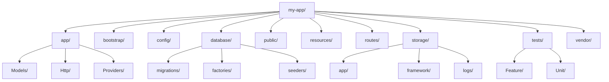
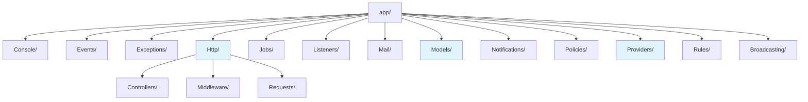
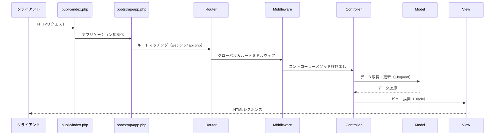
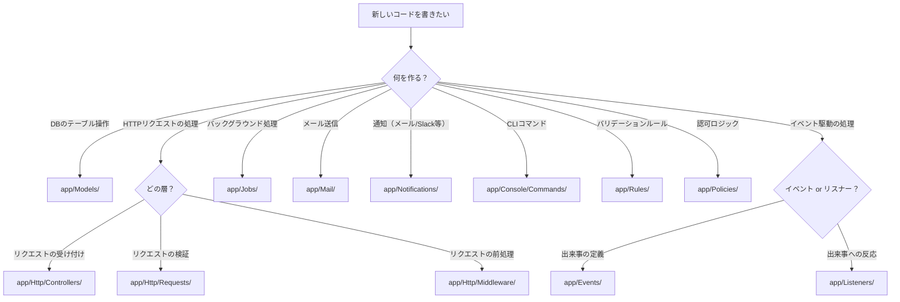

# Laravel プロジェクト構成

## 概要

Laravelプロジェクトを `composer create-project laravel/laravel` で作成すると、規約に基づいたディレクトリ構成が自動生成される。このドキュメントでは、各ディレクトリ・ファイルの役割と目的を体系的に解説する。

Laravel 12.x 公式ドキュメント（[Directory Structure](https://laravel.com/docs/12.x/structure)）に基づく。

---

## なぜフォルダ構成を理解するのか？

| 理由 | 説明 |
|------|------|
| コードの配置先がわかる | 新しいクラスやファイルを適切な場所に作成できる |
| チーム開発がスムーズになる | 全員が同じ規約に従うことで、コードの一貫性が保たれる |
| フレームワークの動作を理解できる | リクエストがどのように処理されるか全体像が掴める |
| トラブルシューティングが速くなる | 問題が発生した際に、どのファイルを調べるべきか判断できる |
| Artisanコマンドとの対応が理解できる | `make:*` コマンドがどこにファイルを生成するか予測できる |

---

## 目次

1. [プロジェクト全体構成](#1-プロジェクト全体構成)
2. [ルートディレクトリ詳細](#2-ルートディレクトリ詳細)
   - [app/](#app)
   - [bootstrap/](#bootstrap)
   - [config/](#config)
   - [database/](#database)
   - [public/](#public)
   - [resources/](#resources)
   - [routes/](#routes)
   - [storage/](#storage)
   - [tests/](#tests)
   - [vendor/](#vendor)
3. [app/ ディレクトリ詳細](#3-app-ディレクトリ詳細)
4. [routes/ ディレクトリ詳細](#4-routes-ディレクトリ詳細)
5. [storage/ ディレクトリ詳細](#5-storage-ディレクトリ詳細)
6. [よくある質問](#6-よくある質問)

---

## 1. プロジェクト全体構成

### ディレクトリツリー



### ディレクトリ一覧

| ディレクトリ | 役割 | 概要 |
|-------------|------|------|
| `app/` | アプリケーションコア | ビジネスロジック・コントローラー・モデルなど |
| `bootstrap/` | 起動処理 | フレームワークの初期化とキャッシュ |
| `config/` | 設定ファイル | アプリケーション全体の設定 |
| `database/` | データベース関連 | マイグレーション・シーダー・ファクトリ |
| `public/` | 公開ディレクトリ | Webサーバーのドキュメントルート |
| `resources/` | リソース | ビュー・未コンパイルCSS/JS・言語ファイル |
| `routes/` | ルート定義 | URLとコントローラーの紐付け |
| `storage/` | 生成ファイル | ログ・キャッシュ・セッション・コンパイル済みビュー |
| `tests/` | テスト | Feature/Unitテストコード |
| `vendor/` | 依存パッケージ | Composerでインストールしたパッケージ |

---

## 2. ルートディレクトリ詳細

### app/

**アプリケーションのコアコード**が格納されるディレクトリ。プロジェクトのほぼすべてのクラスがここに配置される。

```
app/
├── Http/
│   └── Controllers/
├── Models/
└── Providers/
    └── AppServiceProvider.php
```

- 名前空間 `App\` として PSR-4 オートローディングされる
- `composer.json` の `autoload` セクションで定義
- 新規プロジェクトではデフォルトで `Http/`、`Models/`、`Providers/` が存在する
- その他のディレクトリ（`Jobs/`、`Events/` など）は `php artisan make:*` コマンドの実行時に自動生成される

#### なぜこの構成か？

Laravelはクラスの配置に関してほとんど制約を設けていない。Composerがオートロードできる場所であれば、どこに配置してもよい。ただし、デフォルトの構成に従うことで、チーム全体が統一された規約でコードを書ける。

---

### bootstrap/

**フレームワークの起動処理**を行うディレクトリ。

```
bootstrap/
├── app.php
├── cache/
│   ├── packages.php
│   └── services.php
└── providers.php
```

| ファイル / ディレクトリ | 役割 |
|------------------------|------|
| `app.php` | フレームワークのブートストラップ。ミドルウェア、例外処理、ルーティングなどを設定する |
| `cache/` | ルートやサービスのキャッシュファイル。パフォーマンス最適化のために自動生成される |
| `providers.php` | 登録するサービスプロバイダの一覧 |

#### なぜ `bootstrap/` が重要か？

`app.php` は Laravel 11 以降、アプリケーション全体の設定を一元管理する重要なファイルとなった。ミドルウェアの登録、例外ハンドラーの設定、ルーティングの読み込みなどがここで定義される。

```php
// bootstrap/app.php
use Illuminate\Foundation\Application;
use Illuminate\Foundation\Configuration\Middleware;

return Application::configure(basePath: dirname(__DIR__))
    ->withRouting(
        web: __DIR__.'/../routes/web.php',
        commands: __DIR__.'/../routes/console.php',
    )
    ->withMiddleware(function (Middleware $middleware) {
        // ミドルウェアの設定
    })
    ->withExceptions(function (Exceptions $exceptions) {
        // 例外ハンドラーの設定
    })
    ->create();
```

---

### config/

**設定ファイル**をまとめたディレクトリ。すべての設定オプションが個別のPHPファイルに分かれている。

```
config/
├── app.php
├── auth.php
├── cache.php
├── database.php
├── filesystems.php
├── logging.php
├── mail.php
├── queue.php
├── services.php
└── session.php
```

| ファイル | 設定内容 |
|---------|---------|
| `app.php` | アプリ名、タイムゾーン、ロケール、暗号化キーなど |
| `auth.php` | 認証ガード、プロバイダ、パスワードリセット |
| `cache.php` | キャッシュドライバ（file, redis, memcachedなど） |
| `database.php` | DB接続設定（MySQL, PostgreSQL, SQLiteなど） |
| `filesystems.php` | ファイルストレージ（local, s3など） |
| `logging.php` | ログチャンネル設定 |
| `mail.php` | メール送信設定 |
| `queue.php` | キュードライバ設定 |
| `session.php` | セッション管理設定 |

#### 設定値へのアクセス方法

```php
// config() ヘルパーでアクセス
$appName = config('app.name');           // config/app.php の 'name' キー
$dbHost = config('database.connections.mysql.host');

// デフォルト値の指定
$value = config('app.timezone', 'UTC');

// 実行時に値を設定
config(['app.timezone' => 'Asia/Tokyo']);
```

#### なぜ `.env` と分離されているのか？

- `config/` は**構成の定義**（どんな設定項目があるか）を管理する
- `.env` は**環境ごとの値**（本番・開発・テストなど）を管理する
- 設定ファイル内で `env()` ヘルパーを使って `.env` の値を読み込む

```php
// config/database.php
'mysql' => [
    'host' => env('DB_HOST', '127.0.0.1'),  // .envから読み込み
    'port' => env('DB_PORT', '3306'),
],
```

---

### database/

**マイグレーション、シーダー、ファクトリ**を管理するディレクトリ。

```
database/
├── factories/
│   └── UserFactory.php
├── migrations/
│   ├── 0001_01_01_000000_create_users_table.php
│   ├── 0001_01_01_000001_create_cache_table.php
│   └── 0001_01_01_000002_create_jobs_table.php
└── seeders/
    └── DatabaseSeeder.php
```

| ディレクトリ | 役割 | 説明 |
|-------------|------|------|
| `factories/` | モデルファクトリ | テスト・シーディング用のダミーデータ定義 |
| `migrations/` | マイグレーション | データベーススキーマの変更履歴 |
| `seeders/` | シーダー | 初期データ・テストデータの投入 |

#### 各ファイルの具体例

**ファクトリ**（ダミーデータ生成）:

```php
// database/factories/UserFactory.php
public function definition(): array
{
    return [
        'name' => fake()->name(),
        'email' => fake()->unique()->safeEmail(),
        'password' => Hash::make('password'),
    ];
}

// 使用例
$user = User::factory()->create();           // 1件作成
$users = User::factory()->count(10)->create(); // 10件作成
```

**シーダー**（初期データ投入）:

```php
// database/seeders/DatabaseSeeder.php
public function run(): void
{
    User::factory()->count(10)->create();

    // 固定データの投入
    DB::table('roles')->insert([
        ['name' => 'admin'],
        ['name' => 'editor'],
        ['name' => 'viewer'],
    ]);
}
```

```bash
# シーダーの実行
php artisan db:seed

# マイグレーション + シーダー
php artisan migrate:fresh --seed
```

なお、このディレクトリにはオプションでSQLiteデータベースファイルを配置することも可能。

---

### public/

**Webサーバーのドキュメントルート**。すべてのHTTPリクエストの入口。

```
public/
├── index.php
├── .htaccess
├── favicon.ico
└── robots.txt
```

| ファイル | 役割 |
|---------|------|
| `index.php` | フロントコントローラー。すべてのリクエストがこのファイルを通過する |
| `.htaccess` | Apache用のURL書き換え設定 |

#### なぜ `public/` がドキュメントルートか？

- セキュリティ上、`app/` や `config/` などのファイルがブラウザから直接アクセスされることを防ぐ
- 公開すべきアセット（画像、CSS、JSなど）だけをこのディレクトリに配置する
- Webサーバー（Nginx / Apache）は `public/` をルートとして設定する

```nginx
# Nginx設定例
server {
    root /var/www/html/public;
    index index.php;
}
```

---

### resources/

**ビューと未コンパイルのアセット**を格納するディレクトリ。

```
resources/
├── css/
│   └── app.css
├── js/
│   └── app.js
└── views/
    └── welcome.blade.php
```

| ディレクトリ | 役割 | 説明 |
|-------------|------|------|
| `css/` | CSSソース | Tailwind CSSなどの未コンパイルCSS |
| `js/` | JavaScriptソース | 未コンパイルのJavaScript |
| `views/` | Bladeテンプレート | HTMLを生成するビューファイル（`.blade.php`） |

#### ビューファイルの命名規約

```
resources/views/
├── layouts/
│   └── app.blade.php        # 共通レイアウト
├── components/
│   └── alert.blade.php      # Bladeコンポーネント
├── users/
│   ├── index.blade.php      # 一覧
│   ├── show.blade.php       # 詳細
│   ├── create.blade.php     # 作成フォーム
│   └── edit.blade.php       # 編集フォーム
└── welcome.blade.php        # トップページ
```

ビューは `view()` ヘルパーでドット記法で参照する:

```php
return view('users.index');   // resources/views/users/index.blade.php
return view('layouts.app');   // resources/views/layouts/app.blade.php
```

---

### routes/

**ルート定義**をまとめたディレクトリ。URLとコントローラーの対応付けを行う。

```
routes/
├── web.php
└── console.php
```

> `api.php` と `channels.php` はオプション。それぞれ `php artisan install:api` / `php artisan install:broadcasting` で追加できる。

詳細は [4. routes/ ディレクトリ詳細](#4-routes-ディレクトリ詳細) を参照。

---

### storage/

**フレームワークが生成するファイル**を保存するディレクトリ。

```
storage/
├── app/
│   └── public/
├── framework/
│   ├── cache/
│   ├── sessions/
│   ├── testing/
│   └── views/
└── logs/
    └── laravel.log
```

詳細は [5. storage/ ディレクトリ詳細](#5-storage-ディレクトリ詳細) を参照。

---

### tests/

**テストコード**を格納するディレクトリ。PestまたはPHPUnitを使用する。

```
tests/
├── Feature/
│   └── ExampleTest.php
├── Unit/
│   └── ExampleTest.php
└── TestCase.php
```

| ディレクトリ | 役割 | 説明 |
|-------------|------|------|
| `Feature/` | フィーチャーテスト | HTTPリクエストを含む統合テスト |
| `Unit/` | ユニットテスト | 個々のクラス・メソッドの単体テスト |

#### テストの使い分け

```php
// Feature テスト: HTTPリクエスト全体をテスト
public function test_homepage_returns_200(): void
{
    $response = $this->get('/');
    $response->assertStatus(200);
}

// Unit テスト: 特定のロジックのみテスト
public function test_price_calculation(): void
{
    $product = new Product(price: 1000);
    $this->assertEquals(1100, $product->priceWithTax());
}
```

テストクラス名は必ず `Test` サフィックスを付ける規約がある（例: `UserTest.php`）。

```bash
# テスト実行
php artisan test
```

---

### vendor/

**Composerの依存パッケージ**がインストールされるディレクトリ。

- `composer install` / `composer update` で自動管理される
- **Gitにコミットしない**（`.gitignore` に含まれている）
- 直接編集しない。パッケージの動作を変えたい場合はサービスプロバイダやオーバーライドの仕組みを使う

---

## 3. app/ ディレクトリ詳細

### 内部構造



> 青色のディレクトリはデフォルトで存在する。その他は `php artisan make:*` コマンドで自動生成される。

### 各サブディレクトリの役割

| ディレクトリ | 役割 | 説明 |
|-------------|------|------|
| `Broadcasting/` | ブロードキャストチャンネル | WebSocketを使ったリアルタイム通信のチャンネルクラス |
| `Console/` | Artisanコマンド | カスタムCLIコマンドの定義 |
| `Events/` | イベント | アプリケーション内の「出来事」を表すクラス |
| `Exceptions/` | 例外 | カスタム例外クラスの定義 |
| `Http/` | HTTP層 | コントローラー、ミドルウェア、フォームリクエスト |
| `Jobs/` | キュージョブ | バックグラウンドで実行する処理（メール送信、データ処理など） |
| `Listeners/` | イベントリスナー | イベントに反応して実行される処理 |
| `Mail/` | メール | メール本文の構築クラス |
| `Models/` | Eloquentモデル | データベーステーブルに対応するモデルクラス |
| `Notifications/` | 通知 | メール・Slack・SMS・DB通知の定義 |
| `Policies/` | 認可ポリシー | 特定のモデルに対する操作権限の定義 |
| `Providers/` | サービスプロバイダ | アプリケーションの初期設定（バインディング登録等） |
| `Rules/` | バリデーションルール | カスタムバリデーションルールの定義 |

### Http/ ディレクトリの構成

`Http/` はリクエスト処理に関わるクラスをまとめる重要なディレクトリ。

| ディレクトリ | 役割 | 例 |
|-------------|------|-----|
| `Controllers/` | コントローラー | `UserController.php` |
| `Middleware/` | ミドルウェア | `EnsureUserIsAdmin.php` |
| `Requests/` | フォームリクエスト | `StorePostRequest.php` |

```php
// app/Http/Controllers/UserController.php
namespace App\Http\Controllers;

use App\Models\User;

class UserController extends Controller
{
    public function index()
    {
        $users = User::all();
        return view('users.index', compact('users'));
    }
}
```

### Artisan make コマンドとの対応表

各ディレクトリは Artisan の `make:*` コマンドでファイルが自動生成される。ディレクトリが存在しない場合も自動で作成される。

| コマンド | 生成先 | 生成されるクラス |
|---------|--------|-----------------|
| `php artisan make:model Post` | `app/Models/` | Eloquentモデル |
| `php artisan make:controller PostController` | `app/Http/Controllers/` | コントローラー |
| `php artisan make:request StorePostRequest` | `app/Http/Requests/` | フォームリクエスト |
| `php artisan make:middleware CheckAge` | `app/Http/Middleware/` | ミドルウェア |
| `php artisan make:command SendEmails` | `app/Console/Commands/` | Artisanコマンド |
| `php artisan make:event OrderShipped` | `app/Events/` | イベント |
| `php artisan make:listener SendShipmentNotification` | `app/Listeners/` | リスナー |
| `php artisan make:job ProcessPodcast` | `app/Jobs/` | ジョブ |
| `php artisan make:mail OrderConfirmation` | `app/Mail/` | メール |
| `php artisan make:notification InvoicePaid` | `app/Notifications/` | 通知 |
| `php artisan make:policy PostPolicy` | `app/Policies/` | ポリシー |
| `php artisan make:provider PaymentServiceProvider` | `app/Providers/` | サービスプロバイダ |
| `php artisan make:rule Uppercase` | `app/Rules/` | バリデーションルール |
| `php artisan make:channel OrderChannel` | `app/Broadcasting/` | ブロードキャストチャンネル |
| `php artisan make:exception InvalidOrderException` | `app/Exceptions/` | 例外クラス |

> すべての利用可能なコマンドは `php artisan list make` で確認できる。

---

## 4. routes/ ディレクトリ詳細

### ルートファイルの種類

| ファイル | ミドルウェアグループ | 用途 | デフォルト |
|---------|---------------------|------|-----------|
| `web.php` | `web`（セッション、CSRF、Cookie暗号化） | Webブラウザからのリクエスト | あり |
| `console.php` | — | CLIコマンド・タスクスケジューリング | あり |
| `api.php` | `api`（ステートレス、トークン認証） | APIリクエスト | なし（`install:api` で追加） |
| `channels.php` | — | WebSocketブロードキャストチャンネル | なし（`install:broadcasting` で追加） |

### web.php と api.php の違い

```php
// routes/web.php — ステートフル（セッション・CSRF保護あり）
Route::get('/dashboard', function () {
    return view('dashboard');
})->middleware('auth');

// routes/api.php — ステートレス（トークン認証）
// URL自動プレフィックス: /api/*
Route::middleware('auth:sanctum')->group(function () {
    Route::get('/user', function (Request $request) {
        return $request->user();
    });
});
```

### console.php の使い方

```php
// routes/console.php
use Illuminate\Support\Facades\Schedule;

// クロージャベースのコマンド定義
Artisan::command('inspire', function () {
    $this->comment(Inspiring::quote());
})->purpose('Display an inspiring quote');

// タスクスケジューリング
Schedule::command('inspire')->hourly();
```

### HTTPリクエストの処理フロー



#### なぜルートファイルが分離されているのか？

- **web.php**: ブラウザからのリクエストにはセッション管理やCSRF保護が必要
- **api.php**: APIリクエストはステートレスでトークン認証が一般的。不要なセッション処理を省ける
- **console.php**: CLIからの実行にHTTP関連の処理は不要
- それぞれ異なるミドルウェアグループが適用されるため、責務が明確に分離される

---

## 5. storage/ ディレクトリ詳細

### 構成

```
storage/
├── app/
│   └── public/       # 公開ファイル（アバター画像など）
├── framework/
│   ├── cache/        # ファイルベースのキャッシュ
│   ├── sessions/     # ファイルベースのセッション
│   ├── testing/      # テスト用一時ファイル
│   └── views/        # コンパイル済みBladeテンプレート
└── logs/
    └── laravel.log   # アプリケーションログ
```

### 各サブディレクトリの役割

| ディレクトリ | 役割 | 説明 |
|-------------|------|------|
| `storage/app/` | アプリ生成ファイル | ユーザーがアップロードしたファイルなど |
| `storage/app/public/` | 公開ファイル | Webからアクセス可能にするファイル（`storage:link` が必要） |
| `storage/framework/cache/` | キャッシュ | ファイルベースキャッシュの保存先 |
| `storage/framework/sessions/` | セッション | ファイルドライバ使用時のセッションデータ |
| `storage/framework/views/` | コンパイル済みビュー | Bladeテンプレートのコンパイル結果 |
| `storage/logs/` | ログ | `laravel.log` 等のアプリケーションログ |

### storage:link コマンド

`storage/app/public/` に保存したファイルをWebからアクセス可能にするには、`public/storage` へのシンボリックリンクを作成する必要がある。

```bash
php artisan storage:link
```

このコマンドは以下のシンボリックリンクを作成する:

```
public/storage → storage/app/public
```

#### 使用例

```php
// ファイルの保存
$path = $request->file('avatar')->store('avatars', 'public');
// → storage/app/public/avatars/xxxxx.jpg に保存される

// URLの生成
$url = Storage::url($path);
// → /storage/avatars/xxxxx.jpg
```

#### なぜシンボリックリンクが必要か？

- `storage/` ディレクトリはドキュメントルート（`public/`）の外にあるため、通常はWebからアクセスできない
- シンボリックリンクを作ることで、`public/storage` 経由でアクセスを可能にする
- アプリケーションコードからは統一的に `storage/app/public/` に書き込み、Webからは `public/storage/` で読み取れる

---

## 6. よくある質問

### 「どこにコードを書けばいい？」フローチャート



### よくある疑問

**Q: `app/Services/` や `app/Repositories/` は作ってもよい？**

A: もちろん。Laravelはクラスの配置場所に厳密な制約を設けていない。Composerのオートローダーが読み込める場所であれば、プロジェクトの規模や設計に応じて自由にディレクトリを追加できる。

```
app/
├── Services/        # ビジネスロジック層
├── Repositories/    # データアクセス層
├── Actions/         # 単一責務のアクションクラス
└── ValueObjects/    # 値オブジェクト
```

**Q: `vendor/` のコードを修正したい場合は？**

A: `vendor/` は直接編集しない。`composer update` で上書きされる。代わりに以下の方法を使う:

- サービスプロバイダでバインディングをオーバーライド
- 継承してカスタムクラスを作成
- Laravelの「publishable」機能（`php artisan vendor:publish`）で設定やビューをコピーして編集

**Q: `storage/` のパーミッションエラーが出る場合は？**

A: Webサーバーが `storage/` と `bootstrap/cache/` に書き込み権限を持っている必要がある。

```bash
chmod -R 775 storage bootstrap/cache
chown -R www-data:www-data storage bootstrap/cache
```

---

*このドキュメントは Laravel 12.x 公式ドキュメント（[Directory Structure](https://laravel.com/docs/12.x/structure)）に基づいて作成されています。*
