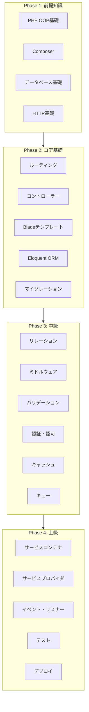
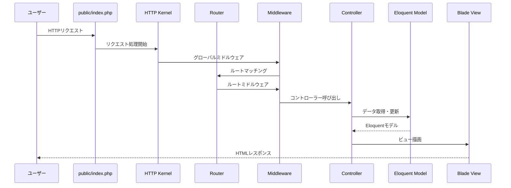
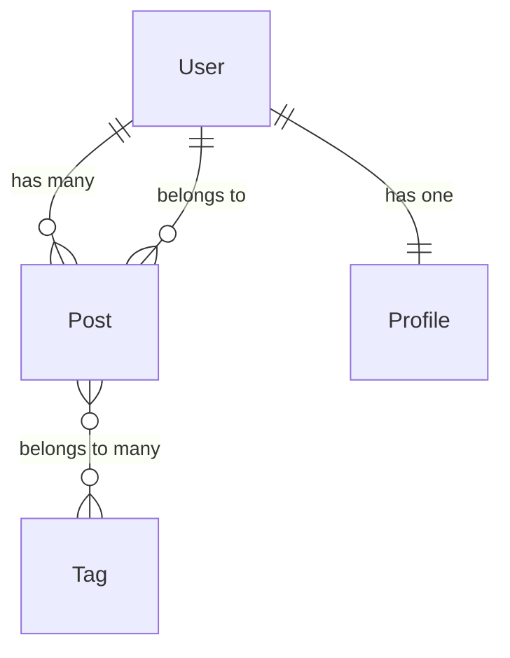
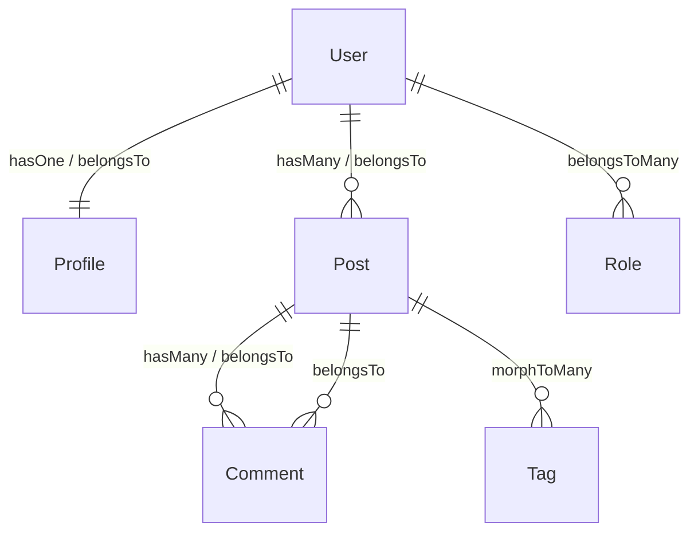
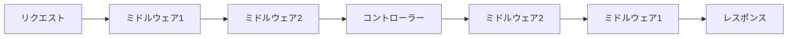
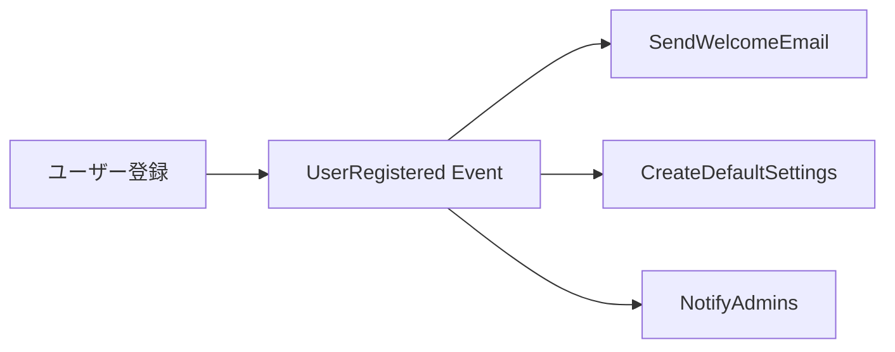

# Laravel 学習ロードマップ

PHPの人気フレームワーク「Laravel」を体系的に学習するためのガイド。基礎から実践的な開発スキルまで、段階的に習得していく。

-----

## 目次

1. [全体像：Laravelの学習フロー](#全体像laravelの学習フロー)
1. [Phase 1: 基礎準備と前提知識（1〜2週間）](#phase-1-基礎準備と前提知識12週間)
1. [Phase 2: Laravelコア基礎（3〜4週間）](#phase-2-laravelコア基礎34週間)
1. [Phase 3: 中級トピック（4〜5週間）](#phase-3-中級トピック45週間)
1. [Phase 4: 上級トピック（3〜4週間）](#phase-4-上級トピック34週間)
1. [学習リソース](#学習リソース)
1. [学習のコツ](#学習のコツ)

-----

## 全体像：Laravelの学習フロー



### Laravelリクエストライフサイクル

Laravelがリクエストを処理する流れを理解することで、各コンポーネントの役割が明確になる。



-----

## Phase 1: 基礎準備と前提知識（1〜2週間）

Laravelを効果的に学ぶために必要な前提知識を固める。

### 1.1 PHP OOP基礎

Laravelは完全にオブジェクト指向で設計されているため、PHPのOOP知識が必須。

#### クラスとオブジェクト

```php
class User
{
    // プロパティ（属性）
    private string $name;
    private string $email;

    // コンストラクタ
    public function __construct(string $name, string $email)
    {
        $this->name = $name;
        $this->email = $email;
    }

    // メソッド（振る舞い）
    public function getName(): string
    {
        return $this->name;
    }
}

// インスタンス化
$user = new User('田中太郎', 'tanaka@example.com');
echo $user->getName(); // 田中太郎
```

#### 継承とポリモーフィズム

```php
// 基底クラス
abstract class Animal
{
    abstract public function speak(): string;
}

// 継承クラス
class Dog extends Animal
{
    public function speak(): string
    {
        return 'ワン！';
    }
}

class Cat extends Animal
{
    public function speak(): string
    {
        return 'ニャー！';
    }
}

// ポリモーフィズム
function makeSpeak(Animal $animal): void
{
    echo $animal->speak();
}

makeSpeak(new Dog()); // ワン！
makeSpeak(new Cat()); // ニャー！
```

#### インターフェース

```php
interface PaymentGateway
{
    public function charge(int $amount): bool;
    public function refund(string $transactionId): bool;
}

class StripePayment implements PaymentGateway
{
    public function charge(int $amount): bool
    {
        // Stripe APIを使った決済処理
        return true;
    }

    public function refund(string $transactionId): bool
    {
        // 返金処理
        return true;
    }
}
```

#### トレイト

複数のクラスで共通の機能を再利用するための仕組み。Laravelでは多用される。

```php
trait Timestamps
{
    public function touch(): void
    {
        $this->updatedAt = new DateTime();
    }
}

class Post
{
    use Timestamps;

    public DateTime $updatedAt;
}

class Comment
{
    use Timestamps;

    public DateTime $updatedAt;
}
```

#### 名前空間

```php
// app/Models/User.php
namespace App\Models;

class User
{
    // ...
}

// 別のファイルで使用
use App\Models\User;

$user = new User();
```

#### 学習目標

- [ ] クラス、プロパティ、メソッドの概念を説明できる
- [ ] 継承とインターフェースの違いを説明できる
- [ ] トレイトの使いどころを理解している
- [ ] 名前空間とオートローディングの仕組みを理解している

-----

### 1.2 Composer & パッケージ管理

ComposerはPHPのパッケージマネージャー。Laravelのインストールと依存関係管理に必須。

#### 基本コマンド

```bash
# Laravelプロジェクト作成
composer create-project laravel/laravel my-app

# パッケージのインストール
composer require guzzlehttp/guzzle

# 開発用パッケージのインストール
composer require --dev phpunit/phpunit

# 依存関係の更新
composer update

# オートローダーの再生成
composer dump-autoload
```

#### composer.json の構造

```json
{
    "name": "laravel/laravel",
    "require": {
        "php": "^8.2",
        "laravel/framework": "^11.0"
    },
    "require-dev": {
        "phpunit/phpunit": "^11.0"
    },
    "autoload": {
        "psr-4": {
            "App\\": "app/"
        }
    }
}
```

#### なぜComposerが重要か

- **依存関係の自動解決**: パッケージが必要とする他のパッケージを自動でインストール
- **バージョン管理**: `composer.lock`で正確なバージョンを固定し、環境差異を防ぐ
- **オートローディング**: クラスファイルを自動で読み込み、`require`文を不要に

#### 学習目標

- [ ] Composerでパッケージをインストール・更新できる
- [ ] composer.jsonの構造を理解している
- [ ] PSR-4オートローディングの仕組みを説明できる

-----

### 1.3 データベース基礎

#### SQL基本操作

```sql
-- データ取得
SELECT * FROM users WHERE status = 'active';

-- データ挿入
INSERT INTO users (name, email) VALUES ('田中太郎', 'tanaka@example.com');

-- データ更新
UPDATE users SET name = '田中次郎' WHERE id = 1;

-- データ削除
DELETE FROM users WHERE id = 1;

-- 結合
SELECT users.name, posts.title
FROM users
INNER JOIN posts ON users.id = posts.user_id;
```

#### リレーションの種類



| リレーション | 説明 | 例 |
|-------------|------|-----|
| 1対1 | 一つのレコードが一つに対応 | User ↔ Profile |
| 1対多 | 一つのレコードが複数に対応 | User → Posts |
| 多対多 | 複数のレコードが複数に対応 | Post ↔ Tags |

#### 学習目標

- [ ] 基本的なCRUD操作のSQLを書ける
- [ ] テーブル結合（JOIN）を理解している
- [ ] リレーションの種類を説明できる

-----

### 1.4 HTTP & Web基礎

#### HTTPメソッド

| メソッド | 用途 | 冪等性 | 安全性 |
|---------|------|--------|--------|
| GET | リソース取得 | Yes | Yes |
| POST | リソース作成 | No | No |
| PUT | リソース完全置換 | Yes | No |
| PATCH | リソース部分更新 | No | No |
| DELETE | リソース削除 | Yes | No |

#### ステータスコード

| コード | 意味 | 使用場面 |
|--------|------|---------|
| 200 | OK | 成功 |
| 201 | Created | リソース作成成功 |
| 204 | No Content | 成功（レスポンスボディなし） |
| 301 | Moved Permanently | 恒久的リダイレクト |
| 302 | Found | 一時的リダイレクト |
| 400 | Bad Request | リクエスト不正 |
| 401 | Unauthorized | 認証エラー |
| 403 | Forbidden | 権限エラー |
| 404 | Not Found | リソース未発見 |
| 422 | Unprocessable Entity | バリデーションエラー |
| 500 | Internal Server Error | サーバーエラー |

#### 学習目標

- [ ] HTTPメソッドの使い分けを説明できる
- [ ] 主要なステータスコードの意味を理解している
- [ ] リクエスト/レスポンスの構造を理解している

-----

### 1.5 開発環境セットアップ

#### 推奨環境

| ツール | 説明 |
|--------|------|
| PHP 8.2+ | Laravel 11の必須バージョン |
| Composer | パッケージ管理 |
| MySQL/PostgreSQL | データベース |
| Node.js | フロントエンドビルド（Vite） |
| Laravel Herd / Docker | ローカル開発環境 |

#### Laravel Herdでのセットアップ（macOS）

```bash
# Herdをインストール後
cd ~/Herd

# Laravelプロジェクト作成
composer create-project laravel/laravel my-app

# http://my-app.test でアクセス可能
```

#### Docker（Laravel Sail）でのセットアップ

```bash
# 新規プロジェクト作成
curl -s "https://laravel.build/my-app" | bash

# 起動
cd my-app
./vendor/bin/sail up -d

# http://localhost でアクセス可能
```

#### 学習目標

- [ ] ローカル開発環境を構築できる
- [ ] Laravelプロジェクトを作成・起動できる
- [ ] データベース接続を設定できる

-----

## Phase 2: Laravelコア基礎（3〜4週間）

Laravelの基本的な機能を習得する。

### 2.1 ルーティング

#### 基本的なルート定義

```php
// routes/web.php

use App\Http\Controllers\UserController;
use Illuminate\Support\Facades\Route;

// 基本ルート
Route::get('/', function () {
    return view('welcome');
});

// コントローラーへのルーティング
Route::get('/users', [UserController::class, 'index']);
Route::get('/users/{id}', [UserController::class, 'show']);
Route::post('/users', [UserController::class, 'store']);
```

#### ルートパラメータ

```php
// 必須パラメータ
Route::get('/users/{id}', function (int $id) {
    return "User ID: {$id}";
});

// オプションパラメータ
Route::get('/users/{name?}', function (?string $name = 'Guest') {
    return "Hello, {$name}";
});

// 正規表現による制約
Route::get('/users/{id}', function (int $id) {
    return "User ID: {$id}";
})->where('id', '[0-9]+');
```

#### ルートグループ

```php
// プレフィックスとミドルウェアをまとめて適用
Route::prefix('admin')
    ->middleware('auth')
    ->group(function () {
        Route::get('/dashboard', [AdminController::class, 'dashboard']);
        Route::get('/users', [AdminController::class, 'users']);
    });
```

#### ルートモデルバインディング

URLパラメータから自動的にEloquentモデルを取得する便利な機能。

```php
// 通常の書き方
Route::get('/users/{id}', function (int $id) {
    $user = User::findOrFail($id);
    return view('users.show', compact('user'));
});

// ルートモデルバインディング（自動的にUserを取得）
Route::get('/users/{user}', function (User $user) {
    return view('users.show', compact('user'));
});
```

なぜ便利か：

- 存在しないIDの場合、自動的に404エラーを返す
- コードがシンプルになる
- カスタムキー（slugなど）での検索も可能

#### 学習目標

- [ ] 基本的なルートを定義できる
- [ ] ルートパラメータを扱える
- [ ] ルートグループを使った整理ができる
- [ ] ルートモデルバインディングを活用できる

-----

### 2.2 コントローラー

#### コントローラーの作成

```bash
# 基本的なコントローラー
php artisan make:controller UserController

# リソースコントローラー（CRUD操作用）
php artisan make:controller PostController --resource
```

#### 基本的なコントローラー

```php
// app/Http/Controllers/UserController.php

namespace App\Http\Controllers;

use App\Models\User;
use Illuminate\Http\Request;

class UserController extends Controller
{
    public function index()
    {
        $users = User::all();
        return view('users.index', compact('users'));
    }

    public function show(User $user)
    {
        return view('users.show', compact('user'));
    }

    public function store(Request $request)
    {
        $validated = $request->validate([
            'name' => 'required|max:255',
            'email' => 'required|email|unique:users',
        ]);

        $user = User::create($validated);

        return redirect()->route('users.show', $user);
    }
}
```

#### リソースコントローラー

CRUDに対応した7つのメソッドを持つコントローラー。

| メソッド | URI | アクション | 用途 |
|---------|-----|-----------|------|
| GET | /posts | index | 一覧表示 |
| GET | /posts/create | create | 作成フォーム |
| POST | /posts | store | 保存処理 |
| GET | /posts/{post} | show | 詳細表示 |
| GET | /posts/{post}/edit | edit | 編集フォーム |
| PUT/PATCH | /posts/{post} | update | 更新処理 |
| DELETE | /posts/{post} | destroy | 削除処理 |

```php
// routes/web.php
Route::resource('posts', PostController::class);

// 上記は以下と同等
Route::get('/posts', [PostController::class, 'index'])->name('posts.index');
Route::get('/posts/create', [PostController::class, 'create'])->name('posts.create');
Route::post('/posts', [PostController::class, 'store'])->name('posts.store');
Route::get('/posts/{post}', [PostController::class, 'show'])->name('posts.show');
Route::get('/posts/{post}/edit', [PostController::class, 'edit'])->name('posts.edit');
Route::put('/posts/{post}', [PostController::class, 'update'])->name('posts.update');
Route::delete('/posts/{post}', [PostController::class, 'destroy'])->name('posts.destroy');
```

#### 依存性注入（DI）

コントローラーでサービスクラスを使う場合、コンストラクタで注入できる。

```php
class UserController extends Controller
{
    public function __construct(
        private UserService $userService
    ) {}

    public function index()
    {
        $users = $this->userService->getAllActiveUsers();
        return view('users.index', compact('users'));
    }
}
```

#### 学習目標

- [ ] コントローラーを作成・使用できる
- [ ] リソースコントローラーの7つのアクションを理解している
- [ ] 依存性注入の仕組みを理解している

-----

### 2.3 Bladeテンプレート

#### 基本構文

```blade
{{-- resources/views/users/index.blade.php --}}

{{-- 変数の出力（自動エスケープ） --}}
<p>{{ $user->name }}</p>

{{-- エスケープなしの出力（信頼できるHTMLのみ） --}}
<div>{!! $user->bio !!}</div>

{{-- コメント --}}
{{-- このコメントはHTMLに出力されない --}}
```

#### 制御構文

```blade
{{-- 条件分岐 --}}
@if ($user->isAdmin())
    <span class="badge">管理者</span>
@elseif ($user->isModerator())
    <span class="badge">モデレーター</span>
@else
    <span class="badge">一般ユーザー</span>
@endif

{{-- 存在チェック --}}
@isset($users)
    <p>ユーザーが存在します</p>
@endisset

{{-- 空チェック --}}
@empty($users)
    <p>ユーザーがいません</p>
@endempty

{{-- 認証状態 --}}
@auth
    <p>ログイン中です</p>
@endauth

@guest
    <p>ゲストです</p>
@endguest
```

#### ループ処理

```blade
{{-- foreach --}}
@foreach ($users as $user)
    <li>{{ $user->name }}</li>
@endforeach

{{-- forelse（空の場合の処理付き） --}}
@forelse ($users as $user)
    <li>{{ $user->name }}</li>
@empty
    <li>ユーザーがいません</li>
@endforelse

{{-- $loop変数 --}}
@foreach ($users as $user)
    @if ($loop->first)
        <li class="first">{{ $user->name }}</li>
    @elseif ($loop->last)
        <li class="last">{{ $user->name }}</li>
    @else
        <li>{{ $user->name }}（{{ $loop->iteration }}番目）</li>
    @endif
@endforeach
```

#### レイアウト継承

```blade
{{-- resources/views/layouts/app.blade.php --}}
<!DOCTYPE html>
<html>
<head>
    <title>@yield('title') - My App</title>
</head>
<body>
    <nav>
        @include('partials.navigation')
    </nav>

    <main>
        @yield('content')
    </main>

    @stack('scripts')
</body>
</html>

{{-- resources/views/users/index.blade.php --}}
@extends('layouts.app')

@section('title', 'ユーザー一覧')

@section('content')
    <h1>ユーザー一覧</h1>
    @foreach ($users as $user)
        <p>{{ $user->name }}</p>
    @endforeach
@endsection

@push('scripts')
    <script src="/js/users.js"></script>
@endpush
```

#### Bladeコンポーネント

再利用可能なUIコンポーネントを作成できる。

```bash
php artisan make:component Alert
```

```php
// app/View/Components/Alert.php
class Alert extends Component
{
    public function __construct(
        public string $type = 'info',
        public string $message = ''
    ) {}

    public function render()
    {
        return view('components.alert');
    }
}
```

```blade
{{-- resources/views/components/alert.blade.php --}}
<div class="alert alert-{{ $type }}">
    {{ $message }}
</div>

{{-- 使用方法 --}}
<x-alert type="success" message="保存しました！" />
```

#### 学習目標

- [ ] Bladeの基本構文を使える
- [ ] レイアウト継承とセクションを活用できる
- [ ] Bladeコンポーネントを作成・使用できる

-----

### 2.4 Eloquent ORM & モデル

#### モデルの作成

```bash
# モデル作成
php artisan make:model Post

# マイグレーションと一緒に作成
php artisan make:model Post -m

# モデル、マイグレーション、コントローラー、ファクトリー、シーダーを一括作成
php artisan make:model Post -mcfs
```

#### 基本的なモデル

```php
// app/Models/Post.php

namespace App\Models;

use Illuminate\Database\Eloquent\Model;

class Post extends Model
{
    // マス代入を許可するカラム
    protected $fillable = [
        'title',
        'body',
        'published_at',
    ];

    // 型キャスト
    protected $casts = [
        'published_at' => 'datetime',
        'is_featured' => 'boolean',
    ];

    // マス代入を禁止するカラム（$fillableの代わりに使用可能）
    // protected $guarded = ['id'];
}
```

#### CRUD操作

```php
// 作成
$post = Post::create([
    'title' => '最初の投稿',
    'body' => 'こんにちは、世界！',
]);

// 全件取得
$posts = Post::all();

// 条件付き取得
$posts = Post::where('is_published', true)
    ->orderBy('created_at', 'desc')
    ->get();

// 1件取得
$post = Post::find(1);           // 見つからなければnull
$post = Post::findOrFail(1);     // 見つからなければ404

// 更新
$post->update(['title' => '更新されたタイトル']);

// 削除
$post->delete();
```

#### クエリスコープ

よく使う条件をメソッドとして定義できる。

```php
class Post extends Model
{
    // ローカルスコープ
    public function scopePublished($query)
    {
        return $query->where('is_published', true);
    }

    public function scopeRecent($query)
    {
        return $query->orderBy('created_at', 'desc');
    }
}

// 使用方法
$posts = Post::published()->recent()->get();
```

#### アクセサとミューテタ

データの取得・保存時に自動で変換処理を行う。

```php
use Illuminate\Database\Eloquent\Casts\Attribute;

class User extends Model
{
    // アクセサ（取得時）
    protected function name(): Attribute
    {
        return Attribute::make(
            get: fn (string $value) => ucfirst($value),
        );
    }

    // ミューテタ（保存時）
    protected function email(): Attribute
    {
        return Attribute::make(
            set: fn (string $value) => strtolower($value),
        );
    }
}
```

#### 学習目標

- [ ] モデルを作成・設定できる
- [ ] 基本的なCRUD操作ができる
- [ ] クエリスコープを定義・使用できる
- [ ] マス代入保護の仕組みを理解している

-----

### 2.5 マイグレーション

#### マイグレーションの作成

```bash
# テーブル作成用
php artisan make:migration create_posts_table

# カラム追加用
php artisan make:migration add_slug_to_posts_table --table=posts
```

#### 基本的なマイグレーション

```php
// database/migrations/2024_01_01_000000_create_posts_table.php

use Illuminate\Database\Migrations\Migration;
use Illuminate\Database\Schema\Blueprint;
use Illuminate\Support\Facades\Schema;

return new class extends Migration
{
    public function up(): void
    {
        Schema::create('posts', function (Blueprint $table) {
            $table->id();                          // BIGINT UNSIGNED AUTO_INCREMENT PRIMARY KEY
            $table->foreignId('user_id')           // 外部キー
                  ->constrained()                  // usersテーブルへの参照
                  ->cascadeOnDelete();             // 削除時に連動削除
            $table->string('title');               // VARCHAR(255)
            $table->string('slug')->unique();      // ユニーク制約
            $table->text('body');                  // TEXT
            $table->boolean('is_published')        // BOOLEAN
                  ->default(false);
            $table->timestamp('published_at')      // TIMESTAMP
                  ->nullable();
            $table->timestamps();                  // created_at, updated_at
            $table->softDeletes();                 // deleted_at（論理削除用）

            // インデックス
            $table->index('published_at');
        });
    }

    public function down(): void
    {
        Schema::dropIfExists('posts');
    }
};
```

#### よく使うカラムタイプ

| メソッド | データ型 | 説明 |
|---------|---------|------|
| `id()` | BIGINT UNSIGNED | 主キー |
| `string('name')` | VARCHAR(255) | 短い文字列 |
| `text('body')` | TEXT | 長い文字列 |
| `integer('count')` | INTEGER | 整数 |
| `decimal('price', 8, 2)` | DECIMAL(8,2) | 小数 |
| `boolean('active')` | BOOLEAN | 真偽値 |
| `date('birthday')` | DATE | 日付 |
| `datetime('expires_at')` | DATETIME | 日時 |
| `timestamp('verified_at')` | TIMESTAMP | タイムスタンプ |
| `json('options')` | JSON | JSON |

#### マイグレーションコマンド

```bash
# マイグレーション実行
php artisan migrate

# ロールバック（直前のマイグレーションを戻す）
php artisan migrate:rollback

# すべてロールバックして再実行
php artisan migrate:fresh

# シーダーも一緒に実行
php artisan migrate:fresh --seed
```

#### 学習目標

- [ ] マイグレーションを作成・実行できる
- [ ] 主要なカラムタイプを理解している
- [ ] 外部キー制約を設定できる
- [ ] ロールバックの仕組みを理解している

-----

### 2.6 Artisanコマンド

#### 主要なコマンド

| コマンド | 説明 |
|---------|------|
| `php artisan serve` | 開発サーバー起動 |
| `php artisan make:model Post -mcfs` | モデル+関連ファイル一括作成 |
| `php artisan make:controller PostController` | コントローラー作成 |
| `php artisan migrate` | マイグレーション実行 |
| `php artisan db:seed` | シーダー実行 |
| `php artisan tinker` | 対話型シェル |
| `php artisan route:list` | ルート一覧表示 |
| `php artisan config:cache` | 設定キャッシュ |
| `php artisan cache:clear` | キャッシュクリア |

#### Tinkerの活用

対話型シェルでEloquentやその他の機能をテストできる。

```bash
php artisan tinker

>>> User::count()
=> 42

>>> User::factory()->create(['name' => 'テストユーザー'])
=> App\Models\User {id: 43, name: "テストユーザー", ...}

>>> Post::where('is_published', true)->get()
=> Illuminate\Database\Eloquent\Collection {#1234 ...}
```

#### 学習目標

- [ ] 主要なArtisanコマンドを使える
- [ ] Tinkerでモデル操作ができる
- [ ] カスタムコマンドの存在を知っている

-----

## Phase 3: 中級トピック（4〜5週間）

より実践的な機能を習得する。

### 3.1 Eloquentリレーション

#### リレーションの種類



#### 1対1（hasOne / belongsTo）

```php
// User has one Profile
class User extends Model
{
    public function profile()
    {
        return $this->hasOne(Profile::class);
    }
}

// Profile belongs to User
class Profile extends Model
{
    public function user()
    {
        return $this->belongsTo(User::class);
    }
}

// 使用方法
$user = User::find(1);
$profile = $user->profile;  // Profileインスタンス

$profile = Profile::find(1);
$user = $profile->user;      // Userインスタンス
```

#### 1対多（hasMany / belongsTo）

```php
// User has many Posts
class User extends Model
{
    public function posts()
    {
        return $this->hasMany(Post::class);
    }
}

// Post belongs to User
class Post extends Model
{
    public function user()
    {
        return $this->belongsTo(User::class);
    }
}

// 使用方法
$user = User::find(1);
$posts = $user->posts;       // Collectionを返す

$post = Post::find(1);
$author = $post->user;       // Userインスタンス
```

#### 多対多（belongsToMany）

中間テーブルを介して関連付ける。

```php
// Userモデル
class User extends Model
{
    public function roles()
    {
        return $this->belongsToMany(Role::class);
    }
}

// Roleモデル
class Role extends Model
{
    public function users()
    {
        return $this->belongsToMany(User::class);
    }
}

// 使用方法
$user = User::find(1);
$roles = $user->roles;

// 関連付けの追加
$user->roles()->attach($roleId);
$user->roles()->attach([1, 2, 3]);

// 関連付けの削除
$user->roles()->detach($roleId);

// 同期（指定したIDのみ関連付け）
$user->roles()->sync([1, 2, 3]);
```

中間テーブル（`role_user`）のマイグレーション:

```php
Schema::create('role_user', function (Blueprint $table) {
    $table->id();
    $table->foreignId('user_id')->constrained()->cascadeOnDelete();
    $table->foreignId('role_id')->constrained()->cascadeOnDelete();
    $table->timestamps();
});
```

#### Eager Loading（N+1問題の回避）

```php
// N+1問題（悪い例）
$posts = Post::all();
foreach ($posts as $post) {
    echo $post->user->name;  // 毎回クエリが発行される
}

// Eager Loading（良い例）
$posts = Post::with('user')->get();
foreach ($posts as $post) {
    echo $post->user->name;  // 追加クエリなし
}

// 複数のリレーションを同時に
$posts = Post::with(['user', 'comments', 'tags'])->get();

// ネストしたリレーション
$posts = Post::with('comments.user')->get();
```

#### 学習目標

- [ ] 8つのリレーションタイプを説明できる
- [ ] 適切なリレーションを設計・実装できる
- [ ] Eager Loadingを使ってN+1問題を回避できる

-----

### 3.2 ミドルウェア

リクエストの処理前後に実行される「フィルター」のような仕組み。



#### ミドルウェアの作成

```bash
php artisan make:middleware EnsureUserIsAdmin
```

```php
// app/Http/Middleware/EnsureUserIsAdmin.php

namespace App\Http\Middleware;

use Closure;
use Illuminate\Http\Request;

class EnsureUserIsAdmin
{
    public function handle(Request $request, Closure $next)
    {
        if (! $request->user()?->isAdmin()) {
            abort(403, '管理者権限が必要です');
        }

        return $next($request);  // 次の処理へ
    }
}
```

#### ミドルウェアの登録

```php
// bootstrap/app.php (Laravel 11)

use App\Http\Middleware\EnsureUserIsAdmin;

return Application::configure(basePath: dirname(__DIR__))
    ->withMiddleware(function (Middleware $middleware) {
        $middleware->alias([
            'admin' => EnsureUserIsAdmin::class,
        ]);
    })
    ->create();
```

#### ミドルウェアの適用

```php
// ルートに適用
Route::get('/admin', [AdminController::class, 'index'])
    ->middleware('admin');

// グループに適用
Route::middleware(['auth', 'admin'])->group(function () {
    Route::get('/admin/dashboard', [AdminController::class, 'dashboard']);
    Route::get('/admin/users', [AdminController::class, 'users']);
});

// コントローラーで適用
class AdminController extends Controller
{
    public function __construct()
    {
        $this->middleware('admin');
    }
}
```

#### 学習目標

- [ ] ミドルウェアの役割を説明できる
- [ ] カスタムミドルウェアを作成できる
- [ ] 適切な場所にミドルウェアを適用できる

-----

### 3.3 フォームリクエストバリデーション

#### 基本的なバリデーション

```php
// コントローラー内で直接バリデーション
public function store(Request $request)
{
    $validated = $request->validate([
        'title' => 'required|max:255',
        'email' => 'required|email|unique:users',
        'body' => 'required',
    ]);

    Post::create($validated);
    return redirect()->route('posts.index');
}
```

#### フォームリクエストクラス

複雑なバリデーションはフォームリクエストクラスに分離する。

```bash
php artisan make:request StorePostRequest
```

```php
// app/Http/Requests/StorePostRequest.php

namespace App\Http\Requests;

use Illuminate\Foundation\Http\FormRequest;

class StorePostRequest extends FormRequest
{
    // 認可（誰がこのリクエストを実行できるか）
    public function authorize(): bool
    {
        return true;  // または認可ロジック
    }

    // バリデーションルール
    public function rules(): array
    {
        return [
            'title' => ['required', 'max:255'],
            'slug' => ['required', 'alpha_dash', 'unique:posts'],
            'body' => ['required', 'min:100'],
            'category_id' => ['required', 'exists:categories,id'],
            'tags' => ['array'],
            'tags.*' => ['exists:tags,id'],
            'published_at' => ['nullable', 'date', 'after:now'],
        ];
    }

    // カスタムエラーメッセージ
    public function messages(): array
    {
        return [
            'title.required' => 'タイトルは必須です',
            'body.min' => '本文は100文字以上必要です',
        ];
    }

    // 属性名のカスタマイズ
    public function attributes(): array
    {
        return [
            'title' => 'タイトル',
            'body' => '本文',
        ];
    }
}

// コントローラーで使用
public function store(StorePostRequest $request)
{
    // バリデーション済みデータを取得
    $validated = $request->validated();
    Post::create($validated);

    return redirect()->route('posts.index');
}
```

#### よく使うバリデーションルール

| ルール | 説明 |
|--------|------|
| `required` | 必須 |
| `nullable` | nullを許可 |
| `string` | 文字列 |
| `integer` | 整数 |
| `email` | メールアドレス形式 |
| `url` | URL形式 |
| `max:255` | 最大255文字 |
| `min:8` | 最小8文字 |
| `unique:users,email` | usersテーブルでemail一意 |
| `exists:categories,id` | categoriesテーブルに存在 |
| `confirmed` | 確認フィールドと一致 |
| `date` | 日付形式 |
| `after:today` | 今日より後 |
| `image` | 画像ファイル |
| `mimes:jpg,png` | 特定の拡張子 |
| `array` | 配列 |

#### 学習目標

- [ ] 基本的なバリデーションを実装できる
- [ ] フォームリクエストクラスを作成・使用できる
- [ ] カスタムエラーメッセージを設定できる

-----

### 3.4 認証・認可

#### Laravel標準認証（Breeze）

```bash
# Breeze インストール
composer require laravel/breeze --dev
php artisan breeze:install

# フロントエンドビルド
npm install && npm run dev

# マイグレーション
php artisan migrate
```

Breezeは以下を自動生成:

- 登録、ログイン、ログアウト
- パスワードリセット
- メール確認
- プロフィール編集

#### API認証（Sanctum）

SPAやモバイルアプリ向けの軽量な認証システム。

```bash
php artisan install:api
```

```php
// routes/api.php

use Laravel\Sanctum\Http\Middleware\EnsureFrontendRequestsAreStateful;

Route::middleware('auth:sanctum')->group(function () {
    Route::get('/user', function (Request $request) {
        return $request->user();
    });
});
```

トークン発行:

```php
// ログイン時にトークンを発行
public function login(Request $request)
{
    $user = User::where('email', $request->email)->first();

    if (! $user || ! Hash::check($request->password, $user->password)) {
        return response()->json(['message' => '認証エラー'], 401);
    }

    $token = $user->createToken('api-token')->plainTextToken;

    return response()->json(['token' => $token]);
}
```

#### 認可（Policy）

```bash
php artisan make:policy PostPolicy --model=Post
```

```php
// app/Policies/PostPolicy.php

namespace App\Policies;

use App\Models\Post;
use App\Models\User;

class PostPolicy
{
    // 更新権限
    public function update(User $user, Post $post): bool
    {
        return $user->id === $post->user_id;
    }

    // 削除権限
    public function delete(User $user, Post $post): bool
    {
        return $user->id === $post->user_id || $user->isAdmin();
    }
}
```

```php
// コントローラーで使用
public function update(Request $request, Post $post)
{
    $this->authorize('update', $post);  // 権限チェック

    // 更新処理
}

// Bladeで使用
@can('update', $post)
    <a href="{{ route('posts.edit', $post) }}">編集</a>
@endcan
```

#### 学習目標

- [ ] Breezeで認証機能を導入できる
- [ ] Sanctumを使ってAPI認証を実装できる
- [ ] Policyを作成して認可を制御できる

-----

### 3.5 キャッシング

#### 基本的なキャッシュ操作

```php
use Illuminate\Support\Facades\Cache;

// キャッシュに保存
Cache::put('key', 'value', now()->addMinutes(10));

// 永久に保存
Cache::forever('key', 'value');

// 取得
$value = Cache::get('key');
$value = Cache::get('key', 'default');  // デフォルト値付き

// 存在チェック
if (Cache::has('key')) {
    // ...
}

// 削除
Cache::forget('key');

// なければ保存して返す
$users = Cache::remember('users', 60, function () {
    return User::all();
});
```

#### キャッシュドライバ

| ドライバ | 用途 |
|---------|------|
| `file` | ローカル開発（デフォルト） |
| `database` | 複数サーバーでの共有 |
| `redis` | 高速、本番環境推奨 |
| `memcached` | 高速 |

```env
CACHE_DRIVER=redis
```

#### 学習目標

- [ ] 基本的なキャッシュ操作ができる
- [ ] 適切なキャッシュ戦略を設計できる

-----

### 3.6 キュー・ジョブ

時間のかかる処理をバックグラウンドで実行する。

#### ジョブの作成

```bash
php artisan make:job SendWelcomeEmail
```

```php
// app/Jobs/SendWelcomeEmail.php

namespace App\Jobs;

use App\Models\User;
use Illuminate\Bus\Queueable;
use Illuminate\Contracts\Queue\ShouldQueue;
use Illuminate\Foundation\Bus\Dispatchable;
use Illuminate\Queue\InteractsWithQueue;
use Illuminate\Queue\SerializesModels;
use Illuminate\Support\Facades\Mail;

class SendWelcomeEmail implements ShouldQueue
{
    use Dispatchable, InteractsWithQueue, Queueable, SerializesModels;

    public function __construct(
        public User $user
    ) {}

    public function handle(): void
    {
        Mail::to($this->user->email)->send(new WelcomeMail($this->user));
    }
}
```

#### ジョブのディスパッチ

```php
// 即座にキューに追加
SendWelcomeEmail::dispatch($user);

// 遅延実行
SendWelcomeEmail::dispatch($user)->delay(now()->addMinutes(10));

// 特定のキューに追加
SendWelcomeEmail::dispatch($user)->onQueue('emails');
```

#### キューワーカーの起動

```bash
# ワーカー起動
php artisan queue:work

# 特定のキューを処理
php artisan queue:work --queue=emails
```

#### 学習目標

- [ ] ジョブを作成・ディスパッチできる
- [ ] キューワーカーの仕組みを理解している
- [ ] どのような処理をジョブにすべきか判断できる

-----

## Phase 4: 上級トピック（3〜4週間）

Laravelの内部構造を理解し、本番運用に備える。

### 4.1 サービスコンテナ & DI

Laravelの心臓部。依存性注入（DI）を自動化する仕組み。

#### 基本概念

```php
// サービスコンテナなしの場合（手動で依存関係を解決）
$mailer = new Mailer();
$logger = new Logger();
$userService = new UserService($mailer, $logger);

// サービスコンテナがあれば自動解決
$userService = app(UserService::class);
```

#### バインディング

```php
// シンプルなバインディング
$this->app->bind(PaymentGateway::class, StripePayment::class);

// シングルトン（一度だけインスタンス化）
$this->app->singleton(PaymentGateway::class, StripePayment::class);

// インスタンスをバインド
$this->app->instance(PaymentGateway::class, new StripePayment());

// クロージャでバインド
$this->app->bind(PaymentGateway::class, function ($app) {
    return new StripePayment($app->make(Logger::class));
});
```

#### 解決（自動注入）

```php
// コンストラクタインジェクション
class OrderController extends Controller
{
    public function __construct(
        private PaymentGateway $payment  // 自動的にStripePaymentが注入される
    ) {}

    public function store(Request $request)
    {
        $this->payment->charge($request->amount);
    }
}
```

#### なぜ重要か

- **疎結合**: 具体的な実装に依存しない
- **テスト容易性**: モックに差し替え可能
- **柔軟性**: 設定変更だけで実装を切り替え

#### 学習目標

- [ ] サービスコンテナの役割を説明できる
- [ ] バインディングと解決の仕組みを理解している
- [ ] コンストラクタインジェクションを活用できる

-----

### 4.2 サービスプロバイダ

アプリケーションの初期設定を行う場所。

```bash
php artisan make:provider PaymentServiceProvider
```

```php
// app/Providers/PaymentServiceProvider.php

namespace App\Providers;

use App\Services\PaymentGateway;
use App\Services\StripePayment;
use Illuminate\Support\ServiceProvider;

class PaymentServiceProvider extends ServiceProvider
{
    // バインディングの登録（他のサービスに依存しない処理）
    public function register(): void
    {
        $this->app->singleton(PaymentGateway::class, function ($app) {
            return new StripePayment(
                config('services.stripe.secret')
            );
        });
    }

    // ブートストラップ処理（すべてのサービスが登録された後に実行）
    public function boot(): void
    {
        // イベントリスナー登録、ルート登録など
    }
}
```

#### 登録

```php
// bootstrap/providers.php (Laravel 11)

return [
    App\Providers\AppServiceProvider::class,
    App\Providers\PaymentServiceProvider::class,
];
```

#### 学習目標

- [ ] サービスプロバイダの役割を説明できる
- [ ] register()とboot()の違いを理解している
- [ ] カスタムサービスプロバイダを作成できる

-----

### 4.3 イベント・リスナー

アプリケーション内での「出来事」を通知し、それに反応する仕組み。



#### イベントとリスナーの作成

```bash
php artisan make:event UserRegistered
php artisan make:listener SendWelcomeEmail --event=UserRegistered
```

```php
// app/Events/UserRegistered.php

namespace App\Events;

use App\Models\User;
use Illuminate\Foundation\Events\Dispatchable;

class UserRegistered
{
    use Dispatchable;

    public function __construct(
        public User $user
    ) {}
}
```

```php
// app/Listeners/SendWelcomeEmail.php

namespace App\Listeners;

use App\Events\UserRegistered;
use Illuminate\Contracts\Queue\ShouldQueue;

class SendWelcomeEmail implements ShouldQueue
{
    public function handle(UserRegistered $event): void
    {
        // $event->user にアクセスしてメール送信
    }
}
```

#### イベントの発火

```php
// コントローラーで
UserRegistered::dispatch($user);

// または
event(new UserRegistered($user));
```

#### なぜ使うか

- **疎結合**: 登録処理とメール送信を分離
- **拡張性**: 新しい処理を追加しやすい
- **非同期処理**: `ShouldQueue`で自動的にキュー化

#### 学習目標

- [ ] イベント・リスナーの仕組みを説明できる
- [ ] イベントとリスナーを作成・登録できる
- [ ] 適切な場面でイベントを活用できる

-----

### 4.4 テスト

#### PHPUnitでのテスト

```bash
# テスト作成
php artisan make:test UserTest
php artisan make:test UserTest --unit  # ユニットテスト
```

```php
// tests/Feature/UserTest.php

namespace Tests\Feature;

use App\Models\User;
use Illuminate\Foundation\Testing\RefreshDatabase;
use Tests\TestCase;

class UserTest extends TestCase
{
    use RefreshDatabase;

    public function test_users_can_be_listed(): void
    {
        User::factory()->count(3)->create();

        $response = $this->get('/users');

        $response->assertStatus(200);
        $response->assertViewHas('users');
    }

    public function test_user_can_be_created(): void
    {
        $response = $this->post('/users', [
            'name' => 'テストユーザー',
            'email' => 'test@example.com',
            'password' => 'password',
            'password_confirmation' => 'password',
        ]);

        $response->assertRedirect('/users');
        $this->assertDatabaseHas('users', ['email' => 'test@example.com']);
    }

    public function test_authenticated_user_can_update_own_profile(): void
    {
        $user = User::factory()->create();

        $response = $this->actingAs($user)
            ->put("/users/{$user->id}", [
                'name' => '更新された名前',
            ]);

        $response->assertRedirect();
        $this->assertDatabaseHas('users', [
            'id' => $user->id,
            'name' => '更新された名前',
        ]);
    }
}
```

#### Pestでのテスト

より簡潔な記法でテストを書ける。

```php
// tests/Feature/UserTest.php

use App\Models\User;

it('can list users', function () {
    User::factory()->count(3)->create();

    $this->get('/users')
        ->assertStatus(200)
        ->assertViewHas('users');
});

it('can create a user', function () {
    $this->post('/users', [
        'name' => 'テストユーザー',
        'email' => 'test@example.com',
        'password' => 'password',
        'password_confirmation' => 'password',
    ])->assertRedirect('/users');

    expect(User::where('email', 'test@example.com')->exists())->toBeTrue();
});
```

#### テスト実行

```bash
# すべてのテスト実行
php artisan test

# 特定のテストファイル
php artisan test tests/Feature/UserTest.php

# フィルター
php artisan test --filter=test_users_can_be_listed
```

#### 学習目標

- [ ] フィーチャーテストを書ける
- [ ] データベースを使ったテストができる
- [ ] 認証済みユーザーとしてのテストができる

-----

### 4.5 デプロイ

#### 本番環境での最適化

```bash
# 設定キャッシュ
php artisan config:cache

# ルートキャッシュ
php artisan route:cache

# ビューキャッシュ
php artisan view:cache

# イベント・リスナーキャッシュ
php artisan event:cache

# 一括最適化
php artisan optimize
```

#### Nginx設定例

```nginx
server {
    listen 80;
    server_name example.com;
    root /var/www/html/public;

    add_header X-Frame-Options "SAMEORIGIN";
    add_header X-Content-Type-Options "nosniff";

    index index.php;

    charset utf-8;

    location / {
        try_files $uri $uri/ /index.php?$query_string;
    }

    location = /favicon.ico { access_log off; log_not_found off; }
    location = /robots.txt  { access_log off; log_not_found off; }

    error_page 404 /index.php;

    location ~ \.php$ {
        fastcgi_pass unix:/var/run/php/php8.2-fpm.sock;
        fastcgi_param SCRIPT_FILENAME $realpath_root$fastcgi_script_name;
        include fastcgi_params;
    }

    location ~ /\.(?!well-known).* {
        deny all;
    }
}
```

#### 環境変数の管理

```bash
# 本番環境では.envではなくサーバーの環境変数を使用
export APP_ENV=production
export APP_DEBUG=false
export APP_KEY=base64:...
export DB_HOST=your-db-host
export DB_PASSWORD=your-secure-password
```

#### デプロイフロー

```bash
# コード取得
git pull origin main

# 依存関係インストール（開発用除外）
composer install --no-dev --optimize-autoloader

# マイグレーション
php artisan migrate --force

# キャッシュ
php artisan optimize

# キューワーカー再起動
php artisan queue:restart
```

#### 学習目標

- [ ] 本番環境向けの最適化コマンドを理解している
- [ ] 基本的なデプロイフローを実行できる
- [ ] 環境変数の安全な管理方法を理解している

-----

## 学習リソース

### 公式ドキュメント

- [Laravel公式ドキュメント](https://laravel.com/docs) - 最も信頼できる情報源
- [Laravel News](https://laravel-news.com/) - 最新情報、チュートリアル
- [Laracasts](https://laracasts.com/) - 動画チュートリアル（有料、高品質）

### 書籍

- 『PHPフレームワーク Laravel入門』- 掌田津耶乃
- 『Laravel リファレンス』- 田中正裕
- 『Laravel Up & Running』- Matt Stauffer（英語）

### コミュニティ

- [Laravel JP Community](https://laravel.jp/) - 日本語コミュニティ
- [Laravel Discord](https://discord.com/invite/laravel) - 公式Discordサーバー
- [Stack Overflow](https://stackoverflow.com/questions/tagged/laravel) - Q&A

### 実践的学習

- 公式チュートリアル「Laravel Bootcamp」
- 既存のオープンソースプロジェクトのコードリーディング
- 個人プロジェクトでの実装

-----

## 学習のコツ

### 1. 公式ドキュメントを読む習慣

Laravelの公式ドキュメントは非常に充実している。困ったらまずドキュメントを確認する。

### 2. 段階的に進める

Phase 1〜2を確実に理解してから中級に進む。基礎が曖昧なまま進むと混乱する。

### 3. 小さなプロジェクトで試す

Todoアプリ、ブログシステムなど、シンプルなプロジェクトで各機能を試す。

### 4. Tinkerを活用する

`php artisan tinker`でEloquentの動作を対話的に確認。理解が深まる。

### 5. エラーメッセージを読む

Laravelのエラーメッセージは詳細。スタックトレースを追うことで内部構造も理解できる。

### 6. ソースコードを読む

`vendor/laravel/framework`の中身を読むと、Laravelの設計思想が見えてくる。

-----

## チェックリスト活用法

各セクションの「学習目標」チェックボックスを活用して進捗を管理。すべてにチェックが入ったら次のPhaseへ進む目安とする。

-----

*このロードマップは継続的にアップデートしていくことを推奨します。Laravel自体もバージョンアップで変化するため、最新情報を常にキャッチアップしてください。*
