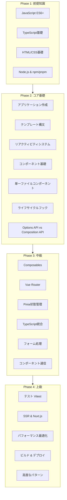
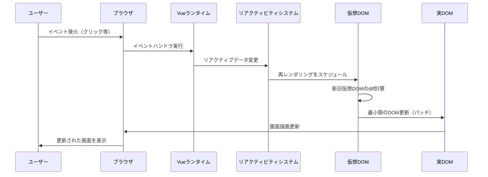
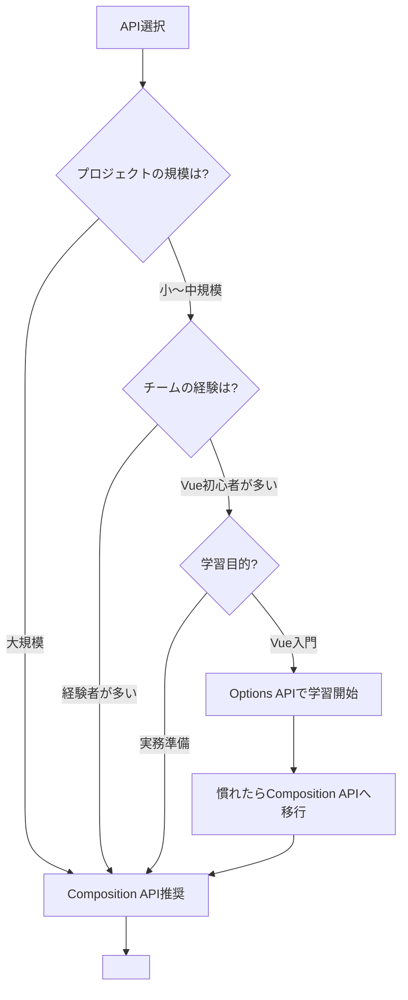
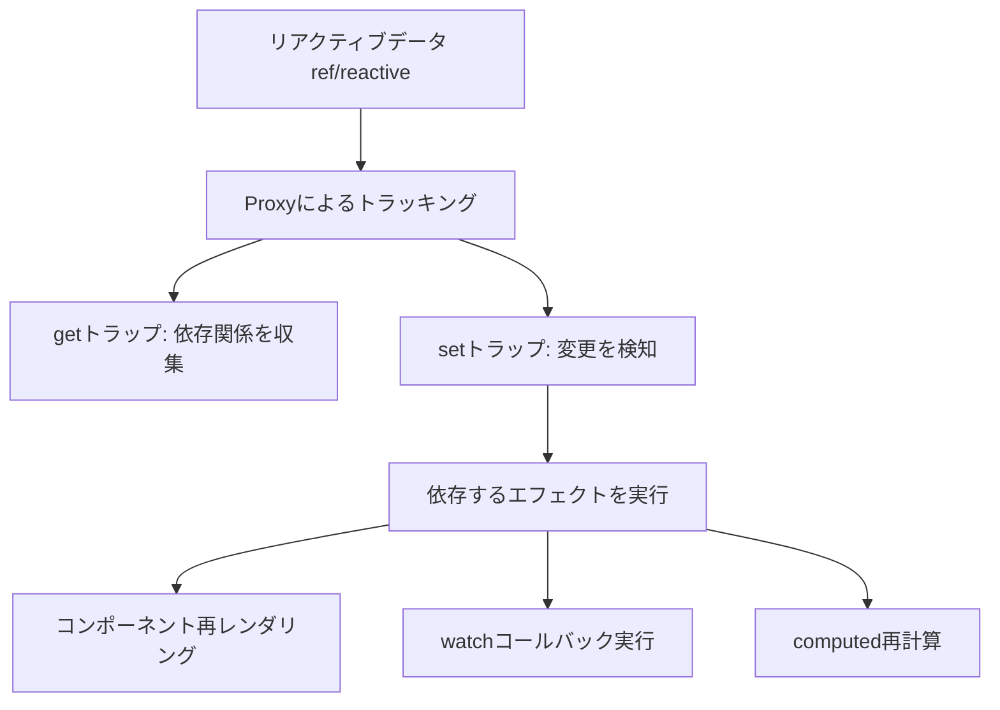
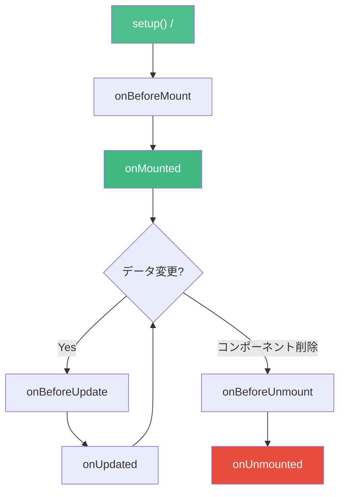
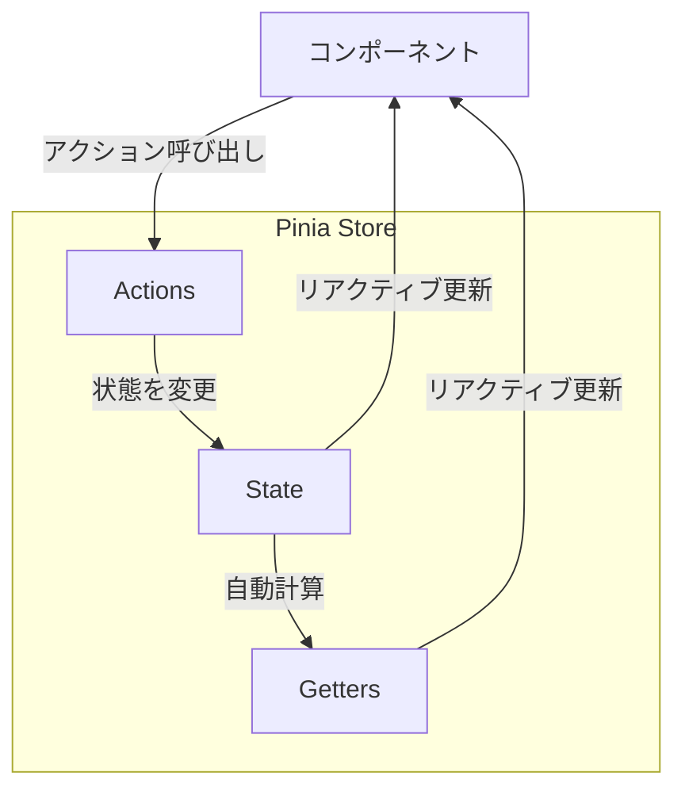

# Vue.js 学習ロードマップ

プログレッシブJavaScriptフレームワークVue.jsを体系的に学習するためのガイド。Vue 3のComposition API（`<script setup lang="ts">`）を中心に、基礎から実践的な開発スキルまで段階的に習得していく。

---

## 目次

1. [全体像：Vue.jsの学習フロー](#全体像vuejsの学習フロー)
1. [Phase 1: 基礎準備と前提知識（1〜2週間）](#phase-1-基礎準備と前提知識12週間)
1. [Phase 2: Vue.jsコア基礎（3〜4週間）](#phase-2-vuejsコア基礎34週間)
1. [Phase 3: 中級トピック（4〜5週間）](#phase-3-中級トピック45週間)
1. [Phase 4: 上級トピック（3〜4週間）](#phase-4-上級トピック34週間)
1. [学習リソース](#学習リソース)
1. [学習のコツ](#学習のコツ)
1. [チェックリスト活用法](#チェックリスト活用法)

---

## 全体像：Vue.jsの学習フロー



### Vue.jsレンダリングライフサイクル

Vue.jsがUIを更新する流れを理解することで、リアクティビティシステムの役割が明確になる。



### Options API vs Composition API 判断フロー



---

## Phase 1: 基礎準備と前提知識（1〜2週間）

Vue.jsを効果的に学ぶために必要な前提知識を固める。

### 1.1 JavaScript ES6+ 基礎

Vue.jsはモダンJavaScriptの機能を多用する。以下の機能は必須。

#### アロー関数

```typescript
// 従来の関数
function greet(name: string): string {
  return `こんにちは、${name}さん！`;
}

// アロー関数
const greet = (name: string): string => `こんにちは、${name}さん！`;

// Vue.jsでの使用（computedやメソッド内）
const fullName = computed(() => `${firstName.value} ${lastName.value}`);
```

#### 分割代入

```typescript
// オブジェクトの分割代入
const user = { name: '田中', age: 30, email: 'tanaka@example.com' };
const { name, email } = user;

// Propsの分割代入（Composition APIで使用）
const { title, count = 0 } = defineProps<{
  title: string;
  count?: number;
}>();

// 配列の分割代入
const [first, second, ...rest] = [1, 2, 3, 4, 5];
// first = 1, second = 2, rest = [3, 4, 5]
```

#### async/await

```typescript
// Promise
const fetchUser = (id: number): Promise<User> => {
  return fetch(`/api/users/${id}`)
    .then(res => res.json());
};

// async-await（推奨）
const fetchUser = async (id: number): Promise<User> => {
  const res = await fetch(`/api/users/${id}`);
  return res.json();
};

// Vue.jsでの使用（composable内）
const useFetch = async <T>(url: string): Promise<T> => {
  const res = await fetch(url);
  if (!res.ok) throw new Error('Fetch failed');
  return res.json();
};
```

#### ESモジュール

```typescript
// 名前付きエクスポート
export const API_URL = 'https://api.example.com';
export function formatDate(date: Date): string {
  return date.toLocaleDateString('ja-JP');
}

// デフォルトエクスポート
export default function createApp() {
  // ...
}

// インポート
import { API_URL, formatDate } from './utils';
import createApp from './app';

// Vue.jsでは頻繁に使用
import { ref, computed, onMounted } from 'vue';
import { useRouter } from 'vue-router';
import { useCounterStore } from '@/stores/counter';
```

#### 学習目標

- [ ] アロー関数を使ってコールバックやcomputedを定義できる
- [ ] 分割代入でPropsやオブジェクトを展開できる
- [ ] async/awaitを使ってデータフェッチができる
- [ ] ESモジュールのimport/exportを理解している

---

### 1.2 TypeScript基礎

Vue 3はTypeScriptをファーストクラスでサポート。型安全な開発が推奨される。

#### 基本的な型注釈

```typescript
// プリミティブ型
const name: string = '田中太郎';
const age: number = 30;
const isActive: boolean = true;

// 配列
const numbers: number[] = [1, 2, 3];
const names: Array<string> = ['田中', '山田'];

// オブジェクト
const user: { name: string; age: number } = {
  name: '田中',
  age: 30,
};
```

#### インターフェースと型エイリアス

```typescript
// インターフェース（拡張可能、オブジェクト向き）
interface User {
  id: number;
  name: string;
  email: string;
  createdAt: Date;
}

// 型エイリアス（ユニオン型などに便利）
type Status = 'pending' | 'active' | 'inactive';
type UserId = number | string;

// Vue.jsのPropsで使用
interface ButtonProps {
  label: string;
  variant?: 'primary' | 'secondary';
  disabled?: boolean;
}
```

#### ジェネリクス

```typescript
// 基本的なジェネリクス
function identity<T>(arg: T): T {
  return arg;
}

// APIレスポンスの型定義
interface ApiResponse<T> {
  data: T;
  status: number;
  message: string;
}

// Vue.jsのref型付け
import { ref, type Ref } from 'vue';
const count: Ref<number> = ref(0);
const user = ref<User | null>(null);
```

#### 学習目標

- [ ] 基本的な型注釈ができる
- [ ] インターフェースでPropsの型を定義できる
- [ ] ジェネリクスの基本概念を理解している
- [ ] refやreactiveの型付けを理解している

---

### 1.3 HTML/CSS基礎

#### セマンティックHTML

```html
<!-- 意味のある要素を使う -->
<header>
  <nav>
    <ul>
      <li><a href="/">ホーム</a></li>
      <li><a href="/about">概要</a></li>
    </ul>
  </nav>
</header>

<main>
  <article>
    <h1>記事タイトル</h1>
    <section>
      <h2>セクション1</h2>
      <p>本文...</p>
    </section>
  </article>
  <aside>サイドバー</aside>
</main>

<footer>
  <p>&copy; 2024 My App</p>
</footer>
```

なぜセマンティックHTMLが重要か：

- **アクセシビリティ**: スクリーンリーダーが構造を正しく解釈
- **SEO**: 検索エンジンがコンテンツの意味を理解
- **保守性**: コードの意図が明確になる

#### Flexbox / Grid

```css
/* Flexbox: 1次元レイアウト */
.nav {
  display: flex;
  justify-content: space-between;
  align-items: center;
  gap: 16px;
}

/* Grid: 2次元レイアウト */
.dashboard {
  display: grid;
  grid-template-columns: 250px 1fr;
  grid-template-rows: auto 1fr auto;
  gap: 16px;
  min-height: 100vh;
}
```

| レイアウト | 用途 | 特徴 |
|-----------|------|------|
| Flexbox | ナビバー、カード並び | 1方向の配置に強い |
| Grid | ページ全体、ダッシュボード | 2次元の配置に強い |

#### 学習目標

- [ ] セマンティックHTMLタグを適切に使える
- [ ] Flexboxで1次元レイアウトを組める
- [ ] CSS Gridで2次元レイアウトを組める

---

### 1.4 Node.js & パッケージ管理

#### Node.jsの基礎

```bash
# バージョン確認
node -v  # v20.x.x 推奨

# REPLで実行
node
> console.log('Hello')
```

#### npm / pnpm

```bash
# プロジェクト初期化
npm init -y

# パッケージインストール
npm install vue
npm install vue-router pinia

# 開発依存
npm install -D typescript @vue/tsconfig vite

# スクリプト実行
npm run dev
npm run build
npm run preview

# pnpm（推奨：高速、ディスク効率的）
pnpm install
pnpm add vue vue-router pinia
pnpm dev
```

#### package.jsonの構造

```json
{
  "name": "my-vue-app",
  "version": "0.1.0",
  "type": "module",
  "scripts": {
    "dev": "vite",
    "build": "vue-tsc && vite build",
    "preview": "vite preview"
  },
  "dependencies": {
    "vue": "^3.5.x",
    "vue-router": "^4.x",
    "pinia": "^2.x"
  },
  "devDependencies": {
    "@vue/tsconfig": "^0.5.x",
    "typescript": "~5.x",
    "vite": "^6.x",
    "@vitejs/plugin-vue": "^5.x",
    "vue-tsc": "^2.x"
  }
}
```

#### 学習目標

- [ ] Node.jsとnpm/pnpmのバージョンを確認できる
- [ ] パッケージのインストールと管理ができる
- [ ] package.jsonの基本構造を理解している

---

### 1.5 開発環境セットアップ

#### 推奨環境

| ツール | 説明 |
|--------|------|
| Node.js 20+ | Vue 3の推奨バージョン |
| pnpm | 高速なパッケージマネージャー |
| VS Code | 推奨エディタ |
| Volar | Vue公式VS Code拡張機能 |

#### Vue 3プロジェクト作成

```bash
# 対話式で作成（推奨）
npm create vue@latest my-app

# 質問への回答例
# ✔ Add TypeScript? → Yes
# ✔ Add JSX Support? → No
# ✔ Add Vue Router? → Yes
# ✔ Add Pinia? → Yes
# ✔ Add Vitest? → Yes
# ✔ Add ESLint? → Yes
# ✔ Add Prettier? → Yes

# 起動
cd my-app
npm install
npm run dev
# http://localhost:5173 でアクセス
```

#### プロジェクト構造

```
my-app/
├── src/
│   ├── App.vue            # ルートコンポーネント
│   ├── main.ts            # エントリーポイント
│   ├── assets/            # 静的アセット
│   ├── components/        # 共通コンポーネント
│   ├── composables/       # Composables（カスタムフック）
│   ├── router/            # Vue Routerの設定
│   │   └── index.ts
│   ├── stores/            # Piniaストア
│   │   └── counter.ts
│   └── views/             # ページコンポーネント
│       ├── HomeView.vue
│       └── AboutView.vue
├── public/                # 静的ファイル
├── index.html             # HTMLテンプレート
├── package.json
├── tsconfig.json
├── vite.config.ts
└── env.d.ts               # 型定義
```

#### VS Code推奨拡張機能

| 拡張機能 | 説明 |
|---------|------|
| Vue - Official（Volar） | Vue 3公式サポート |
| TypeScript Vue Plugin | TypeScript統合 |
| Prettier | コードフォーマット |
| ESLint | Linting |
| Auto Rename Tag | タグ自動リネーム |

#### 学習目標

- [ ] `npm create vue@latest`でプロジェクトを作成できる
- [ ] 開発サーバーを起動してブラウザで確認できる
- [ ] プロジェクト構造を理解している

---

## Phase 2: Vue.jsコア基礎（3〜4週間）

Vue.jsの基本的な機能を習得する。

### 2.1 Vue 3アプリケーション作成

#### エントリーポイント

```typescript
// src/main.ts
import { createApp } from 'vue';
import { createPinia } from 'pinia';
import App from './App.vue';
import router from './router';

const app = createApp(App);

app.use(createPinia()); // 状態管理
app.use(router);        // ルーティング

app.mount('#app');
```

```html
<!-- index.html -->
<!DOCTYPE html>
<html lang="ja">
  <head>
    <meta charset="UTF-8" />
    <meta name="viewport" content="width=device-width, initial-scale=1.0" />
    <title>My Vue App</title>
  </head>
  <body>
    <div id="app"></div>
    <script type="module" src="/src/main.ts"></script>
  </body>
</html>
```

#### ルートコンポーネント

```vue
<!-- src/App.vue -->
<script setup lang="ts">
import { RouterView, RouterLink } from 'vue-router';
</script>

<template>
  <header>
    <nav>
      <RouterLink to="/">ホーム</RouterLink>
      <RouterLink to="/about">概要</RouterLink>
    </nav>
  </header>
  <main>
    <RouterView />
  </main>
</template>

<style scoped>
nav {
  display: flex;
  gap: 16px;
}
</style>
```

なぜcreateAppを使うのか：

- **インスタンス分離**: 複数のVueアプリを同一ページで安全に実行できる
- **プラグインスコープ**: use()で登録したプラグインがアプリ単位で管理される
- **Tree-shaking**: 使わない機能がバンドルに含まれない

#### 学習目標

- [ ] createAppでアプリケーションを初期化できる
- [ ] main.tsの役割を理解している
- [ ] プラグイン（Pinia、Router）の登録方法を理解している

---

### 2.2 テンプレート構文

#### テキスト展開（マスタッシュ構文）

```vue
<script setup lang="ts">
import { ref } from 'vue';

const message = ref('こんにちは、Vue!');
const rawHtml = ref('<span style="color: red">赤いテキスト</span>');
</script>

<template>
  <!-- テキスト展開 -->
  <p>{{ message }}</p>

  <!-- JavaScript式も使用可能 -->
  <p>{{ message.split('').reverse().join('') }}</p>

  <!-- HTMLをそのまま出力（XSSに注意） -->
  <p v-html="rawHtml"></p>
</template>
```

#### ディレクティブ一覧

| ディレクティブ | 省略記法 | 用途 | 例 |
|--------------|---------|------|-----|
| `v-bind` | `:` | 属性バインディング | `:href="url"` |
| `v-on` | `@` | イベントリスナー | `@click="handler"` |
| `v-if` | - | 条件付きレンダリング | `v-if="isVisible"` |
| `v-else-if` | - | else if | `v-else-if="count > 0"` |
| `v-else` | - | else | `v-else` |
| `v-show` | - | 表示/非表示（CSS） | `v-show="isVisible"` |
| `v-for` | - | リストレンダリング | `v-for="item in items"` |
| `v-model` | - | 双方向バインディング | `v-model="name"` |
| `v-slot` | `#` | スロット | `#default="{ item }"` |

#### v-bind（属性バインディング）

```vue
<script setup lang="ts">
import { ref } from 'vue';

const imageUrl = ref('/images/logo.png');
const isDisabled = ref(true);
const buttonClass = ref('btn-primary');
const dynamicStyles = ref({
  color: 'red',
  fontSize: '16px',
});
</script>

<template>
  <!-- 基本 -->
  

  <!-- 動的属性 -->
  <button :disabled="isDisabled">送信</button>

  <!-- クラスバインディング -->
  <div :class="buttonClass">ボタン</div>
  <div :class="{ active: isActive, 'text-bold': isBold }">動的クラス</div>
  <div :class="['base-class', isActive ? 'active' : '']">配列形式</div>

  <!-- スタイルバインディング -->
  <div :style="dynamicStyles">スタイル付き</div>
  <div :style="{ color: textColor, fontSize: size + 'px' }">インライン</div>
</template>
```

#### v-if vs v-show

```vue
<script setup lang="ts">
import { ref } from 'vue';

const isVisible = ref(true);
</script>

<template>
  <!-- v-if: DOMから完全に削除/追加される -->
  <p v-if="isVisible">v-ifで表示</p>

  <!-- v-show: display: noneで切り替え -->
  <p v-show="isVisible">v-showで表示</p>
</template>
```

| 項目 | v-if | v-show |
|------|------|--------|
| 切り替えコスト | 高い（DOM追加/削除） | 低い（CSS切り替え） |
| 初期レンダリング | 条件がfalseなら描画しない | 常に描画 |
| 使いどころ | 切り替え頻度が低い | 頻繁に切り替える |

#### v-for（リストレンダリング）

```vue
<script setup lang="ts">
import { ref } from 'vue';

interface Todo {
  id: number;
  text: string;
  done: boolean;
}

const todos = ref<Todo[]>([
  { id: 1, text: 'Vue.jsを学ぶ', done: false },
  { id: 2, text: 'プロジェクトを作る', done: false },
  { id: 3, text: 'デプロイする', done: false },
]);
</script>

<template>
  <!-- keyは必須（パフォーマンスと正確な更新のため） -->
  <ul>
    <li v-for="todo in todos" :key="todo.id">
      {{ todo.text }} - {{ todo.done ? '完了' : '未完了' }}
    </li>
  </ul>

  <!-- インデックス付き -->
  <ul>
    <li v-for="(todo, index) in todos" :key="todo.id">
      {{ index + 1 }}. {{ todo.text }}
    </li>
  </ul>

  <!-- オブジェクトのループ -->
  <div v-for="(value, key) in { name: '田中', age: 30 }" :key="key">
    {{ key }}: {{ value }}
  </div>
</template>
```

なぜ`:key`が必要か：

- Vueが各要素を一意に識別し、効率的にDOMを更新するため
- keyがないと、要素の並び替えや削除時に予期しない動作が起きる
- **配列のインデックスをkeyにしない**（要素の追加・削除で不整合が起きるため）

#### v-model（双方向バインディング）

```vue
<script setup lang="ts">
import { ref } from 'vue';

const name = ref('');
const agreed = ref(false);
const selected = ref('');
const multiSelected = ref<string[]>([]);
</script>

<template>
  <!-- テキスト入力 -->
  <input v-model="name" placeholder="名前を入力" />
  <p>入力値: {{ name }}</p>

  <!-- チェックボックス -->
  <input type="checkbox" v-model="agreed" id="agree" />
  <label for="agree">同意する</label>

  <!-- セレクトボックス -->
  <select v-model="selected">
    <option disabled value="">選択してください</option>
    <option value="vue">Vue.js</option>
    <option value="react">React</option>
    <option value="angular">Angular</option>
  </select>

  <!-- 修飾子 -->
  <input v-model.trim="name" />      <!-- 前後の空白を除去 -->
  <input v-model.number="age" />      <!-- 数値に変換 -->
  <input v-model.lazy="name" />       <!-- changeイベントで同期 -->
</template>
```

#### v-on（イベントハンドリング）

```vue
<script setup lang="ts">
import { ref } from 'vue';

const count = ref(0);

const increment = (): void => {
  count.value++;
};

const handleSubmit = (event: Event): void => {
  event.preventDefault();
  console.log('送信');
};
</script>

<template>
  <!-- 基本 -->
  <button @click="increment">カウント: {{ count }}</button>

  <!-- インライン式 -->
  <button @click="count++">+1</button>

  <!-- イベント修飾子 -->
  <form @submit.prevent="handleSubmit">
    <button type="submit">送信</button>
  </form>

  <!-- キー修飾子 -->
  <input @keyup.enter="handleSubmit" />
  <input @keyup.escape="clearInput" />
</template>
```

| イベント修飾子 | 効果 |
|--------------|------|
| `.prevent` | `event.preventDefault()` |
| `.stop` | `event.stopPropagation()` |
| `.once` | 一度だけ発火 |
| `.self` | イベント対象が要素自身の時のみ |
| `.capture` | キャプチャモード |

#### 学習目標

- [ ] マスタッシュ構文でデータを表示できる
- [ ] v-bind（:）で属性を動的にバインドできる
- [ ] v-if/v-showで条件付きレンダリングができる
- [ ] v-forでリストをレンダリングし、keyを適切に設定できる
- [ ] v-modelで双方向バインディングができる
- [ ] v-on（@）でイベントをハンドリングできる

---

### 2.3 リアクティビティシステム

Vue 3のリアクティビティはComposition APIの中核。データの変更を追跡し、UIを自動更新する。

#### ref

```vue
<script setup lang="ts">
import { ref } from 'vue';

// プリミティブ値にはrefを使用
const count = ref(0);
const message = ref('Hello');
const isVisible = ref(true);

// .valueでアクセス（テンプレート内では不要）
const increment = (): void => {
  count.value++;
  console.log(count.value); // scriptではvalue必須
};
</script>

<template>
  <!-- テンプレート内では.valueは不要 -->
  <p>{{ count }}</p>
  <button @click="increment">+1</button>
</template>
```

#### reactive

```typescript
import { reactive } from 'vue';

// オブジェクトや配列にはreactiveを使用
const state = reactive({
  count: 0,
  user: {
    name: '田中',
    age: 30,
  },
  items: ['Vue', 'React', 'Angular'],
});

// .valueは不要（直接アクセス）
state.count++;
state.user.name = '山田';
state.items.push('Svelte');
```

#### ref vs reactive

| 項目 | ref | reactive |
|------|-----|----------|
| 対象 | すべての型 | オブジェクト/配列のみ |
| アクセス | `.value`が必要（scriptのみ） | 直接アクセス |
| 再代入 | 可能（`ref.value = 新値`） | 不可（プロパティ単位で更新） |
| 分割代入 | リアクティビティ維持 | リアクティビティが失われる |
| 推奨 | **デフォルトで使用** | 深いネストオブジェクト向き |

```typescript
// ❌ reactiveの分割代入はリアクティビティが失われる
const state = reactive({ count: 0 });
let { count } = state; // リアクティブではなくなる
count++; // UIは更新されない

// ✅ refなら安全
const count = ref(0);
count.value++; // UIが更新される

// ✅ reactiveでtoRefsを使う
import { toRefs } from 'vue';
const state = reactive({ count: 0, name: '田中' });
const { count, name } = toRefs(state); // リアクティブなrefに変換
count.value++; // UIが更新される
```

#### computed（算出プロパティ）

```vue
<script setup lang="ts">
import { ref, computed } from 'vue';

const firstName = ref('太郎');
const lastName = ref('田中');

// 読み取り専用computed
const fullName = computed(() => `${lastName.value} ${firstName.value}`);

// 書き込み可能なcomputed
const fullNameWritable = computed({
  get: () => `${lastName.value} ${firstName.value}`,
  set: (newValue: string) => {
    const [last, first] = newValue.split(' ');
    lastName.value = last;
    firstName.value = first;
  },
});

// フィルタリングの例
const todos = ref([
  { text: 'Vue.jsを学ぶ', done: true },
  { text: 'プロジェクトを作る', done: false },
]);

const activeTodos = computed(() =>
  todos.value.filter(todo => !todo.done)
);
</script>

<template>
  <p>{{ fullName }}</p>
  <p>未完了: {{ activeTodos.length }}件</p>
</template>
```

なぜcomputedを使うか（メソッドとの違い）：

- **キャッシュ**: 依存するリアクティブデータが変わらない限り再計算されない
- **メソッド**: 呼び出すたびに毎回実行される
- **パフォーマンス**: 重い計算にはcomputedが最適

#### watch / watchEffect

```vue
<script setup lang="ts">
import { ref, watch, watchEffect } from 'vue';

const searchQuery = ref('');
const userId = ref(1);

// 特定のソースを監視
watch(searchQuery, (newValue, oldValue) => {
  console.log(`検索クエリ: ${oldValue} → ${newValue}`);
  // API呼び出しなど副作用を実行
});

// 即座に実行 + 監視
watch(userId, async (newId) => {
  const user = await fetchUser(newId);
  console.log(user);
}, { immediate: true });

// 深い監視（ネストされたオブジェクト）
const state = ref({ nested: { count: 0 } });
watch(state, (newState) => {
  console.log('状態が変化:', newState);
}, { deep: true });

// 複数のソースを監視
watch([firstName, lastName], ([newFirst, newLast], [oldFirst, oldLast]) => {
  console.log(`名前が変更: ${oldFirst} ${oldLast} → ${newFirst} ${newLast}`);
});

// watchEffect: 依存関係を自動追跡
watchEffect(() => {
  // searchQuery.valueを読み取った時点で自動的に監視対象になる
  console.log(`検索: ${searchQuery.value}`);
  // 他のリアクティブ値も自動追跡
});
```

| 項目 | watch | watchEffect |
|------|-------|-------------|
| 監視対象 | 明示的に指定 | 自動追跡 |
| 前の値 | 取得可能 | 取得不可 |
| 遅延実行 | デフォルトで遅延 | 即座に実行 |
| 用途 | 特定の値の変化に反応 | 複数の値に依存する副作用 |

#### リアクティビティの仕組み



#### 学習目標

- [ ] refとreactiveの違いを説明できる
- [ ] computedでキャッシュされた算出値を定義できる
- [ ] watchで値の変化を監視し副作用を実行できる
- [ ] watchEffectの自動追跡を理解している

---

### 2.4 コンポーネント基礎

#### defineProps（Propsの受け取り）

```vue
<!-- components/UserCard.vue -->
<script setup lang="ts">
// 型ベースのProps定義（推奨）
interface Props {
  name: string;
  age: number;
  email?: string;       // オプショナル
  role?: 'admin' | 'user';
}

const props = withDefaults(defineProps<Props>(), {
  email: '未設定',
  role: 'user',
});

// propsの値にアクセス
console.log(props.name);
</script>

<template>
  <div class="user-card">
    <h3>{{ name }}</h3>
    <p>年齢: {{ age }}</p>
    <p>メール: {{ email }}</p>
    <span class="badge">{{ role }}</span>
  </div>
</template>
```

```vue
<!-- 親コンポーネントからの使用 -->
<template>
  <UserCard
    name="田中太郎"
    :age="30"
    email="tanaka@example.com"
    role="admin"
  />

  <!-- v-bindで一括渡し -->
  <UserCard v-bind="userProps" />
</template>
```

#### defineEmits（イベントの発火）

```vue
<!-- components/SearchBox.vue -->
<script setup lang="ts">
// 型ベースのEmit定義
const emit = defineEmits<{
  search: [query: string];
  clear: [];
  select: [id: number, name: string];
}>();

const handleSearch = (query: string): void => {
  emit('search', query);
};

const handleClear = (): void => {
  emit('clear');
};
</script>

<template>
  <div class="search-box">
    <input
      type="text"
      @input="handleSearch(($event.target as HTMLInputElement).value)"
      placeholder="検索..."
    />
    <button @click="handleClear">クリア</button>
  </div>
</template>
```

```vue
<!-- 親コンポーネント -->
<script setup lang="ts">
const onSearch = (query: string): void => {
  console.log('検索:', query);
};

const onClear = (): void => {
  console.log('クリア');
};
</script>

<template>
  <SearchBox @search="onSearch" @clear="onClear" />
</template>
```

#### Slots（スロット）

```vue
<!-- components/Card.vue -->
<script setup lang="ts">
interface Props {
  title: string;
}
defineProps<Props>();
</script>

<template>
  <div class="card">
    <!-- 名前付きスロット -->
    <header class="card-header">
      <slot name="header">
        <h3>{{ title }}</h3>
      </slot>
    </header>

    <!-- デフォルトスロット -->
    <div class="card-body">
      <slot>デフォルトコンテンツ</slot>
    </div>

    <!-- フッタースロット -->
    <footer class="card-footer">
      <slot name="footer" />
    </footer>
  </div>
</template>
```

```vue
<!-- 使用例 -->
<template>
  <Card title="ユーザー情報">
    <!-- デフォルトスロット -->
    <p>ユーザーの詳細情報がここに入ります</p>

    <!-- 名前付きスロット -->
    <template #header>
      <h2>カスタムヘッダー</h2>
    </template>

    <template #footer>
      <button>保存</button>
    </template>
  </Card>
</template>
```

#### スコープ付きスロット

```vue
<!-- components/DataList.vue -->
<script setup lang="ts" generic="T">
interface Props {
  items: T[];
}
defineProps<Props>();
</script>

<template>
  <ul>
    <li v-for="(item, index) in items" :key="index">
      <!-- 子から親にデータを渡す -->
      <slot :item="item" :index="index" />
    </li>
  </ul>
</template>
```

```vue
<!-- 使用例 -->
<script setup lang="ts">
interface User {
  id: number;
  name: string;
  email: string;
}

const users = ref<User[]>([
  { id: 1, name: '田中', email: 'tanaka@example.com' },
  { id: 2, name: '山田', email: 'yamada@example.com' },
]);
</script>

<template>
  <DataList :items="users">
    <template #default="{ item, index }">
      <span>{{ index + 1 }}. {{ item.name }} ({{ item.email }})</span>
    </template>
  </DataList>
</template>
```

#### 学習目標

- [ ] definePropsで型付きPropsを定義できる
- [ ] defineEmitsで型付きイベントを発火できる
- [ ] デフォルトスロット・名前付きスロットを使える
- [ ] スコープ付きスロットでデータを親に渡せる

---

### 2.5 単一ファイルコンポーネント（SFC）

#### SFCの構造

```vue
<!-- components/TodoItem.vue -->
<script setup lang="ts">
// ロジック（Composition API）
import { ref, computed } from 'vue';

interface Props {
  id: number;
  text: string;
  done: boolean;
}

const props = defineProps<Props>();
const emit = defineEmits<{
  toggle: [id: number];
  delete: [id: number];
}>();

const isEditing = ref(false);

const statusText = computed(() =>
  props.done ? '完了' : '未完了'
);
</script>

<template>
  <!-- テンプレート（HTML + Vue構文） -->
  <div class="todo-item" :class="{ done: done }">
    <input
      type="checkbox"
      :checked="done"
      @change="emit('toggle', id)"
    />
    <span>{{ text }}</span>
    <span class="status">{{ statusText }}</span>
    <button @click="emit('delete', id)" class="delete-btn">
      削除
    </button>
  </div>
</template>

<style scoped>
/* スコープ付きCSS（このコンポーネントにのみ適用） */
.todo-item {
  display: flex;
  align-items: center;
  gap: 8px;
  padding: 8px;
  border-bottom: 1px solid #eee;
}

.todo-item.done {
  opacity: 0.5;
  text-decoration: line-through;
}

.delete-btn {
  margin-left: auto;
  color: red;
}
</style>
```

#### `<script setup>` vs 通常の `<script>`

```vue
<!-- ✅ <script setup>（推奨） -->
<script setup lang="ts">
import { ref } from 'vue';
import ChildComponent from './ChildComponent.vue';

const count = ref(0);
// インポートしたものが自動的にテンプレートで使用可能
</script>

<!-- 通常のscript（必要な場合のみ） -->
<script lang="ts">
export default {
  // inheritAttrs, name など setup外の設定が必要な場合
  inheritAttrs: false,
  name: 'MyComponent',
};
</script>
```

`<script setup>`の利点：

- **ボイラープレート削減**: `export default`やreturnが不要
- **自動公開**: import・変数が自動的にテンプレートで使用可能
- **パフォーマンス**: コンパイル時に最適化される
- **TypeScript推論**: より良い型推論が得られる

#### `<style scoped>` と CSS設計

```vue
<style scoped>
/* scopedはこのコンポーネントの要素にのみ適用 */
.button {
  background: blue;
}

/* 子コンポーネントのルート要素に影響を与える */
.parent :deep(.child-class) {
  color: red;
}

/* スロットコンテンツに影響を与える */
.wrapper :slotted(.slot-class) {
  font-weight: bold;
}

/* グローバルスタイル（scopedの中でも可能） */
:global(.global-class) {
  margin: 0;
}
</style>

<!-- CSS Modulesも使用可能 -->
<style module>
.red {
  color: red;
}
</style>

<template>
  <p :class="$style.red">赤いテキスト</p>
</template>
```

#### 学習目標

- [ ] SFCの3つのブロック（script/template/style）を理解している
- [ ] `<script setup lang="ts">`を使ってコンポーネントを書ける
- [ ] `<style scoped>`のスコープメカニズムを理解している
- [ ] :deep()セレクタの使いどころを把握している

---

### 2.6 ライフサイクルフック

#### ライフサイクルの流れ



#### 主要なライフサイクルフック

```vue
<script setup lang="ts">
import {
  onBeforeMount,
  onMounted,
  onBeforeUpdate,
  onUpdated,
  onBeforeUnmount,
  onUnmounted,
} from 'vue';

// セットアップフェーズ（<script setup>自体がsetupに相当）
console.log('setup: コンポーネント初期化');

onBeforeMount(() => {
  console.log('onBeforeMount: DOM挿入前');
});

onMounted(() => {
  console.log('onMounted: DOM挿入後');
  // DOMアクセスが安全に行える
  // API呼び出し、タイマー設定など
});

onBeforeUpdate(() => {
  console.log('onBeforeUpdate: DOM更新前');
});

onUpdated(() => {
  console.log('onUpdated: DOM更新後');
});

onBeforeUnmount(() => {
  console.log('onBeforeUnmount: コンポーネント削除前');
  // クリーンアップ処理
});

onUnmounted(() => {
  console.log('onUnmounted: コンポーネント削除後');
  // タイマー解除、イベントリスナー解除など
});
</script>
```

#### Options APIとの対応表

| Options API | Composition API | 用途 |
|-------------|----------------|------|
| `beforeCreate` | setup自体 | 初期化前 |
| `created` | setup自体 | 初期化後 |
| `beforeMount` | `onBeforeMount` | DOM挿入前 |
| `mounted` | `onMounted` | DOM挿入後 |
| `beforeUpdate` | `onBeforeUpdate` | DOM更新前 |
| `updated` | `onUpdated` | DOM更新後 |
| `beforeUnmount` | `onBeforeUnmount` | 削除前 |
| `unmounted` | `onUnmounted` | 削除後 |

#### よくある使用例

```vue
<script setup lang="ts">
import { ref, onMounted, onUnmounted } from 'vue';

// DOM操作（onMountedで安全にアクセス）
const chartRef = ref<HTMLCanvasElement | null>(null);

onMounted(() => {
  if (chartRef.value) {
    // チャートライブラリの初期化など
    initChart(chartRef.value);
  }
});

// タイマーのクリーンアップ
const timer = ref<ReturnType<typeof setInterval> | null>(null);

onMounted(() => {
  timer.value = setInterval(() => {
    console.log('tick');
  }, 1000);
});

onUnmounted(() => {
  if (timer.value) {
    clearInterval(timer.value);
  }
});

// イベントリスナーのクリーンアップ
const handleResize = (): void => {
  console.log('ウィンドウリサイズ');
};

onMounted(() => {
  window.addEventListener('resize', handleResize);
});

onUnmounted(() => {
  window.removeEventListener('resize', handleResize);
});
</script>

<template>
  <canvas ref="chartRef"></canvas>
</template>
```

#### 学習目標

- [ ] ライフサイクルの流れを説明できる
- [ ] onMountedでDOM操作やAPI呼び出しができる
- [ ] onUnmountedでクリーンアップ処理ができる
- [ ] Options APIとComposition APIの対応を理解している

---

### 2.7 Options API vs Composition API

同じカウンターコンポーネントを両方のAPIで実装して比較する。

#### Options API

```vue
<script lang="ts">
import { defineComponent } from 'vue';

export default defineComponent({
  name: 'CounterOptions',

  props: {
    initialCount: {
      type: Number,
      default: 0,
    },
  },

  emits: ['count-changed'],

  data() {
    return {
      count: this.initialCount,
      history: [] as number[],
    };
  },

  computed: {
    doubleCount(): number {
      return this.count * 2;
    },
    isPositive(): boolean {
      return this.count > 0;
    },
  },

  watch: {
    count(newVal: number) {
      this.history.push(newVal);
      this.$emit('count-changed', newVal);
    },
  },

  mounted() {
    console.log('カウンターがマウントされました');
  },

  methods: {
    increment(): void {
      this.count++;
    },
    decrement(): void {
      this.count--;
    },
    reset(): void {
      this.count = 0;
      this.history = [];
    },
  },
});
</script>
```

#### Composition API（`<script setup>`）

```vue
<script setup lang="ts">
import { ref, computed, watch, onMounted } from 'vue';

// Props
interface Props {
  initialCount?: number;
}
const props = withDefaults(defineProps<Props>(), {
  initialCount: 0,
});

// Emits
const emit = defineEmits<{
  'count-changed': [count: number];
}>();

// リアクティブ状態
const count = ref(props.initialCount);
const history = ref<number[]>([]);

// 算出プロパティ
const doubleCount = computed(() => count.value * 2);
const isPositive = computed(() => count.value > 0);

// ウォッチャー
watch(count, (newVal) => {
  history.value.push(newVal);
  emit('count-changed', newVal);
});

// ライフサイクル
onMounted(() => {
  console.log('カウンターがマウントされました');
});

// メソッド
const increment = (): void => {
  count.value++;
};

const decrement = (): void => {
  count.value--;
};

const reset = (): void => {
  count.value = 0;
  history.value = [];
};
</script>
```

#### 比較

| 観点 | Options API | Composition API |
|------|-------------|----------------|
| コード構成 | オプション（data, methods等）でグループ化 | 論理的な関心事でグループ化 |
| 再利用 | Mixins（問題あり） | Composables（推奨） |
| TypeScript | やや冗長 | 自然な型推論 |
| 学習曲線 | 低い | やや高い |
| 大規模開発 | 機能が分散しがち | 関連コードをまとめやすい |
| 推奨 | 既存プロジェクト保守 | **新規プロジェクト** |

なぜComposition APIが推奨か：

- **ロジックの再利用**: Composablesで簡潔に共有できる（Mixinsの名前衝突問題を解決）
- **TypeScript親和性**: 型推論がスムーズ
- **スケーラビリティ**: 関連するロジックをまとめて管理できる
- **Tree-shaking**: 使わない機能がバンドルから除外される

#### 学習目標

- [ ] Options APIとComposition APIの違いを説明できる
- [ ] 同じ機能を両方のAPIで実装できる
- [ ] Composition APIの利点を3つ挙げられる
- [ ] 新規プロジェクトでComposition APIを選択できる

---

## Phase 3: 中級トピック（4〜5週間）

より実践的な機能を習得する。

### 3.1 Composition API深掘り & Composables

#### Composablesとは

Composablesは、Composition APIを使ってロジックを再利用可能な関数に切り出すパターン。Reactのカスタムフックに相当する。

#### useFetch（データフェッチComposable）

```typescript
// composables/useFetch.ts
import { ref, watchEffect, type Ref } from 'vue';

interface UseFetchReturn<T> {
  data: Ref<T | null>;
  error: Ref<string | null>;
  isLoading: Ref<boolean>;
  refetch: () => Promise<void>;
}

export function useFetch<T>(url: Ref<string> | string): UseFetchReturn<T> {
  const data = ref<T | null>(null) as Ref<T | null>;
  const error = ref<string | null>(null);
  const isLoading = ref(false);

  const fetchData = async (): Promise<void> => {
    isLoading.value = true;
    error.value = null;

    try {
      const urlValue = typeof url === 'string' ? url : url.value;
      const res = await fetch(urlValue);
      if (!res.ok) throw new Error(`HTTP ${res.status}`);
      data.value = await res.json();
    } catch (e) {
      error.value = e instanceof Error ? e.message : '不明なエラー';
    } finally {
      isLoading.value = false;
    }
  };

  // URLがリアクティブなら変更時に自動フェッチ
  if (typeof url !== 'string') {
    watchEffect(() => {
      fetchData();
    });
  } else {
    fetchData();
  }

  return { data, error, isLoading, refetch: fetchData };
}
```

```vue
<!-- 使用例 -->
<script setup lang="ts">
import { useFetch } from '@/composables/useFetch';

interface User {
  id: number;
  name: string;
  email: string;
}

const { data: users, error, isLoading } = useFetch<User[]>('/api/users');
</script>

<template>
  <div v-if="isLoading">読み込み中...</div>
  <div v-else-if="error">エラー: {{ error }}</div>
  <ul v-else>
    <li v-for="user in users" :key="user.id">{{ user.name }}</li>
  </ul>
</template>
```

#### useLocalStorage（ローカルストレージComposable）

```typescript
// composables/useLocalStorage.ts
import { ref, watch, type Ref } from 'vue';

export function useLocalStorage<T>(key: string, defaultValue: T): Ref<T> {
  const stored = localStorage.getItem(key);
  const data = ref<T>(
    stored ? JSON.parse(stored) : defaultValue
  ) as Ref<T>;

  watch(data, (newValue) => {
    localStorage.setItem(key, JSON.stringify(newValue));
  }, { deep: true });

  return data;
}
```

```vue
<script setup lang="ts">
import { useLocalStorage } from '@/composables/useLocalStorage';

const theme = useLocalStorage('theme', 'light');
const settings = useLocalStorage('settings', { fontSize: 16, lang: 'ja' });
</script>

<template>
  <button @click="theme = theme === 'light' ? 'dark' : 'light'">
    テーマ切替: {{ theme }}
  </button>
</template>
```

#### useEventListener

```typescript
// composables/useEventListener.ts
import { onMounted, onUnmounted } from 'vue';

export function useEventListener<K extends keyof WindowEventMap>(
  target: EventTarget,
  event: K,
  handler: (e: WindowEventMap[K]) => void
): void {
  onMounted(() => {
    target.addEventListener(event, handler as EventListener);
  });

  onUnmounted(() => {
    target.removeEventListener(event, handler as EventListener);
  });
}
```

```vue
<script setup lang="ts">
import { ref } from 'vue';
import { useEventListener } from '@/composables/useEventListener';

const mouseX = ref(0);
const mouseY = ref(0);

useEventListener(window, 'mousemove', (e) => {
  mouseX.value = e.clientX;
  mouseY.value = e.clientY;
});
</script>

<template>
  <p>マウス位置: ({{ mouseX }}, {{ mouseY }})</p>
</template>
```

#### Composablesの命名規則

- **ファイル名**: `use` + 機能名（例: `useFetch.ts`、`useAuth.ts`）
- **関数名**: `use` + 機能名（例: `useFetch()`、`useAuth()`）
- **配置**: `src/composables/` ディレクトリ

#### 学習目標

- [ ] Composablesの概念と利点を説明できる
- [ ] カスタムComposableを作成できる
- [ ] Composableで状態とロジックを再利用できる
- [ ] 命名規則（use〜）を理解している

---

### 3.2 Vue Router

#### 基本的なルーター設定

```typescript
// router/index.ts
import { createRouter, createWebHistory, type RouteRecordRaw } from 'vue-router';

const routes: RouteRecordRaw[] = [
  {
    path: '/',
    name: 'home',
    component: () => import('@/views/HomeView.vue'),
  },
  {
    path: '/about',
    name: 'about',
    component: () => import('@/views/AboutView.vue'),
  },
  {
    path: '/users/:id',
    name: 'user-detail',
    component: () => import('@/views/UserDetailView.vue'),
    props: true, // paramsをpropsとして渡す
  },
  {
    path: '/:pathMatch(.*)*',
    name: 'not-found',
    component: () => import('@/views/NotFoundView.vue'),
  },
];

const router = createRouter({
  history: createWebHistory(import.meta.env.BASE_URL),
  routes,
});

export default router;
```

#### 動的ルート

```vue
<!-- views/UserDetailView.vue -->
<script setup lang="ts">
import { useRoute, useRouter } from 'vue-router';
import { ref, watch } from 'vue';

// 方法1: useRouteで取得
const route = useRoute();
const router = useRouter();

const userId = ref(route.params.id as string);

// パラメータの変更を監視
watch(() => route.params.id, (newId) => {
  userId.value = newId as string;
  // データの再フェッチなど
});

// プログラマティックナビゲーション
const goBack = (): void => {
  router.back();
};

const goToUser = (id: number): void => {
  router.push({ name: 'user-detail', params: { id } });
  // または router.push(`/users/${id}`);
};
</script>

<template>
  <div>
    <h1>ユーザー ID: {{ userId }}</h1>
    <button @click="goBack">戻る</button>
  </div>
</template>
```

```vue
<!-- 方法2: propsで受け取る（推奨） -->
<script setup lang="ts">
interface Props {
  id: string;
}
const props = defineProps<Props>();
</script>

<template>
  <h1>ユーザー ID: {{ id }}</h1>
</template>
```

#### ナビゲーションガード

```typescript
// router/index.ts
import { useAuthStore } from '@/stores/auth';

// グローバルガード
router.beforeEach((to, from) => {
  const authStore = useAuthStore();

  // 認証が必要なルートへのアクセスチェック
  if (to.meta.requiresAuth && !authStore.isAuthenticated) {
    return { name: 'login', query: { redirect: to.fullPath } };
  }

  // ログイン済みユーザーがログインページにアクセス
  if (to.name === 'login' && authStore.isAuthenticated) {
    return { name: 'home' };
  }
});

// ルートにメタ情報を追加
const routes: RouteRecordRaw[] = [
  {
    path: '/dashboard',
    name: 'dashboard',
    component: () => import('@/views/DashboardView.vue'),
    meta: { requiresAuth: true },
  },
  {
    path: '/login',
    name: 'login',
    component: () => import('@/views/LoginView.vue'),
  },
];
```

#### 遅延読み込み（コード分割）

```typescript
// 動的インポートでルート単位のコード分割
const routes: RouteRecordRaw[] = [
  {
    path: '/admin',
    component: () => import('@/views/AdminLayout.vue'),
    children: [
      {
        path: '',
        component: () => import('@/views/admin/DashboardView.vue'),
      },
      {
        path: 'users',
        component: () => import('@/views/admin/UsersView.vue'),
      },
    ],
  },
];
```

なぜ遅延読み込みを使うか：

- **初期バンドルサイズ削減**: 各ルートのコードが別チャンクに分割
- **初期表示速度向上**: 必要な時にだけコンポーネントをロード

#### ネストされたルート

```typescript
const routes: RouteRecordRaw[] = [
  {
    path: '/settings',
    component: () => import('@/views/SettingsLayout.vue'),
    children: [
      {
        path: '',
        redirect: '/settings/profile',
      },
      {
        path: 'profile',
        component: () => import('@/views/settings/ProfileView.vue'),
      },
      {
        path: 'account',
        component: () => import('@/views/settings/AccountView.vue'),
      },
      {
        path: 'notifications',
        component: () => import('@/views/settings/NotificationsView.vue'),
      },
    ],
  },
];
```

```vue
<!-- views/SettingsLayout.vue -->
<template>
  <div class="settings-layout">
    <nav class="settings-nav">
      <RouterLink to="/settings/profile">プロフィール</RouterLink>
      <RouterLink to="/settings/account">アカウント</RouterLink>
      <RouterLink to="/settings/notifications">通知</RouterLink>
    </nav>
    <main class="settings-content">
      <RouterView />
    </main>
  </div>
</template>
```

#### 学習目標

- [ ] ルーター設定を定義できる
- [ ] 動的ルートでパラメータを受け取れる
- [ ] ナビゲーションガードで認証チェックを実装できる
- [ ] 遅延読み込みでコード分割ができる
- [ ] ネストされたルートを構築できる

---

### 3.3 Pinia状態管理

Vue 3公式推奨の状態管理ライブラリ。Vuexの後継。

#### ストアの定義

```typescript
// stores/counter.ts
import { defineStore } from 'pinia';
import { ref, computed } from 'vue';

// Setup Store（Composition API風、推奨）
export const useCounterStore = defineStore('counter', () => {
  // state
  const count = ref(0);
  const history = ref<number[]>([]);

  // getters
  const doubleCount = computed(() => count.value * 2);
  const isPositive = computed(() => count.value > 0);

  // actions
  const increment = (): void => {
    count.value++;
    history.value.push(count.value);
  };

  const decrement = (): void => {
    count.value--;
    history.value.push(count.value);
  };

  const reset = (): void => {
    count.value = 0;
    history.value = [];
  };

  return { count, history, doubleCount, isPositive, increment, decrement, reset };
});
```

#### ストアの使用

```vue
<script setup lang="ts">
import { useCounterStore } from '@/stores/counter';
import { storeToRefs } from 'pinia';

const counterStore = useCounterStore();

// storeToRefsでリアクティブな参照を取得（リアクティビティを維持）
const { count, doubleCount, isPositive } = storeToRefs(counterStore);

// actionsは直接分割代入OK
const { increment, decrement, reset } = counterStore;
</script>

<template>
  <div>
    <p>カウント: {{ count }}</p>
    <p>2倍: {{ doubleCount }}</p>
    <p>正の数?: {{ isPositive }}</p>
    <button @click="increment">+1</button>
    <button @click="decrement">-1</button>
    <button @click="reset">リセット</button>
  </div>
</template>
```

#### 実践的なストア（認証）

```typescript
// stores/auth.ts
import { defineStore } from 'pinia';
import { ref, computed } from 'vue';
import { useRouter } from 'vue-router';

interface User {
  id: number;
  name: string;
  email: string;
  role: 'admin' | 'user';
}

export const useAuthStore = defineStore('auth', () => {
  const router = useRouter();
  const user = ref<User | null>(null);
  const token = ref<string | null>(localStorage.getItem('token'));

  const isAuthenticated = computed(() => !!token.value);
  const isAdmin = computed(() => user.value?.role === 'admin');

  const login = async (email: string, password: string): Promise<void> => {
    const res = await fetch('/api/auth/login', {
      method: 'POST',
      headers: { 'Content-Type': 'application/json' },
      body: JSON.stringify({ email, password }),
    });

    if (!res.ok) throw new Error('ログインに失敗しました');

    const data = await res.json();
    token.value = data.token;
    user.value = data.user;
    localStorage.setItem('token', data.token);
  };

  const logout = (): void => {
    user.value = null;
    token.value = null;
    localStorage.removeItem('token');
    router.push('/login');
  };

  const fetchUser = async (): Promise<void> => {
    if (!token.value) return;

    const res = await fetch('/api/auth/me', {
      headers: { Authorization: `Bearer ${token.value}` },
    });

    if (res.ok) {
      user.value = await res.json();
    } else {
      logout();
    }
  };

  return { user, token, isAuthenticated, isAdmin, login, logout, fetchUser };
});
```

#### Piniaデータフロー



なぜPiniaか（Vuexとの比較）：

| 項目 | Pinia | Vuex |
|------|-------|------|
| TypeScript | ネイティブサポート | 追加設定が必要 |
| Mutations | 不要（actionsで直接変更） | 必須 |
| モジュール | 各ストアが独立 | ネストされたモジュール |
| DevTools | 対応 | 対応 |
| 重さ | 軽量（~1.5KB） | やや重い |
| API | Composition API風 | 独自のパターン |

#### 学習目標

- [ ] defineStoreでストアを定義できる
- [ ] state / getters / actionsの役割を説明できる
- [ ] storeToRefsでリアクティブに参照を取得できる
- [ ] 実用的なストア（認証など）を構築できる

---

### 3.4 TypeScript統合

#### 型付きProps / Emits

```vue
<script setup lang="ts">
// 型ベースのProps（推奨）
interface Props {
  title: string;
  count?: number;
  items: string[];
  status: 'active' | 'inactive';
  user: {
    name: string;
    email: string;
  };
}

const props = withDefaults(defineProps<Props>(), {
  count: 0,
  status: 'active',
});

// 型ベースのEmits
const emit = defineEmits<{
  update: [value: string];
  delete: [id: number];
  'status-change': [status: 'active' | 'inactive'];
}>();
</script>
```

#### テンプレート参照の型付け

```vue
<script setup lang="ts">
import { ref, onMounted } from 'vue';

// DOM要素の型付け
const inputRef = ref<HTMLInputElement | null>(null);

// コンポーネント参照の型付け
import ChildComponent from './ChildComponent.vue';
const childRef = ref<InstanceType<typeof ChildComponent> | null>(null);

onMounted(() => {
  inputRef.value?.focus();
  childRef.value?.someMethod();
});
</script>

<template>
  <input ref="inputRef" />
  <ChildComponent ref="childRef" />
</template>
```

#### ジェネリックコンポーネント

```vue
<!-- components/GenericList.vue -->
<script setup lang="ts" generic="T extends { id: number }">
interface Props {
  items: T[];
  selected?: T;
}

defineProps<Props>();

const emit = defineEmits<{
  select: [item: T];
}>();
</script>

<template>
  <ul>
    <li
      v-for="item in items"
      :key="item.id"
      :class="{ selected: selected?.id === item.id }"
      @click="emit('select', item)"
    >
      <slot :item="item" />
    </li>
  </ul>
</template>
```

```vue
<!-- 使用例 -->
<script setup lang="ts">
interface Product {
  id: number;
  name: string;
  price: number;
}

const products = ref<Product[]>([
  { id: 1, name: 'Vue本', price: 3000 },
  { id: 2, name: 'TypeScript本', price: 3500 },
]);

const selectedProduct = ref<Product>();
</script>

<template>
  <!-- Tが自動的にProduct型に推論される -->
  <GenericList
    :items="products"
    :selected="selectedProduct"
    @select="(item) => selectedProduct = item"
  >
    <template #default="{ item }">
      {{ item.name }} - ¥{{ item.price }}
    </template>
  </GenericList>
</template>
```

#### 学習目標

- [ ] 型ベースのProps/Emitsを定義できる
- [ ] テンプレート参照の型付けができる
- [ ] ジェネリックコンポーネントを作成できる

---

### 3.5 フォーム処理とバリデーション

#### 基本的なフォーム処理

```vue
<script setup lang="ts">
import { ref, computed } from 'vue';

interface FormData {
  name: string;
  email: string;
  password: string;
  role: 'admin' | 'user';
  agree: boolean;
}

interface FormErrors {
  name?: string;
  email?: string;
  password?: string;
  agree?: string;
}

const form = ref<FormData>({
  name: '',
  email: '',
  password: '',
  role: 'user',
  agree: false,
});

const errors = ref<FormErrors>({});
const isSubmitting = ref(false);

const validate = (): boolean => {
  const newErrors: FormErrors = {};

  if (!form.value.name.trim()) {
    newErrors.name = '名前は必須です';
  }

  if (!form.value.email.includes('@')) {
    newErrors.email = '有効なメールアドレスを入力してください';
  }

  if (form.value.password.length < 8) {
    newErrors.password = 'パスワードは8文字以上必要です';
  }

  if (!form.value.agree) {
    newErrors.agree = '利用規約に同意してください';
  }

  errors.value = newErrors;
  return Object.keys(newErrors).length === 0;
};

const isValid = computed(() => Object.keys(errors.value).length === 0);

const handleSubmit = async (): Promise<void> => {
  if (!validate()) return;

  isSubmitting.value = true;
  try {
    await fetch('/api/register', {
      method: 'POST',
      headers: { 'Content-Type': 'application/json' },
      body: JSON.stringify(form.value),
    });
    alert('登録が完了しました');
  } catch (e) {
    alert('エラーが発生しました');
  } finally {
    isSubmitting.value = false;
  }
};
</script>

<template>
  <form @submit.prevent="handleSubmit">
    <div>
      <label for="name">名前</label>
      <input id="name" v-model="form.name" />
      <span v-if="errors.name" class="error">{{ errors.name }}</span>
    </div>

    <div>
      <label for="email">メール</label>
      <input id="email" v-model="form.email" type="email" />
      <span v-if="errors.email" class="error">{{ errors.email }}</span>
    </div>

    <div>
      <label for="password">パスワード</label>
      <input id="password" v-model="form.password" type="password" />
      <span v-if="errors.password" class="error">{{ errors.password }}</span>
    </div>

    <div>
      <label for="role">役割</label>
      <select id="role" v-model="form.role">
        <option value="user">ユーザー</option>
        <option value="admin">管理者</option>
      </select>
    </div>

    <div>
      <input type="checkbox" v-model="form.agree" id="agree" />
      <label for="agree">利用規約に同意する</label>
      <span v-if="errors.agree" class="error">{{ errors.agree }}</span>
    </div>

    <button type="submit" :disabled="isSubmitting">
      {{ isSubmitting ? '送信中...' : '登録' }}
    </button>
  </form>
</template>
```

#### useFormComposable

```typescript
// composables/useForm.ts
import { ref, type Ref } from 'vue';

type ValidationRules<T> = {
  [K in keyof T]?: (value: T[K]) => string | undefined;
};

interface UseFormReturn<T> {
  form: Ref<T>;
  errors: Ref<Partial<Record<keyof T, string>>>;
  validate: () => boolean;
  reset: () => void;
  isSubmitting: Ref<boolean>;
  handleSubmit: (fn: (data: T) => Promise<void>) => Promise<void>;
}

export function useForm<T extends Record<string, unknown>>(
  initialValues: T,
  rules: ValidationRules<T>
): UseFormReturn<T> {
  const form = ref({ ...initialValues }) as Ref<T>;
  const errors = ref({}) as Ref<Partial<Record<keyof T, string>>>;
  const isSubmitting = ref(false);

  const validate = (): boolean => {
    const newErrors: Partial<Record<keyof T, string>> = {};

    for (const [key, rule] of Object.entries(rules)) {
      if (rule) {
        const error = (rule as (value: unknown) => string | undefined)(
          form.value[key as keyof T]
        );
        if (error) {
          newErrors[key as keyof T] = error;
        }
      }
    }

    errors.value = newErrors;
    return Object.keys(newErrors).length === 0;
  };

  const reset = (): void => {
    form.value = { ...initialValues };
    errors.value = {};
  };

  const handleSubmit = async (fn: (data: T) => Promise<void>): Promise<void> => {
    if (!validate()) return;

    isSubmitting.value = true;
    try {
      await fn(form.value);
    } finally {
      isSubmitting.value = false;
    }
  };

  return { form, errors, validate, reset, isSubmitting, handleSubmit };
}
```

#### 学習目標

- [ ] v-modelでフォームの双方向バインディングができる
- [ ] カスタムバリデーションを実装できる
- [ ] フォーム処理をComposableに抽出できる

---

### 3.6 コンポーネント通信パターン

#### 通信パターン一覧

| パターン | 方向 | 用途 |
|---------|------|------|
| Props | 親 → 子 | データの受け渡し |
| Emits | 子 → 親 | イベントの通知 |
| v-model | 親 ↔ 子 | 双方向バインディング |
| provide/inject | 祖先 → 子孫 | 深い階層のデータ共有 |
| Pinia | どこでも | グローバル状態管理 |
| Template Refs | 親 → 子 | 子のメソッド直接呼び出し |

#### コンポーネントのv-model

```vue
<!-- components/CustomInput.vue -->
<script setup lang="ts">
const model = defineModel<string>({ required: true });
</script>

<template>
  <input :value="model" @input="model = ($event.target as HTMLInputElement).value" />
</template>
```

```vue
<!-- 親コンポーネント -->
<script setup lang="ts">
import { ref } from 'vue';
const name = ref('');
</script>

<template>
  <!-- v-modelで双方向バインディング -->
  <CustomInput v-model="name" />
  <p>入力値: {{ name }}</p>
</template>
```

#### 複数のv-model

```vue
<!-- components/UserForm.vue -->
<script setup lang="ts">
const firstName = defineModel<string>('firstName', { required: true });
const lastName = defineModel<string>('lastName', { required: true });
</script>

<template>
  <input :value="firstName" @input="firstName = ($event.target as HTMLInputElement).value" placeholder="名" />
  <input :value="lastName" @input="lastName = ($event.target as HTMLInputElement).value" placeholder="姓" />
</template>
```

```vue
<!-- 使用例 -->
<template>
  <UserForm v-model:first-name="first" v-model:last-name="last" />
</template>
```

#### provide / inject

```vue
<!-- 祖先コンポーネント -->
<script setup lang="ts">
import { provide, ref, type InjectionKey } from 'vue';

interface ThemeContext {
  theme: Ref<'light' | 'dark'>;
  toggleTheme: () => void;
}

// 型安全なキーの定義
export const ThemeKey: InjectionKey<ThemeContext> = Symbol('theme');

const theme = ref<'light' | 'dark'>('light');
const toggleTheme = (): void => {
  theme.value = theme.value === 'light' ? 'dark' : 'light';
};

provide(ThemeKey, { theme, toggleTheme });
</script>
```

```vue
<!-- 子孫コンポーネント（何階層下でもOK） -->
<script setup lang="ts">
import { inject } from 'vue';
import { ThemeKey } from '@/components/ThemeProvider.vue';

const themeContext = inject(ThemeKey);

if (!themeContext) {
  throw new Error('ThemeProviderでラップしてください');
}

const { theme, toggleTheme } = themeContext;
</script>

<template>
  <div :class="theme">
    <button @click="toggleTheme">
      テーマ切替（現在: {{ theme }}）
    </button>
  </div>
</template>
```

なぜprovide/injectを使うか：

- **Propsドリリング回避**: 中間コンポーネントを経由せずにデータを渡せる
- **テーマ・ロケールなど**: アプリ全体で共有する設定に最適
- **Piniaとの使い分け**: グローバル状態はPinia、コンポーネントツリー限定ならprovide/inject

#### 学習目標

- [ ] 各通信パターンの使い分けを説明できる
- [ ] コンポーネントのv-model（defineModel）を実装できる
- [ ] provide/injectで深い階層にデータを渡せる
- [ ] InjectionKeyで型安全なinjectができる

---

## Phase 4: 上級トピック（3〜4週間）

実運用に向けた高度な機能を習得する。

### 4.1 テスト（Vitest & Vue Test Utils）

#### Vitestのセットアップ

```typescript
// vite.config.ts
import { defineConfig } from 'vite';
import vue from '@vitejs/plugin-vue';

export default defineConfig({
  plugins: [vue()],
  test: {
    globals: true,
    environment: 'jsdom',
  },
});
```

```bash
# パッケージインストール
npm install -D vitest @vue/test-utils jsdom
```

#### コンポーネントテスト

```typescript
// components/__tests__/Counter.test.ts
import { describe, it, expect } from 'vitest';
import { mount } from '@vue/test-utils';
import Counter from '../Counter.vue';

describe('Counter', () => {
  it('初期値が表示される', () => {
    const wrapper = mount(Counter, {
      props: { initialCount: 5 },
    });
    expect(wrapper.text()).toContain('5');
  });

  it('ボタンクリックでカウントが増加する', async () => {
    const wrapper = mount(Counter);
    const button = wrapper.find('[data-testid="increment"]');

    await button.trigger('click');

    expect(wrapper.text()).toContain('1');
  });

  it('count-changedイベントが発火される', async () => {
    const wrapper = mount(Counter);

    await wrapper.find('[data-testid="increment"]').trigger('click');

    expect(wrapper.emitted('count-changed')).toBeTruthy();
    expect(wrapper.emitted('count-changed')![0]).toEqual([1]);
  });

  it('リセットでカウントが0になる', async () => {
    const wrapper = mount(Counter, {
      props: { initialCount: 10 },
    });

    await wrapper.find('[data-testid="reset"]').trigger('click');

    expect(wrapper.text()).toContain('0');
  });
});
```

#### Composableのテスト

```typescript
// composables/__tests__/useCounter.test.ts
import { describe, it, expect } from 'vitest';
import { useCounter } from '../useCounter';

describe('useCounter', () => {
  it('初期値が正しい', () => {
    const { count } = useCounter();
    expect(count.value).toBe(0);
  });

  it('incrementでカウントが増加する', () => {
    const { count, increment } = useCounter();
    increment();
    expect(count.value).toBe(1);
  });

  it('初期値を指定できる', () => {
    const { count } = useCounter(10);
    expect(count.value).toBe(10);
  });
});
```

#### Piniaストアのテスト

```typescript
// stores/__tests__/counter.test.ts
import { describe, it, expect, beforeEach } from 'vitest';
import { setActivePinia, createPinia } from 'pinia';
import { useCounterStore } from '../counter';

describe('Counter Store', () => {
  beforeEach(() => {
    setActivePinia(createPinia());
  });

  it('初期値が0', () => {
    const store = useCounterStore();
    expect(store.count).toBe(0);
  });

  it('incrementでカウントが増加する', () => {
    const store = useCounterStore();
    store.increment();
    expect(store.count).toBe(1);
  });

  it('doubleCountが正しい', () => {
    const store = useCounterStore();
    store.increment();
    store.increment();
    expect(store.doubleCount).toBe(4);
  });
});
```

#### テスト実行

```bash
# すべてのテスト実行
npx vitest

# ウォッチモード（デフォルト）
npx vitest

# 一度だけ実行
npx vitest run

# カバレッジ
npx vitest run --coverage

# 特定のファイル
npx vitest Counter.test.ts
```

#### 学習目標

- [ ] Vitestでコンポーネントテストを書ける
- [ ] Vue Test Utilsでマウントとイベントテストができる
- [ ] Composableのテストができる
- [ ] Piniaストアのテストができる

---

### 4.2 SSR & Nuxt.js概要

#### SSR / SSG / SPA の比較

| 項目 | SPA | SSR | SSG | ISR |
|------|-----|-----|-----|-----|
| レンダリング | クライアント | サーバー（リクエスト時） | ビルド時 | ビルド時 + 定期再生成 |
| 初期表示速度 | 遅い | 速い | 最速 | 速い |
| SEO | 弱い | 強い | 強い | 強い |
| サーバー負荷 | 低い | 高い | 低い | 中程度 |
| データ鮮度 | リアルタイム | リアルタイム | ビルド時点 | 定期更新 |
| 用途 | 管理画面、SaaS | ECサイト、SNS | ブログ、ドキュメント | ニュース、商品一覧 |

#### Nuxt.jsの基本

```bash
# Nuxt 3プロジェクト作成
npx nuxi@latest init my-nuxt-app
cd my-nuxt-app
npm install
npm run dev
```

```
my-nuxt-app/
├── pages/              # ファイルベースルーティング
│   ├── index.vue       → /
│   ├── about.vue       → /about
│   └── users/
│       ├── index.vue   → /users
│       └── [id].vue    → /users/:id
├── components/         # 自動インポート
├── composables/        # 自動インポート
├── layouts/            # レイアウト
├── server/             # サーバーAPI
│   └── api/
│       └── hello.ts
├── app.vue             # ルートコンポーネント
└── nuxt.config.ts      # Nuxt設定
```

#### Nuxtのデータフェッチ

```vue
<!-- pages/users/[id].vue -->
<script setup lang="ts">
const route = useRoute();

// useFetch: SSRフレンドリーなデータフェッチ
const { data: user, pending, error } = await useFetch(
  `/api/users/${route.params.id}`
);

// useAsyncData: より柔軟なデータフェッチ
const { data: posts } = await useAsyncData(
  `user-${route.params.id}-posts`,
  () => $fetch(`/api/users/${route.params.id}/posts`)
);
</script>

<template>
  <div v-if="pending">読み込み中...</div>
  <div v-else-if="error">エラー: {{ error.message }}</div>
  <div v-else>
    <h1>{{ user?.name }}</h1>
    <ul>
      <li v-for="post in posts" :key="post.id">{{ post.title }}</li>
    </ul>
  </div>
</template>
```

#### 学習目標

- [ ] SPA / SSR / SSG / ISR の違いを説明できる
- [ ] Nuxt 3プロジェクトを作成できる
- [ ] useFetchでSSRフレンドリーなデータフェッチができる
- [ ] ファイルベースルーティングを理解している

---

### 4.3 パフォーマンス最適化

#### defineAsyncComponent（非同期コンポーネント）

```typescript
import { defineAsyncComponent } from 'vue';

// 基本的な遅延読み込み
const HeavyChart = defineAsyncComponent(
  () => import('./components/HeavyChart.vue')
);

// ローディング・エラー状態付き
const HeavyChart = defineAsyncComponent({
  loader: () => import('./components/HeavyChart.vue'),
  loadingComponent: LoadingSpinner,
  errorComponent: ErrorDisplay,
  delay: 200,     // ローディング表示の遅延（ms）
  timeout: 3000,  // タイムアウト（ms）
});
```

#### KeepAlive（コンポーネントのキャッシュ）

```vue
<script setup lang="ts">
import { ref } from 'vue';

const currentTab = ref('tab1');
</script>

<template>
  <div>
    <button @click="currentTab = 'tab1'">タブ1</button>
    <button @click="currentTab = 'tab2'">タブ2</button>
  </div>

  <!-- KeepAliveで状態を保持 -->
  <KeepAlive :max="5">
    <component :is="currentTab === 'tab1' ? Tab1 : Tab2" />
  </KeepAlive>
</template>
```

なぜKeepAliveを使うか：

- **状態保持**: タブ切り替え時にフォームの入力値やスクロール位置を保持
- **パフォーマンス**: コンポーネントの再作成コストを回避
- **`max`プロパティ**: キャッシュするインスタンス数を制限（メモリ節約）

#### v-memo（メモ化ディレクティブ）

```vue
<template>
  <!-- 依存値が変わらない限り再レンダリングをスキップ -->
  <div v-for="item in list" :key="item.id" v-memo="[item.selected]">
    <p>{{ item.name }}</p>
    <p>{{ item.description }}</p>
    <span :class="{ active: item.selected }">
      {{ item.selected ? '選択中' : '未選択' }}
    </span>
  </div>
</template>
```

#### v-once（一度だけレンダリング）

```vue
<template>
  <!-- 静的コンテンツは一度だけレンダリング -->
  <footer v-once>
    <p>Copyright 2024 My App. All rights reserved.</p>
  </footer>
</template>
```

#### パフォーマンスチェックリスト

| 項目 | 手法 |
|------|------|
| コード分割 | 動的import、defineAsyncComponent |
| 状態キャッシュ | KeepAlive |
| リスト最適化 | v-memo、正しいkey設定 |
| 静的コンテンツ | v-once |
| 画像最適化 | 遅延読み込み、適切なサイズ |
| バンドル分析 | `vite-plugin-visualizer` |

#### 学習目標

- [ ] defineAsyncComponentでコンポーネントを遅延読み込みできる
- [ ] KeepAliveでコンポーネントの状態を保持できる
- [ ] v-memo / v-onceで不要な再レンダリングを防げる
- [ ] パフォーマンス最適化のチェックリストを実行できる

---

### 4.4 ビルド & デプロイ

#### Vite設定

```typescript
// vite.config.ts
import { defineConfig } from 'vite';
import vue from '@vitejs/plugin-vue';
import { fileURLToPath, URL } from 'node:url';

export default defineConfig({
  plugins: [vue()],
  resolve: {
    alias: {
      '@': fileURLToPath(new URL('./src', import.meta.url)),
    },
  },
  server: {
    port: 5173,
    proxy: {
      '/api': {
        target: 'http://localhost:8000',
        changeOrigin: true,
      },
    },
  },
  build: {
    target: 'esnext',
    sourcemap: true,
    rollupOptions: {
      output: {
        manualChunks: {
          vendor: ['vue', 'vue-router', 'pinia'],
        },
      },
    },
  },
});
```

#### 環境変数

```bash
# .env（すべての環境）
VITE_APP_TITLE=My Vue App

# .env.development（開発環境）
VITE_API_URL=http://localhost:8000

# .env.production（本番環境）
VITE_API_URL=https://api.example.com
```

```typescript
// VITE_ プレフィックスが必要（クライアントに公開される）
const apiUrl = import.meta.env.VITE_API_URL;
const isDev = import.meta.env.DEV;
const isProd = import.meta.env.PROD;

// 型定義（env.d.ts）
/// <reference types="vite/client" />
interface ImportMetaEnv {
  readonly VITE_API_URL: string;
  readonly VITE_APP_TITLE: string;
}
```

#### ビルドとプレビュー

```bash
# ビルド
npm run build
# dist/ ディレクトリに出力

# ビルド結果のプレビュー
npm run preview
# http://localhost:4173 でプレビュー

# 型チェック
vue-tsc --noEmit
```

#### デプロイ先の選択

| プラットフォーム | 特徴 | 適用 |
|----------------|------|------|
| Vercel | 簡単、自動デプロイ | SPA / SSR（Nuxt） |
| Netlify | 簡単、フォーム機能 | SPA / SSG |
| Cloudflare Pages | 高速CDN | SPA / SSG |
| AWS S3 + CloudFront | カスタマイズ性高 | SPA / SSG |
| Docker + VPS | 完全制御 | SSR |

#### Dockerでのデプロイ

```dockerfile
# ビルドステージ
FROM node:20-alpine AS builder
WORKDIR /app
COPY package.json pnpm-lock.yaml ./
RUN corepack enable pnpm && pnpm install --frozen-lockfile
COPY . .
RUN pnpm build

# 配信ステージ
FROM nginx:alpine
COPY --from=builder /app/dist /usr/share/nginx/html
COPY nginx.conf /etc/nginx/nginx.conf
EXPOSE 80
CMD ["nginx", "-g", "daemon off;"]
```

```nginx
# nginx.conf
server {
    listen 80;
    root /usr/share/nginx/html;
    index index.html;

    # SPAのルーティング対応
    location / {
        try_files $uri $uri/ /index.html;
    }

    # 静的ファイルのキャッシュ
    location /assets/ {
        expires 1y;
        add_header Cache-Control "public, immutable";
    }
}
```

#### 学習目標

- [ ] Viteの設定をカスタマイズできる
- [ ] 環境変数を設定・使用できる
- [ ] ビルドとプレビューを実行できる
- [ ] 主要なデプロイ先の特徴を理解している

---

### 4.5 高度なパターン

#### Teleport

```vue
<script setup lang="ts">
import { ref } from 'vue';

const isModalOpen = ref(false);
</script>

<template>
  <button @click="isModalOpen = true">モーダルを開く</button>

  <!-- DOMの別の場所にレンダリング（モーダル、ツールチップ） -->
  <Teleport to="body">
    <div v-if="isModalOpen" class="modal-overlay" @click="isModalOpen = false">
      <div class="modal-content" @click.stop>
        <h2>モーダルタイトル</h2>
        <p>コンテンツ...</p>
        <button @click="isModalOpen = false">閉じる</button>
      </div>
    </div>
  </Teleport>
</template>
```

なぜTeleportを使うか：

- **z-index問題の回避**: モーダルをbody直下に配置
- **CSSオーバーフロー**: 親のoverflow:hiddenの影響を受けない
- **論理的な所属**: コンポーネントロジックは親に残したまま、DOMだけ移動

#### Suspense（実験的）

```vue
<script setup lang="ts">
import { defineAsyncComponent } from 'vue';

const AsyncUserProfile = defineAsyncComponent(
  () => import('./UserProfile.vue')
);
</script>

<template>
  <Suspense>
    <!-- メインコンテンツ -->
    <template #default>
      <AsyncUserProfile />
    </template>

    <!-- ローディング表示 -->
    <template #fallback>
      <div class="loading">読み込み中...</div>
    </template>
  </Suspense>
</template>
```

```vue
<!-- UserProfile.vue - async setupを持つコンポーネント -->
<script setup lang="ts">
// トップレベルのawaitが使える
const user = await fetch('/api/user').then(r => r.json());
</script>

<template>
  <div>{{ user.name }}</div>
</template>
```

#### カスタムディレクティブ

```typescript
// directives/vFocus.ts
import type { Directive } from 'vue';

export const vFocus: Directive = {
  mounted(el: HTMLElement) {
    el.focus();
  },
};
```

```typescript
// directives/vClickOutside.ts
import type { Directive } from 'vue';

export const vClickOutside: Directive = {
  mounted(el: HTMLElement, binding) {
    const handler = (event: Event): void => {
      if (!el.contains(event.target as Node)) {
        binding.value(event);
      }
    };

    (el as any).__clickOutsideHandler = handler;
    document.addEventListener('click', handler);
  },

  unmounted(el: HTMLElement) {
    document.removeEventListener('click', (el as any).__clickOutsideHandler);
  },
};
```

```vue
<script setup lang="ts">
import { ref } from 'vue';
import { vFocus } from '@/directives/vFocus';
import { vClickOutside } from '@/directives/vClickOutside';

const isDropdownOpen = ref(false);

const closeDropdown = (): void => {
  isDropdownOpen.value = false;
};
</script>

<template>
  <!-- 自動フォーカス -->
  <input v-focus placeholder="自動フォーカスされます" />

  <!-- 外部クリックで閉じる -->
  <div v-click-outside="closeDropdown" class="dropdown">
    <button @click="isDropdownOpen = !isDropdownOpen">メニュー</button>
    <ul v-if="isDropdownOpen">
      <li>項目1</li>
      <li>項目2</li>
    </ul>
  </div>
</template>
```

#### 学習目標

- [ ] Teleportでモーダルを実装できる
- [ ] Suspenseの概念を理解している
- [ ] カスタムディレクティブを作成できる
- [ ] 各パターンの使いどころを判断できる

---

## 学習リソース

### 公式ドキュメント

- [Vue.js公式ドキュメント](https://ja.vuejs.org/) - 日本語対応、最も信頼できる情報源
- [Vue Router公式](https://router.vuejs.org/) - ルーティング
- [Pinia公式](https://pinia.vuejs.org/) - 状態管理
- [Nuxt公式](https://nuxt.com/) - SSR/SSGフレームワーク
- [Vite公式](https://ja.vitejs.dev/) - ビルドツール

### 動画・コース

- [Vue Mastery](https://www.vuemastery.com/) - Vue公式推奨の学習プラットフォーム
- [Vue School](https://vueschool.io/) - 実践的なコース
- [Udemy Vue.jsコース](https://www.udemy.com/) - 有料、体系的

### コミュニティ

- [Vue.js Discord](https://discord.com/invite/vue) - 公式Discordサーバー
- [GitHub Discussions](https://github.com/vuejs/core/discussions) - 公式フォーラム
- [Stack Overflow](https://stackoverflow.com/questions/tagged/vue.js) - Q&A
- [Vue.js日本ユーザーグループ](https://github.com/vuejs-jp) - 日本語コミュニティ

### 実践的学習

- Vue.js公式チュートリアル（ドキュメント内のインタラクティブチュートリアル）
- Todoアプリ、ブログシステムなどの個人プロジェクト
- 既存のVue 3オープンソースプロジェクトのコードリーディング

---

## 学習のコツ

### 1. 公式ドキュメントを読む習慣

Vue.jsの公式ドキュメントは日本語に翻訳されており、非常に充実している。困ったらまずドキュメントを確認する。インタラクティブなPlaygroundも内蔵されている。

### 2. 段階的に進める

Phase 1〜2を確実に理解してから中級に進む。特にリアクティビティシステム（ref、reactive、computed、watch）はVue.jsの核心なので、しっかり理解することが重要。

### 3. Composition APIから始める

新規学習者もComposition APIから始めることを推奨する。Options APIは既存プロジェクトの保守で必要になった時に学べば十分。

### 4. 小さなプロジェクトで試す

Todoアプリ、メモアプリ、天気アプリなど、シンプルなプロジェクトで各機能を試す。

### 5. Vue DevToolsを活用

ブラウザの拡張機能でコンポーネント構造、Piniaストア、ルーターの状態を確認。デバッグに必須。

### 6. TypeScriptを最初から使う

Vue 3はTypeScriptとの統合が優れている。`<script setup lang="ts">`をデフォルトで使い、型の恩恵を最大限に受ける。

---

## チェックリスト活用法

各セクションの「学習目標」チェックボックスを活用して進捗を管理。すべてにチェックが入ったら次のPhaseへ進む目安とする。

---

*このロードマップは継続的にアップデートしていくことを推奨します。Vue.jsはアクティブに開発されており、新機能の追加や改善が頻繁に行われます。最新情報を常にキャッチアップしてください。*
