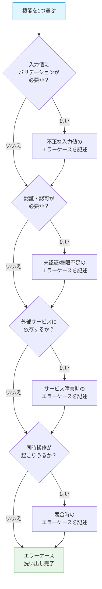
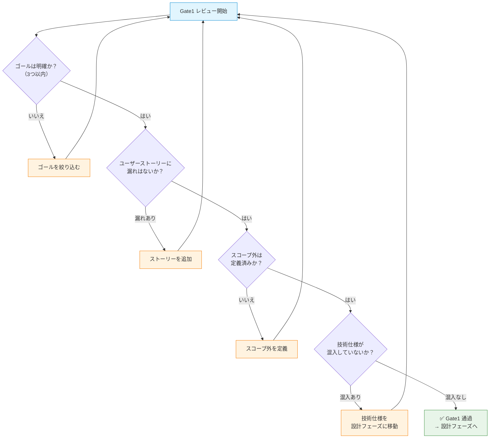

# 要件定義フェーズ — 「何を作るか」を定義する

## 概要

要件定義フェーズは、SDD（仕様書駆動開発）の **最初のフェーズ** です。このフェーズでは、`requirements.md` を作成し、プロジェクトの「何を作るか」を明確に定義します。

このガイドでは、以下を学べます。

- `requirements.md` のテンプレートと各セクションの書き方
- ユーザーストーリー・機能要件・非機能要件の実践的な書き方
- プロジェクト規模に応じた書き分け方
- Gate1（レビューゲート）の通過基準
- 具体例（Todoアプリ）による完成形イメージ
- よくあるアンチパターンとその回避方法

### なぜ要件定義が最初のフェーズなのか？

要件定義は、後続のすべてのフェーズの **入力（インプット）** になります。設計書はどんなアーキテクチャが必要かを要件から判断し、タスク一覧は要件をもとに分割されます。要件が曖昧なまま設計に進むと、AIは「自分で判断」してしまい、意図しない実装が生まれます。

> **要件定義の品質 = プロジェクト全体の品質の上限**

どんなに優れた設計や実装をしても、要件が間違っていれば正しいプロダクトにはなりません。

## 目次

- [requirements.md の構成テンプレート](#requirementsmd-の構成テンプレート)
  - [プロジェクト概要](#プロジェクト概要)
  - [ゴール / 成功指標](#ゴール--成功指標)
  - [ユーザーストーリー一覧](#ユーザーストーリー一覧)
  - [機能要件](#機能要件)
  - [非機能要件](#非機能要件)
  - [スコープ外](#スコープ外)
  - [用語集（任意）](#用語集任意)
- [書き方の実践ガイド](#書き方の実践ガイド)
  - [ユーザーストーリーの書き方](#ユーザーストーリーの書き方)
  - [機能要件の粒度](#機能要件の粒度)
  - [エラーケース・エッジケースの洗い出し方](#エラーケースエッジケースの洗い出し方)
  - [スコープ外の決め方](#スコープ外の決め方)
  - [なぜ「書き方」にこだわるか？](#なぜ書き方にこだわるか)
- [規模別の書き分け](#規模別の書き分け)
  - [Small（個人）](#small個人)
  - [Medium（チーム）](#mediumチーム)
  - [Large（ステークホルダー合意）](#largeステークホルダー合意)
  - [なぜ規模で書き分けるか？](#なぜ規模で書き分けるか)
- [Gate1 チェックリスト](#gate1-チェックリスト)
  - [チェック項目](#チェック項目)
  - [Gate1 通過の判断フロー](#gate1-通過の判断フロー)
  - [なぜ Gate1 が最も重要か？](#なぜ-gate1-が最も重要か)
- [具体例: Todo アプリの requirements.md](#具体例-todo-アプリの-requirementsmd)
- [アンチパターン](#アンチパターン)
  - [1. 技術仕様の混入](#1-技術仕様の混入)
  - [2. 曖昧な要件](#2-曖昧な要件)
  - [3. スコープ外の欠如](#3-スコープ外の欠如)
  - [4. 網羅的すぎる非機能要件](#4-網羅的すぎる非機能要件)
  - [5. ユーザー視点の欠落](#5-ユーザー視点の欠落)
- [次のステップ](#次のステップ)

---

## requirements.md の構成テンプレート

以下は `requirements.md` の標準テンプレートです。各セクションをコピーして、プロジェクトに合わせて記入してください。

### なぜテンプレートを使うのか？

テンプレートは「何を書くべきか」の漏れを防ぎます。白紙から要件を書くと、書き手の経験に依存し、重要な観点（スコープ外、エラーケース等）が抜け落ちがちです。テンプレートを使うことで、経験の浅いエンジニアでも一定品質の要件定義を作成できます。

| セクション | 必須/任意 | 目的 |
|---|---|---|
| プロジェクト概要 | 必須 | プロジェクトの全体像を30秒で把握できるようにする |
| ゴール / 成功指標 | 必須 | 「完成」の定義を明確にし、スコープの膨張を防ぐ |
| ユーザーストーリー一覧 | 必須 | ユーザー視点で機能を整理し、開発の優先順位を決める |
| 機能要件 | 必須 | AIが実装可能な粒度で機能を定義する |
| 非機能要件 | 必須 | パフォーマンスやセキュリティなど、品質基準を定義する |
| スコープ外 | 必須 | 「やらないこと」を明示し、スコープクリープを防ぐ |
| 用語集 | 任意 | ドメイン固有の用語の認識齟齬を防ぐ |

### プロジェクト概要

```markdown
## プロジェクト概要

### 一文サマリ
<!-- このプロジェクトが何かを1文で説明する -->

### 背景・課題
<!-- なぜこのプロジェクトが必要なのか。現状の問題点を記述する -->

### 対象ユーザー
<!-- 誰がこのプロダクトを使うのか。ペルソナや利用状況を記述する -->
```

### ゴール / 成功指標

```markdown
## ゴール / 成功指標

### ゴール（3つ以内）
<!-- プロジェクトが達成すべきゴールを箇条書きで記述する -->
-
-
-

### 成功指標
<!-- ゴールの達成度を測定可能な指標で定義する -->
| 指標 | 目標値 | 測定方法 |
|---|---|---|
|  |  |  |
```

### ユーザーストーリー一覧

```markdown
## ユーザーストーリー一覧

| ID | ユーザー（Who） | やりたいこと（What） | 理由（Why） | 優先度 |
|---|---|---|---|---|
| US-01 |  |  |  | Must |
| US-02 |  |  |  | Should |
| US-03 |  |  |  | Could |
```

### 機能要件

```markdown
## 機能要件

### FR-01: [機能名]
<!-- 1〜3文で機能を説明する -->

**正常系**:
**エラーケース**:
**関連ストーリー**: US-XX

### FR-02: [機能名]
...
```

### 非機能要件

```markdown
## 非機能要件

| カテゴリ | 要件 | 基準 |
|---|---|---|
| パフォーマンス |  |  |
| セキュリティ |  |  |
| アクセシビリティ |  |  |
| 対応環境 |  |  |
```

### スコープ外

```markdown
## スコープ外

| やらないこと | 理由 |
|---|---|
|  |  |
```

### 用語集（任意）

```markdown
## 用語集

| 用語 | 定義 |
|---|---|
|  |  |
```

---

## 書き方の実践ガイド

テンプレートの各セクションを **効果的に** 書くためのガイドです。良い例と悪い例を対比しながら、実践的なテクニックを紹介します。

### ユーザーストーリーの書き方

ユーザーストーリーは「**誰が（Who）**、**何をしたいか（What）**、**なぜか（Why）**」の3要素で構成します。

<!-- 悪い例 -->
```markdown
❌ 悪い例:
| ID | ユーザー | やりたいこと | 理由 | 優先度 |
|---|---|---|---|---|
| US-01 | ユーザー | ログインしたい | ログインするため | Must |
```

この例では、「ユーザー」が曖昧で、「理由」がトートロジー（同語反復）になっています。

<!-- 良い例 -->
```markdown
✅ 良い例:
| ID | ユーザー | やりたいこと | 理由 | 優先度 |
|---|---|---|---|---|
| US-01 | 登録済みユーザー | メールとパスワードでログインしたい | 自分のデータに安全にアクセスするため | Must |
```

**ポイント**:

- 「ユーザー」は具体的な役割で書く（管理者、登録済みユーザー、未登録の訪問者 など）
- 「やりたいこと」は操作を具体的に書く（「ログインしたい」→「メールとパスワードでログインしたい」）
- 「理由」はビジネス価値やユーザーの動機を書く（「〜するため」がトートロジーにならないように注意）

### 機能要件の粒度

機能要件は「1〜3文で説明できる粒度」で書きます。1文で足りない場合は機能を分割し、3文を超える場合は詳細を設計フェーズに委ねます。

<!-- 悪い例 -->
```markdown
❌ 悪い例（粒度が粗すぎる）:
### FR-01: 認証機能
ユーザー認証を実装する。

❌ 悪い例（粒度が細かすぎる / 技術仕様が混入）:
### FR-01: ログイン機能
メールとパスワードでログインする。パスワードはbcryptでハッシュ化し、
JWTトークンを返却する。トークンの有効期限は24時間とし、
リフレッシュトークンの有効期限は7日間とする。
トークンはHTTP-only Cookieに格納する。
```

<!-- 良い例 -->
```markdown
✅ 良い例（適切な粒度）:
### FR-01: ログイン
メールアドレスとパスワードでログインできる。ログイン成功後、認証状態が維持される。

**正常系**: メールとパスワードが正しい場合、ダッシュボードにリダイレクトされる
**エラーケース**: メールまたはパスワードが間違っている場合、エラーメッセージを表示する。5回連続で失敗した場合、アカウントを一時ロックする
**関連ストーリー**: US-01
```

### エラーケース・エッジケースの洗い出し方

要件定義の段階でエラーケースを網羅する必要はありませんが、**主要なエラーケース** は洗い出しておくべきです。以下のフローチャートに沿って、各機能のエラーケースを検討してください。



**全てのエラーケースを要件定義で網羅する必要はありません**。設計フェーズや実装フェーズで発見されるエラーケースもあります。要件定義では「ユーザーに見えるエラー」を中心に記述し、技術的なエラー処理は設計フェーズに委ねてください。

### スコープ外の決め方

スコープ外は「やらないこと」を明示するセクションです。以下の観点で判断します。

- **今回のゴールに直接貢献しない機能** → スコープ外
- **将来的には必要だが、今回は不要な機能** → スコープ外（理由に「v2で検討」と記載）
- **技術的に困難で、別途調査が必要な機能** → スコープ外（理由に「要調査」と記載）

<!-- 悪い例 -->
```markdown
❌ 悪い例:
## スコープ外
- 多言語対応
- 管理画面
```

理由がないため、後から「なぜやらないのか」が分からなくなります。

<!-- 良い例 -->
```markdown
✅ 良い例:
## スコープ外

| やらないこと | 理由 |
|---|---|
| 多言語対応（i18n） | 初期ユーザーは日本語話者のみ。v2で海外展開時に検討 |
| 管理画面 | 初期はDBを直接操作で運用可能。ユーザー数100人超過時に検討 |
| ネイティブアプリ | まずWebアプリでMVPを検証。PMFが確認できてから検討 |
```

### なぜ「書き方」にこだわるか？

要件定義書は、後続フェーズでAIが参照する **最も重要なインプット** です。曖昧な要件はAIの「推測」を誘発し、意図しない実装につながります。逆に、具体的で明確な要件は、AIが正確な設計・実装を行うための土台になります。

「書き方」にこだわることは、コードの品質にこだわることと同じです。**良い要件定義 = 良いコードの前提条件** です。

---

## 規模別の書き分け

プロジェクトの規模によって、`requirements.md` に求められる詳細度が変わります。個人プロジェクトと大規模チーム開発では、必要な記載粒度が大きく異なります。

| セクション | Small（個人） | Medium（チーム） | Large（ステークホルダー合意） |
|---|---|---|---|
| プロジェクト概要 | 1文サマリのみ | 背景・対象ユーザーも記載 | ビジネス背景・市場分析も含む |
| ゴール / 成功指標 | ゴール1〜2個 | ゴール + 成功指標 | ゴール + KPI + 測定方法 |
| ユーザーストーリー | 箇条書き3〜5個 | テーブル形式で優先度付き | テーブル + 受け入れ条件 |
| 機能要件 | 機能名 + 1文説明 | 正常系 + 主要エラーケース | 正常系 + 全エラーケース + エッジケース |
| 非機能要件 | 省略可（暗黙の基準） | 主要カテゴリのみ | 全カテゴリ + 具体的な数値基準 |
| スコープ外 | 箇条書き | 理由付きテーブル | 理由 + 代替手段 + 再検討時期 |
| 用語集 | 省略可 | ドメイン固有用語のみ | 全用語 + ステークホルダー間で合意 |

### Small（個人）

個人プロジェクトでは、**自分自身への備忘録** として最低限の要件を記述します。

```markdown
## プロジェクト概要
CLIで使えるMarkdownのリンク切れチェッカー。

## ゴール
- 指定ディレクトリ内の.mdファイルのリンク切れを検出できること

## ユーザーストーリー
- ユーザーとして、コマンド一発でリンク切れを検出したい
- ユーザーとして、リンク切れの箇所（ファイル名・行番号）を知りたい
- ユーザーとして、外部URLのリンク切れも検出したい

## 機能要件
- ローカルファイルへのリンク切れ検出
- 外部URLへのリンク切れ検出（HTTPステータスコードで判定）
- 結果をファイル名:行番号の形式で出力

## スコープ外
- GUI
- 自動修正機能
```

### Medium（チーム）

チーム開発では、**メンバー間の認識を揃える** ために、正常系・エラーケース・優先度を明確にします。テンプレートの全セクションを記載し、非同期レビューで合意をとります。

### Large（ステークホルダー合意）

大規模プロジェクトでは、**ステークホルダーとの合意文書** として機能します。テンプレートの全セクションを詳細に記載し、フォーマルなレビューゲートを通過させます。用語集も必須です。成功指標には具体的なKPIと測定方法を含め、スコープ外には再検討時期や代替手段も記載します。

### なぜ規模で書き分けるか？

要件定義のコストは「読み手の数」に比例して正当化されます。個人プロジェクトで大規模プロジェクト並みの要件定義を書くと、仕様書の作成・維持に時間を取られ、開発が進みません。逆に、10人のチームで箇条書きの要件定義だけでは、メンバー間の認識齟齬が多発します。

**書く量は「読み手が追加の質問なしに正しい判断ができるか」で決めます。** 読み手が自分だけなら最小限で十分であり、読み手が多いほど詳細が必要です。

---

## Gate1 チェックリスト

Gate1は、要件定義フェーズから設計フェーズに進む前の **最初のレビューゲート** です。以下のチェックリストを使って、`requirements.md` の品質を確認します。

### チェック項目

#### Small（セルフチェック）

```markdown
## Gate1 セルフチェック

- [ ] ゴールが1〜2個に絞られている
- [ ] ユーザーストーリーが最低3つある
- [ ] 各機能に1文以上の説明がある
- [ ] スコープ外が最低1つ定義されている
- [ ] 読み返して「何を作るか」が自分で理解できる
```

#### Medium（非同期レビュー）

```markdown
## Gate1 レビューチェックリスト

- [ ] ゴールが明確で、3つ以内に絞られている
- [ ] 成功指標が測定可能な形で定義されている
- [ ] ユーザーストーリーにWho/What/Whyが揃っている
- [ ] ユーザーストーリーに優先度（Must/Should/Could）がついている
- [ ] 各機能要件に正常系とエラーケースが記述されている
- [ ] 非機能要件が定義されている
- [ ] スコープ外が理由とともに定義されている
- [ ] 技術的な実装詳細が混入していない（→ 設計フェーズへ）
- [ ] チームメンバーが読んで追加の質問なしに理解できる
```

#### Large（フォーマルレビュー）

```markdown
## Gate1 フォーマルレビューチェックリスト

- [ ] Medium のチェックリスト全項目を満たしている
- [ ] ビジネス背景と市場分析が記述されている
- [ ] KPIと測定方法が具体的に定義されている
- [ ] ユーザーストーリーに受け入れ条件が定義されている
- [ ] 全エラーケースとエッジケースが洗い出されている
- [ ] 用語集が定義され、ステークホルダー間で合意されている
- [ ] スコープ外に再検討時期と代替手段が記載されている
- [ ] PO / ステークホルダーの承認を得ている
```

### Gate1 通過の判断フロー



### なぜ Gate1 が最も重要か？

Gate1は4つのゲートの中で **最も重要** です。理由は2つあります。

1. **影響範囲が最大**: 要件の誤りは、設計・タスク・実装の全フェーズに波及します。Gate2やGate3で見つかる問題は影響範囲が限定的ですが、Gate1を通過した要件の誤りは全てをやり直す必要があります

2. **修正コストが最小**: 要件定義の段階で問題を発見すれば、Markdownの修正だけで済みます。設計後に発見すれば設計書の修正が、実装後に発見すればコードの書き直しが必要になります

> **「要件の間違いを実装後に直すコストは、要件定義時に直すコストの10〜100倍」** — これはソフトウェア工学で広く知られている経験則です。Gate1はこのコスト差を最小化するための仕組みです。

---

## 具体例: Todo アプリの requirements.md

以下は、シンプルなTodoアプリの `requirements.md` の完成形です。Medium規模（小規模チーム）を想定しています。

```markdown
# Todo アプリ — requirements.md

## プロジェクト概要

### 一文サマリ
シンプルで使いやすいWebベースのTodo管理アプリケーション。

### 背景・課題
チームメンバーがそれぞれ異なるツール（付箋、メモ帳、スプレッドシート）で
タスクを管理しており、進捗の共有が困難になっている。

### 対象ユーザー
5人程度の小規模チームのメンバー。ITリテラシーは一般的なレベル。

## ゴール / 成功指標

### ゴール
- チームメンバーが1つのツールでタスクを管理できること
- タスクの進捗状況がリアルタイムで共有できること

### 成功指標
| 指標 | 目標値 | 測定方法 |
|---|---|---|
| チーム内利用率 | 80%以上 | 週次アクティブユーザー数 / チーム人数 |
| タスク完了率 | 70%以上 | 完了タスク数 / 作成タスク数（週次） |

## ユーザーストーリー一覧

| ID | ユーザー | やりたいこと | 理由 | 優先度 |
|---|---|---|---|---|
| US-01 | チームメンバー | Todoを作成・編集・削除したい | 自分のタスクを管理するため | Must |
| US-02 | チームメンバー | Todoに期限を設定したい | 優先順位を判断するため | Must |
| US-03 | チームメンバー | Todoの完了/未完了を切り替えたい | 進捗を記録するため | Must |
| US-04 | チームメンバー | 他のメンバーのTodoを閲覧したい | チーム全体の進捗を把握するため | Should |
| US-05 | チームメンバー | Todoをカテゴリで分類したい | 種類別にタスクを整理するため | Could |

## 機能要件

### FR-01: Todo CRUD
Todoの作成・読み取り・更新・削除ができる。
Todoにはタイトル（必須）と説明（任意）を設定できる。

**正常系**: タイトルを入力して保存ボタンを押すと、Todoが作成される
**エラーケース**: タイトルが空の場合、エラーメッセージを表示する
**関連ストーリー**: US-01

### FR-02: 期限設定
Todoに期限（日付）を設定できる。期限が過ぎたTodoは視覚的に区別される。

**正常系**: カレンダーから日付を選択して期限を設定する
**エラーケース**: 過去の日付を設定しようとした場合、警告を表示する（設定自体は許可）
**関連ストーリー**: US-02

### FR-03: 完了/未完了の切り替え
Todoの完了/未完了をワンクリックで切り替えられる。
完了したTodoは取り消し線で表示され、リストの下部に移動する。

**正常系**: チェックボックスをクリックすると、完了状態が切り替わる
**エラーケース**: なし（トグル操作のため）
**関連ストーリー**: US-03

### FR-04: チーム共有
同じチームのメンバーのTodoを一覧で閲覧できる。
メンバー別にフィルタリングできる。

**正常系**: チームビューで全メンバーのTodoが表示される
**エラーケース**: チームに未参加の場合、参加を促すメッセージを表示する
**関連ストーリー**: US-04

## 非機能要件

| カテゴリ | 要件 | 基準 |
|---|---|---|
| パフォーマンス | ページの初期表示 | 3秒以内 |
| パフォーマンス | Todo操作のレスポンス | 1秒以内 |
| セキュリティ | 認証 | メール+パスワードによるログイン必須 |
| 対応環境 | ブラウザ | Chrome, Safari, Firefox の最新版 |
| 対応環境 | デバイス | PC、スマートフォン（レスポンシブ） |

## スコープ外

| やらないこと | 理由 |
|---|---|
| ネイティブアプリ（iOS/Android） | まずWebで検証。利用率80%達成後に検討 |
| ファイル添付 | MVPでは不要。ユーザーフィードバック後に検討 |
| カテゴリ機能 | Could優先度のため初期リリースでは見送り（US-05） |
| 通知機能（メール/Slack連携） | 初期は5人のチームで口頭共有で十分 |
| 多言語対応 | チームは全員日本語話者 |
```

---

## アンチパターン

要件定義でよく見られる失敗パターンと、その回避方法を紹介します。

### 1. 技術仕様の混入

**問題**: 要件定義に技術的な実装詳細を書いてしまう。

<!-- 悪い例 -->
```markdown
❌ 悪い例:
### FR-01: ログイン
React + Next.js のApp Routerを使用し、NextAuth.jsでJWT認証を実装する。
トークンはRedisに保存し、有効期限は24時間とする。
```

<!-- 良い例 -->
```markdown
✅ 良い例:
### FR-01: ログイン
メールとパスワードでログインできる。ログイン後、認証状態が維持される。

**正常系**: 正しい認証情報でダッシュボードにリダイレクトされる
**エラーケース**: 認証失敗時にエラーメッセージを表示する
```

**なぜ問題か？**: 技術選定は設計フェーズの責務です。要件に技術を混入させると、設計の選択肢が狭まり、より良いアーキテクチャを見逃す可能性があります。

### 2. 曖昧な要件

**問題**: 「使いやすい」「高速な」「適切な」など、主観的・曖昧な表現を使ってしまう。

<!-- 悪い例 -->
```markdown
❌ 悪い例:
- 使いやすいUIにする
- 高速にレスポンスを返す
- 適切なエラーハンドリングを行う
```

<!-- 良い例 -->
```markdown
✅ 良い例:
- 主要操作が3クリック以内で完了できること
- API レスポンスが1秒以内であること
- 入力バリデーションエラー時に、該当フィールドの下にエラーメッセージを表示すること
```

**なぜ問題か？**: 曖昧な要件はAIの「推測」を誘発します。AIは「使いやすい」を独自に解釈し、期待と異なるUIを生成します。数値基準や具体的な動作を定義することで、解釈の余地をなくします。

### 3. スコープ外の欠如

**問題**: 「やらないこと」を定義せず、スコープが際限なく広がる。

<!-- 悪い例 -->
```markdown
❌ 悪い例:
（スコープ外セクションが存在しない）
```

<!-- 良い例 -->
```markdown
✅ 良い例:
## スコープ外

| やらないこと | 理由 |
|---|---|
| 多言語対応 | 初期ユーザーは日本語話者のみ |
| リアルタイム同期 | 初期は5人のチームで十分 |
```

**なぜ問題か？**: スコープ外がないと、AIもレビュアーも「この機能は含まれるのか？」を判断できません。結果として、不要な機能が実装されたり、レビューのたびに議論が発生します。**スコープ外は「やること」と同じくらい重要です。**

### 4. 網羅的すぎる非機能要件

**問題**: プロジェクト規模に見合わない非機能要件を定義してしまう。

<!-- 悪い例 -->
```markdown
❌ 悪い例（個人プロジェクトなのに）:
| カテゴリ | 要件 | 基準 |
|---|---|---|
| 可用性 | SLA 99.99% | 年間ダウンタイム52分以内 |
| スケーラビリティ | 同時接続10万人 | オートスケーリング対応 |
| 災害復旧 | RPO: 0秒, RTO: 5分 | マルチリージョン構成 |
```

<!-- 良い例 -->
```markdown
✅ 良い例（個人プロジェクトに適切な粒度）:
| カテゴリ | 要件 | 基準 |
|---|---|---|
| パフォーマンス | ページ表示 | 3秒以内 |
| 対応環境 | ブラウザ | Chrome最新版 |
```

**なぜ問題か？**: 過剰な非機能要件は、設計を不必要に複雑にし、開発コストを膨張させます。非機能要件は「現在の規模とユーザー数」に基づいて設定すべきです。

### 5. ユーザー視点の欠落

**問題**: 開発者視点で機能を列挙し、ユーザーがなぜその機能を必要とするかが書かれていない。

<!-- 悪い例 -->
```markdown
❌ 悪い例:
## 機能要件
- CRUD機能
- バリデーション
- ページネーション
- ソート機能
```

<!-- 良い例 -->
```markdown
✅ 良い例:
## ユーザーストーリー
| ID | ユーザー | やりたいこと | 理由 |
|---|---|---|---|
| US-01 | 購入者 | 商品をキーワードで検索したい | 欲しい商品を素早く見つけるため |

## 機能要件
### FR-01: 商品検索
キーワードを入力すると、商品名と説明文から一致する商品を検索できる。

**正常系**: 検索結果が一覧で表示される。1ページあたり20件、ページ送りで閲覧可能
**エラーケース**: 検索結果が0件の場合、「該当する商品がありません」と表示する
**関連ストーリー**: US-01
```

**なぜ問題か？**: ユーザーストーリーなしに機能を列挙すると、「なぜその機能が必要か」が分からず、優先順位の判断ができません。また、AIにとっても、ユーザーの目的が分かるとより適切な実装が可能になります。

---

## 次のステップ

要件定義が完了し、Gate1を通過したら、次は **設計フェーズ** に進みます。

> [02-design.md — 「どう作るか」を設計する](./02-design.md)

設計フェーズでは、要件定義で定義した「何を作るか」をもとに、アーキテクチャ・技術選定・データモデル・API仕様など「どう作るか」を決定します。
