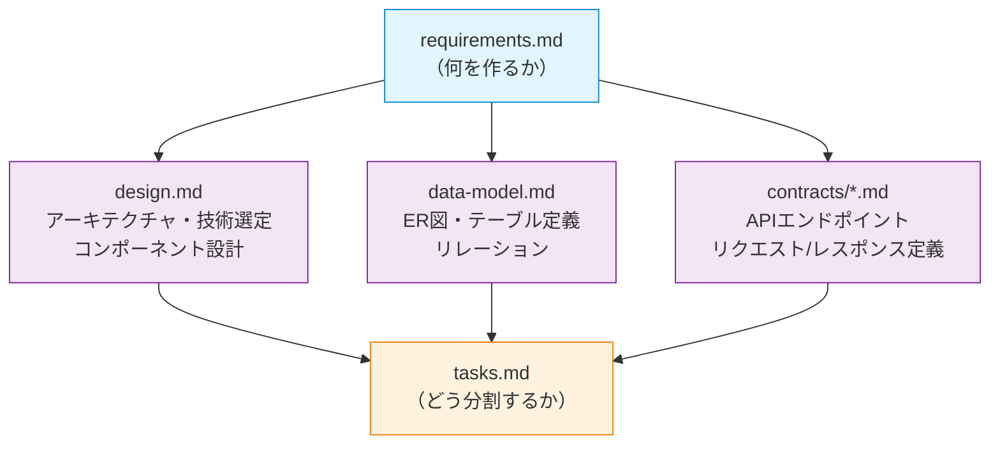
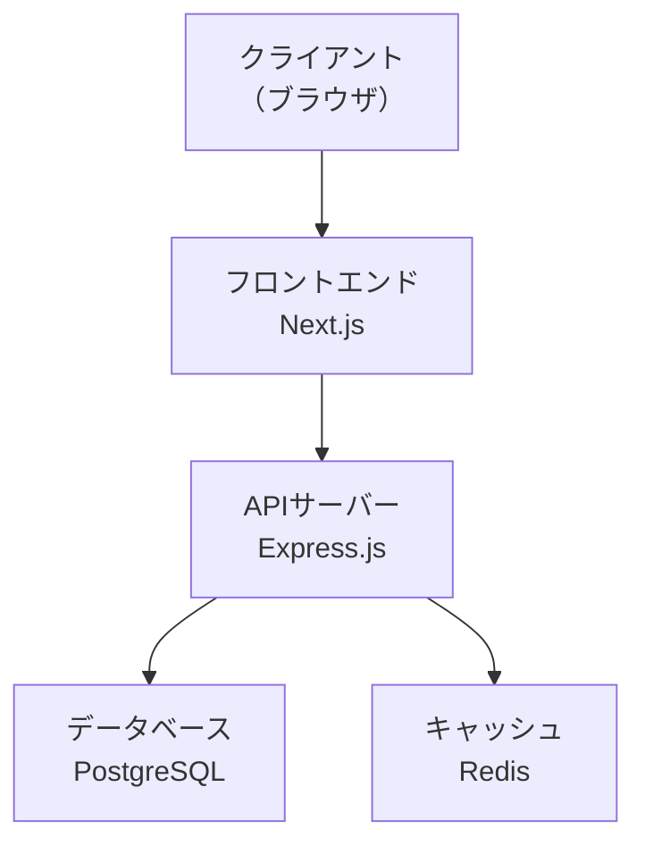
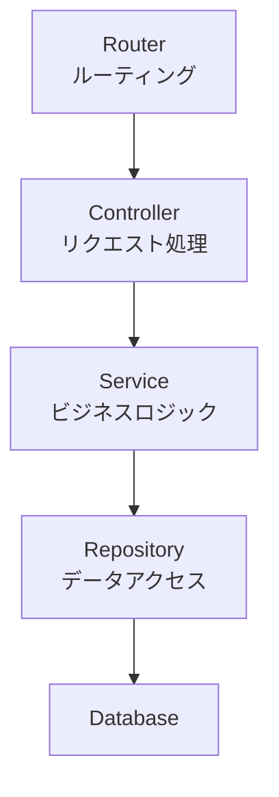
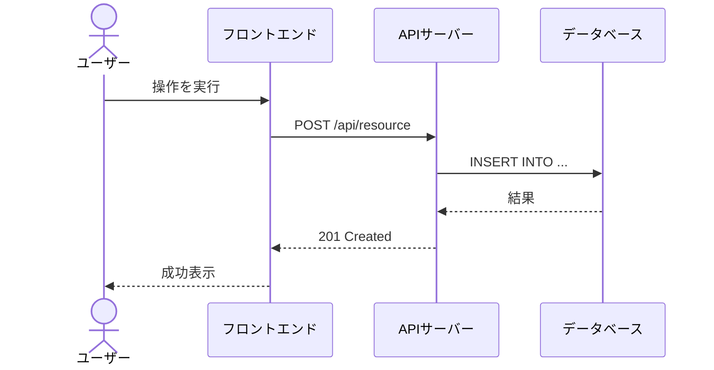
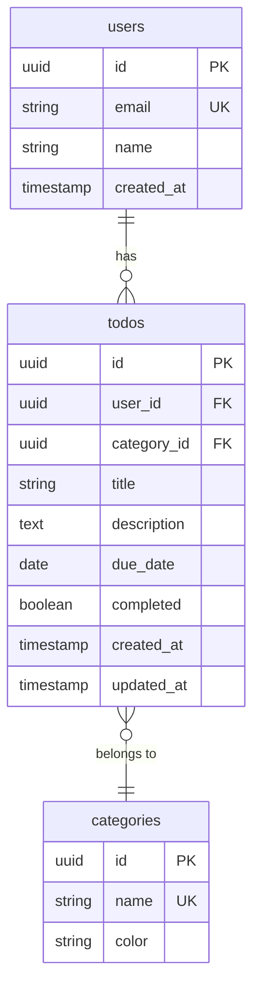
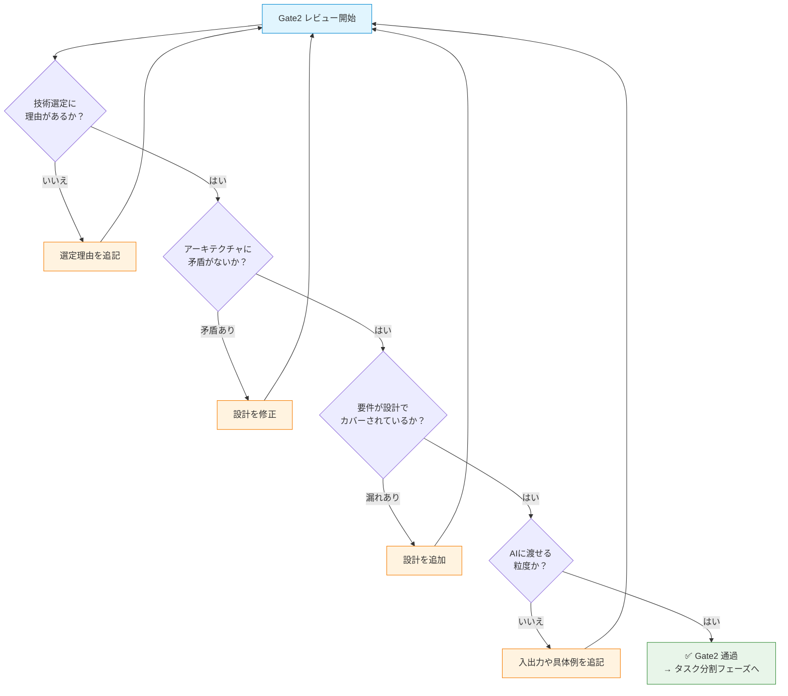
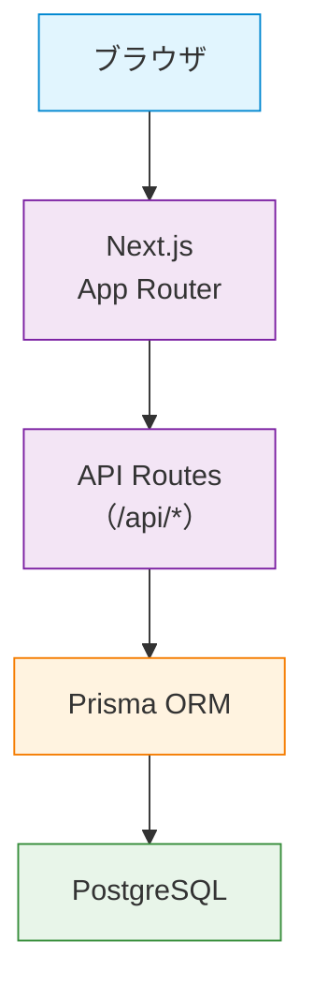
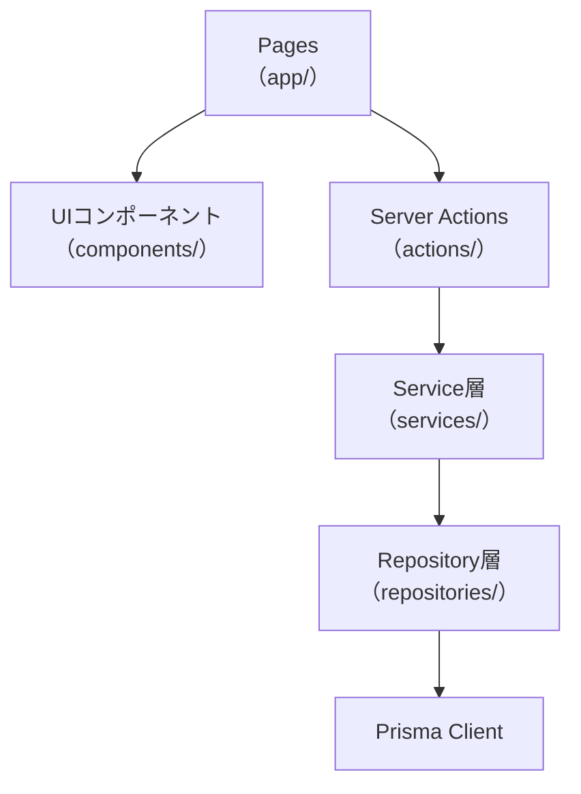
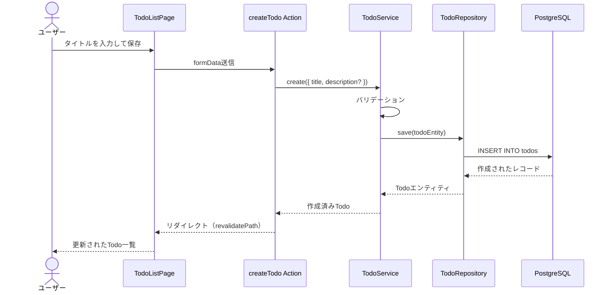
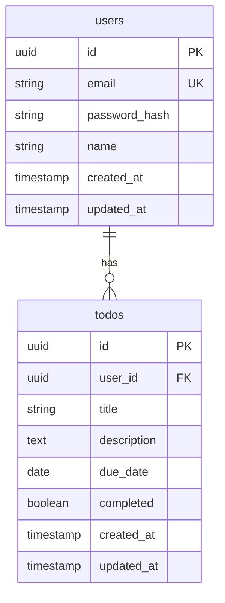

# 設計フェーズ — 「どう作るか」を設計する

## 概要

設計フェーズは、SDD（仕様書駆動開発）の **第2フェーズ** です。要件定義フェーズで決めた「何を作るか」をもとに、「**どう作るか**」を設計仕様書として定義します。

このガイドでは、以下を学べます。

- 設計フェーズの3つの成果物（`design.md` / `data-model.md` / `contracts/`）の役割と書き方
- 各成果物のテンプレートと各セクションの解説
- アーキテクチャ・技術選定・コンポーネント設計の実践的な書き方
- プロジェクト規模に応じた書き分け方
- Gate2（レビューゲート）の通過基準
- 具体例（Todoアプリ）による完成形イメージ
- よくあるアンチパターンとその回避方法

### なぜ設計フェーズが必要か？

要件定義は「何を作るか」を定義しますが、**「どう作るか」は決めていません**。要件をそのままAIに渡すと、AIが技術選定・アーキテクチャ・データ構造をすべて「推測」で決めてしまいます。

> **設計書 = AIへの技術的な指示書**

設計書があることで、AIは「どの技術を使うか」「コンポーネントをどう分けるか」「データをどう保存するか」を明確に理解した上でコードを書けます。設計書がなければ、AIはプロンプトのたびに異なるアーキテクチャで実装し、コードベースの一貫性が失われます。

## 目次

- [設計フェーズの3つの成果物](#設計フェーズの3つの成果物)
- [design.md の構成テンプレート](#designmd-の構成テンプレート)
  - [アーキテクチャ概要](#アーキテクチャ概要)
  - [技術選定](#技術選定)
  - [コンポーネント設計](#コンポーネント設計)
  - [データフロー](#データフロー)
  - [エラーハンドリング方針](#エラーハンドリング方針)
  - [テスト戦略](#テスト戦略)
  - [制約事項](#制約事項)
- [data-model.md の構成テンプレート](#data-modelmd-の構成テンプレート)
  - [ER図](#er図)
  - [テーブル定義](#テーブル定義)
  - [リレーション定義](#リレーション定義)
  - [インデックス戦略（任意）](#インデックス戦略任意)
  - [マイグレーション戦略（任意）](#マイグレーション戦略任意)
- [contracts/ の構成テンプレート](#contracts-の構成テンプレート)
  - [API契約書の構造](#api契約書の構造)
  - [リクエスト・レスポンスのスキーマ定義](#リクエストレスポンスのスキーマ定義)
  - [認証・認可の記述方法](#認証認可の記述方法)
  - [ページネーション・フィルタリングの記述方法](#ページネーションフィルタリングの記述方法)
- [書き方の実践ガイド](#書き方の実践ガイド)
  - [アーキテクチャの決め方](#アーキテクチャの決め方)
  - [技術選定の書き方](#技術選定の書き方)
  - [コンポーネント境界の決め方](#コンポーネント境界の決め方)
  - [AIが理解しやすい設計書の書き方](#aiが理解しやすい設計書の書き方)
  - [なぜ「書き方」にこだわるか？](#なぜ書き方にこだわるか)
- [規模別の書き分け](#規模別の書き分け)
  - [Small（個人）](#small個人)
  - [Medium（チーム）](#mediumチーム)
  - [Large（ステークホルダー合意）](#largeステークホルダー合意)
  - [なぜ規模で書き分けるか？](#なぜ規模で書き分けるか)
- [Gate2 チェックリスト](#gate2-チェックリスト)
  - [チェック項目](#チェック項目)
  - [Gate2 通過の判断フロー](#gate2-通過の判断フロー)
  - [なぜ Gate2 が重要か？](#なぜ-gate2-が重要か)
- [具体例: Todo アプリの設計仕様書](#具体例-todo-アプリの設計仕様書)
- [アンチパターン](#アンチパターン)
  - [1. 過剰設計（Over-Engineering）](#1-過剰設計over-engineering)
  - [2. 要件との断絶](#2-要件との断絶)
  - [3. 技術選定に理由がない](#3-技術選定に理由がない)
  - [4. 抽象度の不統一](#4-抽象度の不統一)
  - [5. AIに渡せない粒度](#5-aiに渡せない粒度)
- [次のステップ](#次のステップ)
- [参考情報源](#参考情報源)

---

## 設計フェーズの3つの成果物

設計フェーズでは、以下の3つの成果物を作成します。



| 成果物 | 役割 | いつ必要か |
|---|---|---|
| `design.md` | アーキテクチャ全体の設計・技術選定・コンポーネント分割 | **常に必要**（Medium以上） |
| `data-model.md` | データベース設計・テーブル定義・リレーション | データ永続化が必要な場合 |
| `contracts/*.md` | APIエンドポイント・リクエスト/レスポンス定義 | API開発が必要な場合 |

### なぜ3つに分けるか？

3つの成果物はそれぞれ **異なる読み手** を想定しています。

- **design.md**: テックリード・アーキテクトが全体設計をレビューする
- **data-model.md**: バックエンドエンジニアがDB設計を実装する
- **contracts/*.md**: フロントエンドとバックエンドが同時並行で実装する際のインターフェース契約

1つのファイルにすべてを詰め込むと、読み手が必要な情報にたどり着けず、レビューの精度が下がります。また、AIに渡す際も、関連する仕様だけを渡すことで、コンテキストウィンドウを効率的に使えます。

---

## design.md の構成テンプレート

`design.md` は設計フェーズの **中核となる成果物** です。アーキテクチャ全体の構成、技術選定の根拠、コンポーネントの責務と関係を定義します。

### なぜテンプレートを使うのか？

設計書を白紙から書くと、書き手の経験や関心に偏りが出ます。テンプレートは「書くべき観点」の漏れを防ぎ、エラーハンドリングやテスト戦略のような見落としがちなセクションを確実にカバーします。

| セクション | 必須/任意 | 目的 |
|---|---|---|
| アーキテクチャ概要 | 必須 | システム全体の構成を30秒で把握できるようにする |
| 技術選定 | 必須 | 使用する技術と選定理由を明確にし、レビューを可能にする |
| コンポーネント設計 | 必須 | 各コンポーネントの責務と依存関係を定義し、実装の境界を明確にする |
| データフロー | 必須 | 主要な処理フローを可視化し、コンポーネント間の連携を定義する |
| エラーハンドリング方針 | 必須 | エラーの分類と処理戦略を統一し、一貫性のあるエラー処理を実現する |
| テスト戦略 | 任意 | テストの範囲と優先度を決め、品質基準を定義する |
| 制約事項 | 任意 | セキュリティ・パフォーマンス・互換性の制約を明示する |

### アーキテクチャ概要

システム全体の構成をMermaid図で可視化します。読み手が30秒で「このシステムはどういう構成か」を把握できることが目標です。

````markdown
## アーキテクチャ概要

<!-- システム全体の構成を図示する。主要コンポーネントとその接続を含める -->



### 構成の概要

<!-- 図を補足する1〜3文の説明 -->
````

### 技術選定

選定した技術と、**なぜその技術を選んだか** の理由を記述します。理由のない技術選定はレビューが不可能です。

```markdown
## 技術選定

| カテゴリ | 技術 | 選定理由 |
|---|---|---|
| フロントエンド |  | <!-- なぜこの技術を選んだか --> |
| バックエンド |  | <!-- なぜこの技術を選んだか --> |
| データベース |  | <!-- なぜこの技術を選んだか --> |
| インフラ |  | <!-- なぜこの技術を選んだか --> |
| テスト |  | <!-- なぜこの技術を選んだか --> |

### 候補として検討した技術

<!-- 不採用にした技術と、その理由を記載する。レビュアーが「なぜXを使わないのか？」と質問しなくて済むようにする -->

| 技術 | 不採用理由 |
|---|---|
|  |  |
```

### コンポーネント設計

コンポーネント間の依存関係をMermaid図で可視化し、各コンポーネントの責務と入出力を定義します。

````markdown
## コンポーネント設計



### コンポーネント一覧

| コンポーネント | 責務 | 入力 | 出力 |
|---|---|---|---|
| Router | URLパスに応じてControllerにルーティング | HTTPリクエスト | Controller呼び出し |
| Controller | リクエストのバリデーションとレスポンス整形 | バリデーション済みリクエスト | HTTPレスポンス |
| Service | ビジネスロジックの実行 | ドメインオブジェクト | ドメインオブジェクト |
| Repository | データベースへのCRUD操作 | クエリパラメータ | エンティティ |
````

### データフロー

主要な処理フローをMermaid sequenceDiagramで可視化します。ユーザーの操作がどのコンポーネントを経由して、どう処理されるかを示します。

````markdown
## データフロー

<!-- 主要な処理フローを1〜3個選んで記述する。すべてのフローを書く必要はない -->

### [処理名]


````

### エラーハンドリング方針

エラーの分類と処理戦略を定義します。コンポーネントごとにエラー処理が異なると、ユーザー体験が一貫しなくなります。

````markdown
## エラーハンドリング方針

| エラー分類 | HTTPステータス | 処理戦略 | ユーザーへの表示 |
|---|---|---|---|
| バリデーションエラー | 400 | フィールドごとにエラーメッセージを返却 | 該当フィールド下にメッセージ表示 |
| 認証エラー | 401 | ログインページにリダイレクト | 「ログインしてください」 |
| 認可エラー | 403 | エラーレスポンスを返却 | 「権限がありません」 |
| リソース未検出 | 404 | エラーレスポンスを返却 | 「見つかりません」 |
| サーバーエラー | 500 | エラーログ出力 + 汎用エラーを返却 | 「問題が発生しました」 |

### エラーレスポンス共通フォーマット

```json
{
  "error": {
    "code": "VALIDATION_ERROR",
    "message": "入力内容に誤りがあります",
    "details": [
      { "field": "email", "message": "メールアドレスの形式が正しくありません" }
    ]
  }
}
```
````

### テスト戦略

テストピラミッドに基づき、テストの種類ごとの範囲と優先度を定義します。

```markdown
## テスト戦略

| テスト種類 | 対象 | ツール | 優先度 |
|---|---|---|---|
| 単体テスト | Service層のビジネスロジック | <!-- テストフレームワーク --> | 高 |
| 統合テスト | API エンドポイント | <!-- テストフレームワーク --> | 高 |
| E2Eテスト | 主要なユーザーフロー | <!-- テストフレームワーク --> | 中 |

### カバレッジ目標

<!-- プロジェクト規模に応じた現実的な目標を設定する -->

| 対象 | 目標カバレッジ |
|---|---|
| Service層 | 80% |
| API全体 | 70% |
```

### 制約事項

セキュリティ・パフォーマンス・互換性などの技術的な制約を明示します。

```markdown
## 制約事項

### セキュリティ

<!-- 認証方式、データ保護、CORS設定などの制約 -->

-
-

### パフォーマンス

<!-- レスポンスタイム、同時接続数、データ量の制約 -->

-
-

### 互換性

<!-- 対応ブラウザ、Node.jsバージョン、API互換性の制約 -->

-
-
```

---

## data-model.md の構成テンプレート

`data-model.md` は、データベースの設計を定義する仕様書です。テーブル構造、リレーション、制約を明確にし、バックエンドの実装者が迷わずにDB設計を実装できるようにします。

### いつ data-model.md が必要か？

| 状況 | 必要性 |
|---|---|
| データベースを使用する | **必須** |
| 外部APIのみでデータを管理 | 不要 |
| ローカルファイルのみ | 不要 |
| インメモリのみ（CLIツール等） | 不要 |

データを永続化するプロジェクトでは、`data-model.md` がないとAIが独自にテーブル設計を行い、正規化の程度やリレーションがプロンプトのたびに変わる可能性があります。

### セクション一覧テーブル

| セクション | 必須/任意 | 目的 |
|---|---|---|
| ER図 | 必須 | テーブル間の関係を視覚的に把握する |
| テーブル定義 | 必須 | カラム名・型・制約を明確にし、実装時の曖昧さをなくす |
| リレーション定義 | 必須 | テーブル間の関係を文章で補足する |
| インデックス戦略 | 任意 | クエリパフォーマンスに影響するインデックスを定義する |
| マイグレーション戦略 | 任意 | スキーマ変更の手順を定義する |

### ER図

Mermaid erDiagramを使って、テーブル間のリレーションを可視化します。

````markdown
## ER図


````

> **注**: 上記はER図の書き方を示す汎用例です。実際のプロジェクトでは、requirements.md の要件に基づいてテーブルを設計してください。Todoアプリの具体例は [具体例: Todo アプリの設計仕様書](#具体例-todo-アプリの設計仕様書) を参照してください。

### テーブル定義

各テーブルのカラムを詳細に定義します。型・制約・デフォルト値・説明をテーブル形式で記述します。

```markdown
## テーブル定義

### [テーブル名]

| カラム名 | 型 | 制約 | デフォルト | 説明 |
|---|---|---|---|---|
| id | UUID | PK | gen_random_uuid() | 一意識別子 |
| created_at | TIMESTAMP | NOT NULL | CURRENT_TIMESTAMP | 作成日時 |
| updated_at | TIMESTAMP | NOT NULL | CURRENT_TIMESTAMP | 更新日時 |
```

### リレーション定義

ER図で表現したリレーションを文章で補足します。特にカスケード削除や外部キー制約の振る舞いを明記します。

```markdown
## リレーション定義

| 親テーブル | 子テーブル | 関係 | ON DELETE |
|---|---|---|---|
| users | todos | 1:N | CASCADE |
| categories | todos | 1:N | SET NULL |

### 補足

- ユーザーを削除すると、そのユーザーのTodoもすべて削除される（CASCADE）
- カテゴリを削除すると、そのカテゴリに属するTodoのcategory_idがNULLになる（SET NULL）
```

### インデックス戦略（任意）

頻繁に使用するクエリパターンに基づいてインデックスを定義します。初期段階では不要ですが、パフォーマンス要件が明確な場合に記載します。

```markdown
## インデックス戦略

| テーブル | カラム | インデックス種別 | 根拠 |
|---|---|---|---|
| todos | user_id | B-tree | ユーザー別のTodo一覧取得で使用 |
| todos | due_date | B-tree | 期限順のソートで使用 |
| todos | (user_id, completed) | 複合 | ユーザー別の未完了Todo取得で使用 |
```

### マイグレーション戦略（任意）

スキーマの変更手順やバージョン管理の方針を記述します。チーム開発で特に重要です。

```markdown
## マイグレーション戦略

### マイグレーションツール

<!-- 使用するマイグレーションツールとその理由 -->

### バージョン管理方針

- マイグレーションファイルは `migrations/` ディレクトリに格納
- ファイル名は `YYYYMMDDHHMMSS_description.sql` の形式
- ロールバックスクリプトも必ず作成する
```

---

## contracts/ の構成テンプレート

`contracts/` は、APIのエンドポイント定義をまとめるディレクトリです。フロントエンドとバックエンドが同時並行で開発する際のインターフェース契約として機能します。

### いつ contracts/ が必要か？

| 状況 | 必要性 |
|---|---|
| REST API / GraphQL を開発する | **必須** |
| フロントエンドとバックエンドを分離する | **必須** |
| 外部サービス向けAPIを提供する | **必須** |
| モノリシックなSSR（サーバーサイドレンダリング）のみ | 不要 |
| CLIツール・バッチ処理のみ | 不要 |

API契約書がないと、フロントエンドとバックエンドの開発者がそれぞれ異なるリクエスト/レスポンス形式を想定し、結合テストで大量のバグが発生します。

### API契約書の構造

1つのドメインにつき1つのファイルを作成します（例: `contracts/todos.md`、`contracts/auth.md`）。

````markdown
# [ドメイン名] API契約書

## エンドポイント一覧

| メソッド | パス | 概要 | 認証 |
|---|---|---|---|
| GET | /api/[resources] | 一覧取得 | 要 |
| GET | /api/[resources]/:id | 詳細取得 | 要 |
| POST | /api/[resources] | 新規作成 | 要 |
| PUT | /api/[resources]/:id | 更新 | 要 |
| DELETE | /api/[resources]/:id | 削除 | 要 |

---

## エンドポイント詳細

### GET /api/[resources]

**概要**: [リソース]の一覧を取得する

**リクエスト**:

| パラメータ | 位置 | 型 | 必須 | 説明 |
|---|---|---|---|---|
| page | query | integer | × | ページ番号（デフォルト: 1） |
| limit | query | integer | × | 1ページあたりの件数（デフォルト: 20） |

**レスポンス（200 OK）**:

```json
{
  "data": [...],
  "pagination": {
    "page": 1,
    "limit": 20,
    "total": 100,
    "totalPages": 5
  }
}
```

**エラーレスポンス**:

| ステータス | コード | 条件 |
|---|---|---|
| 401 | UNAUTHORIZED | 認証トークンが無効 |
| 500 | INTERNAL_ERROR | サーバー内部エラー |
````

### リクエスト・レスポンスのスキーマ定義

リクエストボディとレスポンスボディのスキーマをJSON形式で定義します。型とバリデーションルールを明記することで、フロントエンドとバックエンドの認識を一致させます。

````markdown
## スキーマ定義

### [リソース名] 作成リクエスト

```json
{
  "title": "string (必須, 1〜100文字)",
  "description": "string (任意, 最大500文字)",
  "due_date": "string (任意, ISO 8601形式: YYYY-MM-DD)"
}
```

### [リソース名] レスポンス

```json
{
  "id": "string (UUID)",
  "title": "string",
  "description": "string | null",
  "due_date": "string | null (ISO 8601)",
  "completed": "boolean",
  "created_at": "string (ISO 8601)",
  "updated_at": "string (ISO 8601)"
}
```
````

### 認証・認可の記述方法

API全体に共通する認証方式を記述します。

````markdown
## 認証・認可

### 認証方式

<!-- Bearer Token / Session / API Key など -->

**認証ヘッダー**:

```
Authorization: Bearer <token>
```

### 認可ルール

| エンドポイント | 必要な権限 | 補足 |
|---|---|---|
| GET /api/resources | 認証済み | 自分のリソースのみ取得可能 |
| POST /api/resources | 認証済み | — |
| DELETE /api/resources/:id | 所有者のみ | 他人のリソースは削除不可 |
````

### ページネーション・フィルタリングの記述方法

一覧取得APIのページネーションとフィルタリングの仕様を定義します。

````markdown
## ページネーション

### 共通パラメータ

| パラメータ | 型 | デフォルト | 最大値 | 説明 |
|---|---|---|---|---|
| page | integer | 1 | — | ページ番号 |
| limit | integer | 20 | 100 | 1ページあたりの件数 |

### レスポンスフォーマット

```json
{
  "data": [...],
  "pagination": {
    "page": 1,
    "limit": 20,
    "total": 100,
    "totalPages": 5
  }
}
```

## フィルタリング

### 共通パラメータ

| パラメータ | 型 | 説明 | 例 |
|---|---|---|---|
| sort | string | ソートフィールド | `sort=created_at` |
| order | string | ソート順（asc/desc） | `order=desc` |
| [field] | string | フィールドでフィルタ | `completed=true` |
````

---

## 書き方の実践ガイド

テンプレートの各セクションを **効果的に** 書くためのガイドです。良い例と悪い例を対比しながら、実践的なテクニックを紹介します。

### アーキテクチャの決め方

アーキテクチャは要件の規模と制約から決定します。「流行っているから」ではなく、**要件を満たす最もシンプルな構成** を選びます。

<!-- 悪い例 -->
```markdown
❌ 悪い例:
## アーキテクチャ概要
マイクロサービスアーキテクチャを採用します。
```

この例には「なぜマイクロサービスか」の理由がなく、過剰設計の可能性があります。

<!-- 良い例 -->
```markdown
✅ 良い例:
## アーキテクチャ概要
モノリシックアーキテクチャを採用します。

理由:
- チーム規模が3人で、サービス間通信のオーバーヘッドを避けたい
- 初期ユーザー数は100人以下で、スケーラビリティの要件が低い
- 開発速度を優先し、デプロイの複雑さを最小化したい
```

**ポイント**:

- アーキテクチャの選定理由を必ず書く
- プロジェクトの規模・チーム・要件に基づいて判断する
- 「将来的にマイクロサービスに分割する可能性がある」場合は、その旨と分割基準を記載する

### 技術選定の書き方

技術選定では「何を選んだか」だけでなく、「**なぜ選んだか**」と「**何を選ばなかったか**」を書きます。

<!-- 悪い例 -->
```markdown
❌ 悪い例:
## 技術選定

| カテゴリ | 技術 |
|---|---|
| フロントエンド | Next.js |
| バックエンド | Express.js |
| データベース | PostgreSQL |
```

理由がないため、レビュアーは「なぜReactではなくNext.jsか？」「なぜMySQLではなくPostgreSQLか？」を質問するしかありません。

<!-- 良い例 -->
```markdown
✅ 良い例:
## 技術選定

| カテゴリ | 技術 | 選定理由 |
|---|---|---|
| フロントエンド | Next.js 15 | SSR/SSGが必要。App Routerによるファイルベースルーティングで開発効率向上 |
| バックエンド | Next.js API Routes | フロントエンドと同一リポジトリで管理でき、デプロイの複雑さを回避 |
| データベース | PostgreSQL 16 | JSON型サポートが充実。チームに経験者が多い |

### 候補として検討した技術

| 技術 | 不採用理由 |
|---|---|
| MySQL | JSON型のクエリパフォーマンスがPostgreSQLに劣る |
| MongoDB | リレーショナルなデータ構造のため、RDBMSの方が適切 |
```

### コンポーネント境界の決め方

コンポーネントの境界は **単一責任の原則（SRP）** に基づいて決定します。1つのコンポーネントが担う責務は1つだけにします。

**分割の判断基準**:

1. **変更理由が異なる** → 分割する（例: UIの変更とビジネスロジックの変更は独立）
2. **テストの単位が異なる** → 分割する（例: バリデーションロジックは単体テスト可能にする）
3. **再利用される可能性がある** → 分割する（例: 認証ロジックは複数の画面で使用）
4. **チームの担当が異なる** → 分割する（例: フロントエンドチームとバックエンドチーム）

<!-- 悪い例 -->
```markdown
❌ 悪い例（責務が混在）:
### TodoController
- HTTPリクエストを受け取る
- バリデーションを行う
- DBにクエリを実行する
- レスポンスを整形する
- エラーログを出力する
```

<!-- 良い例 -->
```markdown
✅ 良い例（責務が分離）:
### TodoController
- 責務: HTTPリクエストの受付とレスポンスの返却
- 入力: HTTPリクエスト
- 出力: HTTPレスポンス

### TodoService
- 責務: Todoに関するビジネスロジック
- 入力: バリデーション済みデータ
- 出力: ドメインオブジェクト

### TodoRepository
- 責務: todosテーブルへのデータアクセス
- 入力: クエリパラメータ
- 出力: エンティティ
```

### AIが理解しやすい設計書の書き方

設計書はAIが読んで実装するためのドキュメントです。AIが正確に実装できるよう、以下のポイントを意識してください。

**1. 入出力を具体的に定義する**

```markdown
✅ 良い例:
### TodoService.create()
- 入力: { title: string, description?: string, due_date?: string }
- 出力: { id: string, title: string, ... }
- エラー: titleが空の場合、ValidationError をスロー
```

**2. 具体的なコードスニペットで意図を伝える**

````markdown
✅ 良い例:
### エラーレスポンスの統一フォーマット

すべてのAPIエンドポイントは以下のフォーマットでエラーを返す:

```json
{
  "error": {
    "code": "VALIDATION_ERROR",
    "message": "入力内容に誤りがあります",
    "details": [...]
  }
}
```
````

**3. 曖昧な表現を避ける**

| 曖昧な表現 | 具体的な表現 |
|---|---|
| 「適切に処理する」 | 「400エラーとバリデーションメッセージを返す」 |
| 「必要に応じてキャッシュする」 | 「一覧取得APIのレスポンスを5分間Redisにキャッシュする」 |
| 「セキュアに保存する」 | 「bcryptでハッシュ化し、cost factor 10で保存する」 |

### なぜ「書き方」にこだわるか？

設計書は、AIが実装する際の **最も重要な技術ドキュメント** です。曖昧な設計はAIの「推測」を誘発し、意図しないアーキテクチャやコードパターンが生まれます。

特にAIは、具体的な入出力定義やコードスニペットがあると正確に実装でき、抽象的な記述では独自解釈を行います。**設計書の精度 = 実装の精度** です。良い設計書を書くスキルは、現代のAI活用時代において最も重要なエンジニアリングスキルの1つです。

---

## 規模別の書き分け

プロジェクトの規模によって、設計仕様書に求められる詳細度が変わります。

| セクション | Small（個人） | Medium（チーム） | Large（ステークホルダー合意） |
|---|---|---|---|
| アーキテクチャ概要 | 構成図 + 1文説明 | 構成図 + 選定理由 | 構成図 + 選定理由 + 代替案比較 |
| 技術選定 | テーブル（理由は1行） | テーブル + 不採用技術 | テーブル + 不採用技術 + 比較検証結果 |
| コンポーネント設計 | 省略可（設計書内で暗黙） | コンポーネント図 + 責務テーブル | コンポーネント図 + 責務 + 入出力 + インターフェース定義 |
| データフロー | 省略可 | 主要フロー1〜2個 | 全主要フロー + エラーフロー |
| エラーハンドリング | 省略可 | 分類テーブル + 共通フォーマット | 分類テーブル + 共通フォーマット + リトライ戦略 |
| テスト戦略 | 省略可 | 種類 + ツール + カバレッジ目標 | 種類 + ツール + カバレッジ目標 + CI/CD連携 |
| 制約事項 | 省略可 | 主要な制約のみ | 全制約 + 制約への対応方針 |
| data-model.md | 省略可（design.md内で記述可） | ER図 + テーブル定義 + リレーション | ER図 + テーブル定義 + リレーション + インデックス + マイグレーション |
| contracts/ | 省略可 | エンドポイント一覧 + 主要APIの詳細 | 全エンドポイント詳細 + 認証 + ページネーション |

### Small（個人）

個人プロジェクトでは、**自分自身への備忘録** として最低限の設計を記述します。`design.md` のみで、`data-model.md` と `contracts/` は省略可能です。

```markdown
# [プロジェクト名] — design.md

## アーキテクチャ概要

CLIツール。Node.js + TypeScriptで実装。

## 技術選定

| カテゴリ | 技術 | 選定理由 |
|---|---|---|
| 言語 | TypeScript | 型安全性。普段使い慣れている |
| CLIフレームワーク | Commander.js | シンプルで軽量 |
| テスト | Vitest | 高速で設定不要 |

## 制約事項

- Node.js 20以上
- Windows / macOS / Linux対応
```

### Medium（チーム）

チーム開発では、**メンバー間の技術的認識を揃える** ために、全セクションを記載します。`data-model.md` と `contracts/` もデータベースやAPI開発がある場合は作成します。Mediumの完成形は [具体例: Todoアプリの設計仕様書](#具体例-todo-アプリの設計仕様書) を参照してください。

### Large（ステークホルダー合意）

大規模プロジェクトでは、**技術的な意思決定の根拠を第三者が検証できる** レベルで詳細に記述します。全セクションを詳細に記載し、特に以下の点を強化します。

- 技術選定に比較検証結果を含める
- コンポーネント設計にインターフェース定義を含める
- データフローにエラーフローも含める
- インデックス戦略とマイグレーション戦略を記載する
- 認証・ページネーションの仕様を含む完全なAPI契約書を作成する

### なぜ規模で書き分けるか？

設計書のコストは「レビューの深さ」に比例して正当化されます。個人プロジェクトで詳細な設計書を書いても、レビューする人がいなければその詳細は無駄になります。逆に大規模プロジェクトでは、設計書の曖昧さがそのまま実装のバグに直結します。

**書く量は「AIと開発者が追加の質問なしに正しい実装を始められるか」で決めます。** 開発者が自分だけなら暗黙知でカバーでき、チームが大きいほど明示的な記述が必要です。

---

## Gate2 チェックリスト

Gate2は、設計フェーズからタスク分割フェーズに進む前の **レビューゲート** です。技術選定の妥当性とアーキテクチャの整合性を確認します。

> READMEでは Gate2 の確認事項を「技術選定の根拠が明確か？アーキテクチャに矛盾がないか？AIに渡せる粒度になっているか？」と定義しています。このガイドでは、その3つの観点をより詳細な判断フローとして提供します。

### チェック項目

#### Small（セルフチェック）

```markdown
## Gate2 セルフチェック

- [ ] アーキテクチャ構成が決まっている
- [ ] 使用する主要技術に選定理由がある
- [ ] 要件定義の各機能が設計でカバーされている
- [ ] 読み返して「どう作るか」が自分で理解できる
```

#### Medium（非同期レビュー）

```markdown
## Gate2 レビューチェックリスト

- [ ] アーキテクチャ概要がMermaid図で可視化されている
- [ ] 技術選定に「なぜその技術を選んだか」の理由が書かれている
- [ ] コンポーネント間の依存関係が定義されている
- [ ] 主要なデータフローがsequenceDiagramで可視化されている
- [ ] エラーハンドリング方針が定義されている
- [ ] requirements.md の各機能要件が設計でカバーされている
- [ ] 非機能要件（パフォーマンス、セキュリティ）が考慮されている
- [ ] data-model.md のER図とテーブル定義が正しい（DB使用時）
- [ ] contracts/ のエンドポイント定義がrequirements.mdと整合している（API開発時）
- [ ] AIが設計書だけで実装を始められる粒度になっている
```

#### Large（フォーマルレビュー）

```markdown
## Gate2 フォーマルレビューチェックリスト

- [ ] Medium のチェックリスト全項目を満たしている
- [ ] 技術選定に候補技術の比較検証結果が含まれている
- [ ] コンポーネント設計にインターフェース（入出力）が定義されている
- [ ] 全主要フローとエラーフローが可視化されている
- [ ] テスト戦略にカバレッジ目標が設定されている
- [ ] インデックス戦略が定義されている（DB使用時）
- [ ] API契約書に認証・ページネーション仕様が含まれている（API開発時）
- [ ] セキュリティ・パフォーマンスの制約と対応方針が記載されている
- [ ] テックリード / アーキテクトの承認を得ている
```

### Gate2 通過の判断フロー



### なぜ Gate2 が重要か？

Gate2は **技術的な意思決定の最終確認ポイント** です。Gate2を通過した後のタスク分割・実装では、設計を前提に進めるため、設計の誤りが見つかると大幅な手戻りが発生します。

特にAI活用開発では、設計書がAIへの「実装指示書」になります。設計書の曖昧さやミスは、AIが大量の誤ったコードを生成する原因になります。**Gate2で設計の品質を確保することは、実装フェーズの生産性に直結します。**

---

## 具体例: Todo アプリの設計仕様書

以下は、[01-requirements/guide.md](../01-requirements/guide.md) で定義したTodoアプリの要件をもとに作成した設計仕様書の完成形です。Medium規模を想定しています。

### design.md の完成形

````markdown
# Todo アプリ — design.md

## アーキテクチャ概要



モノリシックアーキテクチャを採用する。フロントエンドとバックエンドをNext.jsで
統合し、デプロイの複雑さを最小化する。

理由:
- 5人のチームでマイクロサービスは過剰
- 初期ユーザー数100人以下でスケーラビリティ要件が低い
- フロントエンドとAPIを同一リポジトリで管理でき、開発効率が高い

## 技術選定

| カテゴリ | 技術 | 選定理由 |
|---|---|---|
| フレームワーク | Next.js 15 (App Router) | SSR/CSR両対応。API Routesでバックエンドも統合可能 |
| 言語 | TypeScript | 型安全性。フロントエンドとバックエンドで型を共有可能 |
| ORM | Prisma | 型安全なクエリ。マイグレーション機能内蔵 |
| データベース | PostgreSQL 16 | チームに経験者が多い。Prismaとの相性が良い |
| 認証 | NextAuth.js | Next.jsとの統合が容易。Credentials Providerでメール+パスワード認証 |
| CSS | Tailwind CSS | ユーティリティファーストで開発速度が高い |
| テスト | Vitest + Playwright | Vitestで単体/統合テスト、Playwrightで E2E テスト |

### 候補として検討した技術

| 技術 | 不採用理由 |
|---|---|
| Express.js（バックエンド） | Next.js API Routesで十分。別サーバーにするメリットが薄い |
| MySQL | PostgreSQLの方がチーム経験が豊富 |
| Drizzle ORM | Prismaの方がマイグレーション機能が成熟している |

## コンポーネント設計



| コンポーネント | 責務 | 入力 | 出力 |
|---|---|---|---|
| Pages | ページのレイアウトとルーティング | URL | HTML |
| UIコンポーネント | ユーザーインターフェースの描画 | Props | JSX |
| Server Actions | フォーム送信の処理 | FormData | リダイレクト/エラー |
| Service | ビジネスロジック（CRUD、バリデーション） | DTO | ドメインオブジェクト |
| Repository | Prismaを使ったデータアクセス | クエリパラメータ | エンティティ |

## データフロー

### Todo作成フロー



## エラーハンドリング方針

| エラー分類 | HTTPステータス | 処理戦略 | ユーザーへの表示 |
|---|---|---|---|
| バリデーションエラー | 400 | Server Actionでエラーを返却 | フォームフィールド下にメッセージ表示 |
| 認証エラー | 401 | NextAuth.jsがログインページにリダイレクト | 「ログインしてください」 |
| 認可エラー | 403 | 他人のTodoへのアクセスを拒否 | 「権限がありません」 |
| サーバーエラー | 500 | エラーログ出力 + error.tsx で汎用エラー表示 | 「問題が発生しました」 |

## テスト戦略

| テスト種類 | 対象 | ツール | 優先度 |
|---|---|---|---|
| 単体テスト | TodoService のビジネスロジック | Vitest | 高 |
| 統合テスト | Server Actions + DB | Vitest + Prisma | 高 |
| E2Eテスト | Todo作成〜完了の一連フロー | Playwright | 中 |

## 制約事項

### セキュリティ
- パスワードはbcryptでハッシュ化（cost factor 10）
- CSRFトークンはNext.jsのビルトイン保護を使用
- 環境変数で機密情報を管理（.env.local）

### パフォーマンス
- Todo一覧は1ページ20件、ページネーション対応
- 初期表示3秒以内（requirements.md の非機能要件に準拠）

### 互換性
- Node.js 20以上
- Chrome, Safari, Firefox の最新版
````

### data-model.md の完成形

````markdown
# Todo アプリ — data-model.md

## ER図



## テーブル定義

### users

| カラム名 | 型 | 制約 | デフォルト | 説明 |
|---|---|---|---|---|
| id | UUID | PK | gen_random_uuid() | ユーザーID |
| email | VARCHAR(255) | UNIQUE, NOT NULL | — | メールアドレス |
| password_hash | VARCHAR(255) | NOT NULL | — | bcryptハッシュ化済みパスワード |
| name | VARCHAR(100) | NOT NULL | — | ユーザー名 |
| created_at | TIMESTAMP | NOT NULL | CURRENT_TIMESTAMP | 作成日時 |
| updated_at | TIMESTAMP | NOT NULL | CURRENT_TIMESTAMP | 更新日時 |

### todos

| カラム名 | 型 | 制約 | デフォルト | 説明 |
|---|---|---|---|---|
| id | UUID | PK | gen_random_uuid() | TodoID |
| user_id | UUID | FK(users.id), NOT NULL | — | 所有ユーザーID |
| title | VARCHAR(100) | NOT NULL | — | タイトル（1〜100文字） |
| description | TEXT | — | NULL | 説明 |
| due_date | DATE | — | NULL | 期限 |
| completed | BOOLEAN | NOT NULL | false | 完了状態 |
| created_at | TIMESTAMP | NOT NULL | CURRENT_TIMESTAMP | 作成日時 |
| updated_at | TIMESTAMP | NOT NULL | CURRENT_TIMESTAMP | 更新日時 |

## リレーション定義

| 親テーブル | 子テーブル | 関係 | ON DELETE |
|---|---|---|---|
| users | todos | 1:N | CASCADE |

- ユーザーを削除すると、そのユーザーのTodoもすべて削除される（CASCADE）

## 備考

- カテゴリ機能（US-05）はスコープ外のため、categoriesテーブルは作成しない
- チーム共有（US-04）は同一DBの参照で実現（別テーブル不要）
````

### contracts/todos.md の完成形

````markdown
# Todo API 契約書

## エンドポイント一覧

| メソッド | パス | 概要 | 認証 |
|---|---|---|---|
| GET | /api/todos | Todo一覧取得 | 要 |
| POST | /api/todos | Todo作成 | 要 |
| PUT | /api/todos/:id | Todo更新 | 要 |
| DELETE | /api/todos/:id | Todo削除 | 要 |
| PATCH | /api/todos/:id/toggle | 完了/未完了切り替え | 要 |

---

## エンドポイント詳細

### GET /api/todos

**概要**: 認証ユーザーのTodo一覧を取得する。チームビュー時は全メンバーのTodoを返す。

**リクエスト**:

| パラメータ | 位置 | 型 | 必須 | 説明 |
|---|---|---|---|---|
| page | query | integer | × | ページ番号（デフォルト: 1） |
| limit | query | integer | × | 1ページあたり件数（デフォルト: 20、最大: 100） |
| completed | query | boolean | × | 完了状態でフィルタ |
| user_id | query | UUID | × | チームビュー時のユーザーフィルタ |

**レスポンス（200 OK）**:

```json
{
  "data": [
    {
      "id": "550e8400-e29b-41d4-a716-446655440000",
      "title": "設計書を書く",
      "description": "design.mdを作成する",
      "due_date": "2026-03-01",
      "completed": false,
      "user": {
        "id": "...",
        "name": "田中太郎"
      },
      "created_at": "2026-02-25T10:00:00Z",
      "updated_at": "2026-02-25T10:00:00Z"
    }
  ],
  "pagination": {
    "page": 1,
    "limit": 20,
    "total": 42,
    "totalPages": 3
  }
}
```

**エラーレスポンス**:

| ステータス | コード | 条件 |
|---|---|---|
| 401 | UNAUTHORIZED | 認証トークンが無効 |

### POST /api/todos

**概要**: 新しいTodoを作成する。

**リクエストボディ**:

```json
{
  "title": "string (必須, 1〜100文字)",
  "description": "string (任意, 最大500文字)",
  "due_date": "string (任意, ISO 8601形式: YYYY-MM-DD)"
}
```

**レスポンス（201 Created）**:

```json
{
  "data": {
    "id": "550e8400-e29b-41d4-a716-446655440000",
    "title": "設計書を書く",
    "description": "design.mdを作成する",
    "due_date": "2026-03-01",
    "completed": false,
    "created_at": "2026-02-25T10:00:00Z",
    "updated_at": "2026-02-25T10:00:00Z"
  }
}
```

**エラーレスポンス**:

| ステータス | コード | 条件 |
|---|---|---|
| 400 | VALIDATION_ERROR | titleが空、または100文字超過 |
| 401 | UNAUTHORIZED | 認証トークンが無効 |

### PUT /api/todos/:id

**概要**: Todoを更新する。所有者のみ更新可能。

**リクエストボディ**:

```json
{
  "title": "string (任意, 1〜100文字)",
  "description": "string (任意, 最大500文字)",
  "due_date": "string (任意, ISO 8601形式: YYYY-MM-DD, nullで解除)"
}
```

**レスポンス（200 OK）**: 更新されたTodoオブジェクト（POST のレスポンスと同形式）

**エラーレスポンス**:

| ステータス | コード | 条件 |
|---|---|---|
| 400 | VALIDATION_ERROR | バリデーションエラー |
| 401 | UNAUTHORIZED | 認証トークンが無効 |
| 403 | FORBIDDEN | 他人のTodoを更新しようとした |
| 404 | NOT_FOUND | 指定IDのTodoが存在しない |

### DELETE /api/todos/:id

**概要**: Todoを削除する。所有者のみ削除可能。

**レスポンス（204 No Content）**: レスポンスボディなし

**エラーレスポンス**:

| ステータス | コード | 条件 |
|---|---|---|
| 401 | UNAUTHORIZED | 認証トークンが無効 |
| 403 | FORBIDDEN | 他人のTodoを削除しようとした |
| 404 | NOT_FOUND | 指定IDのTodoが存在しない |

### PATCH /api/todos/:id/toggle

**概要**: Todoの完了/未完了を切り替える。所有者のみ操作可能。

**リクエストボディ**: なし

**レスポンス（200 OK）**: 更新されたTodoオブジェクト

**エラーレスポンス**:

| ステータス | コード | 条件 |
|---|---|---|
| 401 | UNAUTHORIZED | 認証トークンが無効 |
| 403 | FORBIDDEN | 他人のTodoを操作しようとした |
| 404 | NOT_FOUND | 指定IDのTodoが存在しない |
````

---

## アンチパターン

設計フェーズでよく見られる失敗パターンと、その回避方法を紹介します。

### 1. 過剰設計（Over-Engineering）

**問題**: プロジェクト規模に見合わない複雑なアーキテクチャを設計してしまう。

<!-- 悪い例 -->
```markdown
❌ 悪い例（5人チームの社内ツールなのに）:

## アーキテクチャ概要
マイクロサービスアーキテクチャを採用。
API Gateway + 5つの独立サービス + メッセージキュー + イベントソーシング

## 技術選定
| カテゴリ | 技術 |
|---|---|
| コンテナ | Kubernetes |
| メッセージキュー | Apache Kafka |
| サービスメッシュ | Istio |
```

<!-- 良い例 -->
```markdown
✅ 良い例（規模に合った設計）:

## アーキテクチャ概要
モノリシックアーキテクチャを採用。Next.jsでフロント/バックエンドを統合。

理由: チーム規模3人、初期ユーザー100人以下。マイクロサービスは過剰。
将来ユーザー1000人超過時にサービス分割を検討する。
```

**なぜ問題か？**: 過剰設計は開発速度を低下させ、運用コストを不必要に増大させます。特にAI活用開発では、複雑なアーキテクチャをAIに正確に伝えるコストが高く、設計のミスがコード全体に波及します。

**対策**: requirements.md の非機能要件（ユーザー数、パフォーマンス基準）をもとに、**最もシンプルなアーキテクチャ** を選択する。

### 2. 要件との断絶

**問題**: 設計書が requirements.md を参照しておらず、要件でカバーされていない機能が設計されたり、要件にある機能が設計から漏れている。

<!-- 悪い例 -->
```markdown
❌ 悪い例（要件にない機能を設計）:

## コンポーネント設計
- 通知サービス（メール送信、Slack連携）
- 分析ダッシュボード（利用統計、レポート生成）
```

requirements.md には通知機能も分析機能もないのに、設計者が「あったほうがいい」と判断して追加しています。

<!-- 良い例 -->
```markdown
✅ 良い例（要件に基づいた設計）:

## コンポーネント設計

| コンポーネント | 対応要件 |
|---|---|
| TodoService | FR-01（CRUD）, FR-02（期限設定）, FR-03（完了切替） |
| AuthService | 非機能要件（認証） |
| TeamService | FR-04（チーム共有） |
```

**なぜ問題か？**: 要件と設計の断絶は、スコープクリープの原因になります。また、AIに設計書を渡す際、要件にない機能の実装に時間が費やされ、本来の機能の品質が下がります。

**対策**: 各コンポーネントが requirements.md のどの機能要件に対応するかを明記する。

### 3. 技術選定に理由がない

**問題**: 技術名だけが列挙され、なぜその技術を選んだかの理由がない。

<!-- 悪い例 -->
```markdown
❌ 悪い例:

## 技術選定
- フロントエンド: React
- バックエンド: Express
- データベース: MongoDB
```

<!-- 良い例 -->
```markdown
✅ 良い例:

## 技術選定

| カテゴリ | 技術 | 選定理由 |
|---|---|---|
| フロントエンド | React 19 | チーム全員がReact経験あり。学習コスト最小 |
| バックエンド | Express 5 | シンプルで柔軟。必要なミドルウェアを選択可能 |
| データベース | PostgreSQL 16 | リレーショナルデータ構造のためRDBMSが適切。チームに経験者が多い |
```

**なぜ問題か？**: 理由のない技術選定はレビューが不可能です。レビュアーは「なぜこの技術か？」を確認できず、問題のある選定を見逃します。また、AIにとっても「なぜ」が分かると、技術の特性に合った実装パターンを選べます。

**対策**: すべての技術に1行以上の選定理由を書く。不採用技術とその理由も記載する。

### 4. 抽象度の不統一

**問題**: 一部のコンポーネントは詳細に設計されているが、他のコンポーネントは抽象的なまま放置されている。

<!-- 悪い例 -->
```markdown
❌ 悪い例:

### TodoService（詳細に設計）
- create(): バリデーション → Repository.save() → 結果返却
- update(): 所有者チェック → バリデーション → Repository.update() → 結果返却
- delete(): 所有者チェック → Repository.delete()

### AuthService（抽象的すぎる）
- 認証を処理する

### TeamService（抽象的すぎる）
- チーム機能を提供する
```

<!-- 良い例 -->
```markdown
✅ 良い例（統一された抽象度）:

### TodoService
- 責務: Todoの作成・更新・削除・一覧取得
- 入力: バリデーション済みDTO
- 出力: Todoエンティティ

### AuthService
- 責務: ユーザーの登録・ログイン・セッション管理
- 入力: 認証情報（メール/パスワード）
- 出力: セッション情報

### TeamService
- 責務: チームメンバーのTodo一覧取得・フィルタリング
- 入力: チームID、フィルタ条件
- 出力: メンバー別Todoリスト
```

**なぜ問題か？**: 抽象度が不統一だと、AIは詳細な部分を正確に実装し、抽象的な部分を「推測」で実装します。結果として、コードベース内で品質にばらつきが生まれます。

**対策**: すべてのコンポーネントを同じ粒度（責務・入力・出力）で記述する。

### 5. AIに渡せない粒度

**問題**: 設計書が曖昧すぎて、AIが実装を始められない。

<!-- 悪い例 -->
```markdown
❌ 悪い例:

## エラーハンドリング
適切にエラーハンドリングを行う。
ユーザーにわかりやすいエラーメッセージを表示する。
```

<!-- 良い例 -->
````markdown
✅ 良い例:

## エラーハンドリング方針

| エラー分類 | HTTPステータス | 処理戦略 | ユーザーへの表示 |
|---|---|---|---|
| バリデーションエラー | 400 | フィールドごとにメッセージを返却 | フィールド下に赤文字で表示 |
| 認証エラー | 401 | ログインページにリダイレクト | 「ログインしてください」 |

### エラーレスポンス共通フォーマット

```json
{
  "error": {
    "code": "VALIDATION_ERROR",
    "message": "入力内容に誤りがあります",
    "details": [
      { "field": "title", "message": "タイトルは必須です" }
    ]
  }
}
```
````

**なぜ問題か？**: 曖昧な設計はAIの「推測」を誘発します。AIは「適切に」の解釈をプロンプトのたびに変えるため、一貫性のないエラーハンドリングが実装されます。

**対策**: 具体的なテーブル、コードスニペット、JSON例で設計意図を明確にする。

---

## 次のステップ

設計仕様書が完成し、Gate2を通過したら、次は **タスク分割フェーズ** に進みます。

> [03-tasks.md — 実装タスクに分解する](../03-tasks.md)

タスク分割フェーズでは、設計仕様書で定義した「どう作るか」をもとに、AIが実行可能な粒度にタスクを分割します。

---

## 参考情報源

### 英語リソース

- [GitHub spec-kit — Spec-Driven Development](https://github.com/github/spec-kit/blob/main/spec-driven.md) — GitHub公式の仕様書駆動開発ガイド
- [Kiro — Spec-driven development](https://kiro.dev/docs/steering/specs/) — AWSが開発したIDE Kiroの仕様書形式（design.md / data-model.md 等の構成パターン）
- [Thoughtworks — Spec-driven development](https://www.thoughtworks.com/en-us/insights/blog/agile-engineering-practices/spec-driven-development-unpacking-2025-new-engineering-practices) — 設計仕様書のベストプラクティス
- [Red Hat — How spec-driven development improves AI coding quality](https://developers.redhat.com/articles/2025/10/22/how-spec-driven-development-improves-ai-coding-quality) — 5層仕様アプローチによるAIコーディング品質向上
- [Spec-Driven Development: From Code to Contract in the Age of AI Coding Assistants (arXiv)](https://arxiv.org/html/2602.00180v1) — 形式仕様と設計契約に関する学術論文
- [InfoQ — Spec Driven Development: When Architecture Becomes Executable](https://www.infoq.com/articles/spec-driven-development/) — 設計仕様を実行可能な契約として扱うアプローチ
- [Martin Fowler — Understanding SDD: Kiro, spec-kit, and Tessl](https://martinfowler.com/articles/exploring-gen-ai/sdd-3-tools.html) — SDDツールの比較分析
- [Addy Osmani — How to write a good spec for AI agents](https://addyosmani.com/blog/good-spec/) — AI向け仕様書の書き方ガイド

### 日本語リソース

- [弁護士ドットコム — claude-code-spec-workflowで始める仕様書駆動開発](https://creators.bengo4.com/entry/2025/09/03/080000) — 実践的なSDD導入事例
- [Qiita — Kiroみたいな仕様書駆動開発をClaude Codeで実践](https://qiita.com/nokonoko_1203/items/8bafb6033409aadccd9f) — Kiro形式の設計テンプレート活用
- [ENECHANGE — Kiroの仕様書駆動開発プロセスをClaude Codeで実践](https://tech.enechange.co.jp/entry/2025/08/14/000000) — design.md / data-model.md の実践例
