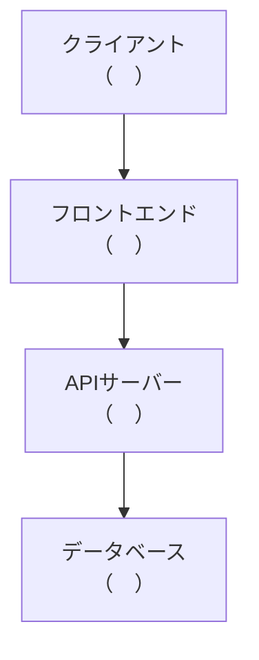
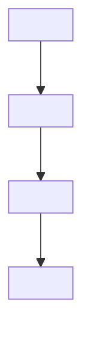
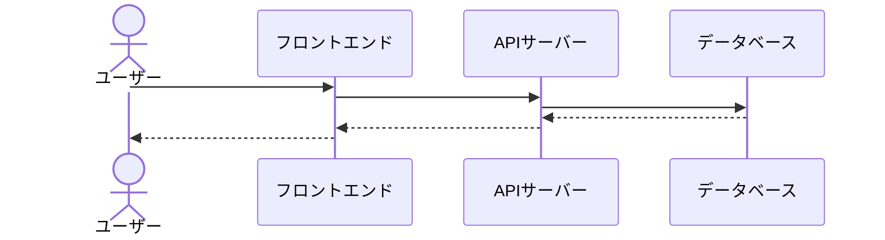
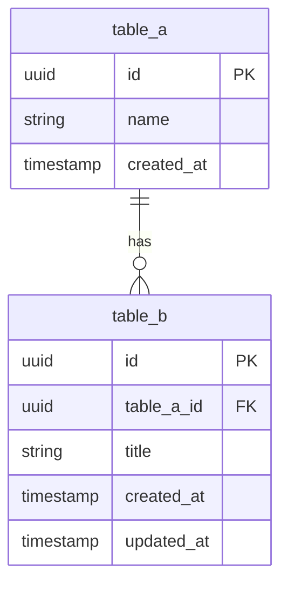
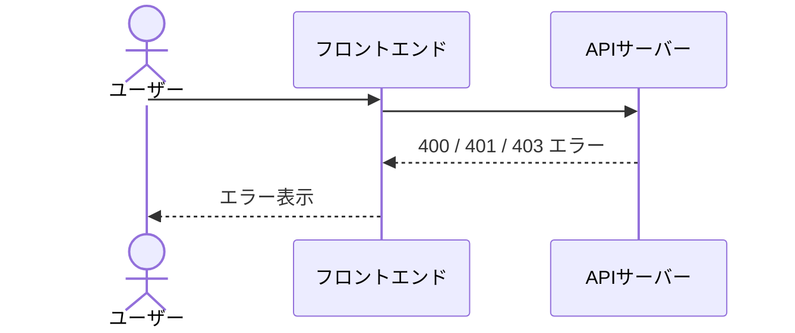
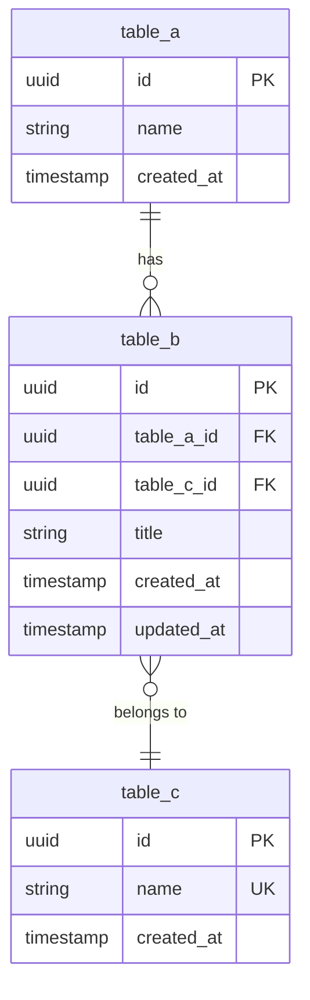

# 設計仕様書テンプレート

## 概要

このファイルは、SDD（仕様書駆動開発）の設計フェーズで使用する **実用テンプレート** です。プロジェクトの `specs/` ディレクトリにコピーして、各セクションを記入してください。

設計フェーズでは、プロジェクト規模に応じて最大3つの仕様書を作成します。

| 仕様書 | 用途 | コピー先 |
|---|---|---|
| `design.md` | アーキテクチャ・技術選定・コンポーネント設計 | `specs/design.md` |
| `data-model.md` | ER図・テーブル定義・リレーション | `specs/data-model.md` |
| `contracts/*.md` | APIエンドポイント定義 | `specs/contracts/*.md` |

書き方の詳細な解説やアンチパターンについては、[設計フェーズガイド（guide.md）](./guide.md) を参照してください。

## 目次

- [使い方](#使い方)
- [テンプレート（Medium - 推奨）](#テンプレートmedium---推奨)
- [テンプレート（Small - 個人プロジェクト向け）](#テンプレートsmall---個人プロジェクト向け)
- [テンプレート（Large - ステークホルダー合意向け）](#テンプレートlarge---ステークホルダー合意向け)
- [参考: 記入のコツ](#参考-記入のコツ)

---

## 使い方

### 1. 規模を選ぶ

| 規模 | 対象 | 作成する仕様書 |
|---|---|---|
| **Small** | 個人プロジェクト・1人開発 | `design.md` のみ（簡易版） |
| **Medium（推奨）** | 2〜5人のチーム開発 | `design.md` + `data-model.md` + `contracts/*.md` |
| **Large** | ステークホルダーとの合意が必要なプロジェクト | 全仕様書の詳細版 |

### 2. テンプレートをコピーする

該当する規模のテンプレートセクションをコピーし、プロジェクトの `specs/` ディレクトリに配置してください。

### 3. 各セクションを記入する

`<!-- ... -->` のコメントに従って記入してください。記入が終わったらコメントは削除して構いません。Mermaid図の枠は残して、内容を書き換えてください。

### 4. Gate2 チェックリストで確認する

テンプレート末尾のチェックリストで品質を確認し、全項目を満たしたらタスク分割フェーズに進みます。

---

## テンプレート（Medium - 推奨）

2〜5人のチーム開発向けの標準テンプレートです。

### design.md テンプレート

````markdown
# [プロジェクト名] — design.md

## アーキテクチャ概要

<!-- システム全体の構成を図示する。主要コンポーネントとその接続を含める -->



<!-- 図を補足する1〜3文の説明。なぜこのアーキテクチャを選んだかの理由を含める -->

理由:
-
-
-

## 技術選定

<!-- 各技術に必ず選定理由を書く。理由のない技術選定はレビュー不可 -->

| カテゴリ | 技術 | 選定理由 |
|---|---|---|
| フロントエンド |  |  |
| バックエンド |  |  |
| データベース |  |  |
| インフラ |  |  |
| テスト |  |  |

### 候補として検討した技術

<!-- レビュアーが「なぜXを使わないのか？」と質問しなくて済むようにする -->

| 技術 | 不採用理由 |
|---|---|
|  |  |
|  |  |

## コンポーネント設計

<!-- コンポーネント間の依存関係を図示する -->



### コンポーネント一覧

<!-- 各コンポーネントの責務と入出力を定義する。抽象度を統一すること -->

| コンポーネント | 責務 | 入力 | 出力 |
|---|---|---|---|
|  |  |  |  |
|  |  |  |  |
|  |  |  |  |

## データフロー

<!-- 主要な処理フローを1〜3個選んで記述する。すべてのフローを書く必要はない -->

### [処理名1]



## エラーハンドリング方針

<!-- エラー分類と処理戦略を統一する -->

| エラー分類 | HTTPステータス | 処理戦略 | ユーザーへの表示 |
|---|---|---|---|
| バリデーションエラー | 400 |  |  |
| 認証エラー | 401 |  |  |
| 認可エラー | 403 |  |  |
| リソース未検出 | 404 |  |  |
| サーバーエラー | 500 |  |  |

### エラーレスポンス共通フォーマット

```json
{
  "error": {
    "code": "ERROR_CODE",
    "message": "エラーメッセージ",
    "details": []
  }
}
```

## テスト戦略

| テスト種類 | 対象 | ツール | 優先度 |
|---|---|---|---|
| 単体テスト |  |  | 高 |
| 統合テスト |  |  | 高 |
| E2Eテスト |  |  | 中 |

### カバレッジ目標

| 対象 | 目標カバレッジ |
|---|---|
|  |  |

## 制約事項

### セキュリティ

<!-- 認証方式、データ保護、CORS設定などの制約 -->

-
-

### パフォーマンス

<!-- レスポンスタイム、同時接続数、データ量の制約 -->

-
-

### 互換性

<!-- 対応ブラウザ、ランタイムバージョン、API互換性の制約 -->

-
-
````

### data-model.md テンプレート

````markdown
# [プロジェクト名] — data-model.md

## ER図

<!-- テーブル間のリレーションを可視化する -->



## テーブル定義

### [テーブル名1]

| カラム名 | 型 | 制約 | デフォルト | 説明 |
|---|---|---|---|---|
| id | UUID | PK | gen_random_uuid() | 一意識別子 |
|  |  |  |  |  |
| created_at | TIMESTAMP | NOT NULL | CURRENT_TIMESTAMP | 作成日時 |
| updated_at | TIMESTAMP | NOT NULL | CURRENT_TIMESTAMP | 更新日時 |

### [テーブル名2]

| カラム名 | 型 | 制約 | デフォルト | 説明 |
|---|---|---|---|---|
| id | UUID | PK | gen_random_uuid() | 一意識別子 |
|  |  |  |  |  |
| created_at | TIMESTAMP | NOT NULL | CURRENT_TIMESTAMP | 作成日時 |
| updated_at | TIMESTAMP | NOT NULL | CURRENT_TIMESTAMP | 更新日時 |

## リレーション定義

| 親テーブル | 子テーブル | 関係 | ON DELETE |
|---|---|---|---|
|  |  |  |  |

### 補足

<!-- カスケード削除や外部キー制約の振る舞いを文章で補足する -->

-
````

### contracts/*.md テンプレート

````markdown
# [ドメイン名] API契約書

## エンドポイント一覧

| メソッド | パス | 概要 | 認証 |
|---|---|---|---|
| GET | /api/[resources] | 一覧取得 | 要 |
| GET | /api/[resources]/:id | 詳細取得 | 要 |
| POST | /api/[resources] | 新規作成 | 要 |
| PUT | /api/[resources]/:id | 更新 | 要 |
| DELETE | /api/[resources]/:id | 削除 | 要 |

---

## エンドポイント詳細

### GET /api/[resources]

**概要**: <!-- 何を取得するか -->

**リクエスト**:

| パラメータ | 位置 | 型 | 必須 | 説明 |
|---|---|---|---|---|
| page | query | integer | × | ページ番号（デフォルト: 1） |
| limit | query | integer | × | 1ページあたり件数（デフォルト: 20） |
|  |  |  |  |  |

**レスポンス（200 OK）**:

```json
{
  "data": [...],
  "pagination": {
    "page": 1,
    "limit": 20,
    "total": 0,
    "totalPages": 0
  }
}
```

**エラーレスポンス**:

| ステータス | コード | 条件 |
|---|---|---|
| 401 | UNAUTHORIZED | 認証トークンが無効 |

### POST /api/[resources]

**概要**: <!-- 何を作成するか -->

**リクエストボディ**:

```json
{

}
```

**レスポンス（201 Created）**:

```json
{
  "data": {

  }
}
```

**エラーレスポンス**:

| ステータス | コード | 条件 |
|---|---|---|
| 400 | VALIDATION_ERROR | バリデーションエラー |
| 401 | UNAUTHORIZED | 認証トークンが無効 |

### PUT /api/[resources]/:id

**概要**: <!-- 何を更新するか -->

**リクエストボディ**:

```json
{

}
```

**レスポンス（200 OK）**: 更新されたリソースオブジェクト

**エラーレスポンス**:

| ステータス | コード | 条件 |
|---|---|---|
| 400 | VALIDATION_ERROR | バリデーションエラー |
| 401 | UNAUTHORIZED | 認証トークンが無効 |
| 403 | FORBIDDEN | 権限不足 |
| 404 | NOT_FOUND | リソースが存在しない |

### DELETE /api/[resources]/:id

**概要**: <!-- 何を削除するか -->

**レスポンス（204 No Content）**: レスポンスボディなし

**エラーレスポンス**:

| ステータス | コード | 条件 |
|---|---|---|
| 401 | UNAUTHORIZED | 認証トークンが無効 |
| 403 | FORBIDDEN | 権限不足 |
| 404 | NOT_FOUND | リソースが存在しない |
````

### Gate2 レビューチェックリスト

```markdown
## Gate2 レビューチェックリスト

- [ ] アーキテクチャ概要がMermaid図で可視化されている
- [ ] 技術選定に「なぜその技術を選んだか」の理由が書かれている
- [ ] コンポーネント間の依存関係が定義されている
- [ ] 主要なデータフローがsequenceDiagramで可視化されている
- [ ] エラーハンドリング方針が定義されている
- [ ] requirements.md の各機能要件が設計でカバーされている
- [ ] 非機能要件（パフォーマンス、セキュリティ）が考慮されている
- [ ] data-model.md のER図とテーブル定義が正しい（DB使用時）
- [ ] contracts/ のエンドポイント定義がrequirements.mdと整合している（API開発時）
- [ ] AIが設計書だけで実装を始められる粒度になっている
```

---

## テンプレート（Small - 個人プロジェクト向け）

個人プロジェクト向けの軽量テンプレートです。`design.md` のみで完結します。

### design.md テンプレート（簡易版）

````markdown
# [プロジェクト名] — design.md

## アーキテクチャ概要

<!-- 構成を1〜2文で説明する -->

## 技術選定

| カテゴリ | 技術 | 選定理由 |
|---|---|---|
|  |  |  |
|  |  |  |
|  |  |  |

## 制約事項

<!-- 主要な制約のみ箇条書き -->

-
-
````

### Gate2 セルフチェック

```markdown
## Gate2 セルフチェック

- [ ] アーキテクチャ構成が決まっている
- [ ] 使用する主要技術に選定理由がある
- [ ] 要件定義の各機能が設計でカバーされている
- [ ] 読み返して「どう作るか」が自分で理解できる
```

---

## テンプレート（Large - ステークホルダー合意向け）

5人以上のチームや、ステークホルダーとの合意文書が必要なプロジェクト向けのテンプレートです。

### design.md テンプレート（フル版）

````markdown
# [プロジェクト名] — design.md

## アーキテクチャ概要

<!-- システム全体の構成を図示する -->


<!-- 構成の説明と選定理由 -->

### アーキテクチャ選定の根拠

<!-- 候補アーキテクチャとの比較を記載する -->

| アーキテクチャ | メリット | デメリット | 採用判断 |
|---|---|---|---|
|  |  |  | ✅ 採用 |
|  |  |  | ❌ 不採用 |

**選定理由**: <!-- なぜこのアーキテクチャを選んだか -->

## 技術選定

| カテゴリ | 技術 | 選定理由 |
|---|---|---|
| フロントエンド |  |  |
| バックエンド |  |  |
| データベース |  |  |
| キャッシュ |  |  |
| メッセージキュー |  |  |
| インフラ |  |  |
| CI/CD |  |  |
| 監視 |  |  |
| テスト |  |  |

### 候補として検討した技術

| 技術 | 不採用理由 |
|---|---|
|  |  |
|  |  |

### 比較検証結果

<!-- PoC や ベンチマーク結果があれば記載する -->

## コンポーネント設計


### コンポーネント一覧

| コンポーネント | 責務 | 入力 | 出力 | 対応要件 |
|---|---|---|---|---|
|  |  |  |  | FR-XX |
|  |  |  |  | FR-XX |

### インターフェース定義

<!-- 各コンポーネントの公開インターフェースを定義する -->

#### [コンポーネント名]

```typescript
interface [ComponentName] {
  // メソッドシグネチャ
}
```

## データフロー

<!-- 主要な処理フローとエラーフローの両方を記述する -->

### [正常フロー1]


### [エラーフロー1]



## エラーハンドリング方針

| エラー分類 | HTTPステータス | 処理戦略 | ユーザーへの表示 |
|---|---|---|---|
| バリデーションエラー | 400 |  |  |
| 認証エラー | 401 |  |  |
| 認可エラー | 403 |  |  |
| リソース未検出 | 404 |  |  |
| 競合 | 409 |  |  |
| レート制限 | 429 |  |  |
| サーバーエラー | 500 |  |  |

### エラーレスポンス共通フォーマット

```json
{
  "error": {
    "code": "ERROR_CODE",
    "message": "エラーメッセージ",
    "details": []
  }
}
```

### リトライ戦略

<!-- 外部サービスへのリトライ方針を定義する -->

| 対象 | リトライ回数 | 間隔 | バックオフ |
|---|---|---|---|
|  |  |  |  |

## テスト戦略

| テスト種類 | 対象 | ツール | 優先度 |
|---|---|---|---|
| 単体テスト |  |  | 高 |
| 統合テスト |  |  | 高 |
| E2Eテスト |  |  | 中 |
| パフォーマンステスト |  |  | 低 |

### カバレッジ目標

| 対象 | 目標カバレッジ |
|---|---|
|  |  |

### CI/CD連携

<!-- テストの実行タイミングと自動化方針 -->

-
-

## 制約事項

### セキュリティ

-
-

#### 対応方針

<!-- 各セキュリティ制約への具体的な対応方針 -->

### パフォーマンス

-
-

#### 対応方針

<!-- 各パフォーマンス制約への具体的な対応方針 -->

### 互換性

-
-
````

### data-model.md テンプレート（インデックス・マイグレーション含む）

````markdown
# [プロジェクト名] — data-model.md

## ER図



## テーブル定義

### [テーブル名1]

| カラム名 | 型 | 制約 | デフォルト | 説明 |
|---|---|---|---|---|
| id | UUID | PK | gen_random_uuid() | 一意識別子 |
|  |  |  |  |  |
| created_at | TIMESTAMP | NOT NULL | CURRENT_TIMESTAMP | 作成日時 |
| updated_at | TIMESTAMP | NOT NULL | CURRENT_TIMESTAMP | 更新日時 |

### [テーブル名2]

| カラム名 | 型 | 制約 | デフォルト | 説明 |
|---|---|---|---|---|
| id | UUID | PK | gen_random_uuid() | 一意識別子 |
|  |  |  |  |  |
| created_at | TIMESTAMP | NOT NULL | CURRENT_TIMESTAMP | 作成日時 |
| updated_at | TIMESTAMP | NOT NULL | CURRENT_TIMESTAMP | 更新日時 |

### [テーブル名3]

| カラム名 | 型 | 制約 | デフォルト | 説明 |
|---|---|---|---|---|
| id | UUID | PK | gen_random_uuid() | 一意識別子 |
|  |  |  |  |  |
| created_at | TIMESTAMP | NOT NULL | CURRENT_TIMESTAMP | 作成日時 |

## リレーション定義

| 親テーブル | 子テーブル | 関係 | ON DELETE |
|---|---|---|---|
|  |  |  |  |
|  |  |  |  |

### 補足

-
-

## インデックス戦略

| テーブル | カラム | インデックス種別 | 根拠 |
|---|---|---|---|
|  |  |  |  |
|  |  |  |  |

## マイグレーション戦略

### マイグレーションツール

<!-- 使用するマイグレーションツールとその理由 -->

### バージョン管理方針

- マイグレーションファイルは `migrations/` ディレクトリに格納
- ファイル名は `YYYYMMDDHHMMSS_description.sql` の形式
- ロールバックスクリプトも必ず作成する

### 初期マイグレーション順序

<!-- テーブルの依存関係に基づく作成順序 -->

1.
2.
3.
````

### contracts/*.md テンプレート（認証・ページネーション含む）

````markdown
# [ドメイン名] API契約書

## 共通仕様

### 認証方式

<!-- Bearer Token / Session / API Key など -->

**認証ヘッダー**:

```
Authorization: Bearer <token>
```

### 認可ルール

| エンドポイント | 必要な権限 | 補足 |
|---|---|---|
|  |  |  |
|  |  |  |

### ページネーション

**共通パラメータ**:

| パラメータ | 型 | デフォルト | 最大値 | 説明 |
|---|---|---|---|---|
| page | integer | 1 | — | ページ番号 |
| limit | integer | 20 | 100 | 1ページあたりの件数 |

**レスポンスフォーマット**:

```json
{
  "data": [...],
  "pagination": {
    "page": 1,
    "limit": 20,
    "total": 0,
    "totalPages": 0
  }
}
```

### フィルタリング・ソート

| パラメータ | 型 | 説明 | 例 |
|---|---|---|---|
| sort | string | ソートフィールド | `sort=created_at` |
| order | string | ソート順（asc/desc） | `order=desc` |

### エラーレスポンス共通フォーマット

```json
{
  "error": {
    "code": "ERROR_CODE",
    "message": "エラーメッセージ",
    "details": []
  }
}
```

---

## エンドポイント一覧

| メソッド | パス | 概要 | 認証 |
|---|---|---|---|
| GET | /api/[resources] | 一覧取得 | 要 |
| GET | /api/[resources]/:id | 詳細取得 | 要 |
| POST | /api/[resources] | 新規作成 | 要 |
| PUT | /api/[resources]/:id | 更新 | 要 |
| DELETE | /api/[resources]/:id | 削除 | 要 |

---

## エンドポイント詳細

### GET /api/[resources]

**概要**: <!-- 何を取得するか -->

**リクエスト**:

| パラメータ | 位置 | 型 | 必須 | 説明 |
|---|---|---|---|---|
| page | query | integer | × | ページ番号（デフォルト: 1） |
| limit | query | integer | × | 1ページあたり件数（デフォルト: 20） |
|  |  |  |  |  |

**レスポンス（200 OK）**:

```json
{
  "data": [
    {

    }
  ],
  "pagination": {
    "page": 1,
    "limit": 20,
    "total": 0,
    "totalPages": 0
  }
}
```

**エラーレスポンス**:

| ステータス | コード | 条件 |
|---|---|---|
| 401 | UNAUTHORIZED | 認証トークンが無効 |

### POST /api/[resources]

**概要**: <!-- 何を作成するか -->

**リクエストボディ**:

```json
{

}
```

**レスポンス（201 Created）**:

```json
{
  "data": {

  }
}
```

**エラーレスポンス**:

| ステータス | コード | 条件 |
|---|---|---|
| 400 | VALIDATION_ERROR | バリデーションエラー |
| 401 | UNAUTHORIZED | 認証トークンが無効 |

### PUT /api/[resources]/:id

**概要**: <!-- 何を更新するか -->

**リクエストボディ**:

```json
{

}
```

**レスポンス（200 OK）**: 更新されたリソースオブジェクト

**エラーレスポンス**:

| ステータス | コード | 条件 |
|---|---|---|
| 400 | VALIDATION_ERROR | バリデーションエラー |
| 401 | UNAUTHORIZED | 認証トークンが無効 |
| 403 | FORBIDDEN | 権限不足 |
| 404 | NOT_FOUND | リソースが存在しない |

### DELETE /api/[resources]/:id

**概要**: <!-- 何を削除するか -->

**レスポンス（204 No Content）**: レスポンスボディなし

**エラーレスポンス**:

| ステータス | コード | 条件 |
|---|---|---|
| 401 | UNAUTHORIZED | 認証トークンが無効 |
| 403 | FORBIDDEN | 権限不足 |
| 404 | NOT_FOUND | リソースが存在しない |
````

### Gate2 フォーマルレビューチェックリスト

```markdown
## Gate2 フォーマルレビューチェックリスト

### 基本チェック（Medium相当）

- [ ] アーキテクチャ概要がMermaid図で可視化されている
- [ ] 技術選定に「なぜその技術を選んだか」の理由が書かれている
- [ ] コンポーネント間の依存関係が定義されている
- [ ] 主要なデータフローがsequenceDiagramで可視化されている
- [ ] エラーハンドリング方針が定義されている
- [ ] requirements.md の各機能要件が設計でカバーされている
- [ ] 非機能要件（パフォーマンス、セキュリティ）が考慮されている

### Large 追加チェック

- [ ] アーキテクチャ選定に候補との比較検証結果が含まれている
- [ ] コンポーネント設計にインターフェース定義が含まれている
- [ ] 全主要フローとエラーフローが可視化されている
- [ ] テスト戦略にカバレッジ目標とCI/CD連携方針が設定されている
- [ ] インデックス戦略が定義されている（DB使用時）
- [ ] マイグレーション戦略が定義されている（DB使用時）
- [ ] API契約書に認証・ページネーション仕様が含まれている（API開発時）
- [ ] セキュリティ・パフォーマンスの制約と対応方針が記載されている
- [ ] テックリード / アーキテクトの承認を得ている
```

---

## 参考: 記入のコツ

テンプレートを記入する際に役立つポイントをまとめます。詳細は [設計フェーズガイド（guide.md）](./guide.md) を参照してください。

### アーキテクチャの選び方

- **規模に合った最もシンプルな構成** を選ぶ（5人以下のチームでマイクロサービスは過剰）
- 「なぜこの構成か」の理由を必ず書く
- 将来の拡張方針があれば、分割基準とともに記載する

### 技術選定のポイント

- すべての技術に **1行以上の選定理由** を書く
- **不採用技術** と不採用理由も記載する（レビュアーの質問を先回り）
- チームの経験・スキルセットも選定理由として有効

### Mermaid図の使い分け

| 図表 | 用途 |
|---|---|
| `flowchart` | アーキテクチャ概要、コンポーネント依存関係 |
| `sequenceDiagram` | データフロー、API呼び出しフロー |
| `erDiagram` | テーブル関係、カラム定義 |

### よくあるアンチパターン

| パターン | 問題 | 対策 |
|---|---|---|
| 過剰設計 | 開発速度低下・運用コスト増大 | 要件の規模に合った最もシンプルな構成を選ぶ |
| 要件との断絶 | スコープクリープ・漏れ | 各コンポーネントが対応する機能要件を明記する |
| 理由なき技術選定 | レビュー不可能 | すべての技術に選定理由を書く |
| 抽象度の不統一 | AI実装の品質にばらつき | 全コンポーネントを同じ粒度で記述する |
| 曖昧な設計 | AIが推測で実装 | 具体的なテーブル・JSON例・コードスニペットで明確にする |
