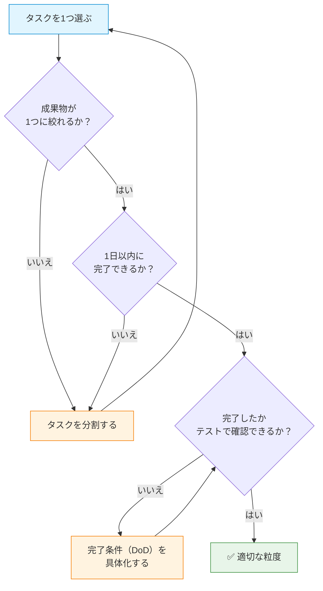
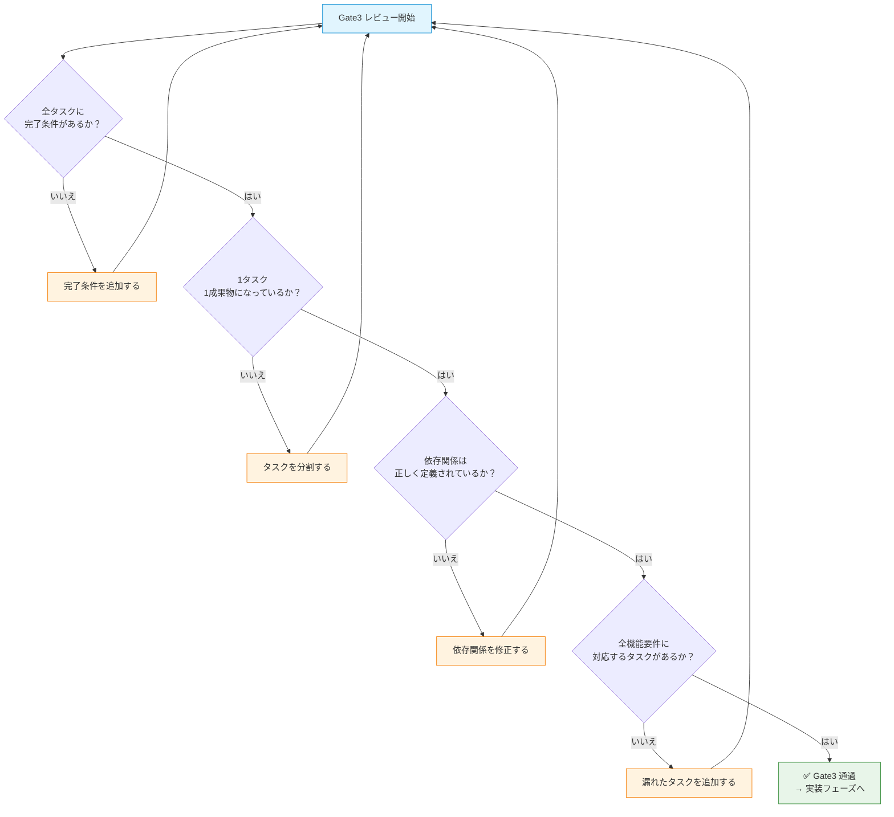

# タスク分割フェーズ — 「どう分割するか」を計画する

## 概要

タスク分割フェーズは、SDD（仕様書駆動開発）の **第3フェーズ** です。設計フェーズで決めた「どう作るか」をもとに、AIが実装できる粒度の **タスク一覧（`tasks.md`）** を作成します。

このガイドでは、以下を学べます。

- `tasks.md` のテンプレートと各セクションの書き方
- タスクの粒度・DoD（完了条件）・依存関係の実践的な定義方法
- プロジェクト規模に応じた書き分け方
- Gate3（レビューゲート）の通過基準
- 具体例（Todoアプリ）による完成形イメージ
- よくあるアンチパターンとその回避方法

### なぜタスク分割が設計の後なのか？

タスクを分割するには、**「何を作るか（要件）」と「どう作るか（設計）」の両方が決まっている必要があります**。設計前にタスクを切ると、アーキテクチャの変更によってタスク一覧が丸ごと無効になります。設計が決まって初めて、「どのコンポーネントを」「どの順番で」実装すべきかが見えてきます。

> **タスク分割の品質 = AIが迷わず実装できるかどうかの決め手**

タスクが曖昧だと、AIは「何を完成させればよいか」を自分で判断し、意図しない実装や不完全な実装を行います。1タスク・1成果物・1完了条件の原則を守ることで、AIへの指示を確実に伝えられます。

## 目次

- [tasks.md の構成テンプレート](#tasksmd-の構成テンプレート)
  - [タスク概要サマリ](#タスク概要サマリ)
  - [タスク一覧テーブル](#タスク一覧テーブル)
  - [T-XX タスク詳細](#t-xx-タスク詳細)
  - [依存関係マップ](#依存関係マップ)
- [書き方の実践ガイド](#書き方の実践ガイド)
  - [タスク粒度の決め方](#タスク粒度の決め方)
  - [DoD（完了条件）の書き方](#dod完了条件の書き方)
  - [依存関係の定義方法](#依存関係の定義方法)
  - [AIに渡せる粒度基準](#aiに渡せる粒度基準)
  - [なぜ「書き方」にこだわるか？](#なぜ書き方にこだわるか)
- [規模別の書き分け](#規模別の書き分け)
  - [Small（個人）](#small個人)
  - [Medium（チーム）](#mediumチーム)
  - [Large（組織横断）](#large組織横断)
  - [なぜ規模で書き分けるか？](#なぜ規模で書き分けるか)
- [Gate3 チェックリスト](#gate3-チェックリスト)
  - [チェック項目](#チェック項目)
  - [Gate3 通過の判断フロー](#gate3-通過の判断フロー)
  - [なぜ Gate3 が重要か？](#なぜ-gate3-が重要か)
- [具体例: Todo アプリの tasks.md](#具体例-todo-アプリの-tasksmd)
- [アンチパターン](#アンチパターン)
  - [1. 粒度が大きすぎるタスク](#1-粒度が大きすぎるタスク)
  - [2. 完了条件の欠如](#2-完了条件の欠如)
  - [3. 依存関係の未定義](#3-依存関係の未定義)
  - [4. 要件との断絶](#4-要件との断絶)
  - [5. 実装手順の混入](#5-実装手順の混入)
- [次のステップ](#次のステップ)

---

## tasks.md の構成テンプレート

以下は `tasks.md` の標準テンプレートです。各セクションをコピーして、プロジェクトに合わせて記入してください。

### なぜテンプレートを使うのか？

タスク分割は「設計を実装単位に落とし込む」作業であり、抜け漏れが発生しやすい工程です。テンプレートを使うことで、必要なセクション（概要・一覧・詳細・依存関係）の記載漏れを防ぎ、AIが参照する際も一貫したフォーマットで情報を提供できます。

| セクション | 必須/任意 | 目的 |
|---|---|---|
| タスク概要サマリ | 必須 | フェーズ全体の目標と完了基準を30秒で把握できるようにする |
| タスク一覧テーブル | 必須 | タスクの全体像・優先度・担当・見積もりを一覧で確認できるようにする |
| T-XX タスク詳細 | 必須 | AIが追加の質問なしに実装を開始できる粒度でタスクを定義する |
| 依存関係マップ | 必須 | タスク間の実行順序を可視化し、並行作業を最大化する |

### タスク概要サマリ

```markdown
## タスク概要サマリ

- **総タスク数**: XX件
- **優先度 Must**: XX件 / **Should**: XX件 / **Could**: XX件
- **実装フェーズの目標**: [このタスク一覧が完了したら何が達成されるかを1文で]
- **参照仕様書**:
  - `specs/requirements.md` — 要件定義
  - `specs/design.md` — 設計仕様書
  - `specs/data-model.md` — データモデル（該当する場合）
```

### タスク一覧テーブル

```markdown
## タスク一覧

| ID | タスク名 | 優先度 | 依存 | 見積 | 担当 | 状態 |
|---|---|---|---|---|---|---|
| T-01 | [タスク名] | Must | — | S | — | 未着手 |
| T-02 | [タスク名] | Must | T-01 | M | — | 未着手 |
| T-03 | [タスク名] | Must | T-01, T-02 | M | — | 未着手 |
| T-04 | [タスク名] | Should | T-03 | L | — | 未着手 |
```

**見積もりサイズの目安**:

| サイズ | 説明 | 目安時間 |
|---|---|---|
| S（Small） | 単一ファイルの変更・単純な追加 | 1〜2時間 |
| M（Medium） | 複数ファイルにまたがる実装 | 半日〜1日 |
| L（Large） | 複数コンポーネントを含む複雑な実装 | 2〜3日 |

### T-XX タスク詳細

```markdown
## T-01: [タスク名]

**目的**: このタスクで何を達成するかを1文で記述する

**成果物**:
- [具体的なファイル・機能・動作の成果物を箇条書きで]

**完了条件（DoD）**:
- [ ] [テスト可能・確認可能な完了基準を箇条書きで]
- [ ] [「〜できる」「〜が表示される」「〜が返却される」の形式で書く]

**受け入れテスト**:
- ケース1: [具体的な操作] → [期待される結果]
- ケース2: [具体的な操作] → [期待される結果]

**参照要件**: FR-XX（requirements.md）
**参照設計**: [design.md の該当セクション]
**依存タスク**: T-XX（[依存理由]）

**実装ガイド**:
[どのファイルを編集するか、どのコンポーネントを使うかなど、方向性を示す補足]
```

### 依存関係マップ

依存関係マップは `flowchart LR`（左から右）で描き、タスクの実行順序を可視化します。

```markdown
## 依存関係マップ

​```mermaid
flowchart LR
    T01["T-01\nDBスキーマ"] --> T02["T-02\nRepository"]
    T01 --> T03["T-03\nService"]
    T02 --> T03
    T03 --> T04["T-04\nUI実装"]

    style T01 fill:#e1f5fe,stroke:#0288d1
    style T02 fill:#fff3e0,stroke:#f57c00
    style T03 fill:#fff3e0,stroke:#f57c00
    style T04 fill:#e8f5e9,stroke:#388e3c
​```
```

**色の使い分け**:

| 色 | 意味 |
|---|---|
| `#e1f5fe`（水色） | 開始タスク（依存なし） |
| `#fff3e0`（オレンジ） | 中間タスク（依存あり・後続あり） |
| `#e8f5e9`（緑） | 完了タスク（後続なし） |

---

## 書き方の実践ガイド

テンプレートの各セクションを **効果的に** 書くためのガイドです。良い例と悪い例を対比しながら、実践的なテクニックを紹介します。

### タスク粒度の決め方

タスクは「**1タスク = 1つの明確な成果物**」の原則で分割します。以下のフローチャートに沿って、各タスクの粒度を判断してください。



**粒度判断の3つの基準**:

1. **成果物が1つ**: 「APIエンドポイント実装」と「UIコンポーネント実装」は別タスク
2. **1日以内**: 3日かかるタスクは、1日ずつに分割できないか確認する
3. **テスト可能**: 「完了した」と判断できる具体的な基準がある

### DoD（完了条件）の書き方

DoDは「このタスクが完了したと判断できる客観的な基準」です。曖昧な完了条件はAIの迷走を招きます。

<!-- 悪い例 -->
```markdown
❌ 悪い例:
**完了条件**:
- [ ] Todo機能を実装する
- [ ] テストを書く
```

この例では、「実装する」が何を意味するか不明で、「テストを書く」がどの範囲かも分かりません。

<!-- 良い例 -->
```markdown
✅ 良い例:
**完了条件（DoD）**:
- [ ] `POST /api/todos` で Todo を作成できる（タイトル必須・説明任意）
- [ ] タイトルが空の場合、400エラーとエラーメッセージが返却される
- [ ] 作成した Todo が Todo 一覧に表示される
- [ ] TodoService の単体テストが全件パスしている
```

**ポイント**:

- 「〜できる」「〜が表示される」「〜が返却される」の形式で具体的に書く
- エラーケースのDoDも含める（正常系だけでは不完全）
- テストのDoDは「全件パス」など定量的に書く

### 依存関係の定義方法

依存関係は「タスクBを開始するにはタスクAが完了している必要がある」関係です。依存を明示することで、実装の順序を明確にし、並行作業を最大化できます。

<!-- 悪い例 -->
```markdown
❌ 悪い例:
| ID | タスク名 | 依存 |
|---|---|---|
| T-01 | DBスキーマ定義 | — |
| T-02 | Todo CRUD実装 | — |
| T-03 | Todo UIコンポーネント実装 | — |
```

依存が未定義のため、T-02をT-01より先に始めてしまい、スキーマがない状態でCRUDを実装するミスが起きます。

<!-- 良い例 -->
```markdown
✅ 良い例:
| ID | タスク名 | 依存 |
|---|---|---|
| T-01 | DBスキーマ定義 | — |
| T-02 | Todo CRUD実装 | T-01 |
| T-03 | Todo UIコンポーネント実装 | T-01, T-02 |
```

**依存関係の種類**:

| 種類 | 説明 | 例 |
|---|---|---|
| 技術的依存 | 前のタスクの成果物が必要 | DBスキーマがないとRepositoryが実装できない |
| ロジック依存 | 前のタスクの仕様が確定してから設計できる | Service層の実装にはRepository層のインターフェースが必要 |
| UI依存 | バックエンドのAPIが完成してからUIを実装する | API完成前にUIのE2Eテストは書けない |

### AIに渡せる粒度基準

AIにタスクを渡す際の判断基準は「**このタスク詳細だけを読んだAIが、追加の質問なしに実装を始められるか？**」です。

以下の観点で確認してください。

| 観点 | チェック内容 |
|---|---|
| 目的が明確か | 「何のために」「何を」実装するかが1文で分かる |
| 成果物が具体的か | 「どのファイルに」「どの機能を」追加するかが分かる |
| 完了条件が客観的か | 実装後に「完了した」を機械的に判断できる |
| 参照情報が揃っているか | 要件・設計書の参照先が明記されている |
| 依存が明示されているか | 「何が完了していれば」実装を開始できるかが分かる |

### なぜ「書き方」にこだわるか？

タスク一覧は、AIへの実装指示の **最後のインターフェース** です。要件・設計フェーズで積み上げた仕様を、AIが実行可能な単位に変換するのがこのフェーズの役割です。

タスクの曖昧さは、AIの「推測実装」を誘発します。AIは指示が不明確なとき、「おそらくこういう意味だろう」と補完し、意図しないコードを生成します。逆に、完了条件が明確なタスクはAIの出力を検証可能にし、レビューの効率を高めます。

**良いタスク一覧 = AIに正確に指示できる = 実装品質の安定化** です。

---

## 規模別の書き分け

プロジェクトの規模によって、`tasks.md` に求められる詳細度が変わります。個人プロジェクトと組織横断開発では、必要な記載粒度が大きく異なります。

| セクション | Small（個人） | Medium（チーム） | Large（組織横断） |
|---|---|---|---|
| タスク概要サマリ | 省略可 | 総タスク数・目標 | 総タスク数・目標・フェーズ分け |
| タスク一覧 | 箇条書きチェックリスト | テーブル形式（優先度・依存・見積） | テーブル形式（担当者ロール・ポイント見積・リスク） |
| タスク詳細 | 成果物 + 完了条件のみ | 成果物・DoD・受け入れテスト・実装ガイド | 全セクション + リスク・前提条件 |
| 依存関係マップ | 省略可（3タスク以下） | Mermaid LR図 | Mermaid LR図 + クリティカルパスの明示 |

### Small（個人）

個人プロジェクトでは、**自分自身が次に何をするかを把握する** ためのチェックリストとして最小限のタスクを記述します。

```markdown
## タスク一覧

- [ ] T-01: DBスキーマ定義（マイグレーション含む）
  - users・todosテーブルのマイグレーションが実行できること
- [ ] T-02: Todo CRUD API実装
  - 作成・取得・更新・削除のAPIエンドポイントが動作すること
- [ ] T-03: Todo一覧・作成UI実装
  - ブラウザでTodoを作成・一覧表示できること
- [ ] T-04: 完了/期限機能の実装
  - チェックボックスで完了切り替え、カレンダーで期限設定できること
```

### Medium（チーム）

チーム開発では、**メンバー間の実装順序と担当を揃える** ために、テーブル形式と詳細セクションを使います。Mediumの完成形は [具体例: Todoアプリの tasks.md](#具体例-todo-アプリの-tasksmd) を参照してください。

### Large（組織横断）

大規模プロジェクトでは、**複数チームをまたいだ調整** のために、担当者ロール・ポイント見積もり・リスクを追加します。

```markdown
## タスク一覧

| ID | タスク名 | 優先度 | 依存 | ポイント | 担当ロール | リスク | 状態 |
|---|---|---|---|---|---|---|---|
| T-01 | DBスキーマ定義 | Must | — | 3 | バックエンド | DBの変更が他チームに影響する可能性 | 未着手 |
| T-02 | Todo CRUD API | Must | T-01 | 5 | バックエンド | — | 未着手 |
| T-03 | Todo UI実装 | Must | T-02 | 8 | フロントエンド | デザインシステムとの統合で遅延リスク | 未着手 |
```

**ポイント見積もり（フィボナッチ数列）**:

| ポイント | 規模感 |
|---|---|
| 1 | 設定変更・文言修正など |
| 2 | 単一ファイルの軽微な変更 |
| 3 | 単一コンポーネントの追加・修正 |
| 5 | 複数ファイルにまたがる実装 |
| 8 | 複数コンポーネントを含む機能実装 |
| 13 | 大規模な機能追加（分割を推奨） |

### なぜ規模で書き分けるか？

タスク一覧のコストは「読み手の数」と「実装者の分散度」に比例して正当化されます。個人プロジェクトで詳細なタスク書を書くと、タスク管理自体が目的化し、実装が進みません。逆に、5人以上のチームでチェックリストだけでは、タスクの取り違えや実装漏れが多発します。

**書く量は「実装者が追加の確認なしに正しい実装を開始できるか」で決めます。** 実装者が自分だけなら最小限で十分であり、実装者が多く分散しているほど詳細が必要です。

---

## Gate3 チェックリスト

Gate3は、タスク分割フェーズから実装フェーズに進む前の **第3のレビューゲート** です。以下のチェックリストを使って、`tasks.md` の品質を確認します。

> READMEでは Gate3 の確認事項を「各タスクに完了条件があるか？依存関係が正しいか？1タスク1成果物になっているか？」と定義しています。このガイドでは、その3つの観点に「要件との整合性チェック」を加え、より詳細な判断フローを提供します。

### チェック項目

#### Small（セルフチェック）

```markdown
## Gate3 セルフチェック

- [ ] 全タスクに完了条件が書かれている
- [ ] 各タスクが1日以内で完了できる粒度になっている
- [ ] 依存関係が把握できている
- [ ] requirements.md の全機能要件が最低1つのタスクに対応している
- [ ] 読み返して「次に何をすべきか」が自分で判断できる
```

#### Medium（非同期レビュー）

```markdown
## Gate3 レビューチェックリスト

- [ ] 全タスクに明確な完了条件（DoD）がある
- [ ] 各タスクが1つの成果物に対応している（1タスク1成果物）
- [ ] タスク間の依存関係が定義されており、矛盾がない
- [ ] 依存関係マップが最新の状態を反映している
- [ ] requirements.md の全機能要件（FR-XX）に対応するタスクがある
- [ ] 設計書（design.md）のコンポーネント分割とタスク境界が整合している
- [ ] 受け入れテストが具体的なケースで定義されている
- [ ] 実装ガイドに技術スタック・実装の方向性が示されている
- [ ] チームメンバーが読んで追加の確認なしに実装を開始できる
```

#### Large（フォーマルレビュー）

```markdown
## Gate3 フォーマルレビューチェックリスト

- [ ] Mediumのチェックリスト全項目を満たしている
- [ ] ポイント見積もりが全タスクに付与されており、スプリント計画に利用できる
- [ ] 担当者ロールが全タスクに割り当てられている
- [ ] クリティカルパスが特定されている
- [ ] リスクが高いタスクにリスクと対策が記載されている
- [ ] 並行作業可能なタスクが特定されており、スプリントに割り振れる
- [ ] テックリード / シニアエンジニアの承認を得ている
```

### Gate3 通過の判断フロー



### なぜ Gate3 が重要か？

Gate3は「仕様書から実装へのブリッジ」です。Gate3を通過したタスクは、AIへの **実行可能な指示書** になります。

Gate3を甘くすると、以下の問題が実装フェーズで発生します。

1. **完了条件のないタスク**: AIが「これで完成」を判断できず、不必要に多くのコードを生成したり、逆に不完全な状態でタスクを終了させたりします
2. **依存の考慮漏れ**: T-03の実装中にT-01が未完了と判明し、実装を中断せざるを得なくなります
3. **要件の漏れ**: FR-03（完了切り替え）に対応するタスクがなく、機能が実装されないまま「実装フェーズ完了」になります

> **Gate3の品質 = 実装フェーズの手戻り量の逆数** — Gate3を丁寧に行うほど、実装フェーズがスムーズに進みます。

---

## 具体例: Todo アプリの tasks.md

以下は、[01-requirements/guide.md](../01-requirements/guide.md) で定義した要件と [02-design/guide.md](../02-design/guide.md) で作成した設計をもとに作成した `tasks.md` の完成形です。Medium規模（小規模チーム）を想定しています。

```markdown
# Todo アプリ — tasks.md

## タスク概要サマリ

- **総タスク数**: 10件
- **優先度 Must**: 7件 / **Should**: 2件 / **Could**: 1件
- **実装フェーズの目標**: FR-01〜FR-04 を実装し、チームでTodoを共有できるWebアプリが動作すること
- **参照仕様書**:
  - `specs/requirements.md` — 要件定義（FR-01〜FR-04）
  - `specs/design.md` — アーキテクチャ・技術選定
  - `specs/data-model.md` — users / todos テーブル定義

## タスク一覧

| ID | タスク名 | 優先度 | 依存 | 見積 | 担当 | 状態 |
|---|---|---|---|---|---|---|
| T-01 | DBスキーマ定義・マイグレーション | Must | — | S | — | 未着手 |
| T-02 | Todo Repository層の実装 | Must | T-01 | M | — | 未着手 |
| T-03 | Todo Service層の実装 | Must | T-02 | M | — | 未着手 |
| T-04 | Todo 一覧・作成UIの実装 | Must | T-03 | M | — | 未着手 |
| T-05 | Todo 編集・削除UIの実装 | Must | T-04 | M | — | 未着手 |
| T-06 | 期限設定機能の実装 | Must | T-03 | S | — | 未着手 |
| T-07 | 完了/未完了切り替え機能の実装 | Must | T-04 | S | — | 未着手 |
| T-08 | ユーザー認証（ログイン/ログアウト）の実装 | Must | T-01 | M | — | 未着手 |
| T-09 | チーム共有ビューの実装 | Should | T-04, T-08 | M | — | 未着手 |
| T-10 | 単体テスト・統合テストの実装 | Should | T-03, T-04, T-05 | L | — | 未着手 |

## 依存関係マップ

​```mermaid
flowchart LR
    T01["T-01\nDBスキーマ"] --> T02["T-02\nRepository"]
    T01 --> T08["T-08\n認証"]
    T02 --> T03["T-03\nService"]
    T03 --> T04["T-04\n一覧・作成UI"]
    T03 --> T06["T-06\n期限設定"]
    T04 --> T05["T-05\n編集・削除UI"]
    T04 --> T07["T-07\n完了切り替え"]
    T04 --> T09["T-09\nチーム共有"]
    T08 --> T09
    T03 --> T10["T-10\nテスト"]
    T05 --> T10

    style T01 fill:#e1f5fe,stroke:#0288d1
    style T08 fill:#e1f5fe,stroke:#0288d1
    style T02 fill:#fff3e0,stroke:#f57c00
    style T03 fill:#fff3e0,stroke:#f57c00
    style T04 fill:#fff3e0,stroke:#f57c00
    style T05 fill:#fff3e0,stroke:#f57c00
    style T06 fill:#e8f5e9,stroke:#388e3c
    style T07 fill:#e8f5e9,stroke:#388e3c
    style T09 fill:#e8f5e9,stroke:#388e3c
    style T10 fill:#e8f5e9,stroke:#388e3c
​```

---

## T-01: DBスキーマ定義・マイグレーション

**目的**: Prismaを使ってusers・todosテーブルのスキーマを定義し、マイグレーションを適用する

**成果物**:
- `prisma/schema.prisma` に users / todos テーブルの定義
- マイグレーションファイル（`prisma/migrations/`）

**完了条件（DoD）**:
- [ ] `prisma/schema.prisma` に users / todos テーブルが定義されている
- [ ] `npx prisma migrate dev` が成功し、DBにテーブルが作成される
- [ ] `npx prisma studio` でテーブル構造が確認できる

**受け入れテスト**:
- ケース1: `npx prisma migrate dev` 実行 → エラーなしで完了し、migration ファイルが生成される
- ケース2: `npx prisma studio` でブラウザを開く → users・todos テーブルが表示される

**参照要件**: FR-01（requirements.md）
**参照設計**: data-model.md の users / todos テーブル定義
**依存タスク**: なし

**実装ガイド**:
`data-model.md` のカラム定義をそのまま `schema.prisma` に転記する。
UUID主キーは `@default(cuid())` を使用する。

---

## T-02: Todo Repository層の実装

**目的**: Prismaを使ったTodoのCRUDデータアクセスレイヤーを実装する

**成果物**:
- `src/repositories/todo.repository.ts`

**完了条件（DoD）**:
- [ ] `findAll(userId)` — ユーザーのTodo一覧を取得できる
- [ ] `findById(id, userId)` — IDでTodoを1件取得できる（他ユーザーのTodoは取得不可）
- [ ] `create(data)` — Todoを1件作成できる
- [ ] `update(id, data)` — Todoを更新できる
- [ ] `delete(id, userId)` — Todoを削除できる（他ユーザーのTodoは削除不可）

**受け入れテスト**:
- ケース1: `create({ userId, title: "テスト" })` → 作成されたTodoオブジェクトが返る
- ケース2: `findAll(userId)` → そのユーザーのTodoのみの配列が返る（他ユーザーのTodoは含まない）
- ケース3: `delete(otherUserTodoId, currentUserId)` → null が返る（削除されない）

**参照要件**: FR-01（requirements.md）
**参照設計**: design.md のコンポーネント設計「Repository層」
**依存タスク**: T-01（スキーマが定義されていること）

**実装ガイド**:
`prisma/schema.prisma` を参照し、型安全なCRUDを実装する。
ユーザー分離（`userId` によるフィルタリング）を全操作に必ず適用する。

---

## T-03: Todo Service層の実装

**目的**: バリデーションとビジネスロジックを含むTodo Serviceを実装する

**成果物**:
- `src/services/todo.service.ts`

**完了条件（DoD）**:
- [ ] `createTodo(userId, input)` — タイトル必須バリデーション付きで作成できる
- [ ] `updateTodo(userId, id, input)` — 更新できる（他ユーザーのTodoは更新不可）
- [ ] `deleteTodo(userId, id)` — 削除できる（他ユーザーのTodoは削除不可）
- [ ] `toggleComplete(userId, id)` — 完了状態をトグルできる
- [ ] タイトルが空の場合、バリデーションエラーをスローする
- [ ] TodoService の単体テストが全件パスしている

**受け入れテスト**:
- ケース1: `createTodo(userId, { title: "" })` → `ValidationError: タイトルは必須です` がスローされる
- ケース2: `createTodo(userId, { title: "Buy milk" })` → 作成済みTodoが返る
- ケース3: `toggleComplete(userId, id)` → 完了フラグが反転したTodoが返る

**参照要件**: FR-01, FR-03（requirements.md）
**参照設計**: design.md のコンポーネント設計「Service層」
**依存タスク**: T-02（Repository層が完成していること）

**実装ガイド**:
Repository層を依存注入し、バリデーションはzodで実装する。
エラーは `ValidationError` クラスを作成してスローする。

---

## T-04: Todo 一覧・作成UIの実装

**目的**: TodoをブラウザでCRUDできる基本UIを実装する

**成果物**:
- `src/app/todos/page.tsx` — Todo一覧ページ
- `src/components/TodoList.tsx` — 一覧コンポーネント
- `src/components/TodoForm.tsx` — 作成フォームコンポーネント
- `src/actions/todo.actions.ts` — createTodo Server Action

**完了条件（DoD）**:
- [ ] `/todos` にアクセスすると、自分のTodo一覧が表示される
- [ ] フォームにタイトルを入力して送信すると、一覧にTodoが追加される
- [ ] タイトルが空の状態で送信すると、エラーメッセージが表示される
- [ ] ページをリロードしてもTodo一覧が保持される（DBに永続化）

**受け入れテスト**:
- ケース1: `/todos` を開く → 既存のTodo一覧が表示される
- ケース2: フォームに「Buy milk」を入力 → 保存ボタンクリック → 一覧に「Buy milk」が追加される
- ケース3: 空のフォームを送信 → 「タイトルは必須です」のエラーが入力欄下に表示される

**参照要件**: FR-01（requirements.md）
**参照設計**: design.md のコンポーネント設計・データフロー（Todo作成フロー）
**依存タスク**: T-03（Service層が完成していること）

**実装ガイド**:
Next.js App Router の Server Actions を使用する。
Server Action のエラーは `useActionState` で受け取りフォームに表示する。

---

## T-05: Todo 編集・削除UIの実装

**目的**: 既存TodoのインラインEdit機能と削除機能を実装する

**成果物**:
- `src/components/TodoItem.tsx` — 各TodoアイテムのUI（編集・削除ボタン含む）
- `src/actions/todo.actions.ts` — updateTodo / deleteTodo Server Action（追記）

**完了条件（DoD）**:
- [ ] Todoアイテムの編集ボタンをクリックするとインラインで編集できる
- [ ] 編集を保存するとタイトルが更新される
- [ ] 削除ボタンをクリックするとTodoが一覧から消える
- [ ] 他ユーザーのTodoは編集・削除できない

**受け入れテスト**:
- ケース1: Todoの編集ボタンをクリック → インライン入力フィールドが表示される
- ケース2: タイトルを変更して保存 → 一覧のタイトルが更新される
- ケース3: 削除ボタンをクリック → 確認なしで即削除され、一覧から消える

**参照要件**: FR-01（requirements.md）
**参照設計**: design.md のコンポーネント設計
**依存タスク**: T-04（一覧・作成UIが完成していること）

---

## T-06: 期限設定機能の実装

**目的**: Todo作成・編集時に期限（日付）を設定できる機能を実装する

**成果物**:
- `TodoForm.tsx` の期限入力フィールド追加
- `TodoItem.tsx` の期限表示・期限切れスタイル追加

**完了条件（DoD）**:
- [ ] Todo作成フォームに日付選択フィールドがある
- [ ] 期限を設定して保存すると、一覧に期限が表示される
- [ ] 期限が過ぎたTodoは視覚的に区別される（文字色が赤になる等）
- [ ] 期限なしでTodoを作成できる（任意項目）

**受け入れテスト**:
- ケース1: フォームで日付を選択して保存 → 一覧に「期限: 2026-03-31」と表示される
- ケース2: 期限が過去の日付のTodo → 赤色または取り消し線で表示される
- ケース3: 日付を選択せずに保存 → 期限なしのTodoとして正常に作成される

**参照要件**: FR-02（requirements.md）
**参照設計**: design.md のコンポーネント設計
**依存タスク**: T-03（Service層が完成していること）

---

## T-07: 完了/未完了切り替え機能の実装

**目的**: チェックボックスワンクリックでTodoの完了状態を切り替える機能を実装する

**成果物**:
- `TodoItem.tsx` のチェックボックスUI追加
- `src/actions/todo.actions.ts` — toggleComplete Server Action（追記）

**完了条件（DoD）**:
- [ ] チェックボックスをクリックすると完了/未完了が切り替わる
- [ ] 完了したTodoはタイトルに取り消し線が表示される
- [ ] 完了したTodoは一覧の下部に移動する
- [ ] ページをリロードしても完了状態が保持される

**受け入れテスト**:
- ケース1: 未完了Todoのチェックボックスをクリック → 取り消し線が表示され、一覧下部に移動する
- ケース2: 完了TodoのチェックボックスをOFFにクリック → 取り消し線が消え、一覧上部に戻る

**参照要件**: FR-03（requirements.md）
**参照設計**: design.md のデータフロー
**依存タスク**: T-04（一覧UIが完成していること）

---

## T-08: ユーザー認証（ログイン/ログアウト）の実装

**目的**: NextAuth.jsを使ったメール+パスワード認証を実装する

**成果物**:
- `src/app/login/page.tsx` — ログインページ
- `src/lib/auth.ts` — NextAuth.js の設定
- `src/middleware.ts` — 未認証ユーザーのリダイレクト

**完了条件（DoD）**:
- [ ] `/login` でメール+パスワードのログインフォームが表示される
- [ ] 正しい認証情報でログインすると `/todos` にリダイレクトされる
- [ ] 認証情報が間違っている場合、エラーメッセージが表示される
- [ ] 未認証状態で `/todos` にアクセスすると `/login` にリダイレクトされる
- [ ] ログアウトボタンをクリックするとログアウトし、`/login` にリダイレクトされる

**受け入れテスト**:
- ケース1: 正しいメール+パスワードでログイン → `/todos` に遷移する
- ケース2: 間違ったパスワードでログイン → 「認証情報が正しくありません」が表示される
- ケース3: ブラウザで直接 `/todos` を開く（未認証） → `/login` にリダイレクトされる

**参照要件**: FR-04 の前提（requirements.md）
**参照設計**: design.md の技術選定（NextAuth.js）・制約事項（セキュリティ）
**依存タスク**: T-01（usersテーブルが定義されていること）

---

## T-09: チーム共有ビューの実装

**目的**: チームメンバー全員のTodoを一覧できるチームビューを実装する

**成果物**:
- `src/app/team/page.tsx` — チーム共有ビューページ
- メンバー別フィルタリングUI

**完了条件（DoD）**:
- [ ] `/team` で全メンバーのTodo一覧が表示される
- [ ] メンバー別にフィルタリングできる
- [ ] 他メンバーのTodoは閲覧のみ可（編集・削除ボタン非表示）

**受け入れテスト**:
- ケース1: `/team` を開く → 複数メンバーのTodoが表示される
- ケース2: メンバーBを選択してフィルタリング → メンバーBのTodoのみ表示される
- ケース3: 他メンバーのTodo → 編集・削除ボタンが表示されない

**参照要件**: FR-04（requirements.md）
**参照設計**: design.md のコンポーネント設計
**依存タスク**: T-04（一覧UIが完成していること）、T-08（認証が完成していること）

---

## T-10: 単体テスト・統合テストの実装

**目的**: TodoService の単体テストと Server Actions の統合テストを実装する

**成果物**:
- `src/services/todo.service.test.ts`
- `src/actions/todo.actions.test.ts`

**完了条件（DoD）**:
- [ ] TodoService の全メソッドの単体テストが実装されている（カバレッジ 80%以上）
- [ ] createTodo / updateTodo / deleteTodo の統合テストが実装されている
- [ ] `pnpm test` が全件グリーンで通過する

**受け入れテスト**:
- ケース1: `pnpm test` 実行 → 全テストがパスし、「PASS」が表示される
- ケース2: `pnpm test --coverage` 実行 → TodoService のカバレッジが 80% 以上

**参照要件**: FR-01〜FR-03（requirements.md）
**参照設計**: design.md のテスト戦略
**依存タスク**: T-03（Service層）、T-05（編集・削除UI）
```

---

## アンチパターン

タスク分割でよく見られる失敗パターンと、その回避方法を紹介します。

### 1. 粒度が大きすぎるタスク

**問題**: 複数の成果物を1つのタスクにまとめてしまう。

<!-- 悪い例 -->
```markdown
❌ 悪い例:
## T-01: Todoアプリのフロントエンド実装

**成果物**:
- 一覧表示・作成・編集・削除・完了切り替え・期限設定のUI
- 全てのUIコンポーネント
```

<!-- 良い例 -->
```markdown
✅ 良い例:
## T-04: Todo 一覧・作成UIの実装（FR-01）
## T-05: Todo 編集・削除UIの実装（FR-01）
## T-06: 期限設定機能の実装（FR-02）
## T-07: 完了/未完了切り替え機能の実装（FR-03）
```

**なぜ問題か？**: 粒度が大きいタスクは、AIが「どこから手をつけるか」を自分で判断します。結果として、あるUI部分は実装が完了し、別の部分が未完成のまま「実装完了」と返答されるリスクがあります。1タスク1成果物にすることで、AIの出力を検証可能にします。

### 2. 完了条件の欠如

**問題**: 完了条件が書かれていないか、曖昧な表現になっている。

<!-- 悪い例 -->
```markdown
❌ 悪い例:
**完了条件**:
- [ ] Todoの一覧表示が動作する
- [ ] フォームが使えること
```

<!-- 良い例 -->
```markdown
✅ 良い例:
**完了条件（DoD）**:
- [ ] `/todos` にアクセスすると、自分のTodo一覧が表示される
- [ ] フォームにタイトルを入力して送信すると、一覧にTodoが追加される
- [ ] タイトルが空の状態で送信すると、「タイトルは必須です」のエラーが入力欄下に表示される
```

**なぜ問題か？**: 「動作する」「使えること」は主観的な基準です。AIは最低限の動作（エラーが出ない）で「完了」と判断することがあります。「〜が表示される」「〜が返却される」の形式で、動作を具体的に定義することで、AIの出力を客観的に検証できます。

### 3. 依存関係の未定義

**問題**: タスク間の依存が定義されておらず、実装順序が不明確。

<!-- 悪い例 -->
```markdown
❌ 悪い例:
| ID | タスク名 | 依存 |
|---|---|---|
| T-01 | DBスキーマ定義 | — |
| T-02 | Repository層の実装 | — |
| T-03 | Service層の実装 | — |
| T-04 | UIの実装 | — |
```

<!-- 良い例 -->
```markdown
✅ 良い例:
| ID | タスク名 | 依存 |
|---|---|---|
| T-01 | DBスキーマ定義 | — |
| T-02 | Repository層の実装 | T-01 |
| T-03 | Service層の実装 | T-02 |
| T-04 | UIの実装 | T-03 |
```

**なぜ問題か？**: 依存が未定義のタスク一覧は「順序なし」のタスクリストになります。チーム開発でT-03を先に着手すると、T-02が完成していないためインターフェースが確定しておらず、後から大幅な修正が発生します。依存を定義することで、並行作業できるタスクと直列にしなければならないタスクを区別できます。

### 4. 要件との断絶

**問題**: タスクがどの機能要件（FR-XX）に対応するかが書かれていない。

<!-- 悪い例 -->
```markdown
❌ 悪い例:
## T-05: 完了ボタンの実装

**目的**: 完了ボタンを作る
**参照要件**: なし
```

<!-- 良い例 -->
```markdown
✅ 良い例:
## T-07: 完了/未完了切り替え機能の実装

**目的**: チェックボックスワンクリックでTodoの完了状態を切り替える機能を実装する
**参照要件**: FR-03（requirements.md）— 「Todoの完了/未完了をワンクリックで切り替えられる」
```

**なぜ問題か？**: 要件との参照がないと、「完了ボタン」の仕様（完了後の見た目、リスト下部への移動 等）がタスクから分からず、AIが要件書を参照しないまま独自の仕様で実装します。全タスクに `FR-XX` のリファレンスを付けることで、AIが要件書の詳細を照合できるようにします。

### 5. 実装手順の混入

**問題**: タスク詳細に「どう実装するか」の手順が書かれており、設計の自由度がなくなっている。

<!-- 悪い例 -->
```markdown
❌ 悪い例:
**完了条件**:
- [ ] `useEffect` で API を呼び出し、`useState` でTodoリストを管理する
- [ ] `fetch("/api/todos", { method: "POST", body: JSON.stringify(data) })` でTodoを作成する
- [ ] レスポンスを `JSON.parse` して state に追加する
```

<!-- 良い例 -->
```markdown
✅ 良い例:
**完了条件（DoD）**:
- [ ] フォームにタイトルを入力して送信すると、一覧にTodoが追加される
- [ ] タイトルが空の場合、エラーメッセージが表示される
- [ ] ページをリロードしてもTodo一覧が保持される（DBに永続化）

**実装ガイド**:
Next.js App Router の Server Actions を使用する（design.md に記載）。
```

**なぜ問題か？**: タスクに実装手順を書くと、設計書に定義したアーキテクチャ（Server Actions）を無視した実装がAIによって行われる可能性があります。「何を達成するか（DoD）」と「方向性のヒント（実装ガイド）」を分けることで、AIに設計書に沿った実装をさせつつ、具体的な実装方法の選択はAIに任せられます。

---

## 次のステップ

タスク分割が完了し、Gate3を通過したら、次は **実装フェーズ** に進みます。

> [04-implementation.md — 仕様に沿って実装する](../04-implementation.md)

実装フェーズでは、`tasks.md` の各タスクをAIに1つずつ渡し、完了条件（DoD）に基づいてレビューしながら実装を進めます。

---

## 参考情報源

- [Addy Osmani - How to write a good spec for AI agents](https://addyosmani.com/blog/good-spec/)
- [GitHub spec-kit - Task breakdown guidelines](https://github.com/github/spec-kit/blob/main/spec-driven.md)
- [Thoughtworks - Spec-driven development: Tasks phase](https://www.thoughtworks.com/en-us/insights/blog/agile-engineering-practices/spec-driven-development-unpacking-2025-new-engineering-practices)
- [Definition of Done - Agile Alliance](https://www.agilealliance.org/glossary/definition-of-done/)
