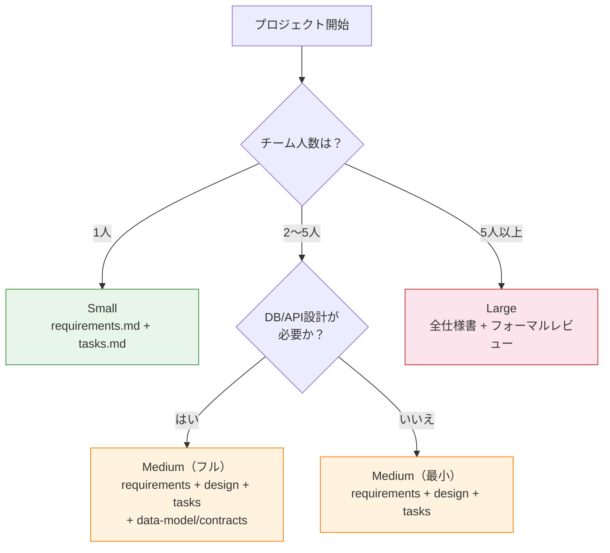
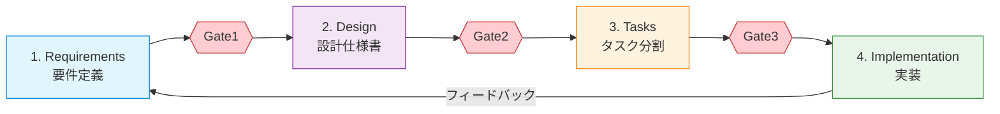
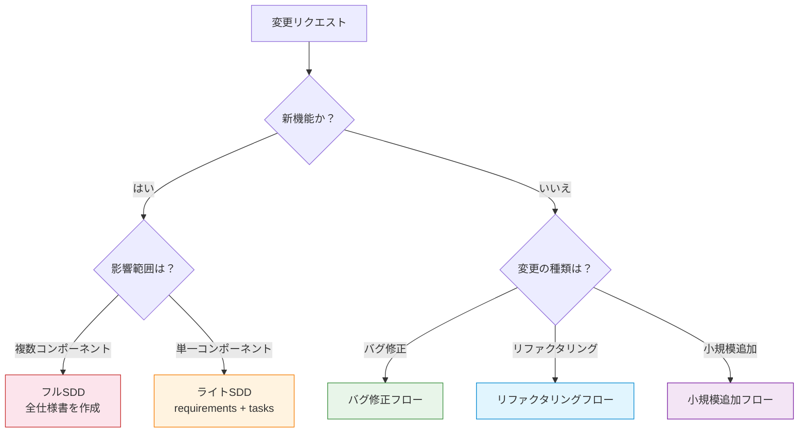
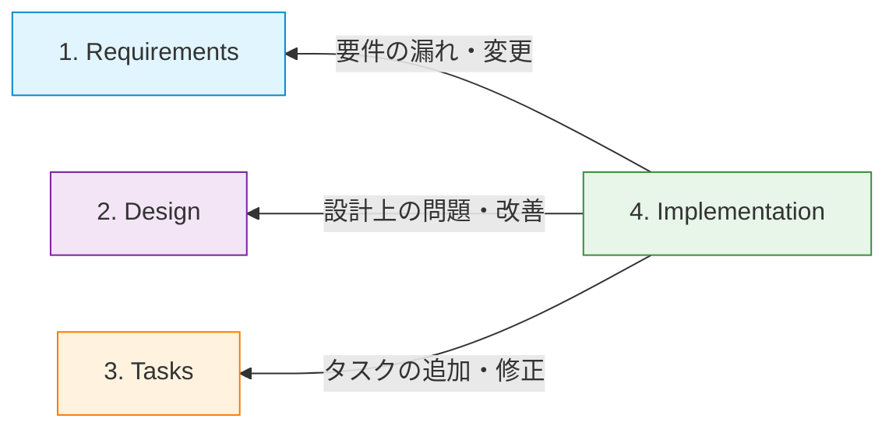

# 仕様書駆動開発（Spec-Driven Development）

## 概要

仕様書駆動開発（SDD: Spec-Driven Development）とは、**コードを書く前に仕様書を作成し、その仕様書に基づいて開発を進める手法**です。AIコーディングツール（Claude Code等）を活用する現代の開発において、AIに「何を作るか」を正確に伝えるための構造化されたアプローチとして注目されています。

> "Spec-driven development is the practice of writing structured specification documents before writing code, then using those specs to guide both human and AI development."
> — [Thoughtworks Technology Radar](https://www.thoughtworks.com/en-us/insights/blog/agile-engineering-practices/spec-driven-development-unpacking-2025-new-engineering-practices)

## 目次

- [なぜSDDが必要か](#なぜsddが必要か)
- [プロジェクト規模別の適用ガイド](#プロジェクト規模別の適用ガイド)
- [4つのフェーズ](#4つのフェーズ)
- [レビューゲート](#レビューゲート)
- [仕様書の種類一覧](#仕様書の種類一覧)
- [仕様書の作成順序](#仕様書の作成順序)
- [バグ修正/小規模変更フロー](#バグ修正小規模変更フロー)
- [仕様書の深さの基準](#仕様書の深さの基準)
- [ファイル構成の標準](#ファイル構成の標準)
- [よくある落とし穴](#よくある落とし穴)
- [フィードバックループの詳細](#フィードバックループの詳細)
- [各フェーズの詳細ガイド](#各フェーズの詳細ガイド)
- [参考情報源](#参考情報源)

---

## なぜSDDが必要か

### Vibe Codingの問題点

AIコーディングツールに「なんとなく」指示を出す開発スタイル（Vibe Coding）には、以下の問題があります。

| 問題 | 具体例 |
|---|---|
| 要件の曖昧さ | 「ログイン機能を作って」→ セッション管理？JWT？OAuth？ |
| コンテキストの欠落 | AIが既存コードの設計意図を理解できず、一貫性のないコードを生成 |
| 手戻りの多発 | 完成後に「これじゃない」が発生し、大幅なやり直し |
| 品質のばらつき | 同じ機能でも毎回異なる実装パターンになる |
| スケールしない | プロジェクトが大きくなるほど、口頭指示では破綻する |

### SDDが解決すること

SDDでは、**仕様書がAIとのインターフェースコントラクト**になります。

- **再現性**: 同じ仕様書からは同じ品質のコードが生成される
- **レビュー可能性**: コードの前に仕様をレビューでき、手戻りを大幅に削減
- **段階的詳細化**: 抽象から具体へ、各段階で方向性を確認できる
- **チーム共有**: 仕様書を通じて、チーム全体がゴールを共有できる

---

## プロジェクト規模別の適用ガイド

SDDのすべてのプロセスを常に適用する必要はありません。プロジェクトの規模やチーム体制に応じて、必要な仕様書とプロセスを選択します。

### 規模別の必須仕様書

| 規模 | チーム | 必須仕様書 | 任意仕様書 | レビューゲート |
|---|---|---|---|---|
| **Small**（個人・1人） | 1人 | `requirements.md`, `tasks.md` | — | セルフチェック |
| **Medium**（小規模チーム） | 2〜5人 | `requirements.md`, `design.md`, `tasks.md` | `data-model.md`, `contracts/`, `research.md` | 非同期レビュー |
| **Large**（中〜大規模） | 5人以上 | 全仕様書必須 | `research.md`（推奨） | フォーマルなレビューゲート必須 |

### 規模判定フローチャート



### なぜ規模によって変えるか？

仕様書の作成にはコストがかかります。個人プロジェクトでフル仕様書を書くと、仕様書の管理がボトルネックになり、開発速度が落ちます。逆に大規模プロジェクトで仕様書を省略すると、チーム間の認識齟齬が発生し、手戻りコストが仕様書作成コストを大幅に上回ります。

**規模に合わせたSDDを選ぶことで、仕様書のコストと手戻りリスクのバランスを最適化できます。**

---

## 4つのフェーズ

SDDは以下の4つのフェーズで構成されます。



| フェーズ | 目的 | 成果物 | 詳細 |
|---|---|---|---|
| 1. Requirements | **何を作るか**を定義 | `requirements.md` | [01-requirements/guide.md](./01-requirements/guide.md) |
| 2. Design | **どう作るか**を設計 | `design.md`, `data-model.md`, `contracts/` | [02-design.md](./02-design.md) |
| 3. Tasks | **どう分割するか**を計画 | `tasks.md` | [03-tasks.md](./03-tasks.md) |
| 4. Implementation | **実際に作る** | ソースコード | [04-implementation.md](./04-implementation.md) |

### なぜ4段階か？

各フェーズには明確な役割分担があります。

- **Requirements**: ステークホルダー（人間）が意思決定する場
- **Design**: 技術的な意思決定をする場（AIと人間が協業）
- **Tasks**: AIが実行可能な粒度に分解する場
- **Implementation**: AIが仕様に沿って実装する場

フェーズを飛ばすと、AIが勝手に意思決定を行い、意図しない実装になるリスクが高まります。

---

## レビューゲート

レビューゲートとは、**フェーズを次に進める前に、成果物の品質と方向性を確認するチェックポイント**です。ゲートを通過しなければ次のフェーズに進めない仕組みにすることで、手戻りを早期に防止します。

### 各ゲートの詳細

| ゲート | タイミング | レビュアー | 確認事項 |
|---|---|---|---|
| **Gate1** | Requirements → Design | PO / ステークホルダー | ゴールが明確か？スコープ外が定義済みか？ユーザーストーリーに漏れはないか？ |
| **Gate2** | Design → Tasks | テックリード / シニアエンジニア | 技術選定の根拠が明確か？アーキテクチャに矛盾がないか？AIに渡せる粒度になっているか？ |
| **Gate3** | Tasks → Implementation | 開発チーム / AI | 各タスクに完了条件があるか？依存関係が正しいか？1タスク1成果物になっているか？ |

### ゲートで確認する具体例

```markdown
## Gate2 チェックリスト（Design → Tasks）

- [ ] 技術選定に「なぜその技術を選んだか」の理由が書かれている
- [ ] コンポーネント間の依存関係がMermaid図で可視化されている
- [ ] 非機能要件（パフォーマンス、セキュリティ）が考慮されている
- [ ] AIが設計書だけで実装を始められる粒度になっている
```

### なぜゲートが必要か？

ゲートなしでフェーズを進めると、前フェーズの問題が後フェーズで増幅されます。要件の曖昧さは設計の曖昧さを生み、設計の曖昧さはタスクの曖昧さを生み、最終的にAIが意図しないコードを大量に生成します。**各ゲートで10分のレビューをすることで、数時間の手戻りを防止できます。**

> **個人プロジェクトの場合**: フォーマルなレビューは不要です。上記のチェックリストを使ったセルフチェック形式で十分な効果が得られます。

---

## 仕様書の種類一覧

| 仕様書 | ファイル名 | 役割 | いつ必要か |
|---|---|---|---|
| 要件定義書 | `requirements.md` | ビジネス要件・ユーザーストーリー | 常に必要 |
| 設計書 | `design.md` | アーキテクチャ・技術選定 | 新規開発・大規模変更時 |
| データモデル | `data-model.md` | DB設計・テーブル定義 | データ永続化が必要な場合 |
| API契約書 | `contracts/*.md` | エンドポイント・I/O定義 | API開発時 |
| 技術調査書 | `research.md` | 技術選定・ライブラリ比較・アーキテクチャ調査 | 技術選定が必要な場合 |
| タスク一覧 | `tasks.md` | 実装タスクのチェックリスト | 常に必要 |

---

## 仕様書の作成順序

仕様書には依存関係があるため、以下の順序で作成します。

```
1. requirements.md    ← まず「何を作るか」を決める
   ↓
2. research.md        ← 技術選定が必要なら調査を行う（任意）
   ↓
3. design.md          ← 要件と調査結果をもとに「どう作るか」を決める
   ↓
4. data-model.md      ← 設計方針に基づいてデータ構造を定義
   contracts/*.md     ← 設計方針に基づいてAPI仕様を定義
   ↓
5. tasks.md           ← 上記すべてをもとにタスクを分割
```

### `research.md` の役割

`research.md` は、要件定義後に技術的な選択肢を調査・比較するためのドキュメントです。

- **何を書くか**: 技術候補の比較表、ライブラリの評価、アーキテクチャパターンの調査結果、PoC（概念実証）の結果
- **いつ作るか**: 新しい技術を導入する場合や、複数の技術候補がある場合に作成する。既知の技術スタックで開発する場合は省略可能
- **なぜ必要か**: 設計書に「なぜその技術を選んだか」の根拠を記載するために、事前の調査結果を構造化しておく

```markdown
<!-- research.md の例 -->
## 認証方式の比較

| 方式 | メリット | デメリット | 採用判断 |
|---|---|---|---|
| JWT | ステートレス、スケーラブル | トークン失効が困難 | ✅ 採用 |
| セッション | シンプル、即座に失効可能 | サーバー負荷 | ❌ 不採用 |

**選定理由**: マイクロサービス構成を予定しており、サービス間のステートレスな認証が必要なため。
```

### なぜこの順序か？

後のフェーズは前のフェーズの成果物を入力として使うためです。例えば、データモデルを定義するには、まずどんなデータが必要か（要件）と、どのように管理するか（設計方針）が決まっている必要があります。技術調査（`research.md`）を設計の前に行うことで、設計書の技術選定に根拠を持たせることができます。

順序を守らないと、以下の問題が起きます。

- 要件が曖昧なまま設計すると、過剰設計や設計漏れが発生
- 設計なしにタスクを切ると、タスク間の依存関係が見えない
- タスクなしに実装を始めると、スコープが際限なく広がる

---

## バグ修正/小規模変更フロー

SDDは新機能開発を前提としたプロセスですが、**すべての変更にフルSDDを適用する必要はありません**。バグ修正や小規模な変更に対してフル仕様書を書くと、修正コストが仕様書作成コストを下回り、非効率になります。

### 変更種別の判定フロー



### 変更種別ごとの必須仕様書

| 変更種別 | 必須 | 省略可能 | 補足 |
|---|---|---|---|
| **バグ修正** | なし（Issueやコミットメッセージで十分） | 全仕様書 | 修正内容が既存仕様の範囲内であれば仕様書は不要 |
| **小規模追加**（UIの微調整、文言変更等） | `tasks.md`（チェックリスト形式） | その他全て | 影響範囲が限定的な場合 |
| **リファクタリング** | `design.md`（変更箇所のみ追記） | `requirements.md`, `contracts/` | 外部仕様が変わらない場合、要件定義は不要 |
| **新機能（小規模）** | `requirements.md`, `tasks.md` | `design.md`, `data-model.md` | 単一コンポーネントで完結する場合 |
| **新機能（大規模）** | 全仕様書 | — | フルSDDプロセスを適用 |

### なぜ軽量フローが必要か？

SDDの目的は「AIに正確な指示を出すこと」であり、仕様書の作成自体が目的ではありません。バグ修正のように原因と対策が明確な変更に対してフル仕様書を書くことは、開発速度を落とすだけでなく、チームの「SDD疲れ」を引き起こし、本当に必要なときに仕様書が書かれなくなるリスクがあります。

**変更の規模と影響範囲に応じて適切なプロセスを選ぶことが、SDDを持続可能にする鍵です。**

---

## 仕様書の深さの基準

「どこまで書くか」はSDDで最も判断に迷うポイントです。以下の基準を参考にしてください。

| フェーズ | 書くべきこと | 書かなくてよいこと |
|---|---|---|
| Requirements | 機能ごとに1〜3文の説明、エラーケース、スコープ外 | 技術的な実装方法、DB設計、API仕様 |
| Design | アーキテクチャ、技術選定の**理由**、コンポーネント間の関係 | 変数名、関数シグネチャ、UIの色指定 |
| Data Model | テーブル名、カラム名と型、リレーション | インデックス戦略、パーティション設計（初期段階では） |
| Tasks | 完了条件、依存関係、受け入れテスト | コードの書き方、ライブラリのAPI |

### 深さの判断基準

> **「この仕様書を読んだ開発者（またはAI）が、追加の質問なしに正しい実装を始められるか？」**

この問いに「はい」と答えられれば、十分な深さです。

---

## ファイル構成の標準

プロジェクトで仕様書を管理する際の標準的なディレクトリ構造です。

```
project-root/
├── specs/                          # 仕様書ディレクトリ
│   ├── requirements.md             # 要件定義
│   ├── design.md                   # 設計仕様書
│   ├── research.md                 # 技術調査書（任意）
│   ├── data-model.md               # データモデル定義
│   ├── tasks.md                    # タスク一覧
│   └── contracts/                  # API契約書
│       ├── auth.md                 # 認証API
│       └── users.md               # ユーザーAPI
├── CLAUDE.md                       # プロジェクト制約・ルール
└── src/                            # ソースコード
```

### なぜ `specs/` ディレクトリか？

- **コードと仕様を同じリポジトリで管理**できる
- **バージョン管理**が自然にできる（仕様の変更履歴がGitで追える）
- **CLAUDE.md から参照**できる（「仕様書は `specs/` を参照せよ」と記述可能）

---

## よくある落とし穴

### 1. AIの過剰設計（Over-Engineering）

**問題**: AIに設計を丸投げすると、不要なパターンやレイヤーを追加しがち。

**対策**: 要件定義で「スコープ外」を明確にし、設計レビューで「本当に必要か？」を問う。

```markdown
<!-- 悪い例: 曖昧な指示 -->
最高のアーキテクチャで設計してください。

<!-- 良い例: スコープを限定 -->
ユーザー数100人以下の社内ツールです。
マイクロサービスは不要です。モノリスで設計してください。
```

### 2. タスク粒度が不適切

**問題**: タスクが大きすぎるとAIが途中で迷走し、小さすぎると管理コストが増大する。

**対策**: 1タスク = 1つの明確な成果物。中規模プロジェクトで10個前後が目安。

### 3. Spec Drift（仕様と実装の乖離）

**問題**: 実装中に仕様を変更したが、仕様書を更新しないまま進めてしまう。

**対策**:
- 仕様変更は必ず仕様書を先に更新する
- 各タスク完了時に「仕様書との整合性チェック」を入れる
- CLAUDE.md に「仕様書を必ず参照すること」と記載する

Spec Driftの体系的な防止方法については、[フィードバックループの詳細](#フィードバックループの詳細)を参照してください。

### 4. 最初から完璧を目指す

**問題**: 仕様書を完璧に仕上げてから実装に入ろうとし、いつまでも始められない。

**対策**: 仕様書は「生きたドキュメント」。70%の完成度で実装を始め、実装からのフィードバックで改善する。

---

## フィードバックループの詳細

実装フェーズで得られた知見や問題を、適切な仕様書にフィードバックする仕組みです。4つのフェーズは一方通行ではなく、実装からの学びを仕様に反映することで、仕様書を「生きたドキュメント」として維持します。

### フィードバックの3つのパス



### フィードバック先の判断基準

| フィードバック先 | 発生状況の例 | 対応方法 |
|---|---|---|
| **Requirements** | 実装中にユーザーストーリーの不足に気づいた、スコープの再定義が必要になった | `requirements.md` に要件を追加し、影響する `design.md` と `tasks.md` も更新 |
| **Design** | 選定した技術では要件を満たせないことが判明した、パフォーマンス上の問題が見つかった | `design.md` の該当箇所を修正し、影響する `tasks.md` を更新 |
| **Tasks** | 想定外のタスクが必要になった、タスクの依存関係に誤りがあった | `tasks.md` にタスクを追加・修正し、実装を継続 |

### Spec Drift防止ルール

Spec Drift（仕様と実装の乖離）を防ぐために、以下のルールを守ります。

1. **仕様書を先に更新する**: 実装を変更する前に、必ず関連する仕様書を先に修正する。「コードを直してから仕様書を後で更新しよう」は忘れられる
2. **更新の波及範囲を特定する**: 1つの仕様書を変更したら、影響を受ける他の仕様書を確認する。例えば `requirements.md` を変更したら `design.md` と `tasks.md` にも波及する可能性がある
3. **AIには最新仕様を渡す**: AIに実装を依頼する際は、必ず最新の仕様書を参照させる。古い仕様書で実装すると、修正済みの問題が再発する

### なぜフィードバックを分類するか？

フィードバック先を明確にすることで、**変更の影響範囲を正確に把握できます**。例えば、要件レベルのフィードバックは設計とタスクの両方に波及しますが、タスクレベルのフィードバックは他の仕様書に影響しないことがほとんどです。分類せずに場当たり的に仕様書を更新すると、仕様書間の整合性が崩れ、Spec Driftの原因になります。

---

## 各フェーズの詳細ガイド

各フェーズの詳細な書き方・実践方法は、以下のガイドを参照してください。

1. [要件定義フェーズ](./01-requirements/guide.md) — 「何を作るか」を定義する
   - [requirements.md テンプレート](./01-requirements/template.md) — コピーして使える実用テンプレート（Small / Medium / Large）
2. [設計仕様書フェーズ](./02-design.md) — 「どう作るか」を設計する
3. [タスク分割フェーズ](./03-tasks.md) — 実装タスクに分解する
4. [実装フェーズ](./04-implementation.md) — 仕様に沿って実装する

---

## 参考情報源

### 英語リソース

- [Addy Osmani - How to write a good spec for AI agents](https://addyosmani.com/blog/good-spec/)
- [Addy Osmani - My LLM coding workflow going into 2026](https://addyosmani.com/blog/ai-coding-workflow/)
- [GitHub spec-kit](https://github.com/github/spec-kit/blob/main/spec-driven.md)
- [Thoughtworks - Spec-driven development](https://www.thoughtworks.com/en-us/insights/blog/agile-engineering-practices/spec-driven-development-unpacking-2025-new-engineering-practices)
- [Red Hat - How spec-driven development improves AI coding quality](https://developers.redhat.com/articles/2025/10/22/how-spec-driven-development-improves-ai-coding-quality)
- [JetBrains Junie Blog - Spec-Driven Approach](https://blog.jetbrains.com/junie/2025/10/how-to-use-a-spec-driven-approach-for-coding-with-ai/)
- [Spec-Driven Development: From Code to Contract in the Age of AI Coding Assistants (arXiv)](https://arxiv.org/html/2602.00180v1)
- [Phase-gate process - Wikipedia](https://en.wikipedia.org/wiki/Phase-gate_process)
- [Martin Fowler - Understanding SDD: Kiro, spec-kit, and Tessl](https://martinfowler.com/articles/exploring-gen-ai/sdd-3-tools.html)
- [Microsoft - Diving Into Spec-Driven Development With GitHub Spec Kit](https://developer.microsoft.com/blog/spec-driven-development-spec-kit)
- [Scalable Path - Beyond Vibe-Coding: A Practical Guide to SDD](https://www.scalablepath.com/machine-learning/spec-driven-development-guide)
- [InfoQ - Spec Driven Development: When Architecture Becomes Executable](https://www.infoq.com/articles/spec-driven-development/)

### GitHubリポジトリ

- [Pimzino/claude-code-spec-workflow](https://github.com/Pimzino/claude-code-spec-workflow)
- [gotalab/cc-sdd](https://github.com/gotalab/cc-sdd)

### 日本語リソース

- [弁護士ドットコム - claude-code-spec-workflowで始める仕様書駆動開発](https://creators.bengo4.com/entry/2025/09/03/080000)
- [Qiita - Kiroみたいな仕様書駆動開発をClaude Codeで実践](https://qiita.com/nokonoko_1203/items/8bafb6033409aadccd9f)
- [ENECHANGE - Kiroの仕様書駆動開発プロセスをClaude Codeで実践](https://tech.enechange.co.jp/entry/2025/08/14/000000)
- [シンプレクス - ライトな仕様駆動開発](https://note.com/simplex_engineer/n/nd54b2f953b43)
- [SIOS Tech Lab - AI協働で仕様書アレルギー克服](https://tech-lab.sios.jp/archives/49148)
