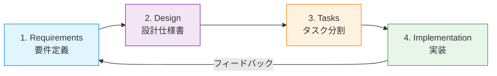

# 仕様書駆動開発（Spec-Driven Development）

## 概要

仕様書駆動開発（SDD: Spec-Driven Development）とは、**コードを書く前に仕様書を作成し、その仕様書に基づいて開発を進める手法**です。AIコーディングツール（Claude Code等）を活用する現代の開発において、AIに「何を作るか」を正確に伝えるための構造化されたアプローチとして注目されています。

> "Spec-driven development is the practice of writing structured specification documents before writing code, then using those specs to guide both human and AI development."
> — [Thoughtworks Technology Radar](https://www.thoughtworks.com/en-us/insights/blog/agile-engineering-practices/spec-driven-development-unpacking-2025-new-engineering-practices)

## 目次

- [なぜSDDが必要か](#なぜsddが必要か)
- [4つのフェーズ](#4つのフェーズ)
- [仕様書の種類一覧](#仕様書の種類一覧)
- [仕様書の作成順序](#仕様書の作成順序)
- [仕様書の深さの基準](#仕様書の深さの基準)
- [ファイル構成の標準](#ファイル構成の標準)
- [よくある落とし穴](#よくある落とし穴)
- [各フェーズの詳細ガイド](#各フェーズの詳細ガイド)
- [参考情報源](#参考情報源)

---

## なぜSDDが必要か

### Vibe Codingの問題点

AIコーディングツールに「なんとなく」指示を出す開発スタイル（Vibe Coding）には、以下の問題があります。

| 問題 | 具体例 |
|---|---|
| 要件の曖昧さ | 「ログイン機能を作って」→ セッション管理？JWT？OAuth？ |
| コンテキストの欠落 | AIが既存コードの設計意図を理解できず、一貫性のないコードを生成 |
| 手戻りの多発 | 完成後に「これじゃない」が発生し、大幅なやり直し |
| 品質のばらつき | 同じ機能でも毎回異なる実装パターンになる |
| スケールしない | プロジェクトが大きくなるほど、口頭指示では破綻する |

### SDDが解決すること

SDDでは、**仕様書がAIとのインターフェースコントラクト**になります。

- **再現性**: 同じ仕様書からは同じ品質のコードが生成される
- **レビュー可能性**: コードの前に仕様をレビューでき、手戻りを大幅に削減
- **段階的詳細化**: 抽象から具体へ、各段階で方向性を確認できる
- **チーム共有**: 仕様書を通じて、チーム全体がゴールを共有できる

---

## 4つのフェーズ

SDDは以下の4つのフェーズで構成されます。



| フェーズ | 目的 | 成果物 | 詳細 |
|---|---|---|---|
| 1. Requirements | **何を作るか**を定義 | `requirements.md` | [01-requirements.md](./01-requirements.md) |
| 2. Design | **どう作るか**を設計 | `design.md`, `data-model.md`, `contracts/` | [02-design.md](./02-design.md) |
| 3. Tasks | **どう分割するか**を計画 | `tasks.md` | [03-tasks.md](./03-tasks.md) |
| 4. Implementation | **実際に作る** | ソースコード | [04-implementation.md](./04-implementation.md) |

### なぜ4段階か？

各フェーズには明確な役割分担があります。

- **Requirements**: ステークホルダー（人間）が意思決定する場
- **Design**: 技術的な意思決定をする場（AIと人間が協業）
- **Tasks**: AIが実行可能な粒度に分解する場
- **Implementation**: AIが仕様に沿って実装する場

フェーズを飛ばすと、AIが勝手に意思決定を行い、意図しない実装になるリスクが高まります。

---

## 仕様書の種類一覧

| 仕様書 | ファイル名 | 役割 | いつ必要か |
|---|---|---|---|
| 要件定義書 | `requirements.md` | ビジネス要件・ユーザーストーリー | 常に必要 |
| 設計書 | `design.md` | アーキテクチャ・技術選定 | 新規開発・大規模変更時 |
| データモデル | `data-model.md` | DB設計・テーブル定義 | データ永続化が必要な場合 |
| API契約書 | `contracts/*.md` | エンドポイント・I/O定義 | API開発時 |
| タスク一覧 | `tasks.md` | 実装タスクのチェックリスト | 常に必要 |

---

## 仕様書の作成順序

仕様書には依存関係があるため、以下の順序で作成します。

```
1. requirements.md    ← まず「何を作るか」を決める
   ↓
2. design.md          ← 要件をもとに「どう作るか」を決める
   ↓
3. data-model.md      ← 設計方針に基づいてデータ構造を定義
   contracts/*.md     ← 設計方針に基づいてAPI仕様を定義
   ↓
4. tasks.md           ← 上記すべてをもとにタスクを分割
```

### なぜこの順序か？

後のフェーズは前のフェーズの成果物を入力として使うためです。例えば、データモデルを定義するには、まずどんなデータが必要か（要件）と、どのように管理するか（設計方針）が決まっている必要があります。

順序を守らないと、以下の問題が起きます。

- 要件が曖昧なまま設計すると、過剰設計や設計漏れが発生
- 設計なしにタスクを切ると、タスク間の依存関係が見えない
- タスクなしに実装を始めると、スコープが際限なく広がる

---

## 仕様書の深さの基準

「どこまで書くか」はSDDで最も判断に迷うポイントです。以下の基準を参考にしてください。

| フェーズ | 書くべきこと | 書かなくてよいこと |
|---|---|---|
| Requirements | 機能ごとに1〜3文の説明、エラーケース、スコープ外 | 技術的な実装方法、DB設計、API仕様 |
| Design | アーキテクチャ、技術選定の**理由**、コンポーネント間の関係 | 変数名、関数シグネチャ、UIの色指定 |
| Data Model | テーブル名、カラム名と型、リレーション | インデックス戦略、パーティション設計（初期段階では） |
| Tasks | 完了条件、依存関係、受け入れテスト | コードの書き方、ライブラリのAPI |

### 深さの判断基準

> **「この仕様書を読んだ開発者（またはAI）が、追加の質問なしに正しい実装を始められるか？」**

この問いに「はい」と答えられれば、十分な深さです。

---

## ファイル構成の標準

プロジェクトで仕様書を管理する際の標準的なディレクトリ構造です。

```
project-root/
├── specs/                          # 仕様書ディレクトリ
│   ├── requirements.md             # 要件定義
│   ├── design.md                   # 設計仕様書
│   ├── data-model.md               # データモデル定義
│   ├── tasks.md                    # タスク一覧
│   └── contracts/                  # API契約書
│       ├── auth.md                 # 認証API
│       └── users.md               # ユーザーAPI
├── CLAUDE.md                       # プロジェクト制約・ルール
└── src/                            # ソースコード
```

### なぜ `specs/` ディレクトリか？

- **コードと仕様を同じリポジトリで管理**できる
- **バージョン管理**が自然にできる（仕様の変更履歴がGitで追える）
- **CLAUDE.md から参照**できる（「仕様書は `specs/` を参照せよ」と記述可能）

---

## よくある落とし穴

### 1. AIの過剰設計（Over-Engineering）

**問題**: AIに設計を丸投げすると、不要なパターンやレイヤーを追加しがち。

**対策**: 要件定義で「スコープ外」を明確にし、設計レビューで「本当に必要か？」を問う。

```markdown
<!-- 悪い例: 曖昧な指示 -->
最高のアーキテクチャで設計してください。

<!-- 良い例: スコープを限定 -->
ユーザー数100人以下の社内ツールです。
マイクロサービスは不要です。モノリスで設計してください。
```

### 2. タスク粒度が不適切

**問題**: タスクが大きすぎるとAIが途中で迷走し、小さすぎると管理コストが増大する。

**対策**: 1タスク = 1つの明確な成果物。中規模プロジェクトで10個前後が目安。

### 3. Spec Drift（仕様と実装の乖離）

**問題**: 実装中に仕様を変更したが、仕様書を更新しないまま進めてしまう。

**対策**:
- 仕様変更は必ず仕様書を先に更新する
- 各タスク完了時に「仕様書との整合性チェック」を入れる
- CLAUDE.md に「仕様書を必ず参照すること」と記載する

### 4. 最初から完璧を目指す

**問題**: 仕様書を完璧に仕上げてから実装に入ろうとし、いつまでも始められない。

**対策**: 仕様書は「生きたドキュメント」。70%の完成度で実装を始め、実装からのフィードバックで改善する。

---

## 各フェーズの詳細ガイド

各フェーズの詳細な書き方・実践方法は、以下のガイドを参照してください。

1. [要件定義フェーズ](./01-requirements.md) — 「何を作るか」を定義する
2. [設計仕様書フェーズ](./02-design.md) — 「どう作るか」を設計する
3. [タスク分割フェーズ](./03-tasks.md) — 実装タスクに分解する
4. [実装フェーズ](./04-implementation.md) — 仕様に沿って実装する

---

## 参考情報源

### 英語リソース

- [Addy Osmani - How to write a good spec for AI agents](https://addyosmani.com/blog/good-spec/)
- [Addy Osmani - My LLM coding workflow going into 2026](https://addyosmani.com/blog/ai-coding-workflow/)
- [GitHub spec-kit](https://github.com/github/spec-kit/blob/main/spec-driven.md)
- [Thoughtworks - Spec-driven development](https://www.thoughtworks.com/en-us/insights/blog/agile-engineering-practices/spec-driven-development-unpacking-2025-new-engineering-practices)
- [Red Hat - How spec-driven development improves AI coding quality](https://developers.redhat.com/articles/2025/10/22/how-spec-driven-development-improves-ai-coding-quality)
- [JetBrains Junie Blog - Spec-Driven Approach](https://blog.jetbrains.com/junie/2025/10/how-to-use-a-spec-driven-approach-for-coding-with-ai/)

### GitHubリポジトリ

- [Pimzino/claude-code-spec-workflow](https://github.com/Pimzino/claude-code-spec-workflow)
- [gotalab/cc-sdd](https://github.com/gotalab/cc-sdd)

### 日本語リソース

- [弁護士ドットコム - claude-code-spec-workflowで始める仕様書駆動開発](https://creators.bengo4.com/entry/2025/09/03/080000)
- [Qiita - Kiroみたいな仕様書駆動開発をClaude Codeで実践](https://qiita.com/nokonoko_1203/items/8bafb6033409aadccd9f)
- [ENECHANGE - Kiroの仕様書駆動開発プロセスをClaude Codeで実践](https://tech.enechange.co.jp/entry/2025/08/14/000000)
- [シンプレクス - ライトな仕様駆動開発](https://note.com/simplex_engineer/n/nd54b2f953b43)
- [SIOS Tech Lab - AI協働で仕様書アレルギー克服](https://tech-lab.sios.jp/archives/49148)
