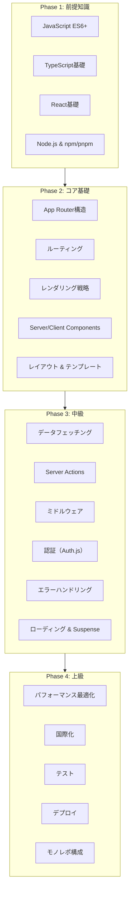
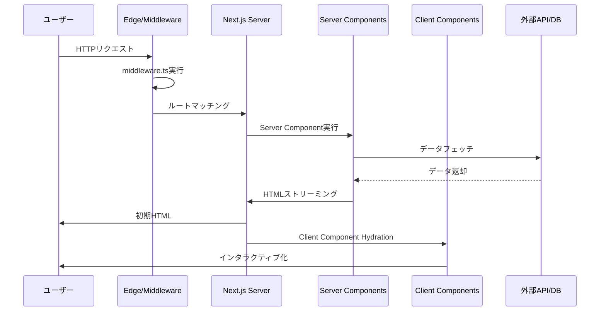
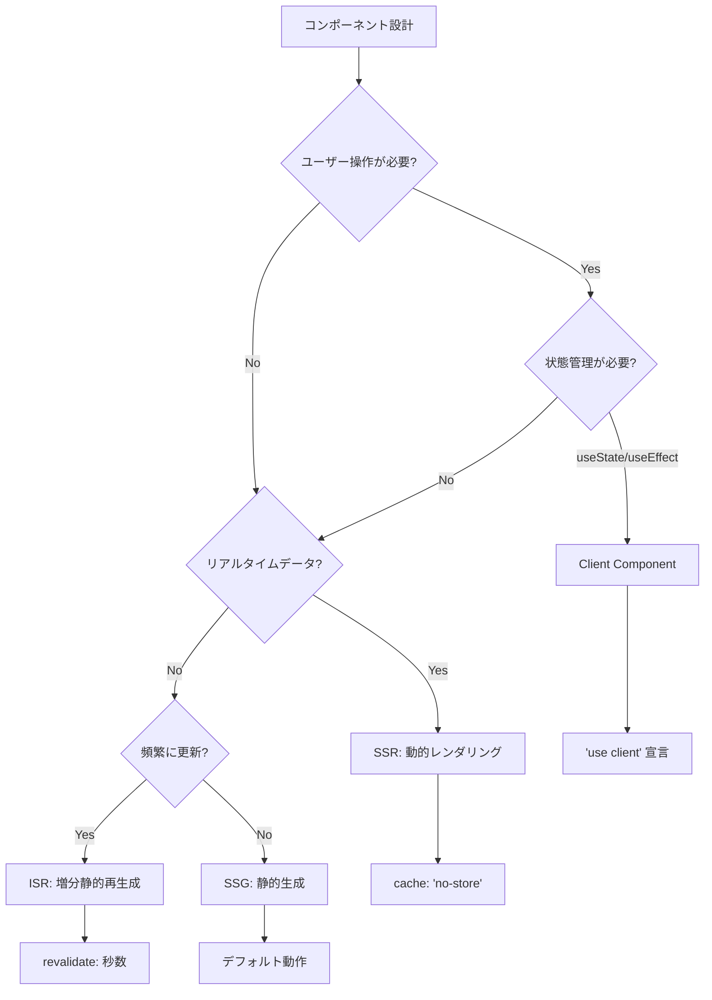

# Next.js 学習ロードマップ

ReactベースのフルスタックフレームワークNext.jsを体系的に学習するためのガイド。App Router（Next.js 13以降）を中心に、基礎から実践的な開発スキルまで段階的に習得していく。

---

## 目次

1. [全体像：Next.jsの学習フロー](#全体像nextjsの学習フロー)
1. [Phase 1: 基礎準備と前提知識（1〜2週間）](#phase-1-基礎準備と前提知識12週間)
1. [Phase 2: Next.jsコア基礎（3〜4週間）](#phase-2-nextjsコア基礎34週間)
1. [Phase 3: 中級トピック（4〜5週間）](#phase-3-中級トピック45週間)
1. [Phase 4: 上級トピック（3〜4週間）](#phase-4-上級トピック34週間)
1. [学習リソース](#学習リソース)
1. [学習のコツ](#学習のコツ)

---

## 全体像：Next.jsの学習フロー



### Next.jsリクエストライフサイクル

Next.jsがリクエストを処理する流れを理解することで、各コンポーネントの役割が明確になる。



### レンダリング戦略の判断フロー



---

## Phase 1: 基礎準備と前提知識（1〜2週間）

Next.jsを効果的に学ぶために必要な前提知識を固める。

### 1.1 JavaScript ES6+ 基礎

Next.jsはモダンJavaScriptの機能を多用する。以下の機能は必須。

#### アロー関数

```typescript
// 従来の関数
function greet(name: string): string {
  return `Hello, ${name}!`;
}

// アロー関数
const greet = (name: string): string => `Hello, ${name}!`;

// コンポーネントでの使用
const Button = ({ onClick }: { onClick: () => void }) => (
  <button onClick={onClick}>Click me</button>
);
```

#### 分割代入

```typescript
// オブジェクトの分割代入
const user = { name: '田中', age: 30, email: 'tanaka@example.com' };
const { name, email } = user;

// Propsの分割代入（Reactでよく使用）
interface ButtonProps {
  label: string;
  disabled?: boolean;
}

const Button = ({ label, disabled = false }: ButtonProps) => (
  <button disabled={disabled}>{label}</button>
);

// 配列の分割代入
const [first, second, ...rest] = [1, 2, 3, 4, 5];
// first = 1, second = 2, rest = [3, 4, 5]
```

#### スプレッド構文

```typescript
// オブジェクトのスプレッド
const defaults = { theme: 'light', lang: 'ja' };
const userSettings = { ...defaults, theme: 'dark' };
// { theme: 'dark', lang: 'ja' }

// Propsの転送
interface WrapperProps extends React.ComponentProps<'div'> {
  children: React.ReactNode;
}

const Wrapper = ({ children, ...props }: WrapperProps) => (
  <div {...props}>{children}</div>
);
```

#### Promise / async-await

```typescript
// Promise
const fetchUser = (id: number): Promise<User> => {
  return fetch(`/api/users/${id}`)
    .then(res => res.json());
};

// async-await（推奨）
const fetchUser = async (id: number): Promise<User> => {
  const res = await fetch(`/api/users/${id}`);
  return res.json();
};

// Server Componentでの使用
async function UserProfile({ userId }: { userId: string }) {
  const user = await fetchUser(userId);
  return <div>{user.name}</div>;
}
```

#### Optional Chaining & Nullish Coalescing

```typescript
// Optional Chaining（?.）
const userName = user?.profile?.name; // undefinedでもエラーにならない

// Nullish Coalescing（??）
const displayName = user.name ?? 'ゲスト'; // null/undefinedの場合のみデフォルト値
// 注意: '' や 0 はそのまま使われる

// 従来の || との違い
const count = data.count || 10;  // 0 の場合も 10 になる
const count = data.count ?? 10;  // 0 はそのまま 0
```

#### 学習目標

- [ ] アロー関数を使ってコンポーネントを定義できる
- [ ] 分割代入でPropsを受け取れる
- [ ] async/awaitを使ってデータフェッチができる
- [ ] Optional ChainingとNullish Coalescingを適切に使える

---

### 1.2 TypeScript基礎

Next.jsはTypeScriptをファーストクラスでサポート。型安全な開発が推奨される。

#### 基本的な型注釈

```typescript
// プリミティブ型
const name: string = '田中太郎';
const age: number = 30;
const isActive: boolean = true;

// 配列
const numbers: number[] = [1, 2, 3];
const names: Array<string> = ['田中', '山田'];

// オブジェクト
const user: { name: string; age: number } = {
  name: '田中',
  age: 30,
};
```

#### インターフェースと型エイリアス

```typescript
// インターフェース（拡張可能、オブジェクト向き）
interface User {
  id: number;
  name: string;
  email: string;
  createdAt: Date;
}

// 型エイリアス（ユニオン型などに便利）
type Status = 'pending' | 'active' | 'inactive';
type UserId = number | string;

// Propsの定義（インターフェース推奨）
interface ButtonProps {
  label: string;
  variant?: 'primary' | 'secondary';
  disabled?: boolean;
  onClick?: () => void;
}

// 拡張
interface AdminUser extends User {
  role: 'admin';
  permissions: string[];
}
```

#### ジェネリクス

```typescript
// 基本的なジェネリクス
function identity<T>(arg: T): T {
  return arg;
}

// APIレスポンスの型定義
interface ApiResponse<T> {
  data: T;
  status: number;
  message: string;
}

// 使用例
async function fetchUsers(): Promise<ApiResponse<User[]>> {
  const res = await fetch('/api/users');
  return res.json();
}

// Reactコンポーネントでのジェネリクス
interface ListProps<T> {
  items: T[];
  renderItem: (item: T) => React.ReactNode;
}

function List<T>({ items, renderItem }: ListProps<T>) {
  return <ul>{items.map(renderItem)}</ul>;
}
```

#### React/Next.jsでよく使う型

```typescript
import { ReactNode, ComponentProps } from 'react';

// children props
interface LayoutProps {
  children: ReactNode;
}

// イベントハンドラ
const handleClick = (e: React.MouseEvent<HTMLButtonElement>) => {
  console.log(e.currentTarget);
};

const handleChange = (e: React.ChangeEvent<HTMLInputElement>) => {
  console.log(e.target.value);
};

// コンポーネントPropsの継承
type ButtonProps = ComponentProps<'button'> & {
  variant?: 'primary' | 'secondary';
};
```

#### 学習目標

- [ ] 基本的な型注釈ができる
- [ ] インターフェースでPropsを定義できる
- [ ] ジェネリクスの基本概念を理解している
- [ ] React/Next.js固有の型を使える

---

### 1.3 React基礎

Next.jsはReactの上に構築されている。Reactの基本概念は必須。

#### コンポーネントとJSX

```tsx
// 関数コンポーネント
interface GreetingProps {
  name: string;
}

function Greeting({ name }: GreetingProps) {
  return <h1>こんにちは、{name}さん！</h1>;
}

// アロー関数でも同様
const Greeting = ({ name }: GreetingProps) => (
  <h1>こんにちは、{name}さん！</h1>
);

// 条件付きレンダリング
function UserStatus({ isLoggedIn }: { isLoggedIn: boolean }) {
  return (
    <div>
      {isLoggedIn ? (
        <p>ログイン中</p>
      ) : (
        <p>ゲストモード</p>
      )}
    </div>
  );
}

// リストのレンダリング
function UserList({ users }: { users: User[] }) {
  return (
    <ul>
      {users.map(user => (
        <li key={user.id}>{user.name}</li>
      ))}
    </ul>
  );
}
```

#### useState

```tsx
'use client'; // Next.js: Client Componentで使用

import { useState } from 'react';

function Counter() {
  const [count, setCount] = useState(0);

  return (
    <div>
      <p>カウント: {count}</p>
      <button onClick={() => setCount(count + 1)}>増加</button>
      <button onClick={() => setCount(prev => prev - 1)}>減少</button>
    </div>
  );
}

// オブジェクトの状態管理
interface FormData {
  name: string;
  email: string;
}

function ContactForm() {
  const [form, setForm] = useState<FormData>({ name: '', email: '' });

  const handleChange = (e: React.ChangeEvent<HTMLInputElement>) => {
    const { name, value } = e.target;
    setForm(prev => ({ ...prev, [name]: value }));
  };

  return (
    <form>
      <input name="name" value={form.name} onChange={handleChange} />
      <input name="email" value={form.email} onChange={handleChange} />
    </form>
  );
}
```

#### useEffect

```tsx
'use client';

import { useState, useEffect } from 'react';

function UserProfile({ userId }: { userId: string }) {
  const [user, setUser] = useState<User | null>(null);
  const [loading, setLoading] = useState(true);

  useEffect(() => {
    // userIdが変わるたびに実行
    const fetchUser = async () => {
      setLoading(true);
      const res = await fetch(`/api/users/${userId}`);
      const data = await res.json();
      setUser(data);
      setLoading(false);
    };

    fetchUser();
  }, [userId]); // 依存配列

  if (loading) return <p>読み込み中...</p>;
  if (!user) return <p>ユーザーが見つかりません</p>;

  return <div>{user.name}</div>;
}

// クリーンアップ
function Timer() {
  const [seconds, setSeconds] = useState(0);

  useEffect(() => {
    const interval = setInterval(() => {
      setSeconds(prev => prev + 1);
    }, 1000);

    // クリーンアップ関数（コンポーネントのアンマウント時に実行）
    return () => clearInterval(interval);
  }, []);

  return <p>{seconds}秒経過</p>;
}
```

#### なぜServer ComponentではuseStateやuseEffectが使えないのか

Next.jsのServer Componentはサーバーで実行されるため、ブラウザAPIやReact Hooksは使用できない。

```tsx
// Server Component（デフォルト）- Hooksは使えない
async function UserList() {
  // 直接データフェッチ可能
  const users = await fetch('https://api.example.com/users').then(r => r.json());
  return <ul>{users.map(u => <li key={u.id}>{u.name}</li>)}</ul>;
}

// Client Component - Hooksが必要な場合
'use client';

function InteractiveCounter() {
  const [count, setCount] = useState(0); // OK
  return <button onClick={() => setCount(c => c + 1)}>{count}</button>;
}
```

#### 学習目標

- [ ] 関数コンポーネントを作成できる
- [ ] useStateで状態管理ができる
- [ ] useEffectの依存配列を正しく設定できる
- [ ] Server ComponentとClient Componentの違いを理解している

---

### 1.4 Node.js & パッケージ管理

#### Node.jsの基礎

```bash
# バージョン確認
node -v  # v20.x.x 推奨

# REPLで実行
node
> console.log('Hello')
```

#### npm / pnpm

```bash
# プロジェクト初期化
npm init -y

# パッケージインストール
npm install next react react-dom

# 開発依存
npm install -D typescript @types/react @types/node

# スクリプト実行
npm run dev
npm run build
npm run start

# pnpm（推奨：高速、ディスク効率的）
pnpm install
pnpm add next react react-dom
pnpm dev
```

#### package.jsonの構造

```json
{
  "name": "my-next-app",
  "version": "0.1.0",
  "scripts": {
    "dev": "next dev",
    "build": "next build",
    "start": "next start",
    "lint": "next lint"
  },
  "dependencies": {
    "next": "14.x",
    "react": "18.x",
    "react-dom": "18.x"
  },
  "devDependencies": {
    "@types/node": "20.x",
    "@types/react": "18.x",
    "typescript": "5.x"
  }
}
```

#### 学習目標

- [ ] Node.jsとnpm/pnpmのバージョンを確認できる
- [ ] パッケージのインストールと管理ができる
- [ ] package.jsonの基本構造を理解している

---

### 1.5 開発環境セットアップ

#### 推奨環境

| ツール | 説明 |
|--------|------|
| Node.js 20+ | Next.js 14の推奨バージョン |
| pnpm | 高速なパッケージマネージャー |
| VS Code | 推奨エディタ |
| ESLint + Prettier | コード品質・フォーマット |

#### Next.jsプロジェクト作成

```bash
# 対話式で作成（推奨）
npx create-next-app@latest my-app

# 質問への回答例
# ✔ Would you like to use TypeScript? → Yes
# ✔ Would you like to use ESLint? → Yes
# ✔ Would you like to use Tailwind CSS? → Yes
# ✔ Would you like to use `src/` directory? → Yes
# ✔ Would you like to use App Router? → Yes
# ✔ Would you like to customize the default import alias? → No

# 起動
cd my-app
npm run dev
# http://localhost:3000 でアクセス
```

#### プロジェクト構造（App Router）

```
my-app/
├── src/
│   └── app/
│       ├── layout.tsx      # ルートレイアウト
│       ├── page.tsx        # ホームページ（/）
│       ├── globals.css     # グローバルCSS
│       └── favicon.ico
├── public/                 # 静的ファイル
├── package.json
├── tsconfig.json
├── next.config.js
└── tailwind.config.ts
```

#### VS Code推奨拡張機能

| 拡張機能 | 説明 |
|---------|------|
| ES7+ React/Redux snippets | Reactスニペット |
| Tailwind CSS IntelliSense | Tailwind補完 |
| Prettier | コードフォーマット |
| ESLint | Linting |
| Auto Rename Tag | タグ自動リネーム |

#### 学習目標

- [ ] create-next-appでプロジェクトを作成できる
- [ ] 開発サーバーを起動してブラウザで確認できる
- [ ] プロジェクト構造を理解している

---

## Phase 2: Next.jsコア基礎（3〜4週間）

Next.jsの基本的な機能を習得する。

### 2.1 App Routerとプロジェクト構造

#### ディレクトリベースルーティング

App Routerでは、`app/`ディレクトリ内のフォルダ構造がそのままURLになる。

```
app/
├── page.tsx              → /
├── about/
│   └── page.tsx          → /about
├── blog/
│   ├── page.tsx          → /blog
│   └── [slug]/
│       └── page.tsx      → /blog/[slug] (動的ルート)
└── dashboard/
    ├── layout.tsx        # ダッシュボード共通レイアウト
    ├── page.tsx          → /dashboard
    └── settings/
        └── page.tsx      → /dashboard/settings
```

#### 特殊ファイル

| ファイル | 役割 |
|---------|------|
| `page.tsx` | ルートのUIを定義（必須） |
| `layout.tsx` | 共有レイアウト（子ルートで継承） |
| `loading.tsx` | ローディングUI（Suspense境界） |
| `error.tsx` | エラーUI（Error Boundary） |
| `not-found.tsx` | 404ページ |
| `template.tsx` | 再マウントされるレイアウト |
| `route.tsx` | API Route（Route Handlers） |

#### page.tsx

```tsx
// app/page.tsx - ホームページ
export default function HomePage() {
  return (
    <main>
      <h1>ホームページへようこそ</h1>
    </main>
  );
}

// app/about/page.tsx
export default function AboutPage() {
  return (
    <main>
      <h1>会社概要</h1>
      <p>私たちについて...</p>
    </main>
  );
}
```

#### layout.tsx

```tsx
// app/layout.tsx - ルートレイアウト（必須）
import { Inter } from 'next/font/google';
import './globals.css';

const inter = Inter({ subsets: ['latin'] });

export const metadata = {
  title: 'My App',
  description: 'Next.jsで作成したアプリ',
};

export default function RootLayout({
  children,
}: {
  children: React.ReactNode;
}) {
  return (
    <html lang="ja">
      <body className={inter.className}>
        <header>ヘッダー</header>
        <main>{children}</main>
        <footer>フッター</footer>
      </body>
    </html>
  );
}
```

なぜlayoutが重要か：

- **パフォーマンス**: ナビゲーション時に再レンダリングされない
- **状態保持**: レイアウト内の状態が維持される
- **コード再利用**: 共通UIを一箇所で管理

#### 学習目標

- [ ] App Routerのディレクトリ構造を理解している
- [ ] page.tsxとlayout.tsxの役割を説明できる
- [ ] 特殊ファイルの用途を理解している

---

### 2.2 ルーティング

#### 動的ルート

```tsx
// app/blog/[slug]/page.tsx
interface BlogPostProps {
  params: { slug: string };
}

export default function BlogPost({ params }: BlogPostProps) {
  return <h1>記事: {params.slug}</h1>;
}

// 例: /blog/my-first-post → params.slug = "my-first-post"
```

#### キャッチオールルート

```tsx
// app/docs/[...slug]/page.tsx
interface DocsPageProps {
  params: { slug: string[] };
}

export default function DocsPage({ params }: DocsPageProps) {
  // /docs/getting-started → slug = ["getting-started"]
  // /docs/api/auth/login → slug = ["api", "auth", "login"]
  return <div>Path: {params.slug.join('/')}</div>;
}

// オプショナルキャッチオール（/docsも含む）
// app/docs/[[...slug]]/page.tsx
```

#### ルートグループ

URLに影響を与えずにルートを整理する。

```
app/
├── (marketing)/          # URLに含まれない
│   ├── layout.tsx        # マーケティング用レイアウト
│   ├── page.tsx          → /
│   └── about/
│       └── page.tsx      → /about
├── (shop)/               # URLに含まれない
│   ├── layout.tsx        # ショップ用レイアウト
│   └── products/
│       └── page.tsx      → /products
└── dashboard/
    └── page.tsx          → /dashboard
```

#### 並列ルート（Parallel Routes）

同じレイアウト内で複数のページを同時に表示。

```
app/
└── dashboard/
    ├── layout.tsx
    ├── page.tsx
    ├── @analytics/        # スロット
    │   └── page.tsx
    └── @team/             # スロット
        └── page.tsx
```

```tsx
// app/dashboard/layout.tsx
export default function DashboardLayout({
  children,
  analytics,
  team,
}: {
  children: React.ReactNode;
  analytics: React.ReactNode;
  team: React.ReactNode;
}) {
  return (
    <div>
      <main>{children}</main>
      <aside>
        {analytics}
        {team}
      </aside>
    </div>
  );
}
```

#### 学習目標

- [ ] 動的ルート[param]を使える
- [ ] キャッチオールルート[...slug]を理解している
- [ ] ルートグループで構造を整理できる
- [ ] 並列ルートの概念を理解している

---

### 2.3 レンダリング戦略

Next.jsの最も重要な概念の一つ。適切な戦略を選ぶことでパフォーマンスが大きく変わる。

#### レンダリング戦略の比較

| 戦略 | 説明 | 使用場面 | キャッシュ |
|------|------|---------|----------|
| SSG（静的生成） | ビルド時にHTML生成 | ブログ、ドキュメント | 永続 |
| ISR（増分静的再生成） | 定期的に再生成 | ECサイト商品一覧 | 時間指定 |
| SSR（動的レンダリング） | リクエスト時に生成 | パーソナライズページ | なし |
| CSR（クライアント） | ブラウザで生成 | ダッシュボード | なし |

#### SSG（Static Site Generation）

```tsx
// デフォルトの動作（fetchがなければ自動的にSSG）
export default async function BlogList() {
  // ビルド時に実行される
  const posts = await fetch('https://api.example.com/posts', {
    cache: 'force-cache', // デフォルト
  }).then(r => r.json());

  return (
    <ul>
      {posts.map(post => (
        <li key={post.id}>{post.title}</li>
      ))}
    </ul>
  );
}
```

#### ISR（Incremental Static Regeneration）

```tsx
// 60秒ごとに再生成
export default async function ProductList() {
  const products = await fetch('https://api.example.com/products', {
    next: { revalidate: 60 }, // 60秒後に再検証
  }).then(r => r.json());

  return (
    <ul>
      {products.map(product => (
        <li key={product.id}>{product.name}</li>
      ))}
    </ul>
  );
}

// ページレベルで設定することも可能
export const revalidate = 60;
```

#### SSR（Server-Side Rendering）

```tsx
// リクエストごとに新しいデータを取得
export default async function UserDashboard() {
  const user = await fetch('https://api.example.com/user', {
    cache: 'no-store', // キャッシュしない
  }).then(r => r.json());

  return <div>ようこそ、{user.name}さん</div>;
}

// または動的関数を使用（cookies(), headers()など）
import { cookies } from 'next/headers';

export default async function AuthenticatedPage() {
  const cookieStore = cookies();
  const token = cookieStore.get('token');
  // この時点で自動的にSSRになる
}
```

#### 動的関数

以下を使用すると自動的にSSR（動的レンダリング）になる：

| 関数 | 用途 |
|------|------|
| `cookies()` | Cookieの読み取り |
| `headers()` | リクエストヘッダーの読み取り |
| `searchParams` | URLパラメータ |

```tsx
import { headers, cookies } from 'next/headers';

export default async function DynamicPage({
  searchParams,
}: {
  searchParams: { q?: string };
}) {
  const headersList = headers();
  const cookieStore = cookies();

  // searchParamsの使用だけで動的レンダリングになる
  const query = searchParams.q;

  return <div>検索: {query}</div>;
}
```

#### 学習目標

- [ ] SSG / ISR / SSR の違いを説明できる
- [ ] fetchのキャッシュオプションを使い分けられる
- [ ] 動的関数を理解し、使用による影響を把握している

---

### 2.4 Server Components vs Client Components

Next.js 13以降の最も重要な概念。デフォルトでServer Componentになる。

#### Server Component（デフォルト）

```tsx
// app/users/page.tsx - Server Component
// 'use client' がなければServer Component

async function getUsers() {
  const res = await fetch('https://api.example.com/users');
  return res.json();
}

export default async function UsersPage() {
  const users = await getUsers(); // サーバーで直接fetch

  return (
    <ul>
      {users.map(user => (
        <li key={user.id}>{user.name}</li>
      ))}
    </ul>
  );
}
```

Server Componentの利点：

- **バンドルサイズ削減**: JavaScriptがクライアントに送られない
- **直接データアクセス**: DBやファイルシステムに直接アクセス可能
- **セキュリティ**: APIキーなどをクライアントに露出しない
- **SEO**: 完全なHTMLがサーバーで生成される

#### Client Component

```tsx
// components/Counter.tsx
'use client'; // この宣言が必要

import { useState } from 'react';

export default function Counter() {
  const [count, setCount] = useState(0);

  return (
    <button onClick={() => setCount(c => c + 1)}>
      Count: {count}
    </button>
  );
}
```

Client Componentが必要な場合：

- `useState`、`useEffect`などのHooksを使用
- `onClick`、`onChange`などのイベントハンドラ
- ブラウザAPIの使用（`window`、`localStorage`など）
- Reactクラスコンポーネント

#### 使い分けの判断フロー

```
┌─ インタラクティブ？ ─────────────────────┐
│                                          │
├→ Yes: useState/イベント必要              │
│   └→ Client Component ('use client')    │
│                                          │
├→ No: データフェッチのみ                   │
│   └→ Server Component（デフォルト）      │
│                                          │
└──────────────────────────────────────────┘
```

#### コンポーネントの組み合わせ

```tsx
// app/dashboard/page.tsx (Server Component)
import InteractiveChart from '@/components/InteractiveChart'; // Client
import StaticStats from '@/components/StaticStats'; // Server

export default async function Dashboard() {
  const data = await fetchDashboardData();

  return (
    <div>
      {/* Server Componentはそのまま使用 */}
      <StaticStats stats={data.stats} />

      {/* Client Componentにデータを渡す */}
      <InteractiveChart data={data.chartData} />
    </div>
  );
}
```

```tsx
// components/InteractiveChart.tsx
'use client';

import { useState } from 'react';

interface ChartProps {
  data: ChartData[];
}

export default function InteractiveChart({ data }: ChartProps) {
  const [selectedRange, setSelectedRange] = useState('1M');

  return (
    <div>
      <select onChange={e => setSelectedRange(e.target.value)}>
        <option value="1W">1週間</option>
        <option value="1M">1ヶ月</option>
        <option value="1Y">1年</option>
      </select>
      {/* チャート表示 */}
    </div>
  );
}
```

#### 注意点：境界を意識する

```tsx
// ❌ 悪い例: Server ComponentをClient Component内でインポート
'use client';

import ServerComponent from './ServerComponent'; // エラー

// ✅ 良い例: childrenとして渡す
'use client';

export function ClientWrapper({ children }: { children: React.ReactNode }) {
  return <div onClick={() => {}}>{children}</div>;
}

// page.tsx (Server Component)
import { ClientWrapper } from './ClientWrapper';
import ServerComponent from './ServerComponent';

export default function Page() {
  return (
    <ClientWrapper>
      <ServerComponent /> {/* 問題なし */}
    </ClientWrapper>
  );
}
```

#### 学習目標

- [ ] Server ComponentとClient Componentの違いを説明できる
- [ ] 'use client'の使いどころを判断できる
- [ ] 両者を適切に組み合わせられる

---

### 2.5 レイアウトとテンプレート

#### ネストされたレイアウト

```tsx
// app/layout.tsx - ルートレイアウト
export default function RootLayout({
  children,
}: {
  children: React.ReactNode;
}) {
  return (
    <html lang="ja">
      <body>
        <nav>グローバルナビ</nav>
        {children}
      </body>
    </html>
  );
}

// app/dashboard/layout.tsx - ダッシュボードレイアウト
export default function DashboardLayout({
  children,
}: {
  children: React.ReactNode;
}) {
  return (
    <div className="dashboard">
      <aside>サイドバー</aside>
      <main>{children}</main>
    </div>
  );
}

// app/dashboard/settings/layout.tsx - 設定レイアウト
export default function SettingsLayout({
  children,
}: {
  children: React.ReactNode;
}) {
  return (
    <div className="settings">
      <h2>設定</h2>
      <nav>設定メニュー</nav>
      {children}
    </div>
  );
}
```

レンダリング結果（/dashboard/settings）：

```html
<html lang="ja">
  <body>
    <nav>グローバルナビ</nav>
    <div class="dashboard">
      <aside>サイドバー</aside>
      <main>
        <div class="settings">
          <h2>設定</h2>
          <nav>設定メニュー</nav>
          <!-- page.tsx の内容 -->
        </div>
      </main>
    </div>
  </body>
</html>
```

#### template.tsx vs layout.tsx

| 特性 | layout.tsx | template.tsx |
|------|-----------|--------------|
| 再マウント | されない | ナビゲーション時に毎回 |
| 状態保持 | 維持される | リセットされる |
| useEffect | 一度だけ | 毎回実行 |
| 用途 | 共通UI | ページ遷移アニメーション |

```tsx
// app/blog/template.tsx
'use client';

import { motion } from 'framer-motion';

export default function BlogTemplate({
  children,
}: {
  children: React.ReactNode;
}) {
  return (
    <motion.div
      initial={{ opacity: 0, y: 20 }}
      animate={{ opacity: 1, y: 0 }}
      exit={{ opacity: 0, y: -20 }}
    >
      {children}
    </motion.div>
  );
}
```

#### 学習目標

- [ ] ネストされたレイアウトを構築できる
- [ ] layoutとtemplateの違いを説明できる

---

### 2.6 リンクとナビゲーション

#### next/link

```tsx
import Link from 'next/link';

export default function Navigation() {
  return (
    <nav>
      {/* 基本的なリンク */}
      <Link href="/">ホーム</Link>

      {/* 動的ルートへのリンク */}
      <Link href="/blog/my-post">記事へ</Link>

      {/* オブジェクト形式 */}
      <Link
        href={{
          pathname: '/search',
          query: { q: 'nextjs' },
        }}
      >
        検索
      </Link>

      {/* 置換（履歴に追加しない） */}
      <Link href="/login" replace>
        ログイン
      </Link>

      {/* スクロール位置を維持 */}
      <Link href="/about" scroll={false}>
        概要
      </Link>
    </nav>
  );
}
```

なぜ`<a>`ではなく`<Link>`を使うのか：

- **プリフェッチ**: ビューポート内のリンク先を事前読み込み
- **クライアントサイドナビゲーション**: ページ全体をリロードしない
- **自動コード分割**: 必要なコードだけを読み込む

#### useRouter（Client Component）

```tsx
'use client';

import { useRouter } from 'next/navigation';

export default function LoginForm() {
  const router = useRouter();

  const handleSubmit = async (e: React.FormEvent) => {
    e.preventDefault();

    const result = await login();

    if (result.success) {
      router.push('/dashboard'); // ナビゲーション
      // router.replace('/dashboard'); // 履歴を置換
      // router.back(); // 戻る
      // router.forward(); // 進む
      // router.refresh(); // 現在のルートを再検証
    }
  };

  return (
    <form onSubmit={handleSubmit}>
      {/* フォーム内容 */}
    </form>
  );
}
```

#### usePathname / useSearchParams

```tsx
'use client';

import { usePathname, useSearchParams } from 'next/navigation';

export default function NavigationIndicator() {
  const pathname = usePathname(); // 現在のパス
  const searchParams = useSearchParams(); // クエリパラメータ

  const isActive = (path: string) => pathname === path;
  const query = searchParams.get('q');

  return (
    <nav>
      <Link
        href="/"
        className={isActive('/') ? 'active' : ''}
      >
        ホーム
      </Link>
      {query && <span>検索中: {query}</span>}
    </nav>
  );
}
```

#### redirect（Server Component）

```tsx
import { redirect } from 'next/navigation';

export default async function ProtectedPage() {
  const session = await getSession();

  if (!session) {
    redirect('/login'); // サーバーサイドリダイレクト
  }

  return <div>保護されたコンテンツ</div>;
}
```

#### 学習目標

- [ ] next/linkを使ってナビゲーションできる
- [ ] useRouterでプログラマティックナビゲーションができる
- [ ] usePathname/useSearchParamsを使える
- [ ] redirectでサーバーサイドリダイレクトができる

---

## Phase 3: 中級トピック（4〜5週間）

より実践的な機能を習得する。

### 3.1 データフェッチング

#### Server Componentでのfetch

```tsx
// app/posts/page.tsx
interface Post {
  id: number;
  title: string;
  body: string;
}

async function getPosts(): Promise<Post[]> {
  const res = await fetch('https://jsonplaceholder.typicode.com/posts', {
    // キャッシュ戦略
    cache: 'force-cache', // SSG（デフォルト）
    // cache: 'no-store', // SSR
    // next: { revalidate: 60 }, // ISR
  });

  if (!res.ok) {
    throw new Error('Failed to fetch posts');
  }

  return res.json();
}

export default async function PostsPage() {
  const posts = await getPosts();

  return (
    <ul>
      {posts.map(post => (
        <li key={post.id}>{post.title}</li>
      ))}
    </ul>
  );
}
```

#### 並列データフェッチ

```tsx
// 順次実行（遅い）❌
export default async function Dashboard() {
  const user = await getUser();
  const posts = await getPosts();
  const analytics = await getAnalytics();
  // 合計時間 = user + posts + analytics
}

// 並列実行（速い）✅
export default async function Dashboard() {
  const [user, posts, analytics] = await Promise.all([
    getUser(),
    getPosts(),
    getAnalytics(),
  ]);
  // 合計時間 = max(user, posts, analytics)
}
```

#### データの再検証

```tsx
// 時間ベースの再検証
async function getProducts() {
  const res = await fetch('https://api.example.com/products', {
    next: { revalidate: 3600 }, // 1時間ごと
  });
  return res.json();
}

// オンデマンド再検証（Server ActionやRoute Handlerから）
import { revalidatePath, revalidateTag } from 'next/cache';

// パスの再検証
revalidatePath('/products');

// タグベースの再検証
async function getProduct(id: string) {
  const res = await fetch(`https://api.example.com/products/${id}`, {
    next: { tags: ['products', `product-${id}`] },
  });
  return res.json();
}

// 特定のタグを再検証
revalidateTag('products');
```

#### 学習目標

- [ ] Server Componentで直接データフェッチできる
- [ ] キャッシュオプションを使い分けられる
- [ ] 並列データフェッチを実装できる
- [ ] 再検証の仕組みを理解している

---

### 3.2 Server Actions

フォーム送信やデータ変更をサーバーサイドで直接処理する機能。

#### 基本的なServer Action

```tsx
// app/actions.ts
'use server';

import { revalidatePath } from 'next/cache';

export async function createPost(formData: FormData) {
  const title = formData.get('title') as string;
  const body = formData.get('body') as string;

  // データベースに保存
  await db.post.create({
    data: { title, body },
  });

  // キャッシュを再検証
  revalidatePath('/posts');
}
```

```tsx
// app/posts/new/page.tsx
import { createPost } from '../actions';

export default function NewPostPage() {
  return (
    <form action={createPost}>
      <input name="title" placeholder="タイトル" required />
      <textarea name="body" placeholder="本文" required />
      <button type="submit">投稿</button>
    </form>
  );
}
```

#### useFormStatus

```tsx
// components/SubmitButton.tsx
'use client';

import { useFormStatus } from 'react-dom';

export function SubmitButton() {
  const { pending } = useFormStatus();

  return (
    <button type="submit" disabled={pending}>
      {pending ? '送信中...' : '送信'}
    </button>
  );
}
```

```tsx
// 使用例
import { SubmitButton } from '@/components/SubmitButton';

export default function ContactForm() {
  return (
    <form action={sendMessage}>
      <input name="message" />
      <SubmitButton />
    </form>
  );
}
```

#### useActionState（旧 useFormState）

```tsx
// app/actions.ts
'use server';

interface ActionState {
  message: string;
  success: boolean;
}

export async function submitForm(
  prevState: ActionState,
  formData: FormData
): Promise<ActionState> {
  const email = formData.get('email') as string;

  if (!email.includes('@')) {
    return { message: '有効なメールアドレスを入力してください', success: false };
  }

  await subscribeNewsletter(email);
  return { message: '登録完了しました！', success: true };
}
```

```tsx
// components/NewsletterForm.tsx
'use client';

import { useActionState } from 'react';
import { submitForm } from '../actions';

const initialState = { message: '', success: false };

export function NewsletterForm() {
  const [state, formAction] = useActionState(submitForm, initialState);

  return (
    <form action={formAction}>
      <input name="email" type="email" placeholder="メールアドレス" />
      <button type="submit">登録</button>

      {state.message && (
        <p className={state.success ? 'text-green-500' : 'text-red-500'}>
          {state.message}
        </p>
      )}
    </form>
  );
}
```

#### バリデーション（Zod）

```tsx
// app/actions.ts
'use server';

import { z } from 'zod';

const PostSchema = z.object({
  title: z.string().min(1, 'タイトルは必須です').max(100),
  body: z.string().min(10, '本文は10文字以上必要です'),
});

export async function createPost(formData: FormData) {
  const validatedFields = PostSchema.safeParse({
    title: formData.get('title'),
    body: formData.get('body'),
  });

  if (!validatedFields.success) {
    return {
      errors: validatedFields.error.flatten().fieldErrors,
    };
  }

  const { title, body } = validatedFields.data;

  await db.post.create({ data: { title, body } });
  revalidatePath('/posts');
}
```

#### 学習目標

- [ ] Server Actionを定義・使用できる
- [ ] useFormStatusでローディング状態を表示できる
- [ ] useActionStateでフォーム状態を管理できる
- [ ] Zodでバリデーションを実装できる

---

### 3.3 ミドルウェア

リクエストが完了する前に実行される処理。認証、リダイレクト、ヘッダー操作などに使用。

#### 基本的なミドルウェア

```tsx
// middleware.ts（プロジェクトルートに配置）
import { NextResponse } from 'next/server';
import type { NextRequest } from 'next/server';

export function middleware(request: NextRequest) {
  // リクエストパスを取得
  const path = request.nextUrl.pathname;

  // 認証チェック
  const token = request.cookies.get('token')?.value;

  // 保護されたルートへのアクセス
  if (path.startsWith('/dashboard') && !token) {
    return NextResponse.redirect(new URL('/login', request.url));
  }

  // ログイン済みユーザーがログインページにアクセス
  if (path === '/login' && token) {
    return NextResponse.redirect(new URL('/dashboard', request.url));
  }

  return NextResponse.next();
}

// ミドルウェアを適用するパスを指定
export const config = {
  matcher: ['/dashboard/:path*', '/login'],
};
```

#### ヘッダーの操作

```tsx
export function middleware(request: NextRequest) {
  // レスポンスヘッダーを追加
  const response = NextResponse.next();
  response.headers.set('x-custom-header', 'my-value');

  // リクエストヘッダーを読み取り
  const userAgent = request.headers.get('user-agent');

  return response;
}
```

#### 地域ベースのリダイレクト

```tsx
export function middleware(request: NextRequest) {
  const country = request.geo?.country || 'JP';

  if (country === 'US') {
    return NextResponse.redirect(new URL('/en', request.url));
  }

  return NextResponse.next();
}
```

#### matcherパターン

```tsx
export const config = {
  matcher: [
    // 特定のパス
    '/dashboard/:path*',

    // 複数のパス
    '/api/:path*',

    // 除外パターン（静的ファイルを除外）
    '/((?!_next/static|_next/image|favicon.ico).*)',
  ],
};
```

#### 学習目標

- [ ] middleware.tsを作成できる
- [ ] 認証チェックを実装できる
- [ ] matcherでパスを指定できる

---

### 3.4 認証（Auth.js / NextAuth.js）

#### Auth.jsのセットアップ

```bash
npm install next-auth@beta
```

```tsx
// auth.ts
import NextAuth from 'next-auth';
import GitHub from 'next-auth/providers/github';
import Credentials from 'next-auth/providers/credentials';

export const { handlers, signIn, signOut, auth } = NextAuth({
  providers: [
    GitHub({
      clientId: process.env.GITHUB_ID,
      clientSecret: process.env.GITHUB_SECRET,
    }),
    Credentials({
      credentials: {
        email: { label: 'Email', type: 'email' },
        password: { label: 'Password', type: 'password' },
      },
      authorize: async (credentials) => {
        // ユーザー認証ロジック
        const user = await getUserByEmail(credentials.email);

        if (user && await verifyPassword(credentials.password, user.password)) {
          return user;
        }

        return null;
      },
    }),
  ],
  callbacks: {
    authorized: async ({ auth, request }) => {
      const isLoggedIn = !!auth?.user;
      const isOnDashboard = request.nextUrl.pathname.startsWith('/dashboard');

      if (isOnDashboard) {
        return isLoggedIn;
      }

      return true;
    },
  },
});
```

```tsx
// app/api/auth/[...nextauth]/route.ts
import { handlers } from '@/auth';
export const { GET, POST } = handlers;
```

#### ミドルウェアとの連携

```tsx
// middleware.ts
export { auth as middleware } from './auth';

export const config = {
  matcher: ['/((?!api|_next/static|_next/image|favicon.ico).*)'],
};
```

#### Server Componentでのセッション取得

```tsx
// app/dashboard/page.tsx
import { auth } from '@/auth';
import { redirect } from 'next/navigation';

export default async function DashboardPage() {
  const session = await auth();

  if (!session) {
    redirect('/login');
  }

  return (
    <div>
      <h1>ダッシュボード</h1>
      <p>ようこそ、{session.user?.name}さん</p>
    </div>
  );
}
```

#### Client Componentでのセッション取得

```tsx
// app/providers.tsx
'use client';

import { SessionProvider } from 'next-auth/react';

export function Providers({ children }: { children: React.ReactNode }) {
  return <SessionProvider>{children}</SessionProvider>;
}

// app/layout.tsx
import { Providers } from './providers';

export default function RootLayout({ children }) {
  return (
    <html>
      <body>
        <Providers>{children}</Providers>
      </body>
    </html>
  );
}

// components/UserMenu.tsx
'use client';

import { useSession, signIn, signOut } from 'next-auth/react';

export function UserMenu() {
  const { data: session, status } = useSession();

  if (status === 'loading') {
    return <div>読み込み中...</div>;
  }

  if (!session) {
    return <button onClick={() => signIn()}>ログイン</button>;
  }

  return (
    <div>
      <span>{session.user?.name}</span>
      <button onClick={() => signOut()}>ログアウト</button>
    </div>
  );
}
```

#### 学習目標

- [ ] Auth.jsをセットアップできる
- [ ] OAuth認証（GitHub等）を実装できる
- [ ] Credentials認証を実装できる
- [ ] セッション情報を取得・表示できる

---

### 3.5 エラーハンドリング

#### error.tsx

```tsx
// app/dashboard/error.tsx
'use client'; // Error Boundaryは必ずClient Component

import { useEffect } from 'react';

interface ErrorProps {
  error: Error & { digest?: string };
  reset: () => void;
}

export default function Error({ error, reset }: ErrorProps) {
  useEffect(() => {
    // エラーログを送信
    console.error(error);
  }, [error]);

  return (
    <div className="error-container">
      <h2>エラーが発生しました</h2>
      <p>{error.message}</p>
      <button onClick={() => reset()}>再試行</button>
    </div>
  );
}
```

#### global-error.tsx

```tsx
// app/global-error.tsx
// ルートレイアウトのエラーをキャッチ
'use client';

export default function GlobalError({
  error,
  reset,
}: {
  error: Error & { digest?: string };
  reset: () => void;
}) {
  return (
    <html>
      <body>
        <h2>重大なエラーが発生しました</h2>
        <button onClick={() => reset()}>再試行</button>
      </body>
    </html>
  );
}
```

#### not-found.tsx

```tsx
// app/not-found.tsx
import Link from 'next/link';

export default function NotFound() {
  return (
    <div>
      <h2>ページが見つかりません</h2>
      <p>お探しのページは存在しないか、移動した可能性があります。</p>
      <Link href="/">ホームに戻る</Link>
    </div>
  );
}

// 動的ルートでの404
// app/blog/[slug]/page.tsx
import { notFound } from 'next/navigation';

export default async function BlogPost({ params }: { params: { slug: string } }) {
  const post = await getPost(params.slug);

  if (!post) {
    notFound(); // not-found.tsxを表示
  }

  return <article>{post.content}</article>;
}
```

#### 学習目標

- [ ] error.tsxでエラー境界を設定できる
- [ ] not-found.tsxで404ページを作成できる
- [ ] notFound()関数を使える

---

### 3.6 ローディングUIとSuspense

#### loading.tsx

```tsx
// app/dashboard/loading.tsx
export default function Loading() {
  return (
    <div className="flex items-center justify-center">
      <div className="animate-spin rounded-full h-8 w-8 border-b-2 border-gray-900" />
    </div>
  );
}

// スケルトンUIの例
export default function Loading() {
  return (
    <div className="space-y-4">
      <div className="h-8 bg-gray-200 rounded animate-pulse w-1/3" />
      <div className="h-4 bg-gray-200 rounded animate-pulse w-full" />
      <div className="h-4 bg-gray-200 rounded animate-pulse w-2/3" />
    </div>
  );
}
```

#### Suspense境界

```tsx
import { Suspense } from 'react';

// 遅いコンポーネント
async function SlowComponent() {
  const data = await fetchSlowData();
  return <div>{data}</div>;
}

// 速いコンポーネント
function FastComponent() {
  return <div>すぐに表示される</div>;
}

export default function Page() {
  return (
    <div>
      <FastComponent />

      <Suspense fallback={<div>読み込み中...</div>}>
        <SlowComponent />
      </Suspense>
    </div>
  );
}
```

#### ストリーミングの活用

```tsx
import { Suspense } from 'react';

async function ProductReviews({ productId }: { productId: string }) {
  const reviews = await fetchReviews(productId); // 遅い
  return <ReviewList reviews={reviews} />;
}

async function ProductInfo({ productId }: { productId: string }) {
  const product = await fetchProduct(productId); // 速い
  return <ProductDetails product={product} />;
}

export default function ProductPage({ params }: { params: { id: string } }) {
  return (
    <div>
      {/* 速いコンポーネントは先に表示 */}
      <Suspense fallback={<ProductSkeleton />}>
        <ProductInfo productId={params.id} />
      </Suspense>

      {/* 遅いコンポーネントは後からストリーミング */}
      <Suspense fallback={<ReviewsSkeleton />}>
        <ProductReviews productId={params.id} />
      </Suspense>
    </div>
  );
}
```

#### 学習目標

- [ ] loading.tsxでローディングUIを表示できる
- [ ] Suspense境界を適切に配置できる
- [ ] ストリーミングの利点を理解している

---

### 3.7 メタデータとSEO

#### 静的メタデータ

```tsx
// app/layout.tsx
import { Metadata } from 'next';

export const metadata: Metadata = {
  title: {
    template: '%s | My App',
    default: 'My App',
  },
  description: 'Next.jsで作成したアプリケーション',
  keywords: ['Next.js', 'React', 'TypeScript'],
  authors: [{ name: '田中太郎' }],
  openGraph: {
    title: 'My App',
    description: 'Next.jsで作成したアプリケーション',
    url: 'https://example.com',
    siteName: 'My App',
    images: [
      {
        url: 'https://example.com/og.jpg',
        width: 1200,
        height: 630,
      },
    ],
    locale: 'ja_JP',
    type: 'website',
  },
  twitter: {
    card: 'summary_large_image',
    title: 'My App',
    description: 'Next.jsで作成したアプリケーション',
    images: ['https://example.com/og.jpg'],
  },
  robots: {
    index: true,
    follow: true,
  },
};
```

#### 動的メタデータ

```tsx
// app/blog/[slug]/page.tsx
import { Metadata } from 'next';

interface PageProps {
  params: { slug: string };
}

export async function generateMetadata({ params }: PageProps): Promise<Metadata> {
  const post = await getPost(params.slug);

  if (!post) {
    return {
      title: '記事が見つかりません',
    };
  }

  return {
    title: post.title,
    description: post.excerpt,
    openGraph: {
      title: post.title,
      description: post.excerpt,
      images: [post.ogImage],
    },
  };
}

export default async function BlogPost({ params }: PageProps) {
  const post = await getPost(params.slug);
  return <article>{post.content}</article>;
}
```

#### robots.txtとsitemap.xml

```tsx
// app/robots.ts
import { MetadataRoute } from 'next';

export default function robots(): MetadataRoute.Robots {
  return {
    rules: {
      userAgent: '*',
      allow: '/',
      disallow: '/private/',
    },
    sitemap: 'https://example.com/sitemap.xml',
  };
}
```

```tsx
// app/sitemap.ts
import { MetadataRoute } from 'next';

export default async function sitemap(): Promise<MetadataRoute.Sitemap> {
  const posts = await getAllPosts();

  const postUrls = posts.map(post => ({
    url: `https://example.com/blog/${post.slug}`,
    lastModified: post.updatedAt,
    changeFrequency: 'weekly' as const,
    priority: 0.8,
  }));

  return [
    {
      url: 'https://example.com',
      lastModified: new Date(),
      changeFrequency: 'daily',
      priority: 1,
    },
    ...postUrls,
  ];
}
```

#### 学習目標

- [ ] 静的メタデータを設定できる
- [ ] generateMetadataで動的メタデータを生成できる
- [ ] OGP設定ができる
- [ ] robots.txtとsitemap.xmlを生成できる

---

## Phase 4: 上級トピック（3〜4週間）

パフォーマンス最適化、テスト、デプロイなど実践的なスキルを習得する。

### 4.1 パフォーマンス最適化

#### next/image

```tsx
import Image from 'next/image';

export default function ProductImage() {
  return (
    <>
      {/* 基本的な使用 */}
      <Image
        src="/product.jpg"
        alt="商品画像"
        width={500}
        height={300}
        priority // LCPに影響する画像に使用
      />

      {/* レスポンシブ画像 */}
      <Image
        src="/hero.jpg"
        alt="ヒーロー画像"
        fill // 親要素を埋める
        sizes="(max-width: 768px) 100vw, 50vw"
        style={{ objectFit: 'cover' }}
      />

      {/* リモート画像 */}
      <Image
        src="https://example.com/image.jpg"
        alt="外部画像"
        width={500}
        height={300}
        placeholder="blur"
        blurDataURL="data:image/jpeg;base64,..."
      />
    </>
  );
}
```

```tsx
// next.config.js でリモートドメインを許可
module.exports = {
  images: {
    remotePatterns: [
      {
        protocol: 'https',
        hostname: 'example.com',
        pathname: '/images/**',
      },
    ],
  },
};
```

なぜnext/imageを使うのか：

- **自動最適化**: WebP/AVIF形式に変換
- **遅延読み込み**: ビューポート外の画像は後から読み込み
- **サイズ調整**: デバイスに合わせたサイズを配信
- **CLS防止**: 画像の読み込みによるレイアウトシフトを防止

#### next/font

```tsx
// app/layout.tsx
import { Inter, Noto_Sans_JP } from 'next/font/google';

const inter = Inter({
  subsets: ['latin'],
  display: 'swap',
  variable: '--font-inter',
});

const notoSansJP = Noto_Sans_JP({
  subsets: ['latin'],
  weight: ['400', '700'],
  display: 'swap',
  variable: '--font-noto',
});

export default function RootLayout({ children }: { children: React.ReactNode }) {
  return (
    <html lang="ja" className={`${inter.variable} ${notoSansJP.variable}`}>
      <body>{children}</body>
    </html>
  );
}
```

```css
/* globals.css */
body {
  font-family: var(--font-noto), var(--font-inter), sans-serif;
}
```

なぜnext/fontを使うのか：

- **セルフホスト**: Google Fontsへのリクエストなし
- **ビルド時最適化**: フォントファイルを最適化
- **FOUT/FOIT防止**: フォント読み込みによるちらつきを防止

#### next/script

```tsx
import Script from 'next/script';

export default function RootLayout({ children }: { children: React.ReactNode }) {
  return (
    <html>
      <body>
        {children}

        {/* ページがインタラクティブになった後に読み込み */}
        <Script
          src="https://www.googletagmanager.com/gtag/js?id=GA_TRACKING_ID"
          strategy="afterInteractive"
        />

        {/* ブラウザのアイドル時に読み込み */}
        <Script
          src="https://connect.facebook.net/en_US/sdk.js"
          strategy="lazyOnload"
        />

        {/* ページ読み込み前に実行（ブロッキング） */}
        <Script
          id="theme-script"
          strategy="beforeInteractive"
          dangerouslySetInnerHTML={{
            __html: `
              const theme = localStorage.getItem('theme') || 'light';
              document.documentElement.classList.add(theme);
            `,
          }}
        />
      </body>
    </html>
  );
}
```

| strategy | 説明 | 用途 |
|----------|------|------|
| beforeInteractive | ページ読み込み前 | 重要なスクリプト |
| afterInteractive | ページがインタラクティブになった後 | アナリティクス |
| lazyOnload | ブラウザアイドル時 | チャットウィジェット |
| worker | Web Workerで実行 | 重い処理 |

#### 学習目標

- [ ] next/imageで画像を最適化できる
- [ ] next/fontでフォントを最適化できる
- [ ] next/scriptでサードパーティスクリプトを管理できる

---

### 4.2 国際化（i18n）

#### App Routerでのi18n構成

```
app/
├── [lang]/
│   ├── layout.tsx
│   ├── page.tsx
│   └── about/
│       └── page.tsx
├── dictionaries/
│   ├── en.json
│   └── ja.json
└── middleware.ts
```

#### 辞書ファイル

```json
// dictionaries/ja.json
{
  "home": {
    "title": "ホームページへようこそ",
    "description": "Next.jsで作成されたウェブサイトです"
  },
  "nav": {
    "home": "ホーム",
    "about": "概要"
  }
}

// dictionaries/en.json
{
  "home": {
    "title": "Welcome to Homepage",
    "description": "A website built with Next.js"
  },
  "nav": {
    "home": "Home",
    "about": "About"
  }
}
```

#### 辞書の読み込み

```tsx
// lib/dictionaries.ts
import 'server-only';

const dictionaries = {
  en: () => import('@/dictionaries/en.json').then((module) => module.default),
  ja: () => import('@/dictionaries/ja.json').then((module) => module.default),
};

export type Locale = keyof typeof dictionaries;

export const getDictionary = async (locale: Locale) => dictionaries[locale]();
```

```tsx
// app/[lang]/page.tsx
import { getDictionary, Locale } from '@/lib/dictionaries';

export default async function HomePage({
  params: { lang },
}: {
  params: { lang: Locale };
}) {
  const dict = await getDictionary(lang);

  return (
    <div>
      <h1>{dict.home.title}</h1>
      <p>{dict.home.description}</p>
    </div>
  );
}
```

#### ミドルウェアでの言語検出

```tsx
// middleware.ts
import { NextResponse } from 'next/server';
import type { NextRequest } from 'next/server';

const locales = ['en', 'ja'];
const defaultLocale = 'ja';

function getLocale(request: NextRequest): string {
  const acceptLanguage = request.headers.get('accept-language');

  if (acceptLanguage) {
    const preferredLocale = acceptLanguage
      .split(',')
      .map(lang => lang.split(';')[0].trim())
      .find(lang => locales.includes(lang.substring(0, 2)));

    if (preferredLocale) {
      return preferredLocale.substring(0, 2);
    }
  }

  return defaultLocale;
}

export function middleware(request: NextRequest) {
  const pathname = request.nextUrl.pathname;

  // パスに言語が含まれているかチェック
  const pathnameHasLocale = locales.some(
    locale => pathname.startsWith(`/${locale}/`) || pathname === `/${locale}`
  );

  if (pathnameHasLocale) return;

  // 言語をリダイレクト
  const locale = getLocale(request);
  return NextResponse.redirect(new URL(`/${locale}${pathname}`, request.url));
}

export const config = {
  matcher: ['/((?!_next|api|favicon.ico).*)'],
};
```

#### 学習目標

- [ ] 言語別のルーティングを設定できる
- [ ] 辞書ファイルで翻訳を管理できる
- [ ] ミドルウェアで言語を自動検出できる

---

### 4.3 テスト

#### Jestのセットアップ

```bash
npm install -D jest jest-environment-jsdom @testing-library/react @testing-library/jest-dom
```

```js
// jest.config.js
const nextJest = require('next/jest');

const createJestConfig = nextJest({
  dir: './',
});

const customJestConfig = {
  setupFilesAfterEnv: ['<rootDir>/jest.setup.js'],
  testEnvironment: 'jest-environment-jsdom',
  moduleNameMapper: {
    '^@/(.*)$': '<rootDir>/src/$1',
  },
};

module.exports = createJestConfig(customJestConfig);
```

```js
// jest.setup.js
import '@testing-library/jest-dom';
```

#### コンポーネントテスト

```tsx
// components/Button.tsx
interface ButtonProps {
  label: string;
  onClick: () => void;
  disabled?: boolean;
}

export function Button({ label, onClick, disabled = false }: ButtonProps) {
  return (
    <button onClick={onClick} disabled={disabled}>
      {label}
    </button>
  );
}

// components/Button.test.tsx
import { render, screen, fireEvent } from '@testing-library/react';
import { Button } from './Button';

describe('Button', () => {
  it('ラベルが表示される', () => {
    render(<Button label="クリック" onClick={() => {}} />);
    expect(screen.getByText('クリック')).toBeInTheDocument();
  });

  it('クリックでonClickが呼ばれる', () => {
    const handleClick = jest.fn();
    render(<Button label="クリック" onClick={handleClick} />);

    fireEvent.click(screen.getByText('クリック'));
    expect(handleClick).toHaveBeenCalledTimes(1);
  });

  it('disabledの時はクリックできない', () => {
    const handleClick = jest.fn();
    render(<Button label="クリック" onClick={handleClick} disabled />);

    fireEvent.click(screen.getByText('クリック'));
    expect(handleClick).not.toHaveBeenCalled();
  });
});
```

#### Playwrightでのe2eテスト

```bash
npm install -D @playwright/test
npx playwright install
```

```ts
// playwright.config.ts
import { defineConfig } from '@playwright/test';

export default defineConfig({
  testDir: './e2e',
  webServer: {
    command: 'npm run dev',
    port: 3000,
    reuseExistingServer: !process.env.CI,
  },
  use: {
    baseURL: 'http://localhost:3000',
  },
});
```

```ts
// e2e/home.spec.ts
import { test, expect } from '@playwright/test';

test.describe('ホームページ', () => {
  test('タイトルが表示される', async ({ page }) => {
    await page.goto('/');
    await expect(page).toHaveTitle(/My App/);
  });

  test('ナビゲーションが動作する', async ({ page }) => {
    await page.goto('/');
    await page.click('text=概要');
    await expect(page).toHaveURL('/about');
  });

  test('フォーム送信が動作する', async ({ page }) => {
    await page.goto('/contact');

    await page.fill('input[name="email"]', 'test@example.com');
    await page.fill('textarea[name="message"]', 'テストメッセージ');
    await page.click('button[type="submit"]');

    await expect(page.locator('.success-message')).toBeVisible();
  });
});
```

#### 学習目標

- [ ] Jestでユニットテストを書ける
- [ ] React Testing Libraryでコンポーネントテストができる
- [ ] Playwrightでe2eテストができる

---

### 4.4 デプロイ

#### Vercelへのデプロイ（推奨）

```bash
# Vercel CLIインストール
npm install -g vercel

# デプロイ
vercel

# 本番デプロイ
vercel --prod
```

環境変数の設定（Vercelダッシュボード）：

```
DATABASE_URL=...
NEXTAUTH_SECRET=...
NEXTAUTH_URL=https://your-domain.vercel.app
```

#### セルフホスト（Node.js）

```bash
# ビルド
npm run build

# 起動
npm run start
# または
node .next/standalone/server.js
```

```js
// next.config.js
module.exports = {
  output: 'standalone', // スタンドアロン出力
};
```

#### Docker

```dockerfile
# Dockerfile
FROM node:20-alpine AS base

# 依存関係インストール
FROM base AS deps
WORKDIR /app
COPY package.json pnpm-lock.yaml ./
RUN corepack enable pnpm && pnpm install --frozen-lockfile

# ビルド
FROM base AS builder
WORKDIR /app
COPY --from=deps /app/node_modules ./node_modules
COPY . .
RUN npm run build

# 実行
FROM base AS runner
WORKDIR /app
ENV NODE_ENV production

RUN addgroup --system --gid 1001 nodejs
RUN adduser --system --uid 1001 nextjs

COPY --from=builder /app/public ./public
COPY --from=builder --chown=nextjs:nodejs /app/.next/standalone ./
COPY --from=builder --chown=nextjs:nodejs /app/.next/static ./.next/static

USER nextjs
EXPOSE 3000
ENV PORT 3000
CMD ["node", "server.js"]
```

#### 本番環境でのチェックリスト

```bash
# ビルド最適化
npm run build

# Linting
npm run lint

# 型チェック
npx tsc --noEmit

# テスト
npm run test
```

| 項目 | 確認内容 |
|------|---------|
| 環境変数 | 本番用の値が設定されているか |
| エラーページ | カスタム404/500ページがあるか |
| メタデータ | OGP、robots.txtが設定されているか |
| パフォーマンス | Lighthouse スコアを確認 |
| セキュリティ | HTTPS、CSPヘッダーの設定 |

#### 学習目標

- [ ] Vercelにデプロイできる
- [ ] セルフホストの設定を理解している
- [ ] Dockerでコンテナ化できる
- [ ] 本番環境のチェックリストを実行できる

---

### 4.5 モノレポ構成

#### Turborepoでのセットアップ

```bash
npx create-turbo@latest
```

```
my-monorepo/
├── apps/
│   ├── web/              # Next.jsアプリ
│   └── docs/             # ドキュメントサイト
├── packages/
│   ├── ui/               # 共有UIコンポーネント
│   ├── config/           # 共有設定
│   └── tsconfig/         # 共有TypeScript設定
├── turbo.json
└── package.json
```

```json
// turbo.json
{
  "$schema": "https://turbo.build/schema.json",
  "pipeline": {
    "build": {
      "dependsOn": ["^build"],
      "outputs": [".next/**", "!.next/cache/**"]
    },
    "lint": {},
    "dev": {
      "cache": false,
      "persistent": true
    }
  }
}
```

```json
// package.json
{
  "name": "my-monorepo",
  "private": true,
  "workspaces": [
    "apps/*",
    "packages/*"
  ],
  "scripts": {
    "build": "turbo run build",
    "dev": "turbo run dev",
    "lint": "turbo run lint"
  }
}
```

#### 共有パッケージの使用

```tsx
// packages/ui/src/Button.tsx
export function Button({ children }: { children: React.ReactNode }) {
  return <button className="btn-primary">{children}</button>;
}

// apps/web/app/page.tsx
import { Button } from '@repo/ui';

export default function HomePage() {
  return <Button>クリック</Button>;
}
```

#### 学習目標

- [ ] Turborepoでモノレポを構築できる
- [ ] 共有パッケージを作成・使用できる
- [ ] ワークスペース間の依存関係を理解している

---

## 学習リソース

### 公式ドキュメント

- [Next.js公式ドキュメント](https://nextjs.org/docs) - 最も信頼できる情報源
- [Next.js Learn](https://nextjs.org/learn) - 公式チュートリアル
- [React公式ドキュメント](https://react.dev/) - React基礎

### 動画・コース

- [Vercel YouTube](https://www.youtube.com/@VercelHQ) - 公式動画
- [Lee Robinson](https://www.youtube.com/@leerob) - Vercel DevRel
- [Udemy Next.jsコース](https://www.udemy.com/) - 有料、体系的

### コミュニティ

- [Next.js Discord](https://discord.com/invite/nextjs) - 公式Discord
- [Stack Overflow](https://stackoverflow.com/questions/tagged/next.js) - Q&A
- [GitHub Discussions](https://github.com/vercel/next.js/discussions) - 公式フォーラム

### 実践的学習

- Next.js公式のApp Routerチュートリアル
- 既存のオープンソースプロジェクトのコードリーディング
- 個人プロジェクトでの実装

---

## 学習のコツ

### 1. 公式ドキュメントを読む習慣

Next.jsの公式ドキュメントは非常に充実している。困ったらまずドキュメントを確認する。日本語ドキュメントもあるが、英語版が最新。

### 2. 段階的に進める

Phase 1〜2を確実に理解してから中級に進む。特にServer ComponentとClient Componentの違いは重要。基礎が曖昧なまま進むと混乱する。

### 3. 小さなプロジェクトで試す

Todoアプリ、ブログシステムなど、シンプルなプロジェクトで各機能を試す。

### 4. エラーメッセージを読む

Next.jsのエラーメッセージは詳細で、多くの場合解決策も提示される。スタックトレースを追うことで内部構造も理解できる。

### 5. React DevToolsを活用

ブラウザの拡張機能でコンポーネント構造やPropsを確認。デバッグに必須。

### 6. Vercelで本番環境を体験

無料プランで十分。デプロイの流れとプレビュー機能を体験しておく。

---

## チェックリスト活用法

各セクションの「学習目標」チェックボックスを活用して進捗を管理。すべてにチェックが入ったら次のPhaseへ進む目安とする。

---

*このロードマップは継続的にアップデートしていくことを推奨します。Next.jsはアクティブに開発されており、新機能の追加や変更が頻繁に行われます。最新情報を常にキャッチアップしてください。*
