# Git 学習ロードマップ

分散型バージョン管理システム「Git」を体系的に学習するためのガイド。基礎から実践的なチーム開発スキルまで、段階的に習得していく。ベストプラクティスを重視し、現場で即戦力となる知識を身につける。

---

## 目次

1. [全体像：Gitの学習フロー](#全体像gitの学習フロー)
1. [Phase 1: 基礎理解（初級）](#phase-1-基礎理解初級)
1. [Phase 2: ブランチとリモート（中級）](#phase-2-ブランチとリモート中級)
1. [Phase 3: チーム開発（上級）](#phase-3-チーム開発上級)
1. [Phase 4: 高度な操作とトラブルシューティング（エキスパート）](#phase-4-高度な操作とトラブルシューティングエキスパート)
1. [ベストプラクティス集](#ベストプラクティス集)
1. [学習リソース](#学習リソース)
1. [学習のコツ](#学習のコツ)

---

## 全体像：Gitの学習フロー

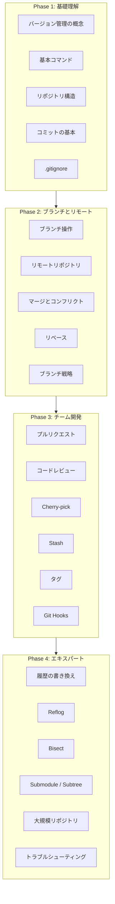

### Gitの3つの状態

Gitを理解する上で最も重要な概念。ファイルは常にこの3つの状態のいずれかにある。

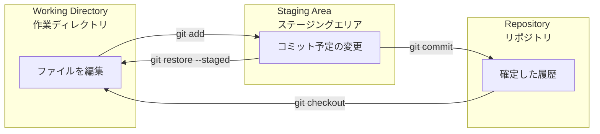

| 状態 | 説明 | 確認コマンド |
|------|------|-------------|
| Working Directory | 実際に編集しているファイル | `git status` |
| Staging Area | 次のコミットに含める変更 | `git diff --staged` |
| Repository | 確定したコミット履歴 | `git log` |

### push / pull のフロー

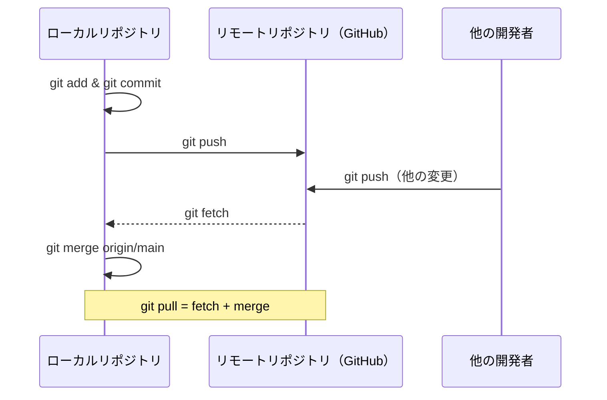

---

## Phase 1: 基礎理解（初級）

Gitの基本概念と基本操作を習得する。

### 1.1 Gitとは

#### バージョン管理とは

バージョン管理システム（VCS）は、ファイルの変更履歴を記録し、特定のバージョンに戻したり、変更を追跡したりするためのシステム。

なぜバージョン管理が必要か：

- **履歴の追跡**: いつ、誰が、何を変更したかを記録
- **変更の取り消し**: 問題が発生した場合に以前の状態に戻せる
- **並行開発**: 複数人が同時に作業できる
- **ブランチ**: 機能ごとに独立した開発が可能

#### 分散型バージョン管理の特徴

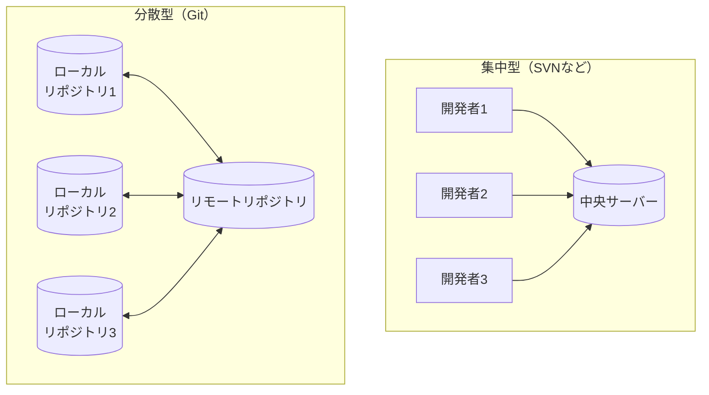

| 特徴 | 集中型 | 分散型（Git） |
|------|--------|--------------|
| オフライン作業 | 不可 | 可能 |
| 速度 | サーバー依存 | 高速（ローカル） |
| バックアップ | サーバーのみ | 全員が持つ |
| ブランチ | 重い | 軽量 |

#### 学習目標

- [ ] バージョン管理の必要性を説明できる
- [ ] 分散型と集中型の違いを説明できる
- [ ] Gitを選ぶ理由を理解している

---

### 1.2 基本コマンド

#### 初期設定

```bash
# ユーザー名とメールアドレスの設定（必須）
git config --global user.name "あなたの名前"
git config --global user.email "your.email@example.com"

# デフォルトブランチ名をmainに設定
git config --global init.defaultBranch main

# エディタの設定（VS Codeの例）
git config --global core.editor "code --wait"

# 設定の確認
git config --list
```

#### リポジトリの作成・クローン

```bash
# 新規リポジトリの作成
mkdir my-project
cd my-project
git init

# 既存リポジトリのクローン
git clone https://github.com/user/repository.git

# 特定のブランチをクローン
git clone -b develop https://github.com/user/repository.git

# 浅いクローン（最新のコミットのみ）
git clone --depth 1 https://github.com/user/repository.git
```

#### 基本的なワークフロー

```bash
# 1. 状態の確認
git status

# 2. 変更をステージング
git add filename.txt          # 特定のファイル
git add .                     # カレントディレクトリ以下すべて
git add -p                    # 対話的に部分追加

# 3. コミット
git commit -m "feat: 新機能を追加"

# 4. 履歴の確認
git log                       # 詳細表示
git log --oneline            # 1行表示
git log --graph --oneline    # グラフ表示
```

#### 変更の確認

```bash
# 作業ディレクトリの変更を確認
git diff

# ステージングエリアの変更を確認
git diff --staged

# 特定のコミット間の差分
git diff commit1..commit2

# 特定のファイルの差分
git diff filename.txt
```

#### 変更の取り消し

```bash
# ステージングを取り消し（ファイルは変更されたまま）
git restore --staged filename.txt

# 作業ディレクトリの変更を取り消し（注意：変更が失われる）
git restore filename.txt

# 直前のコミットを修正（まだpushしていない場合のみ）
git commit --amend -m "修正されたコミットメッセージ"
```

#### 学習目標

- [ ] git init/cloneでリポジトリを作成・取得できる
- [ ] git add/commit/statusの基本フローを実行できる
- [ ] git diffで変更を確認できる
- [ ] git restoreで変更を取り消せる

---

### 1.3 リポジトリ構造

#### .gitディレクトリの中身

```
.git/
├── HEAD              # 現在のブランチへの参照
├── config            # リポジトリ固有の設定
├── description       # GitWebで使用される説明
├── hooks/            # フックスクリプト
├── index             # ステージングエリア
├── objects/          # すべてのコンテンツ（コミット、ツリー、ブロブ）
└── refs/             # ブランチとタグへの参照
    ├── heads/        # ローカルブランチ
    ├── remotes/      # リモート追跡ブランチ
    └── tags/         # タグ
```

#### Gitオブジェクト

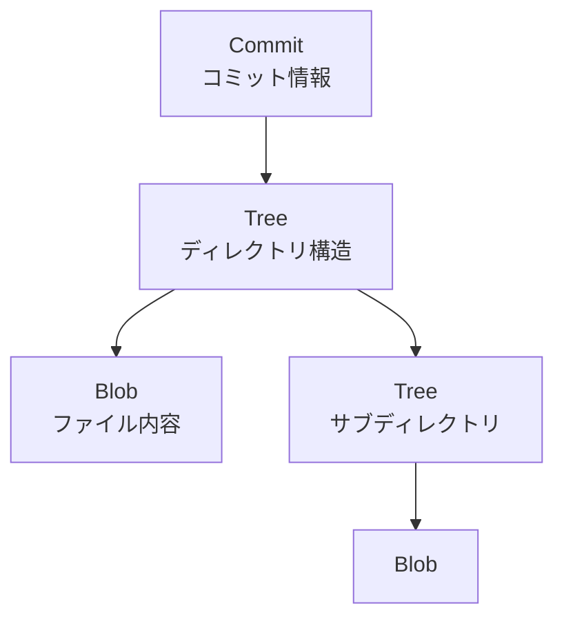

| オブジェクト | 説明 | 格納内容 |
|-------------|------|---------|
| Blob | ファイルの内容 | バイナリデータ |
| Tree | ディレクトリ構造 | Blob/Treeへの参照 |
| Commit | コミット情報 | Tree、親コミット、メタ情報 |
| Tag | 注釈付きタグ | コミットへの参照、メタ情報 |

#### HEADとは

```bash
# HEADの確認
cat .git/HEAD
# ref: refs/heads/main

# HEADが指すコミット
git rev-parse HEAD
# a1b2c3d4...

# detached HEAD状態（特定のコミットをチェックアウト）
git checkout a1b2c3d4
```

なぜHEADが重要か：

- 現在作業中のブランチ/コミットを示す
- 新しいコミットはHEADの位置に作られる
- ブランチ切り替え時にHEADが移動する

#### 学習目標

- [ ] .gitディレクトリの役割を理解している
- [ ] Blob、Tree、Commitの関係を説明できる
- [ ] HEADの意味を理解している

---

### 1.4 コミットの基本

#### 良いコミットメッセージの書き方

```
<type>(<scope>): <subject>

<body>

<footer>
```

#### Conventional Commits

| タイプ | 説明 | 例 |
|--------|------|-----|
| `feat` | 新機能 | `feat: ユーザー登録機能を追加` |
| `fix` | バグ修正 | `fix: ログイン時のエラーを修正` |
| `docs` | ドキュメント | `docs: READMEを更新` |
| `style` | フォーマット | `style: コードフォーマットを修正` |
| `refactor` | リファクタリング | `refactor: 認証ロジックを整理` |
| `test` | テスト | `test: ユーザーサービスのテストを追加` |
| `chore` | その他 | `chore: 依存関係を更新` |

#### コミットメッセージの例

```bash
# 良い例
git commit -m "feat(auth): ソーシャルログイン機能を追加

- Googleログインを実装
- GitHubログインを実装
- OAuthコールバック処理を追加

Closes #123"

# 悪い例
git commit -m "修正"
git commit -m "バグを直した"
git commit -m "WIP"
```

#### 1コミット1変更の原則

```bash
# 悪い例：複数の変更を1つのコミットに
git add .
git commit -m "機能追加とバグ修正とリファクタリング"

# 良い例：変更ごとにコミット
git add src/auth/
git commit -m "feat(auth): 認証機能を追加"

git add src/utils/
git commit -m "refactor(utils): ヘルパー関数を整理"

git add tests/
git commit -m "test(auth): 認証機能のテストを追加"
```

なぜ分けるのか：

- **レビューしやすい**: 変更の意図が明確
- **バグ特定が容易**: bisectで原因を特定しやすい
- **cherry-pickしやすい**: 特定の変更だけ取り込める
- **revertしやすい**: 問題のある変更だけ取り消せる

#### 学習目標

- [ ] Conventional Commits形式でコミットメッセージを書ける
- [ ] 1コミット1変更の原則を理解している
- [ ] なぜ良いコミットメッセージが重要か説明できる

---

### 1.5 .gitignore

#### 基本的なパターン

```gitignore
# コメント
# .gitignoreファイル

# 特定のファイル
secret.txt

# 特定の拡張子
*.log
*.tmp

# ディレクトリ
node_modules/
dist/
build/

# ルートディレクトリのみ
/config.local.js

# 否定パターン（除外しない）
!important.log

# ワイルドカード
*.py[cod]          # .pyc, .pyo, .pyd
**/*.backup        # 全階層の.backupファイル
```

#### プロジェクト別テンプレート

```gitignore
# Node.js プロジェクト
node_modules/
npm-debug.log
yarn-error.log
.env
.env.local
.env.*.local
dist/
coverage/

# macOS
.DS_Store
.AppleDouble
.LSOverride

# IDE
.idea/
.vscode/
*.swp
*.swo

# ビルド成果物
*.min.js
*.min.css
```

#### グローバル.gitignore

```bash
# グローバル設定（全リポジトリ共通）
git config --global core.excludesFile ~/.gitignore_global

# ~/.gitignore_global の内容
.DS_Store
Thumbs.db
*.swp
.idea/
.vscode/
```

#### すでにコミットしたファイルを無視する

```bash
# キャッシュから削除（ファイルは残る）
git rm --cached filename.txt

# ディレクトリの場合
git rm -r --cached node_modules/

# .gitignoreに追加してコミット
echo "node_modules/" >> .gitignore
git add .gitignore
git commit -m "chore: node_modulesを.gitignoreに追加"
```

#### 学習目標

- [ ] .gitignoreのパターン構文を理解している
- [ ] プロジェクトに適した.gitignoreを作成できる
- [ ] すでにコミットしたファイルを無視する方法を知っている

---

## Phase 2: ブランチとリモート（中級）

ブランチ操作とリモートリポジトリとの連携を習得する。

### 2.1 ブランチ操作

#### ブランチの概念

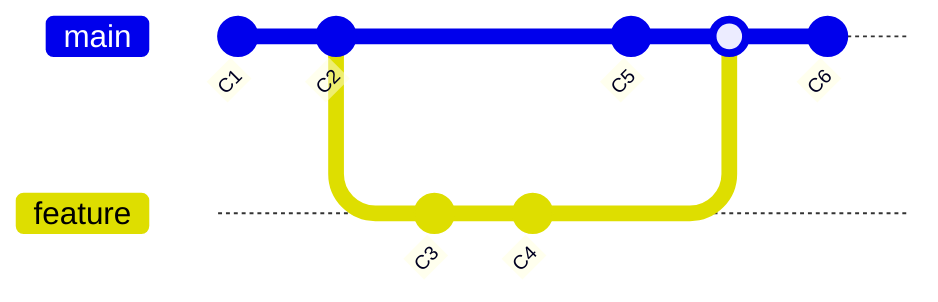

ブランチは単なる「コミットへのポインタ」。軽量で高速に作成・削除できる。

#### 基本的なブランチ操作

```bash
# ブランチ一覧
git branch              # ローカルブランチ
git branch -r           # リモート追跡ブランチ
git branch -a           # すべてのブランチ

# ブランチの作成
git branch feature/user-auth

# ブランチの切り替え
git checkout feature/user-auth
# または（Git 2.23以降）
git switch feature/user-auth

# 作成と切り替えを同時に
git checkout -b feature/user-auth
# または
git switch -c feature/user-auth

# ブランチの削除
git branch -d feature/user-auth    # マージ済みのみ削除可
git branch -D feature/user-auth    # 強制削除

# ブランチ名の変更
git branch -m old-name new-name
```

#### ブランチの命名規則

| プレフィックス | 用途 | 例 |
|---------------|------|-----|
| `feature/` | 新機能開発 | `feature/user-registration` |
| `bugfix/` | バグ修正 | `bugfix/login-error` |
| `hotfix/` | 緊急修正 | `hotfix/security-patch` |
| `release/` | リリース準備 | `release/v1.2.0` |
| `docs/` | ドキュメント | `docs/api-reference` |
| `refactor/` | リファクタリング | `refactor/auth-module` |

```bash
# 良い例
git checkout -b feature/issue-123-add-oauth
git checkout -b bugfix/fix-null-pointer-exception
git checkout -b hotfix/security-vulnerability-cve-2024-xxxx

# 悪い例
git checkout -b test
git checkout -b my-branch
git checkout -b asdf
```

#### 学習目標

- [ ] ブランチの概念を説明できる
- [ ] ブランチの作成・切り替え・削除ができる
- [ ] 命名規則に従ったブランチ名を付けられる

---

### 2.2 リモートリポジトリ

#### リモートの操作

```bash
# リモートの確認
git remote -v

# リモートの追加
git remote add origin https://github.com/user/repo.git
git remote add upstream https://github.com/original/repo.git

# リモートの削除
git remote remove origin

# リモートURLの変更
git remote set-url origin https://github.com/user/new-repo.git
```

#### fetch / pull / push

```bash
# リモートの変更を取得（マージしない）
git fetch origin
git fetch --all              # すべてのリモート

# リモートの変更を取得してマージ
git pull origin main
git pull --rebase origin main   # マージではなくリベース

# ローカルの変更をプッシュ
git push origin main
git push -u origin feature/new   # 上流ブランチを設定
git push --force-with-lease      # 安全な強制プッシュ
```

#### push / pull のフロー詳細

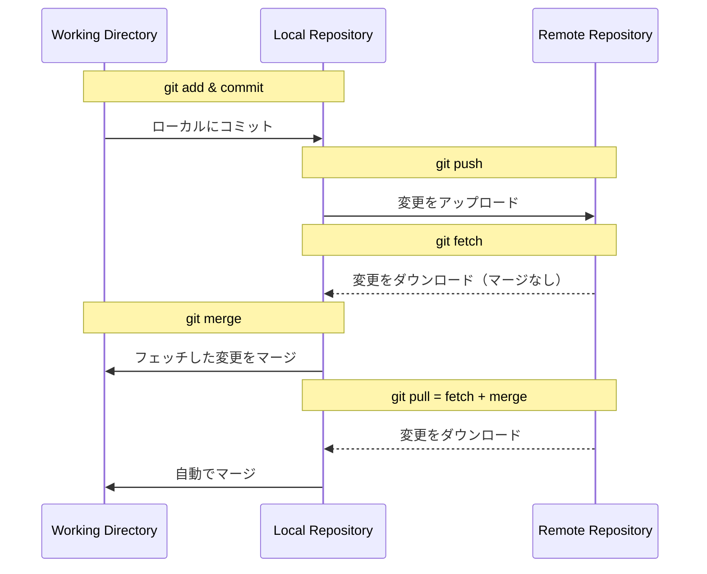

#### 上流ブランチ（Upstream）

```bash
# 上流ブランチの設定
git push -u origin feature/new
# または
git branch --set-upstream-to=origin/feature/new

# 上流ブランチの確認
git branch -vv

# 上流ブランチが設定されていれば、以下が可能
git push        # origin feature/new にプッシュ
git pull        # origin/feature/new からプル
```

#### 学習目標

- [ ] リモートの追加・削除ができる
- [ ] fetch/pull/pushの違いを説明できる
- [ ] 上流ブランチを設定・活用できる

---

### 2.3 マージとコンフリクト

#### マージの種類

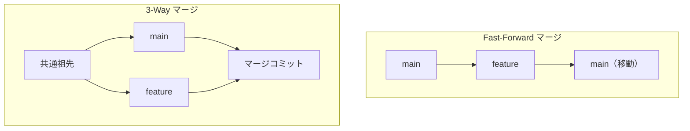

```bash
# Fast-Forwardマージ（直線的な場合）
git checkout main
git merge feature/new
# Already up to date or Fast-forward

# 3-Wayマージ（分岐がある場合）
git merge feature/complex
# マージコミットが作成される

# Fast-Forwardを禁止（常にマージコミットを作成）
git merge --no-ff feature/new

# マージを中止
git merge --abort
```

#### コンフリクト解決のフロー

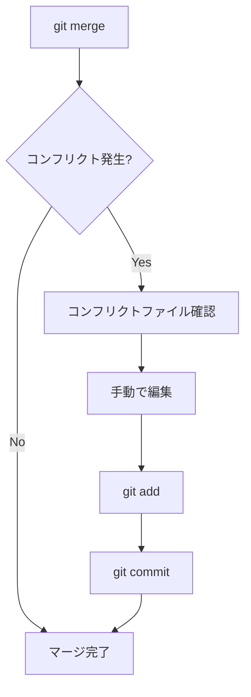

#### コンフリクトの解決

```bash
# コンフリクトの確認
git status

# コンフリクトファイルの内容
<<<<<<< HEAD
mainブランチの内容
=======
featureブランチの内容
>>>>>>> feature/new

# 手動で編集して解決
# マーカーを削除し、正しい内容を残す

# 解決後
git add resolved-file.txt
git commit -m "merge: feature/newをmainにマージ"
```

#### コンフリクト解決ツール

```bash
# マージツールの設定
git config --global merge.tool vimdiff
# または vscode, meld, kdiff3 など

# マージツールの起動
git mergetool

# VS Codeでの解決
# 1. ファイルを開く
# 2. "Accept Current Change" / "Accept Incoming Change" / "Accept Both Changes" を選択
# 3. 必要に応じて手動編集
```

#### 学習目標

- [ ] Fast-Forwardと3-Wayマージの違いを説明できる
- [ ] コンフリクトを手動で解決できる
- [ ] マージツールを使用できる

---

### 2.4 リベース

#### マージ vs リベース

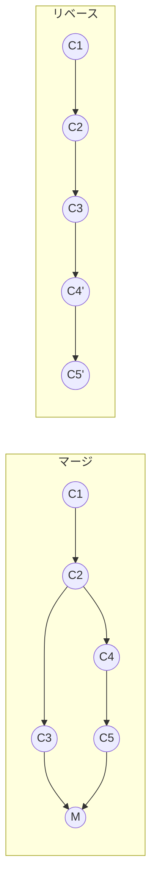

| 項目 | マージ | リベース |
|------|--------|---------|
| 履歴 | 分岐を保持 | 直線的 |
| コンフリクト | 一度で解決 | コミットごと |
| 安全性 | 安全 | 公開済みは危険 |
| 用途 | 機能統合 | 履歴整理 |

#### 基本的なリベース

```bash
# featureブランチをmainの最新に追従
git checkout feature/new
git rebase main

# コンフリクトが発生した場合
git status                    # コンフリクトファイル確認
# ファイルを編集して解決
git add resolved-file.txt
git rebase --continue

# リベースを中止
git rebase --abort

# リベースをスキップ（現在のコミットを飛ばす）
git rebase --skip
```

#### Interactive Rebase

```bash
# 直近5コミットを編集
git rebase -i HEAD~5

# エディタで開かれる内容
pick a1b2c3d feat: 機能A
pick e4f5g6h feat: 機能B
pick i7j8k9l fix: バグ修正
pick m0n1o2p docs: ドキュメント
pick q3r4s5t chore: 設定変更

# コマンド
# pick   - コミットをそのまま使用
# reword - コミットメッセージを変更
# edit   - コミットを編集
# squash - 前のコミットに統合（メッセージも統合）
# fixup  - 前のコミットに統合（メッセージは破棄）
# drop   - コミットを削除
```

#### リベースの使い分け判断フロー

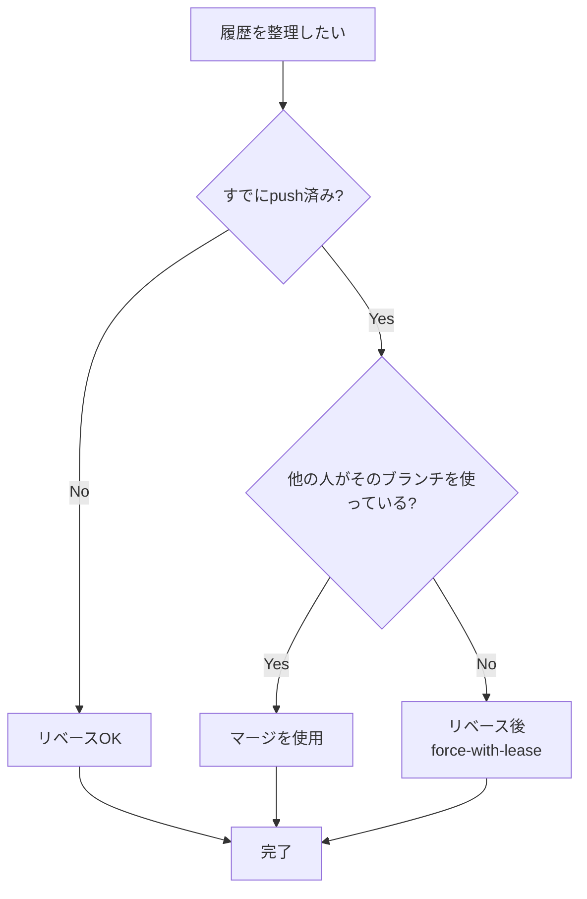

#### ゴールデンルール

**公開済みのコミットをリベースしない**

```bash
# 危険：共有ブランチでのリベース
git checkout main
git rebase feature/x    # ❌ 絶対にダメ

# 安全：ローカルブランチでのリベース
git checkout feature/my-work
git rebase main          # ✅ OK
```

#### 学習目標

- [ ] マージとリベースの違いを説明できる
- [ ] 基本的なリベースを実行できる
- [ ] Interactive Rebaseでコミットを整理できる
- [ ] リベースのゴールデンルールを理解している

---

### 2.5 ブランチ戦略

#### Git Flow

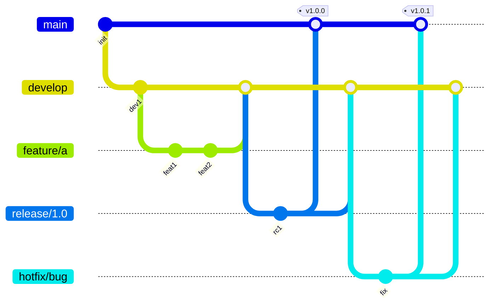

| ブランチ | 用途 | 派生元 | マージ先 |
|---------|------|--------|---------|
| main | 本番リリース | - | - |
| develop | 開発統合 | main | main |
| feature/* | 機能開発 | develop | develop |
| release/* | リリース準備 | develop | main, develop |
| hotfix/* | 緊急修正 | main | main, develop |

#### GitHub Flow

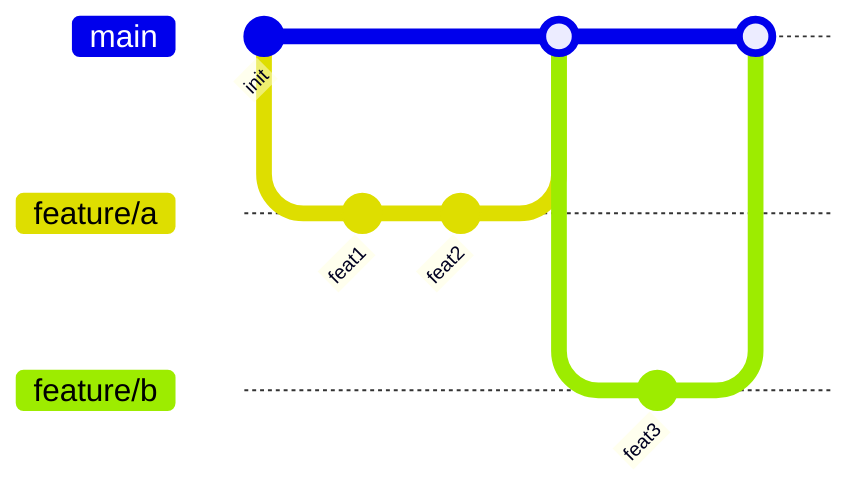

Git Flowよりシンプル。継続的デリバリーに適している。

ルール：
1. mainは常にデプロイ可能
2. 機能はmainから分岐
3. 定期的にプッシュ
4. プルリクエストでレビュー
5. レビュー後にmainへマージ
6. マージ後すぐにデプロイ

#### どちらを選ぶか

| 項目 | Git Flow | GitHub Flow |
|------|----------|-------------|
| 複雑さ | 高い | 低い |
| リリースサイクル | 定期的 | 継続的 |
| チーム規模 | 大規模 | 小〜中規模 |
| 適したプロジェクト | パッケージ、モバイルアプリ | Web、SaaS |

#### 学習目標

- [ ] Git Flowのブランチ構成を説明できる
- [ ] GitHub Flowのワークフローを実践できる
- [ ] プロジェクトに適した戦略を選択できる

---

## Phase 3: チーム開発（上級）

チーム開発で必要なスキルを習得する。

### 3.1 プルリクエスト

#### プルリクエストのワークフロー

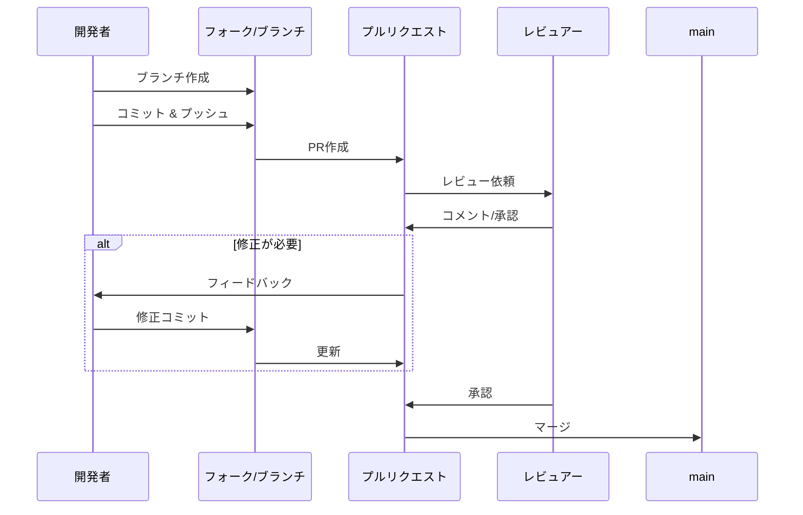

#### 良いプルリクエストの書き方

```markdown
## 概要
<!-- 変更の概要を1-2文で -->
ユーザー認証機能にGoogleログインを追加しました。

## 変更内容
- Google OAuth 2.0の実装
- ログインボタンのUIコンポーネント追加
- ユーザーモデルにgoogle_idカラムを追加

## 関連Issue
Closes #123

## スクリーンショット
<!-- UIの変更がある場合 -->


## テスト方法
1. `.env.local`に`GOOGLE_CLIENT_ID`と`GOOGLE_CLIENT_SECRET`を設定
2. ログイン画面にアクセス
3. 「Googleでログイン」ボタンをクリック
4. Googleアカウントで認証

## チェックリスト
- [x] テストを追加/更新した
- [x] ドキュメントを更新した
- [x] セルフレビューを行った
- [ ] デザインレビューが必要
```

#### CLIでのPR操作（GitHub CLI）

```bash
# プルリクエストの作成
gh pr create --title "feat: Googleログインを追加" --body "詳細..."

# プルリクエストの一覧
gh pr list

# プルリクエストの確認
gh pr view 123

# プルリクエストをチェックアウト
gh pr checkout 123

# プルリクエストのマージ
gh pr merge 123 --merge
gh pr merge 123 --squash
gh pr merge 123 --rebase
```

#### 学習目標

- [ ] プルリクエストのワークフローを理解している
- [ ] 良いPR説明を書ける
- [ ] GitHub CLIでPRを操作できる

---

### 3.2 コードレビュー

#### レビューのベストプラクティス

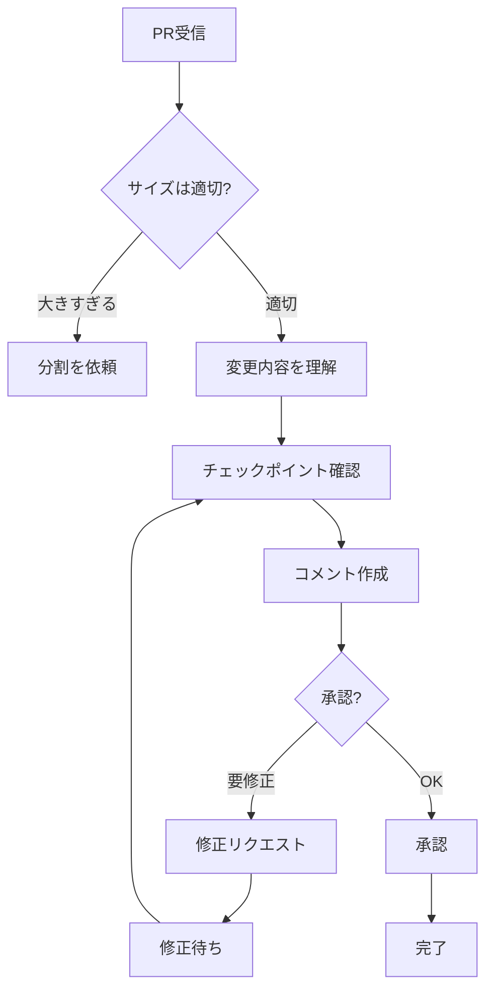

#### チェックポイント

| カテゴリ | 確認項目 |
|---------|---------|
| 機能性 | 要件を満たしているか |
| 可読性 | コードが理解しやすいか |
| 保守性 | 将来の変更が容易か |
| テスト | 十分なテストがあるか |
| セキュリティ | 脆弱性がないか |
| パフォーマンス | 効率的な実装か |

#### コメントの書き方

```markdown
# 良いコメント
🔍 この関数は引数のバリデーションがないようです。
nullが渡された場合のエラーハンドリングを追加してはどうでしょうか？

```javascript
function processUser(user) {
  if (!user) {
    throw new Error('User is required');
  }
  // ...
}
```

# 悪いコメント
これは間違ってる。直して。
```

#### コメントのプレフィックス

| プレフィックス | 意味 | 必須対応 |
|---------------|------|---------|
| `[must]` | 必須の修正 | Yes |
| `[should]` | 推奨の修正 | 強く推奨 |
| `[nit]` | 些細な指摘 | No |
| `[question]` | 質問 | 回答のみ |
| `[suggestion]` | 提案 | 検討 |

#### 学習目標

- [ ] 効果的なコードレビューができる
- [ ] 建設的なフィードバックを書ける
- [ ] レビューコメントの優先度を示せる

---

### 3.3 Cherry-pick

#### Cherry-pickの概念

```mermaid
gitGraph
    commit id: "C1"
    commit id: "C2"
    branch feature
    checkout feature
    commit id: "C3"
    commit id: "C4" type: HIGHLIGHT
    commit id: "C5"
    checkout main
    commit id: "C6"
    cherry-pick id: "C4'"
```

特定のコミットだけを別のブランチに適用する。

```bash
# 単一のコミットを適用
git cherry-pick abc1234

# 複数のコミットを適用
git cherry-pick abc1234 def5678

# 範囲を指定（開始は含まない）
git cherry-pick abc1234..def5678

# 範囲を指定（開始も含む）
git cherry-pick abc1234^..def5678

# コミットせずに変更だけ適用
git cherry-pick --no-commit abc1234

# コンフリクト時
git cherry-pick --continue  # 解決後に続行
git cherry-pick --abort     # 中止
git cherry-pick --skip      # スキップ
```

#### ユースケース

```bash
# 1. hotfixをdevelopにも適用
git checkout develop
git cherry-pick <hotfix-commit>

# 2. 間違ったブランチにコミットした場合
git checkout correct-branch
git cherry-pick <wrong-commit>
git checkout wrong-branch
git reset --hard HEAD~1

# 3. リリースブランチに特定の修正を適用
git checkout release/1.0
git cherry-pick <bugfix-commit>
```

#### 学習目標

- [ ] cherry-pickの用途を理解している
- [ ] 単一・複数のコミットをcherry-pickできる
- [ ] コンフリクト時の対応ができる

---

### 3.4 Stash

#### 基本操作

```bash
# 変更を一時保存
git stash
git stash save "作業中の機能A"

# stash一覧
git stash list
# stash@{0}: WIP on main: abc1234 最新のコミット
# stash@{1}: On feature: 作業中の機能A

# stashの内容確認
git stash show           # 概要
git stash show -p        # 差分

# stashを適用
git stash pop            # 適用して削除
git stash apply          # 適用のみ（削除しない）
git stash apply stash@{1}  # 特定のstashを適用

# stashの削除
git stash drop stash@{0}
git stash clear          # すべて削除
```

#### ユースケース

```bash
# 1. 緊急のバグ修正が必要な場合
git stash                    # 現在の作業を保存
git checkout main
git checkout -b hotfix/bug
# バグ修正
git checkout feature/work
git stash pop                # 作業を復元

# 2. 別ブランチに変更を移動
git stash
git checkout other-branch
git stash pop

# 3. 部分的にstash
git stash -p                 # 対話的に選択
git stash --keep-index       # ステージングは残す
```

#### 学習目標

- [ ] stashの基本操作ができる
- [ ] 適切な場面でstashを活用できる
- [ ] 部分的なstashができる

---

### 3.5 タグ

#### タグの種類

| 種類 | 説明 | 用途 |
|------|------|------|
| 軽量タグ | コミットへのポインタのみ | 一時的なマーク |
| 注釈付きタグ | メタ情報を含む完全なオブジェクト | リリース |

```bash
# 軽量タグの作成
git tag v1.0.0

# 注釈付きタグの作成
git tag -a v1.0.0 -m "バージョン1.0.0リリース"

# 過去のコミットにタグ
git tag -a v0.9.0 abc1234 -m "ベータ版"

# タグ一覧
git tag
git tag -l "v1.*"    # パターンで絞り込み

# タグの詳細
git show v1.0.0

# タグをプッシュ
git push origin v1.0.0
git push origin --tags    # すべてのタグ

# タグの削除
git tag -d v1.0.0              # ローカル
git push origin --delete v1.0.0  # リモート
```

#### セマンティックバージョニング

```
MAJOR.MINOR.PATCH

例: v2.1.3
- MAJOR: 2 (後方互換性のない変更)
- MINOR: 1 (後方互換性のある機能追加)
- PATCH: 3 (後方互換性のあるバグ修正)

プレリリース: v1.0.0-alpha, v1.0.0-beta.1, v1.0.0-rc.1
```

#### 学習目標

- [ ] 軽量タグと注釈付きタグの違いを説明できる
- [ ] タグの作成・プッシュ・削除ができる
- [ ] セマンティックバージョニングを理解している

---

### 3.6 Git Hooks

#### 主要なフック

| フック | タイミング | 用途 |
|--------|----------|------|
| pre-commit | コミット前 | Lint、フォーマット |
| commit-msg | コミットメッセージ入力後 | メッセージ検証 |
| pre-push | プッシュ前 | テスト実行 |
| post-merge | マージ後 | 依存関係更新 |

#### pre-commitフックの例

```bash
#!/bin/sh
# .git/hooks/pre-commit

# ESLintの実行
npm run lint
if [ $? -ne 0 ]; then
    echo "❌ Lintエラーがあります。修正してください。"
    exit 1
fi

# Prettierでフォーマットチェック
npm run format:check
if [ $? -ne 0 ]; then
    echo "❌ フォーマットが必要です。npm run formatを実行してください。"
    exit 1
fi

echo "✅ pre-commitチェック完了"
exit 0
```

#### commit-msgフックの例

```bash
#!/bin/sh
# .git/hooks/commit-msg

commit_msg=$(cat "$1")
pattern="^(feat|fix|docs|style|refactor|test|chore)(\(.+\))?: .{1,50}"

if ! echo "$commit_msg" | grep -qE "$pattern"; then
    echo "❌ コミットメッセージがConventional Commits形式ではありません"
    echo "例: feat(auth): ログイン機能を追加"
    exit 1
fi

exit 0
```

#### Huskyを使ったフック管理

```bash
# Huskyのインストール
npm install -D husky
npx husky install

# pre-commitフックの追加
npx husky add .husky/pre-commit "npm run lint"

# commit-msgフックの追加（commitlintと併用）
npm install -D @commitlint/cli @commitlint/config-conventional
npx husky add .husky/commit-msg "npx --no -- commitlint --edit $1"
```

```javascript
// commitlint.config.js
module.exports = {
  extends: ['@commitlint/config-conventional'],
};
```

#### 学習目標

- [ ] 主要なフックの用途を理解している
- [ ] 基本的なフックスクリプトを作成できる
- [ ] Huskyでフックを管理できる

---

## Phase 4: 高度な操作とトラブルシューティング（エキスパート）

高度な操作と問題解決スキルを習得する。

### 4.1 履歴の書き換え

#### コミットの修正

```bash
# 直前のコミットを修正
git commit --amend -m "新しいメッセージ"

# 直前のコミットにファイルを追加
git add forgotten-file.txt
git commit --amend --no-edit

# 過去のコミットを修正（Interactive Rebase）
git rebase -i HEAD~5
# edit を指定
# 修正後
git commit --amend
git rebase --continue
```

#### コミットの並べ替え・統合・削除

```bash
# Interactive Rebase
git rebase -i HEAD~5

# エディタで操作
pick abc1234 feat: 機能A
squash def5678 fix: 機能Aの修正  # 上のコミットに統合
pick ghi9012 feat: 機能B
drop jkl3456 WIP                  # 削除
reword mno7890 docs: ドキュメント # メッセージ変更
```

#### filter-branch（非推奨）とgit-filter-repo

```bash
# git-filter-repoのインストール
pip install git-filter-repo

# 全履歴からファイルを削除
git filter-repo --path secrets.txt --invert-paths

# 全履歴でメールアドレスを変更
git filter-repo --email-callback '
    return email.replace(b"old@email.com", b"new@email.com")
'
```

#### 学習目標

- [ ] コミットの修正ができる
- [ ] Interactive Rebaseでコミットを整理できる
- [ ] 履歴書き換えの危険性を理解している

---

### 4.2 Reflog

#### Reflogとは

```bash
# reflogの表示
git reflog
# abc1234 HEAD@{0}: commit: feat: 新機能
# def5678 HEAD@{1}: checkout: moving from feature to main
# ghi9012 HEAD@{2}: commit: fix: バグ修正
# jkl3456 HEAD@{3}: rebase: 完了

# 特定のブランチのreflog
git reflog show feature

# 時間指定での検索
git reflog --since="2 days ago"
```

#### 失われたコミットの復旧

```bash
# 誤ってリセットした場合
git reset --hard HEAD~3  # 間違えた！

# reflogで元のコミットを探す
git reflog
# abc1234 HEAD@{0}: reset: moving to HEAD~3
# xyz9876 HEAD@{1}: commit: 大事なコミット  # これを復旧したい

# 復旧
git reset --hard xyz9876

# 削除したブランチの復旧
git branch -D important-branch  # 間違えた！

git reflog
# abc1234 HEAD@{2}: checkout: moving from important-branch to main

git checkout -b important-branch abc1234
```

#### 学習目標

- [ ] reflogの用途を理解している
- [ ] 失われたコミットを復旧できる
- [ ] 削除したブランチを復旧できる

---

### 4.3 Bisect

#### バグの原因特定

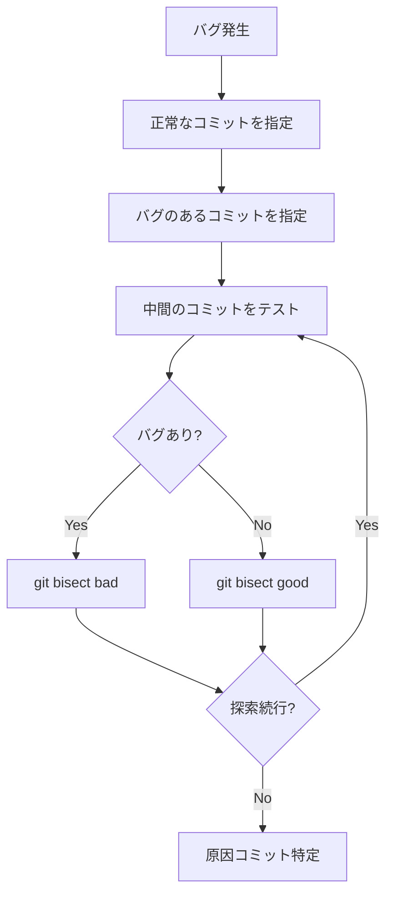

```bash
# bisect開始
git bisect start

# バグのあるコミット（現在）を指定
git bisect bad

# 正常なコミットを指定
git bisect good v1.0.0

# Gitが中間のコミットをチェックアウト
# テストして結果を報告
git bisect good  # バグなし
git bisect bad   # バグあり

# 繰り返すと原因コミットが特定される
# abc1234 is the first bad commit

# 終了
git bisect reset
```

#### 自動bisect

```bash
# テストスクリプトで自動化
git bisect start HEAD v1.0.0
git bisect run npm test

# または
git bisect run ./test-script.sh
```

#### 学習目標

- [ ] bisectの仕組みを理解している
- [ ] 手動でbisectを実行できる
- [ ] 自動bisectを設定できる

---

### 4.4 Submodule / Subtree

#### Submodule

```bash
# サブモジュールの追加
git submodule add https://github.com/user/lib.git libs/lib

# サブモジュールを含むリポジトリをクローン
git clone --recursive https://github.com/user/project.git
# または
git clone https://github.com/user/project.git
git submodule init
git submodule update

# サブモジュールの更新
git submodule update --remote

# サブモジュールの削除
git submodule deinit libs/lib
git rm libs/lib
rm -rf .git/modules/libs/lib
```

#### Subtree

```bash
# サブツリーの追加
git subtree add --prefix=libs/lib https://github.com/user/lib.git main --squash

# サブツリーの更新
git subtree pull --prefix=libs/lib https://github.com/user/lib.git main --squash

# サブツリーの変更をプッシュ
git subtree push --prefix=libs/lib https://github.com/user/lib.git main
```

#### 比較

| 項目 | Submodule | Subtree |
|------|-----------|---------|
| 構造 | 参照（ポインタ） | コピー |
| 複雑さ | 高い | 中程度 |
| 操作 | 2段階（親と子） | 1段階 |
| 履歴 | 分離 | 統合 |
| 適したケース | 大きなライブラリ | 小さな共有コード |

#### 学習目標

- [ ] SubmoduleとSubtreeの違いを説明できる
- [ ] Submoduleの基本操作ができる
- [ ] 適切な方式を選択できる

---

### 4.5 大規模リポジトリ

#### Shallow Clone

```bash
# 深さを指定してクローン
git clone --depth 1 https://github.com/large/repo.git

# 後から履歴を取得
git fetch --unshallow

# 特定の深さまで取得
git fetch --depth 100
```

#### Sparse Checkout

```bash
# sparse-checkoutを有効化
git clone --filter=blob:none --sparse https://github.com/large/repo.git
cd repo

# 特定のディレクトリのみチェックアウト
git sparse-checkout set src/frontend docs

# パターンの追加
git sparse-checkout add tests/unit

# 設定の確認
git sparse-checkout list

# 無効化（全ファイル取得）
git sparse-checkout disable
```

#### Partial Clone

```bash
# blobless clone（ファイル内容は必要時に取得）
git clone --filter=blob:none https://github.com/large/repo.git

# treeless clone（ディレクトリ構造も必要時に取得）
git clone --filter=tree:0 https://github.com/large/repo.git
```

#### 学習目標

- [ ] Shallow Cloneを使用できる
- [ ] Sparse Checkoutを設定できる
- [ ] 大規模リポジトリの効率的な操作ができる

---

### 4.6 トラブルシューティング

#### よくある問題と解決策

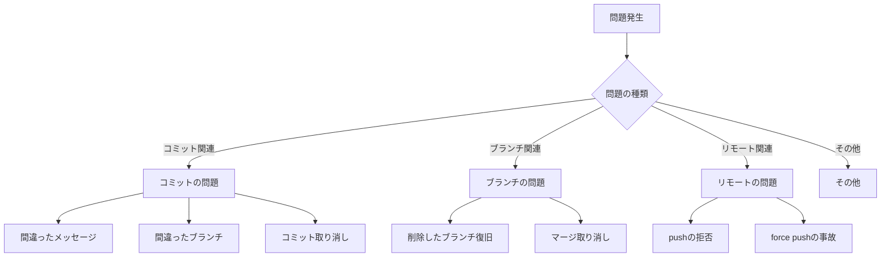

#### コミット関連

```bash
# 間違ったコミットメッセージを修正
git commit --amend -m "正しいメッセージ"

# 間違ったブランチにコミットした
git checkout correct-branch
git cherry-pick <commit>
git checkout wrong-branch
git reset --hard HEAD~1

# コミットを取り消し（変更は残す）
git reset --soft HEAD~1

# コミットを取り消し（変更も取り消し）
git reset --hard HEAD~1

# push済みのコミットを取り消し
git revert <commit>
git push
```

#### ブランチ関連

```bash
# 削除したブランチを復旧
git reflog
git checkout -b recovered-branch <commit>

# マージを取り消し（push前）
git reset --hard HEAD~1

# マージを取り消し（push後）
git revert -m 1 <merge-commit>
git push
```

#### リモート関連

```bash
# pushが拒否された（non-fast-forward）
git pull --rebase origin main
git push

# force pushで消えたコミットを復旧（他の開発者）
git reflog
git reset --hard <commit>

# 機密情報をコミットしてしまった
# 1. まずファイルを.gitignoreに追加
# 2. 履歴から削除（force push必要）
git filter-repo --path secrets.txt --invert-paths
git push --force-with-lease
# 3. 全員に通知し、クローンし直してもらう
# 4. シークレットをローテーション
```

#### detached HEAD

```bash
# detached HEAD状態の確認
git status
# HEAD detached at abc1234

# ブランチを作成して保存
git checkout -b new-branch

# 元のブランチに戻る
git checkout main
```

#### 学習目標

- [ ] 一般的なトラブルを自力で解決できる
- [ ] reflogを使った復旧ができる
- [ ] 適切なresetオプションを選択できる

---

## ベストプラクティス集

### コミット

| ルール | 説明 |
|--------|------|
| Conventional Commits | `feat:`, `fix:`, `docs:`などの形式を使用 |
| 1コミット1変更 | 論理的にまとまった変更を1コミットに |
| 意味のある単位 | WIPコミットは避け、squashで整理 |
| 現在形で書く | "Add feature" ではなく "feat: add feature" |

### ブランチ

| ルール | 説明 |
|--------|------|
| 命名規則 | `feature/`, `bugfix/`, `hotfix/`を使用 |
| 短命ブランチ | 長期間のブランチは避ける |
| mainへ直接push禁止 | PRを通してマージ |
| 定期的な同期 | mainの変更を定期的にrebase/merge |

### プルリクエスト

| ルール | 説明 |
|--------|------|
| 小さく頻繁に | 大きなPRは分割 |
| 説明を書く | 変更の意図、テスト方法を明記 |
| スクリーンショット | UIの変更は画像を添付 |
| CIパス必須 | テスト・Lintが通ってからマージ |

### セキュリティ

| ルール | 説明 |
|--------|------|
| 機密情報禁止 | `.env`、APIキーをコミットしない |
| .gitignoreの徹底 | 新規プロジェクトで最初に設定 |
| 署名付きコミット | GPGで署名（オプション） |
| アクセス権限管理 | 必要最小限の権限を付与 |

### エイリアス設定

```bash
# ~/.gitconfig
[alias]
    st = status
    co = checkout
    br = branch
    ci = commit
    df = diff
    lg = log --oneline --graph --all
    unstage = restore --staged
    last = log -1 HEAD
    amend = commit --amend --no-edit
    wip = commit -m "WIP"
    undo = reset --soft HEAD~1

    # ブランチ操作
    cleanup = "!git branch --merged | grep -v '\\*\\|main\\|develop' | xargs -n 1 git branch -d"

    # 便利なログ
    hist = log --pretty=format:'%C(yellow)%h%Creset %ad | %s%C(red)%d%Creset %C(blue)[%an]%Creset' --date=short
```

### .gitignoreテンプレート

```gitignore
# OS
.DS_Store
Thumbs.db

# IDE
.idea/
.vscode/
*.swp

# 依存関係
node_modules/
vendor/
venv/

# ビルド成果物
dist/
build/
*.min.js
*.min.css

# 環境変数
.env
.env.local
.env.*.local

# ログ
*.log
npm-debug.log*
yarn-debug.log*
yarn-error.log*

# テスト
coverage/
.nyc_output/

# キャッシュ
.cache/
.parcel-cache/
.next/
```

---

## 学習リソース

### 公式ドキュメント

- [Git公式ドキュメント](https://git-scm.com/doc) - 最も信頼できる情報源
- [Pro Git Book](https://git-scm.com/book/ja/v2) - 無料の公式書籍（日本語）
- [GitHub Docs](https://docs.github.com/ja) - GitHub固有の機能

### インタラクティブ学習

- [Learn Git Branching](https://learngitbranching.js.org/?locale=ja) - ビジュアルで学ぶ
- [Oh My Git!](https://ohmygit.org/) - ゲーム形式で学習

### チートシート

- [Git Cheat Sheet (GitHub)](https://training.github.com/downloads/ja/github-git-cheat-sheet/)
- [Atlassian Git Cheatsheet](https://www.atlassian.com/git/tutorials/atlassian-git-cheatsheet)

### コミュニティ

- [Stack Overflow](https://stackoverflow.com/questions/tagged/git) - Q&A
- [r/git](https://www.reddit.com/r/git/) - Reddit

---

## 学習のコツ

### 1. 実際に手を動かす

コマンドを読むだけでなく、実際にリポジトリを作成して試す。間違えても`reflog`で復旧できる。

### 2. ビジュアライゼーションを活用

```bash
# グラフィカルなログ表示
git log --graph --oneline --all

# GUIツール
# - GitKraken
# - Sourcetree
# - VS Code Git拡張
```

### 3. 段階的に進める

Phase 1〜2を確実に理解してから中級に進む。基礎が曖昧なまま進むとリベースやリセットで事故を起こす。

### 4. 失敗を恐れない

Gitはほぼすべての操作を取り消せる。`reflog`があれば大抵の失敗は復旧可能。ただし`--force`系のコマンドは慎重に。

### 5. エイリアスを設定する

頻繁に使うコマンドはエイリアスを設定して効率化。ただし、基本コマンドを理解してから設定する。

### 6. チームの規約に従う

ブランチ命名規則、コミットメッセージ形式など、チームの規約を優先する。

---

## チェックリスト活用法

各セクションの「学習目標」チェックボックスを活用して進捗を管理。すべてにチェックが入ったら次のPhaseへ進む目安とする。

---

*このロードマップは継続的にアップデートしていくことを推奨します。Gitの新機能やベストプラクティスの変化に合わせて、最新情報を常にキャッチアップしてください。*
