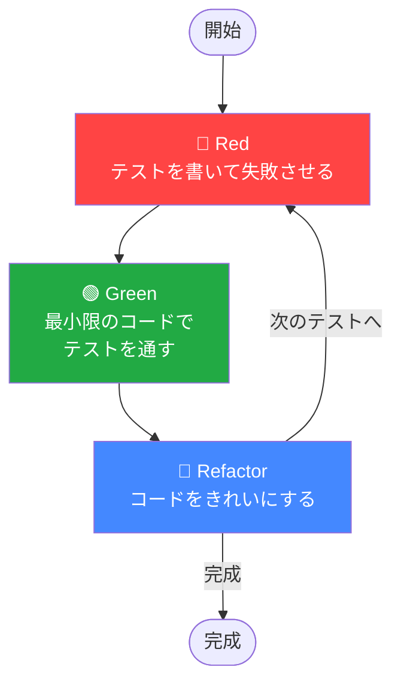
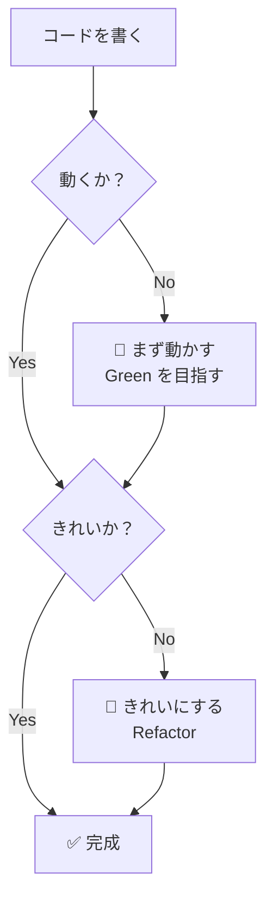
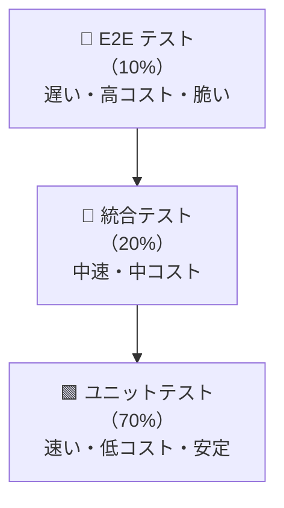
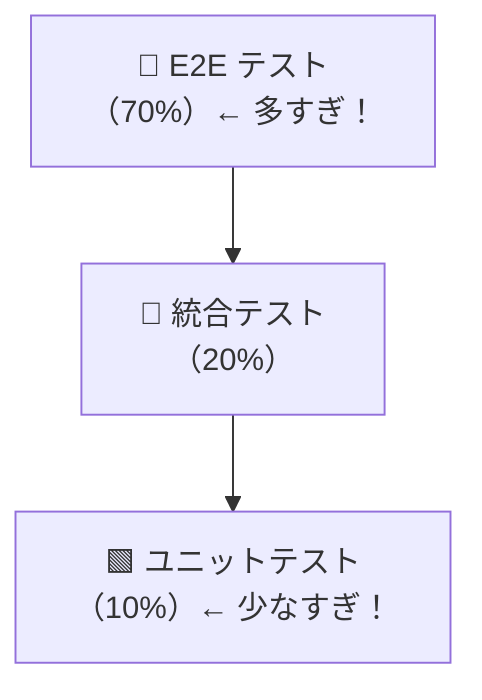

# テスト駆動開発（TDD）

## 概要

テスト駆動開発（Test Driven Development / TDD）は、**コードを書く前にテストを書く**開発手法です。
Kent Beck が提唱し、t-wada（和田卓人）氏が日本に広めた手法であり、単なる「テストファースト」ではなく、**テストを羅針盤にしてコード設計を導く**アプローチです。

> 「TDDとは、動く、きれいなコードを書くための開発技法である。」
> — Kent Beck（t-wada 訳）

---

## 目次

1. [TDDとは何か](#1-tddとは何か)
2. [Red-Green-Refactor サイクル](#2-red-green-refactor-サイクル)
3. [t-wadaが強調するTDDの本質](#3-t-wadaが強調するtddの本質)
4. [テストの種類とテストピラミッド](#4-テストの種類とテストピラミッド)
5. [よくある誤解・アンチパターン](#5-よくある誤解アンチパターン)
6. [メリット・デメリット](#6-メリットデメリット)
7. [実践ガイドライン](#7-実践ガイドライン)
8. [参考資料](#8-参考資料)

---

## 1. TDDとは何か

### 定義

TDDは以下の3つのルールから成ります（Robert C. Martin による定式化）。

1. **失敗するテストを書くまで、プロダクションコードを書いてはならない**
2. **コンパイルエラーでない失敗テストが1つある以上、テストを書き足してはならない**
3. **テストが通る以上に、プロダクションコードを書いてはならない**

これらのルールにより、開発者は「小さな一歩」を繰り返すことになります。

### TDD ≠ テストファースト

TDDとテストファーストは、しばしば混同されますが、本質的に異なります。

| 観点 | テストファースト | TDD |
|------|-----------------|-----|
| **目的** | バグの検出 | **設計の誘導** |
| **テストのタイミング** | 実装前に書く | 実装前に書く（同じ） |
| **リファクタリング** | 任意 | **必須（3ステップ目）** |
| **テストの粒度** | 大きなテストでも可 | **できるだけ小さな一歩** |
| **本質** | テストを先に書く | **フィードバックループを作る** |

> **なぜ区別が必要か？**
> テストファーストだけではリファクタリングが省略されやすく、「テストは書いてあるが設計が悪いコード」が生まれます。TDDはリファクタリングを必須ステップとすることで、**動く＋きれいなコード**を両立させます。

### インクリメンタルな設計が本質

TDDの本質は「テスト→実装→リファクタリング」の短いサイクルを繰り返すことで、**設計をインクリメンタルに育てていく**ことです。

大きな設計を最初に決定するのではなく、テストを一つ一つ通していく過程でコードの構造が自然に洗練されます。これを **Emergent Design（創発的設計）** と呼びます。

---

## 2. Red-Green-Refactor サイクル

TDDの中心にあるのは、3ステップの繰り返しサイクルです。



### 🔴 Red：テストを書いて失敗させる

まだ存在しない機能のテストを先に書きます。このテストは必ず失敗します（コンパイルエラーでも可）。

**目的**：
- 何を実装するかを明確にする（仕様の明文化）
- テストが「正しく失敗する」ことを確認する（テスト自体のバグを防ぐ）

**具体例（Python）**：

```python
# まずテストを書く（FizzBuzzがまだ存在しない）
def test_3の倍数はFizz():
    assert fizzbuzz(3) == "Fizz"  # ← この時点でエラーになる

def test_5の倍数はBuzz():
    assert fizzbuzz(5) == "Buzz"

def test_15の倍数はFizzBuzz():
    assert fizzbuzz(15) == "FizzBuzz"

def test_それ以外は数字():
    assert fizzbuzz(1) == "1"
```

> **なぜ失敗を確認するか？**
> 「常に成功するテスト」は意味がありません。失敗することで、テスト自体が仕様を正しく検証していることを証明します。

### 🟢 Green：最小限のコードでテストを通す

テストを通過させるために、**できるだけ少ないコード**を書きます。美しいコードである必要はありません。

**目的**：
- テストが通るという「成功の感覚」をすばやく得る
- 実装の複雑さを小さく保つ

**具体例（Python）**：

```python
# 最小限の実装（きれいでなくてもOK）
def fizzbuzz(n: int) -> str:
    if n % 15 == 0:
        return "FizzBuzz"
    elif n % 3 == 0:
        return "Fizz"
    elif n % 5 == 0:
        return "Buzz"
    else:
        return str(n)
```

> **なぜ「最小限」なのか？**
> 過剰な実装は、必要のない複雑さを生み出します。TDDは「今通すべきテスト」だけにフォーカスすることで、YAGNI（You Aren't Gonna Need It）の原則を自然に守らせます。

### 🔵 Refactor：コードをきれいにする

テストが通った状態で、コードの構造を改善します。テストがあるので、リファクタリングによってバグを壊していないか即座に確認できます。

**目的**：
- 重複の排除（DRY原則）
- 命名の改善、設計の洗練
- 将来の変更に対する柔軟性の確保

**具体例（Python）**：

```python
# リファクタリング後（TypeヒントやDocstringを追加）
def fizzbuzz(n: int) -> str:
    """
    FizzBuzz の結果を返す。
    - 3の倍数: "Fizz"
    - 5の倍数: "Buzz"
    - 15の倍数: "FizzBuzz"
    - それ以外: 数字の文字列
    """
    result = ""
    if n % 3 == 0:
        result += "Fizz"
    if n % 5 == 0:
        result += "Buzz"
    return result or str(n)
```

> **なぜリファクタリングが「安全」なのか？**
> テストが存在するため、リファクタリング後に全テストを実行するだけで「壊れていない」ことを確認できます。これがTDDにおけるテストの最大の価値の一つです。

---

## 3. t-wadaが強調するTDDの本質

### 「開発者テスト」としてのTDD

t-wada氏は、TDDを「QAのためのテスト」ではなく、**開発者が自分のコードを検証するための道具**として位置づけています。

> 「TDDは開発技法であって、テスト技法ではない。」

開発者がテストを書くことで、以下の効果が生まれます。

- コードを書いた直後に動作を確認できる（短いフィードバックループ）
- 「このコードは本当に動くのか？」という不安を排除できる
- テストが生きたドキュメントになる

### 「動く、きれいなコード」を目指す

t-wada氏は、TDDの目標を**2軸の優先順位**で説明します。



| 状態 | 評価 |
|------|------|
| 動く & きれい | ✅ 理想 |
| 動く & 汚い | ⚠️ Refactorが必要（技術的負債） |
| 動かない & きれい | ❌ 意味がない（動かないコードに美しさは不要） |
| 動かない & 汚い | ❌ 最悪 |

**優先順位は「動く」が先**。まずGreenにしてからRefactorです。

### AI時代のTDDとガードレールとしての役割

2025年現在、AIがコードを生成する時代においても、t-wada氏はTDDの重要性を強調しています。

> 「AIが書いたコードが正しいかどうか、テストがなければ判断できない。TDDはAI時代のガードレールになる。」

AIツール（GitHub Copilot、Claude等）を使う場合でも：
1. **テストを先に書く**（人間が仕様を定義する）
2. **AIにGreenを目指すコードを書かせる**
3. **人間がRefactorを判断する**

このフローにより、AI生成コードの品質を担保できます。

---

## 4. テストの種類とテストピラミッド

### テストの分類

| 種類 | 対象 | 速度 | コスト | 例 |
|------|------|------|--------|-----|
| **ユニットテスト** | 関数・クラス単体 | 高速 | 低 | 計算ロジック、バリデーション |
| **統合テスト** | 複数コンポーネントの連携 | 中速 | 中 | DBアクセス、外部API連携 |
| **E2Eテスト** | システム全体のシナリオ | 低速 | 高 | ユーザー操作シナリオ全体 |

### テストピラミッド（推奨比率）



**推奨比率: ユニット70% : 統合20% : E2E 10%**

> **なぜピラミッド型が望ましいのか？**
> ユニットテストは実行が速く、失敗箇所の特定も容易です。E2Eテストは網羅的ですが、遅くて壊れやすい（Flaky Test になりやすい）。ピラミッドの底辺を厚くすることで、**速くて信頼できるフィードバックループ**を実現します。

### アイスクリームコーン型（アンチパターン）



手動テストや遅いE2Eテストに頼りすぎる状態。CI/CDが遅くなり、開発速度が落ちます。

---

## 5. よくある誤解・アンチパターン

### 誤解1: TDDはQAチームの仕事

**誤解**: 「テストはテスターが書くもの。開発者は実装に集中すべき。」

**正解**: TDDは**開発者が自分のコードを設計・検証するための技法**です。QAチームのテストとは目的が異なります。

| | 開発者テスト（TDD） | QAテスト |
|---|---|---|
| **目的** | 設計の誘導・バグの早期発見 | リリース品質の保証 |
| **タイミング** | コーディング中 | リリース前 |
| **書く人** | 開発者本人 | QAエンジニア |

### 誤解2: リファクタリングの省略

**アンチパターン**: Red → Green だけで終わり、Refactorをスキップする。

**問題**: テストが通るコードが蓄積され、やがて**「動くが汚いコード」の山**になります。技術的負債が増え、後からの修正コストが跳ね上がります。

> 「Refactorのない開発はTDDではない。」

### 誤解3: テストファーストとTDDの混同

上述の[TDD ≠ テストファースト](#tdd--テストファースト)を参照してください。

### 誤解4: 信頼できないテスト（Flaky Test）

**アンチパターン**: 実行するたびに成功・失敗が変わるテストを放置する。

**問題**:
- テストスイートへの信頼が失われる
- 失敗を無視する習慣がつく
- 「テストが嘘をつく」状態になる

**対策**:
- 外部依存（時刻、乱数、ネットワーク）はモックに置き換える
- Flaky Test は最優先で修正する

### 誤解5: 100%テストカバレッジを目指す

**アンチパターン**: カバレッジ率を100%にすることを目標にする。

**問題**: カバレッジは「コードが実行されたか」であり、「正しいかどうか」ではありません。無意味なテストが増え、メンテナンスコストが増大します。

> **重要なのは「何をテストするか」の判断**（t-wada 氏）

---

## 6. メリット・デメリット

### メリット

| メリット | 説明 |
|---------|------|
| **設計品質の向上** | テストしにくいコードは設計が悪い。TDDが自然と疎結合な設計を促す |
| **バグの早期発見** | コーディング直後に検証するため、バグの発見・修正コストが最小 |
| **開発者の安心感** | テストスイートが「安全網」となり、自信を持ってリファクタリングできる |
| **生きたドキュメント** | テストコードが仕様書として機能する（コードと同期した仕様書） |
| **回帰バグの防止** | 過去の機能を壊していないことをテストが保証する |

### デメリット・課題

| デメリット | 説明 | 対策 |
|-----------|------|------|
| **初期生産性の低下** | テストを書く分、最初は実装が遅く感じる | 長期的には品質向上で回収できる |
| **学習コスト** | テストの書き方・設計を学ぶ必要がある | TDD Boot Camp 等のトレーニングで学習 |
| **テストのメンテナンス** | コード変更時にテストも修正が必要 | テストを「仕様」として丁寧に設計する |
| **全ての場面で適用困難** | UIや探索的な実験コードには向かないことがある | 「どこにTDDを適用するか」を判断する |

> **t-wada 氏の言葉**:
> 「TDDを適用するかどうかは状況次第。全てのコードにTDDが必要なわけではない。しかし、ビジネスロジックには積極的に適用すべき。」

---

## 7. 実践ガイドライン

### TDDの始め方

TDDを始める際は、**小さな問題から試す**のが鉄則です。

1. **FizzBuzz や計算機など、シンプルな問題でRed-Green-Refactorを体験する**
2. **既存コードへの適用は、新機能追加から始める**（既存コードの全テスト化は後回し）
3. **チームで始める場合は、ペアプログラミングと組み合わせる**

### TODOリスト法

TDDを始める前に、実装すべき機能をTODOリストに書き出します。

```
# FizzBuzz のTODOリスト
- [ ] 1を入力すると "1" を返す
- [ ] 3を入力すると "Fizz" を返す
- [ ] 5を入力すると "Buzz" を返す
- [ ] 15を入力すると "FizzBuzz" を返す
- [ ] 0や負の数は例外を投げる（仕様確認中）
```

**TODOリストの効果**:
- 実装すべきことを可視化することで、一度に一つのことに集中できる
- 「次に何をテストするか」迷わなくなる
- 完了したタスクを消すことで達成感が生まれる

> **なぜTODOリストが重要か？**
> TDDの初心者は、テストを書いている最中に「あれもこれも」と考えて迷子になりがちです。TODOリストは「今やること」と「後でやること」を分離し、集中力を維持させます。

### TDD Boot Camp（TDDBC）での学習アプローチ

t-wada 氏が主催する TDD Boot Camp では、以下のアプローチが推奨されています。

1. **ライブコーディングを見る** - TDDの「リズム」を体感する
2. **ペアプログラミングで実践** - ドライバー（コードを書く）とナビゲーター（テストを考える）を交互に担当
3. **レトロスペクティブ** - 何がうまくいったか、何が難しかったかを振り返る

### 実践的なヒント

```python
# ❌ 悪い例：テストが実装の詳細に依存している
def test_fizzbuzz_implementation():
    fb = FizzBuzz()
    assert fb._check_divisible(3) == True  # privateメソッドをテストしている

# ✅ 良い例：テストが振る舞い（インターフェース）をテストしている
def test_3の倍数はFizzを返す():
    assert fizzbuzz(3) == "Fizz"  # 公開インターフェースのみをテスト
```

> **なぜ実装詳細をテストしてはいけないか？**
> 実装を変えるたびにテストが壊れるため、リファクタリングの妨げになります。テストは「何をするか（What）」を検証し、「どうやるか（How）」は問わないように書きます。

---

## 8. 参考資料

### 書籍

| 書籍 | 著者 | 説明 |
|------|------|------|
| [テスト駆動開発](https://www.ohmsha.co.jp/book/9784274217883/) | Kent Beck 著、t-wada 訳（オーム社, 2017） | TDDの原典。実際にコードを書きながら学べる |
| [リファクタリング 第2版](https://www.ohmsha.co.jp/book/9784274224546/) | Martin Fowler 著（オーム社, 2019） | TDDのRefactorステップで必須の技術を解説 |

### t-wada（和田卓人）

| 資料 | リンク | 内容 |
|------|--------|------|
| ブログ | [t-wada.hatenablog.jp](https://t-wada.hatenablog.jp/) | TDDに関する考察・実践記録 |
| スライド | [50分でわかるテスト駆動開発](https://speakerdeck.com/twada/test-driven-development-in-50-minutes) | TDDの概要を短時間で把握できる入門スライド |
| スライド | [テスト駆動開発の過去・現在・未来 (XPJUG 2018)](https://speakerdeck.com/twada/tdd-past-present-future) | TDDの歴史的文脈と現代的意義 |
| スライド | [質とスピード（2020秋）](https://speakerdeck.com/twada/quality-and-speed-2020-autumn-edition) | TDDが品質と開発速度を両立する理由 |
| インタビュー | [Agile Journey (2023)](https://agilejourney.uzabase.com/entry/2023/08/03/103000) | TDDの本質について |
| インタビュー | [Agile Journey (2025・AI時代のTDD)](https://agilejourney.uzabase.com/) | AI時代におけるTDDの役割 |
| インタビュー | [レバテックラボ](https://levtech.jp/media/article/column/detail_492/) | TDDの本質と実践的アドバイス |

### 海外権威

| 資料 | リンク | 内容 |
|------|--------|------|
| Martin Fowler: TestDrivenDevelopment | [martinfowler.com](https://martinfowler.com/bliki/TestDrivenDevelopment.html) | TDDの概念的解説 |
| Is TDD Dead? | [YouTube](https://www.youtube.com/watch?v=z9quxZsLcfo) | Martin Fowler, Kent Beck, DHH の議論 |
| Kent Beck の Substack | [tidyfirst.substack.com](https://tidyfirst.substack.com/) | TDD提唱者本人による最新の考察 |
